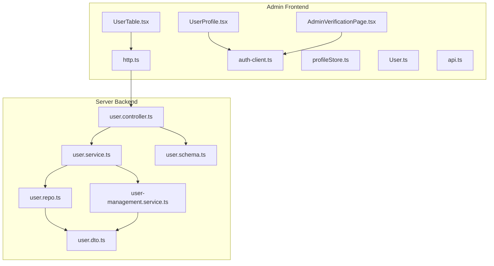
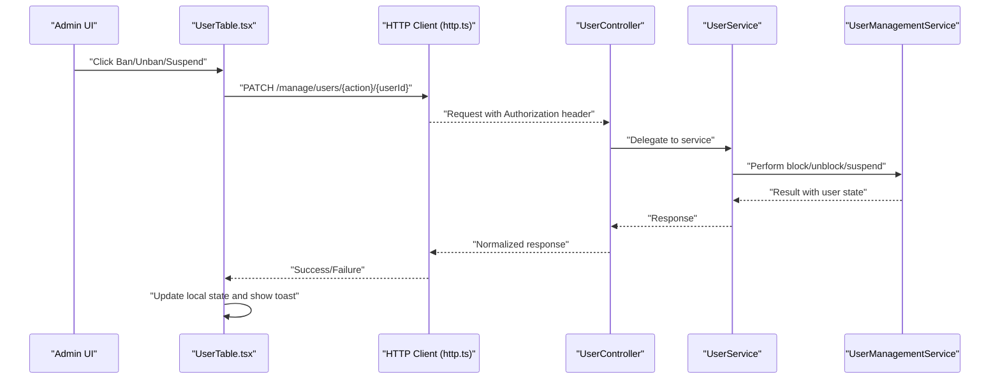
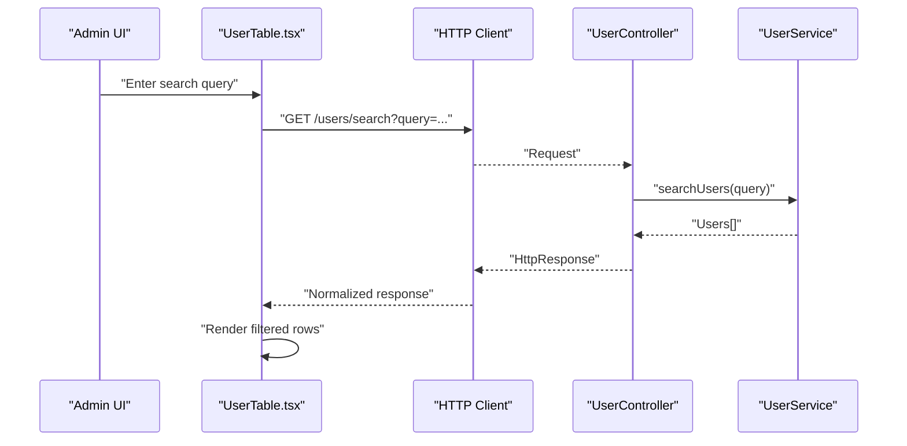
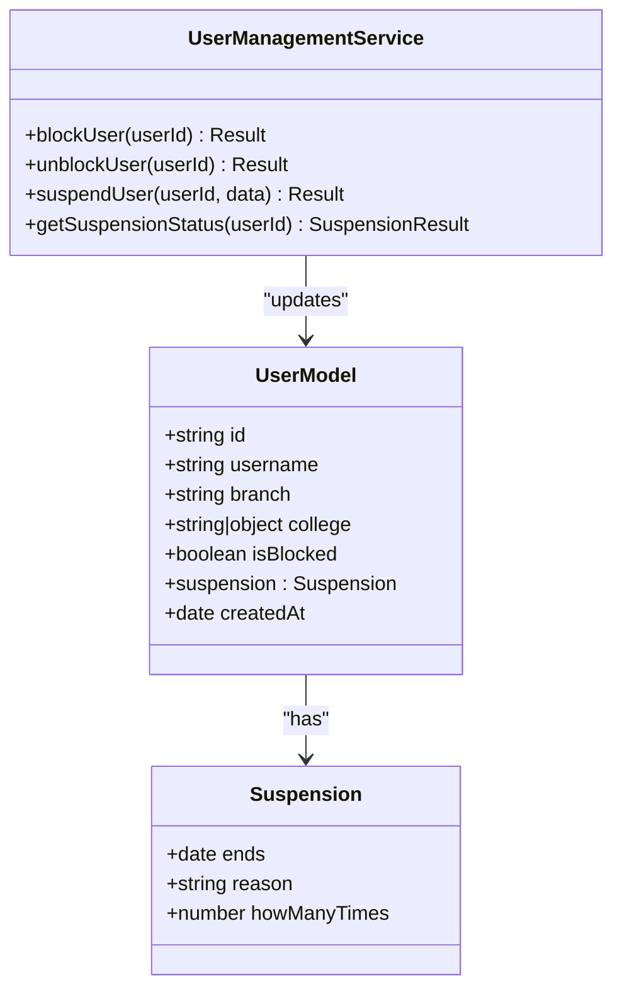
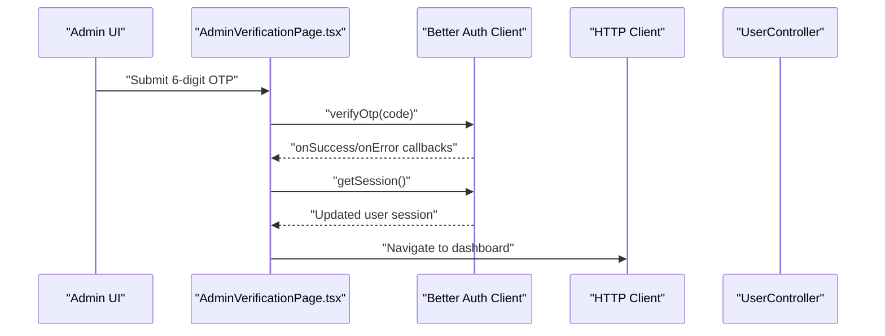
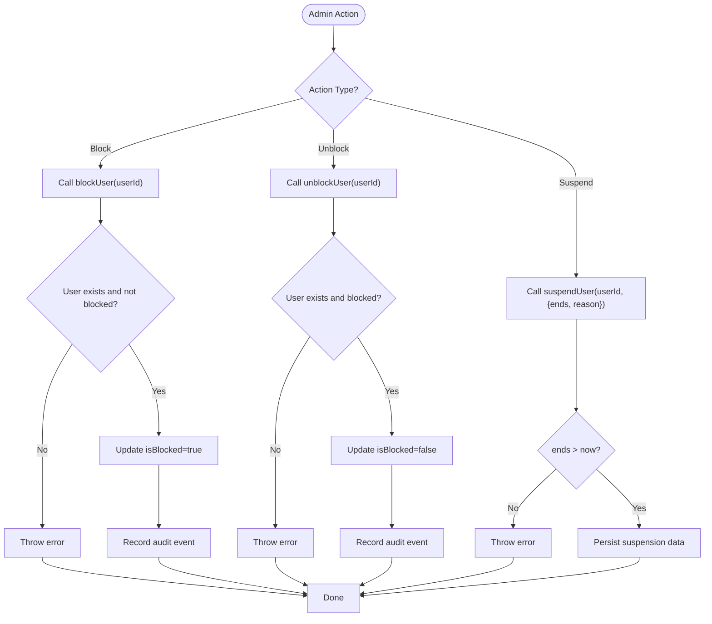
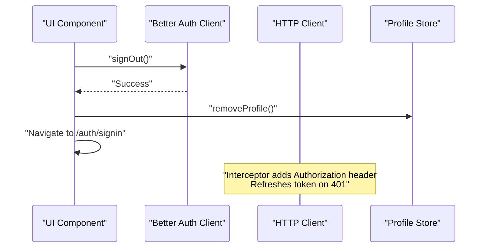
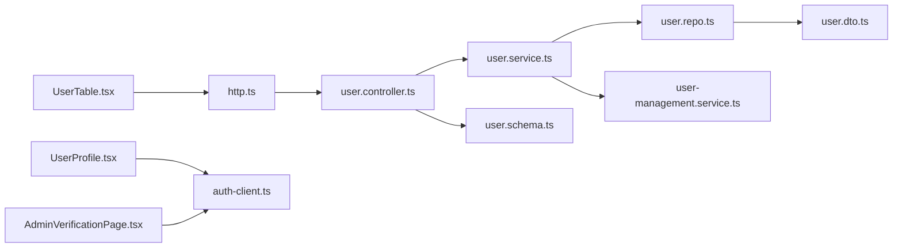

# User Management

<cite>
**Referenced Files in This Document**
- [UserTable.tsx](file://admin/src/components/general/UserTable.tsx)
- [UserProfile.tsx](file://admin/src/components/general/UserProfile.tsx)
- [AdminVerificationPage.tsx](file://admin/src/pages/AdminVerificationPage.tsx)
- [http.ts](file://admin/src/services/http.ts)
- [auth-client.ts](file://admin/src/lib/auth-client.ts)
- [profileStore.ts](file://admin/src/store/profileStore.ts)
- [User.ts](file://admin/src/types/User.ts)
- [api.ts](file://admin/src/types/api.ts)
- [user.controller.ts](file://server/src/modules/user/user.controller.ts)
- [user.service.ts](file://server/src/modules/user/user.service.ts)
- [user.repo.ts](file://server/src/modules/user/user.repo.ts)
- [user.schema.ts](file://server/src/modules/user/user.schema.ts)
- [user.dto.ts](file://server/src/modules/user/user.dto.ts)
- [user-management.service.ts](file://server/src/modules/content-report/user-management.service.ts)
</cite>

## Table of Contents
1. [Introduction](#introduction)
2. [Project Structure](#project-structure)
3. [Core Components](#core-components)
4. [Architecture Overview](#architecture-overview)
5. [Detailed Component Analysis](#detailed-component-analysis)
6. [Dependency Analysis](#dependency-analysis)
7. [Performance Considerations](#performance-considerations)
8. [Troubleshooting Guide](#troubleshooting-guide)
9. [Conclusion](#conclusion)
10. [Appendices](#appendices)

## Introduction
This document describes the user management system in the admin dashboard. It covers the user listing interface with search, filtering, and sorting capabilities; user profile management including verification status, role assignment, and permission controls; user activity monitoring; verification workflows; suspension and banning mechanisms; account deactivation and data privacy controls; bulk user operations; authentication and session management; and user communication features such as notifications and support tickets.

## Project Structure
The admin dashboard implements user management via React components and Zustand stores, communicating with a backend service layer built with Better Auth and Express. The frontend integrates with a centralized HTTP client that handles authentication tokens and interceptors, while the backend exposes user management endpoints and services.

**Diagram sources**
- [UserTable.tsx](file://admin/src/components/general/UserTable.tsx#L23-L142)
- [UserProfile.tsx](file://admin/src/components/general/UserProfile.tsx#L8-L43)
- [AdminVerificationPage.tsx](file://admin/src/pages/AdminVerificationPage.tsx#L17-L171)
- [http.ts](file://admin/src/services/http.ts#L5-L133)
- [auth-client.ts](file://admin/src/lib/auth-client.ts#L1-L12)
- [profileStore.ts](file://admin/src/store/profileStore.ts#L12-L35)
- [User.ts](file://admin/src/types/User.ts#L3-L15)
- [api.ts](file://admin/src/types/api.ts#L3-L20)
- [user.controller.ts](file://server/src/modules/user/user.controller.ts#L7-L37)
- [user.service.ts](file://server/src/modules/user/user.service.ts#L7-L61)
- [user.repo.ts](file://server/src/modules/user/user.repo.ts#L6-L41)
- [user-management.service.ts](file://server/src/modules/content-report/user-management.service.ts#L5-L166)
- [user.schema.ts](file://server/src/modules/user/user.schema.ts#L36-L38)
- [user.dto.ts](file://server/src/modules/user/user.dto.ts#L3-L17)

**Section sources**
- [UserTable.tsx](file://admin/src/components/general/UserTable.tsx#L23-L142)
- [UserProfile.tsx](file://admin/src/components/general/UserProfile.tsx#L8-L43)
- [AdminVerificationPage.tsx](file://admin/src/pages/AdminVerificationPage.tsx#L17-L171)
- [http.ts](file://admin/src/services/http.ts#L5-L133)
- [auth-client.ts](file://admin/src/lib/auth-client.ts#L1-L12)
- [profileStore.ts](file://admin/src/store/profileStore.ts#L12-L35)
- [User.ts](file://admin/src/types/User.ts#L3-L15)
- [api.ts](file://admin/src/types/api.ts#L3-L20)
- [user.controller.ts](file://server/src/modules/user/user.controller.ts#L7-L37)
- [user.service.ts](file://server/src/modules/user/user.service.ts#L7-L61)
- [user.repo.ts](file://server/src/modules/user/user.repo.ts#L6-L41)
- [user-management.service.ts](file://server/src/modules/content-report/user-management.service.ts#L5-L166)
- [user.schema.ts](file://server/src/modules/user/user.schema.ts#L36-L38)
- [user.dto.ts](file://server/src/modules/user/user.dto.ts#L3-L17)

## Core Components
- User listing and actions: The user table component renders user rows, supports hover preview of college profile images, and provides actions to ban, unban, and suspend users. It updates local state after successful requests and displays feedback via toast notifications.
- User profile and session: The user profile component displays the current admin’s avatar and provides logout. It integrates with the Better Auth client and the profile store to manage session state.
- Verification flow: The admin verification page implements OTP-based two-factor verification for admin sessions, including resend limits, expiry countdown, and session refresh upon successful verification.
- HTTP client and auth: The HTTP client injects bearer tokens, refreshes tokens on 401 responses, and normalizes responses into a unified envelope. The Better Auth client configures admin and two-factor plugins.
- Backend user management: The user module provides profile retrieval and search endpoints. The content-report user-management service implements blocking, unblocking, suspension, and user queries with validation and audit logging.

**Section sources**
- [UserTable.tsx](file://admin/src/components/general/UserTable.tsx#L23-L142)
- [UserProfile.tsx](file://admin/src/components/general/UserProfile.tsx#L8-L43)
- [AdminVerificationPage.tsx](file://admin/src/pages/AdminVerificationPage.tsx#L17-L171)
- [http.ts](file://admin/src/services/http.ts#L5-L133)
- [auth-client.ts](file://admin/src/lib/auth-client.ts#L1-L12)
- [user.controller.ts](file://server/src/modules/user/user.controller.ts#L7-L37)
- [user-management.service.ts](file://server/src/modules/content-report/user-management.service.ts#L5-L166)

## Architecture Overview
The admin dashboard communicates with the backend through a typed HTTP client that manages authentication and response normalization. The backend exposes user management endpoints and services that enforce validation and maintain audit trails.

**Diagram sources**
- [UserTable.tsx](file://admin/src/components/general/UserTable.tsx#L24-L63)
- [http.ts](file://admin/src/services/http.ts#L5-L133)
- [user.controller.ts](file://server/src/modules/user/user.controller.ts#L7-L37)
- [user-management.service.ts](file://server/src/modules/content-report/user-management.service.ts#L6-L107)

## Detailed Component Analysis

### User Listing Interface (Search, Filtering, Sorting)
- Search: The user module exposes a search endpoint that accepts a query parameter and returns a limited set of users. The frontend can integrate this endpoint to power a search bar and filter results.
- Filtering and Sorting: The user table currently renders basic fields and does not implement client-side sorting or advanced filtering. To add sorting, extend the column definitions to include sort handlers and re-fetch data with query parameters. For filtering, introduce filter inputs and pass filters to the backend endpoint.
- Actions: The table provides contextual actions (ban, unban, suspend) that call backend endpoints and update local state.

**Diagram sources**
- [user.controller.ts](file://server/src/modules/user/user.controller.ts#L17-L23)
- [user.service.ts](file://server/src/modules/user/user.service.ts#L27-L39)
- [UserTable.tsx](file://admin/src/components/general/UserTable.tsx#L65-L111)

**Section sources**
- [user.controller.ts](file://server/src/modules/user/user.controller.ts#L17-L23)
- [user.service.ts](file://server/src/modules/user/user.service.ts#L27-L39)
- [UserTable.tsx](file://admin/src/components/general/UserTable.tsx#L65-L111)

### User Profile Management (Verification Status, Roles, Permissions)
- Verification status: The user model includes a blocked flag and a suspension object with end date, reason, and occurrence count. The backend provides blocking, unblocking, and suspension operations with validation.
- Role assignment and permissions: The user DTO exposes roles for internal use. The admin UI can extend the profile view to display and modify roles and permissions via backend endpoints.
- Audit trail: Blocking and unblocking operations are recorded via audit logging.

**Diagram sources**
- [User.ts](file://admin/src/types/User.ts#L3-L15)
- [user-management.service.ts](file://server/src/modules/content-report/user-management.service.ts#L6-L107)

**Section sources**
- [User.ts](file://admin/src/types/User.ts#L3-L15)
- [user-management.service.ts](file://server/src/modules/content-report/user-management.service.ts#L6-L107)
- [user.dto.ts](file://server/src/modules/user/user.dto.ts#L3-L17)

### User Activity Monitoring (Login History, Content Activity, Analytics)
- Login history: The Better Auth client and server-side authentication provide session and token management. Login events can be captured via audit logs and session records.
- Content activity: The content-report module and related services track reported posts and moderation actions. User activity can be correlated with content creation and voting.
- Behavioral analytics: The backend can aggregate metrics from audit logs and content reports to inform analytics dashboards.

[No sources needed since this section synthesizes integration points without analyzing specific files]

### User Verification Workflows (Email, College, Admin Approval)
- Email verification: The admin verification page implements OTP-based two-factor verification. It sends OTPs, validates input, and refreshes session state upon success.
- College verification: The admin UI can integrate with the college module to approve or verify institutional affiliations. The college table component provides a foundation for managing institution profiles.
- Admin approval: Role-based access controls can restrict who can approve users or modify verification statuses. The Better Auth client supports admin plugins for enhanced permissions.

**Diagram sources**
- [AdminVerificationPage.tsx](file://admin/src/pages/AdminVerificationPage.tsx#L69-L102)
- [auth-client.ts](file://admin/src/lib/auth-client.ts#L1-L12)

**Section sources**
- [AdminVerificationPage.tsx](file://admin/src/pages/AdminVerificationPage.tsx#L17-L171)
- [auth-client.ts](file://admin/src/lib/auth-client.ts#L1-L12)

### Suspension and Banning Mechanisms, Deactivation, Privacy Controls
- Suspension: The backend enforces that suspension end dates are in the future and persists suspension metadata. The frontend updates the local table to reflect suspension status.
- Banning: The backend prevents duplicate blocking and returns a normalized response with updated user state.
- Deactivation: The user DTO exposes timestamps suitable for deactivation logic. The backend can mark accounts inactive and prevent login accordingly.
- Privacy: The user DTO excludes sensitive fields in public contexts, and the user search endpoint omits emails to protect privacy.

**Diagram sources**
- [user-management.service.ts](file://server/src/modules/content-report/user-management.service.ts#L6-L107)

**Section sources**
- [user-management.service.ts](file://server/src/modules/content-report/user-management.service.ts#L6-L107)
- [user.dto.ts](file://server/src/modules/user/user.dto.ts#L3-L17)

### Bulk User Operations, Mass Verification, Administrative Actions
- Bulk operations: Extend the user table to support multi-select and batch actions (e.g., mass suspend, block, unblock). The backend should expose batch endpoints with validation and transactional updates.
- Mass verification: Integrate with the college verification module to approve multiple users by institution. Use pagination and filtering to manage large sets.
- Administrative actions: Centralize admin actions in the content-report user-management service and expose them via dedicated endpoints.

[No sources needed since this section proposes extensions without analyzing specific files]

### Authentication Integration, Session Management, Consent Handling
- Authentication: The Better Auth client is configured with admin and two-factor plugins. The HTTP client injects bearer tokens and refreshes them on 401 responses.
- Session management: The profile store maintains admin session state. Logout clears the profile and redirects to sign-in.
- Consent handling: Terms acceptance is supported by the user module. The admin UI can present consent prompts aligned with platform policies.

**Diagram sources**
- [UserProfile.tsx](file://admin/src/components/general/UserProfile.tsx#L12-L16)
- [profileStore.ts](file://admin/src/store/profileStore.ts#L23-L29)
- [http.ts](file://admin/src/services/http.ts#L56-L109)
- [auth-client.ts](file://admin/src/lib/auth-client.ts#L1-L12)

**Section sources**
- [UserProfile.tsx](file://admin/src/components/general/UserProfile.tsx#L8-L43)
- [profileStore.ts](file://admin/src/store/profileStore.ts#L12-L35)
- [http.ts](file://admin/src/services/http.ts#L5-L133)
- [auth-client.ts](file://admin/src/lib/auth-client.ts#L1-L12)

### User Communication Features (Messaging, Notifications, Support Tickets)
- Notifications: The web module includes notification components and sockets. The admin can monitor and manage notifications via the backend notification service.
- Messaging and support tickets: The backend notification module and content-report services can be extended to support ticket workflows and admin-to-user messaging.

[No sources needed since this section outlines integrations without analyzing specific files]

## Dependency Analysis
The admin UI depends on the HTTP client for transport and Better Auth for authentication. The backend orchestrates user management through controllers, services, repositories, and adapters, with DTOs ensuring consistent data shaping.

**Diagram sources**
- [UserTable.tsx](file://admin/src/components/general/UserTable.tsx#L23-L142)
- [UserProfile.tsx](file://admin/src/components/general/UserProfile.tsx#L8-L43)
- [AdminVerificationPage.tsx](file://admin/src/pages/AdminVerificationPage.tsx#L17-L171)
- [http.ts](file://admin/src/services/http.ts#L5-L133)
- [auth-client.ts](file://admin/src/lib/auth-client.ts#L1-L12)
- [user.controller.ts](file://server/src/modules/user/user.controller.ts#L7-L37)
- [user.service.ts](file://server/src/modules/user/user.service.ts#L7-L61)
- [user.repo.ts](file://server/src/modules/user/user.repo.ts#L6-L41)
- [user-management.service.ts](file://server/src/modules/content-report/user-management.service.ts#L5-L166)
- [user.schema.ts](file://server/src/modules/user/user.schema.ts#L36-L38)
- [user.dto.ts](file://server/src/modules/user/user.dto.ts#L3-L17)

**Section sources**
- [UserTable.tsx](file://admin/src/components/general/UserTable.tsx#L23-L142)
- [UserProfile.tsx](file://admin/src/components/general/UserProfile.tsx#L8-L43)
- [AdminVerificationPage.tsx](file://admin/src/pages/AdminVerificationPage.tsx#L17-L171)
- [http.ts](file://admin/src/services/http.ts#L5-L133)
- [auth-client.ts](file://admin/src/lib/auth-client.ts#L1-L12)
- [user.controller.ts](file://server/src/modules/user/user.controller.ts#L7-L37)
- [user.service.ts](file://server/src/modules/user/user.service.ts#L7-L61)
- [user.repo.ts](file://server/src/modules/user/user.repo.ts#L6-L41)
- [user-management.service.ts](file://server/src/modules/content-report/user-management.service.ts#L5-L166)
- [user.schema.ts](file://server/src/modules/user/user.schema.ts#L36-L38)
- [user.dto.ts](file://server/src/modules/user/user.dto.ts#L3-L17)

## Performance Considerations
- Caching: The user repository caches reads by ID, email, and username to reduce database load. Consider adding pagination and indexing for search endpoints.
- Token refresh: The HTTP interceptor queues concurrent requests during token refresh to avoid redundant refresh cycles.
- Audit logging: Keep audit events indexed by user and timestamp for efficient querying.

[No sources needed since this section provides general guidance]

## Troubleshooting Guide
- 401 Unauthorized: The HTTP client automatically retries with a refreshed token. If failures persist, check refresh endpoints and session validity.
- OTP verification failures: The admin verification page tracks attempts and invalid OTPs. Ensure OTP expiration and resend limits are respected.
- Blocking/Unblocking errors: Validate user existence and current state before invoking operations. Confirm audit logs for traceability.

**Section sources**
- [http.ts](file://admin/src/services/http.ts#L56-L109)
- [AdminVerificationPage.tsx](file://admin/src/pages/AdminVerificationPage.tsx#L69-L102)
- [user-management.service.ts](file://server/src/modules/content-report/user-management.service.ts#L6-L107)

## Conclusion
The admin dashboard’s user management system combines a reactive frontend with robust backend services. It supports essential operations like listing, verification, suspension, and banning, while integrating authentication, session management, and audit logging. Extending search, filtering, sorting, and bulk operations will further enhance administrative capabilities.

## Appendices
- API Envelope: Responses are normalized into a consistent envelope with success, message, errors, meta, and data fields for predictable handling across the UI.

**Section sources**
- [api.ts](file://admin/src/types/api.ts#L3-L20)