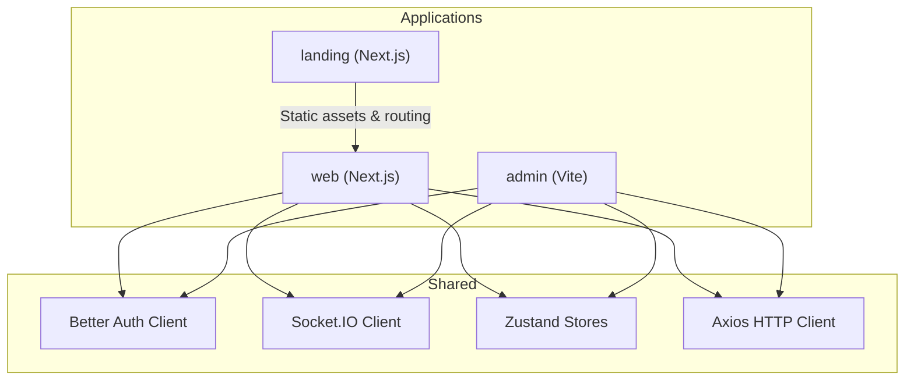
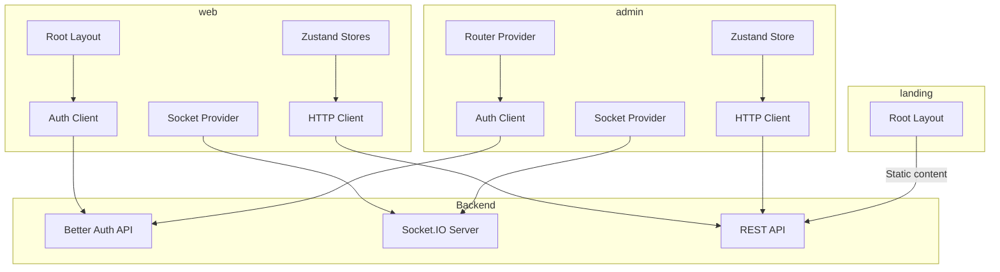
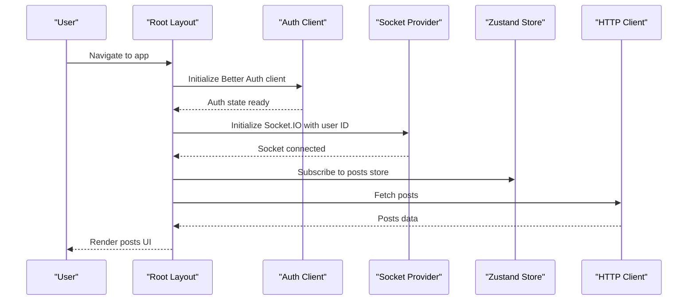
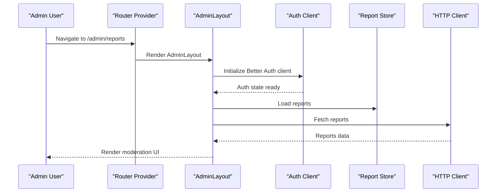
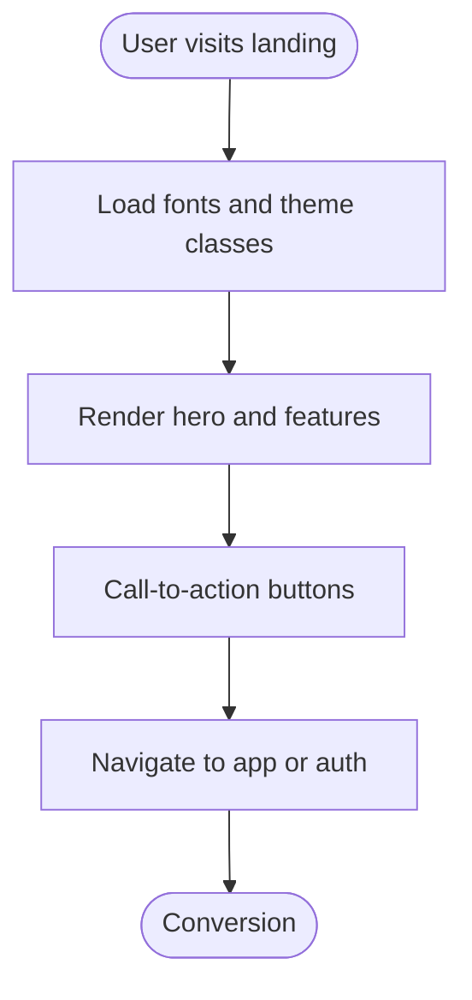
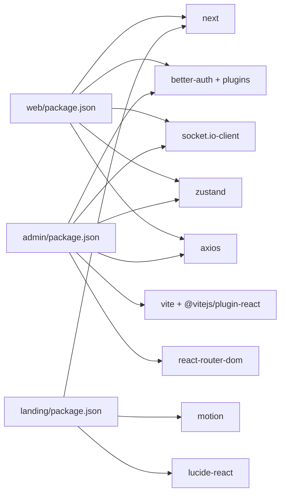

# Frontend Applications

<cite>
**Referenced Files in This Document**
- [web/package.json](file://web/package.json)
- [admin/package.json](file://admin/package.json)
- [landing/package.json](file://landing/package.json)
- [web/next.config.ts](file://web/next.config.ts)
- [admin/vite.config.ts](file://admin/vite.config.ts)
- [landing/next.config.ts](file://landing/next.config.ts)
- [web/src/app/layout.tsx](file://web/src/app/layout.tsx)
- [admin/src/main.tsx](file://admin/src/main.tsx)
- [landing/src/app/layout.tsx](file://landing/src/app/layout.tsx)
- [web/src/lib/auth-client.ts](file://web/src/lib/auth-client.ts)
- [admin/src/lib/auth-client.ts](file://admin/src/lib/auth-client.ts)
- [web/src/socket/SocketContext.tsx](file://web/src/socket/SocketContext.tsx)
- [web/src/socket/useSocket.ts](file://web/src/socket/useSocket.ts)
- [admin/src/socket/SocketContext.tsx](file://admin/src/socket/SocketContext.tsx)
- [web/src/store/postStore.ts](file://web/src/store/postStore.ts)
- [admin/src/store/ReportStore.ts](file://admin/src/store/ReportStore.ts)
- [web/src/services/api/post.ts](file://web/src/services/api/post.ts)
- [admin/src/services/http.ts](file://admin/src/services/http.ts)
</cite>

## Table of Contents
1. [Introduction](#introduction)
2. [Project Structure](#project-structure)
3. [Core Components](#core-components)
4. [Architecture Overview](#architecture-overview)
5. [Detailed Component Analysis](#detailed-component-analysis)
6. [Dependency Analysis](#dependency-analysis)
7. [Performance Considerations](#performance-considerations)
8. [Troubleshooting Guide](#troubleshooting-guide)
9. [Conclusion](#conclusion)
10. [Appendices](#appendices)

## Introduction
This document provides comprehensive documentation for the Flick platform’s three frontend applications:
- Next.js web application: A social platform for anonymous campus discussions with authentication, real-time notifications, and content features.
- React admin dashboard: A content moderation and user management interface for administrators.
- Marketing landing page: A Next.js-powered landing page for onboarding and feature showcase.

It covers component architecture, state management, routing strategies, real-time communication, UI/UX design principles, responsive design, accessibility, backend integration, performance optimization, SEO, and cross-browser compatibility.

## Project Structure
The frontend workspace is organized as a monorepo with three distinct applications:
- web: Next.js application implementing social features, authentication, and real-time updates.
- admin: Vite-based React admin dashboard for moderation and analytics.
- landing: Next.js marketing site for onboarding and feature presentation.

Build and runtime configurations differ per application:
- web uses Next.js with React Compiler enabled.
- admin uses Vite with React plugin and path aliasing.
- landing uses Next.js with minimal configuration.

**Diagram sources**
- [web/next.config.ts](file://web/next.config.ts#L1-L9)
- [admin/vite.config.ts](file://admin/vite.config.ts#L1-L16)
- [landing/next.config.ts](file://landing/next.config.ts#L1-L8)
- [web/src/lib/auth-client.ts](file://web/src/lib/auth-client.ts#L1-L11)
- [admin/src/lib/auth-client.ts](file://admin/src/lib/auth-client.ts#L1-L12)
- [web/src/socket/SocketContext.tsx](file://web/src/socket/SocketContext.tsx#L1-L47)
- [admin/src/socket/SocketContext.tsx](file://admin/src/socket/SocketContext.tsx#L1-L26)
- [web/src/store/postStore.ts](file://web/src/store/postStore.ts#L1-L29)
- [admin/src/store/ReportStore.ts](file://admin/src/store/ReportStore.ts#L1-L43)
- [web/src/services/api/post.ts](file://web/src/services/api/post.ts#L1-L49)
- [admin/src/services/http.ts](file://admin/src/services/http.ts#L1-L133)

**Section sources**
- [web/package.json](file://web/package.json#L1-L59)
- [admin/package.json](file://admin/package.json#L1-L76)
- [landing/package.json](file://landing/package.json#L1-L36)
- [web/next.config.ts](file://web/next.config.ts#L1-L9)
- [admin/vite.config.ts](file://admin/vite.config.ts#L1-L16)
- [landing/next.config.ts](file://landing/next.config.ts#L1-L8)

## Core Components
This section outlines the foundational building blocks across the three applications.

- Authentication clients:
  - web: Better Auth client configured with admin and inferred fields plugins, pointing to the server’s auth base URL.
  - admin: Better Auth client with admin, two-factor, and inferred fields plugins, using Vite environment variables.

- Real-time communication:
  - web: Socket.IO provider initialized with WebSocket transport and user authentication via profile ID.
  - admin: Socket.IO provider initialized with WebSocket transport and global connection.

- State management:
  - web: Zustand stores for posts and profiles.
  - admin: Zustand store for moderation reports.

- HTTP client:
  - admin: Axios client with credentials, request interceptor injecting Authorization header, and a robust response interceptor handling 401 refresh flows and envelope normalization.

- Routing:
  - web: Next.js app directory with root layout and nested routes.
  - admin: React Router v6 with nested routes under AdminLayout and AuthLayout.
  - landing: Next.js app directory with root layout and static pages.

**Section sources**
- [web/src/lib/auth-client.ts](file://web/src/lib/auth-client.ts#L1-L11)
- [admin/src/lib/auth-client.ts](file://admin/src/lib/auth-client.ts#L1-L12)
- [web/src/socket/SocketContext.tsx](file://web/src/socket/SocketContext.tsx#L1-L47)
- [admin/src/socket/SocketContext.tsx](file://admin/src/socket/SocketContext.tsx#L1-L26)
- [web/src/store/postStore.ts](file://web/src/store/postStore.ts#L1-L29)
- [admin/src/store/ReportStore.ts](file://admin/src/store/ReportStore.ts#L1-L43)
- [admin/src/services/http.ts](file://admin/src/services/http.ts#L1-L133)
- [web/src/app/layout.tsx](file://web/src/app/layout.tsx#L1-L35)
- [admin/src/main.tsx](file://admin/src/main.tsx#L1-L90)
- [landing/src/app/layout.tsx](file://landing/src/app/layout.tsx#L1-L26)

## Architecture Overview
The frontend applications integrate with a centralized backend through:
- Authentication: Better Auth handles sign-in, sessions, and admin/two-factor plugins.
- Real-time: Socket.IO provides live updates for notifications and moderation events.
- Data fetching: Axios-based HTTP client with automatic token injection and refresh logic.
- State: Local client-side stores for reactive UI updates.

**Diagram sources**
- [web/src/lib/auth-client.ts](file://web/src/lib/auth-client.ts#L1-L11)
- [admin/src/lib/auth-client.ts](file://admin/src/lib/auth-client.ts#L1-L12)
- [web/src/socket/SocketContext.tsx](file://web/src/socket/SocketContext.tsx#L1-L47)
- [admin/src/socket/SocketContext.tsx](file://admin/src/socket/SocketContext.tsx#L1-L26)
- [web/src/services/api/post.ts](file://web/src/services/api/post.ts#L1-L49)
- [admin/src/services/http.ts](file://admin/src/services/http.ts#L1-L133)
- [web/src/app/layout.tsx](file://web/src/app/layout.tsx#L1-L35)
- [admin/src/main.tsx](file://admin/src/main.tsx#L1-L90)
- [landing/src/app/layout.tsx](file://landing/src/app/layout.tsx#L1-L26)

## Detailed Component Analysis

### Next.js Web Application
Key characteristics:
- Framework: Next.js with React Compiler enabled.
- Layout: Root layout defines fonts and theme container.
- Authentication: Better Auth client integrated with admin and inferred fields plugins.
- Real-time: Socket.IO provider with WebSocket transport and user-based authentication.
- State: Zustand store for posts with CRUD-like operations.
- HTTP: Axios client with request/response interceptors and envelope normalization.

**Diagram sources**
- [web/src/app/layout.tsx](file://web/src/app/layout.tsx#L1-L35)
- [web/src/lib/auth-client.ts](file://web/src/lib/auth-client.ts#L1-L11)
- [web/src/socket/SocketContext.tsx](file://web/src/socket/SocketContext.tsx#L1-L47)
- [web/src/store/postStore.ts](file://web/src/store/postStore.ts#L1-L29)
- [web/src/services/api/post.ts](file://web/src/services/api/post.ts#L1-L49)

Routing and navigation:
- Next.js app directory structure supports dynamic routes and nested layouts.
- Root layout wraps all pages with font loading and theme attributes.

Real-time notifications:
- Socket provider initializes a WebSocket connection when a user profile is present.
- Transport configured to use WebSocket only.

State management:
- Post store exposes setters and updaters for reactive UI updates.

HTTP integration:
- Axios client injects Authorization header automatically.
- Response interceptor normalizes backend envelopes and handles 401 refresh flows.

**Section sources**
- [web/next.config.ts](file://web/next.config.ts#L1-L9)
- [web/src/app/layout.tsx](file://web/src/app/layout.tsx#L1-L35)
- [web/src/lib/auth-client.ts](file://web/src/lib/auth-client.ts#L1-L11)
- [web/src/socket/SocketContext.tsx](file://web/src/socket/SocketContext.tsx#L1-L47)
- [web/src/socket/useSocket.ts](file://web/src/socket/useSocket.ts#L1-L9)
- [web/src/store/postStore.ts](file://web/src/store/postStore.ts#L1-L29)
- [web/src/services/api/post.ts](file://web/src/services/api/post.ts#L1-L49)

### React Admin Dashboard
Key characteristics:
- Framework: Vite with React plugin and path aliasing.
- Routing: React Router v6 with nested routes under AdminLayout and AuthLayout.
- Authentication: Better Auth client with admin, two-factor, and inferred fields plugins.
- Real-time: Socket.IO provider with WebSocket transport.
- State: Zustand store for moderation reports with status updates.
- HTTP: Axios client with credentials and robust 401 refresh handling.

**Diagram sources**
- [admin/src/main.tsx](file://admin/src/main.tsx#L1-L90)
- [admin/src/lib/auth-client.ts](file://admin/src/lib/auth-client.ts#L1-L12)
- [admin/src/socket/SocketContext.tsx](file://admin/src/socket/SocketContext.tsx#L1-L26)
- [admin/src/store/ReportStore.ts](file://admin/src/store/ReportStore.ts#L1-L43)
- [admin/src/services/http.ts](file://admin/src/services/http.ts#L1-L133)

Routing strategy:
- Nested routes under AdminLayout for dashboards, users, posts, colleges, logs, reports, feedbacks, and settings.
- AuthLayout manages sign-in and verification flows.

Real-time communication:
- Socket provider establishes a persistent WebSocket connection for admin events.

State management:
- Report store encapsulates report data and status transitions.

HTTP integration:
- Axios client enforces Authorization header and handles token refresh on 401 responses.

**Section sources**
- [admin/vite.config.ts](file://admin/vite.config.ts#L1-L16)
- [admin/src/main.tsx](file://admin/src/main.tsx#L1-L90)
- [admin/src/lib/auth-client.ts](file://admin/src/lib/auth-client.ts#L1-L12)
- [admin/src/socket/SocketContext.tsx](file://admin/src/socket/SocketContext.tsx#L1-L26)
- [admin/src/store/ReportStore.ts](file://admin/src/store/ReportStore.ts#L1-L43)
- [admin/src/services/http.ts](file://admin/src/services/http.ts#L1-L133)

### Marketing Landing Page
Key characteristics:
- Framework: Next.js with minimal configuration.
- Layout: Root layout defines metadata and theme classes.
- Assets: Fonts and static assets for animations and visuals.

**Diagram sources**
- [landing/src/app/layout.tsx](file://landing/src/app/layout.tsx#L1-L26)
- [landing/next.config.ts](file://landing/next.config.ts#L1-L8)

**Section sources**
- [landing/package.json](file://landing/package.json#L1-L36)
- [landing/src/app/layout.tsx](file://landing/src/app/layout.tsx#L1-L26)
- [landing/next.config.ts](file://landing/next.config.ts#L1-L8)

## Dependency Analysis
Application-level dependencies and their roles:
- web:
  - Next.js, React, better-auth, socket.io-client, zustand, axios.
- admin:
  - Vite, React, React Router, better-auth, socket.io-client, zustand, axios, recharts, lucide-react.
- landing:
  - Next.js, React, motion, lucide-react.

**Diagram sources**
- [web/package.json](file://web/package.json#L1-L59)
- [admin/package.json](file://admin/package.json#L1-L76)
- [landing/package.json](file://landing/package.json#L1-L36)

**Section sources**
- [web/package.json](file://web/package.json#L1-L59)
- [admin/package.json](file://admin/package.json#L1-L76)
- [landing/package.json](file://landing/package.json#L1-L36)

## Performance Considerations
- Build optimization:
  - web enables React Compiler for improved rendering performance.
  - admin uses Vite for fast development and optimized production builds.
  - landing leverages Next.js optimizations for static generation and ISR where applicable.

- Network efficiency:
  - Axios interceptors handle token injection and automatic refresh to reduce redundant requests.
  - Socket.IO WebSocket transport minimizes latency for real-time features.

- State management:
  - Zustand stores avoid unnecessary re-renders by updating only affected slices.

- Asset delivery:
  - Font loading via Next.js fonts and Tailwind-based CSS minimize render-blocking resources.

[No sources needed since this section provides general guidance]

## Troubleshooting Guide
Common issues and resolutions:
- Authentication failures:
  - Verify base URLs for Better Auth clients in both web and admin.
  - Ensure environment variables are correctly set for server URI and base URL.

- Real-time connectivity:
  - Confirm WebSocket transport availability and server-side Socket.IO configuration.
  - Check that user profile ID is present before initializing the socket provider.

- HTTP 401 errors:
  - Review the Axios interceptor logic for token refresh and queue handling.
  - Ensure refresh endpoints are reachable and returning valid access tokens.

- Routing issues:
  - Validate route definitions and layout nesting in admin.
  - Confirm Next.js app directory structure and dynamic route patterns in web.

**Section sources**
- [web/src/lib/auth-client.ts](file://web/src/lib/auth-client.ts#L1-L11)
- [admin/src/lib/auth-client.ts](file://admin/src/lib/auth-client.ts#L1-L12)
- [web/src/socket/SocketContext.tsx](file://web/src/socket/SocketContext.tsx#L1-L47)
- [admin/src/socket/SocketContext.tsx](file://admin/src/socket/SocketContext.tsx#L1-L26)
- [admin/src/services/http.ts](file://admin/src/services/http.ts#L1-L133)
- [admin/src/main.tsx](file://admin/src/main.tsx#L1-L90)
- [web/src/app/layout.tsx](file://web/src/app/layout.tsx#L1-L35)

## Conclusion
The Flick platform’s frontend applications are structured around modern frameworks and libraries to deliver a responsive, accessible, and performant experience. The web application focuses on social interactions and real-time engagement, the admin dashboard streamlines moderation and analytics, and the landing page drives onboarding and awareness. Robust authentication, real-time communication, and efficient state management form the backbone of the user-facing experiences.

[No sources needed since this section summarizes without analyzing specific files]

## Appendices
- Accessibility:
  - Use semantic HTML and ARIA attributes where appropriate.
  - Ensure keyboard navigation support and focus management.
  - Provide sufficient color contrast and alternative text for images.

- Responsive design:
  - Utilize Tailwind utilities and Next.js image optimization.
  - Test across mobile, tablet, and desktop breakpoints.

- Cross-browser compatibility:
  - Polyfill modern JavaScript features when necessary.
  - Validate CSS Grid/Flexbox and ESNext features in target browsers.

- SEO:
  - Configure metadata and Open Graph tags in root layouts.
  - Use dynamic metadata for social previews and canonical URLs.

[No sources needed since this section provides general guidance]