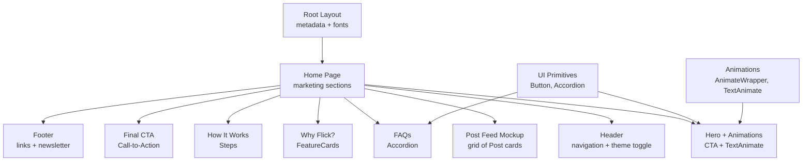
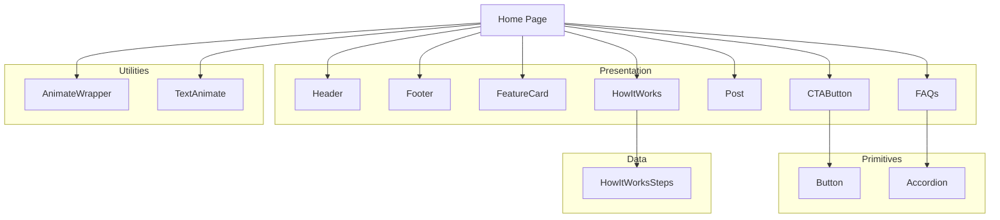
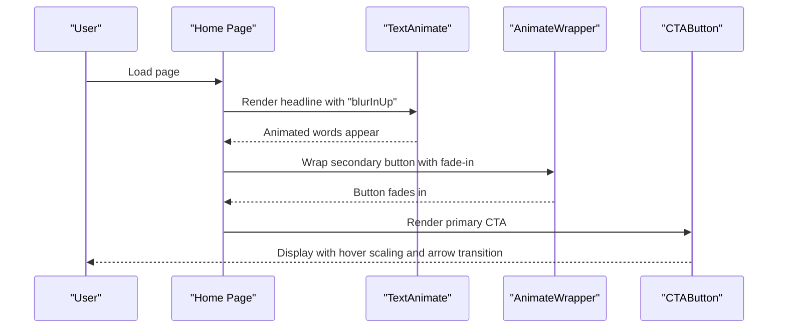
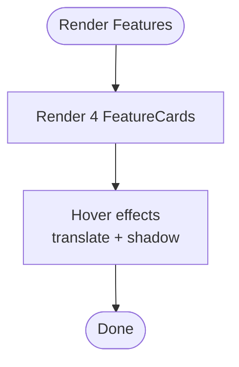
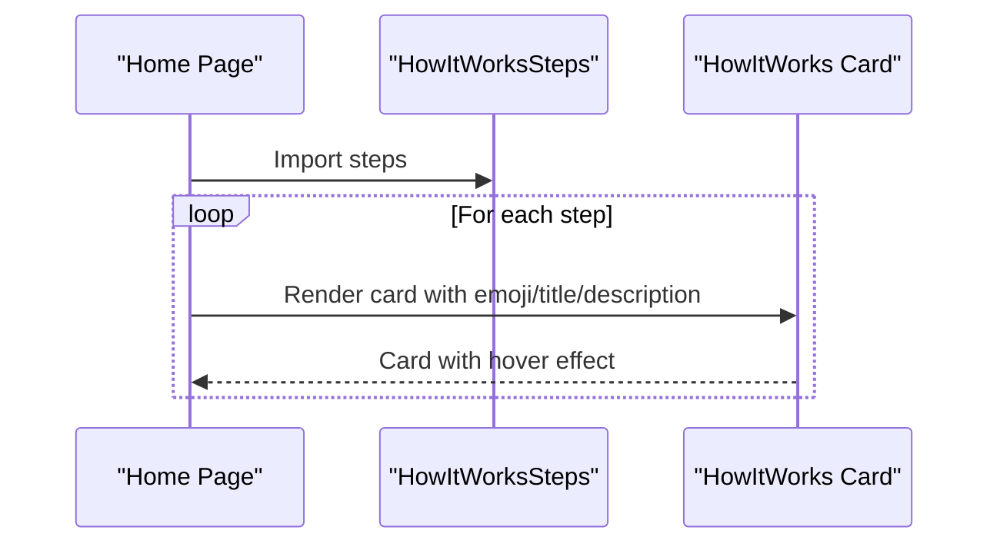
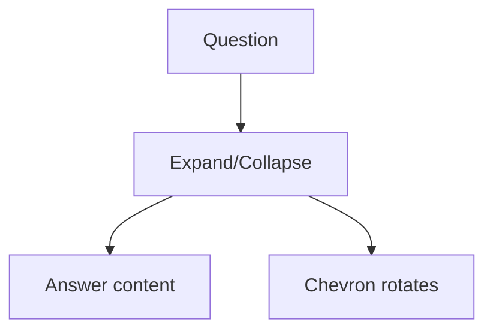
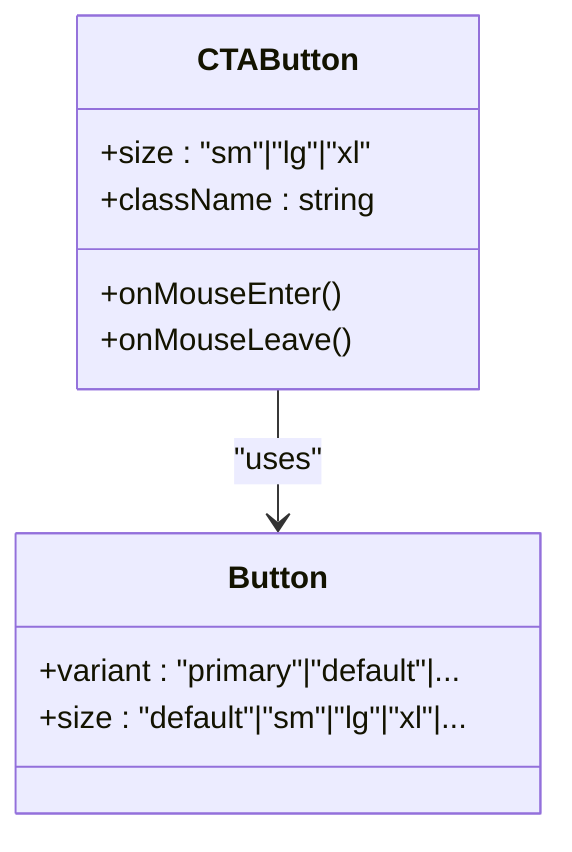
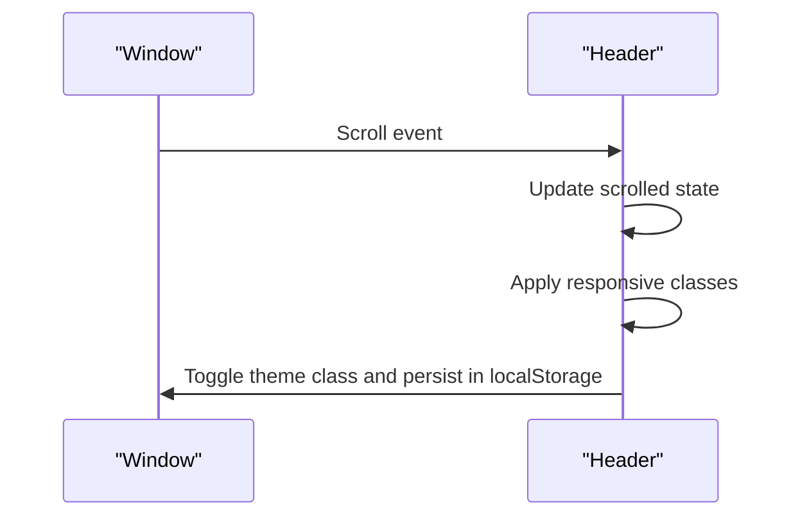
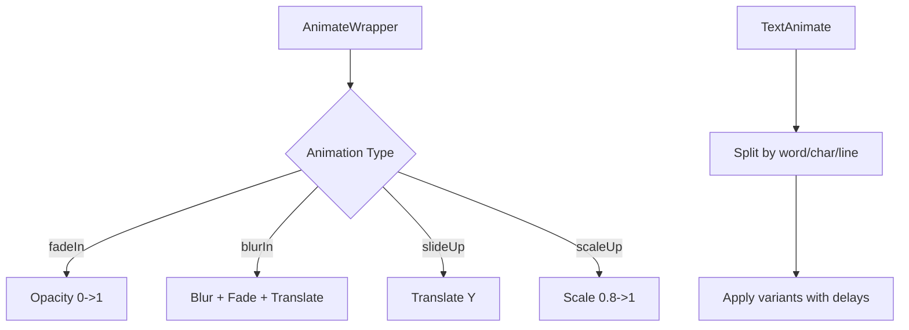
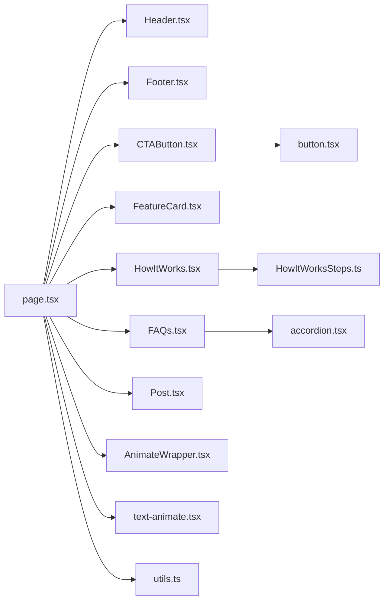

# Landing Page

<cite>
**Referenced Files in This Document**
- [page.tsx](file://landing/src/app/page.tsx)
- [layout.tsx](file://landing/src/app/layout.tsx)
- [Header.tsx](file://landing/src/components/landing/Header.tsx)
- [Footer.tsx](file://landing/src/components/landing/Footer.tsx)
- [CTAButton.tsx](file://landing/src/components/landing/CTAButton.tsx)
- [FeatureCard.tsx](file://landing/src/components/landing/FeatureCard.tsx)
- [FAQs.tsx](file://landing/src/components/landing/FAQs.tsx)
- [HowItWorks.tsx](file://landing/src/components/landing/HowItWorks.tsx)
- [HowItWorksSteps.ts](file://landing/src/data/HowItWorksSteps.ts)
- [Post.tsx](file://landing/src/components/landing/Post.tsx)
- [AnimateWrapper.tsx](file://landing/src/components/animations/AnimateWrapper.tsx)
- [text-animate.tsx](file://landing/src/components/magicui/text-animate.tsx)
- [button.tsx](file://landing/src/components/ui/button.tsx)
- [accordion.tsx](file://landing/src/components/ui/accordion.tsx)
- [utils.ts](file://landing/src/lib/utils.ts)
</cite>

## Table of Contents
1. [Introduction](#introduction)
2. [Project Structure](#project-structure)
3. [Core Components](#core-components)
4. [Architecture Overview](#architecture-overview)
5. [Detailed Component Analysis](#detailed-component-analysis)
6. [Dependency Analysis](#dependency-analysis)
7. [Performance Considerations](#performance-considerations)
8. [Troubleshooting Guide](#troubleshooting-guide)
9. [Conclusion](#conclusion)
10. [Appendices](#appendices)

## Introduction
This document describes the marketing landing page for Flick, a Next.js application designed to onboard new users and showcase platform features. It focuses on the application structure optimized for performance and SEO, the marketing components (hero, features, testimonials, FAQs, call-to-action), responsive design with Tailwind CSS, animation and interactive elements, and conversion optimization strategies. It also covers meta tags, performance metrics, and integrations with email capture and social sharing.

## Project Structure
The landing application is organized around a single-page marketing experience with modular components for header, footer, CTAs, feature showcases, FAQs, and animations. The structure emphasizes:
- Minimal layout overhead with a root layout providing global metadata and fonts
- A single-page application rendering hero, feature cards, steps, testimonials, and a prominent CTA
- Reusable UI primitives and animation utilities for consistent UX and performance

**Diagram sources**
- [layout.tsx](file://landing/src/app/layout.tsx#L1-L26)
- [page.tsx](file://landing/src/app/page.tsx#L1-L237)
- [Header.tsx](file://landing/src/components/landing/Header.tsx#L1-L50)
- [Footer.tsx](file://landing/src/components/landing/Footer.tsx#L1-L127)
- [CTAButton.tsx](file://landing/src/components/landing/CTAButton.tsx#L1-L23)
- [FeatureCard.tsx](file://landing/src/components/landing/FeatureCard.tsx#L1-L33)
- [FAQs.tsx](file://landing/src/components/landing/FAQs.tsx#L1-L48)
- [HowItWorks.tsx](file://landing/src/components/landing/HowItWorks.tsx#L1-L25)
- [Post.tsx](file://landing/src/components/landing/Post.tsx#L1-L29)
- [AnimateWrapper.tsx](file://landing/src/components/animations/AnimateWrapper.tsx#L1-L108)
- [text-animate.tsx](file://landing/src/components/magicui/text-animate.tsx#L1-L408)
- [button.tsx](file://landing/src/components/ui/button.tsx#L1-L63)
- [accordion.tsx](file://landing/src/components/ui/accordion.tsx#L1-L67)

**Section sources**
- [layout.tsx](file://landing/src/app/layout.tsx#L1-L26)
- [page.tsx](file://landing/src/app/page.tsx#L1-L237)

## Core Components
- Root layout defines metadata and global fonts for SEO and typography consistency.
- Home page composes marketing sections: hero with animated headline and CTA, post feed mockup, feature highlights, “How it works” steps, FAQs, and a final CTA.
- Header provides responsive navigation and a sticky theme toggle with scroll-aware styling.
- Footer consolidates links, legal, contact, and a newsletter subscription form.
- UI primitives (Button, Accordion) are reused across components for consistent behavior and styling.
- Animation utilities (AnimateWrapper, TextAnimate) enable performant, scroll-triggered entrance effects.

**Section sources**
- [layout.tsx](file://landing/src/app/layout.tsx#L5-L8)
- [page.tsx](file://landing/src/app/page.tsx#L139-L237)
- [Header.tsx](file://landing/src/components/landing/Header.tsx#L13-L47)
- [Footer.tsx](file://landing/src/components/landing/Footer.tsx#L8-L124)
- [button.tsx](file://landing/src/components/ui/button.tsx#L7-L39)
- [accordion.tsx](file://landing/src/components/ui/accordion.tsx#L9-L66)
- [AnimateWrapper.tsx](file://landing/src/components/animations/AnimateWrapper.tsx#L77-L107)
- [text-animate.tsx](file://landing/src/components/magicui/text-animate.tsx#L300-L407)

## Architecture Overview
The landing page follows a component-driven architecture with clear separation of concerns:
- Presentation components encapsulate visuals and interactions (Header, Footer, FeatureCard, HowItWorks, Post, FAQs).
- Utility components provide reusable animations and typography effects (AnimateWrapper, TextAnimate).
- UI primitives standardize buttons and accordions across the page.
- Data-driven components (e.g., HowItWorksSteps) decouple content from presentation.

**Diagram sources**
- [page.tsx](file://landing/src/app/page.tsx#L1-L237)
- [Header.tsx](file://landing/src/components/landing/Header.tsx#L1-L50)
- [Footer.tsx](file://landing/src/components/landing/Footer.tsx#L1-L127)
- [FeatureCard.tsx](file://landing/src/components/landing/FeatureCard.tsx#L1-L33)
- [HowItWorks.tsx](file://landing/src/components/landing/HowItWorks.tsx#L1-L25)
- [HowItWorksSteps.ts](file://landing/src/data/HowItWorksSteps.ts#L1-L22)
- [Post.tsx](file://landing/src/components/landing/Post.tsx#L1-L29)
- [FAQs.tsx](file://landing/src/components/landing/FAQs.tsx#L1-L48)
- [CTAButton.tsx](file://landing/src/components/landing/CTAButton.tsx#L1-L23)
- [AnimateWrapper.tsx](file://landing/src/components/animations/AnimateWrapper.tsx#L1-L108)
- [text-animate.tsx](file://landing/src/components/magicui/text-animate.tsx#L1-L408)
- [button.tsx](file://landing/src/components/ui/button.tsx#L1-L63)
- [accordion.tsx](file://landing/src/components/ui/accordion.tsx#L1-L67)

## Detailed Component Analysis

### Hero Section and Animations
- The hero area centers around animated headlines and a prominent CTA. TextAnimate provides staggered entrance effects for words and phrases, while AnimateWrapper adds layered fade-in and blur transitions.
- The hero includes a smaller secondary action and a large-scale headline with gradient text treatment for emphasis.
- Responsive sizing ensures readability across devices.

**Diagram sources**
- [page.tsx](file://landing/src/app/page.tsx#L139-L160)
- [text-animate.tsx](file://landing/src/components/magicui/text-animate.tsx#L300-L407)
- [AnimateWrapper.tsx](file://landing/src/components/animations/AnimateWrapper.tsx#L77-L107)
- [CTAButton.tsx](file://landing/src/components/landing/CTAButton.tsx#L7-L21)

**Section sources**
- [page.tsx](file://landing/src/app/page.tsx#L139-L160)
- [text-animate.tsx](file://landing/src/components/magicui/text-animate.tsx#L300-L407)
- [AnimateWrapper.tsx](file://landing/src/components/animations/AnimateWrapper.tsx#L77-L107)
- [CTAButton.tsx](file://landing/src/components/landing/CTAButton.tsx#L7-L21)

### Feature Cards and Testimonials
- Feature cards highlight platform benefits with icons and concise descriptions, styled with soft shadows and hover transitions.
- Testimonials are represented by a grid of Post components that simulate real-time campus discussions, with subtle gradients and spacing for readability.

**Diagram sources**
- [page.tsx](file://landing/src/app/page.tsx#L189-L199)
- [FeatureCard.tsx](file://landing/src/components/landing/FeatureCard.tsx#L9-L32)
- [Post.tsx](file://landing/src/components/landing/Post.tsx#L3-L28)

**Section sources**
- [page.tsx](file://landing/src/app/page.tsx#L189-L199)
- [FeatureCard.tsx](file://landing/src/components/landing/FeatureCard.tsx#L9-L32)
- [Post.tsx](file://landing/src/components/landing/Post.tsx#L3-L28)

### Step-by-Step Explanation
- The “How it works” section uses HowItWorks cards driven by a data array. Each card displays an emoji, title, and description with hover transforms for interactivity.
- The data module centralizes copy and styling for maintainability.

**Diagram sources**
- [page.tsx](file://landing/src/app/page.tsx#L204-L214)
- [HowItWorks.tsx](file://landing/src/components/landing/HowItWorks.tsx#L10-L21)
- [HowItWorksSteps.ts](file://landing/src/data/HowItWorksSteps.ts#L1-L22)

**Section sources**
- [page.tsx](file://landing/src/app/page.tsx#L204-L214)
- [HowItWorks.tsx](file://landing/src/components/landing/HowItWorks.tsx#L10-L21)
- [HowItWorksSteps.ts](file://landing/src/data/HowItWorksSteps.ts#L1-L22)

### FAQ Section
- The FAQs component wraps Radix UI accordion primitives to provide an accessible, scroll-friendly expansion list. Each item includes a trigger and content area with smooth animations.

**Diagram sources**
- [FAQs.tsx](file://landing/src/components/landing/FAQs.tsx#L8-L21)
- [accordion.tsx](file://landing/src/components/ui/accordion.tsx#L9-L66)

**Section sources**
- [FAQs.tsx](file://landing/src/components/landing/FAQs.tsx#L8-L21)
- [accordion.tsx](file://landing/src/components/ui/accordion.tsx#L9-L66)

### Call-to-Action Elements
- Primary CTA buttons use a reusable Button primitive with hover scaling and directional arrow transitions. They are prominently featured in the hero and at the bottom of the page to reinforce conversions.

**Diagram sources**
- [CTAButton.tsx](file://landing/src/components/landing/CTAButton.tsx#L7-L21)
- [button.tsx](file://landing/src/components/ui/button.tsx#L7-L39)

**Section sources**
- [CTAButton.tsx](file://landing/src/components/landing/CTAButton.tsx#L7-L21)
- [button.tsx](file://landing/src/components/ui/button.tsx#L7-L39)

### Header and Footer Navigation
- Header adapts its appearance on scroll, switching to a compact, blurred bar with a subtle shadow and a persistent CTA. Theme toggling persists user preference.
- Footer organizes links, legal, and contact information, plus a newsletter subscription form.

**Diagram sources**
- [Header.tsx](file://landing/src/components/landing/Header.tsx#L16-L28)

**Section sources**
- [Header.tsx](file://landing/src/components/landing/Header.tsx#L13-L47)
- [Footer.tsx](file://landing/src/components/landing/Footer.tsx#L8-L124)

### Social Proof and Conversion Optimization
- Social proof is implied through testimonials (Post cards) and feature badges (e.g., “Earn Roles & Tags”).
- Conversion-focused strategies include:
  - Prominent primary CTAs in hero and final section
  - Hover animations to draw attention
  - Minimal friction: single CTA per section, clear messaging
  - Newsletter capture in footer for lead generation

**Section sources**
- [page.tsx](file://landing/src/app/page.tsx#L189-L199)
- [Post.tsx](file://landing/src/components/landing/Post.tsx#L3-L28)
- [Footer.tsx](file://landing/src/components/landing/Footer.tsx#L104-L113)

### Animation Components and Interactive Elements
- AnimateWrapper supports multiple presets (fade, blur, slide, scale) with viewport-triggered animations and optional one-time execution.
- TextAnimate splits text into segments (text, word, character, line) and applies motion variants for staggered entrance effects.
- Interactive elements include hover scaling on buttons and subtle transforms on feature cards.

**Diagram sources**
- [AnimateWrapper.tsx](file://landing/src/components/animations/AnimateWrapper.tsx#L29-L75)
- [text-animate.tsx](file://landing/src/components/magicui/text-animate.tsx#L102-L298)

**Section sources**
- [AnimateWrapper.tsx](file://landing/src/components/animations/AnimateWrapper.tsx#L77-L107)
- [text-animate.tsx](file://landing/src/components/magicui/text-animate.tsx#L300-L407)

## Dependency Analysis
- The home page depends on marketing components and animation utilities. It imports data for “How it works” steps and renders mock posts for social proof.
- UI primitives are centralized in dedicated components, reducing duplication and ensuring consistent behavior.
- Utilities like cn consolidate Tailwind classes for efficient merging.

**Diagram sources**
- [page.tsx](file://landing/src/app/page.tsx#L1-L14)
- [Header.tsx](file://landing/src/components/landing/Header.tsx#L1-L50)
- [Footer.tsx](file://landing/src/components/landing/Footer.tsx#L1-L127)
- [CTAButton.tsx](file://landing/src/components/landing/CTAButton.tsx#L1-L23)
- [FeatureCard.tsx](file://landing/src/components/landing/FeatureCard.tsx#L1-L33)
- [HowItWorks.tsx](file://landing/src/components/landing/HowItWorks.tsx#L1-L25)
- [FAQs.tsx](file://landing/src/components/landing/FAQs.tsx#L1-L48)
- [Post.tsx](file://landing/src/components/landing/Post.tsx#L1-L29)
- [AnimateWrapper.tsx](file://landing/src/components/animations/AnimateWrapper.tsx#L1-L108)
- [text-animate.tsx](file://landing/src/components/magicui/text-animate.tsx#L1-L408)
- [HowItWorksSteps.ts](file://landing/src/data/HowItWorksSteps.ts#L1-L22)
- [accordion.tsx](file://landing/src/components/ui/accordion.tsx#L1-L67)
- [button.tsx](file://landing/src/components/ui/button.tsx#L1-L63)
- [utils.ts](file://landing/src/lib/utils.ts#L4-L6)

**Section sources**
- [page.tsx](file://landing/src/app/page.tsx#L1-L14)
- [utils.ts](file://landing/src/lib/utils.ts#L4-L6)

## Performance Considerations
- Lazy loading and viewport-triggered animations minimize initial layout shifts and improve perceived performance.
- Tailwind utilities and class merging reduce CSS payload and ensure consistent styles.
- Minimal layout overhead in the root layout reduces server-side rendering cost.
- SVG icons and lightweight components keep bundle sizes small.
- Recommendations:
  - Use image optimization for mockups and logos.
  - Consider code-splitting for heavy animations if needed.
  - Monitor Largest Contentful Paint (LCP) and First Input Delay (FID) in production.

[No sources needed since this section provides general guidance]

## Troubleshooting Guide
- If animations do not trigger:
  - Verify viewport options and ensure elements are within the visible area.
  - Confirm AnimatePresence and motion components are properly imported.
- If CTA hover effects are missing:
  - Check Button variant and hover classes are applied.
- If FAQ accordion does not expand/collapse:
  - Ensure Radix UI providers are initialized and CSS animations are loaded.
- If newsletter form does not submit:
  - Confirm form submission handler and input types are correct.

**Section sources**
- [AnimateWrapper.tsx](file://landing/src/components/animations/AnimateWrapper.tsx#L91-L100)
- [CTAButton.tsx](file://landing/src/components/landing/CTAButton.tsx#L10-L20)
- [accordion.tsx](file://landing/src/components/ui/accordion.tsx#L50-L63)
- [Footer.tsx](file://landing/src/components/landing/Footer.tsx#L104-L113)

## Conclusion
The landing page is structured for clarity, performance, and conversion. It leverages reusable components, scroll-triggered animations, and a clean layout to communicate value quickly. The modular design allows easy updates to content and styling while maintaining a consistent user experience across devices.

[No sources needed since this section summarizes without analyzing specific files]

## Appendices

### SEO and Meta Tags
- The root layout sets the page title and description for improved search visibility.
- Use canonical URLs and Open Graph/Twitter meta tags in the future to enhance social sharing.

**Section sources**
- [layout.tsx](file://landing/src/app/layout.tsx#L5-L8)

### Responsive Design Implementation
- Tailwind utilities drive responsive breakpoints for typography, spacing, and component layouts.
- Components adapt widths, padding, and alignment across mobile, tablet, and desktop screens.

**Section sources**
- [page.tsx](file://landing/src/app/page.tsx#L144-L160)
- [Header.tsx](file://landing/src/components/landing/Header.tsx#L30-L35)

### Integration Notes
- Email capture: The footer includes a basic email input and button for newsletter sign-ups.
- Social sharing: Footer links open external profiles; integrate share buttons for posts if adding social proof.

**Section sources**
- [Footer.tsx](file://landing/src/components/landing/Footer.tsx#L104-L113)