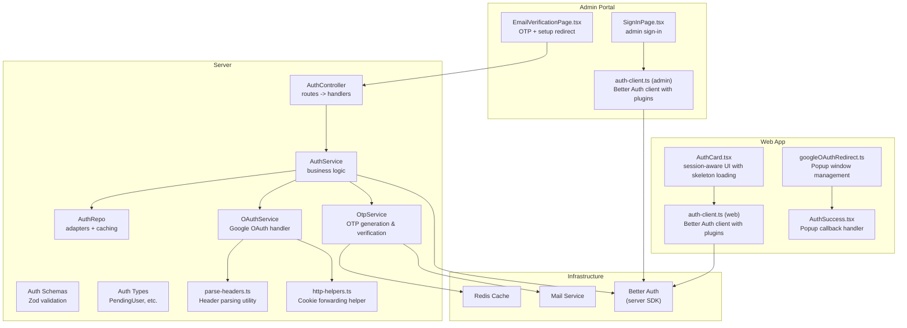
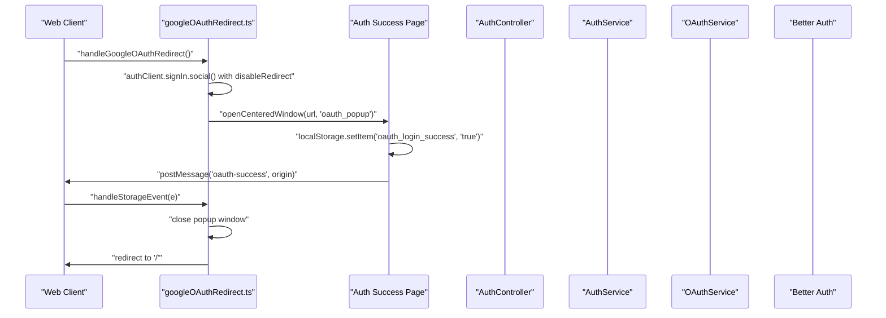
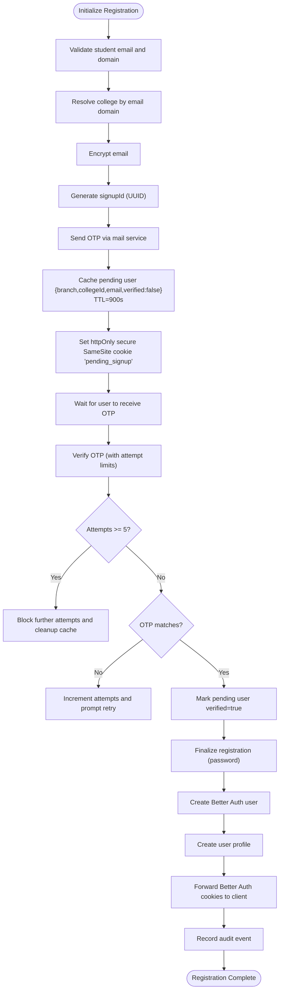
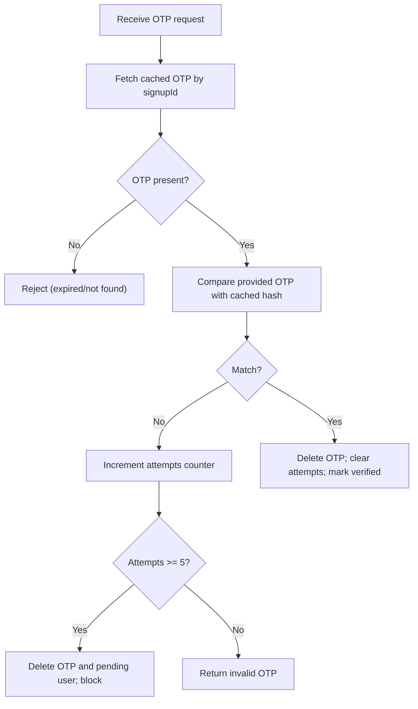
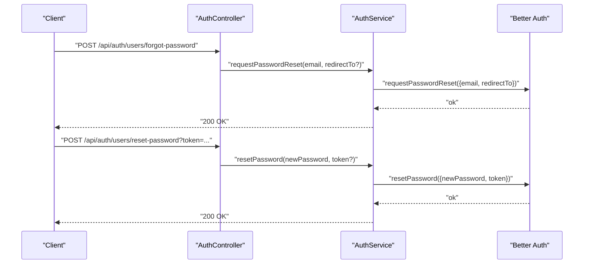
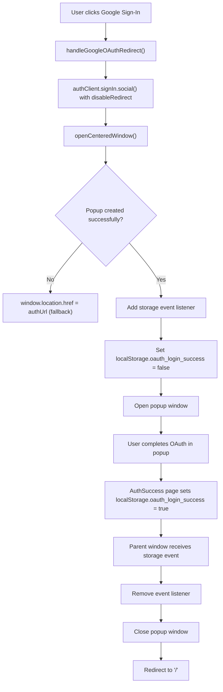
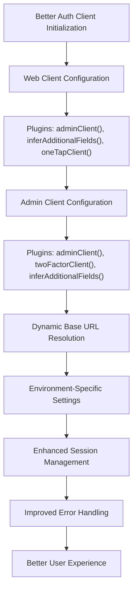
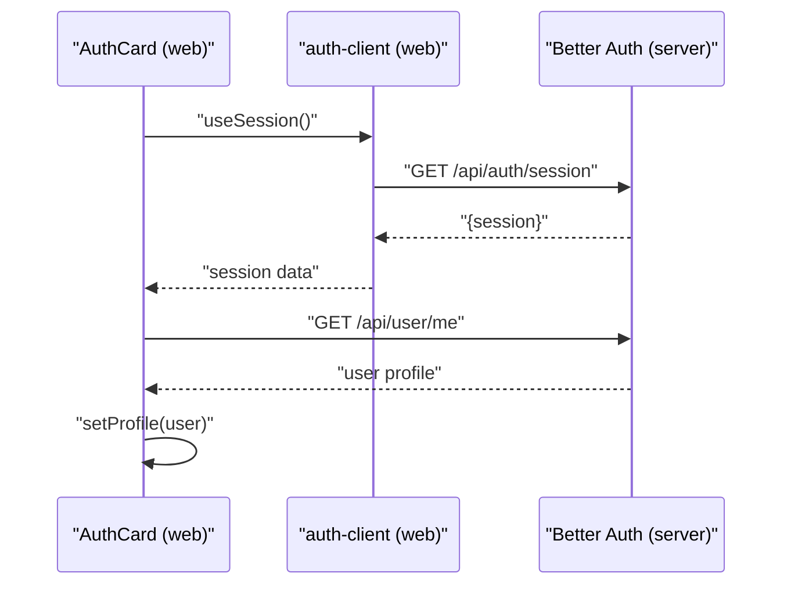
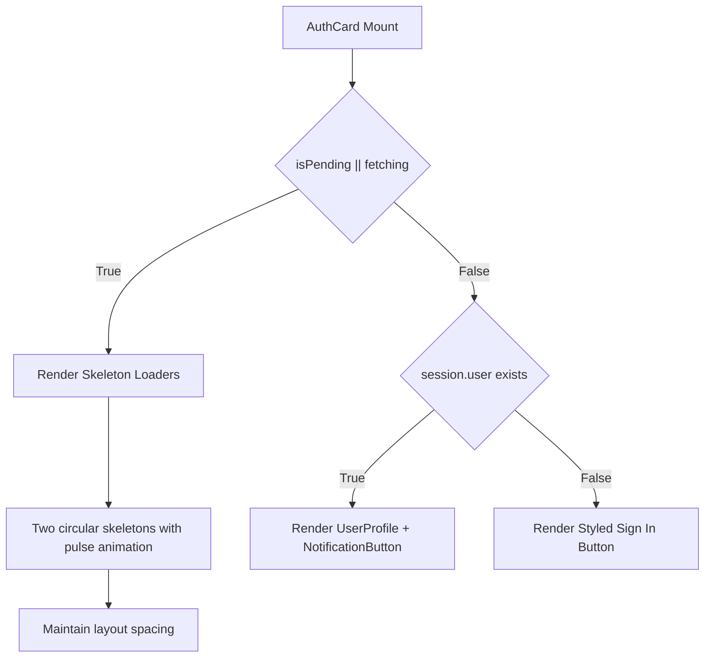
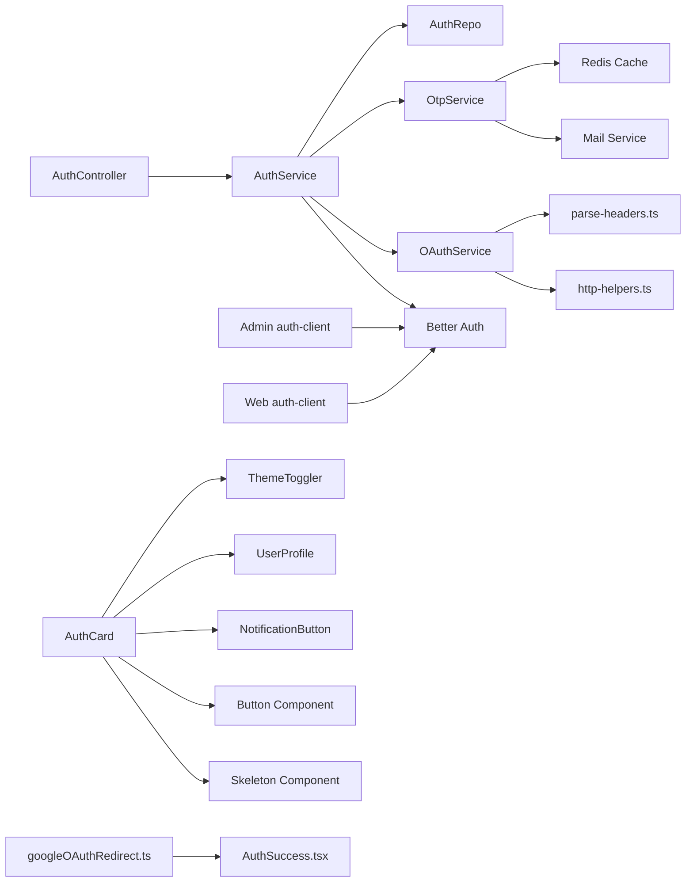

# Authentication System

<cite>
**Referenced Files in This Document**
- [auth.controller.ts](file://server/src/modules/auth/auth.controller.ts)
- [auth.service.ts](file://server/src/modules/auth/auth.service.ts)
- [auth.repo.ts](file://server/src/modules/auth/auth.repo.ts)
- [auth.schema.ts](file://server/src/modules/auth/auth.schema.ts)
- [auth.types.ts](file://server/src/modules/auth/auth.types.ts)
- [otp.service.ts](file://server/src/modules/auth/otp/otp.service.ts)
- [oauth.service.ts](file://server/src/modules/auth/oauth/oauth.service.ts)
- [auth.cache-keys.ts](file://server/src/modules/auth/auth.cache-keys.ts)
- [auth-client.ts (web)](file://web/src/lib/auth-client.ts)
- [auth-client.ts (admin)](file://admin/src/lib/auth-client.ts)
- [SignInPage.tsx (admin)](file://admin/src/pages/SignInPage.tsx)
- [EmailVerificationPage.tsx (admin)](file://admin/src/pages/EmailVerificationPage.tsx)
- [AuthCard.tsx (web)](file://web/src/components/general/AuthCard.tsx)
- [button.tsx (web)](file://web/src/components/ui/button.tsx)
- [skeleton.tsx (web)](file://web/src/components/ui/skeleton.tsx)
- [ThemeToggler.tsx (web)](file://web/src/components/general/ThemeToggler.tsx)
- [UserProfile.tsx (web)](file://web/src/components/general/UserProfile.tsx)
- [NotificationButton.tsx (web)](file://web/src/components/general/NotificationButton.tsx)
- [googleOAuthRedirect.ts](file://web/src/utils/googleOAuthRedirect.ts)
- [AuthSuccess.tsx](file://web/src/app/auth-success/page.tsx)
- [parse-headers.ts](file://server/src/lib/better-auth/parse-headers.ts)
- [http-helpers.ts](file://server/src/lib/better-auth/http-helpers.ts)
</cite>

## Update Summary
**Changes Made**
- Enhanced Google OAuth integration with popup-based authentication system
- Improved error handling with Better Auth client plugins
- Better storage-based communication between popup windows and parent windows
- Updated authentication client with modern Better Auth implementation
- Added popup window management and fallback mechanisms
- Enhanced session handling with improved cookie forwarding

## Table of Contents
1. [Introduction](#introduction)
2. [Project Structure](#project-structure)
3. [Core Components](#core-components)
4. [Architecture Overview](#architecture-overview)
5. [Detailed Component Analysis](#detailed-component-analysis)
6. [Enhanced Google OAuth Popup System](#enhanced-google-oauth-popup-system)
7. [Modern Better Auth Implementation](#modern-better-auth-implementation)
8. [Enhanced AuthCard Component](#enhanced-authcard-component)
9. [Dependency Analysis](#dependency-analysis)
10. [Performance Considerations](#performance-considerations)
11. [Troubleshooting Guide](#troubleshooting-guide)
12. [Conclusion](#conclusion)

## Introduction
This document describes the authentication system across the backend server, admin portal, and web application. It covers user registration with email verification and profile setup, OTP-based authentication, password recovery, OAuth integration with Google, session and cookie handling, route protection, error handling, validation, and security best practices.

**Updated** The system now features enhanced Google OAuth integration with popup-based authentication, improved error handling through Better Auth client plugins, and better storage-based communication between popup windows and parent windows. The authentication client has been modernized with Better Auth implementation.

## Project Structure
The authentication system spans three layers:
- Backend server: Express controllers, services, repositories, schemas, and infrastructure integrations (Better Auth, Redis cache, mail service).
- Admin portal: React pages and client for admin sign-in and email verification flows.
- Web application: React components integrating Better Auth client for session management and protected UI rendering.

**Diagram sources**
- [auth.controller.ts](file://server/src/modules/auth/auth.controller.ts#L1-L171)
- [auth.service.ts](file://server/src/modules/auth/auth.service.ts#L1-L347)
- [auth.repo.ts](file://server/src/modules/auth/auth.repo.ts#L1-L35)
- [otp.service.ts](file://server/src/modules/auth/otp/otp.service.ts#L1-L45)
- [oauth.service.ts](file://server/src/modules/auth/oauth/oauth.service.ts#L1-L45)
- [auth.schema.ts](file://server/src/modules/auth/auth.schema.ts#L1-L78)
- [auth.types.ts](file://server/src/modules/auth/auth.types.ts#L1-L10)
- [auth-client.ts (admin)](file://admin/src/lib/auth-client.ts#L1-L12)
- [auth-client.ts (web)](file://web/src/lib/auth-client.ts#L1-L16)
- [SignInPage.tsx (admin)](file://admin/src/pages/SignInPage.tsx#L1-L129)
- [EmailVerificationPage.tsx (admin)](file://admin/src/pages/EmailVerificationPage.tsx#L1-L186)
- [AuthCard.tsx (web)](file://web/src/components/general/AuthCard.tsx#L1-L109)
- [googleOAuthRedirect.ts](file://web/src/utils/googleOAuthRedirect.ts#L1-L68)
- [AuthSuccess.tsx](file://web/src/app/auth-success/page.tsx#L1-L54)
- [parse-headers.ts](file://server/src/lib/better-auth/parse-headers.ts#L1-L15)
- [http-helpers.ts](file://server/src/lib/better-auth/http-helpers.ts#L1-L15)

**Section sources**
- [auth.controller.ts](file://server/src/modules/auth/auth.controller.ts#L1-L171)
- [auth.service.ts](file://server/src/modules/auth/auth.service.ts#L1-L347)
- [auth.repo.ts](file://server/src/modules/auth/auth.repo.ts#L1-L35)
- [otp.service.ts](file://server/src/modules/auth/otp/otp.service.ts#L1-L45)
- [oauth.service.ts](file://server/src/modules/auth/oauth/oauth.service.ts#L1-L45)
- [auth.schema.ts](file://server/src/modules/auth/auth.schema.ts#L1-L78)
- [auth.types.ts](file://server/src/modules/auth/auth.types.ts#L1-L10)
- [auth-client.ts (admin)](file://admin/src/lib/auth-client.ts#L1-L12)
- [auth-client.ts (web)](file://web/src/lib/auth-client.ts#L1-L16)
- [SignInPage.tsx (admin)](file://admin/src/pages/SignInPage.tsx#L1-L129)
- [EmailVerificationPage.tsx (admin)](file://admin/src/pages/EmailVerificationPage.tsx#L1-L186)
- [AuthCard.tsx (web)](file://web/src/components/general/AuthCard.tsx#L1-L109)
- [googleOAuthRedirect.ts](file://web/src/utils/googleOAuthRedirect.ts#L1-L68)
- [AuthSuccess.tsx](file://web/src/app/auth-success/page.tsx#L1-L54)
- [parse-headers.ts](file://server/src/lib/better-auth/parse-headers.ts#L1-L15)
- [http-helpers.ts](file://server/src/lib/better-auth/http-helpers.ts#L1-L15)

## Core Components
- AuthController: Exposes HTTP endpoints for login, logout, OTP send/verify, Google OAuth callback, registration initialization and completion, password reset requests and resets, and admin user listings.
- AuthService: Implements business logic including student email validation, disposable email filtering, OTP lifecycle via cache, Better Auth integration for sessions, password reset orchestration, and audit logging.
- AuthRepo: Provides read/write access to auth records with caching wrappers.
- OtpService: Generates OTPs, hashes them, stores in cache, and verifies during user onboarding.
- OAuthService: Handles Google OAuth callback, retrieves Better Auth session, and creates user records if missing.
- Schemas: Define strict Zod validation for all request bodies and queries.
- Types: Defines PendingUser shape used during registration.
- Frontend Clients: Better Auth clients configured per app (web/admin) to integrate with server endpoints.
- **Updated** Popup Management Utilities: Handle Google OAuth popup window creation, communication, and fallback mechanisms.
- **Updated** Header Parsing Utilities: Parse HTTP headers for Better Auth session retrieval and cookie forwarding.

**Section sources**
- [auth.controller.ts](file://server/src/modules/auth/auth.controller.ts#L1-L171)
- [auth.service.ts](file://server/src/modules/auth/auth.service.ts#L1-L347)
- [auth.repo.ts](file://server/src/modules/auth/auth.repo.ts#L1-L35)
- [otp.service.ts](file://server/src/modules/auth/otp/otp.service.ts#L1-L45)
- [oauth.service.ts](file://server/src/modules/auth/oauth/oauth.service.ts#L1-L45)
- [auth.schema.ts](file://server/src/modules/auth/auth.schema.ts#L1-L78)
- [auth.types.ts](file://server/src/modules/auth/auth.types.ts#L1-L10)
- [auth-client.ts (admin)](file://admin/src/lib/auth-client.ts#L1-L12)
- [auth-client.ts (web)](file://web/src/lib/auth-client.ts#L1-L16)
- [googleOAuthRedirect.ts](file://web/src/utils/googleOAuthRedirect.ts#L1-L68)
- [parse-headers.ts](file://server/src/lib/better-auth/parse-headers.ts#L1-L15)
- [http-helpers.ts](file://server/src/lib/better-auth/http-helpers.ts#L1-L15)

## Architecture Overview
The system integrates Better Auth for session management and cookie-based auth, Redis for OTP and pending user state, and a mail service for OTP delivery. Registration is multi-step: initialize with email and branch, send OTP, verify OTP, then submit a password to finalize registration. Login uses Better Auth APIs. Password reset uses Better Auth's built-in flows. Google OAuth exchanges a code for a session and ensures a local user record exists.

**Updated** The Google OAuth flow now uses a popup-based system with enhanced error handling and storage-based communication between popup windows and parent windows.

**Diagram sources**
- [googleOAuthRedirect.ts](file://web/src/utils/googleOAuthRedirect.ts#L6-L35)
- [AuthSuccess.tsx](file://web/src/app/auth-success/page.tsx#L8-L32)
- [auth-client.ts (web)](file://web/src/lib/auth-client.ts#L9-L13)

## Detailed Component Analysis

### Multi-Step Registration Flow (Email Verification + Profile Setup)
- Initialize registration:
  - Validates student email format and domain, checks disposable email, resolves college by domain, generates a UUID-based signupId, sends OTP, stores pending user in cache with TTL, and sets a httpOnly, secure, sameSite cookie for the session.
- OTP verification:
  - Enforces a maximum number of OTP attempts with per-session counters in cache; clears attempts and OTP on success; marks pending user as verified.
- Finalize registration:
  - Requires verified flag; creates Better Auth user with generated username; creates profile; forwards Better Auth Set-Cookie headers; audits creation.

**Diagram sources**
- [auth.service.ts](file://server/src/modules/auth/auth.service.ts#L32-L106)
- [otp.service.ts](file://server/src/modules/auth/otp/otp.service.ts#L8-L41)
- [auth.controller.ts](file://server/src/modules/auth/auth.controller.ts#L47-L121)

**Section sources**
- [auth.service.ts](file://server/src/modules/auth/auth.service.ts#L32-L106)
- [otp.service.ts](file://server/src/modules/auth/otp/otp.service.ts#L8-L41)
- [auth.controller.ts](file://server/src/modules/auth/auth.controller.ts#L47-L121)

### OTP-Based Authentication Mechanism and Security Measures
- OTP generation and hashing:
  - OTP is hashed before storage; comparison uses secure hash comparison.
- Attempt throttling:
  - Tracks attempts per signupId; blocks after threshold; clears on success.
- Session scoping:
  - Uses signupId to scope OTP and attempts; cookie is httpOnly and secure.
- Expiration:
  - OTP and pending user entries expire after TTL.

**Diagram sources**
- [otp.service.ts](file://server/src/modules/auth/otp/otp.service.ts#L33-L41)
- [auth.service.ts](file://server/src/modules/auth/auth.service.ts#L108-L151)

**Section sources**
- [otp.service.ts](file://server/src/modules/auth/otp/otp.service.ts#L8-L41)
- [auth.service.ts](file://server/src/modules/auth/auth.service.ts#L108-L151)

### Password Recovery Workflow
- Request reset:
  - Calls Better Auth requestPasswordReset with optional redirect URL.
- Reset password:
  - Accepts new password and token (via body or query) and invokes Better Auth resetPassword.
- Audit:
  - Logs events for password reset initiation and completion.

**Diagram sources**
- [auth.controller.ts](file://server/src/modules/auth/auth.controller.ts#L129-L146)
- [auth.service.ts](file://server/src/modules/auth/auth.service.ts#L257-L287)

**Section sources**
- [auth.controller.ts](file://server/src/modules/auth/auth.controller.ts#L129-L146)
- [auth.service.ts](file://server/src/modules/auth/auth.service.ts#L257-L287)

### Enhanced Google OAuth Popup System

**Updated** The Google OAuth integration now features a sophisticated popup-based authentication system with improved error handling and storage-based communication.

#### Popup Window Management
- **Window Creation**: The system opens a centered popup window with specific dimensions (500x600) and positioning relative to the parent window.
- **Fallback Mechanism**: If popup creation fails, the system automatically falls back to direct URL navigation.
- **Event Listener Management**: Properly manages storage event listeners to prevent memory leaks and ensure clean cleanup.

#### Storage-Based Communication
- **Local Storage Events**: Uses localStorage to communicate success/failure states between popup and parent windows.
- **Event Handling**: Listens for `oauth_login_success` events to trigger popup closure and navigation.
- **Cleanup Process**: Removes event listeners and localStorage entries after successful authentication.

#### Enhanced Error Handling
- **Popup Closure**: Includes error handling for popup closure operations to prevent crashes.
- **Graceful Degradation**: Provides fallback mechanisms when popup features are unavailable.
- **Cross-Origin Communication**: Uses postMessage for direct communication when available.

**Diagram sources**
- [googleOAuthRedirect.ts](file://web/src/utils/googleOAuthRedirect.ts#L6-L52)
- [AuthSuccess.tsx](file://web/src/app/auth-success/page.tsx#L8-L32)

**Section sources**
- [googleOAuthRedirect.ts](file://web/src/utils/googleOAuthRedirect.ts#L1-L68)
- [AuthSuccess.tsx](file://web/src/app/auth-success/page.tsx#L1-L54)

### Modern Better Auth Implementation

**Updated** The authentication system now uses modern Better Auth implementation with enhanced client configuration and plugin support.

#### Enhanced Client Configuration
- **Web Client**: Configured with Better Auth client plugins including admin client, infer additional fields, and Google One Tap client with popup UX mode.
- **Admin Client**: Configured with admin client, two-factor client, and infer additional fields for enhanced security.
- **Base URL Management**: Dynamic base URL configuration supporting both development and production environments.

#### Plugin Features
- **Admin Client**: Provides administrative authentication capabilities and role-based access control.
- **Two-Factor Client**: Enables two-factor authentication with OTP verification flows.
- **One-Tap Client**: Integrates Google One Tap authentication with popup UX mode for seamless user experience.
- **Infer Additional Fields**: Automatically infers and handles additional user fields from Better Auth responses.

#### Session Management
- **Enhanced Session Handling**: Improved session state management with better error handling and user experience.
- **Cookie Forwarding**: Enhanced cookie forwarding mechanisms for better cross-origin authentication.
- **Header Parsing**: Robust header parsing utilities for extracting session information from HTTP requests.

**Diagram sources**
- [auth-client.ts (web)](file://web/src/lib/auth-client.ts#L5-L15)
- [auth-client.ts (admin)](file://admin/src/lib/auth-client.ts#L4-L11)

**Section sources**
- [auth-client.ts (web)](file://web/src/lib/auth-client.ts#L1-L16)
- [auth-client.ts (admin)](file://admin/src/lib/auth-client.ts#L1-L12)

### Authentication State Management, Session Handling, and Route Protection
- Client-side session awareness:
  - Admin and web apps use Better Auth client to manage session state and cookies.
  - Admin sign-in page conditionally navigates to OTP verification on 2FA-related errors.
  - Web AuthCard fetches current user profile upon session availability and updates store.
- Cookie security:
  - Server sets httpOnly, secure, sameSite cookies for Better Auth sessions.
- Route protection:
  - Admin sign-in enforces role-based access; unauthorized users are signed out.

**Diagram sources**
- [AuthCard.tsx (web)](file://web/src/components/general/AuthCard.tsx#L37-L75)
- [auth-client.ts (web)](file://web/src/lib/auth-client.ts#L1-L16)
- [SignInPage.tsx (admin)](file://admin/src/pages/SignInPage.tsx#L38-L73)

**Section sources**
- [AuthCard.tsx (web)](file://web/src/components/general/AuthCard.tsx#L37-L75)
- [auth-client.ts (web)](file://web/src/lib/auth-client.ts#L1-L16)
- [SignInPage.tsx (admin)](file://admin/src/pages/SignInPage.tsx#L38-L73)

### Form Validation and Error Handling Patterns
- Validation:
  - Strict Zod schemas for login, OTP, registration, Google callback, password reset, and admin queries.
- Error handling:
  - Centralized HTTP errors returned to clients; frontend surfaces user-friendly messages and retries (e.g., resend OTP).
- UX considerations:
  - OTP auto-verification on sufficient input length, resend cooldown, and clear error messaging.
- **Updated** Enhanced error handling with Better Auth client plugins providing better error context and user feedback.

**Section sources**
- [auth.schema.ts](file://server/src/modules/auth/auth.schema.ts#L5-L77)
- [EmailVerificationPage.tsx (admin)](file://admin/src/pages/EmailVerificationPage.tsx#L49-L120)
- [SignInPage.tsx (admin)](file://admin/src/pages/SignInPage.tsx#L54-L73)

## Enhanced Google OAuth Popup System

**Updated** The Google OAuth integration has been significantly enhanced with a popup-based authentication system featuring improved error handling and storage-based communication.

### Popup Window Management
The system now manages popup windows with sophisticated positioning and fallback mechanisms:

- **Centered Window Positioning**: Calculates optimal position based on parent window dimensions to center the popup.
- **Dimension Control**: Sets fixed dimensions (500x600) for consistent user experience across devices.
- **Fallback Navigation**: Automatically falls back to direct URL navigation if popup creation fails.
- **Window Reference Management**: Maintains reference to popup window for proper cleanup and closure.

### Storage-Based Communication
Enhanced communication between popup and parent windows using localStorage events:

- **Success Flag Management**: Uses `oauth_login_success` localStorage key to signal authentication completion.
- **Event-Driven Architecture**: Listens for storage events to trigger popup closure and navigation.
- **Cleanup Protocol**: Removes event listeners and localStorage entries after successful authentication.
- **Cross-Origin Safety**: Includes proper error handling for popup closure operations.

### Enhanced Error Handling
Improved error handling throughout the OAuth flow:

- **Popup Creation Failure**: Graceful fallback to direct navigation when popup creation fails.
- **Communication Failures**: Robust error handling for postMessage and localStorage operations.
- **Popup Closure Errors**: Prevents crashes when attempting to close already-closed popups.
- **Timeout Management**: Implements timeout mechanisms for fallback scenarios.

### Auth Success Page
The AuthSuccess page coordinates popup completion:

- **Success Signal**: Sets localStorage flag to indicate successful authentication.
- **Cross-Origin Messaging**: Sends postMessage to parent window for direct communication.
- **Popup Closure**: Attempts to close popup window after successful authentication.
- **Fallback Navigation**: Redirects to home page if popup communication fails.

**Section sources**
- [googleOAuthRedirect.ts](file://web/src/utils/googleOAuthRedirect.ts#L1-L68)
- [AuthSuccess.tsx](file://web/src/app/auth-success/page.tsx#L1-L54)

## Modern Better Auth Implementation

**Updated** The authentication system now leverages modern Better Auth implementation with enhanced client configuration and plugin support.

### Enhanced Client Configuration
Both web and admin applications feature improved Better Auth client configurations:

- **Web Application**: Configured with admin client, infer additional fields, and Google One Tap client with popup UX mode.
- **Admin Application**: Configured with admin client, two-factor client, and infer additional fields for enhanced security.
- **Dynamic Base URLs**: Supports environment-specific base URLs for development and production deployments.

### Plugin Ecosystem
Comprehensive plugin system providing enhanced functionality:

- **Admin Client**: Provides administrative authentication capabilities and role-based access control.
- **Two-Factor Client**: Enables two-factor authentication with OTP verification flows.
- **One-Tap Client**: Integrates Google One Tap authentication with popup UX mode.
- **Infer Additional Fields**: Automatically handles additional user fields from Better Auth responses.

### Session Management Improvements
Enhanced session management with better error handling:

- **Improved Error Context**: Better Auth client plugins provide richer error context and user feedback.
- **Enhanced User Experience**: Seamless authentication flows with proper loading states and error messaging.
- **Better Cookie Handling**: Improved cookie forwarding mechanisms for cross-origin authentication.

### Header Parsing and Cookie Forwarding
Robust utilities for Better Auth integration:

- **Header Parsing**: Converts Express HTTP headers to Better Auth compatible format.
- **Cookie Forwarding**: Enhanced cookie forwarding for maintaining session state across requests.
- **Cross-Origin Support**: Handles cookie forwarding in various deployment scenarios.

**Section sources**
- [auth-client.ts (web)](file://web/src/lib/auth-client.ts#L1-L16)
- [auth-client.ts (admin)](file://admin/src/lib/auth-client.ts#L1-L12)
- [parse-headers.ts](file://server/src/lib/better-auth/parse-headers.ts#L1-L15)
- [http-helpers.ts](file://server/src/lib/better-auth/http-helpers.ts#L1-L15)

## Enhanced AuthCard Component

**Updated** The AuthCard component has been significantly enhanced with skeleton loading states, improved responsive design, and better button styling to provide a superior user experience during authentication flows.

### Skeleton Loading States
The AuthCard now implements skeleton loading states to improve perceived performance and user experience during authentication transitions:

- **Dual Skeleton Pattern**: When session data is pending or user data is being fetched, two circular skeleton loaders are displayed to represent the NotificationButton and UserProfile components.
- **Smooth Transitions**: The skeleton loading provides immediate visual feedback while the actual components load asynchronously.
- **Consistent Layout**: The skeleton maintains the same spacing and dimensions as the final components, preventing layout shifts.

**Diagram sources**
- [AuthCard.tsx (web)](file://web/src/components/general/AuthCard.tsx#L77-L101)

### Improved Responsive Design
The AuthCard component now features enhanced responsive design patterns:

- **Flexible Spacing**: Uses `gap-4` utility for consistent spacing across different screen sizes.
- **Centered Alignment**: Maintains `flex items-center justify-center` for optimal centering on all devices.
- **Mobile-First Approach**: The component adapts seamlessly from mobile to desktop screens without layout breaks.

### Enhanced Button Styling
The Sign In button within AuthCard has been improved with better styling and interaction effects:

- **Rounded Design**: Uses `rounded-full` for modern, friendly appearance.
- **Enhanced Transitions**: Implements smooth `transition-transform` with hover and active scaling effects (`hover:scale-105 active:scale-95`).
- **Visual Feedback**: Provides intuitive hover and click animations for better user interaction.
- **Accessibility**: Maintains proper contrast ratios and focus states for accessibility compliance.

### Component Composition
The AuthCard integrates several specialized components for a cohesive authentication experience:

- **ThemeToggler**: Provides seamless theme switching with persistent storage.
- **NotificationButton**: Displays notification count with badge indicators.
- **UserProfile**: Shows user avatar with dropdown menu for navigation.
- **Responsive Layout**: Adapts to various screen sizes while maintaining functionality.

**Section sources**
- [AuthCard.tsx (web)](file://web/src/components/general/AuthCard.tsx#L1-L109)
- [button.tsx (web)](file://web/src/components/ui/button.tsx#L1-L65)
- [skeleton.tsx (web)](file://web/src/components/ui/skeleton.tsx#L1-L14)
- [ThemeToggler.tsx (web)](file://web/src/components/general/ThemeToggler.tsx#L1-L31)
- [UserProfile.tsx (web)](file://web/src/components/general/UserProfile.tsx#L1-L52)
- [NotificationButton.tsx (web)](file://web/src/components/general/NotificationButton.tsx#L1-L20)

## Dependency Analysis
- Controllers depend on services for business logic.
- Services depend on Better Auth SDK, Redis cache, mail service, and repositories.
- Repositories wrap database adapters and apply caching keys.
- Frontend clients depend on server endpoints exposed by Better Auth.
- AuthCard depends on multiple UI components and utilities for enhanced functionality.
- **Updated** Popup management utilities depend on Better Auth client and browser APIs.
- **Updated** Header parsing utilities provide Better Auth integration support.

**Diagram sources**
- [auth.controller.ts](file://server/src/modules/auth/auth.controller.ts#L1-L171)
- [auth.service.ts](file://server/src/modules/auth/auth.service.ts#L1-L347)
- [auth.repo.ts](file://server/src/modules/auth/auth.repo.ts#L1-L35)
- [otp.service.ts](file://server/src/modules/auth/otp/otp.service.ts#L1-L45)
- [oauth.service.ts](file://server/src/modules/auth/oauth/oauth.service.ts#L1-L45)
- [auth-client.ts (admin)](file://admin/src/lib/auth-client.ts#L1-L12)
- [auth-client.ts (web)](file://web/src/lib/auth-client.ts#L1-L16)
- [AuthCard.tsx (web)](file://web/src/components/general/AuthCard.tsx#L1-L109)
- [googleOAuthRedirect.ts](file://web/src/utils/googleOAuthRedirect.ts#L1-L68)
- [AuthSuccess.tsx](file://web/src/app/auth-success/page.tsx#L1-L54)
- [parse-headers.ts](file://server/src/lib/better-auth/parse-headers.ts#L1-L15)
- [http-helpers.ts](file://server/src/lib/better-auth/http-helpers.ts#L1-L15)

**Section sources**
- [auth.controller.ts](file://server/src/modules/auth/auth.controller.ts#L1-L171)
- [auth.service.ts](file://server/src/modules/auth/auth.service.ts#L1-L347)
- [auth.repo.ts](file://server/src/modules/auth/auth.repo.ts#L1-L35)
- [otp.service.ts](file://server/src/modules/auth/otp/otp.service.ts#L1-L45)
- [oauth.service.ts](file://server/src/modules/auth/oauth/oauth.service.ts#L1-L45)
- [auth-client.ts (admin)](file://admin/src/lib/auth-client.ts#L1-L12)
- [auth-client.ts (web)](file://web/src/lib/auth-client.ts#L1-L16)
- [AuthCard.tsx (web)](file://web/src/components/general/AuthCard.tsx#L1-L109)
- [googleOAuthRedirect.ts](file://web/src/utils/googleOAuthRedirect.ts#L1-L68)
- [AuthSuccess.tsx](file://web/src/app/auth-success/page.tsx#L1-L54)
- [parse-headers.ts](file://server/src/lib/better-auth/parse-headers.ts#L1-L15)
- [http-helpers.ts](file://server/src/lib/better-auth/http-helpers.ts#L1-L15)

## Performance Considerations
- Caching:
  - OTP and pending user data are cached with short TTLs to reduce DB load and enable fast verification.
- Rate limiting:
  - Attempt-based blocking prevents brute-force OTP guessing.
- Session persistence:
  - Better Auth manages persistent sessions; cookie flags ensure secure transport and scope.
- Audit logging:
  - Minimal overhead; useful for compliance and monitoring.
- **Enhanced Loading Performance**:
  - Skeleton loading reduces perceived loading time during authentication transitions.
  - Optimized component composition minimizes unnecessary re-renders.
  - Efficient CSS classes and minimal DOM manipulation for smooth animations.
- **Updated** Popup Performance Optimization:
  - Popup window reuse prevents excessive memory allocation.
  - Event listener cleanup prevents memory leaks.
  - Fallback mechanisms ensure graceful degradation.

## Troubleshooting Guide
- OTP not received:
  - Verify mail service configuration and that OTP was hashed and cached.
- Too many OTP attempts:
  - Confirm attempt counters and cache TTL; ensure cleanup on success.
- Registration not completing:
  - Ensure pending user is marked verified; confirm Better Auth user creation and profile creation.
- Password reset failures:
  - Validate token presence and correctness; check redirect URL validity.
- Google OAuth errors:
  - Confirm popup window creation and communication; verify localStorage event handling.
  - Check Better Auth session retrieval and user creation path for new OAuth users.
- Frontend session issues:
  - Check Better Auth client base URL and plugin configuration; ensure cookies are accepted and not blocked.
- **AuthCard Loading Issues**:
  - Verify skeleton components are rendering correctly during loading states.
  - Check button styling classes are properly applied across different themes.
  - Ensure responsive design works correctly on mobile and tablet devices.
- **Popup Authentication Issues**:
  - Verify popup window dimensions and positioning calculations.
  - Check localStorage event listener management and cleanup.
  - Ensure proper fallback navigation when popup creation fails.
  - Validate cross-origin communication via postMessage.
- **Better Auth Client Issues**:
  - Confirm plugin configuration matches application requirements.
  - Verify base URL resolution for different environments.
  - Check session state management and error handling.

**Section sources**
- [otp.service.ts](file://server/src/modules/auth/otp/otp.service.ts#L8-L41)
- [auth.service.ts](file://server/src/modules/auth/auth.service.ts#L108-L151)
- [auth.controller.ts](file://server/src/modules/auth/auth.controller.ts#L129-L146)
- [oauth.service.ts](file://server/src/modules/auth/oauth/oauth.service.ts#L11-L38)
- [auth-client.ts (admin)](file://admin/src/lib/auth-client.ts#L4-L11)
- [auth-client.ts (web)](file://web/src/lib/auth-client.ts#L5-L15)
- [AuthCard.tsx (web)](file://web/src/components/general/AuthCard.tsx#L77-L101)
- [googleOAuthRedirect.ts](file://web/src/utils/googleOAuthRedirect.ts#L20-L52)
- [AuthSuccess.tsx](file://web/src/app/auth-success/page.tsx#L8-L32)

## Conclusion
The authentication system combines Better Auth for robust session management, Redis-backed OTP handling, and secure cookie policies. The multi-step registration flow ensures student identity validation and secure onboarding, while password reset and Google OAuth provide flexible user experiences. Frontend clients integrate seamlessly with server endpoints to deliver responsive, secure authentication across admin and web applications.

**Recent Enhancements**:
- The Google OAuth integration now features a sophisticated popup-based system with enhanced error handling and storage-based communication.
- The authentication client has been modernized with Better Auth implementation providing improved session management and user experience.
- Enhanced popup window management with fallback mechanisms ensures graceful degradation when popup features are unavailable.
- Improved error handling throughout the authentication flow provides better user feedback and system reliability.
- The AuthCard component now provides skeleton loading states for improved perceived performance during authentication transitions.
- Enhanced responsive design ensures optimal user experience across all device sizes.
- Better button styling with smooth animations and transitions improves user interaction feedback.
- The component composition maintains accessibility standards while providing modern UI aesthetics.

These improvements demonstrate the system's commitment to user experience optimization and performance enhancement while maintaining the robust security and reliability of the underlying authentication infrastructure. The modern Better Auth implementation provides a solid foundation for future authentication enhancements and scalability improvements.