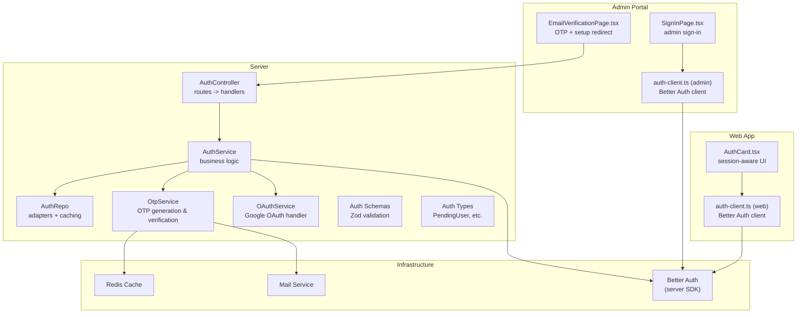
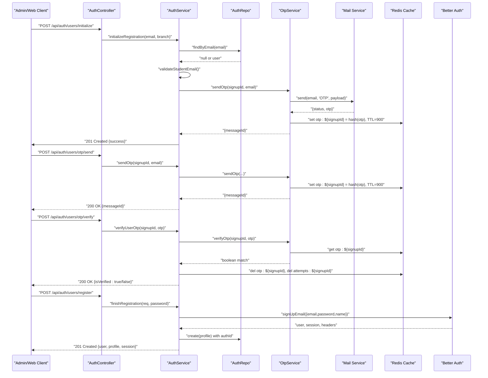
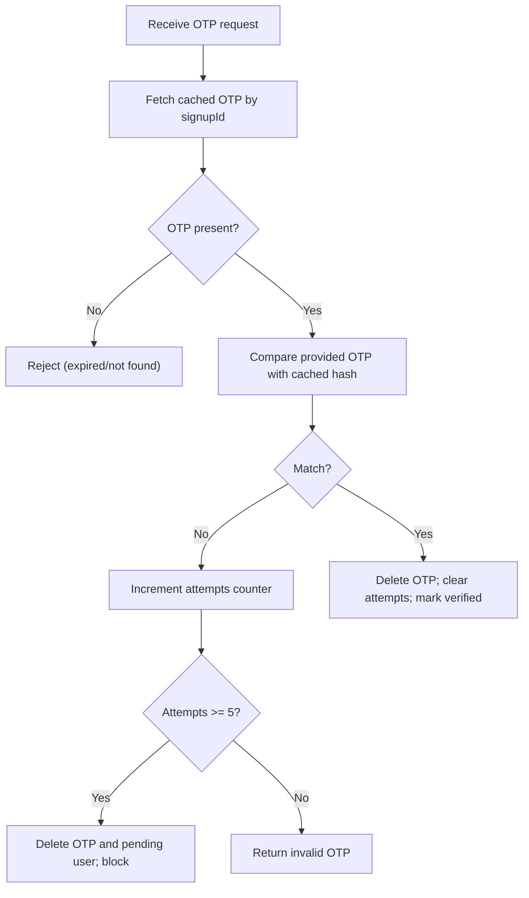
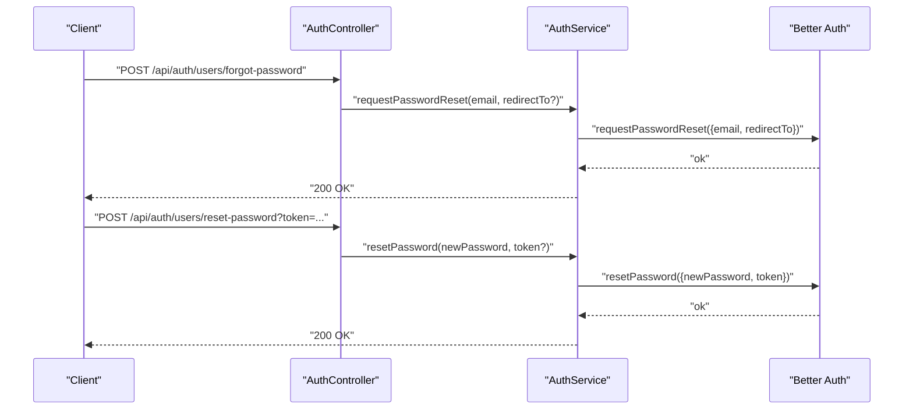
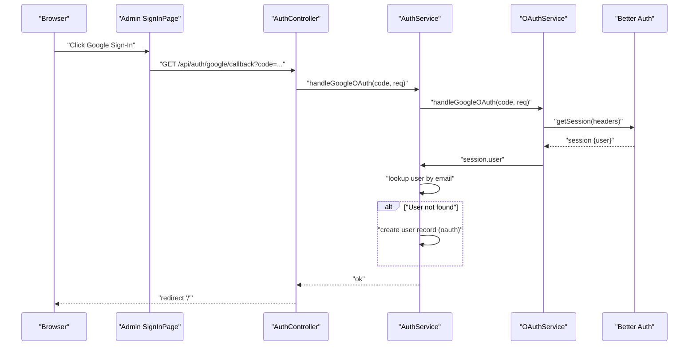
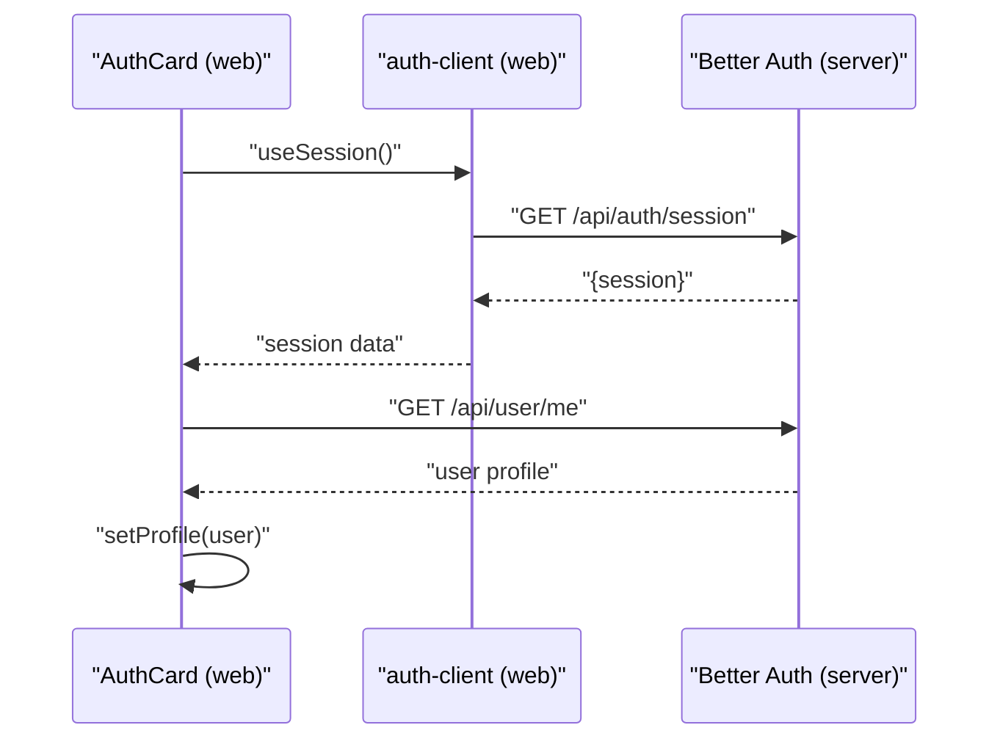
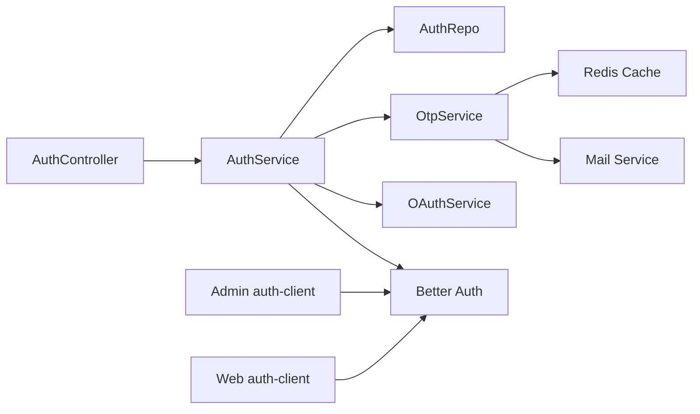

# Authentication System

<cite>
**Referenced Files in This Document**
- [auth.controller.ts](file://server/src/modules/auth/auth.controller.ts)
- [auth.service.ts](file://server/src/modules/auth/auth.service.ts)
- [auth.repo.ts](file://server/src/modules/auth/auth.repo.ts)
- [auth.schema.ts](file://server/src/modules/auth/auth.schema.ts)
- [auth.types.ts](file://server/src/modules/auth/auth.types.ts)
- [otp.service.ts](file://server/src/modules/auth/otp/otp.service.ts)
- [oauth.service.ts](file://server/src/modules/auth/oauth/oauth.service.ts)
- [auth.cache-keys.ts](file://server/src/modules/auth/auth.cache-keys.ts)
- [auth-client.ts (web)](file://web/src/lib/auth-client.ts)
- [auth-client.ts (admin)](file://admin/src/lib/auth-client.ts)
- [SignInPage.tsx (admin)](file://admin/src/pages/SignInPage.tsx)
- [EmailVerificationPage.tsx (admin)](file://admin/src/pages/EmailVerificationPage.tsx)
- [AuthCard.tsx (web)](file://web/src/components/general/AuthCard.tsx)
</cite>

## Table of Contents
1. [Introduction](#introduction)
2. [Project Structure](#project-structure)
3. [Core Components](#core-components)
4. [Architecture Overview](#architecture-overview)
5. [Detailed Component Analysis](#detailed-component-analysis)
6. [Dependency Analysis](#dependency-analysis)
7. [Performance Considerations](#performance-considerations)
8. [Troubleshooting Guide](#troubleshooting-guide)
9. [Conclusion](#conclusion)

## Introduction
This document describes the authentication system across the backend server, admin portal, and web application. It covers user registration with email verification and profile setup, OTP-based authentication, password recovery, OAuth integration with Google, session and cookie handling, route protection, error handling, validation, and security best practices.

## Project Structure
The authentication system spans three layers:
- Backend server: Express controllers, services, repositories, schemas, and infrastructure integrations (Better Auth, Redis cache, mail service).
- Admin portal: React pages and client for admin sign-in and email verification flows.
- Web application: React components integrating Better Auth client for session management and protected UI rendering.

**Diagram sources**
- [auth.controller.ts](file://server/src/modules/auth/auth.controller.ts#L1-L171)
- [auth.service.ts](file://server/src/modules/auth/auth.service.ts#L1-L347)
- [auth.repo.ts](file://server/src/modules/auth/auth.repo.ts#L1-L35)
- [otp.service.ts](file://server/src/modules/auth/otp/otp.service.ts#L1-L45)
- [oauth.service.ts](file://server/src/modules/auth/oauth/oauth.service.ts#L1-L45)
- [auth.schema.ts](file://server/src/modules/auth/auth.schema.ts#L1-L78)
- [auth.types.ts](file://server/src/modules/auth/auth.types.ts#L1-L10)
- [auth-client.ts (admin)](file://admin/src/lib/auth-client.ts#L1-L12)
- [auth-client.ts (web)](file://web/src/lib/auth-client.ts#L1-L11)
- [SignInPage.tsx (admin)](file://admin/src/pages/SignInPage.tsx#L1-L128)
- [EmailVerificationPage.tsx (admin)](file://admin/src/pages/EmailVerificationPage.tsx#L1-L186)
- [AuthCard.tsx (web)](file://web/src/components/general/AuthCard.tsx#L1-L72)

**Section sources**
- [auth.controller.ts](file://server/src/modules/auth/auth.controller.ts#L1-L171)
- [auth.service.ts](file://server/src/modules/auth/auth.service.ts#L1-L347)
- [auth.repo.ts](file://server/src/modules/auth/auth.repo.ts#L1-L35)
- [otp.service.ts](file://server/src/modules/auth/otp/otp.service.ts#L1-L45)
- [oauth.service.ts](file://server/src/modules/auth/oauth/oauth.service.ts#L1-L45)
- [auth.schema.ts](file://server/src/modules/auth/auth.schema.ts#L1-L78)
- [auth.types.ts](file://server/src/modules/auth/auth.types.ts#L1-L10)
- [auth-client.ts (admin)](file://admin/src/lib/auth-client.ts#L1-L12)
- [auth-client.ts (web)](file://web/src/lib/auth-client.ts#L1-L11)
- [SignInPage.tsx (admin)](file://admin/src/pages/SignInPage.tsx#L1-L128)
- [EmailVerificationPage.tsx (admin)](file://admin/src/pages/EmailVerificationPage.tsx#L1-L186)
- [AuthCard.tsx (web)](file://web/src/components/general/AuthCard.tsx#L1-L72)

## Core Components
- AuthController: Exposes HTTP endpoints for login, logout, OTP send/verify, Google OAuth callback, registration initialization and completion, password reset requests and resets, and admin user listings.
- AuthService: Implements business logic including student email validation, disposable email filtering, OTP lifecycle via cache, Better Auth integration for sessions, password reset orchestration, and audit logging.
- AuthRepo: Provides read/write access to auth records with caching wrappers.
- OtpService: Generates OTPs, hashes them, stores in cache, and verifies during user onboarding.
- OAuthService: Handles Google OAuth callback, retrieves Better Auth session, and creates user records if missing.
- Schemas: Define strict Zod validation for all request bodies and queries.
- Types: Defines PendingUser shape used during registration.
- Frontend Clients: Better Auth clients configured per app (web/admin) to integrate with server endpoints.

**Section sources**
- [auth.controller.ts](file://server/src/modules/auth/auth.controller.ts#L1-L171)
- [auth.service.ts](file://server/src/modules/auth/auth.service.ts#L1-L347)
- [auth.repo.ts](file://server/src/modules/auth/auth.repo.ts#L1-L35)
- [otp.service.ts](file://server/src/modules/auth/otp/otp.service.ts#L1-L45)
- [oauth.service.ts](file://server/src/modules/auth/oauth/oauth.service.ts#L1-L45)
- [auth.schema.ts](file://server/src/modules/auth/auth.schema.ts#L1-L78)
- [auth.types.ts](file://server/src/modules/auth/auth.types.ts#L1-L10)
- [auth-client.ts (admin)](file://admin/src/lib/auth-client.ts#L1-L12)
- [auth-client.ts (web)](file://web/src/lib/auth-client.ts#L1-L11)

## Architecture Overview
The system integrates Better Auth for session management and cookie-based auth, Redis for OTP and pending user state, and a mail service for OTP delivery. Registration is multi-step: initialize with email and branch, send OTP, verify OTP, then submit a password to finalize registration. Login uses Better Auth APIs. Password reset uses Better Auth’s built-in flows. Google OAuth exchanges a code for a session and ensures a local user record exists.

**Diagram sources**
- [auth.controller.ts](file://server/src/modules/auth/auth.controller.ts#L47-L121)
- [auth.service.ts](file://server/src/modules/auth/auth.service.ts#L32-L197)
- [otp.service.ts](file://server/src/modules/auth/otp/otp.service.ts#L8-L41)
- [auth.repo.ts](file://server/src/modules/auth/auth.repo.ts#L28-L31)
- [auth.schema.ts](file://server/src/modules/auth/auth.schema.ts#L14-L36)

## Detailed Component Analysis

### Multi-Step Registration Flow (Email Verification + Profile Setup)
- Initialize registration:
  - Validates student email format and domain, checks disposable email, resolves college by domain, generates a UUID-based signupId, sends OTP, stores pending user in cache with TTL, and sets a httpOnly, secure, sameSite cookie for the session.
- OTP verification:
  - Enforces a maximum number of OTP attempts with per-session counters in cache; clears attempts and OTP on success; marks pending user as verified.
- Finalize registration:
  - Requires verified flag; creates Better Auth user with generated username; creates profile; forwards Better Auth Set-Cookie headers; audits creation.

**Diagram sources**
- [auth.service.ts](file://server/src/modules/auth/auth.service.ts#L32-L106)
- [otp.service.ts](file://server/src/modules/auth/otp/otp.service.ts#L8-L41)
- [auth.controller.ts](file://server/src/modules/auth/auth.controller.ts#L47-L121)

**Section sources**
- [auth.service.ts](file://server/src/modules/auth/auth.service.ts#L32-L106)
- [otp.service.ts](file://server/src/modules/auth/otp/otp.service.ts#L8-L41)
- [auth.controller.ts](file://server/src/modules/auth/auth.controller.ts#L47-L121)

### OTP-Based Authentication Mechanism and Security Measures
- OTP generation and hashing:
  - OTP is hashed before storage; comparison uses secure hash comparison.
- Attempt throttling:
  - Tracks attempts per signupId; blocks after threshold; clears on success.
- Session scoping:
  - Uses signupId to scope OTP and attempts; cookie is httpOnly and secure.
- Expiration:
  - OTP and pending user entries expire after TTL.

**Diagram sources**
- [otp.service.ts](file://server/src/modules/auth/otp/otp.service.ts#L33-L41)
- [auth.service.ts](file://server/src/modules/auth/auth.service.ts#L108-L151)

**Section sources**
- [otp.service.ts](file://server/src/modules/auth/otp/otp.service.ts#L8-L41)
- [auth.service.ts](file://server/src/modules/auth/auth.service.ts#L108-L151)

### Password Recovery Workflow
- Request reset:
  - Calls Better Auth requestPasswordReset with optional redirect URL.
- Reset password:
  - Accepts new password and token (via body or query) and invokes Better Auth resetPassword.
- Audit:
  - Logs events for password reset initiation and completion.

**Diagram sources**
- [auth.controller.ts](file://server/src/modules/auth/auth.controller.ts#L129-L146)
- [auth.service.ts](file://server/src/modules/auth/auth.service.ts#L257-L287)

**Section sources**
- [auth.controller.ts](file://server/src/modules/auth/auth.controller.ts#L129-L146)
- [auth.service.ts](file://server/src/modules/auth/auth.service.ts#L257-L287)

### OAuth Integration with Google Authentication
- Callback handling:
  - Receives authorization code via query; exchanges for Better Auth session; checks if user exists locally; if not, creates a new user record with OAuth attributes.
- Client configuration:
  - Admin and web apps configure Better Auth client pointing to server’s /api/auth base URL.

**Diagram sources**
- [auth.controller.ts](file://server/src/modules/auth/auth.controller.ts#L98-L102)
- [auth.service.ts](file://server/src/modules/auth/auth.service.ts#L343-L343)
- [oauth.service.ts](file://server/src/modules/auth/oauth/oauth.service.ts#L9-L41)
- [auth-client.ts (admin)](file://admin/src/lib/auth-client.ts#L4-L10)
- [SignInPage.tsx (admin)](file://admin/src/pages/SignInPage.tsx#L37-L65)

**Section sources**
- [auth.controller.ts](file://server/src/modules/auth/auth.controller.ts#L98-L102)
- [oauth.service.ts](file://server/src/modules/auth/oauth/oauth.service.ts#L9-L41)
- [auth-client.ts (admin)](file://admin/src/lib/auth-client.ts#L4-L10)
- [SignInPage.tsx (admin)](file://admin/src/pages/SignInPage.tsx#L37-L65)

### Authentication State Management, Session Handling, and Route Protection
- Client-side session awareness:
  - Admin and web apps use Better Auth client to manage session state and cookies.
  - Admin sign-in page conditionally navigates to OTP verification on 2FA-related errors.
  - Web AuthCard fetches current user profile upon session availability and updates store.
- Cookie security:
  - Server sets httpOnly, secure, sameSite cookies for Better Auth sessions.
- Route protection:
  - Admin sign-in enforces role-based access; unauthorized users are signed out.

**Diagram sources**
- [AuthCard.tsx (web)](file://web/src/components/general/AuthCard.tsx#L16-L50)
- [auth-client.ts (web)](file://web/src/lib/auth-client.ts#L3-L10)
- [SignInPage.tsx (admin)](file://admin/src/pages/SignInPage.tsx#L37-L72)

**Section sources**
- [AuthCard.tsx (web)](file://web/src/components/general/AuthCard.tsx#L16-L50)
- [auth-client.ts (web)](file://web/src/lib/auth-client.ts#L3-L10)
- [SignInPage.tsx (admin)](file://admin/src/pages/SignInPage.tsx#L37-L72)

### Form Validation and Error Handling Patterns
- Validation:
  - Strict Zod schemas for login, OTP, registration, Google callback, password reset, and admin queries.
- Error handling:
  - Centralized HTTP errors returned to clients; frontend surfaces user-friendly messages and retries (e.g., resend OTP).
- UX considerations:
  - OTP auto-verification on sufficient input length, resend cooldown, and clear error messaging.

**Section sources**
- [auth.schema.ts](file://server/src/modules/auth/auth.schema.ts#L5-L77)
- [EmailVerificationPage.tsx (admin)](file://admin/src/pages/EmailVerificationPage.tsx#L72-L110)

## Dependency Analysis
- Controllers depend on services for business logic.
- Services depend on Better Auth SDK, Redis cache, mail service, and repositories.
- Repositories wrap database adapters and apply caching keys.
- Frontend clients depend on server endpoints exposed by Better Auth.

**Diagram sources**
- [auth.controller.ts](file://server/src/modules/auth/auth.controller.ts#L1-L171)
- [auth.service.ts](file://server/src/modules/auth/auth.service.ts#L1-L347)
- [auth.repo.ts](file://server/src/modules/auth/auth.repo.ts#L1-L35)
- [otp.service.ts](file://server/src/modules/auth/otp/otp.service.ts#L1-L45)
- [oauth.service.ts](file://server/src/modules/auth/oauth/oauth.service.ts#L1-L45)
- [auth-client.ts (admin)](file://admin/src/lib/auth-client.ts#L1-L12)
- [auth-client.ts (web)](file://web/src/lib/auth-client.ts#L1-L11)

**Section sources**
- [auth.controller.ts](file://server/src/modules/auth/auth.controller.ts#L1-L171)
- [auth.service.ts](file://server/src/modules/auth/auth.service.ts#L1-L347)
- [auth.repo.ts](file://server/src/modules/auth/auth.repo.ts#L1-L35)
- [otp.service.ts](file://server/src/modules/auth/otp/otp.service.ts#L1-L45)
- [oauth.service.ts](file://server/src/modules/auth/oauth/oauth.service.ts#L1-L45)
- [auth-client.ts (admin)](file://admin/src/lib/auth-client.ts#L1-L12)
- [auth-client.ts (web)](file://web/src/lib/auth-client.ts#L1-L11)

## Performance Considerations
- Caching:
  - OTP and pending user data are cached with short TTLs to reduce DB load and enable fast verification.
- Rate limiting:
  - Attempt-based blocking prevents brute-force OTP guessing.
- Session persistence:
  - Better Auth manages persistent sessions; cookie flags ensure secure transport and scope.
- Audit logging:
  - Minimal overhead; useful for compliance and monitoring.

## Troubleshooting Guide
- OTP not received:
  - Verify mail service configuration and that OTP was hashed and cached.
- Too many OTP attempts:
  - Confirm attempt counters and cache TTL; ensure cleanup on success.
- Registration not completing:
  - Ensure pending user is marked verified; confirm Better Auth user creation and profile creation.
- Password reset failures:
  - Validate token presence and correctness; check redirect URL validity.
- Google OAuth errors:
  - Confirm callback code handling and session retrieval; ensure user creation path for new OAuth users.
- Frontend session issues:
  - Check Better Auth client base URL and plugin configuration; ensure cookies are accepted and not blocked.

**Section sources**
- [otp.service.ts](file://server/src/modules/auth/otp/otp.service.ts#L8-L41)
- [auth.service.ts](file://server/src/modules/auth/auth.service.ts#L108-L151)
- [auth.controller.ts](file://server/src/modules/auth/auth.controller.ts#L129-L146)
- [oauth.service.ts](file://server/src/modules/auth/oauth/oauth.service.ts#L9-L41)
- [auth-client.ts (admin)](file://admin/src/lib/auth-client.ts#L4-L10)
- [auth-client.ts (web)](file://web/src/lib/auth-client.ts#L3-L10)

## Conclusion
The authentication system combines Better Auth for robust session management, Redis-backed OTP handling, and secure cookie policies. The multi-step registration flow ensures student identity validation and secure onboarding, while password reset and Google OAuth provide flexible user experiences. Frontend clients integrate seamlessly with server endpoints to deliver responsive, secure authentication across admin and web applications.