# Component Architecture

<cite>
**Referenced Files in This Document**
- [button.tsx](file://admin/src/components/ui/button.tsx)
- [input.tsx](file://admin/src/components/ui/input.tsx)
- [card.tsx](file://admin/src/components/ui/card.tsx)
- [dialog.tsx](file://admin/src/components/ui/dialog.tsx)
- [select.tsx](file://admin/src/components/ui/select.tsx)
- [skeleton.tsx](file://admin/src/components/ui/skeleton.tsx)
- [form.tsx](file://admin/src/components/ui/form.tsx)
- [avatar.tsx](file://admin/src/components/ui/avatar.tsx)
- [badge.tsx](file://admin/src/components/ui/badge.tsx)
- [textarea.tsx](file://admin/src/components/ui/textarea.tsx)
- [table.tsx](file://admin/src/components/ui/table.tsx)
- [toast.tsx](file://admin/src/components/ui/toast.tsx)
- [toaster.tsx](file://admin/src/components/ui/toaster.tsx)
- [styles.ts](file://admin/src/constants/styles.ts)
- [utils.ts](file://admin/src/lib/utils.ts)
- [tailwind.config.js](file://admin/tailwind.config.js)
</cite>

## Table of Contents
1. [Introduction](#introduction)
2. [Project Structure](#project-structure)
3. [Core Components](#core-components)
4. [Architecture Overview](#architecture-overview)
5. [Detailed Component Analysis](#detailed-component-analysis)
6. [Dependency Analysis](#dependency-analysis)
7. [Performance Considerations](#performance-considerations)
8. [Troubleshooting Guide](#troubleshooting-guide)
9. [Conclusion](#conclusion)
10. [Appendices](#appendices)

## Introduction
This document describes the component architecture and design system used across the admin frontend. It focuses on reusable UI components built with shadcn/ui-inspired patterns, covering composition, props, variants, and customization. It also documents skeleton loading, the theme system with dark/light mode, accessibility, responsive design, styling approaches, Tailwind configuration, and testing/integration practices.

## Project Structure
The design system is organized under a dedicated UI components directory with a consistent pattern:
- Each component is a standalone module exporting a forwardRef component and optional variants.
- Shared utilities and styling tokens are centralized for reuse.
- Tailwind CSS is configured to support CSS variables and dark mode via class strategy.

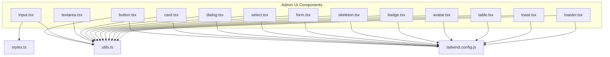

**Diagram sources**
- [button.tsx](file://admin/src/components/ui/button.tsx#L1-L58)
- [input.tsx](file://admin/src/components/ui/input.tsx#L1-L23)
- [textarea.tsx](file://admin/src/components/ui/textarea.tsx#L1-L23)
- [card.tsx](file://admin/src/components/ui/card.tsx#L1-L77)
- [dialog.tsx](file://admin/src/components/ui/dialog.tsx#L1-L121)
- [select.tsx](file://admin/src/components/ui/select.tsx#L1-L158)
- [form.tsx](file://admin/src/components/ui/form.tsx#L1-L177)
- [skeleton.tsx](file://admin/src/components/ui/skeleton.tsx#L1-L16)
- [badge.tsx](file://admin/src/components/ui/badge.tsx#L1-L37)
- [avatar.tsx](file://admin/src/components/ui/avatar.tsx#L1-L49)
- [table.tsx](file://admin/src/components/ui/table.tsx#L1-L121)
- [toast.tsx](file://admin/src/components/ui/toast.tsx#L1-L128)
- [toaster.tsx](file://admin/src/components/ui/toaster.tsx#L1-L36)
- [utils.ts](file://admin/src/lib/utils.ts#L1-L7)
- [styles.ts](file://admin/src/constants/styles.ts#L1-L2)
- [tailwind.config.js](file://admin/tailwind.config.js#L1-L82)

**Section sources**
- [button.tsx](file://admin/src/components/ui/button.tsx#L1-L58)
- [input.tsx](file://admin/src/components/ui/input.tsx#L1-L23)
- [card.tsx](file://admin/src/components/ui/card.tsx#L1-L77)
- [dialog.tsx](file://admin/src/components/ui/dialog.tsx#L1-L121)
- [select.tsx](file://admin/src/components/ui/select.tsx#L1-L158)
- [form.tsx](file://admin/src/components/ui/form.tsx#L1-L177)
- [skeleton.tsx](file://admin/src/components/ui/skeleton.tsx#L1-L16)
- [badge.tsx](file://admin/src/components/ui/badge.tsx#L1-L37)
- [avatar.tsx](file://admin/src/components/ui/avatar.tsx#L1-L49)
- [table.tsx](file://admin/src/components/ui/table.tsx#L1-L121)
- [toast.tsx](file://admin/src/components/ui/toast.tsx#L1-L128)
- [toaster.tsx](file://admin/src/components/ui/toaster.tsx#L1-L36)
- [utils.ts](file://admin/src/lib/utils.ts#L1-L7)
- [styles.ts](file://admin/src/constants/styles.ts#L1-L2)
- [tailwind.config.js](file://admin/tailwind.config.js#L1-L82)

## Core Components
This section summarizes the primary UI components and their composition patterns.

- Button
  - Variants: default, destructive, outline, secondary, ghost, link
  - Sizes: default, sm, lg, icon
  - Composition: Uses class variance authority for variants and accepts asChild to render a radix slot.
  - Props: Inherits button attributes plus variant, size, asChild.
  - Accessibility: Supports focus-visible outline and ring, disabled state handling.

- Input and Textarea
  - Base styling includes focus-visible ring, disabled states, and responsive text sizing.
  - Input supports type prop; Textarea supports rows/cols via component props.

- Card
  - Composition: Card, CardHeader, CardTitle, CardDescription, CardContent, CardFooter.
  - Props: Accepts standard div attributes; spacing and typography handled internally.

- Dialog
  - Composition: Root, Portal, Overlay, Trigger, Close, Content, Header, Footer, Title, Description.
  - Behavior: Animated overlay and content; close button with screen-reader label.

- Select
  - Composition: Root, Group, Value, Trigger, Content, Label, Item, Separator, ScrollUp/Down Buttons.
  - Behavior: Portal-based content with scroll buttons and indicator.

- Form
  - Composition: Form, FormField, FormItem, FormLabel, FormControl, FormDescription, FormMessage.
  - Hooks: useFormField provides ids and state for accessibility and error reporting.

- Skeleton
  - Behavior: Simple pulse animation with themed background color.

- Badge, Avatar, Table, Toast, Toaster
  - Badge: Variants default, secondary, destructive, outline.
  - Avatar: Root, Image, Fallback with overflow handling.
  - Table: Table, TableHeader, TableBody, TableFooter, TableRow, TableHead, TableCell, TableCaption.
  - Toast: Provider, Viewport, Toast, Title, Description, Action, Close.
  - Toaster: Client-side renderer mapping toast store to Toast components.

**Section sources**
- [button.tsx](file://admin/src/components/ui/button.tsx#L37-L57)
- [input.tsx](file://admin/src/components/ui/input.tsx#L5-L22)
- [textarea.tsx](file://admin/src/components/ui/textarea.tsx#L5-L22)
- [card.tsx](file://admin/src/components/ui/card.tsx#L5-L76)
- [dialog.tsx](file://admin/src/components/ui/dialog.tsx#L7-L120)
- [select.tsx](file://admin/src/components/ui/select.tsx#L7-L157)
- [form.tsx](file://admin/src/components/ui/form.tsx#L16-L176)
- [skeleton.tsx](file://admin/src/components/ui/skeleton.tsx#L3-L15)
- [badge.tsx](file://admin/src/components/ui/badge.tsx#L6-L36)
- [avatar.tsx](file://admin/src/components/ui/avatar.tsx#L6-L48)
- [table.tsx](file://admin/src/components/ui/table.tsx#L5-L120)
- [toast.tsx](file://admin/src/components/ui/toast.tsx#L8-L127)
- [toaster.tsx](file://admin/src/components/ui/toaster.tsx#L13-L35)

## Architecture Overview
The design system follows a modular, composable architecture:
- Components are self-contained and export a forwardRef wrapper with optional variants.
- Utilities centralize class merging and shared styling patterns.
- Tailwind CSS is configured to use CSS variables for theme tokens and supports dark mode via class strategy.
- Form components integrate with react-hook-form to provide accessible, typed field wiring.

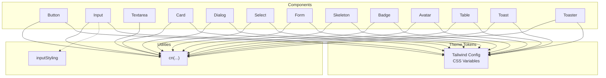

**Diagram sources**
- [utils.ts](file://admin/src/lib/utils.ts#L4-L6)
- [styles.ts](file://admin/src/constants/styles.ts#L1-L2)
- [tailwind.config.js](file://admin/tailwind.config.js#L8-L79)
- [button.tsx](file://admin/src/components/ui/button.tsx#L43-L54)
- [input.tsx](file://admin/src/components/ui/input.tsx#L5-L22)
- [card.tsx](file://admin/src/components/ui/card.tsx#L5-L17)
- [dialog.tsx](file://admin/src/components/ui/dialog.tsx#L15-L52)
- [select.tsx](file://admin/src/components/ui/select.tsx#L13-L98)
- [form.tsx](file://admin/src/components/ui/form.tsx#L29-L40)
- [skeleton.tsx](file://admin/src/components/ui/skeleton.tsx#L3-L15)
- [badge.tsx](file://admin/src/components/ui/badge.tsx#L6-L31)
- [avatar.tsx](file://admin/src/components/ui/avatar.tsx#L6-L46)
- [table.tsx](file://admin/src/components/ui/table.tsx#L5-L110)
- [toast.tsx](file://admin/src/components/ui/toast.tsx#L8-L54)
- [toaster.tsx](file://admin/src/components/ui/toaster.tsx#L13-L35)

## Detailed Component Analysis

### Button
- Composition pattern: ForwardRef component with optional asChild rendering via radix Slot.
- Variants and sizes: Defined via class variance authority; defaults applied when unspecified.
- Accessibility: Focus-visible outline and ring; disabled pointer-events and reduced opacity.
- Customization: Accepts className to merge with computed variants; supports SVG children with size/shrink rules.

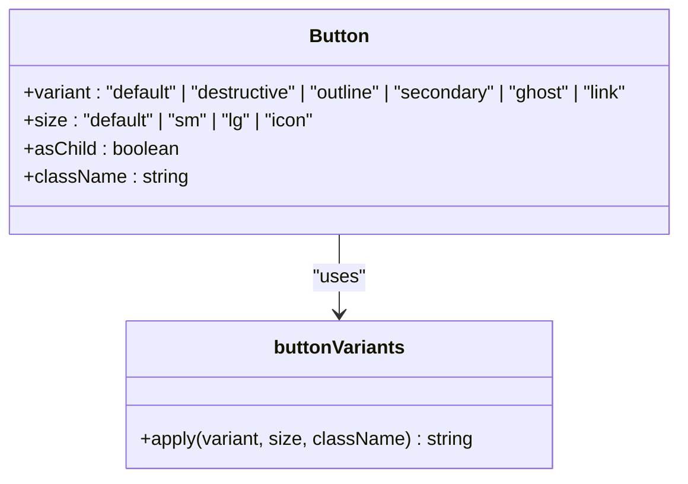

**Diagram sources**
- [button.tsx](file://admin/src/components/ui/button.tsx#L7-L35)
- [button.tsx](file://admin/src/components/ui/button.tsx#L43-L54)

**Section sources**
- [button.tsx](file://admin/src/components/ui/button.tsx#L7-L35)
- [button.tsx](file://admin/src/components/ui/button.tsx#L37-L57)
- [button.tsx](file://admin/src/components/ui/button.tsx#L43-L54)

### Input and Textarea
- Composition pattern: ForwardRef wrappers around native inputs with consistent base classes.
- Responsive behavior: Text size adjusts at larger breakpoints; focus-visible ring applied.
- Customization: Accepts className to extend base styles.

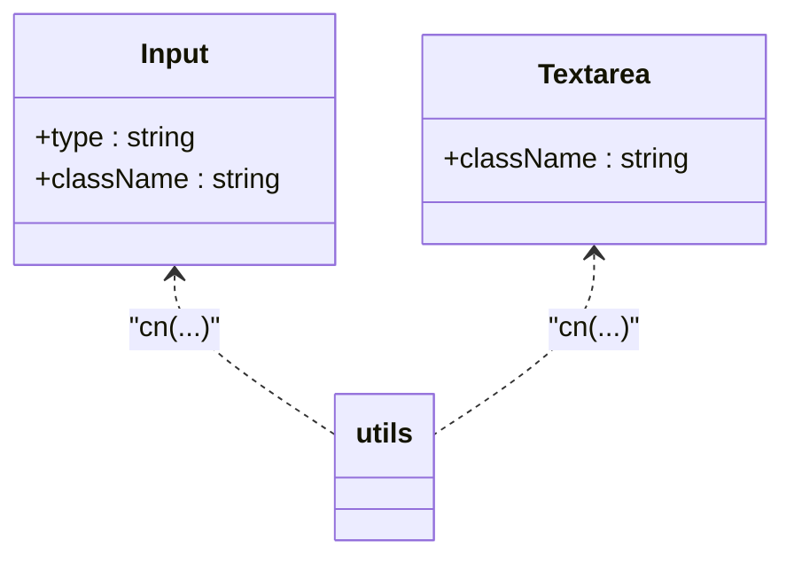

**Diagram sources**
- [input.tsx](file://admin/src/components/ui/input.tsx#L5-L22)
- [textarea.tsx](file://admin/src/components/ui/textarea.tsx#L5-L22)
- [utils.ts](file://admin/src/lib/utils.ts#L4-L6)

**Section sources**
- [input.tsx](file://admin/src/components/ui/input.tsx#L5-L22)
- [textarea.tsx](file://admin/src/components/ui/textarea.tsx#L5-L22)
- [utils.ts](file://admin/src/lib/utils.ts#L4-L6)

### Card
- Composition pattern: Multiple related components (Card, CardHeader, CardTitle, CardDescription, CardContent, CardFooter) that share consistent spacing and typography.
- Accessibility: No explicit ARIA attributes; relies on semantic HTML.

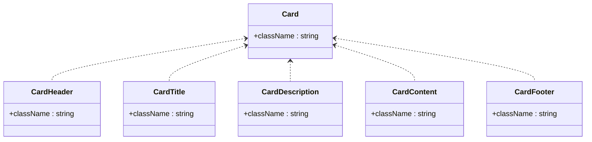

**Diagram sources**
- [card.tsx](file://admin/src/components/ui/card.tsx#L5-L76)

**Section sources**
- [card.tsx](file://admin/src/components/ui/card.tsx#L5-L76)

### Dialog
- Composition pattern: Root, Portal, Overlay, Trigger, Close, Content, Header, Footer, Title, Description.
- Animation and behavior: Uses radix animations and portal rendering; overlay backdrop with fade and slide transitions.
- Accessibility: Close button includes screen-reader-only label; focus management via radix.

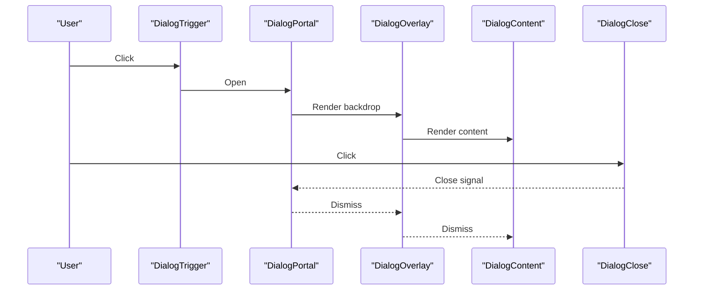

**Diagram sources**
- [dialog.tsx](file://admin/src/components/ui/dialog.tsx#L7-L52)

**Section sources**
- [dialog.tsx](file://admin/src/components/ui/dialog.tsx#L7-L120)

### Select
- Composition pattern: Root, Group, Value, Trigger, Content, Label, Item, Separator, ScrollUp/Down Buttons.
- Behavior: Portal-based viewport with scroll buttons; item indicators and chevrons; popper positioning adjustments.

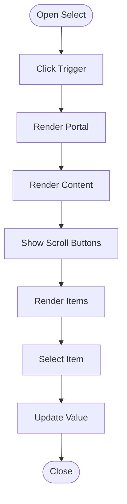

**Diagram sources**
- [select.tsx](file://admin/src/components/ui/select.tsx#L13-L98)

**Section sources**
- [select.tsx](file://admin/src/components/ui/select.tsx#L13-L157)

### Form
- Composition pattern: Form provider, FormField container, FormItem wrapper, FormLabel, FormControl, FormDescription, FormMessage.
- Integration: useFormField reads field state and generates ids for accessibility; integrates with react-hook-form.

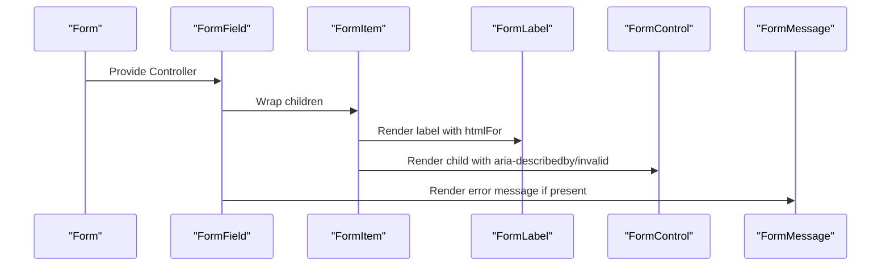

**Diagram sources**
- [form.tsx](file://admin/src/components/ui/form.tsx#L16-L176)

**Section sources**
- [form.tsx](file://admin/src/components/ui/form.tsx#L16-L176)

### Skeleton
- Behavior: Applies a pulse animation with a themed background derived from CSS variables.

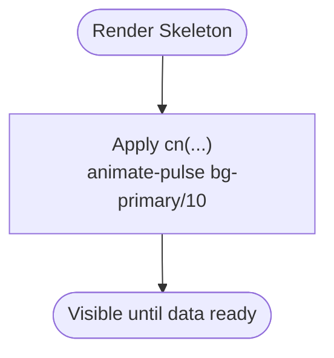

**Diagram sources**
- [skeleton.tsx](file://admin/src/components/ui/skeleton.tsx#L3-L15)

**Section sources**
- [skeleton.tsx](file://admin/src/components/ui/skeleton.tsx#L3-L15)

### Badge, Avatar, Table, Toast, Toaster
- Badge: Variants default, secondary, destructive, outline; uses class variance authority.
- Avatar: Root, Image, Fallback with overflow and aspect ratio handling.
- Table: Scrollable wrapper with consistent header/body/footer/row/cell styles.
- Toast: Provider, Viewport, Toast, Title, Description, Action, Close; supports destructive variant.
- Toaster: Client-side renderer mapping toast store to Toast components.

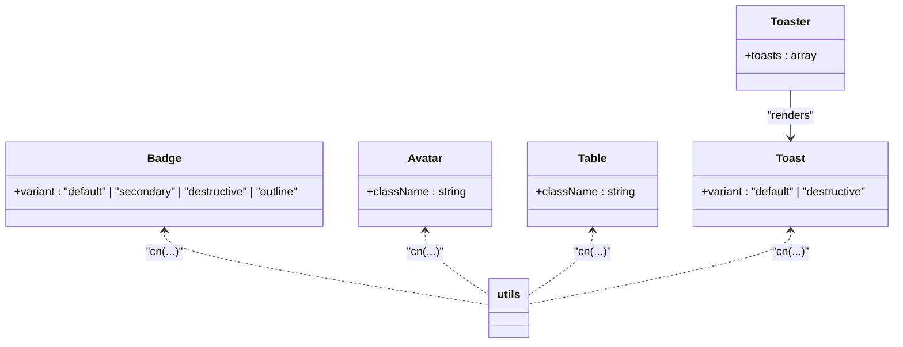

**Diagram sources**
- [badge.tsx](file://admin/src/components/ui/badge.tsx#L6-L36)
- [avatar.tsx](file://admin/src/components/ui/avatar.tsx#L6-L48)
- [table.tsx](file://admin/src/components/ui/table.tsx#L5-L120)
- [toast.tsx](file://admin/src/components/ui/toast.tsx#L25-L54)
- [toaster.tsx](file://admin/src/components/ui/toaster.tsx#L13-L35)
- [utils.ts](file://admin/src/lib/utils.ts#L4-L6)

**Section sources**
- [badge.tsx](file://admin/src/components/ui/badge.tsx#L6-L36)
- [avatar.tsx](file://admin/src/components/ui/avatar.tsx#L6-L48)
- [table.tsx](file://admin/src/components/ui/table.tsx#L5-L120)
- [toast.tsx](file://admin/src/components/ui/toast.tsx#L25-L54)
- [toaster.tsx](file://admin/src/components/ui/toaster.tsx#L13-L35)
- [utils.ts](file://admin/src/lib/utils.ts#L4-L6)

## Dependency Analysis
- Component coupling: Components depend on shared utilities for class merging and on Tailwind CSS for styling.
- Dark mode: Controlled via Tailwind’s class strategy; CSS variables define theme tokens.
- External libraries: Radix UI primitives for accessible overlays and controls; Lucide icons for UI symbols; class-variance-authority for variants; react-hook-form for form integration.

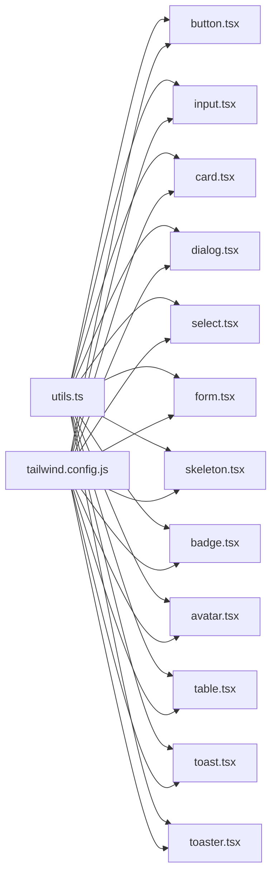

**Diagram sources**
- [utils.ts](file://admin/src/lib/utils.ts#L4-L6)
- [tailwind.config.js](file://admin/tailwind.config.js#L8-L79)
- [button.tsx](file://admin/src/components/ui/button.tsx#L43-L54)
- [input.tsx](file://admin/src/components/ui/input.tsx#L5-L22)
- [card.tsx](file://admin/src/components/ui/card.tsx#L5-L17)
- [dialog.tsx](file://admin/src/components/ui/dialog.tsx#L15-L52)
- [select.tsx](file://admin/src/components/ui/select.tsx#L13-L98)
- [form.tsx](file://admin/src/components/ui/form.tsx#L29-L40)
- [skeleton.tsx](file://admin/src/components/ui/skeleton.tsx#L3-L15)
- [badge.tsx](file://admin/src/components/ui/badge.tsx#L6-L31)
- [avatar.tsx](file://admin/src/components/ui/avatar.tsx#L6-L46)
- [table.tsx](file://admin/src/components/ui/table.tsx#L5-L110)
- [toast.tsx](file://admin/src/components/ui/toast.tsx#L8-L54)
- [toaster.tsx](file://admin/src/components/ui/toaster.tsx#L13-L35)

**Section sources**
- [utils.ts](file://admin/src/lib/utils.ts#L4-L6)
- [tailwind.config.js](file://admin/tailwind.config.js#L8-L79)
- [button.tsx](file://admin/src/components/ui/button.tsx#L43-L54)
- [input.tsx](file://admin/src/components/ui/input.tsx#L5-L22)
- [card.tsx](file://admin/src/components/ui/card.tsx#L5-L17)
- [dialog.tsx](file://admin/src/components/ui/dialog.tsx#L15-L52)
- [select.tsx](file://admin/src/components/ui/select.tsx#L13-L98)
- [form.tsx](file://admin/src/components/ui/form.tsx#L29-L40)
- [skeleton.tsx](file://admin/src/components/ui/skeleton.tsx#L3-L15)
- [badge.tsx](file://admin/src/components/ui/badge.tsx#L6-L31)
- [avatar.tsx](file://admin/src/components/ui/avatar.tsx#L6-L46)
- [table.tsx](file://admin/src/components/ui/table.tsx#L5-L110)
- [toast.tsx](file://admin/src/components/ui/toast.tsx#L8-L54)
- [toaster.tsx](file://admin/src/components/ui/toaster.tsx#L13-L35)

## Performance Considerations
- Class merging: Using a single cn(...) utility reduces style conflicts and improves maintainability.
- CSS variables: Tailwind’s CSS variable-based theme minimizes reflows and enables efficient dark/light toggling.
- Animations: Lightweight animations via radix and Tailwind; avoid heavy transforms on frequently updated nodes.
- Skeletons: Use skeleton components to prevent layout shifts and improve perceived performance during data fetches.

[No sources needed since this section provides general guidance]

## Troubleshooting Guide
- Disabled state not applying: Verify disabled prop is passed to Button/Input/Textarea and that variant classes do not override disabled styles.
- Focus ring missing: Ensure focus-visible utilities are included and that components forward refs properly.
- Form errors not visible: Confirm useFormField is used inside FormItem and that aria-describedby/aria-invalid are set on FormControl.
- Dialog not closing: Check that DialogClose is rendered and that Portal wraps Content and Overlay.
- Select not opening: Confirm Trigger renders and that Portal is present; verify viewport height variables are set.

**Section sources**
- [button.tsx](file://admin/src/components/ui/button.tsx#L43-L54)
- [input.tsx](file://admin/src/components/ui/input.tsx#L5-L22)
- [form.tsx](file://admin/src/components/ui/form.tsx#L104-L123)
- [dialog.tsx](file://admin/src/components/ui/dialog.tsx#L30-L52)
- [select.tsx](file://admin/src/components/ui/select.tsx#L68-L98)

## Conclusion
The design system emphasizes composability, accessibility, and consistency. Components are built with clear separation of concerns, shared utilities, and a robust theme system powered by Tailwind CSS variables and dark mode. Integrating with react-hook-form and radix primitives ensures reliable UX patterns across the application.

[No sources needed since this section summarizes without analyzing specific files]

## Appendices

### Theme System and Dark Mode
- Tailwind CSS variables: Colors and radii are defined via CSS variables; dark mode enabled via class strategy.
- Token usage: Components consume tokens like foreground, background, primary, secondary, muted, accent, destructive, border, input, ring, and chart colors.
- Dark mode toggle: Implement a class-based switch on the root element to flip between light and dark tokens.

**Section sources**
- [tailwind.config.js](file://admin/tailwind.config.js#L8-L79)

### Styling Approaches and Tailwind Configuration
- Utility-first: Components rely on Tailwind utilities merged via cn(...) for consistent spacing, colors, and typography.
- Variants: class-variance-authority manages variant classes; defaults ensure predictable behavior.
- Responsive: Breakpoint-specific utilities adjust text sizes and padding.

**Section sources**
- [utils.ts](file://admin/src/lib/utils.ts#L4-L6)
- [button.tsx](file://admin/src/components/ui/button.tsx#L7-L35)
- [input.tsx](file://admin/src/components/ui/input.tsx#L10-L13)

### Accessibility Features
- Focus management: Focus-visible outlines and rings; proper tabindex handling via radix primitives.
- Labels and descriptions: FormLabel and FormDescription connect to inputs via generated ids.
- Screen reader support: DialogClose includes a screen-reader-only label; Select items expose indicators.

**Section sources**
- [button.tsx](file://admin/src/components/ui/button.tsx#L43-L54)
- [form.tsx](file://admin/src/components/ui/form.tsx#L87-L123)
- [dialog.tsx](file://admin/src/components/ui/dialog.tsx#L45-L48)
- [select.tsx](file://admin/src/components/ui/select.tsx#L112-L131)

### Responsive Design Patterns
- Breakpoints: md:text-sm and similar utilities adjust typography at larger screens.
- Layout containers: Table is wrapped in an overflow container; Dialog centers with responsive animations.

**Section sources**
- [input.tsx](file://admin/src/components/ui/input.tsx#L10-L13)
- [table.tsx](file://admin/src/components/ui/table.tsx#L8-L15)
- [dialog.tsx](file://admin/src/components/ui/dialog.tsx#L36-L41)

### Cross-Browser Compatibility
- Radix primitives: Provide cross-browser accessibility and interaction guarantees.
- CSS variables: Supported broadly; ensure fallbacks are considered if targeting very old browsers.
- Animations: Use Tailwind’s pre-defined keyframes and transitions for consistent behavior.

**Section sources**
- [tailwind.config.js](file://admin/tailwind.config.js#L57-L78)
- [dialog.tsx](file://admin/src/components/ui/dialog.tsx#L19-L27)

### Component Testing Strategies
- Unit tests: Render components with various props (variants, sizes, disabled) and assert class combinations via snapshot or DOM queries.
- Form tests: Simulate react-hook-form contexts and validate aria attributes and error messages.
- Interaction tests: Verify dialogs open/close, selects scroll and update values, and toasts render with correct variant classes.
- Accessibility tests: Use automated tools to check focus order, labels, and ARIA attributes.

[No sources needed since this section provides general guidance]

### Integration Guidelines
- Import components from the UI directory and compose them in pages or layouts.
- Use cn(...) to extend base styles while preserving component defaults.
- For forms, wrap fields with FormItem/FormLabel/FormControl/FormDescription/FormMessage and pass field names to FormField.
- For dialogs and selects, ensure Portal is present and that triggers are correctly wired.

**Section sources**
- [form.tsx](file://admin/src/components/ui/form.tsx#L16-L176)
- [dialog.tsx](file://admin/src/components/ui/dialog.tsx#L7-L52)
- [select.tsx](file://admin/src/components/ui/select.tsx#L7-L98)
- [utils.ts](file://admin/src/lib/utils.ts#L4-L6)