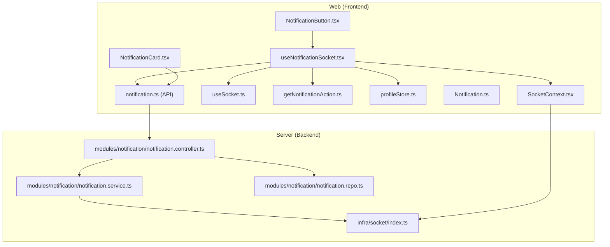
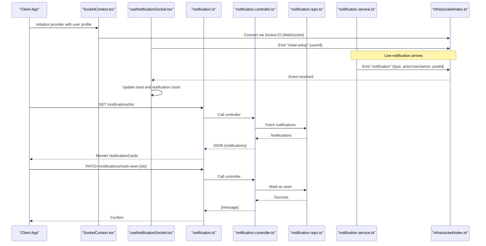
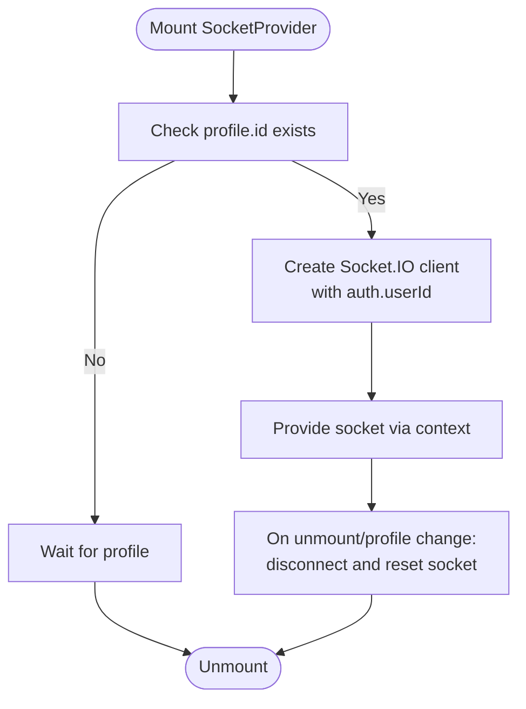
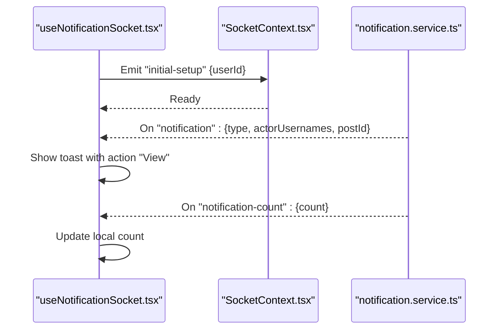
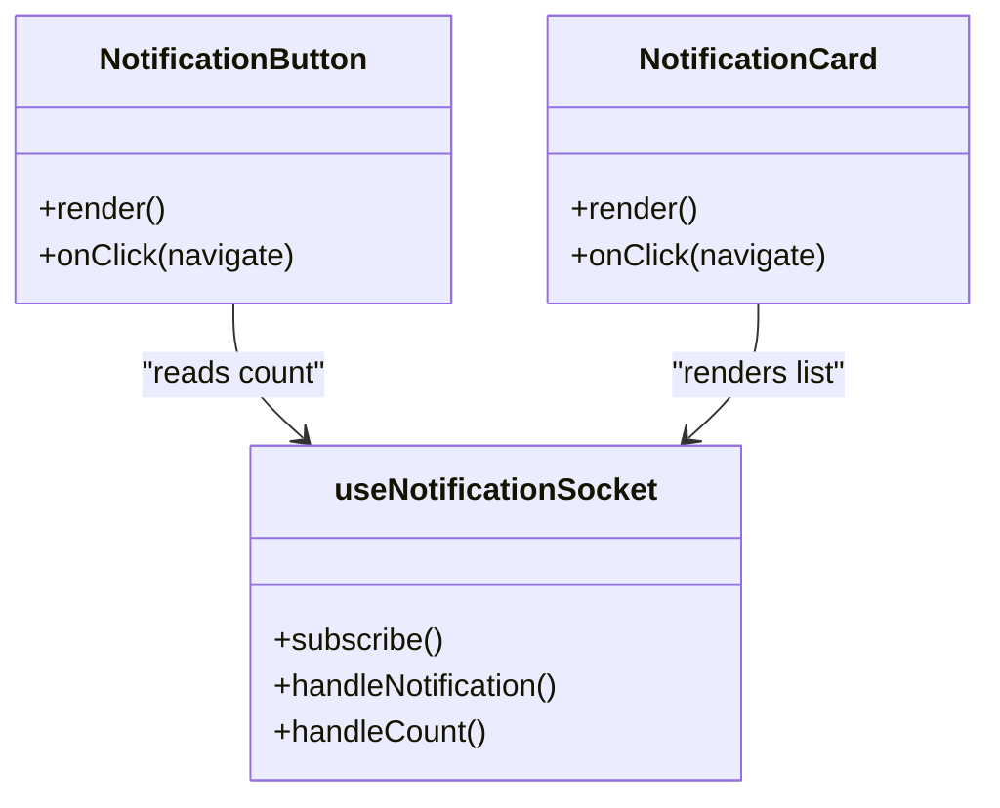
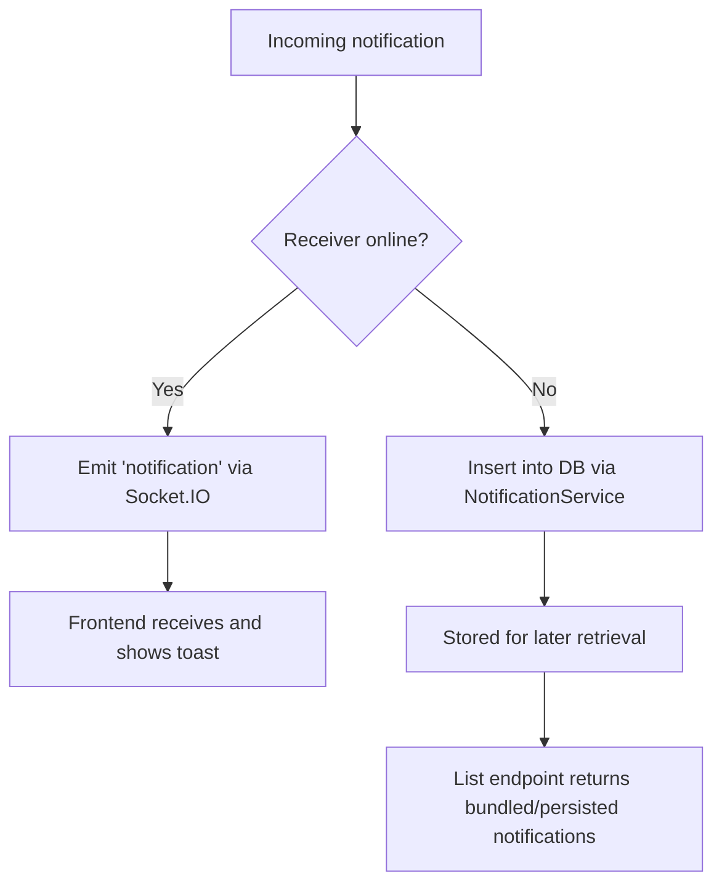
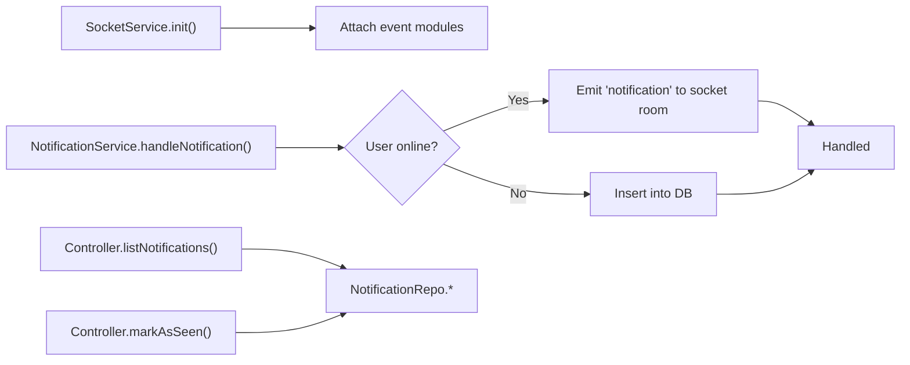
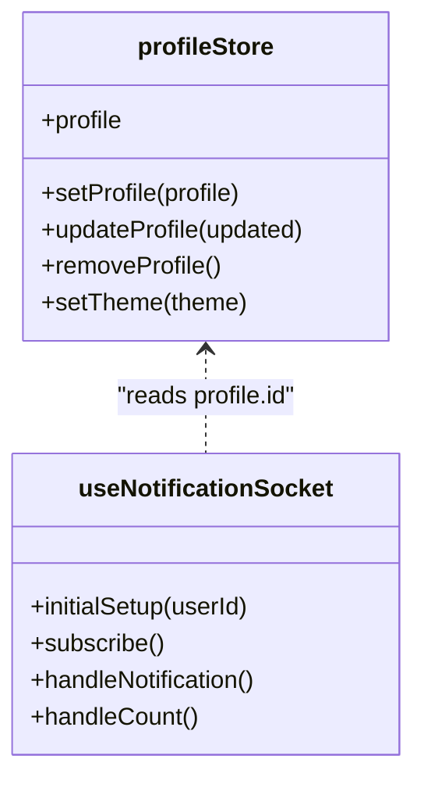
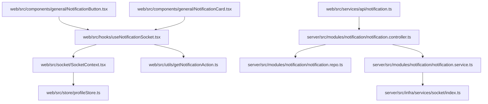

# Real-time Notifications

<cite>
**Referenced Files in This Document**
- [SocketContext.tsx](file://web/src/socket/SocketContext.tsx)
- [useSocket.ts](file://web/src/socket/useSocket.ts)
- [useNotificationSocket.tsx](file://web/src/hooks/useNotificationSocket.tsx)
- [NotificationButton.tsx](file://web/src/components/general/NotificationButton.tsx)
- [NotificationCard.tsx](file://web/src/components/general/NotificationCard.tsx)
- [getNotificationAction.ts](file://web/src/utils/getNotificationAction.ts)
- [profileStore.ts](file://web/src/store/profileStore.ts)
- [Notification.ts](file://web/src/types/Notification.ts)
- [notification.ts](file://web/src/services/api/notification.ts)
- [index.ts](file://server/src/infra/services/socket/index.ts)
- [notification.service.ts](file://server/src/modules/notification/notification.service.ts)
- [notification.controller.ts](file://server/src/modules/notification/notification.controller.ts)
- [notification.repo.ts](file://server/src/modules/notification/notification.repo.ts)
</cite>

## Table of Contents
1. [Introduction](#introduction)
2. [Project Structure](#project-structure)
3. [Core Components](#core-components)
4. [Architecture Overview](#architecture-overview)
5. [Detailed Component Analysis](#detailed-component-analysis)
6. [Dependency Analysis](#dependency-analysis)
7. [Performance Considerations](#performance-considerations)
8. [Troubleshooting Guide](#troubleshooting-guide)
9. [Conclusion](#conclusion)
10. [Appendices](#appendices)

## Introduction
This document explains the real-time notification system powered by WebSocket connections. It covers the SocketContext implementation, connection lifecycle, event handling, and user-facing components. It also documents notification types, message formatting, delivery mechanisms, bundling, and persistence. Finally, it outlines integration with the backend notification service, error recovery, connection resilience, and performance optimizations.

## Project Structure
The notification system spans the frontend and backend:
- Frontend
  - Socket provider and hook for connection management
  - React hooks and components for real-time updates and UI
  - Types and API clients for notifications
- Backend
  - Socket service initialization and event attachment
  - Notification service for emitting and persisting notifications
  - Controllers and repositories for listing and marking notifications as seen

**Diagram sources**
- [SocketContext.tsx](file://web/src/socket/SocketContext.tsx#L1-L47)
- [useSocket.ts](file://web/src/socket/useSocket.ts#L1-L9)
- [useNotificationSocket.tsx](file://web/src/hooks/useNotificationSocket.tsx#L1-L47)
- [NotificationButton.tsx](file://web/src/components/general/NotificationButton.tsx#L1-L20)
- [NotificationCard.tsx](file://web/src/components/general/NotificationCard.tsx#L1-L28)
- [getNotificationAction.ts](file://web/src/utils/getNotificationAction.ts#L1-L19)
- [profileStore.ts](file://web/src/store/profileStore.ts#L1-L57)
- [Notification.ts](file://web/src/types/Notification.ts#L1-L24)
- [notification.ts](file://web/src/services/api/notification.ts#L1-L12)
- [index.ts](file://server/src/infra/services/socket/index.ts#L1-L48)
- [notification.service.ts](file://server/src/modules/notification/notification.service.ts#L1-L209)
- [notification.controller.ts](file://server/src/modules/notification/notification.controller.ts#L1-L47)
- [notification.repo.ts](file://server/src/modules/notification/notification.repo.ts#L1-L20)

**Section sources**
- [SocketContext.tsx](file://web/src/socket/SocketContext.tsx#L1-L47)
- [useSocket.ts](file://web/src/socket/useSocket.ts#L1-L9)
- [useNotificationSocket.tsx](file://web/src/hooks/useNotificationSocket.tsx#L1-L47)
- [NotificationButton.tsx](file://web/src/components/general/NotificationButton.tsx#L1-L20)
- [NotificationCard.tsx](file://web/src/components/general/NotificationCard.tsx#L1-L28)
- [getNotificationAction.ts](file://web/src/utils/getNotificationAction.ts#L1-L19)
- [profileStore.ts](file://web/src/store/profileStore.ts#L1-L57)
- [Notification.ts](file://web/src/types/Notification.ts#L1-L24)
- [notification.ts](file://web/src/services/api/notification.ts#L1-L12)
- [index.ts](file://server/src/infra/services/socket/index.ts#L1-L48)
- [notification.service.ts](file://server/src/modules/notification/notification.service.ts#L1-L209)
- [notification.controller.ts](file://server/src/modules/notification/notification.controller.ts#L1-L47)
- [notification.repo.ts](file://server/src/modules/notification/notification.repo.ts#L1-L20)

## Core Components
- SocketContext and useSocket
  - Establishes a WebSocket connection using Socket.IO with transport set to WebSocket and authenticates via user ID.
  - Provides a context provider and hook for downstream components to access the socket instance.
- useNotificationSocket
  - Manages real-time notification events and counts.
  - Emits an initial setup event with the user ID, listens for “notification” and “notification-count”, and triggers UI updates and navigation.
- NotificationButton
  - Displays the unread notification count and navigates to the notifications page.
- NotificationCard
  - Renders individual notifications with icons and formatted messages based on type and actors.
- Notification types and formatting
  - Notification types include general, upvoted_post, upvoted_comment, replied, posted.
  - Message formatting is derived from the notification type and actor usernames.
- API integration
  - Lists and marks notifications as seen via REST endpoints.

**Section sources**
- [SocketContext.tsx](file://web/src/socket/SocketContext.tsx#L1-L47)
- [useSocket.ts](file://web/src/socket/useSocket.ts#L1-L9)
- [useNotificationSocket.tsx](file://web/src/hooks/useNotificationSocket.tsx#L1-L47)
- [NotificationButton.tsx](file://web/src/components/general/NotificationButton.tsx#L1-L20)
- [NotificationCard.tsx](file://web/src/components/general/NotificationCard.tsx#L1-L28)
- [getNotificationAction.ts](file://web/src/utils/getNotificationAction.ts#L1-L19)
- [Notification.ts](file://web/src/types/Notification.ts#L1-L24)
- [notification.ts](file://web/src/services/api/notification.ts#L1-L12)

## Architecture Overview
The system uses a client-server WebSocket architecture:
- Frontend
  - SocketContext initializes a WebSocket connection with authentication.
  - useNotificationSocket subscribes to real-time events and manages local state.
  - UI components render notifications and drive user interactions.
- Backend
  - SocketService initializes Socket.IO with CORS and transport settings.
  - NotificationService emits live notifications to online users and persists them to the database.
  - Controllers expose endpoints to list and mark notifications as seen.

**Diagram sources**
- [SocketContext.tsx](file://web/src/socket/SocketContext.tsx#L16-L44)
- [useNotificationSocket.tsx](file://web/src/hooks/useNotificationSocket.tsx#L14-L43)
- [notification.ts](file://web/src/services/api/notification.ts#L3-L10)
- [notification.controller.ts](file://server/src/modules/notification/notification.controller.ts#L7-L24)
- [notification.repo.ts](file://server/src/modules/notification/notification.repo.ts#L3-L18)
- [notification.service.ts](file://server/src/modules/notification/notification.service.ts#L28-L140)
- [index.ts](file://server/src/infra/services/socket/index.ts#L10-L32)

## Detailed Component Analysis

### SocketContext and Connection Management
- Initializes a Socket.IO client with WebSocket transport and passes the authenticated user ID.
- Disconnects and cleans up on unmount or when the profile ID changes.
- Exposes a context provider for downstream components.

**Diagram sources**
- [SocketContext.tsx](file://web/src/socket/SocketContext.tsx#L16-L44)

**Section sources**
- [SocketContext.tsx](file://web/src/socket/SocketContext.tsx#L1-L47)
- [useSocket.ts](file://web/src/socket/useSocket.ts#L1-L9)

### Real-time Event Handling and Subscription
- Subscribes to two primary events:
  - notification: displays a toast with a formatted message and a View action that navigates to the post.
  - notification-count: updates the unread count shown on the NotificationButton.
- Emits an initial-setup event with the authenticated user ID to synchronize state.

**Diagram sources**
- [useNotificationSocket.tsx](file://web/src/hooks/useNotificationSocket.tsx#L14-L43)
- [SocketContext.tsx](file://web/src/socket/SocketContext.tsx#L20-L37)
- [notification.service.ts](file://server/src/modules/notification/notification.service.ts#L29-L55)

**Section sources**
- [useNotificationSocket.tsx](file://web/src/hooks/useNotificationSocket.tsx#L1-L47)
- [getNotificationAction.ts](file://web/src/utils/getNotificationAction.ts#L1-L19)

### Notification UI Components
- NotificationButton
  - Renders a bell icon with an absolute red dot indicating unread count.
  - Navigates to the notifications page when clicked.
- NotificationCard
  - Displays a compact row with an icon and a message derived from type and actor usernames.
  - Supports navigation to the associated post.

**Diagram sources**
- [NotificationButton.tsx](file://web/src/components/general/NotificationButton.tsx#L5-L17)
- [NotificationCard.tsx](file://web/src/components/general/NotificationCard.tsx#L6-L25)
- [useNotificationSocket.tsx](file://web/src/hooks/useNotificationSocket.tsx#L9-L46)

**Section sources**
- [NotificationButton.tsx](file://web/src/components/general/NotificationButton.tsx#L1-L20)
- [NotificationCard.tsx](file://web/src/components/general/NotificationCard.tsx#L1-L28)

### Notification Types, Formatting, and Delivery
- Notification types
  - general, upvoted_post, upvoted_comment, replied, posted.
- Message formatting
  - Uses a mapping function to derive concise, readable messages based on type.
- Delivery mechanism
  - Live delivery via WebSocket when the user is online.
  - Bundling aggregates multiple actor usernames for the same receiver/post/type/content combination.
  - Persistence via MongoDB through the repository layer.

**Diagram sources**
- [notification.service.ts](file://server/src/modules/notification/notification.service.ts#L29-L55)
- [notification.service.ts](file://server/src/modules/notification/notification.service.ts#L57-L122)
- [notification.service.ts](file://server/src/modules/notification/notification.service.ts#L184-L208)

**Section sources**
- [Notification.ts](file://web/src/types/Notification.ts#L3-L21)
- [getNotificationAction.ts](file://web/src/utils/getNotificationAction.ts#L3-L16)
- [notification.service.ts](file://server/src/modules/notification/notification.service.ts#L9-L26)
- [notification.service.ts](file://server/src/modules/notification/notification.service.ts#L57-L122)
- [notification.service.ts](file://server/src/modules/notification/notification.service.ts#L184-L208)

### Backend Notification Service and Persistence
- SocketService
  - Initializes Socket.IO with CORS and WebSocket transport.
  - Attaches event modules on connection.
- NotificationService
  - Checks if the receiver is online and emits the notification immediately.
  - Bundles notifications to reduce noise and duplicates.
  - Inserts notifications into the database for offline retrieval.
- Controllers and Repositories
  - Controllers expose endpoints to list notifications and mark as seen.
  - Repositories abstract read/write operations to the adapter layer.

**Diagram sources**
- [index.ts](file://server/src/infra/services/socket/index.ts#L10-L32)
- [notification.service.ts](file://server/src/modules/notification/notification.service.ts#L124-L140)
- [notification.controller.ts](file://server/src/modules/notification/notification.controller.ts#L7-L24)
- [notification.repo.ts](file://server/src/modules/notification/notification.repo.ts#L3-L18)

**Section sources**
- [index.ts](file://server/src/infra/services/socket/index.ts#L1-L48)
- [notification.service.ts](file://server/src/modules/notification/notification.service.ts#L1-L209)
- [notification.controller.ts](file://server/src/modules/notification/notification.controller.ts#L1-L47)
- [notification.repo.ts](file://server/src/modules/notification/notification.repo.ts#L1-L20)

### Frontend Store and State Synchronization
- profileStore
  - Holds the authenticated user’s profile and theme.
  - Provides setters and updates persisted theme to localStorage.
- useNotificationSocket
  - Reads profile id from profileStore to emit initial-setup.
  - Maintains local notificationCount and toast-driven UX.

**Diagram sources**
- [profileStore.ts](file://web/src/store/profileStore.ts#L14-L54)
- [useNotificationSocket.tsx](file://web/src/hooks/useNotificationSocket.tsx#L17-L18)
- [useNotificationSocket.tsx](file://web/src/hooks/useNotificationSocket.tsx#L20-L34)

**Section sources**
- [profileStore.ts](file://web/src/store/profileStore.ts#L1-L57)
- [useNotificationSocket.tsx](file://web/src/hooks/useNotificationSocket.tsx#L1-L47)

## Dependency Analysis
- Frontend dependencies
  - SocketContext depends on environment configuration and profileStore.
  - useNotificationSocket depends on SocketContext, profileStore, toast library, router, and notification action formatter.
  - NotificationButton and NotificationCard depend on useNotificationSocket and notification API.
- Backend dependencies
  - SocketService depends on environment configuration and event modules.
  - NotificationService depends on Socket.IO instance, repository, and logging.

**Diagram sources**
- [SocketContext.tsx](file://web/src/socket/SocketContext.tsx#L1-L47)
- [profileStore.ts](file://web/src/store/profileStore.ts#L1-L57)
- [useNotificationSocket.tsx](file://web/src/hooks/useNotificationSocket.tsx#L1-L47)
- [getNotificationAction.ts](file://web/src/utils/getNotificationAction.ts#L1-L19)
- [NotificationButton.tsx](file://web/src/components/general/NotificationButton.tsx#L1-L20)
- [NotificationCard.tsx](file://web/src/components/general/NotificationCard.tsx#L1-L28)
- [notification.ts](file://web/src/services/api/notification.ts#L1-L12)
- [notification.controller.ts](file://server/src/modules/notification/notification.controller.ts#L1-L47)
- [notification.repo.ts](file://server/src/modules/notification/notification.repo.ts#L1-L20)
- [notification.service.ts](file://server/src/modules/notification/notification.service.ts#L1-L209)
- [index.ts](file://server/src/infra/services/socket/index.ts#L1-L48)

**Section sources**
- [SocketContext.tsx](file://web/src/socket/SocketContext.tsx#L1-L47)
- [useNotificationSocket.tsx](file://web/src/hooks/useNotificationSocket.tsx#L1-L47)
- [notification.ts](file://web/src/services/api/notification.ts#L1-L12)
- [notification.controller.ts](file://server/src/modules/notification/notification.controller.ts#L1-L47)
- [notification.service.ts](file://server/src/modules/notification/notification.service.ts#L1-L209)
- [index.ts](file://server/src/infra/services/socket/index.ts#L1-L48)

## Performance Considerations
- Bundling
  - The backend bundles notifications per receiver/post/type/content to reduce redundant events and improve perceived performance.
- Transport
  - WebSocket transport is configured on both frontend and backend for efficient, low-latency communication.
- Local caching
  - The frontend maintains a local notificationCount and toast-driven UX to avoid unnecessary re-renders.
- Persistence
  - Notifications are persisted to the database for later retrieval, ensuring reliability even when users are offline.
- Recommendations
  - Debounce or throttle frequent notifications if needed.
  - Consider pagination for listing notifications to limit payload sizes.
  - Implement exponential backoff for reconnection attempts if extending the frontend socket logic.

[No sources needed since this section provides general guidance]

## Troubleshooting Guide
- Socket connection issues
  - Verify environment variables for the server endpoint and CORS origins.
  - Ensure the user profile is loaded before attempting to connect.
- No real-time notifications
  - Confirm the initial-setup event is emitted and the socket is connected.
  - Check that the backend emits the notification event to the correct socket room.
- Toast not appearing
  - Ensure the toast library is properly configured and the notification event handler is attached.
- Count not updating
  - Verify the notification-count event handler is subscribed and the backend emits the correct payload.
- Backend errors
  - Review logs for failures during emission or database insertion.
  - Validate repository operations and controller error handling.

**Section sources**
- [SocketContext.tsx](file://web/src/socket/SocketContext.tsx#L20-L37)
- [useNotificationSocket.tsx](file://web/src/hooks/useNotificationSocket.tsx#L14-L43)
- [notification.service.ts](file://server/src/modules/notification/notification.service.ts#L29-L55)
- [notification.controller.ts](file://server/src/modules/notification/notification.controller.ts#L16-L23)

## Conclusion
The real-time notification system combines a robust WebSocket layer with a clean frontend hook and UI components. It supports live updates, bundling, persistence, and REST endpoints for listing and marking notifications as seen. The architecture emphasizes reliability, performance, and a smooth user experience.

[No sources needed since this section summarizes without analyzing specific files]

## Appendices

### Notification Types Reference
- general: Generic notification
- upvoted_post: Multiple actors liked the same post
- upvoted_comment: Multiple actors liked the same comment
- replied: Actor replied to the post
- posted: Actor posted something

**Section sources**
- [Notification.ts](file://web/src/types/Notification.ts#L3-L21)
- [getNotificationAction.ts](file://web/src/utils/getNotificationAction.ts#L3-L16)

### API Endpoints
- GET /notifications/list
  - Returns a list of notifications for the authenticated user.
- PATCH /notifications/mark-seen
  - Marks the given notification IDs as seen.

**Section sources**
- [notification.ts](file://web/src/services/api/notification.ts#L3-L10)
- [notification.controller.ts](file://server/src/modules/notification/notification.controller.ts#L7-L24)