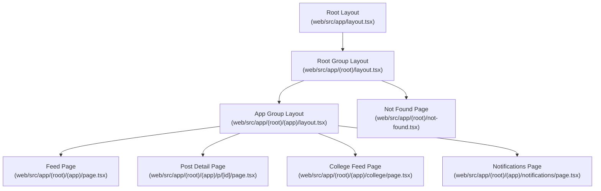
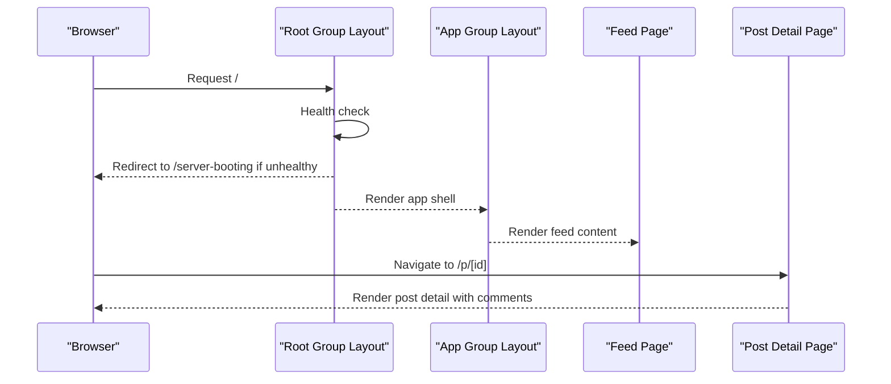
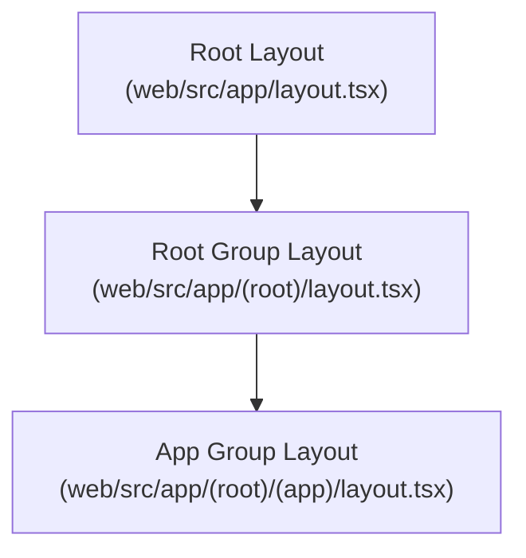
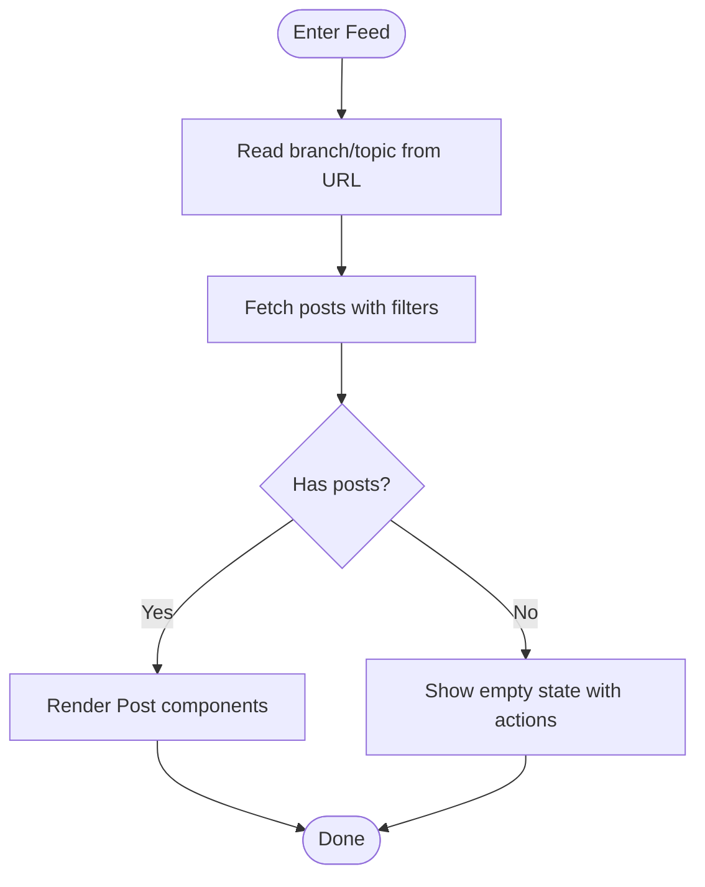
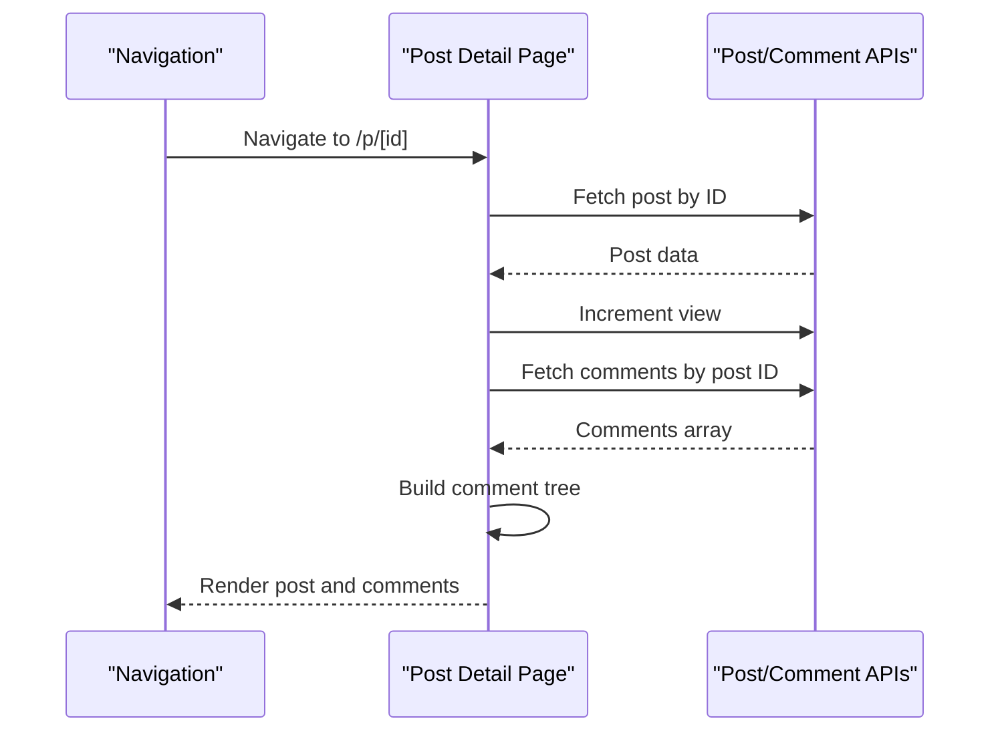
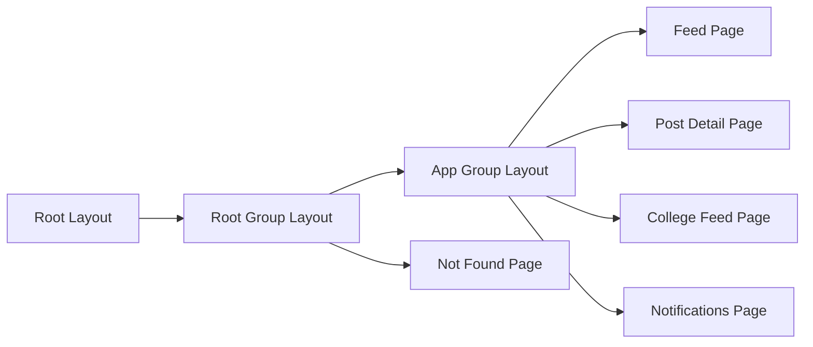

# Routing & Navigation

<cite>
**Referenced Files in This Document**
- [layout.tsx](file://web/src/app/layout.tsx)
- [layout.tsx](file://web/src/app/(root)/layout.tsx)
- [not-found.tsx](file://web/src/app/(root)/not-found.tsx)
- [layout.tsx](file://web/src/app/(root)/(app)/layout.tsx)
- [page.tsx](file://web/src/app/(root)/(app)/page.tsx)
- [page.tsx](file://web/src/app/(root)/(app)/p/[id]/page.tsx)
- [page.tsx](file://web/src/app/(root)/(app)/college/page.tsx)
- [page.tsx](file://web/src/app/(root)/(app)/notifications/page.tsx)
- [auth-client.ts](file://web/src/lib/auth-client.ts)
</cite>

## Table of Contents
1. [Introduction](#introduction)
2. [Project Structure](#project-structure)
3. [Core Components](#core-components)
4. [Architecture Overview](#architecture-overview)
5. [Detailed Component Analysis](#detailed-component-analysis)
6. [Dependency Analysis](#dependency-analysis)
7. [Performance Considerations](#performance-considerations)
8. [Troubleshooting Guide](#troubleshooting-guide)
9. [Conclusion](#conclusion)

## Introduction
This document explains the routing and navigation system built with Next.js App Router. It covers route groups, nested layouts, dynamic routes for posts and user profiles, navigation patterns, active link highlighting, protected/public route strategies, SEO and metadata, and performance optimizations. It also outlines how authentication integrates with navigation and how the system handles server health checks and 404 handling.

## Project Structure
The routing model centers around three primary layout layers:
- Root layout: top-level layout and global health check redirection.
- App layout group: main application shell with sidebar, trending panel, and active navigation highlighting.
- Page routes: content pages such as feed, post detail, college feed, notifications, and user sub-app.

**Diagram sources**
- [layout.tsx](file://web/src/app/layout.tsx#L1-L35)
- [layout.tsx](file://web/src/app/(root)/layout.tsx#L1-L31)
- [layout.tsx](file://web/src/app/(root)/(app)/layout.tsx#L1-L131)
- [page.tsx](file://web/src/app/(root)/(app)/page.tsx#L1-L194)
- [page.tsx](file://web/src/app/(root)/(app)/p/[id]/page.tsx#L1-L187)
- [page.tsx](file://web/src/app/(root)/(app)/college/page.tsx#L1-L128)
- [page.tsx](file://web/src/app/(root)/(app)/notifications/page.tsx#L1-L74)
- [not-found.tsx](file://web/src/app/(root)/not-found.tsx#L1-L18)

**Section sources**
- [layout.tsx](file://web/src/app/layout.tsx#L1-L35)
- [layout.tsx](file://web/src/app/(root)/layout.tsx#L1-L31)
- [layout.tsx](file://web/src/app/(root)/(app)/layout.tsx#L1-L131)

## Core Components
- Root layout defines global HTML metadata and theme container.
- Root group layout performs a server health check and redirects to a maintenance page if the backend is unavailable.
- App group layout provides the main application shell with a persistent sidebar, trending section, and active link highlighting logic.
- Page routes implement specific views: feed, post detail, college feed, and notifications.

Key responsibilities:
- Active link detection uses pathname and search params to compute active state for navigation tabs.
- Dynamic route for post detail resolves by ID and hydrates post and comments.
- College feed filters posts by the authenticated user’s college.
- Notifications page lists and marks seen notifications.

**Section sources**
- [layout.tsx](file://web/src/app/layout.tsx#L15-L18)
- [layout.tsx](file://web/src/app/(root)/layout.tsx#L12-L20)
- [layout.tsx](file://web/src/app/(root)/(app)/layout.tsx#L113-L123)
- [page.tsx](file://web/src/app/(root)/(app)/page.tsx#L24-L50)
- [page.tsx](file://web/src/app/(root)/(app)/p/[id]/page.tsx#L36-L107)
- [page.tsx](file://web/src/app/(root)/(app)/college/page.tsx#L22-L39)
- [page.tsx](file://web/src/app/(root)/(app)/notifications/page.tsx#L18-L50)

## Architecture Overview
The routing architecture leverages Next.js App Router with route groups and nested layouts. The health check in the root group ensures the UI only renders when the backend is ready. The app group encapsulates navigation and content areas, while page routes implement domain-specific logic.

**Diagram sources**
- [layout.tsx](file://web/src/app/(root)/layout.tsx#L12-L20)
- [layout.tsx](file://web/src/app/(root)/(app)/layout.tsx#L21-L37)
- [page.tsx](file://web/src/app/(root)/(app)/page.tsx#L1-L194)
- [page.tsx](file://web/src/app/(root)/(app)/p/[id]/page.tsx#L1-L187)

## Detailed Component Analysis

### Route Groups and Nested Layouts
- Root group layout wraps the entire app and enforces a server health check before rendering children.
- App group layout composes the main UI: sidebar, content area, trending panel, and footer actions.
- Global metadata and theme container are defined in the root layout.

**Diagram sources**
- [layout.tsx](file://web/src/app/layout.tsx#L1-L35)
- [layout.tsx](file://web/src/app/(root)/layout.tsx#L1-L31)
- [layout.tsx](file://web/src/app/(root)/(app)/layout.tsx#L1-L131)

**Section sources**
- [layout.tsx](file://web/src/app/layout.tsx#L1-L35)
- [layout.tsx](file://web/src/app/(root)/layout.tsx#L1-L31)
- [layout.tsx](file://web/src/app/(root)/(app)/layout.tsx#L1-L131)

### Feed Route and Active Link Highlighting
- The feed page fetches posts filtered by branch/topic via URL search params.
- Active link highlighting is computed by comparing current pathname and search params against tab destinations.
- Loading skeletons improve perceived performance during initial fetch.

**Diagram sources**
- [page.tsx](file://web/src/app/(root)/(app)/page.tsx#L24-L50)
- [layout.tsx](file://web/src/app/(root)/(app)/layout.tsx#L113-L123)

**Section sources**
- [page.tsx](file://web/src/app/(root)/(app)/page.tsx#L24-L50)
- [layout.tsx](file://web/src/app/(root)/(app)/layout.tsx#L113-L123)

### Post Detail Route (Dynamic Route)
- Dynamic route pattern resolves by post ID and hydrates post content and comment tree.
- View count is incremented on render; comments are fetched and rendered as a tree.
- Fallback behavior navigates to home if ID is missing or fetch fails.

**Diagram sources**
- [page.tsx](file://web/src/app/(root)/(app)/p/[id]/page.tsx#L36-L107)
- [page.tsx](file://web/src/app/(root)/(app)/p/[id]/page.tsx#L161-L184)

**Section sources**
- [page.tsx](file://web/src/app/(root)/(app)/p/[id]/page.tsx#L36-L107)
- [page.tsx](file://web/src/app/(root)/(app)/p/[id]/page.tsx#L161-L184)

### College Feed Route
- Filters posts by the authenticated user’s college using profile store.
- Renders posts with user and college metadata.

**Section sources**
- [page.tsx](file://web/src/app/(root)/(app)/college/page.tsx#L22-L39)

### Notifications Route
- Lists notifications and marks unseen ones as seen after loading.
- Uses toast notifications for errors and updates UI reactively.

**Section sources**
- [page.tsx](file://web/src/app/(root)/(app)/notifications/page.tsx#L18-L50)

### Not Found Handling
- Dedicated 404 page with a friendly message and a link back to home.

**Section sources**
- [not-found.tsx](file://web/src/app/(root)/not-found.tsx#L1-L18)

### Authentication and Protected Routes
- Authentication client is configured to integrate with the backend auth endpoints.
- While explicit route guards are not visible in the provided files, the presence of an auth client indicates centralized auth state and navigation hooks can be used to enforce protected routes elsewhere in the app.

**Section sources**
- [auth-client.ts](file://web/src/lib/auth-client.ts#L1-L11)

## Dependency Analysis
- Root layout depends on global metadata and theme variables.
- Root group layout depends on app health API to decide rendering.
- App group layout depends on navigation utilities and stores for active state and content hydration.
- Page routes depend on service APIs for data fetching and store modules for state management.

**Diagram sources**
- [layout.tsx](file://web/src/app/layout.tsx#L1-L35)
- [layout.tsx](file://web/src/app/(root)/layout.tsx#L1-L31)
- [layout.tsx](file://web/src/app/(root)/(app)/layout.tsx#L1-L131)
- [page.tsx](file://web/src/app/(root)/(app)/page.tsx#L1-L194)
- [page.tsx](file://web/src/app/(root)/(app)/p/[id]/page.tsx#L1-L187)
- [page.tsx](file://web/src/app/(root)/(app)/college/page.tsx#L1-L128)
- [page.tsx](file://web/src/app/(root)/(app)/notifications/page.tsx#L1-L74)
- [not-found.tsx](file://web/src/app/(root)/not-found.tsx#L1-L18)

**Section sources**
- [layout.tsx](file://web/src/app/layout.tsx#L1-L35)
- [layout.tsx](file://web/src/app/(root)/layout.tsx#L1-L31)
- [layout.tsx](file://web/src/app/(root)/(app)/layout.tsx#L1-L131)
- [page.tsx](file://web/src/app/(root)/(app)/page.tsx#L1-L194)
- [page.tsx](file://web/src/app/(root)/(app)/p/[id]/page.tsx#L1-L187)
- [page.tsx](file://web/src/app/(root)/(app)/college/page.tsx#L1-L128)
- [page.tsx](file://web/src/app/(root)/(app)/notifications/page.tsx#L1-L74)
- [not-found.tsx](file://web/src/app/(root)/not-found.tsx#L1-L18)

## Performance Considerations
- Suspense boundaries: The feed page uses a Suspense boundary to progressively reveal content while initializing.
- Skeleton loaders: Used during initial fetch to reduce perceived latency.
- Efficient navigation: Active link computation avoids unnecessary re-renders by comparing pathname and search params.
- Client-side caching: Stores are used to avoid redundant network requests (e.g., comments and posts).
- Prefetching and route-based code splitting: Next.js automatically splits route code; consider adding link-level prefetching for frequently visited routes (e.g., post detail after clicking a feed item).

[No sources needed since this section provides general guidance]

## Troubleshooting Guide
- Server health check failure: If the backend is unreachable, the root group layout redirects to a maintenance page. Verify backend availability and network connectivity.
- 404 handling: When navigating to unknown routes, the dedicated 404 page displays a friendly message and a link back to home.
- Post detail errors: On invalid or missing post ID, the post detail page navigates to home. Confirm the ID exists and the API responds correctly.
- Notifications loading: If notifications fail to load, the UI shows an error toast; retry or check network conditions.

**Section sources**
- [layout.tsx](file://web/src/app/(root)/layout.tsx#L12-L20)
- [not-found.tsx](file://web/src/app/(root)/not-found.tsx#L1-L18)
- [page.tsx](file://web/src/app/(root)/(app)/p/[id]/page.tsx#L89-L107)

## Conclusion
The routing and navigation system uses Next.js App Router with route groups and nested layouts to structure the application. The app group provides a robust navigation shell with active link highlighting, while page routes implement domain logic for feeds, posts, college-specific content, and notifications. Authentication is integrated via a dedicated client, and the system includes health checks, 404 handling, and performance optimizations such as skeleton loaders and Suspense boundaries.