# Social Features

<cite>
**Referenced Files in This Document**
- [CreatePost.tsx](file://web/src/components/general/CreatePost.tsx)
- [Post.tsx](file://web/src/components/general/Post.tsx)
- [Comment.tsx](file://web/src/components/general/Comment.tsx)
- [CreateComment.tsx](file://web/src/components/general/CreateComment.tsx)
- [EngagementComponent.tsx](file://web/src/components/general/EngagementComponent.tsx)
- [post.ts](file://web/src/services/api/post.ts)
- [comment.ts](file://web/src/services/api/comment.ts)
- [vote.ts](file://web/src/services/api/vote.ts)
- [bookmark.ts](file://web/src/services/api/bookmark.ts)
- [postStore.ts](file://web/src/store/postStore.ts)
- [commentStore.ts](file://web/src/store/commentStore.ts)
- [profileStore.ts](file://web/src/store/profileStore.ts)
- [moderator.tsx](file://web/src/utils/moderator.tsx)
- [postTopics.ts](file://web/src/types/postTopics.ts)
- [Post.ts](file://web/src/types/Post.ts)
- [Comment.ts](file://admin/src/types/Comment.ts)
- [Post.ts](file://admin/src/types/Post.ts)
- [ReportedPost.ts](file://admin/src/types/ReportedPost.ts)
- [content-report.service.ts](file://server/src/modules/content-report/content-report.service.ts)
- [content-report.controller.ts](file://server/src/modules/content-report/content-report.controller.ts)
- [content-report.repo.ts](file://server/src/modules/content-report/content-report.repo.ts)
- [content-report.routes.ts](file://server/src/modules/content-report/content-report.routes.ts)
- [content-report.schema.ts](file://server/src/modules/content-report/content-report.schema.ts)
- [user-management.service.ts](file://server/src/modules/content-report/user-management.service.ts)
- [content-moderation.service.ts](file://server/src/modules/content-report/content-moderation.service.ts)
- [post.controller.ts](file://server/src/modules/post/post.controller.ts)
- [post.service.ts](file://server/src/modules/post/post.service.ts)
- [post.repo.ts](file://server/src/modules/post/post.repo.ts)
- [post.route.ts](file://server/src/modules/post/post.route.ts)
- [post.schema.ts](file://server/src/modules/post/post.schema.ts)
- [post.adapter.ts](file://server/src/infra/db/adapters/post.adapter.ts)
- [post.table.ts](file://server/src/infra/db/tables/post.table.ts)
- [comment.controller.ts](file://server/src/modules/comment/comment.controller.ts)
- [comment.service.ts](file://server/src/modules/comment/comment.service.ts)
- [comment.repo.ts](file://server/src/modules/comment/comment.repo.ts)
- [comment.route.ts](file://server/src/modules/comment/comment.route.ts)
- [comment.schema.ts](file://server/src/modules/comment/comment.schema.ts)
- [vote.controller.ts](file://server/src/modules/vote/vote.controller.ts)
- [vote.service.ts](file://server/src/modules/vote/vote.service.ts)
- [vote.repo.ts](file://server/src/modules/vote/vote.repo.ts)
- [vote.route.ts](file://server/src/modules/vote/vote.route.ts)
- [vote.schema.ts](file://server/src/modules/vote/vote.schema.ts)
- [bookmark.controller.ts](file://server/src/modules/bookmark/bookmark.controller.ts)
- [bookmark.service.ts](file://server/src/modules/bookmark/bookmark.service.ts)
- [bookmark.repo.ts](file://server/src/modules/bookmark/bookmark.repo.ts)
- [bookmark.route.ts](file://server/src/modules/bookmark/bookmark.route.ts)
- [bookmark.schema.ts](file://server/src/modules/bookmark/bookmark.schema.ts)
- [SocketContext.tsx](file://web/src/socket/SocketContext.tsx)
- [useSocket.ts](file://web/src/socket/useSocket.ts)
- [SocketContext.tsx](file://admin/src/socket/SocketContext.tsx)
- [useSocket.ts](file://admin/src/socket/useSocket.ts)
</cite>

## Update Summary
**Changes Made**
- Enhanced CreatePost component with college-only post toggle functionality
- Improved form validation with stricter Zod schema constraints
- Updated Post component to display lock icons for private/college-only posts
- Added backend support for college-only post visibility restrictions
- Implemented authentication and authorization checks for private posts

## Table of Contents
1. [Introduction](#introduction)
2. [Project Structure](#project-structure)
3. [Core Components](#core-components)
4. [Architecture Overview](#architecture-overview)
5. [Detailed Component Analysis](#detailed-component-analysis)
6. [Dependency Analysis](#dependency-analysis)
7. [Performance Considerations](#performance-considerations)
8. [Troubleshooting Guide](#troubleshooting-guide)
9. [Conclusion](#conclusion)
10. [Appendices](#appendices)

## Introduction
This document provides comprehensive documentation for the social features of the platform, covering post creation, content management, the commenting system with nested replies, engagement mechanisms (voting/upvoting), bookmarks, and user-generated content handling. It explains frontend component implementations, form validation, submission workflows, backend APIs, state management patterns, and moderation/reporting integrations. Real-time updates via sockets are also covered.

**Updated** Enhanced with college-only post functionality and improved validation systems.

## Project Structure
The social features span three primary areas:
- Frontend components and services under web/src/components/general and web/src/services/api
- State management via zustand stores under web/src/store
- Backend modules under server/src/modules for posts, comments, votes, bookmarks, and content moderation/reporting

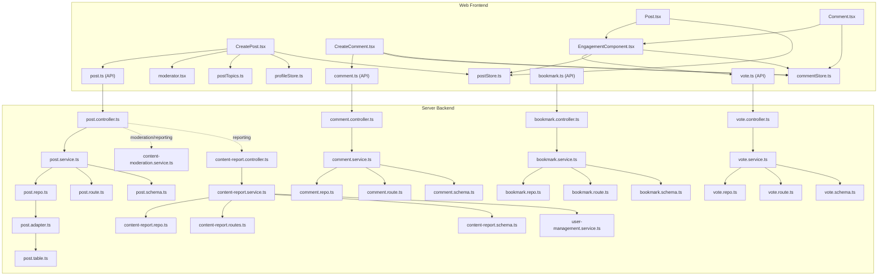

**Diagram sources**
- [CreatePost.tsx](file://web/src/components/general/CreatePost.tsx#L1-L276)
- [Post.tsx](file://web/src/components/general/Post.tsx#L1-L98)
- [Comment.tsx](file://web/src/components/general/Comment.tsx#L1-L77)
- [CreateComment.tsx](file://web/src/components/general/CreateComment.tsx#L1-L214)
- [EngagementComponent.tsx](file://web/src/components/general/EngagementComponent.tsx#L1-L205)
- [post.ts](file://web/src/services/api/post.ts#L1-L49)
- [comment.ts](file://web/src/services/api/comment.ts#L1-L21)
- [vote.ts](file://web/src/services/api/vote.ts#L1-L20)
- [bookmark.ts](file://web/src/services/api/bookmark.ts#L1-L15)
- [postStore.ts](file://web/src/store/postStore.ts#L1-L29)
- [commentStore.ts](file://web/src/store/commentStore.ts)
- [profileStore.ts](file://web/src/store/profileStore.ts)
- [moderator.tsx](file://web/src/utils/moderator.tsx)
- [postTopics.ts](file://web/src/types/postTopics.ts)
- [post.controller.ts](file://server/src/modules/post/post.controller.ts)
- [post.service.ts](file://server/src/modules/post/post.service.ts)
- [post.repo.ts](file://server/src/modules/post/post.repo.ts)
- [post.route.ts](file://server/src/modules/post/post.route.ts)
- [post.schema.ts](file://server/src/modules/post/post.schema.ts)
- [post.adapter.ts](file://server/src/infra/db/adapters/post.adapter.ts)
- [post.table.ts](file://server/src/infra/db/tables/post.table.ts)
- [comment.controller.ts](file://server/src/modules/comment/comment.controller.ts)
- [comment.service.ts](file://server/src/modules/comment/comment.service.ts)
- [comment.repo.ts](file://server/src/modules/comment/comment.repo.ts)
- [comment.route.ts](file://server/src/modules/comment/comment.route.ts)
- [comment.schema.ts](file://server/src/modules/comment/comment.schema.ts)
- [vote.controller.ts](file://server/src/modules/vote/vote.controller.ts)
- [vote.service.ts](file://server/src/modules/vote/vote.service.ts)
- [vote.repo.ts](file://server/src/modules/vote/vote.repo.ts)
- [vote.route.ts](file://server/src/modules/vote/vote.route.ts)
- [vote.schema.ts](file://server/src/modules/vote/vote.schema.ts)
- [bookmark.controller.ts](file://server/src/modules/bookmark/bookmark.controller.ts)
- [bookmark.service.ts](file://server/src/modules/bookmark/bookmark.service.ts)
- [bookmark.repo.ts](file://server/src/modules/bookmark/bookmark.repo.ts)
- [bookmark.route.ts](file://server/src/modules/bookmark/bookmark.route.ts)
- [bookmark.schema.ts](file://server/src/modules/bookmark/bookmark.schema.ts)
- [content-moderation.service.ts](file://server/src/modules/content-report/content-moderation.service.ts)
- [content-report.controller.ts](file://server/src/modules/content-report/content-report.controller.ts)
- [content-report.service.ts](file://server/src/modules/content-report/content-report.service.ts)
- [content-report.repo.ts](file://server/src/modules/content-report/content-report.repo.ts)
- [content-report.routes.ts](file://server/src/modules/content-report/content-report.routes.ts)
- [content-report.schema.ts](file://server/src/modules/content-report/content-report.schema.ts)
- [user-management.service.ts](file://server/src/modules/content-report/user-management.service.ts)

**Section sources**
- [CreatePost.tsx](file://web/src/components/general/CreatePost.tsx#L1-L276)
- [Post.tsx](file://web/src/components/general/Post.tsx#L1-L98)
- [Comment.tsx](file://web/src/components/general/Comment.tsx#L1-L77)
- [CreateComment.tsx](file://web/src/components/general/CreateComment.tsx#L1-L214)
- [EngagementComponent.tsx](file://web/src/components/general/EngagementComponent.tsx#L1-L205)
- [post.ts](file://web/src/services/api/post.ts#L1-L49)
- [comment.ts](file://web/src/services/api/comment.ts#L1-L21)
- [vote.ts](file://web/src/services/api/vote.ts#L1-L20)
- [bookmark.ts](file://web/src/services/api/bookmark.ts#L1-L15)
- [postStore.ts](file://web/src/store/postStore.ts#L1-L29)
- [commentStore.ts](file://web/src/store/commentStore.ts)
- [profileStore.ts](file://web/src/store/profileStore.ts)
- [moderator.tsx](file://web/src/utils/moderator.tsx)
- [postTopics.ts](file://web/src/types/postTopics.ts)

## Core Components
- CreatePost: A modal-based form for creating or editing posts with Zod validation, term acceptance flow, and integration with post API and Zustand store. **Enhanced** with college-only post toggle functionality.
- Post: A lightweight card component rendering post metadata, content preview, engagement controls, and **lock icons** for private/college-only posts.
- Comment: A recursive component supporting nested replies with expand/collapse behavior.
- CreateComment: A form for creating or editing comments with validation, preview, and optimistic updates.
- EngagementComponent: A unified component for voting, comments, views, and sharing with optimistic UI updates and rollback on errors.

**Updated** Enhanced CreatePost component now includes a college-only post toggle with improved validation.

**Section sources**
- [CreatePost.tsx](file://web/src/components/general/CreatePost.tsx#L1-L276)
- [Post.tsx](file://web/src/components/general/Post.tsx#L1-L98)
- [Comment.tsx](file://web/src/components/general/Comment.tsx#L1-L77)
- [CreateComment.tsx](file://web/src/components/general/CreateComment.tsx#L1-L214)
- [EngagementComponent.tsx](file://web/src/components/general/EngagementComponent.tsx#L1-L205)

## Architecture Overview
The social features follow a layered architecture:
- Frontend: Components orchestrate user interactions, manage local state, and call service APIs. Stores maintain normalized lists for posts/comments.
- Backend: REST endpoints expose CRUD operations for posts, comments, votes, and bookmarks. Content moderation/reporting integrates with reporting workflows. **Enhanced** with college-only post visibility restrictions.
- Real-time: Sockets enable live updates for votes, comments, and notifications.

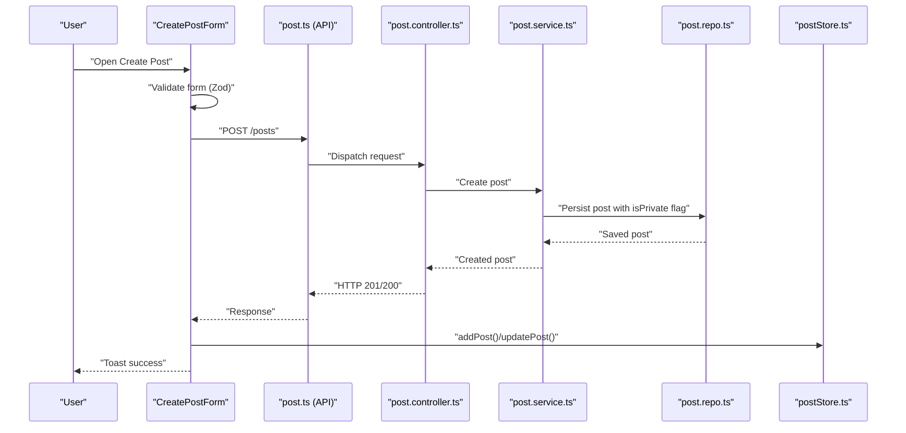

**Diagram sources**
- [CreatePost.tsx](file://web/src/components/general/CreatePost.tsx#L82-L133)
- [post.ts](file://web/src/services/api/post.ts#L26-L35)
- [post.controller.ts](file://server/src/modules/post/post.controller.ts)
- [post.service.ts](file://server/src/modules/post/post.service.ts)
- [post.repo.ts](file://server/src/modules/post/post.repo.ts)
- [postStore.ts](file://web/src/store/postStore.ts#L12-L26)

## Detailed Component Analysis

### CreatePost Component Implementation
- Validation: **Enhanced** Zod schema enforces title length, content length, topic selection, and includes `isPrivate` boolean flag for college-only posts.
- Workflow:
  - Opens a dialog with a form.
  - On submit, validates content against moderation rules and checks terms acceptance.
  - **New** College-only toggle allows users to restrict post visibility to their verified college domain.
  - Calls API to create or update; updates Zustand store; resets form; closes dialog.
  - Handles 403 errors for terms and other errors via error handler and toast.
- Moderation: Uses validator and highlighter utilities to preview flagged content.
- Topics: Enumerated topics sourced from postTopics type.

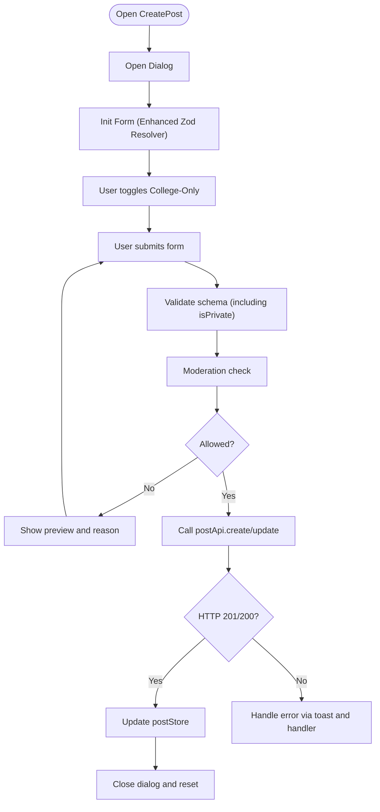

**Diagram sources**
- [CreatePost.tsx](file://web/src/components/general/CreatePost.tsx#L31-L133)
- [moderator.tsx](file://web/src/utils/moderator.tsx)
- [postTopics.ts](file://web/src/types/postTopics.ts)
- [post.ts](file://web/src/services/api/post.ts#L26-L35)
- [postStore.ts](file://web/src/store/postStore.ts#L12-L26)

**Section sources**
- [CreatePost.tsx](file://web/src/components/general/CreatePost.tsx#L1-L276)
- [post.ts](file://web/src/services/api/post.ts#L1-L49)
- [postStore.ts](file://web/src/store/postStore.ts#L1-L29)
- [moderator.tsx](file://web/src/utils/moderator.tsx)
- [postTopics.ts](file://web/src/types/postTopics.ts)

### Post Component Architecture
- Rendering: Displays avatar, branch/topic/college/user metadata, title, content preview, and engagement footer.
- **Enhanced** Interaction: Clicking the card navigates to the post detail route; metadata links navigate to filters. **New** Lock icon displays for private/college-only posts.
- Engagement: Delegates voting, comments, views, and share to EngagementComponent.
- Bookmarks: PostDropdown supports bookmark toggling; bookmarked state passed as prop.
- **New** Visibility: Posts with `isPrivate` flag display 🔒 icon indicating college-only visibility.

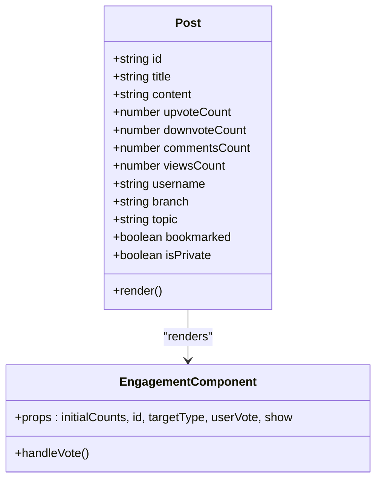

**Diagram sources**
- [Post.tsx](file://web/src/components/general/Post.tsx#L20-L98)
- [EngagementComponent.tsx](file://web/src/components/general/EngagementComponent.tsx#L22-L30)

**Section sources**
- [Post.tsx](file://web/src/components/general/Post.tsx#L1-L98)
- [EngagementComponent.tsx](file://web/src/components/general/EngagementComponent.tsx#L1-L205)

### Commenting System and Threading
- Nested Comments: Comment component recursively renders children with indentation and collapsible replies.
- Reply Functionality: CreateComment supports parentCommentId for threaded replies and updates commentStore.
- Validation and Preview: Zod validation, moderation preview, and escape-to-discard dialog.
- Engagement: Each comment exposes upvote/downvote and child count via EngagementComponent.

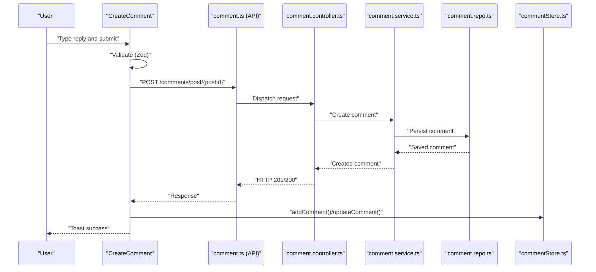

**Diagram sources**
- [CreateComment.tsx](file://web/src/components/general/CreateComment.tsx#L70-L112)
- [comment.ts](file://web/src/services/api/comment.ts#L7-L11)
- [comment.controller.ts](file://server/src/modules/comment/comment.controller.ts)
- [comment.service.ts](file://server/src/modules/comment/comment.service.ts)
- [comment.repo.ts](file://server/src/modules/comment/comment.repo.ts)
- [commentStore.ts](file://web/src/store/commentStore.ts)

**Section sources**
- [Comment.tsx](file://web/src/components/general/Comment.tsx#L1-L77)
- [CreateComment.tsx](file://web/src/components/general/CreateComment.tsx#L1-L214)
- [comment.ts](file://web/src/services/api/comment.ts#L1-L21)
- [commentStore.ts](file://web/src/store/commentStore.ts)

### Voting and Upvoting System
- Optimistic Updates: EngagementComponent maintains local counts and flips vote states immediately.
- API Actions: Creates, updates (flip), or deletes votes depending on current state.
- Rollback: On error, restores previous counts and UI state.
- Metrics: Exposes upvotes, downvotes, comments, views; share integration via ShareButton.

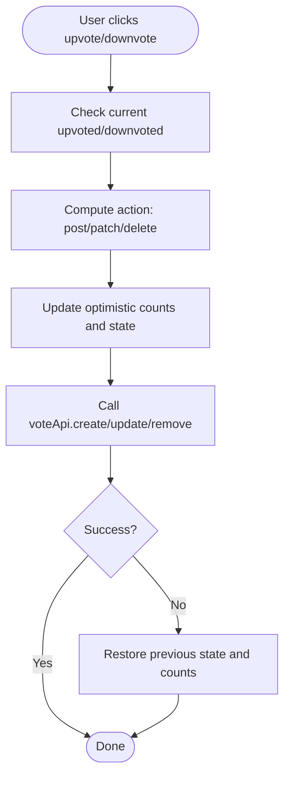

**Diagram sources**
- [EngagementComponent.tsx](file://web/src/components/general/EngagementComponent.tsx#L74-L139)
- [vote.ts](file://web/src/services/api/vote.ts#L6-L17)

**Section sources**
- [EngagementComponent.tsx](file://web/src/components/general/EngagementComponent.tsx#L1-L205)
- [vote.ts](file://web/src/services/api/vote.ts#L1-L20)

### Bookmark Functionality
- API: List mine, create, and remove endpoints.
- Frontend: PostDropdown triggers bookmark toggles; store updates normalize entries.
- Backend: Bookmark module persists associations and exposes routes.

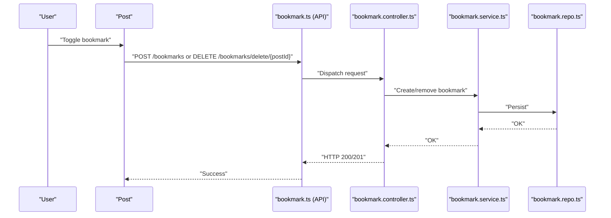

**Diagram sources**
- [bookmark.ts](file://web/src/services/api/bookmark.ts#L3-L12)
- [bookmark.controller.ts](file://server/src/modules/bookmark/bookmark.controller.ts)
- [bookmark.service.ts](file://server/src/modules/bookmark/bookmark.service.ts)
- [bookmark.repo.ts](file://server/src/modules/bookmark/bookmark.repo.ts)

**Section sources**
- [bookmark.ts](file://web/src/services/api/bookmark.ts#L1-L15)
- [bookmark.controller.ts](file://server/src/modules/bookmark/bookmark.controller.ts)
- [bookmark.service.ts](file://server/src/modules/bookmark/bookmark.service.ts)
- [bookmark.repo.ts](file://server/src/modules/bookmark/bookmark.repo.ts)

### Content Management and Moderation
- Post Management: Create, update, delete via post controller/service/repo.
- Comment Management: Create, update, delete via comment controller/service/repo.
- Moderation: Frontend validator highlights prohibited content; backend moderation/reporting services handle enforcement and reporting workflows.
- Reporting: Dedicated content-report module with controller, service, repo, routes, schema, and user management integration.

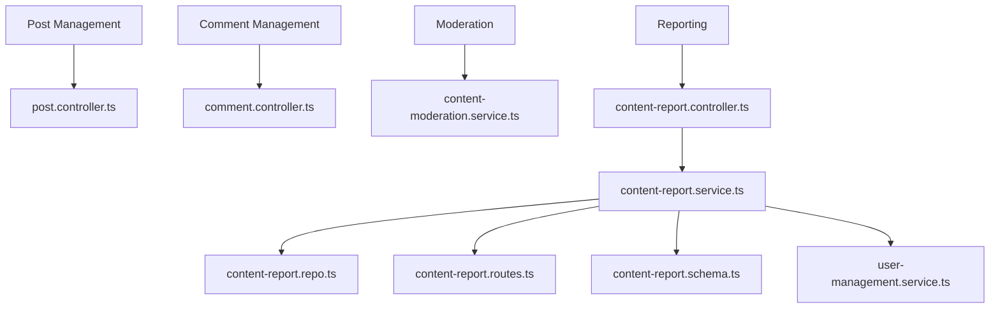

**Diagram sources**
- [post.controller.ts](file://server/src/modules/post/post.controller.ts)
- [comment.controller.ts](file://server/src/modules/comment/comment.controller.ts)
- [content-moderation.service.ts](file://server/src/modules/content-report/content-moderation.service.ts)
- [content-report.controller.ts](file://server/src/modules/content-report/content-report.controller.ts)
- [content-report.service.ts](file://server/src/modules/content-report/content-report.service.ts)
- [content-report.repo.ts](file://server/src/modules/content-report/content-report.repo.ts)
- [content-report.routes.ts](file://server/src/modules/content-report/content-report.routes.ts)
- [content-report.schema.ts](file://server/src/modules/content-report/content-report.schema.ts)
- [user-management.service.ts](file://server/src/modules/content-report/user-management.service.ts)

**Section sources**
- [post.controller.ts](file://server/src/modules/post/post.controller.ts)
- [post.service.ts](file://server/src/modules/post/post.service.ts)
- [post.repo.ts](file://server/src/modules/post/post.repo.ts)
- [comment.controller.ts](file://server/src/modules/comment/comment.controller.ts)
- [comment.service.ts](file://server/src/modules/comment/comment.service.ts)
- [comment.repo.ts](file://server/src/modules/comment/comment.repo.ts)
- [content-moderation.service.ts](file://server/src/modules/content-report/content-moderation.service.ts)
- [content-report.controller.ts](file://server/src/modules/content-report/content-report.controller.ts)
- [content-report.service.ts](file://server/src/modules/content-report/content-report.service.ts)
- [content-report.repo.ts](file://server/src/modules/content-report/content-report.repo.ts)
- [content-report.routes.ts](file://server/src/modules/content-report/content-report.routes.ts)
- [content-report.schema.ts](file://server/src/modules/content-report/content-report.schema.ts)
- [user-management.service.ts](file://server/src/modules/content-report/user-management.service.ts)

### College-Only Post System
- **New** Visibility Control: Posts can be marked as college-only using the `isPrivate` boolean flag.
- **Enhanced** Backend Logic: Database schema includes `isPrivate` column with default false value.
- **Authentication Requirements**: Private posts require user authentication to view.
- **Authorization Checks**: Users can only view private posts from their own college.
- **Frontend Display**: Posts with `isPrivate` flag display 🔒 lock icon in the metadata bar.

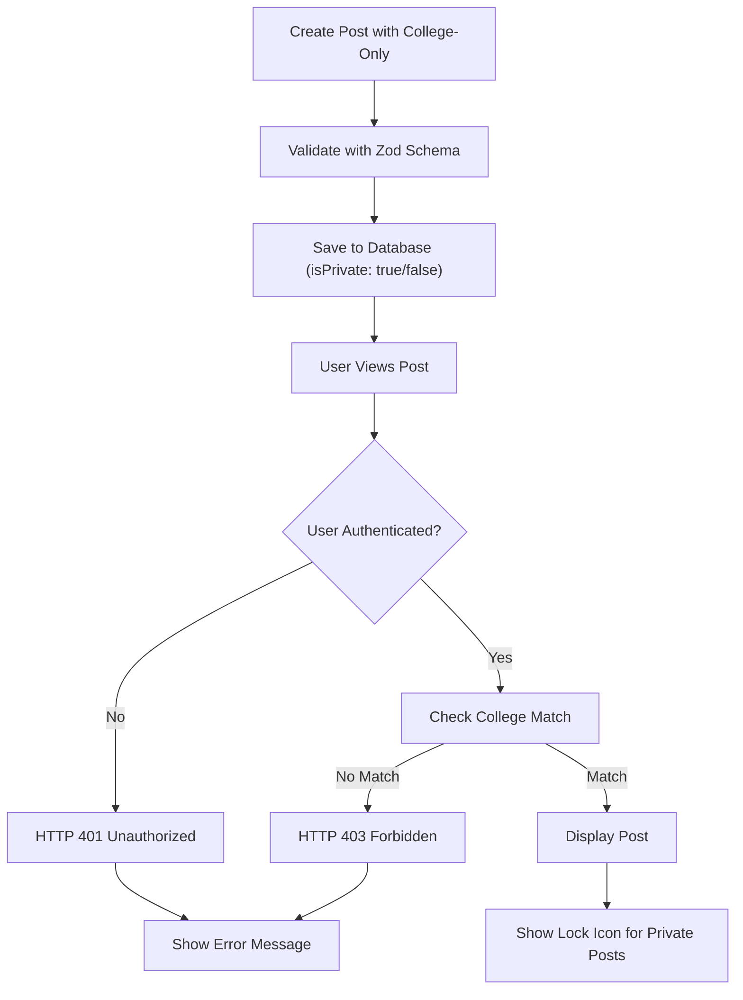

**Diagram sources**
- [post.schema.ts](file://server/src/modules/post/post.schema.ts#L17-L33)
- [post.table.ts](file://server/src/infra/db/tables/post.table.ts#L11)
- [post.service.ts](file://server/src/modules/post/post.service.ts#L60-L73)
- [post.adapter.ts](file://server/src/infra/db/adapters/post.adapter.ts#L230-L243)

**Section sources**
- [post.schema.ts](file://server/src/modules/post/post.schema.ts#L17-L33)
- [post.table.ts](file://server/src/infra/db/tables/post.table.ts#L11)
- [post.service.ts](file://server/src/modules/post/post.service.ts#L60-L73)
- [post.adapter.ts](file://server/src/infra/db/adapters/post.adapter.ts#L230-L243)
- [Post.tsx](file://web/src/components/general/Post.tsx#L74-L81)

### Engagement Metrics and Ranking
- Metrics: Upvotes, downvotes, comments, views surfaced by EngagementComponent and Post.
- Ranking: Trending posts endpoint sorts by views descending for a simple popularity ranking.

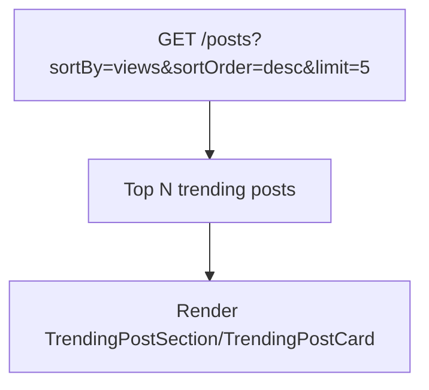

**Diagram sources**
- [post.ts](file://web/src/services/api/post.ts#L39-L47)

**Section sources**
- [EngagementComponent.tsx](file://web/src/components/general/EngagementComponent.tsx#L13-L30)
- [Post.tsx](file://web/src/components/general/Post.tsx#L28-L35)
- [post.ts](file://web/src/services/api/post.ts#L39-L47)

### State Management Patterns
- Posts: postStore maintains a list of posts with setters for add, update, remove, and set.
- Comments: commentStore mirrors similar patterns for normalized comment lists.
- Profile: profileStore provides user context for permissions and actions.

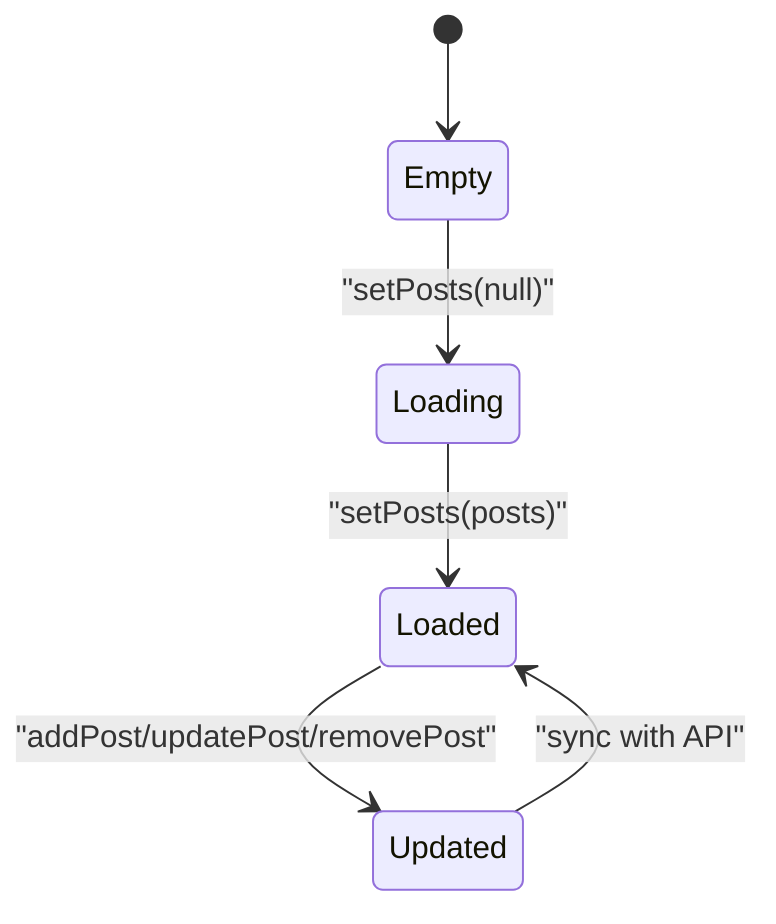

**Diagram sources**
- [postStore.ts](file://web/src/store/postStore.ts#L12-L26)
- [commentStore.ts](file://web/src/store/commentStore.ts)

**Section sources**
- [postStore.ts](file://web/src/store/postStore.ts#L1-L29)
- [commentStore.ts](file://web/src/store/commentStore.ts)
- [profileStore.ts](file://web/src/store/profileStore.ts)

### API Integration and Real-time Updates
- APIs: Centralized service modules for posts, comments, votes, and bookmarks.
- Real-time: SocketContext and useSocket hooks enable live updates for votes, comments, and notifications across web and admin.

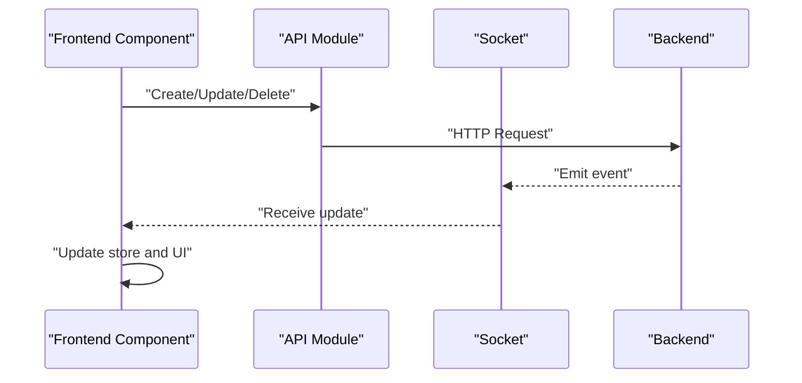

**Diagram sources**
- [post.ts](file://web/src/services/api/post.ts#L1-L49)
- [comment.ts](file://web/src/services/api/comment.ts#L1-L21)
- [vote.ts](file://web/src/services/api/vote.ts#L1-L20)
- [bookmark.ts](file://web/src/services/api/bookmark.ts#L1-L15)
- [SocketContext.tsx](file://web/src/socket/SocketContext.tsx)
- [useSocket.ts](file://web/src/socket/useSocket.ts)
- [SocketContext.tsx](file://admin/src/socket/SocketContext.tsx)
- [useSocket.ts](file://admin/src/socket/useSocket.ts)

**Section sources**
- [post.ts](file://web/src/services/api/post.ts#L1-L49)
- [comment.ts](file://web/src/services/api/comment.ts#L1-L21)
- [vote.ts](file://web/src/services/api/vote.ts#L1-L20)
- [bookmark.ts](file://web/src/services/api/bookmark.ts#L1-L15)
- [SocketContext.tsx](file://web/src/socket/SocketContext.tsx)
- [useSocket.ts](file://web/src/socket/useSocket.ts)
- [SocketContext.tsx](file://admin/src/socket/SocketContext.tsx)
- [useSocket.ts](file://admin/src/socket/useSocket.ts)

## Dependency Analysis
- Frontend components depend on:
  - Services for HTTP requests
  - Zustand stores for state normalization
  - Moderator utilities for content validation
  - Topic enums for controlled inputs
  - **Enhanced** Post type includes `isPrivate` property for college-only posts
- Backend modules depend on:
  - Controllers for routing and request handling
  - Services for business logic
  - Repositories for persistence
  - Schemas for validation
  - **Enhanced** Database adapter handles college-only post filtering

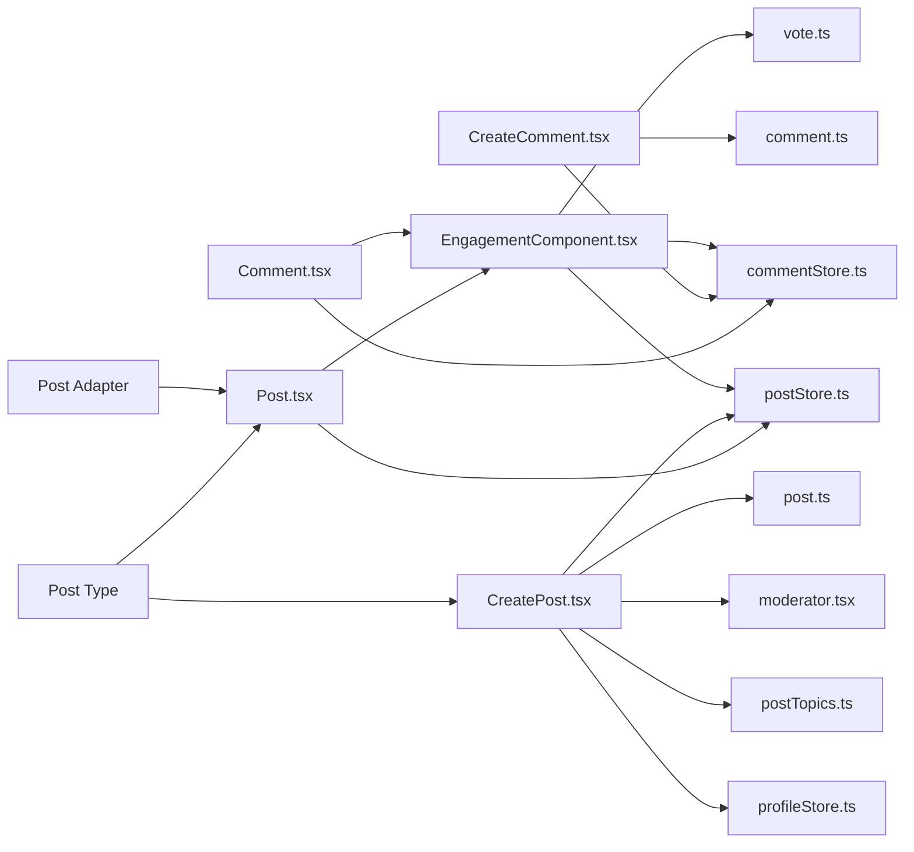

**Diagram sources**
- [CreatePost.tsx](file://web/src/components/general/CreatePost.tsx#L1-L276)
- [Post.tsx](file://web/src/components/general/Post.tsx#L1-L98)
- [Comment.tsx](file://web/src/components/general/Comment.tsx#L1-L77)
- [CreateComment.tsx](file://web/src/components/general/CreateComment.tsx#L1-L214)
- [EngagementComponent.tsx](file://web/src/components/general/EngagementComponent.tsx#L1-L205)
- [post.ts](file://web/src/services/api/post.ts#L1-L49)
- [comment.ts](file://web/src/services/api/comment.ts#L1-L21)
- [vote.ts](file://web/src/services/api/vote.ts#L1-L20)
- [moderator.tsx](file://web/src/utils/moderator.tsx)
- [postTopics.ts](file://web/src/types/postTopics.ts)
- [postStore.ts](file://web/src/store/postStore.ts#L1-L29)
- [commentStore.ts](file://web/src/store/commentStore.ts)
- [Post.ts](file://web/src/types/Post.ts#L19)
- [post.adapter.ts](file://server/src/infra/db/adapters/post.adapter.ts#L87)

**Section sources**
- [postStore.ts](file://web/src/store/postStore.ts#L1-L29)
- [commentStore.ts](file://web/src/store/commentStore.ts)
- [profileStore.ts](file://web/src/store/profileStore.ts)
- [Post.ts](file://web/src/types/Post.ts#L19)
- [post.adapter.ts](file://server/src/infra/db/adapters/post.adapter.ts#L87)

## Performance Considerations
- Optimistic UI: Voting and comment operations update immediately, reducing perceived latency.
- Minimal re-renders: Zustand stores update arrays efficiently; avoid unnecessary deep equality checks.
- Lazy loading: Consider paginated post lists and infinite scrolling for feed performance.
- Debounced moderation previews: Avoid excessive re-renders while typing by debouncing validation callbacks.
- **Enhanced** Database filtering: College-only posts are filtered at the database level to reduce unnecessary data transfer.

## Troubleshooting Guide
- Form validation failures: Ensure Zod schema matches backend expectations; display FormMessage for user guidance.
- Terms not accepted: Handle 403 with TERMS_NOT_ACCEPTED by prompting TermsForm flow.
- Moderation denials: Use highlighted preview to inform users; adjust content to comply.
- Network errors: Utilize useErrorHandler hook to retry or notify; revert optimistic updates on failure.
- Socket disconnections: Reconnect logic should refresh subscriptions and re-sync state.
- **New** College-only post issues: Ensure user is authenticated and belongs to the correct college; verify `isPrivate` flag is properly set.

**Section sources**
- [CreatePost.tsx](file://web/src/components/general/CreatePost.tsx#L112-L133)
- [CreateComment.tsx](file://web/src/components/general/CreateComment.tsx#L97-L112)
- [EngagementComponent.tsx](file://web/src/components/general/EngagementComponent.tsx#L123-L139)
- [moderator.tsx](file://web/src/utils/moderator.tsx)

## Conclusion
The social features are built around robust frontend components with strong validation, optimistic UI updates, and seamless backend integration. The modular backend ensures scalability and maintainability, while moderation and reporting services support responsible content governance. Real-time sockets enhance interactivity, and state management keeps the UI responsive and consistent. **Enhanced** with college-only post functionality, providing users with granular control over post visibility and improving community engagement within institutional boundaries.

## Appendices
- Types and Schemas: Refer to Post, Comment, and ReportedPost types in admin/src/types for backend models.
- Admin Tools: Use admin components like ReportPost and Post for moderation workflows.
- **New** Post Types: Enhanced Post type includes `isPrivate` property for college-only post visibility control.

**Section sources**
- [Post.ts](file://admin/src/types/Post.ts)
- [Comment.ts](file://admin/src/types/Comment.ts)
- [ReportedPost.ts](file://admin/src/types/ReportedPost.ts)
- [Post.ts](file://web/src/types/Post.ts#L19)