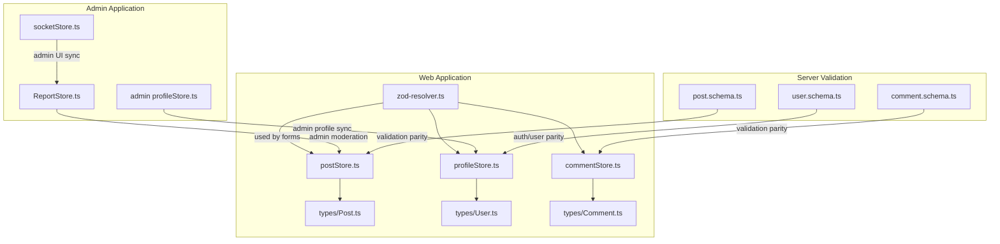
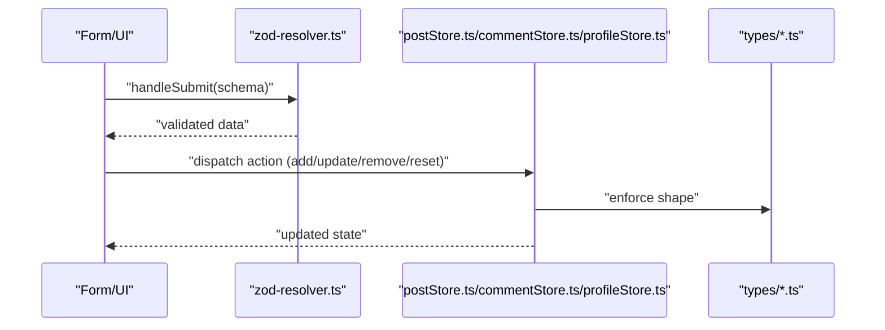
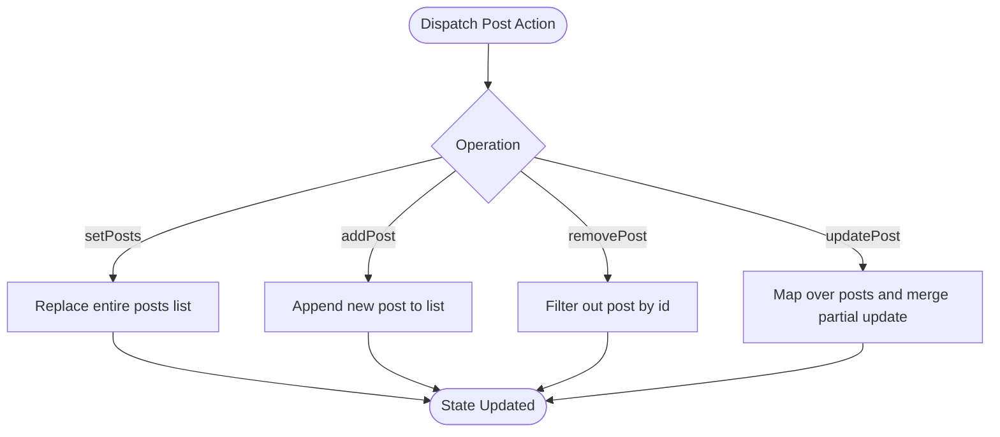
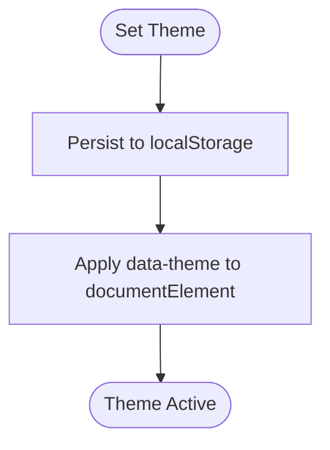
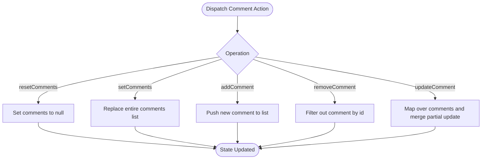
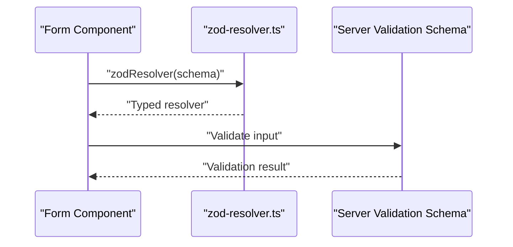
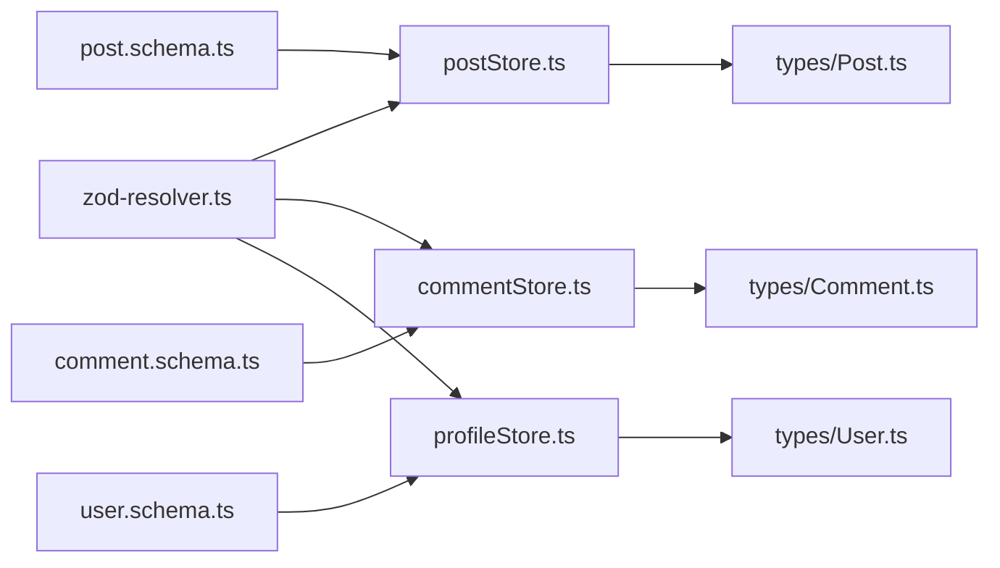
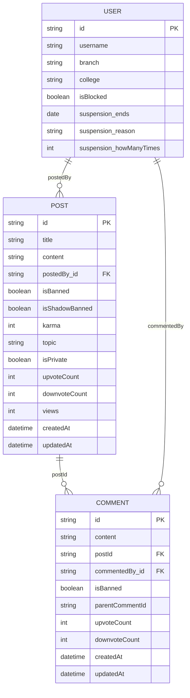

# State Management

<cite>
**Referenced Files in This Document**
- [postStore.ts](file://web/src/store/postStore.ts)
- [profileStore.ts](file://web/src/store/profileStore.ts)
- [commentStore.ts](file://web/src/store/commentStore.ts)
- [zod-resolver.ts](file://web/src/lib/zod-resolver.ts)
- [Post.ts](file://web/src/types/Post.ts)
- [User.ts](file://web/src/types/User.ts)
- [Comment.ts](file://web/src/types/Comment.ts)
- [post.schema.ts](file://server/src/modules/post/post.schema.ts)
- [comment.schema.ts](file://server/src/modules/comment/comment.schema.ts)
- [user.schema.ts](file://server/src/modules/user/user.schema.ts)
- [socketStore.ts](file://admin/src/store/socketStore.ts)
- [ReportStore.ts](file://admin/src/store/ReportStore.ts)
- [profileStore.ts](file://admin/src/store/profileStore.ts)
</cite>

## Table of Contents
1. [Introduction](#introduction)
2. [Project Structure](#project-structure)
3. [Core Components](#core-components)
4. [Architecture Overview](#architecture-overview)
5. [Detailed Component Analysis](#detailed-component-analysis)
6. [Dependency Analysis](#dependency-analysis)
7. [Performance Considerations](#performance-considerations)
8. [Troubleshooting Guide](#troubleshooting-guide)
9. [Conclusion](#conclusion)
10. [Appendices](#appendices)

## Introduction
This document explains the state management architecture built with Zustand stores across the application. It focuses on:
- postStore for managing posts and votes/bookmarks
- profileStore for user profile and theme preferences
- commentStore for comment threads and nested replies
- zod-resolver integration for strict, type-safe form validation
- Data synchronization patterns, persistence, hydration, and SSR compatibility
- Performance optimizations, selectors, and memoization
- Debugging, development tooling, and testing strategies
- Store relationships and end-to-end data flow

## Project Structure
The state management is primarily implemented in the web application under the store directory, with supporting types and zod-resolver utilities. Admin and server modules provide complementary stores and validation schemas that inform client-side store behavior.

**Diagram sources**
- [postStore.ts](file://web/src/store/postStore.ts#L1-L29)
- [profileStore.ts](file://web/src/store/profileStore.ts#L1-L57)
- [commentStore.ts](file://web/src/store/commentStore.ts#L1-L34)
- [zod-resolver.ts](file://web/src/lib/zod-resolver.ts#L1-L15)
- [Post.ts](file://web/src/types/Post.ts#L1-L23)
- [User.ts](file://web/src/types/User.ts#L1-L15)
- [Comment.ts](file://web/src/types/Comment.ts#L1-L17)
- [ReportStore.ts](file://admin/src/store/ReportStore.ts#L1-L43)
- [socketStore.ts](file://admin/src/store/socketStore.ts#L1-L14)
- [profileStore.ts](file://admin/src/store/profileStore.ts#L1-L39)
- [post.schema.ts](file://server/src/modules/post/post.schema.ts#L1-L81)
- [comment.schema.ts](file://server/src/modules/comment/comment.schema.ts#L1-L25)
- [user.schema.ts](file://server/src/modules/user/user.schema.ts#L1-L39)

**Section sources**
- [postStore.ts](file://web/src/store/postStore.ts#L1-L29)
- [profileStore.ts](file://web/src/store/profileStore.ts#L1-L57)
- [commentStore.ts](file://web/src/store/commentStore.ts#L1-L34)
- [zod-resolver.ts](file://web/src/lib/zod-resolver.ts#L1-L15)
- [Post.ts](file://web/src/types/Post.ts#L1-L23)
- [User.ts](file://web/src/types/User.ts#L1-L15)
- [Comment.ts](file://web/src/types/Comment.ts#L1-L17)
- [ReportStore.ts](file://admin/src/store/ReportStore.ts#L1-L43)
- [socketStore.ts](file://admin/src/store/socketStore.ts#L1-L14)
- [profileStore.ts](file://admin/src/store/profileStore.ts#L1-L39)
- [post.schema.ts](file://server/src/modules/post/post.schema.ts#L1-L81)
- [comment.schema.ts](file://server/src/modules/comment/comment.schema.ts#L1-L25)
- [user.schema.ts](file://server/src/modules/user/user.schema.ts#L1-L39)

## Core Components
- postStore: Manages a list of posts with CRUD-like operations and supports voting/bookmark updates via partial updates.
- profileStore: Holds user profile and theme state, persists theme preference, and exposes mutation methods.
- commentStore: Maintains comment threads and nested replies with add/remove/update/reset operations.
- zod-resolver: Provides a strongly typed wrapper around react-hook-form’s zodResolver to avoid type mismatches across versions.

Key capabilities:
- Type-safe state shapes via TypeScript interfaces and shared types
- Minimal boilerplate with Zustand’s create pattern
- Local persistence for theme in profileStore
- Server-aligned validation schemas for consistency

**Section sources**
- [postStore.ts](file://web/src/store/postStore.ts#L1-L29)
- [profileStore.ts](file://web/src/store/profileStore.ts#L1-L57)
- [commentStore.ts](file://web/src/store/commentStore.ts#L1-L34)
- [zod-resolver.ts](file://web/src/lib/zod-resolver.ts#L1-L15)
- [Post.ts](file://web/src/types/Post.ts#L1-L23)
- [User.ts](file://web/src/types/User.ts#L1-L15)
- [Comment.ts](file://web/src/types/Comment.ts#L1-L17)

## Architecture Overview
The stores are independent but coordinated:
- Forms use zod-resolver to enforce validation before dispatching state updates
- postStore and commentStore operate on lists and support targeted updates
- profileStore centralizes theme and user metadata
- Admin stores (ReportStore, socketStore, admin profileStore) mirror or complement web store concerns for moderation and admin UI

**Diagram sources**
- [zod-resolver.ts](file://web/src/lib/zod-resolver.ts#L1-L15)
- [postStore.ts](file://web/src/store/postStore.ts#L1-L29)
- [commentStore.ts](file://web/src/store/commentStore.ts#L1-L34)
- [profileStore.ts](file://web/src/store/profileStore.ts#L1-L57)
- [Post.ts](file://web/src/types/Post.ts#L1-L23)
- [User.ts](file://web/src/types/User.ts#L1-L15)
- [Comment.ts](file://web/src/types/Comment.ts#L1-L17)

## Detailed Component Analysis

### postStore
Responsibilities:
- Maintain a list of posts
- Set, add, remove, and update posts
- Support partial updates for votes and bookmarks

Implementation highlights:
- Uses a functional updater pattern to derive new state from previous state
- Supports null-initialized state and safe array operations
- Integrates with UI components to reflect real-time updates

**Diagram sources**
- [postStore.ts](file://web/src/store/postStore.ts#L12-L26)

**Section sources**
- [postStore.ts](file://web/src/store/postStore.ts#L1-L29)
- [Post.ts](file://web/src/types/Post.ts#L1-L23)

### profileStore
Responsibilities:
- Manage user profile data and theme selection
- Persist theme to localStorage and apply to document element
- Provide setters and updaters for profile fields

Key behaviors:
- Theme persistence and DOM attribute application
- Safe partial updates to profile fields
- Initialization of default profile structure

**Diagram sources**
- [profileStore.ts](file://web/src/store/profileStore.ts#L49-L53)

**Section sources**
- [profileStore.ts](file://web/src/store/profileStore.ts#L1-L57)
- [User.ts](file://web/src/types/User.ts#L1-L15)

### commentStore
Responsibilities:
- Manage comment threads and nested replies
- Reset, set, add, remove, and update comments
- Preserve hierarchical relationships via optional children field

**Diagram sources**
- [commentStore.ts](file://web/src/store/commentStore.ts#L13-L31)

**Section sources**
- [commentStore.ts](file://web/src/store/commentStore.ts#L1-L34)
- [Comment.ts](file://web/src/types/Comment.ts#L1-L17)

### zod-resolver Integration
Purpose:
- Provide a strongly typed zodResolver wrapper to avoid resolver type mismatches
- Enforce validation schemas consistently across forms

Usage pattern:
- Import zod-resolver and pass a Zod schema to generate a typed resolver
- Use the resolver in react-hook-form configurations

**Diagram sources**
- [zod-resolver.ts](file://web/src/lib/zod-resolver.ts#L10-L14)
- [post.schema.ts](file://server/src/modules/post/post.schema.ts#L17-L33)
- [comment.schema.ts](file://server/src/modules/comment/comment.schema.ts#L3-L10)
- [user.schema.ts](file://server/src/modules/user/user.schema.ts#L18-L30)

**Section sources**
- [zod-resolver.ts](file://web/src/lib/zod-resolver.ts#L1-L15)
- [post.schema.ts](file://server/src/modules/post/post.schema.ts#L1-L81)
- [comment.schema.ts](file://server/src/modules/comment/comment.schema.ts#L1-L25)
- [user.schema.ts](file://server/src/modules/user/user.schema.ts#L1-L39)

### Admin Stores (context and relationships)
- ReportStore: Manages reported posts and nested reports with status transitions and updates
- socketStore: Tracks admin user identity for socket-related UI
- admin profileStore: Mirrors profileStore behavior for admin UI

These stores complement web stores for admin workflows and UI synchronization.

**Section sources**
- [ReportStore.ts](file://admin/src/store/ReportStore.ts#L1-L43)
- [socketStore.ts](file://admin/src/store/socketStore.ts#L1-L14)
- [profileStore.ts](file://admin/src/store/profileStore.ts#L1-L39)

## Dependency Analysis
- Web stores depend on shared types for shape enforcement
- zod-resolver depends on react-hook-form resolvers and Zod
- Server schemas define validation rules that inform client-side store expectations
- Admin stores depend on admin-specific types and mirror web store concerns

**Diagram sources**
- [zod-resolver.ts](file://web/src/lib/zod-resolver.ts#L1-L15)
- [postStore.ts](file://web/src/store/postStore.ts#L1-L29)
- [commentStore.ts](file://web/src/store/commentStore.ts#L1-L34)
- [profileStore.ts](file://web/src/store/profileStore.ts#L1-L57)
- [Post.ts](file://web/src/types/Post.ts#L1-L23)
- [Comment.ts](file://web/src/types/Comment.ts#L1-L17)
- [User.ts](file://web/src/types/User.ts#L1-L15)
- [post.schema.ts](file://server/src/modules/post/post.schema.ts#L1-L81)
- [comment.schema.ts](file://server/src/modules/comment/comment.schema.ts#L1-L25)
- [user.schema.ts](file://server/src/modules/user/user.schema.ts#L1-L39)

**Section sources**
- [postStore.ts](file://web/src/store/postStore.ts#L1-L29)
- [profileStore.ts](file://web/src/store/profileStore.ts#L1-L57)
- [commentStore.ts](file://web/src/store/commentStore.ts#L1-L34)
- [zod-resolver.ts](file://web/src/lib/zod-resolver.ts#L1-L15)
- [Post.ts](file://web/src/types/Post.ts#L1-L23)
- [User.ts](file://web/src/types/User.ts#L1-L15)
- [Comment.ts](file://web/src/types/Comment.ts#L1-L17)
- [post.schema.ts](file://server/src/modules/post/post.schema.ts#L1-L81)
- [comment.schema.ts](file://server/src/modules/comment/comment.schema.ts#L1-L25)
- [user.schema.ts](file://server/src/modules/user/user.schema.ts#L1-L39)

## Performance Considerations
- Selector pattern: Extract minimal slices of state to reduce re-renders. Prefer reading only required fields per component.
- Memoization: Use shallow equality checks for primitive arrays/lists; leverage Zustand’s built-in selector optimizations.
- Avoid unnecessary deep cloning: Use functional updates and spread operators judiciously.
- Batch updates: Group related state changes to minimize intermediate renders.
- Persistence: Keep localStorage writes minimal (as seen in profileStore) and avoid synchronous heavy operations during updates.
- Normalized data: For large lists, consider normalizing entities to enable efficient updates and prevent redundant re-renders.

[No sources needed since this section provides general guidance]

## Troubleshooting Guide
Common issues and resolutions:
- Type errors after updates: Ensure zod-resolver is used with the correct schema and that form data matches store types.
- Theme not persisting: Verify localStorage write and document attribute application in profileStore.
- Comments not updating: Confirm correct id matching and partial update merging in commentStore.
- Admin store desync: Align admin store actions with web store semantics for consistent UI behavior.

Debugging tips:
- Enable React DevTools to inspect store state and component subscriptions.
- Use Zustand Devtools for time-travel debugging and action logging.
- Add console logs around store updates to trace unexpected mutations.
- Validate server schemas and client-side types to maintain parity.

**Section sources**
- [profileStore.ts](file://web/src/store/profileStore.ts#L49-L53)
- [commentStore.ts](file://web/src/store/commentStore.ts#L25-L30)
- [postStore.ts](file://web/src/store/postStore.ts#L20-L25)

## Conclusion
The Zustand-based state management provides a clean, type-safe foundation for the application:
- Stores encapsulate domain logic with minimal boilerplate
- Shared types and server-aligned schemas ensure consistency
- zod-resolver enables robust form validation
- Persistence and admin stores integrate seamlessly with the core stores
Adhering to selector patterns, memoization, and normalization will further improve performance and maintainability.

[No sources needed since this section summarizes without analyzing specific files]

## Appendices

### Data Model Overview

**Diagram sources**
- [User.ts](file://web/src/types/User.ts#L1-L15)
- [Post.ts](file://web/src/types/Post.ts#L1-L23)
- [Comment.ts](file://web/src/types/Comment.ts#L1-L17)