# Web Application

<cite>
**Referenced Files in This Document**
- [web/src/app/layout.tsx](file://web/src/app/layout.tsx)
- [web/src/app/(root)/(app)/layout.tsx](file://web/src/app/(root)/(app)/layout.tsx)
- [web/src/app/(root)/(app)/page.tsx](file://web/src/app/(root)/(app)/page.tsx)
- [web/src/app/(root)/auth/signin/page.tsx](file://web/src/app/(root)/auth/signin/page.tsx)
- [web/src/components/general/CreatePost.tsx](file://web/src/components/general/CreatePost.tsx)
- [web/src/components/general/Post.tsx](file://web/src/components/general/Post.tsx)
- [web/src/components/general/Comment.tsx](file://web/src/components/general/Comment.tsx)
- [web/src/components/general/EngagementComponent.tsx](file://web/src/components/general/EngagementComponent.tsx)
- [web/src/store/postStore.ts](file://web/src/store/postStore.ts)
- [web/src/store/profileStore.ts](file://web/src/store/profileStore.ts)
- [web/src/socket/useSocket.ts](file://web/src/socket/useSocket.ts)
- [web/src/hooks/useNotificationSocket.tsx](file://web/src/hooks/useNotificationSocket.tsx)
- [web/src/services/api/post.ts](file://web/src/services/api/post.ts)
- [web/src/lib/auth-client.ts](file://web/src/lib/auth-client.ts)
</cite>

## Table of Contents
1. [Introduction](#introduction)
2. [Project Structure](#project-structure)
3. [Core Components](#core-components)
4. [Architecture Overview](#architecture-overview)
5. [Detailed Component Analysis](#detailed-component-analysis)
6. [Dependency Analysis](#dependency-analysis)
7. [Performance Considerations](#performance-considerations)
8. [Troubleshooting Guide](#troubleshooting-guide)
9. [Conclusion](#conclusion)

## Introduction
This document describes the Next.js web application that serves as the primary user-facing social platform. It covers the application’s structure, authentication flows, route protection, social features (post creation, commenting, voting, bookmarking), real-time notifications via WebSocket, state management with Zustand stores, component architecture, responsive design and theme switching, and API integration patterns with error handling and loading states.

## Project Structure
The web application is organized as a Next.js app with:
- Root app layout defining global HTML attributes and fonts
- An authenticated application shell with sidebar navigation, trending section, and a fixed footer area for post creation and auth card
- Public feed page with dynamic filtering by branch/topic
- Authentication pages (sign-in, OAuth callback, OTP, password recovery)
- Services for API communication and socket integration
- Zustand stores for posts and user profile/theme
- UI primitives and reusable components for social interactions

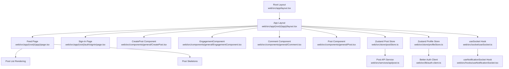

**Diagram sources**
- [web/src/app/layout.tsx](file://web/src/app/layout.tsx#L1-L35)
- [web/src/app/(root)/(app)/layout.tsx](file://web/src/app/(root)/(app)/layout.tsx#L1-L131)
- [web/src/app/(root)/(app)/page.tsx](file://web/src/app/(root)/(app)/page.tsx#L1-L200)
- [web/src/app/(root)/auth/signin/page.tsx](file://web/src/app/(root)/auth/signin/page.tsx#L1-L140)
- [web/src/components/general/CreatePost.tsx](file://web/src/components/general/CreatePost.tsx#L1-L276)
- [web/src/components/general/Post.tsx](file://web/src/components/general/Post.tsx#L1-L98)
- [web/src/components/general/Comment.tsx](file://web/src/components/general/Comment.tsx#L1-L77)
- [web/src/components/general/EngagementComponent.tsx](file://web/src/components/general/EngagementComponent.tsx#L1-L205)
- [web/src/store/postStore.ts](file://web/src/store/postStore.ts#L1-L29)
- [web/src/store/profileStore.ts](file://web/src/store/profileStore.ts#L1-L57)
- [web/src/socket/useSocket.ts](file://web/src/socket/useSocket.ts#L1-L9)
- [web/src/hooks/useNotificationSocket.tsx](file://web/src/hooks/useNotificationSocket.tsx#L1-L47)
- [web/src/services/api/post.ts](file://web/src/services/api/post.ts#L1-L49)
- [web/src/lib/auth-client.ts](file://web/src/lib/auth-client.ts#L1-L11)

**Section sources**
- [web/src/app/layout.tsx](file://web/src/app/layout.tsx#L1-L35)
- [web/src/app/(root)/(app)/layout.tsx](file://web/src/app/(root)/(app)/layout.tsx#L1-L131)

## Core Components
- Root layout sets global HTML attributes and fonts for typography.
- App layout composes the sidebar, main content area, trending section, and fixed footer with CreatePost and AuthCard.
- Feed page fetches and renders posts with skeleton loaders, supports branch/topic filters, and handles empty states.
- Social components:
  - CreatePost: form-based post creation/updating with validation, moderation preview, and terms acceptance flow.
  - Post: renders post header, metadata, content, and engagement controls.
  - Comment: nested comment rendering with expand/collapse replies.
  - EngagementComponent: optimistic voting, counts display, and share/comment actions.
- State management:
  - postStore: manages posts list, adds/removes/updates posts.
  - profileStore: manages user profile and theme selection with persistence.
- Real-time notifications:
  - useSocket hook provides access to the socket context.
  - useNotificationSocket listens for “notification” and “notification-count” events and triggers toasts and navigation.

**Section sources**
- [web/src/app/layout.tsx](file://web/src/app/layout.tsx#L1-L35)
- [web/src/app/(root)/(app)/layout.tsx](file://web/src/app/(root)/(app)/layout.tsx#L1-L131)
- [web/src/app/(root)/(app)/page.tsx](file://web/src/app/(root)/(app)/page.tsx#L1-L200)
- [web/src/components/general/CreatePost.tsx](file://web/src/components/general/CreatePost.tsx#L1-L276)
- [web/src/components/general/Post.tsx](file://web/src/components/general/Post.tsx#L1-L98)
- [web/src/components/general/Comment.tsx](file://web/src/components/general/Comment.tsx#L1-L77)
- [web/src/components/general/EngagementComponent.tsx](file://web/src/components/general/EngagementComponent.tsx#L1-L205)
- [web/src/store/postStore.ts](file://web/src/store/postStore.ts#L1-L29)
- [web/src/store/profileStore.ts](file://web/src/store/profileStore.ts#L1-L57)
- [web/src/socket/useSocket.ts](file://web/src/socket/useSocket.ts#L1-L9)
- [web/src/hooks/useNotificationSocket.tsx](file://web/src/hooks/useNotificationSocket.tsx#L1-L47)

## Architecture Overview
The application follows a layered architecture:
- Presentation layer: Next.js app router pages and components
- Domain services: API service wrappers for posts, votes, comments, notifications
- State management: Zustand stores for posts and profile/theme
- Real-time layer: WebSocket via a React context and hooks
- Authentication: Better Auth client integrated with server endpoints

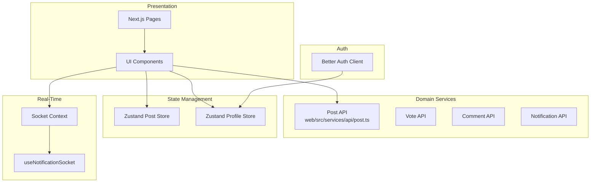

**Diagram sources**
- [web/src/services/api/post.ts](file://web/src/services/api/post.ts#L1-L49)
- [web/src/store/postStore.ts](file://web/src/store/postStore.ts#L1-L29)
- [web/src/store/profileStore.ts](file://web/src/store/profileStore.ts#L1-L57)
- [web/src/socket/useSocket.ts](file://web/src/socket/useSocket.ts#L1-L9)
- [web/src/hooks/useNotificationSocket.tsx](file://web/src/hooks/useNotificationSocket.tsx#L1-L47)
- [web/src/lib/auth-client.ts](file://web/src/lib/auth-client.ts#L1-L11)

## Detailed Component Analysis

### Root Layout and App Shell
- Root layout defines metadata and global fonts, and wraps children in an HTML element with an ID for theme targeting.
- App layout:
  - Provides a sidebar with navigation tabs for feed, college, trending, branches, and topics.
  - Includes a fixed footer with CreatePost and AuthCard.
  - Wraps children with a SocketProvider to enable real-time features.

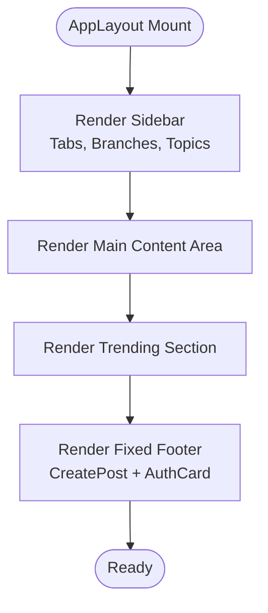

**Diagram sources**
- [web/src/app/(root)/(app)/layout.tsx](file://web/src/app/(root)/(app)/layout.tsx#L21-L131)

**Section sources**
- [web/src/app/layout.tsx](file://web/src/app/layout.tsx#L1-L35)
- [web/src/app/(root)/(app)/layout.tsx](file://web/src/app/(root)/(app)/layout.tsx#L1-L131)

### Feed Page and Post Rendering
- Fetches posts with optional branch/topic filters, sets loading state, and renders either skeletons or posts.
- Handles empty state with refresh and clear-filters actions.
- Passes post props to Post component, including engagement metrics and user vote state.

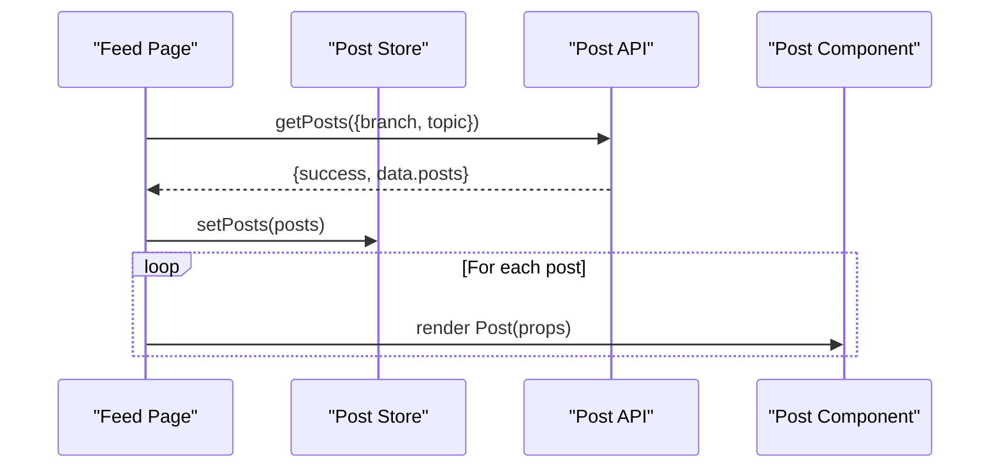

**Diagram sources**
- [web/src/app/(root)/(app)/page.tsx](file://web/src/app/(root)/(app)/page.tsx#L16-L180)
- [web/src/services/api/post.ts](file://web/src/services/api/post.ts#L13-L16)
- [web/src/store/postStore.ts](file://web/src/store/postStore.ts#L12-L26)

**Section sources**
- [web/src/app/(root)/(app)/page.tsx](file://web/src/app/(root)/(app)/page.tsx#L1-L200)
- [web/src/services/api/post.ts](file://web/src/services/api/post.ts#L1-L49)
- [web/src/store/postStore.ts](file://web/src/store/postStore.ts#L1-L29)

### Post Creation Workflow
- CreatePost opens a modal with CreatePostForm containing:
  - Title, topic, content, and private toggle
  - Validation via Zod and react-hook-form
  - Moderation checks and preview highlighting
  - Terms acceptance flow when server responds with a terms-related code
  - Adds/updates post in Zustand store and closes modal

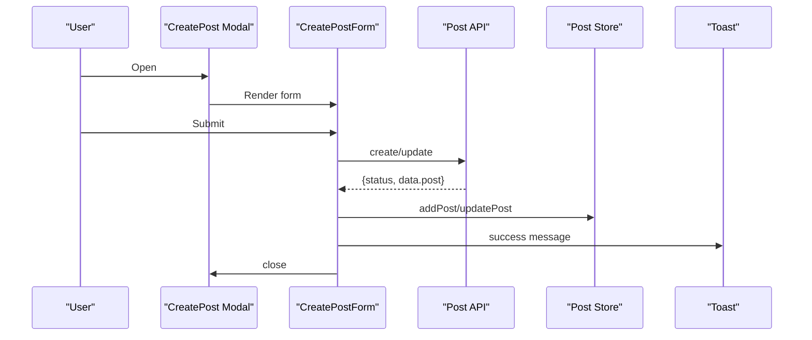

**Diagram sources**
- [web/src/components/general/CreatePost.tsx](file://web/src/components/general/CreatePost.tsx#L40-L133)
- [web/src/services/api/post.ts](file://web/src/services/api/post.ts#L26-L38)
- [web/src/store/postStore.ts](file://web/src/store/postStore.ts#L12-L26)

**Section sources**
- [web/src/components/general/CreatePost.tsx](file://web/src/components/general/CreatePost.tsx#L1-L276)
- [web/src/services/api/post.ts](file://web/src/services/api/post.ts#L1-L49)
- [web/src/store/postStore.ts](file://web/src/store/postStore.ts#L1-L29)

### Post and Comment Components
- Post component:
  - Renders author avatar, branch, college, username, topic, timestamps, and content
  - Integrates EngagementComponent for voting/comments/views/share
  - Supports edit/delete via PostDropdown when authorized
- Comment component:
  - Renders nested replies with expand/collapse
  - Integrates EngagementComponent for comment-level voting and reply counts

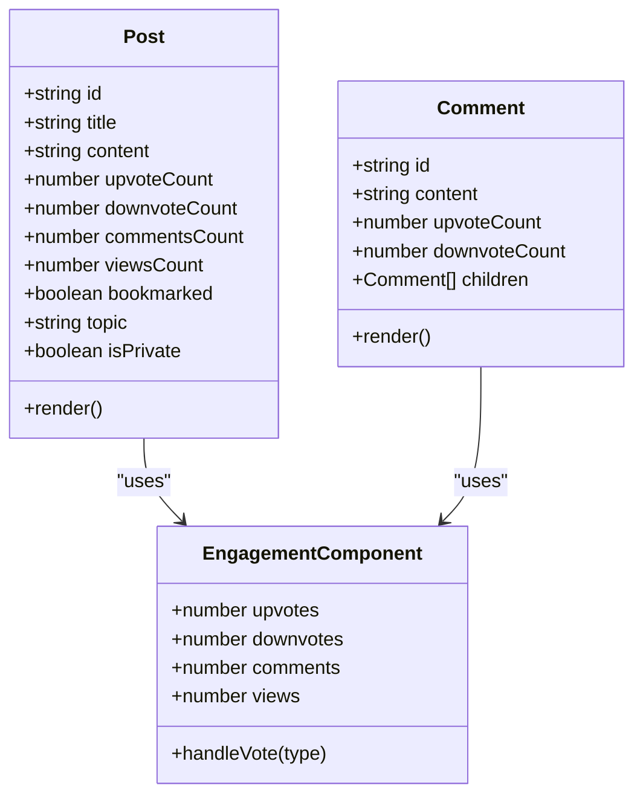

**Diagram sources**
- [web/src/components/general/Post.tsx](file://web/src/components/general/Post.tsx#L20-L98)
- [web/src/components/general/Comment.tsx](file://web/src/components/general/Comment.tsx#L19-L77)
- [web/src/components/general/EngagementComponent.tsx](file://web/src/components/general/EngagementComponent.tsx#L32-L205)

**Section sources**
- [web/src/components/general/Post.tsx](file://web/src/components/general/Post.tsx#L1-L98)
- [web/src/components/general/Comment.tsx](file://web/src/components/general/Comment.tsx#L1-L77)
- [web/src/components/general/EngagementComponent.tsx](file://web/src/components/general/EngagementComponent.tsx#L1-L205)

### Voting Mechanism and Optimistic Updates
- EngagementComponent implements optimistic UI updates for upvotes/downvotes:
  - Computes updated counts based on current state and action
  - Sends vote requests to vote API (create/patch/delete)
  - Reverts UI on error via error handler hook
- Supports disabling interactions during network requests.

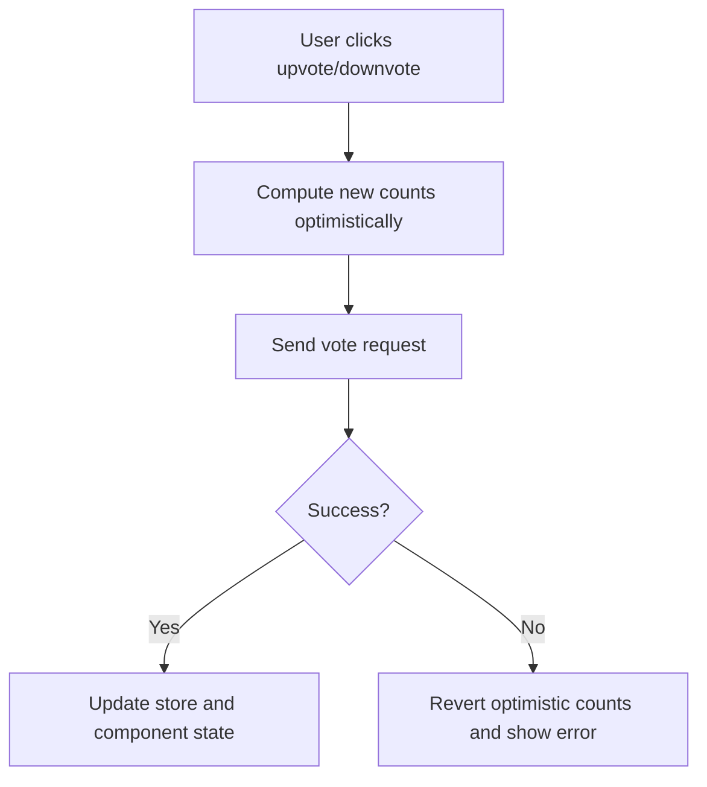

**Diagram sources**
- [web/src/components/general/EngagementComponent.tsx](file://web/src/components/general/EngagementComponent.tsx#L74-L139)

**Section sources**
- [web/src/components/general/EngagementComponent.tsx](file://web/src/components/general/EngagementComponent.tsx#L1-L205)

### Real-Time Notifications via WebSocket
- useSocket provides access to the socket context established in AppLayout.
- useNotificationSocket:
  - Emits “initial-setup” with user ID on mount
  - Subscribes to “notification” and “notification-count” events
  - Displays toast notifications with “View” action to navigate to post

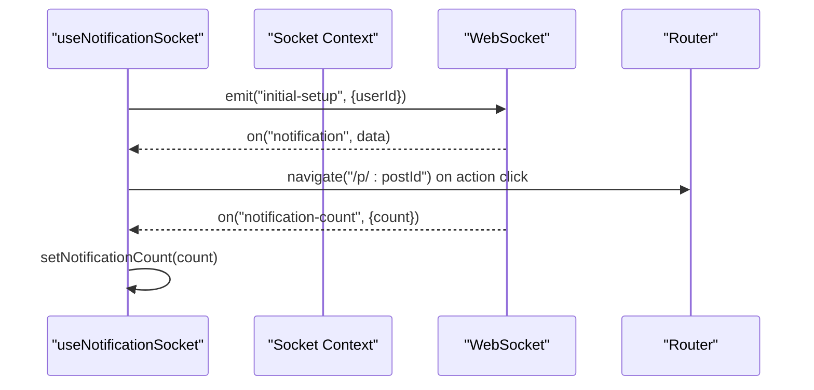

**Diagram sources**
- [web/src/hooks/useNotificationSocket.tsx](file://web/src/hooks/useNotificationSocket.tsx#L9-L46)
- [web/src/socket/useSocket.ts](file://web/src/socket/useSocket.ts#L1-L9)
- [web/src/app/(root)/(app)/layout.tsx](file://web/src/app/(root)/(app)/layout.tsx#L27-L34)

**Section sources**
- [web/src/hooks/useNotificationSocket.tsx](file://web/src/hooks/useNotificationSocket.tsx#L1-L47)
- [web/src/socket/useSocket.ts](file://web/src/socket/useSocket.ts#L1-L9)
- [web/src/app/(root)/(app)/layout.tsx](file://web/src/app/(root)/(app)/layout.tsx#L1-L37)

### Authentication and Session Management
- Sign-in page uses Better Auth client to authenticate via email/password or Google OAuth.
- On successful sign-in, navigates to home; on specific errors, redirects to password recovery.
- Auth client configuration points to server-side Better Auth endpoints.

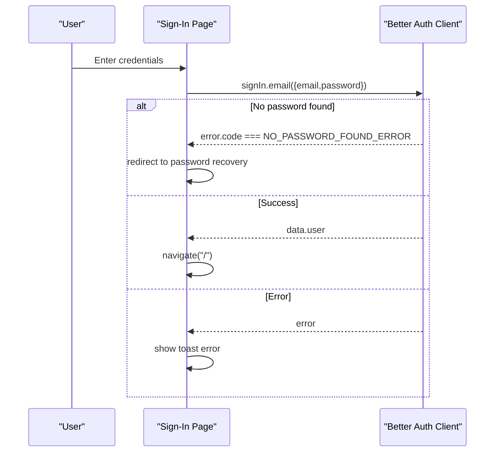

**Diagram sources**
- [web/src/app/(root)/auth/signin/page.tsx](file://web/src/app/(root)/auth/signin/page.tsx#L27-L69)
- [web/src/lib/auth-client.ts](file://web/src/lib/auth-client.ts#L1-L11)

**Section sources**
- [web/src/app/(root)/auth/signin/page.tsx](file://web/src/app/(root)/auth/signin/page.tsx#L1-L140)
- [web/src/lib/auth-client.ts](file://web/src/lib/auth-client.ts#L1-L11)

### State Management with Zustand
- postStore:
  - Holds posts array, setters for replacing, adding, removing, and updating posts
- profileStore:
  - Holds theme and profile, with persistence to localStorage and DOM attribute
  - Provides mutation methods for profile and theme

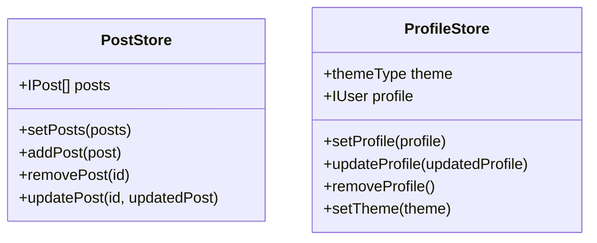

**Diagram sources**
- [web/src/store/postStore.ts](file://web/src/store/postStore.ts#L4-L26)
- [web/src/store/profileStore.ts](file://web/src/store/profileStore.ts#L5-L54)

**Section sources**
- [web/src/store/postStore.ts](file://web/src/store/postStore.ts#L1-L29)
- [web/src/store/profileStore.ts](file://web/src/store/profileStore.ts#L1-L57)

### Responsive Design, Theme Switching, and Accessibility
- Responsive layout:
  - Sidebar hidden on small screens, fixed footer appears
  - Scrollable content areas with overflow handling
- Theme switching:
  - profileStore.setTheme persists theme to localStorage and applies a data attribute on the root element
- Accessibility:
  - VisuallyHidden wrappers around interactive content within cards
  - Proper ARIA labels and roles on buttons and interactive elements

**Section sources**
- [web/src/app/(root)/(app)/layout.tsx](file://web/src/app/(root)/(app)/layout.tsx#L39-L131)
- [web/src/store/profileStore.ts](file://web/src/store/profileStore.ts#L48-L54)
- [web/src/components/general/Post.tsx](file://web/src/components/general/Post.tsx#L11-L57)
- [web/src/components/general/EngagementComponent.tsx](file://web/src/components/general/EngagementComponent.tsx#L141-L201)

### API Integration Patterns, Error Handling, and Loading States
- API services:
  - postApi encapsulates GET/POST/PATCH/DELETE endpoints for posts and trending
- Error handling:
  - Centralized error handling hook used across components to present user-friendly messages and retry logic
- Loading states:
  - Feed uses skeleton cards while posts are being fetched
  - Buttons and interactions are disabled during async operations

**Section sources**
- [web/src/services/api/post.ts](file://web/src/services/api/post.ts#L1-L49)
- [web/src/app/(root)/(app)/page.tsx](file://web/src/app/(root)/(app)/page.tsx#L16-L61)
- [web/src/components/general/CreatePost.tsx](file://web/src/components/general/CreatePost.tsx#L82-L133)

## Dependency Analysis
Key dependencies and relationships:
- App layout depends on SocketProvider to enable real-time features
- Feed page depends on postStore and postApi
- EngagementComponent depends on voteApi and error handling
- CreatePost depends on postApi, profileStore, and moderation utilities
- useNotificationSocket depends on socket context and profileStore

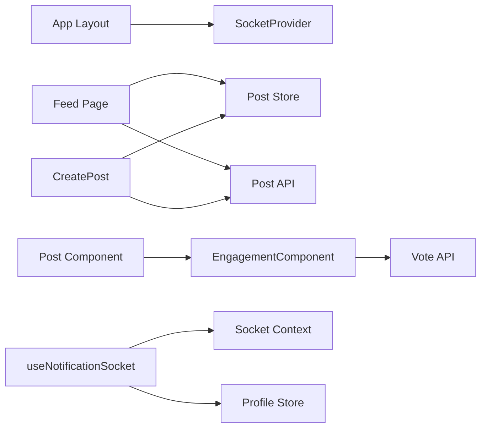

**Diagram sources**
- [web/src/app/(root)/(app)/layout.tsx](file://web/src/app/(root)/(app)/layout.tsx#L27-L34)
- [web/src/app/(root)/(app)/page.tsx](file://web/src/app/(root)/(app)/page.tsx#L1-L200)
- [web/src/components/general/EngagementComponent.tsx](file://web/src/components/general/EngagementComponent.tsx#L1-L205)
- [web/src/components/general/CreatePost.tsx](file://web/src/components/general/CreatePost.tsx#L1-L276)
- [web/src/hooks/useNotificationSocket.tsx](file://web/src/hooks/useNotificationSocket.tsx#L1-L47)

**Section sources**
- [web/src/app/(root)/(app)/layout.tsx](file://web/src/app/(root)/(app)/layout.tsx#L1-L37)
- [web/src/app/(root)/(app)/page.tsx](file://web/src/app/(root)/(app)/page.tsx#L1-L200)
- [web/src/components/general/EngagementComponent.tsx](file://web/src/components/general/EngagementComponent.tsx#L1-L205)
- [web/src/components/general/CreatePost.tsx](file://web/src/components/general/CreatePost.tsx#L1-L276)
- [web/src/hooks/useNotificationSocket.tsx](file://web/src/hooks/useNotificationSocket.tsx#L1-L47)

## Performance Considerations
- Prefer optimistic UI updates for immediate feedback during voting and post creation to reduce perceived latency.
- Use minimal re-renders by passing memoized props and leveraging Zustand selectors.
- Lazy load heavy components and avoid unnecessary subscriptions; clean up event listeners in hooks.
- Paginate or limit feed results to reduce initial payload sizes.

## Troubleshooting Guide
- Authentication failures:
  - Verify Better Auth client base URL and plugin configuration.
  - Check server-side auth endpoints and CORS settings.
- Real-time notifications:
  - Ensure socket connection is initialized and “initial-setup” is emitted after profile is available.
  - Confirm event names match server emissions (“notification”, “notification-count”).
- API errors:
  - Use centralized error handling to surface actionable messages and provide retry options.
  - Validate request payloads and response shapes against service definitions.

**Section sources**
- [web/src/lib/auth-client.ts](file://web/src/lib/auth-client.ts#L1-L11)
- [web/src/hooks/useNotificationSocket.tsx](file://web/src/hooks/useNotificationSocket.tsx#L14-L43)
- [web/src/services/api/post.ts](file://web/src/services/api/post.ts#L13-L48)

## Conclusion
The web application provides a robust, modular Next.js frontend with strong UX patterns: authenticated app shell, filtered feeds, rich social interactions, real-time notifications, and resilient state management. The documented components, stores, and APIs offer a clear blueprint for extending features, improving performance, and maintaining accessibility and responsiveness across devices.