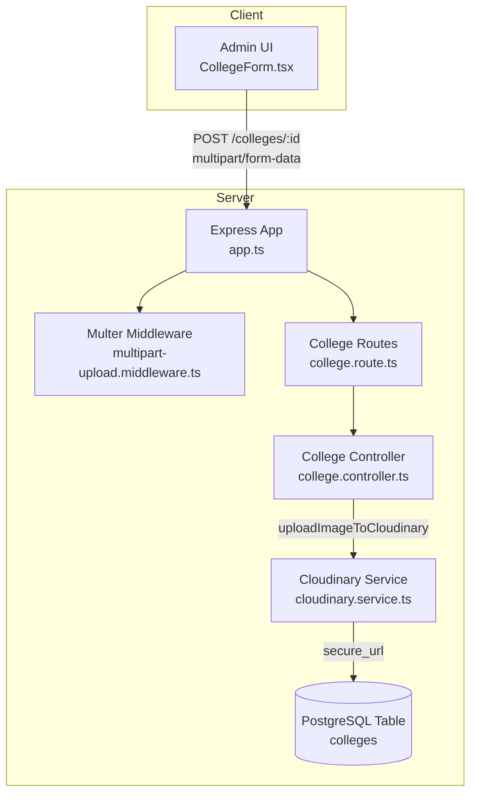
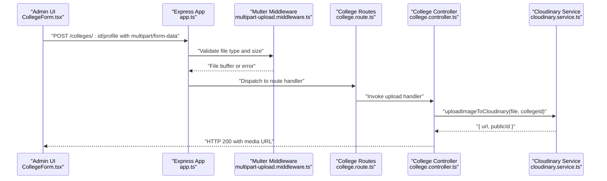
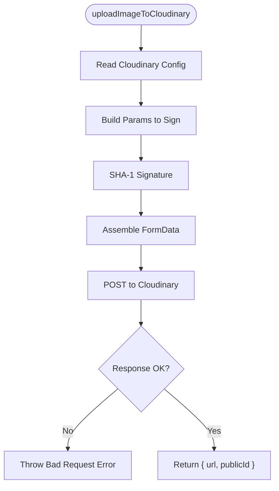
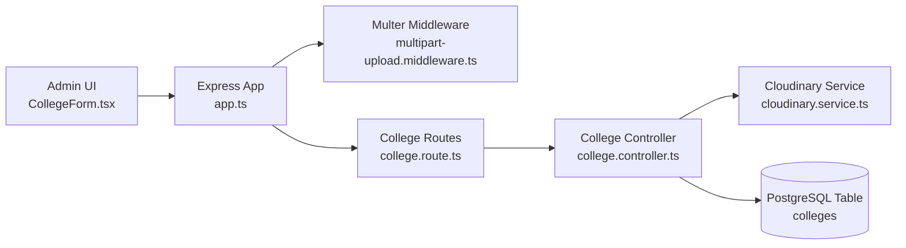

# Media Services

<cite>
**Referenced Files in This Document**
- [cloudinary.service.ts](file://server/src/infra/services/media/cloudinary.service.ts)
- [multipart-upload.middleware.ts](file://server/src/core/middlewares/multipart-upload.middleware.ts)
- [college.controller.ts](file://server/src/modules/college/college.controller.ts)
- [college.route.ts](file://server/src/modules/college/college.route.ts)
- [CollegeForm.tsx](file://admin/src/components/forms/CollegeForm.tsx)
- [college.table.ts](file://server/src/infra/db/tables/college.table.ts)
- [app.ts](file://server/src/app.ts)
</cite>

## Table of Contents
1. [Introduction](#introduction)
2. [Project Structure](#project-structure)
3. [Core Components](#core-components)
4. [Architecture Overview](#architecture-overview)
5. [Detailed Component Analysis](#detailed-component-analysis)
6. [Dependency Analysis](#dependency-analysis)
7. [Performance Considerations](#performance-considerations)
8. [Troubleshooting Guide](#troubleshooting-guide)
9. [Conclusion](#conclusion)

## Introduction
This document describes the Media Services implementation within the Flick platform, focusing on image upload workflows for college profiles using Cloudinary. It explains how client applications submit media, how the backend validates and processes uploads, and how the resulting media URLs are persisted in the database. The goal is to provide a clear understanding of the media pipeline for developers and administrators, including integration points, error handling, and operational considerations.

## Project Structure
The media services span three primary areas:
- Frontend (Admin): Provides a form for uploading college profile images via a multipart form submission.
- Backend (Server): Validates uploads, authenticates requests, and delegates image processing to Cloudinary.
- Storage: Stores the resolved media URL in the college entity.

**Diagram sources**
- [app.ts](file://server/src/app.ts#L10-L30)
- [multipart-upload.middleware.ts](file://server/src/core/middlewares/multipart-upload.middleware.ts#L1-L19)
- [college.route.ts](file://server/src/modules/college/college.route.ts#L1-L16)
- [college.controller.ts](file://server/src/modules/college/college.controller.ts#L1-L66)
- [cloudinary.service.ts](file://server/src/infra/services/media/cloudinary.service.ts#L1-L73)
- [college.table.ts](file://server/src/infra/db/tables/college.table.ts#L1-L18)

**Section sources**
- [app.ts](file://server/src/app.ts#L1-L33)
- [college.route.ts](file://server/src/modules/college/college.route.ts#L1-L16)

## Core Components
- Cloudinary Image Upload Service: Handles signing, upload, and URL retrieval for profile images.
- Multer Middleware: Validates and limits incoming image uploads.
- College Controller: Orchestrates the upload flow and persists the returned URL.
- College Route: Exposes the upload endpoint guarded by rate limiting and admin-only policies.
- Admin UI Form: Submits the image via multipart/form-data to the backend.
- Database Schema: Stores the resolved media URL for each college.

Key responsibilities:
- Validate file type and size on the server.
- Sign and upload images to Cloudinary with appropriate transformations.
- Persist the Cloudinary secure URL to the college record.
- Return standardized responses to clients.

**Section sources**
- [cloudinary.service.ts](file://server/src/infra/services/media/cloudinary.service.ts#L1-L73)
- [multipart-upload.middleware.ts](file://server/src/core/middlewares/multipart-upload.middleware.ts#L1-L19)
- [college.controller.ts](file://server/src/modules/college/college.controller.ts#L1-L66)
- [college.route.ts](file://server/src/modules/college/college.route.ts#L1-L16)
- [CollegeForm.tsx](file://admin/src/components/forms/CollegeForm.tsx#L66-L91)
- [college.table.ts](file://server/src/infra/db/tables/college.table.ts#L1-L18)

## Architecture Overview
The media upload flow follows a clear sequence from client to Cloudinary and back to the application.

**Diagram sources**
- [CollegeForm.tsx](file://admin/src/components/forms/CollegeForm.tsx#L66-L91)
- [app.ts](file://server/src/app.ts#L10-L30)
- [multipart-upload.middleware.ts](file://server/src/core/middlewares/multipart-upload.middleware.ts#L1-L19)
- [college.route.ts](file://server/src/modules/college/college.route.ts#L1-L16)
- [college.controller.ts](file://server/src/modules/college/college.controller.ts#L1-L66)
- [cloudinary.service.ts](file://server/src/infra/services/media/cloudinary.service.ts#L14-L73)

## Detailed Component Analysis

### Cloudinary Image Upload Service
Responsibilities:
- Construct signed upload parameters using Cloudinary credentials.
- Transform uploaded images to a standardized format.
- Upload the image to Cloudinary and return the secure URL.

Implementation highlights:
- Uses Node.js crypto for SHA-1 signature generation.
- Builds a FormData payload with required Cloudinary parameters.
- Throws a structured HTTP error on upload failure.

**Diagram sources**
- [cloudinary.service.ts](file://server/src/infra/services/media/cloudinary.service.ts#L6-L73)

**Section sources**
- [cloudinary.service.ts](file://server/src/infra/services/media/cloudinary.service.ts#L1-L73)

### Multer Middleware for Image Uploads
Responsibilities:
- Enforce file type filtering to allow only images.
- Limit maximum file size.
- Store files in memory for processing.

Behavior:
- Rejects non-image files with an error.
- Limits uploads to a fixed size threshold.

**Section sources**
- [multipart-upload.middleware.ts](file://server/src/core/middlewares/multipart-upload.middleware.ts#L1-L19)

### College Controller Upload Handler
Responsibilities:
- Parse and validate request parameters.
- Delegate upload to the Cloudinary service.
- Persist the returned URL to the college record.
- Return a standardized success response.

Integration points:
- Uses the college ID from the route to construct the Cloudinary public ID.
- Returns the media URL for immediate UI updates.

**Section sources**
- [college.controller.ts](file://server/src/modules/college/college.controller.ts#L1-L66)

### College Route Registration
Responsibilities:
- Register the upload endpoint under the college routes.
- Apply rate limiting and admin-only middleware.

Security and performance:
- Rate limiting protects against abuse.
- Admin-only ensures only authorized users can upload.

**Section sources**
- [college.route.ts](file://server/src/modules/college/college.route.ts#L1-L16)

### Admin UI Form Submission
Responsibilities:
- Capture the selected image file.
- Submit as multipart/form-data to the backend.
- Update the form field with the returned media URL.

Client behavior:
- Disables controls during upload.
- Displays success or error notifications.

**Section sources**
- [CollegeForm.tsx](file://admin/src/components/forms/CollegeForm.tsx#L66-L91)

### Database Schema for Media Storage
Responsibilities:
- Define the college table with a profile URL column.
- Provide indexes for efficient queries.

Schema highlights:
- Default profile URL for new records.
- Indexes on frequently queried columns.

**Section sources**
- [college.table.ts](file://server/src/infra/db/tables/college.table.ts#L1-L18)

## Dependency Analysis
The media upload pipeline exhibits clear separation of concerns with minimal coupling between components.

**Diagram sources**
- [CollegeForm.tsx](file://admin/src/components/forms/CollegeForm.tsx#L66-L91)
- [app.ts](file://server/src/app.ts#L10-L30)
- [multipart-upload.middleware.ts](file://server/src/core/middlewares/multipart-upload.middleware.ts#L1-L19)
- [college.route.ts](file://server/src/modules/college/college.route.ts#L1-L16)
- [college.controller.ts](file://server/src/modules/college/college.controller.ts#L1-L66)
- [cloudinary.service.ts](file://server/src/infra/services/media/cloudinary.service.ts#L1-L73)
- [college.table.ts](file://server/src/infra/db/tables/college.table.ts#L1-L18)

**Section sources**
- [college.route.ts](file://server/src/modules/college/college.route.ts#L1-L16)
- [college.controller.ts](file://server/src/modules/college/college.controller.ts#L1-L66)
- [cloudinary.service.ts](file://server/src/infra/services/media/cloudinary.service.ts#L1-L73)
- [college.table.ts](file://server/src/infra/db/tables/college.table.ts#L1-L18)

## Performance Considerations
- Upload size limits: Multer enforces a maximum file size to prevent oversized uploads.
- In-memory buffering: Files are stored in memory; ensure adequate server memory for concurrent uploads.
- CDN delivery: Cloudinary delivers media via a global CDN, reducing latency.
- Transformation caching: Cloudinary caches transformed images; repeated requests benefit from caching.
- Rate limiting: Applied at the route level to protect backend resources.

## Troubleshooting Guide
Common issues and resolutions:
- Invalid file type: Ensure the uploaded file is an image; non-image files are rejected by the middleware.
- Upload size exceeded: Reduce file size below the configured limit.
- Cloudinary upload failures: Verify Cloudinary credentials and network connectivity; the service throws a structured error on failure.
- Missing college ID: Ensure the route includes a valid UUID for the target college.
- CORS or header issues: Confirm the frontend sets the correct Content-Type for multipart/form-data submissions.

Operational checks:
- Confirm environment variables for Cloudinary are set.
- Validate that the college record exists before attempting uploads.
- Monitor Cloudinary API status and quotas.

**Section sources**
- [multipart-upload.middleware.ts](file://server/src/core/middlewares/multipart-upload.middleware.ts#L1-L19)
- [cloudinary.service.ts](file://server/src/infra/services/media/cloudinary.service.ts#L66-L73)
- [college.controller.ts](file://server/src/modules/college/college.controller.ts#L1-L66)

## Conclusion
The Media Services implementation provides a robust, secure, and scalable pipeline for uploading and serving college profile images. By leveraging Cloudinary for storage and transformation, enforcing strict upload validation, and persisting the resulting URLs in the database, the system balances performance, reliability, and ease of maintenance. Administrators can confidently manage media assets, while developers can extend the pipeline with additional transformations or providers as needed.