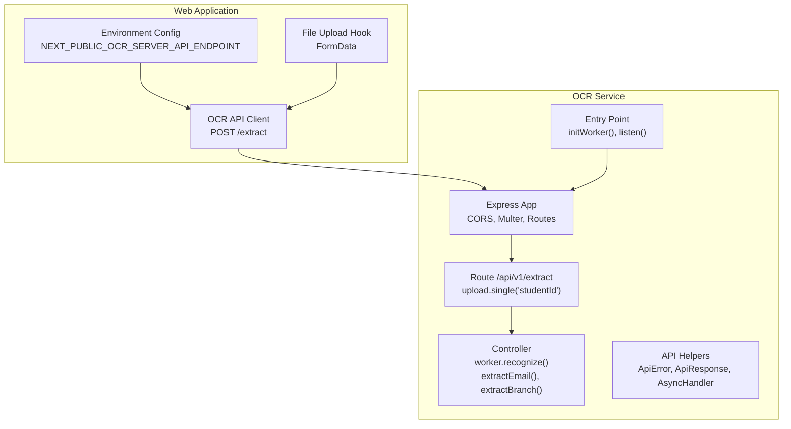
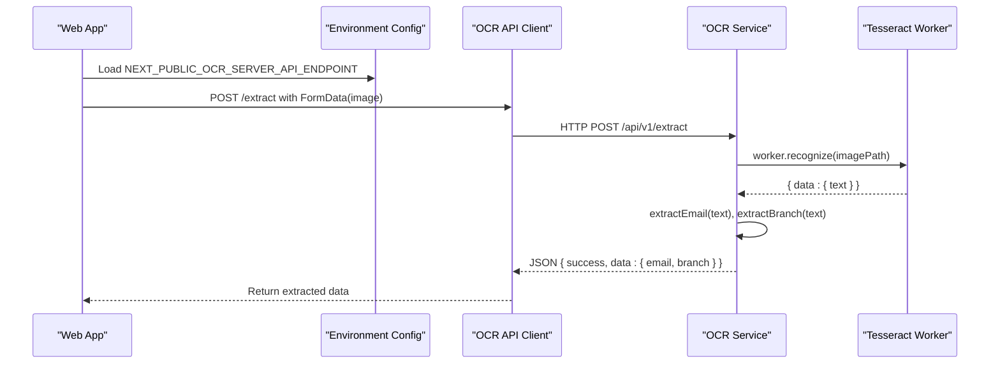
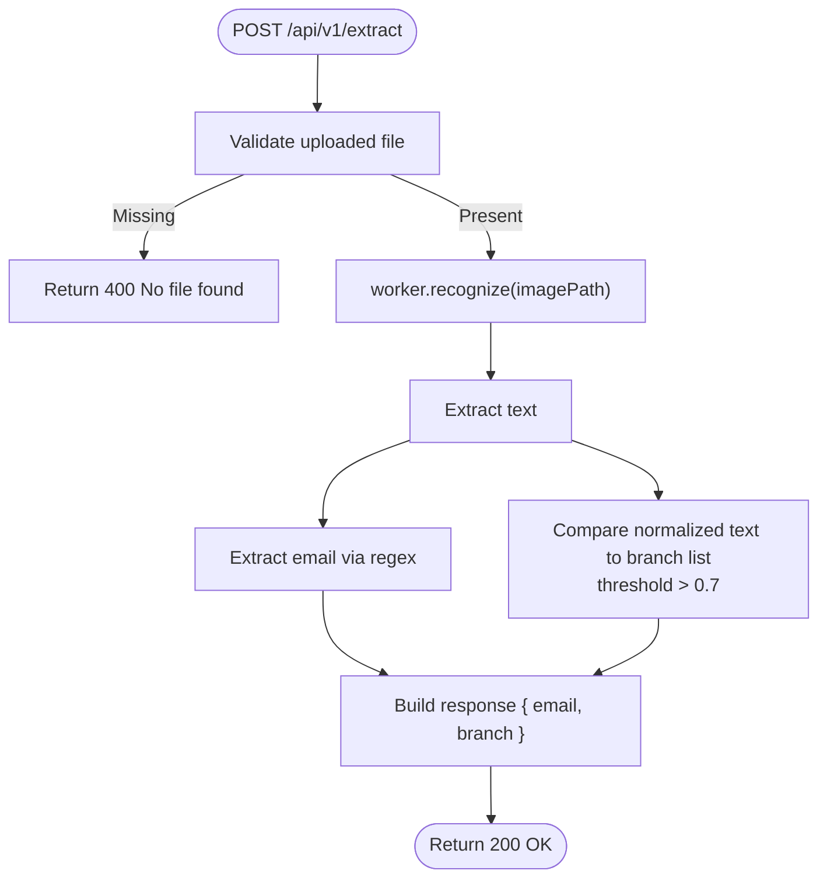
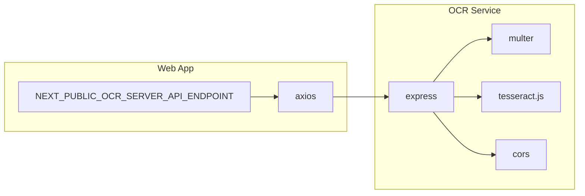

# OCR Integration

<cite>
**Referenced Files in This Document**
- [ocr/src/index.ts](file://ocr/src/index.ts)
- [ocr/src/app.ts](file://ocr/src/app.ts)
- [ocr/src/controllers/extract.controller.ts](file://ocr/src/controllers/extract.controller.ts)
- [ocr/src/routes/extract.route.ts](file://ocr/src/routes/extract.route.ts)
- [ocr/src/utils/ApiHelpers.ts](file://ocr/src/utils/ApiHelpers.ts)
- [ocr/src/conf/cors.ts](file://ocr/src/conf/cors.ts)
- [ocr/package.json](file://ocr/package.json)
- [ocr/.env](file://ocr/.env)
- [web/src/services/api/ocr.ts](file://web/src/services/api/ocr.ts)
- [web/src/config/env.ts](file://web/src/config/env.ts)
- [web/src/hooks/use-file-upload.ts](file://web/src/hooks/use-file-upload.ts)
- [admin/src/pages/AdminVerificationPage.tsx](file://admin/src/pages/AdminVerificationPage.tsx)
</cite>

## Table of Contents
1. [Introduction](#introduction)
2. [Project Structure](#project-structure)
3. [Core Components](#core-components)
4. [Architecture Overview](#architecture-overview)
5. [Detailed Component Analysis](#detailed-component-analysis)
6. [Dependency Analysis](#dependency-analysis)
7. [Performance Considerations](#performance-considerations)
8. [Troubleshooting Guide](#troubleshooting-guide)
9. [Privacy and Data Retention](#privacy-and-data-retention)
10. [Conclusion](#conclusion)

## Introduction
This document describes the OCR integration for the Flick platform’s student verification system. It covers the standalone OCR service built with Tesseract.js for processing student ID images, extracting text, and validating structured data such as email and branch. It also documents the integration with the main web application, API specifications, supported formats, processing limitations, training data configuration, language support, accuracy optimization, privacy considerations, and troubleshooting guidance.

## Project Structure
The OCR subsystem is implemented as a separate microservice under the ocr directory. It exposes a single endpoint to upload a student ID image and returns extracted email and branch metadata. The web application integrates with this service via a dedicated API client and environment configuration.

**Diagram sources**
- [ocr/src/index.ts](file://ocr/src/index.ts#L1-L10)
- [ocr/src/app.ts](file://ocr/src/app.ts#L1-L37)
- [ocr/src/routes/extract.route.ts](file://ocr/src/routes/extract.route.ts#L1-L8)
- [ocr/src/controllers/extract.controller.ts](file://ocr/src/controllers/extract.controller.ts#L1-L64)
- [ocr/src/utils/ApiHelpers.ts](file://ocr/src/utils/ApiHelpers.ts#L1-L55)
- [web/src/services/api/ocr.ts](file://web/src/services/api/ocr.ts#L1-L17)
- [web/src/config/env.ts](file://web/src/config/env.ts#L1-L29)
- [web/src/hooks/use-file-upload.ts](file://web/src/hooks/use-file-upload.ts#L1-L414)

**Section sources**
- [ocr/src/index.ts](file://ocr/src/index.ts#L1-L10)
- [ocr/src/app.ts](file://ocr/src/app.ts#L1-L37)
- [ocr/src/controllers/extract.controller.ts](file://ocr/src/controllers/extract.controller.ts#L1-L64)
- [ocr/src/routes/extract.route.ts](file://ocr/src/routes/extract.route.ts#L1-L8)
- [ocr/src/utils/ApiHelpers.ts](file://ocr/src/utils/ApiHelpers.ts#L1-L55)
- [ocr/src/conf/cors.ts](file://ocr/src/conf/cors.ts#L1-L3)
- [ocr/package.json](file://ocr/package.json#L1-L34)
- [ocr/.env](file://ocr/.env#L1-L4)
- [web/src/services/api/ocr.ts](file://web/src/services/api/ocr.ts#L1-L17)
- [web/src/config/env.ts](file://web/src/config/env.ts#L1-L29)
- [web/src/hooks/use-file-upload.ts](file://web/src/hooks/use-file-upload.ts#L1-L414)

## Core Components
- OCR Service Entry Point
  - Initializes the Tesseract worker and starts the HTTP server.
  - Exposes environment-driven port and CORS policy.
  - References: [ocr/src/index.ts](file://ocr/src/index.ts#L1-L10), [ocr/.env](file://ocr/.env#L1-L4)

- Express App and Middleware
  - Configures CORS, JSON/URL-encoded body parsing, static serving, and Multer disk storage for uploads.
  - Mounts the OCR route under /api/v1/extract with a single-file upload field named studentId.
  - References: [ocr/src/app.ts](file://ocr/src/app.ts#L1-L37)

- OCR Controller
  - Initializes the Tesseract worker with the English language model.
  - Recognizes text from the uploaded image and extracts email and branch.
  - Uses similarity matching to detect branch abbreviations against a predefined list.
  - References: [ocr/src/controllers/extract.controller.ts](file://ocr/src/controllers/extract.controller.ts#L1-L64)

- Route Definition
  - Defines POST /api/v1/extract to trigger the extraction workflow.
  - References: [ocr/src/routes/extract.route.ts](file://ocr/src/routes/extract.route.ts#L1-L8)

- API Helpers
  - Provides ApiError and ApiResponse wrappers and an AsyncHandler decorator for consistent error handling.
  - References: [ocr/src/utils/ApiHelpers.ts](file://ocr/src/utils/ApiHelpers.ts#L1-L55)

- Web Application Integration
  - Environment configuration defines the OCR server endpoint.
  - API client posts FormData to the OCR endpoint.
  - File upload hook manages image selection and previews.
  - References: [web/src/config/env.ts](file://web/src/config/env.ts#L1-L29), [web/src/services/api/ocr.ts](file://web/src/services/api/ocr.ts#L1-L17), [web/src/hooks/use-file-upload.ts](file://web/src/hooks/use-file-upload.ts#L1-L414)

**Section sources**
- [ocr/src/index.ts](file://ocr/src/index.ts#L1-L10)
- [ocr/src/app.ts](file://ocr/src/app.ts#L1-L37)
- [ocr/src/controllers/extract.controller.ts](file://ocr/src/controllers/extract.controller.ts#L1-L64)
- [ocr/src/routes/extract.route.ts](file://ocr/src/routes/extract.route.ts#L1-L8)
- [ocr/src/utils/ApiHelpers.ts](file://ocr/src/utils/ApiHelpers.ts#L1-L55)
- [web/src/config/env.ts](file://web/src/config/env.ts#L1-L29)
- [web/src/services/api/ocr.ts](file://web/src/services/api/ocr.ts#L1-L17)
- [web/src/hooks/use-file-upload.ts](file://web/src/hooks/use-file-upload.ts#L1-L414)

## Architecture Overview
The OCR pipeline consists of a frontend upload flow and a backend recognition service. The frontend constructs a FormData payload and sends it to the OCR service. The OCR service recognizes text from the image and returns structured data (email and branch).

**Diagram sources**
- [web/src/config/env.ts](file://web/src/config/env.ts#L1-L29)
- [web/src/services/api/ocr.ts](file://web/src/services/api/ocr.ts#L1-L17)
- [ocr/src/app.ts](file://ocr/src/app.ts#L1-L37)
- [ocr/src/routes/extract.route.ts](file://ocr/src/routes/extract.route.ts#L1-L8)
- [ocr/src/controllers/extract.controller.ts](file://ocr/src/controllers/extract.controller.ts#L1-L64)

## Detailed Component Analysis

### OCR Controller and Text Extraction
The controller initializes a Tesseract worker with the English language model and performs text recognition on the uploaded image. It then applies two extraction strategies:
- Email extraction: A regular expression identifies candidate email addresses.
- Branch extraction: Normalizes the recognized text and compares it to a fixed list of branches using similarity scoring. A configurable threshold determines whether a match is accepted.

**Diagram sources**
- [ocr/src/controllers/extract.controller.ts](file://ocr/src/controllers/extract.controller.ts#L1-L64)

**Section sources**
- [ocr/src/controllers/extract.controller.ts](file://ocr/src/controllers/extract.controller.ts#L1-L64)

### API Specification
- Base Path
  - /api/v1/extract
- Method
  - POST
- Content Type
  - multipart/form-data
- Required Field
  - studentId: image file (single file)
- Response
  - success: boolean
  - data.email: string | null
  - data.branch: string | null
- Example Request
  - FormData with key studentId and an image file
- Example Response
  - {
      "success": true,
      "data": {
        "email": "alice@college.edu",
        "branch": "BTECH"
      }
    }

Notes:
- The service does not enforce strict MIME validation; accept and size limits are managed by the frontend hook.
- Responses are returned as JSON with a success flag and extracted fields.

**Section sources**
- [ocr/src/app.ts](file://ocr/src/app.ts#L1-L37)
- [ocr/src/routes/extract.route.ts](file://ocr/src/routes/extract.route.ts#L1-L8)
- [ocr/src/controllers/extract.controller.ts](file://ocr/src/controllers/extract.controller.ts#L1-L64)
- [web/src/services/api/ocr.ts](file://web/src/services/api/ocr.ts#L1-L17)

### Supported Image Formats and Processing Limits
- Upload Handling
  - Single file upload with field name studentId.
  - Destination folder: ./uploads with timestamped filenames.
- Frontend Validation
  - Accepts images by default; size and type validation can be configured via the file upload hook.
  - Provides user feedback for invalid files and previews for selected images.
- Backend Processing
  - The service relies on Tesseract.js for OCR; ensure images are clear and properly oriented for best results.

**Section sources**
- [ocr/src/app.ts](file://ocr/src/app.ts#L6-L15)
- [web/src/hooks/use-file-upload.ts](file://web/src/hooks/use-file-upload.ts#L1-L414)

### Training Data Configuration and Language Support
- Language Model
  - The worker is initialized with the English language model.
- Trained Data
  - The repository includes an English traineddata file, indicating English language support out of the box.
- Extensibility
  - To add languages, include additional traineddata files and initialize the worker with the appropriate language code.

**Section sources**
- [ocr/src/controllers/extract.controller.ts](file://ocr/src/controllers/extract.controller.ts#L8-L10)
- [ocr/package.json](file://ocr/package.json#L15-L33)

### Verification Workflow Integration
- Web Application
  - The frontend uploads the student ID image and receives extracted data.
  - The admin verification page demonstrates OTP-based account verification; while not directly dependent on OCR, it represents the broader verification flow.
- Server Integration
  - The server module defines user verification types and workflows; OCR data can be integrated into the verification pipeline by passing extracted fields to the server-side verification logic.

**Section sources**
- [admin/src/pages/AdminVerificationPage.tsx](file://admin/src/pages/AdminVerificationPage.tsx#L1-L173)
- [server/src/modules/auth/auth.types.ts](file://server/src/modules/auth/auth.types.ts#L1-L9)

## Dependency Analysis
The OCR service depends on Express, Multer, Tesseract.js, and CORS. The web application depends on Axios and environment configuration to call the OCR endpoint.

**Diagram sources**
- [ocr/package.json](file://ocr/package.json#L15-L33)
- [web/src/config/env.ts](file://web/src/config/env.ts#L1-L29)
- [web/src/services/api/ocr.ts](file://web/src/services/api/ocr.ts#L1-L17)

**Section sources**
- [ocr/package.json](file://ocr/package.json#L15-L33)
- [web/src/config/env.ts](file://web/src/config/env.ts#L1-L29)
- [web/src/services/api/ocr.ts](file://web/src/services/api/ocr.ts#L1-L17)

## Performance Considerations
- Worker Initialization
  - The Tesseract worker is initialized once at startup. Avoid reinitializing per request to reduce overhead.
- Image Quality
  - Encourage high-resolution, well-lit images with minimal distortion for improved OCR accuracy.
- Payload Size
  - Keep images appropriately sized to balance quality and latency.
- Concurrency
  - Scale the OCR service horizontally behind a load balancer to handle bursts during peak verification periods.
- Caching
  - Consider caching frequent branch lists and normalization steps if needed.

[No sources needed since this section provides general guidance]

## Troubleshooting Guide
Common issues and resolutions:
- No file found
  - Ensure the multipart field name matches studentId and a single image file is attached.
  - Reference: [ocr/src/controllers/extract.controller.ts](file://ocr/src/controllers/extract.controller.ts#L48-L48)
- Empty or low-quality OCR text
  - Re-capture the image with better lighting and focus. Rotate or crop to center the ID.
  - Verify the English traineddata file is present.
  - Reference: [ocr/src/controllers/extract.controller.ts](file://ocr/src/controllers/extract.controller.ts#L8-L10)
- Branch not detected
  - Confirm the branch abbreviation exists in the predefined list and is readable in the image.
  - Adjust the similarity threshold if necessary.
  - Reference: [ocr/src/controllers/extract.controller.ts](file://ocr/src/controllers/extract.controller.ts#L18-L39)
- CORS errors
  - Verify ACCESS_CONTROL_ORIGIN in the OCR service environment matches the web app origin.
  - Reference: [ocr/.env](file://ocr/.env#L4-L4), [ocr/src/app.ts](file://ocr/src/app.ts#L18-L22)
- Frontend upload issues
  - Check accept and maxSize configurations in the file upload hook.
  - Reference: [web/src/hooks/use-file-upload.ts](file://web/src/hooks/use-file-upload.ts#L86-L122)

**Section sources**
- [ocr/src/controllers/extract.controller.ts](file://ocr/src/controllers/extract.controller.ts#L1-L64)
- [ocr/.env](file://ocr/.env#L1-L4)
- [ocr/src/app.ts](file://ocr/src/app.ts#L18-L22)
- [web/src/hooks/use-file-upload.ts](file://web/src/hooks/use-file-upload.ts#L86-L122)

## Privacy and Data Retention
- Data Minimization
  - Only the student ID image is uploaded for OCR processing. No personal identifiers are stored beyond what is necessary for verification.
- Local Processing
  - The OCR service runs locally and does not transmit images to external providers.
- Data Handling
  - Images are saved temporarily to ./uploads for processing. Ensure cleanup policies are enforced to avoid long-term retention.
- Verification Workflows
  - Integrate extracted data (email, branch) into the server-side verification logic without persisting raw images longer than required.
- Admin Verification Page
  - Demonstrates OTP-based verification; ensure logs and sessions are handled securely and expunged per policy.

[No sources needed since this section provides general guidance]

## Conclusion
The OCR integration leverages Tesseract.js within a dedicated microservice to extract structured data from student ID images. The web application integrates seamlessly via a simple multipart upload API, returning validated email and branch information. By focusing on image quality, language model configuration, and robust error handling, the system supports reliable student verification workflows while maintaining operational simplicity and privacy safeguards.