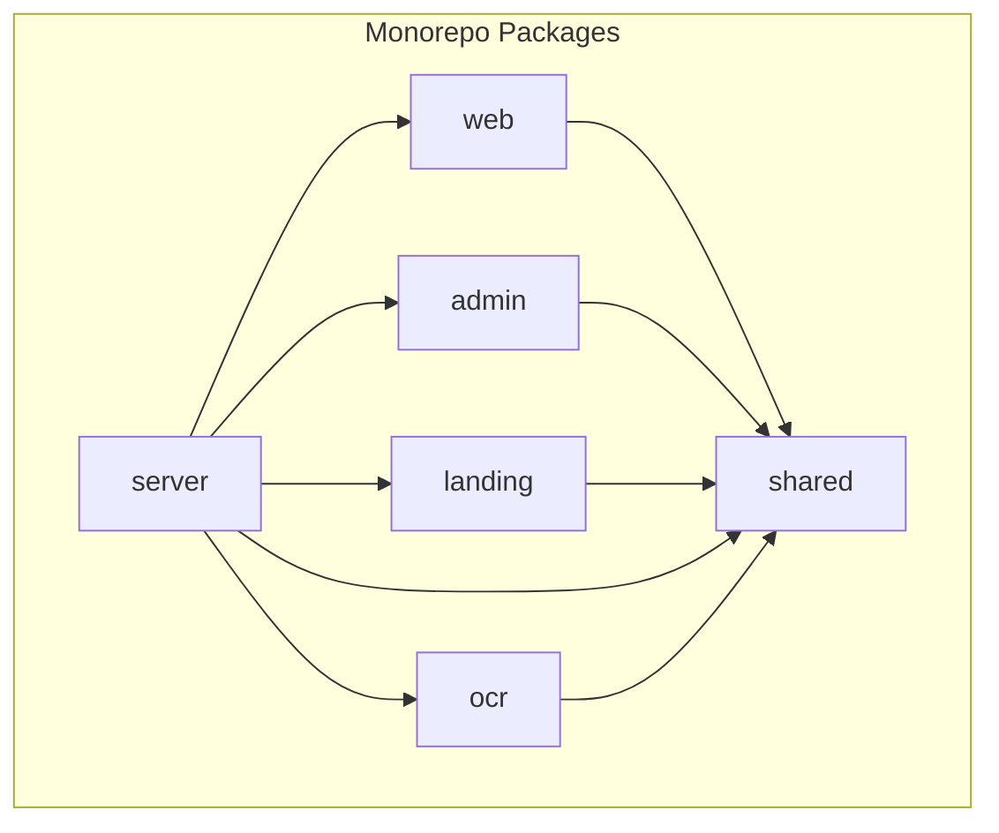
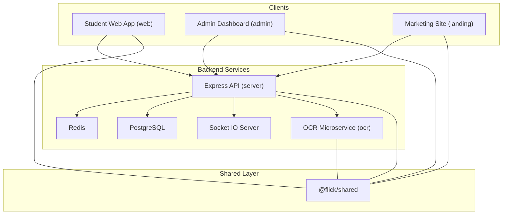
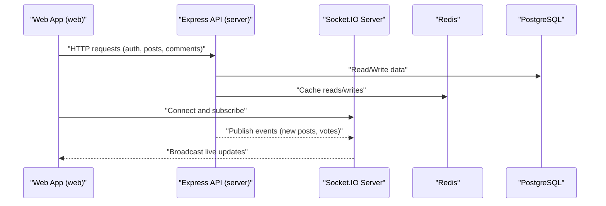
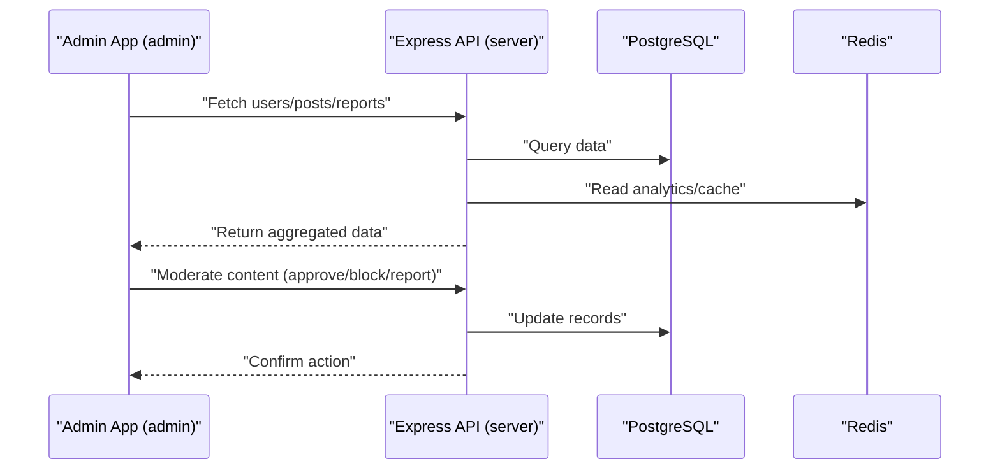
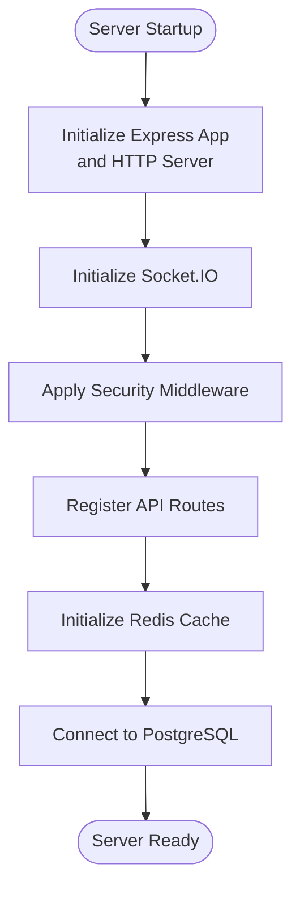
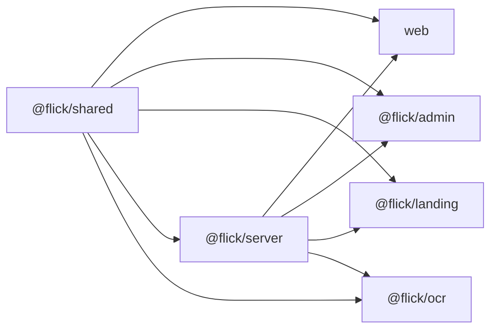

# Project Overview

<cite>
**Referenced Files in This Document**
- [package.json](file://package.json)
- [pnpm-workspace.yaml](file://pnpm-workspace.yaml)
- [server/package.json](file://server/package.json)
- [web/package.json](file://web/package.json)
- [admin/package.json](file://admin/package.json)
- [landing/package.json](file://landing/package.json)
- [ocr/package.json](file://ocr/package.json)
- [shared/package.json](file://shared/package.json)
- [server/src/app.ts](file://server/src/app.ts)
- [server/infra/docker-compose.yml](file://server/infra/docker-compose.yml)
- [landing/src/app/layout.tsx](file://landing/src/app/layout.tsx)
- [web/src/app/layout.tsx](file://web/src/app/layout.tsx)
- [admin/src/main.tsx](file://admin/src/main.tsx)
</cite>

## Table of Contents
1. [Introduction](#introduction)
2. [Project Structure](#project-structure)
3. [Core Components](#core-components)
4. [Architecture Overview](#architecture-overview)
5. [Detailed Component Analysis](#detailed-component-analysis)
6. [Dependency Analysis](#dependency-analysis)
7. [Performance Considerations](#performance-considerations)
8. [Troubleshooting Guide](#troubleshooting-guide)
9. [Conclusion](#conclusion)
10. [Appendices](#appendices)

## Introduction
Flick is an anonymous social platform designed specifically for Indian college students. Its mission is to enable safe, open, and community-driven discussions while preserving user anonymity. The platform balances freedom of expression with safety and standards, ensuring a positive campus experience for its users.

Key value propositions:
- Anonymity-first discussions tailored for the Indian college ecosystem
- Real-time engagement via live feeds and notifications
- Moderated content and reporting mechanisms to uphold community standards
- Integrated identity verification and OCR support for administrative oversight
- Scalable infrastructure supporting high concurrency and low-latency interactions

Target audience:
- College students across India seeking a safe space to share experiences, vent, seek advice, and connect anonymously

Primary use cases:
- Posting and discussing campus life topics anonymously
- Real-time chat and notifications
- Administrative oversight and moderation
- Identity verification and OCR-based document parsing

Competitive advantages:
- Monorepo architecture enabling shared logic and consistent UX across web, admin, and landing experiences
- Integrated real-time communication via Socket.IO and Redis-backed caching
- Built-in moderation and reporting workflows
- Modular backend services with typed APIs and robust middleware

Licensing and contribution overview:
- Licensing: ISC
- Contribution guidelines: The repository includes Husky pre-commit hooks and Biome linting, indicating a structured development workflow. For detailed contribution steps, refer to the repository’s commit hooks and linting configurations.

**Section sources**
- [landing/src/app/layout.tsx](file://landing/src/app/layout.tsx#L5-L8)
- [package.json](file://package.json#L1-L26)
- [pnpm-workspace.yaml](file://pnpm-workspace.yaml#L1-L15)

## Project Structure
Flick follows a monorepo architecture managed with pnpm workspaces and Turbo. It comprises six distinct packages:

- web: Next.js frontend for student-facing features (posts, comments, notifications, authentication)
- admin: React-based admin dashboard for moderation, analytics, and administrative tasks
- landing: Next.js marketing site showcasing platform features and onboarding
- server: Express-based backend with modular services, database, Redis cache, and Socket.IO
- ocr: Standalone OCR microservice for document text extraction
- shared: Shared TypeScript modules and utilities used across packages

**Diagram sources**
- [pnpm-workspace.yaml](file://pnpm-workspace.yaml#L1-L15)
- [server/package.json](file://server/package.json#L28)
- [web/package.json](file://web/package.json#L14)
- [admin/package.json](file://admin/package.json#L12-L16)
- [landing/package.json](file://landing/package.json#L11-L12)
- [ocr/package.json](file://ocr/package.json#L15-L16)
- [shared/package.json](file://shared/package.json#L1-L19)

**Section sources**
- [pnpm-workspace.yaml](file://pnpm-workspace.yaml#L1-L15)
- [package.json](file://package.json#L1-L26)

## Core Components
- Frontend (web): Next.js application with Radix UI components, Zustand stores, Socket.IO client, and Better Auth integration for secure, anonymous sessions.
- Admin (admin): React SPA with routing, charts, and moderation tools for managing posts, users, reports, and colleges.
- Landing (landing): Next.js marketing site highlighting platform benefits and onboarding flow.
- Backend (server): Express server with modular domain services (auth, posts, comments, voting, bookmarks, notifications, audits), Redis cache, PostgreSQL persistence, and Socket.IO for real-time updates.
- OCR (ocr): Express microservice for extracting text from uploaded documents using Tesseract.js.
- Shared (shared): Reusable TypeScript modules and exports consumed by all packages.

Technology stack highlights:
- Frontend: Next.js, React, Radix UI, Tailwind CSS, Socket.IO Client, Better Auth, Zustand
- Backend: Express, Drizzle ORM, PostgreSQL, Redis, Socket.IO, ioredis, Helmet, Rate Limiter Flexible
- DevOps: Docker Compose (Postgres, Redis, Adminer), Husky, Biome, Turbo

**Section sources**
- [web/package.json](file://web/package.json#L13-L46)
- [admin/package.json](file://admin/package.json#L12-L56)
- [landing/package.json](file://landing/package.json#L11-L26)
- [server/package.json](file://server/package.json#L27-L55)
- [ocr/package.json](file://ocr/package.json#L15-L23)
- [shared/package.json](file://shared/package.json#L1-L19)

## Architecture Overview
High-level architecture integrates a monorepo with a centralized backend, real-time capabilities, and specialized microservices.

**Diagram sources**
- [server/src/app.ts](file://server/src/app.ts#L1-L33)
- [server/infra/docker-compose.yml](file://server/infra/docker-compose.yml#L1-L49)
- [server/package.json](file://server/package.json#L27-L55)
- [web/package.json](file://web/package.json#L14)
- [admin/package.json](file://admin/package.json#L12-L16)
- [landing/package.json](file://landing/package.json#L11-L12)
- [ocr/package.json](file://ocr/package.json#L15-L16)
- [shared/package.json](file://shared/package.json#L1-L19)

## Detailed Component Analysis

### Web Application (student-facing)
Purpose:
- Provide an anonymous social feed, real-time notifications, and interactive features for college students.

Key features:
- Authentication and session management with Better Auth
- Real-time updates via Socket.IO client
- Zustand-based state management
- Radix UI components and Tailwind styling

**Diagram sources**
- [web/package.json](file://web/package.json#L31-L41)
- [server/src/app.ts](file://server/src/app.ts#L1-L33)
- [server/infra/docker-compose.yml](file://server/infra/docker-compose.yml#L28-L41)

**Section sources**
- [web/package.json](file://web/package.json#L13-L46)
- [web/src/app/layout.tsx](file://web/src/app/layout.tsx#L1-L35)

### Admin Dashboard
Purpose:
- Enable administrators to monitor, moderate, and manage platform activity.

Key features:
- User management, post moderation, reporting, analytics, and logs
- Real-time dashboards and charts
- Secure admin authentication flow

**Diagram sources**
- [admin/package.json](file://admin/package.json#L12-L56)
- [admin/src/main.tsx](file://admin/src/main.tsx#L1-L90)

**Section sources**
- [admin/package.json](file://admin/package.json#L12-L76)
- [admin/src/main.tsx](file://admin/src/main.tsx#L1-L90)

### Landing Page
Purpose:
- Market the platform to prospective users with clear value propositions and onboarding.

Key features:
- Feature highlights, testimonials, and call-to-action buttons
- Responsive design with modern UI components

**Section sources**
- [landing/package.json](file://landing/package.json#L11-L26)
- [landing/src/app/layout.tsx](file://landing/src/app/layout.tsx#L5-L8)

### Backend Server
Purpose:
- Centralized API, real-time messaging, caching, and data persistence.

Key services:
- Auth, posts, comments, voting, bookmarks, notifications, audits, feedback, and admin modules
- Socket.IO for real-time events
- Redis for caching and pub/sub
- PostgreSQL via Drizzle ORM

**Diagram sources**
- [server/src/app.ts](file://server/src/app.ts#L10-L30)
- [server/infra/docker-compose.yml](file://server/infra/docker-compose.yml#L1-L49)

**Section sources**
- [server/src/app.ts](file://server/src/app.ts#L1-L33)
- [server/infra/docker-compose.yml](file://server/infra/docker-compose.yml#L1-L49)

### OCR Microservice
Purpose:
- Extract text from uploaded documents to support identity verification and content moderation.

Key features:
- Upload handling with Multer
- Text extraction using Tesseract.js
- CORS-enabled endpoint for integration

**Section sources**
- [ocr/package.json](file://ocr/package.json#L15-L23)
- [ocr/README.md](file://ocr/README.md#L1-L12)

## Dependency Analysis
Package-level dependencies and relationships:

External dependencies:
- Database: PostgreSQL (via pg and Drizzle ORM)
- Cache: Redis (via ioredis)
- Real-time: Socket.IO (server and clients)
- Security: Helmet, rate limiting, Better Auth
- Utilities: Axios, Zod, Morgan, Winston

**Diagram sources**
- [pnpm-workspace.yaml](file://pnpm-workspace.yaml#L1-L15)
- [server/package.json](file://server/package.json#L27-L55)
- [web/package.json](file://web/package.json#L14)
- [admin/package.json](file://admin/package.json#L12-L16)
- [landing/package.json](file://landing/package.json#L11-L12)
- [ocr/package.json](file://ocr/package.json#L15-L16)
- [shared/package.json](file://shared/package.json#L1-L19)

**Section sources**
- [server/package.json](file://server/package.json#L27-L55)
- [web/package.json](file://web/package.json#L14)
- [admin/package.json](file://admin/package.json#L12-L16)
- [landing/package.json](file://landing/package.json#L11-L12)
- [ocr/package.json](file://ocr/package.json#L15-L16)
- [shared/package.json](file://shared/package.json#L1-L19)

## Performance Considerations
- Real-time scalability: Socket.IO with Redis adapter enables horizontal scaling and efficient event broadcasting.
- Caching strategy: Redis cache reduces database load for frequently accessed data (e.g., trending posts, user profiles).
- Request limits: Rate limiter middleware protects against abuse and ensures fair resource usage.
- Database optimization: Drizzle ORM with migrations and connection pooling supports reliable data operations.
- Frontend responsiveness: Next.js ISR/SSR and component-level caching improve perceived performance.

[No sources needed since this section provides general guidance]

## Troubleshooting Guide
Common operational checks:
- Database connectivity: Verify Postgres container health and credentials in Docker Compose.
- Cache availability: Confirm Redis is reachable and configured correctly.
- API readiness: Ensure the Express server initializes routes and Socket.IO listeners.
- Environment variables: Validate .env files for each package and shared configuration.

Operational commands:
- Bring up infrastructure: docker compose -f server/infra/docker-compose.yml up -d
- Seed data: bun scripts/seed.ts (from server package)
- Create admin user: bun scripts/create-admin.ts (from server package)

**Section sources**
- [server/infra/docker-compose.yml](file://server/infra/docker-compose.yml#L1-L49)
- [server/package.json](file://server/package.json#L11-L22)

## Conclusion
Flick delivers a scalable, anonymous social platform tailored for Indian college students. Its monorepo architecture, real-time capabilities, and integrated moderation tools position it to foster safe and engaging discussions. The backend’s modular design, combined with Redis and PostgreSQL, ensures performance and reliability, while the shared module promotes consistency across web, admin, landing, and OCR services.

[No sources needed since this section summarizes without analyzing specific files]

## Appendices

### Technology Stack Reference
- Frontend: Next.js, React, Radix UI, Tailwind CSS, Socket.IO Client, Zustand
- Backend: Express, Drizzle ORM, PostgreSQL, Redis, Socket.IO, ioredis
- DevOps: Docker Compose, Husky, Biome, Turbo
- Utilities: Better Auth, Axios, Zod, Helmet, Rate Limiter Flexible

**Section sources**
- [web/package.json](file://web/package.json#L13-L46)
- [admin/package.json](file://admin/package.json#L12-L56)
- [landing/package.json](file://landing/package.json#L11-L26)
- [server/package.json](file://server/package.json#L27-L55)
- [ocr/package.json](file://ocr/package.json#L15-L23)

### Licensing and Contributions
- License: ISC
- Contribution guidelines: Pre-commit hooks via Husky and Biome linting indicate a structured development workflow. Refer to repository hooks and linting scripts for detailed contribution steps.

**Section sources**
- [package.json](file://package.json#L16)
- [server/package.json](file://server/package.json#L13-L22)