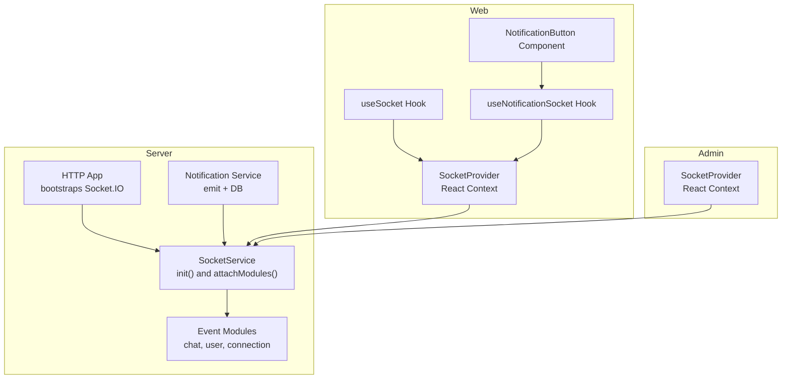
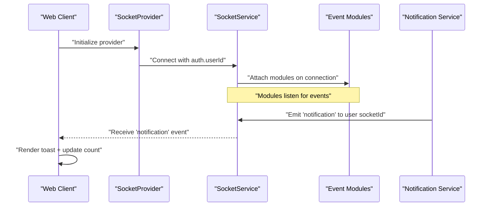
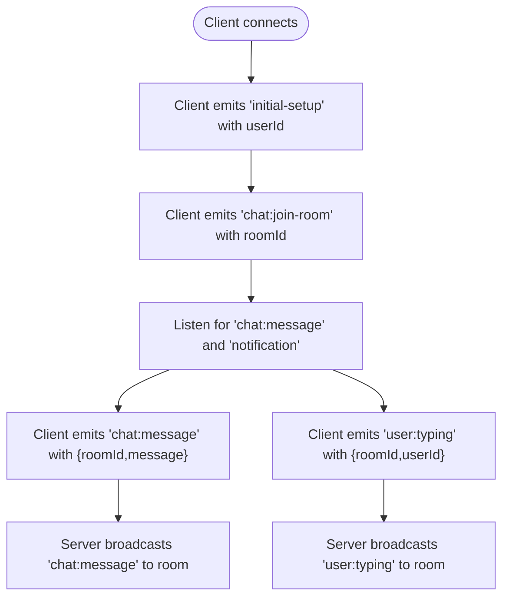
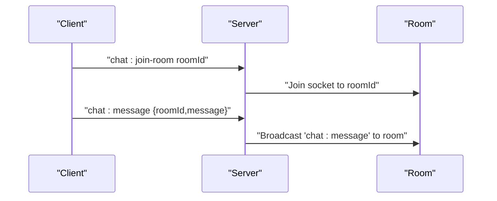
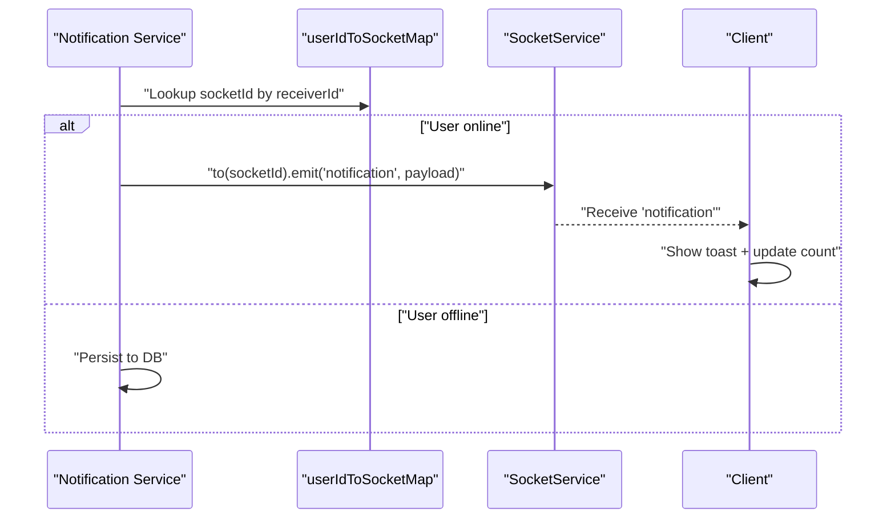
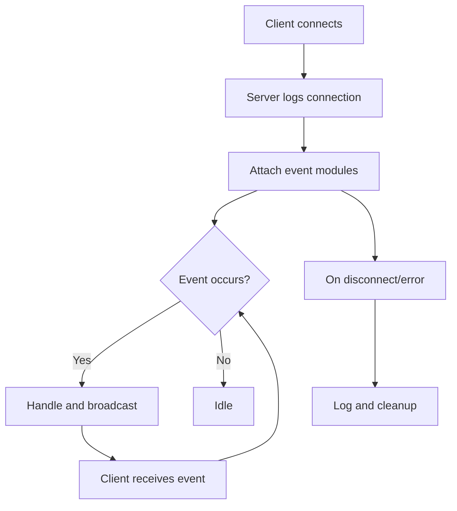
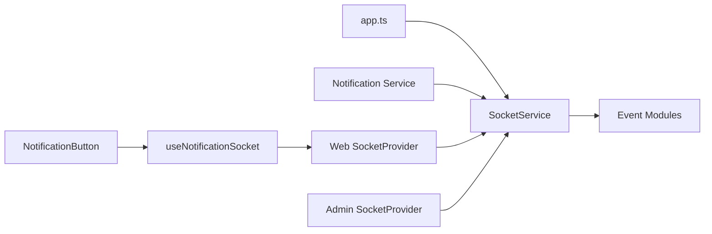

# Real-time Communication

<cite>
**Referenced Files in This Document**
- [SocketService (server)](file://server/src/infra/services/socket/index.ts)
- [Socket Events Index (server)](file://server/src/infra/services/socket/events/index.ts)
- [Chat Events (server)](file://server/src/infra/services/socket/events/chat.events.ts)
- [User Events (server)](file://server/src/infra/services/socket/events/user.events.ts)
- [Connection Events (server)](file://server/src/infra/services/socket/events/connection.events.ts)
- [Socket Error Handler (server)](file://server/src/infra/services/socket/errors/handleSocketError.ts)
- [Socket Types (server)](file://server/src/infra/services/socket/types/SocketEvents.ts)
- [App Bootstrap (server)](file://server/src/app.ts)
- [Web Socket Provider (web)](file://web/src/socket/SocketContext.tsx)
- [Web useSocket Hook (web)](file://web/src/socket/useSocket.ts)
- [Web Notification Socket Hook (web)](file://web/src/hooks/useNotificationSocket.tsx)
- [Admin Socket Provider (admin)](file://admin/src/socket/SocketContext.tsx)
- [Notification Service (server)](file://server/src/modules/notification/notification.service.ts)
- [Notification Controller (server)](file://server/src/modules/notification/notification.controller.ts)
- [Notification Repo (server)](file://server/src/modules/notification/notification.repo.ts)
- [Notification Adapter (server)](file://server/src/infra/db/adapters/notification.adapter.ts)
- [Notification Button (web)](file://web/src/components/general/NotificationButton.tsx)
</cite>

## Table of Contents
1. [Introduction](#introduction)
2. [Project Structure](#project-structure)
3. [Core Components](#core-components)
4. [Architecture Overview](#architecture-overview)
5. [Detailed Component Analysis](#detailed-component-analysis)
6. [Dependency Analysis](#dependency-analysis)
7. [Performance Considerations](#performance-considerations)
8. [Troubleshooting Guide](#troubleshooting-guide)
9. [Conclusion](#conclusion)
10. [Appendices](#appendices)

## Introduction
This document describes the real-time communication implementation for the Flick platform, focusing on the Socket.IO-based WebSocket infrastructure. It covers configuration, connection lifecycle, event-driven architecture, and the integration of notifications and chat functionality. It also outlines client-server communication patterns, message formats, state synchronization, error handling, and operational guidance for scaling and debugging.

## Project Structure
The real-time system spans the server and two frontend applications (web and admin):
- Server: Socket.IO initialization, event modules, and notification integration
- Web: Socket provider, hooks, and notification UI integration
- Admin: Minimal socket provider for admin-specific needs

**Diagram sources**
- [SocketService (server)](file://server/src/infra/services/socket/index.ts#L1-L47)
- [Socket Events Index (server)](file://server/src/infra/services/socket/events/index.ts#L1-L10)
- [App Bootstrap (server)](file://server/src/app.ts#L1-L33)
- [Web Socket Provider (web)](file://web/src/socket/SocketContext.tsx#L1-L47)
- [Web useSocket Hook (web)](file://web/src/socket/useSocket.ts#L1-L8)
- [Web Notification Socket Hook (web)](file://web/src/hooks/useNotificationSocket.tsx#L1-L47)
- [Admin Socket Provider (admin)](file://admin/src/socket/SocketContext.tsx#L1-L26)
- [Notification Service (server)](file://server/src/modules/notification/notification.service.ts#L1-L209)

**Section sources**
- [SocketService (server)](file://server/src/infra/services/socket/index.ts#L1-L47)
- [Socket Events Index (server)](file://server/src/infra/services/socket/events/index.ts#L1-L10)
- [App Bootstrap (server)](file://server/src/app.ts#L1-L33)
- [Web Socket Provider (web)](file://web/src/socket/SocketContext.tsx#L1-L47)
- [Admin Socket Provider (admin)](file://admin/src/socket/SocketContext.tsx#L1-L26)

## Core Components
- SocketService: Initializes Socket.IO with CORS and transport configuration, attaches event modules on connection, and exposes the server instance.
- Event Modules: Chat, user presence/typing, and connection lifecycle handlers.
- Notification Service: Emits real-time notifications to online users and persists them to the database.
- Web Socket Provider: Creates and manages a Socket.IO client instance per user session with authentication.
- Notification Hook: Subscribes to real-time notifications and updates UI state.

Key responsibilities:
- Server-side: Manage connections, route events, and broadcast messages to rooms/users.
- Client-side: Establish authenticated connections, subscribe to events, and render real-time updates.

**Section sources**
- [SocketService (server)](file://server/src/infra/services/socket/index.ts#L1-L47)
- [Socket Events Index (server)](file://server/src/infra/services/socket/events/index.ts#L1-L10)
- [Notification Service (server)](file://server/src/modules/notification/notification.service.ts#L1-L209)
- [Web Socket Provider (web)](file://web/src/socket/SocketContext.tsx#L1-L47)
- [Web Notification Socket Hook (web)](file://web/src/hooks/useNotificationSocket.tsx#L1-L47)

## Architecture Overview
The system uses Socket.IO for bidirectional real-time messaging over WebSocket transport. The server bootstraps Socket.IO during HTTP server creation and registers event modules. Clients connect with optional authentication and subscribe to targeted events.

**Diagram sources**
- [SocketService (server)](file://server/src/infra/services/socket/index.ts#L1-L47)
- [Web Socket Provider (web)](file://web/src/socket/SocketContext.tsx#L1-L47)
- [Notification Service (server)](file://server/src/modules/notification/notification.service.ts#L1-L209)
- [Web Notification Socket Hook (web)](file://web/src/hooks/useNotificationSocket.tsx#L1-L47)

## Detailed Component Analysis

### Socket.IO Configuration and Initialization
- Server initialization sets up CORS origins and restricts transports to WebSocket only.
- Event modules are attached via the connection event handler.
- The service exposes a getter to access the Socket.IO server instance for broadcasting.

Operational notes:
- CORS allows GET and POST methods from configured origins.
- Transport restriction ensures WebSocket-only connections.

**Section sources**
- [SocketService (server)](file://server/src/infra/services/socket/index.ts#L10-L24)
- [SocketService (server)](file://server/src/infra/services/socket/index.ts#L26-L32)

### Event-Driven Architecture
- Connection events: Log connection/disconnection and propagate errors.
- Chat events: Join rooms and broadcast messages to room participants.
- User events: Broadcast typing indicators to a room.

**Diagram sources**
- [Connection Events (server)](file://server/src/infra/services/socket/events/connection.events.ts#L1-L20)
- [Chat Events (server)](file://server/src/infra/services/socket/events/chat.events.ts#L1-L26)
- [User Events (server)](file://server/src/infra/services/socket/events/user.events.ts#L1-L9)
- [Web Notification Socket Hook (web)](file://web/src/hooks/useNotificationSocket.tsx#L1-L47)

**Section sources**
- [Connection Events (server)](file://server/src/infra/services/socket/events/connection.events.ts#L1-L20)
- [Chat Events (server)](file://server/src/infra/services/socket/events/chat.events.ts#L1-L26)
- [User Events (server)](file://server/src/infra/services/socket/events/user.events.ts#L1-L9)

### Chat Events
- Join room: Clients join a room identified by roomId.
- Send message: Clients emit chat messages; server forwards to the room with sender metadata.

Message format (client-to-server):
- Event: "chat:join-room"
  - Payload: roomId (string)
- Event: "chat:message"
  - Payload: { roomId: string, message: string }

Message format (server-to-client):
- Event: "chat:message"
  - Payload: { userId: string, message: string }

**Diagram sources**
- [Chat Events (server)](file://server/src/infra/services/socket/events/chat.events.ts#L1-L26)

**Section sources**
- [Chat Events (server)](file://server/src/infra/services/socket/events/chat.events.ts#L1-L26)

### User Presence and Typing
- Typing indicator: Clients emit typing events to a room; server rebroadcasts to other clients.

Message format:
- Event: "user:typing"
  - Payload: { roomId: string, userId: string }
- Event: "user:typing" (broadcast)
  - Payload: { userId: string }

**Section sources**
- [User Events (server)](file://server/src/infra/services/socket/events/user.events.ts#L1-L9)

### Notifications: Real-time and Persistence
- Real-time delivery: When a user is online, notifications are emitted directly to their socket.
- Persistence: Notifications are stored in the database for offline retrieval.
- Bundling: Multiple related notifications are merged to reduce chatter.

Message format:
- Event: "notification"
  - Payload: { id: string, postId: number, receiverId: string, type: string, content?: string, actorUsernames: string[] }
- Event: "notification-count"
  - Payload: { count: number }

Client-side integration:
- Client emits "initial-setup" with userId after authentication.
- Subscribes to "notification" and "notification-count" events.
- Renders toast notifications and updates unread counts.

**Diagram sources**
- [Notification Service (server)](file://server/src/modules/notification/notification.service.ts#L28-L55)
- [Notification Service (server)](file://server/src/modules/notification/notification.service.ts#L124-L140)
- [Web Notification Socket Hook (web)](file://web/src/hooks/useNotificationSocket.tsx#L1-L47)

**Section sources**
- [Notification Service (server)](file://server/src/modules/notification/notification.service.ts#L1-L209)
- [Notification Controller (server)](file://server/src/modules/notification/notification.controller.ts#L1-L47)
- [Notification Repo (server)](file://server/src/modules/notification/notification.repo.ts#L1-L20)
- [Notification Adapter (server)](file://server/src/infra/db/adapters/notification.adapter.ts#L57-L76)
- [Web Notification Socket Hook (web)](file://web/src/hooks/useNotificationSocket.tsx#L1-L47)
- [Notification Button (web)](file://web/src/components/general/NotificationButton.tsx#L1-L20)

### Client-Server Communication Patterns
- Authentication: Client passes userId in auth object upon connection.
- Room-based broadcasting: Chat messages are sent to a specific room.
- Targeted broadcasting: Notifications are sent to a specific socketId when the user is online.
- Event-driven subscription: Clients subscribe to events after initial setup.

**Section sources**
- [Web Socket Provider (web)](file://web/src/socket/SocketContext.tsx#L16-L37)
- [Web Notification Socket Hook (web)](file://web/src/hooks/useNotificationSocket.tsx#L14-L43)

### Message Formats and State Synchronization
- Chat message: { roomId, message }
- Typing indicator: { roomId, userId }
- Notification: { id, postId, receiverId, type, content?, actorUsernames[] }
- Notification count: { count }

State synchronization:
- Client maintains local notification count and updates on "notification-count".
- Toast notifications reflect real-time activity.

**Section sources**
- [Chat Events (server)](file://server/src/infra/services/socket/events/chat.events.ts#L1-L26)
- [User Events (server)](file://server/src/infra/services/socket/events/user.events.ts#L1-L9)
- [Notification Service (server)](file://server/src/modules/notification/notification.service.ts#L28-L55)
- [Web Notification Socket Hook (web)](file://web/src/hooks/useNotificationSocket.tsx#L1-L47)

### Connection Management and Lifecycle
- Connection: Server logs connection and attaches event modules.
- Disconnection: Server logs disconnection and triggers cleanup.
- Error propagation: Errors are normalized and emitted as "operation-error".

**Diagram sources**
- [Connection Events (server)](file://server/src/infra/services/socket/events/connection.events.ts#L1-L20)
- [Socket Error Handler (server)](file://server/src/infra/services/socket/errors/handleSocketError.ts#L1-L22)

**Section sources**
- [Connection Events (server)](file://server/src/infra/services/socket/events/connection.events.ts#L1-L20)
- [Socket Error Handler (server)](file://server/src/infra/services/socket/errors/handleSocketError.ts#L1-L22)

### Client-Side Integration Examples
- Web:
  - SocketProvider initializes a WebSocket connection with auth.userId and WebSocket transport.
  - useSocket returns the connected socket instance.
  - useNotificationSocket subscribes to "notification" and "notification-count", renders toasts, and updates counters.
  - NotificationButton displays the unread count.

- Admin:
  - SocketProvider creates a WebSocket connection with a fixed server URI and WebSocket transport.

**Section sources**
- [Web Socket Provider (web)](file://web/src/socket/SocketContext.tsx#L1-L47)
- [Web useSocket Hook (web)](file://web/src/socket/useSocket.ts#L1-L8)
- [Web Notification Socket Hook (web)](file://web/src/hooks/useNotificationSocket.tsx#L1-L47)
- [Admin Socket Provider (admin)](file://admin/src/socket/SocketContext.tsx#L1-L26)
- [Notification Button (web)](file://web/src/components/general/NotificationButton.tsx#L1-L20)

## Dependency Analysis
The real-time system exhibits clear separation of concerns:
- SocketService depends on HTTP server bootstrap and event modules.
- Event modules depend on Socket.IO server instance.
- Notification Service depends on Socket.IO server and user-to-socket mapping.
- Web client depends on SocketProvider and React context.

**Diagram sources**
- [App Bootstrap (server)](file://server/src/app.ts#L1-L33)
- [SocketService (server)](file://server/src/infra/services/socket/index.ts#L1-L47)
- [Socket Events Index (server)](file://server/src/infra/services/socket/events/index.ts#L1-L10)
- [Notification Service (server)](file://server/src/modules/notification/notification.service.ts#L1-L209)
- [Web Socket Provider (web)](file://web/src/socket/SocketContext.tsx#L1-L47)
- [Web Notification Socket Hook (web)](file://web/src/hooks/useNotificationSocket.tsx#L1-L47)
- [Notification Button (web)](file://web/src/components/general/NotificationButton.tsx#L1-L20)
- [Admin Socket Provider (admin)](file://admin/src/socket/SocketContext.tsx#L1-L26)

**Section sources**
- [App Bootstrap (server)](file://server/src/app.ts#L1-L33)
- [SocketService (server)](file://server/src/infra/services/socket/index.ts#L1-L47)
- [Socket Events Index (server)](file://server/src/infra/services/socket/events/index.ts#L1-L10)
- [Notification Service (server)](file://server/src/modules/notification/notification.service.ts#L1-L209)
- [Web Socket Provider (web)](file://web/src/socket/SocketContext.tsx#L1-L47)
- [Web Notification Socket Hook (web)](file://web/src/hooks/useNotificationSocket.tsx#L1-L47)
- [Notification Button (web)](file://web/src/components/general/NotificationButton.tsx#L1-L20)
- [Admin Socket Provider (admin)](file://admin/src/socket/SocketContext.tsx#L1-L26)

## Performance Considerations
- Transport optimization: Restricting to WebSocket reduces overhead compared to polling.
- Room-based broadcasting: Efficiently targets subsets of users.
- Notification bundling: Reduces event volume by aggregating similar notifications.
- Connection lifecycle: Proper disconnect handling prevents resource leaks.
- Scalability: Horizontal scaling requires sticky sessions or a shared state mechanism for userId-to-socket mapping.

[No sources needed since this section provides general guidance]

## Troubleshooting Guide
Common issues and remedies:
- Connection failures:
  - Verify CORS origins and transport configuration.
  - Ensure the client passes auth.userId.
- No real-time notifications:
  - Confirm client emits "initial-setup" with userId.
  - Check that the user is online and mapped in the userId-to-socket map.
- Excessive network traffic:
  - Review notification bundling logic and room sizes.
- Error propagation:
  - Server emits "operation-error" with standardized fields; inspect client logs for error details.

**Section sources**
- [SocketService (server)](file://server/src/infra/services/socket/index.ts#L13-L19)
- [Web Socket Provider (web)](file://web/src/socket/SocketContext.tsx#L23-L28)
- [Web Notification Socket Hook (web)](file://web/src/hooks/useNotificationSocket.tsx#L20-L20)
- [Socket Error Handler (server)](file://server/src/infra/services/socket/errors/handleSocketError.ts#L1-L22)

## Conclusion
The Flick platform implements a robust, modular real-time communication layer using Socket.IO. The design cleanly separates concerns across server-side event modules, client-side providers and hooks, and a notification subsystem that balances real-time delivery with persistence. With proper configuration, monitoring, and adherence to the documented patterns, the system supports scalable, responsive user experiences.

[No sources needed since this section summarizes without analyzing specific files]

## Appendices

### Appendix A: Event Reference
- Connection lifecycle:
  - "disconnect": Logs disconnection
  - "error": Normalized error emission
- Chat:
  - "chat:join-room": Join a room
  - "chat:message": Broadcast message to room
- User presence:
  - "user:typing": Broadcast typing indicator to room
- Notifications:
  - "initial-setup": Client setup with userId
  - "notification": Real-time notification payload
  - "notification-count": Unread count update

**Section sources**
- [Connection Events (server)](file://server/src/infra/services/socket/events/connection.events.ts#L1-L20)
- [Chat Events (server)](file://server/src/infra/services/socket/events/chat.events.ts#L1-L26)
- [User Events (server)](file://server/src/infra/services/socket/events/user.events.ts#L1-L9)
- [Web Notification Socket Hook (web)](file://web/src/hooks/useNotificationSocket.tsx#L1-L47)