# Audit Logging & Security Events

<cite>
**Referenced Files in This Document**
- [audit-context.ts](file://server/src/modules/audit/audit-context.ts)
- [audit.types.ts](file://server/src/modules/audit/audit.types.ts)
- [audit.service.ts](file://server/src/modules/audit/audit.service.ts)
- [audit.repo.ts](file://server/src/modules/audit/audit.repo.ts)
- [audit-log.table.ts](file://server/src/infra/db/tables/audit-log.table.ts)
- [actions.ts](file://server/src/shared/constants/audit/actions.ts)
- [entity.ts](file://server/src/shared/constants/audit/entity.ts)
- [status.ts](file://server/src/shared/constants/audit/status.ts)
- [platform.ts](file://server/src/shared/constants/audit/platform.ts)
- [record-audit.ts](file://server/src/lib/record-audit.ts)
- [audit-identity.ts](file://server/src/lib/audit-identity.ts)
- [request-logging.middleware.ts](file://server/src/core/middlewares/request-logging.middleware.ts)
- [security.ts](file://server/src/config/security.ts)
- [rate-limit.middleware.ts](file://server/src/core/middlewares/rate-limit.middleware.ts)
- [content-moderation.service.ts](file://server/src/modules/content-report/content-moderation.service.ts)
- [admin.service.ts](file://server/src/modules/admin/admin.service.ts)
- [new-device-login/index.tsx](file://server/src/infra/services/mail/templates/new-device-login/index.tsx)
- [template.types.ts](file://server/src/infra/services/mail/types/template.types.ts)
- [0000_snapshot.json](file://server/drizzle/meta/0000_snapshot.json)
- [0001_snapshot.json](file://server/drizzle/meta/0001_snapshot.json)
</cite>

## Table of Contents
1. [Introduction](#introduction)
2. [Project Structure](#project-structure)
3. [Core Components](#core-components)
4. [Architecture Overview](#architecture-overview)
5. [Detailed Component Analysis](#detailed-component-analysis)
6. [Dependency Analysis](#dependency-analysis)
7. [Performance Considerations](#performance-considerations)
8. [Troubleshooting Guide](#troubleshooting-guide)
9. [Conclusion](#conclusion)
10. [Appendices](#appendices)

## Introduction
This document provides comprehensive audit logging and security events documentation for the Flick platform. It covers the complete audit trail system including user actions, system events, security incidents, and administrative activities. It details audit identity tracking, event categorization, and data retention policies. It also explains the audit log schema, indexing strategy, and query optimization for security monitoring, along with security event detection for failed login attempts, suspicious activities, and policy violations. Compliance requirements, GDPR considerations, and data privacy measures are addressed, alongside examples of audit log entries, correlation techniques for security investigations, automated alerting systems, performance impact of logging, log rotation strategies, secure log storage, and guidelines for forensic analysis and incident response.

## Project Structure
The audit and security logging capabilities are implemented across several modules and layers:
- Audit context and buffering: Async-local storage context and buffer for collecting audit entries during a request lifecycle.
- Audit service and repository: Centralized service to persist audit logs via a repository abstraction.
- Database schema: Audit log table definition with indexes optimized for common queries.
- Constants: Audit actions, entities, platforms, and statuses define the taxonomy of events.
- Identity masking and hashing: Utilities to anonymize identities for privacy-preserving audits.
- Middleware: Request logging and rate limiting for operational and security telemetry.
- Security configuration: Helmet and CORS setup for transport security.
- Moderation and admin services: Operational logging and administrative controls that generate audit events.
- Email templates: Notifications for security-relevant events such as new device logins.

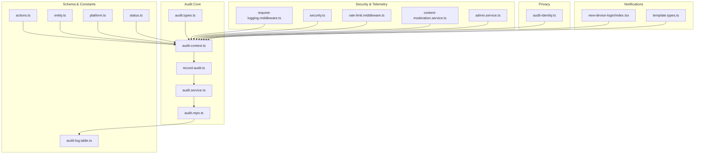

**Diagram sources**
- [audit-context.ts](file://server/src/modules/audit/audit-context.ts#L1-L29)
- [record-audit.ts](file://server/src/lib/record-audit.ts#L1-L19)
- [audit.types.ts](file://server/src/modules/audit/audit.types.ts#L1-L21)
- [audit.service.ts](file://server/src/modules/audit/audit.service.ts#L1-L10)
- [audit.repo.ts](file://server/src/modules/audit/audit.repo.ts#L1-L10)
- [audit-log.table.ts](file://server/src/infra/db/tables/audit-log.table.ts#L49-L73)
- [actions.ts](file://server/src/shared/constants/audit/actions.ts#L1-L66)
- [entity.ts](file://server/src/shared/constants/audit/entity.ts#L1-L15)
- [platform.ts](file://server/src/shared/constants/audit/platform.ts#L1-L9)
- [status.ts](file://server/src/shared/constants/audit/status.ts#L1-L3)
- [request-logging.middleware.ts](file://server/src/core/middlewares/request-logging.middleware.ts#L1-L40)
- [security.ts](file://server/src/config/security.ts#L1-L14)
- [rate-limit.middleware.ts](file://server/src/core/middlewares/rate-limit.middleware.ts#L1-L9)
- [content-moderation.service.ts](file://server/src/modules/content-report/content-moderation.service.ts#L1-L220)
- [admin.service.ts](file://server/src/modules/admin/admin.service.ts#L1-L94)
- [audit-identity.ts](file://server/src/lib/audit-identity.ts#L1-L30)
- [new-device-login/index.tsx](file://server/src/infra/services/mail/templates/new-device-login/index.tsx#L1-L29)
- [template.types.ts](file://server/src/infra/services/mail/types/template.types.ts#L1-L35)

**Section sources**
- [audit-context.ts](file://server/src/modules/audit/audit-context.ts#L1-L29)
- [audit.service.ts](file://server/src/modules/audit/audit.service.ts#L1-L10)
- [audit.repo.ts](file://server/src/modules/audit/audit.repo.ts#L1-L10)
- [audit-log.table.ts](file://server/src/infra/db/tables/audit-log.table.ts#L49-L73)
- [actions.ts](file://server/src/shared/constants/audit/actions.ts#L1-L66)
- [entity.ts](file://server/src/shared/constants/audit/entity.ts#L1-L15)
- [platform.ts](file://server/src/shared/constants/audit/platform.ts#L1-L9)
- [status.ts](file://server/src/shared/constants/audit/status.ts#L1-L3)
- [record-audit.ts](file://server/src/lib/record-audit.ts#L1-L19)
- [audit-identity.ts](file://server/src/lib/audit-identity.ts#L1-L30)
- [request-logging.middleware.ts](file://server/src/core/middlewares/request-logging.middleware.ts#L1-L40)
- [security.ts](file://server/src/config/security.ts#L1-L14)
- [rate-limit.middleware.ts](file://server/src/core/middlewares/rate-limit.middleware.ts#L1-L9)
- [content-moderation.service.ts](file://server/src/modules/content-report/content-moderation.service.ts#L1-L220)
- [admin.service.ts](file://server/src/modules/admin/admin.service.ts#L1-L94)
- [new-device-login/index.tsx](file://server/src/infra/services/mail/templates/new-device-login/index.tsx#L1-L29)
- [template.types.ts](file://server/src/infra/services/mail/types/template.types.ts#L1-L35)

## Core Components
- Audit context and buffering: Provides an AsyncLocalStorage-backed observability context capturing request-scoped identity, IP, user agent, platform, and an in-memory audit buffer for deferred writes.
- Audit recording: Extracts device info from the user agent and enriches the audit entry with metadata before pushing to the buffer.
- Audit persistence: A centralized service writes audit entries to the repository, which delegates to the database adapter.
- Audit log schema: Defines fields for actor, action, entity, before/after snapshots, IP address, user agent, request ID, reason, and metadata, with indexes optimized for entity queries, actor queries, and reverse chronological ordering.
- Event taxonomy: Constants define actions, entities, platforms, and statuses to standardize categorization across the system.
- Identity privacy: Masking and hashing utilities support privacy-preserving identification for audit trails.
- Security middleware: Request logging and rate limiting contribute operational and security telemetry.
- Administrative controls: Services for moderation and admin operations log significant actions suitable for audit and monitoring.

**Section sources**
- [audit-context.ts](file://server/src/modules/audit/audit-context.ts#L1-L29)
- [record-audit.ts](file://server/src/lib/record-audit.ts#L1-L19)
- [audit.service.ts](file://server/src/modules/audit/audit.service.ts#L1-L10)
- [audit.repo.ts](file://server/src/modules/audit/audit.repo.ts#L1-L10)
- [audit-log.table.ts](file://server/src/infra/db/tables/audit-log.table.ts#L49-L73)
- [actions.ts](file://server/src/shared/constants/audit/actions.ts#L1-L66)
- [entity.ts](file://server/src/shared/constants/audit/entity.ts#L1-L15)
- [platform.ts](file://server/src/shared/constants/audit/platform.ts#L1-L9)
- [status.ts](file://server/src/shared/constants/audit/status.ts#L1-L3)
- [audit-identity.ts](file://server/src/lib/audit-identity.ts#L1-L30)
- [request-logging.middleware.ts](file://server/src/core/middlewares/request-logging.middleware.ts#L1-L40)
- [rate-limit.middleware.ts](file://server/src/core/middlewares/rate-limit.middleware.ts#L1-L9)
- [content-moderation.service.ts](file://server/src/modules/content-report/content-moderation.service.ts#L1-L220)
- [admin.service.ts](file://server/src/modules/admin/admin.service.ts#L1-L94)

## Architecture Overview
The audit pipeline integrates request telemetry, identity enrichment, and asynchronous persistence to a relational schema with targeted indexes. Security middleware contributes complementary telemetry for monitoring and protection.

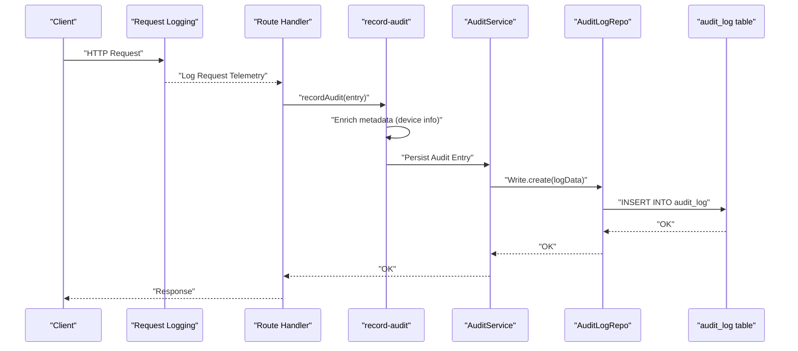

**Diagram sources**
- [request-logging.middleware.ts](file://server/src/core/middlewares/request-logging.middleware.ts#L1-L40)
- [record-audit.ts](file://server/src/lib/record-audit.ts#L1-L19)
- [audit.service.ts](file://server/src/modules/audit/audit.service.ts#L1-L10)
- [audit.repo.ts](file://server/src/modules/audit/audit.repo.ts#L1-L10)
- [audit-log.table.ts](file://server/src/infra/db/tables/audit-log.table.ts#L49-L73)

## Detailed Component Analysis

### Audit Context and Buffering
- Purpose: Capture request-scoped identity and environment (user ID, role, IP, user agent, platform) and buffer audit entries until the request completes.
- Key fields: requestId, userId, role, ip, userAgent, platform, auditBuffer.
- Usage pattern: Handlers wrap operations in a context provider; audit entries are appended to the buffer.

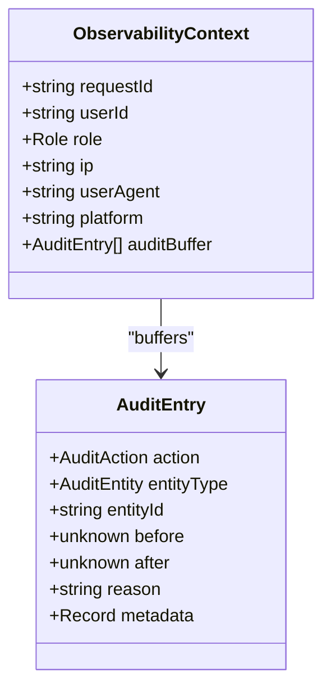

**Diagram sources**
- [audit-context.ts](file://server/src/modules/audit/audit-context.ts#L17-L28)

**Section sources**
- [audit-context.ts](file://server/src/modules/audit/audit-context.ts#L1-L29)

### Audit Recording and Enrichment
- Purpose: Extract device information from the user agent and merge it into the audit entry’s metadata before buffering.
- Integration: Uses the observability context to access userAgent and stores enriched metadata in the buffer.

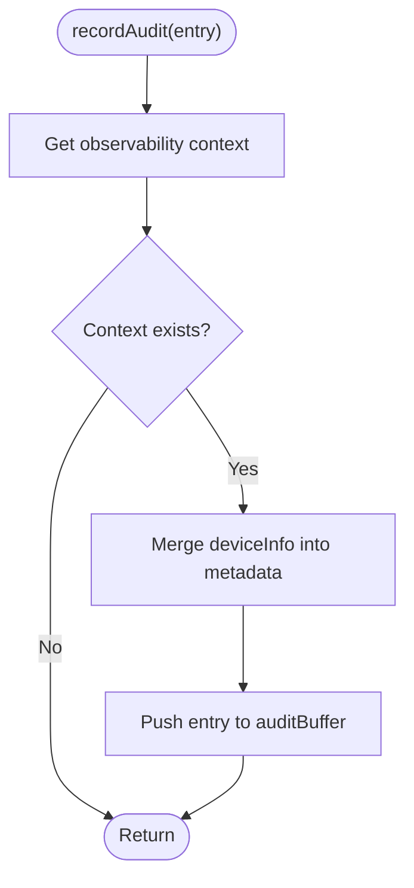

**Diagram sources**
- [record-audit.ts](file://server/src/lib/record-audit.ts#L1-L19)

**Section sources**
- [record-audit.ts](file://server/src/lib/record-audit.ts#L1-L19)

### Audit Persistence Service and Repository
- Purpose: Provide a single entry point to persist audit logs, delegating to the repository and underlying adapter.
- Flow: Service -> Repository -> Adapter -> Database.

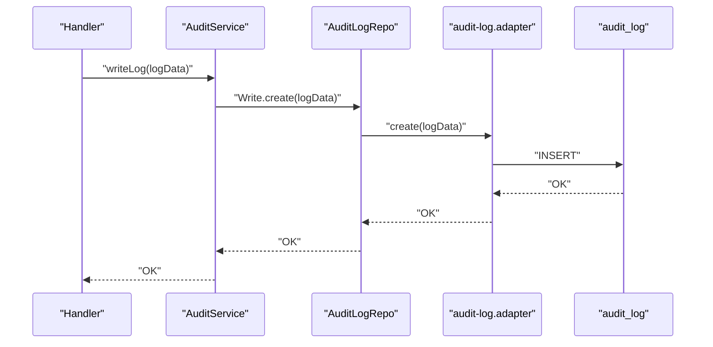

**Diagram sources**
- [audit.service.ts](file://server/src/modules/audit/audit.service.ts#L1-L10)
- [audit.repo.ts](file://server/src/modules/audit/audit.repo.ts#L1-L10)
- [audit-log.table.ts](file://server/src/infra/db/tables/audit-log.table.ts#L49-L73)

**Section sources**
- [audit.service.ts](file://server/src/modules/audit/audit.service.ts#L1-L10)
- [audit.repo.ts](file://server/src/modules/audit/audit.repo.ts#L1-L10)

### Audit Log Schema and Indexing Strategy
- Fields: actor_id, action, entity_type, entity_id, before, after, ip_address, user_agent, request_id, reason, metadata, occurred_at.
- Indexes:
  - Composite index on (entity_type, entity_id) for efficient entity-centric queries.
  - Index on actor_id for actor-centric investigations.
  - Index on occurred_at (descending) for reverse chronological scans.
- Drizzle snapshots confirm schema and indexes.

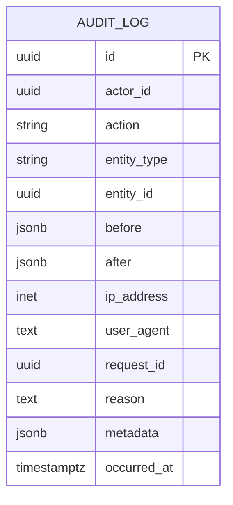

**Diagram sources**
- [audit-log.table.ts](file://server/src/infra/db/tables/audit-log.table.ts#L49-L73)
- [0000_snapshot.json](file://server/drizzle/meta/0000_snapshot.json#L49-L150)
- [0001_snapshot.json](file://server/drizzle/meta/0001_snapshot.json#L49-L150)

**Section sources**
- [audit-log.table.ts](file://server/src/infra/db/tables/audit-log.table.ts#L49-L73)
- [0000_snapshot.json](file://server/drizzle/meta/0000_snapshot.json#L49-L150)
- [0001_snapshot.json](file://server/drizzle/meta/0001_snapshot.json#L49-L150)

### Event Categorization and Taxonomy
- Actions: Standardized set covering user interactions, authentication events, admin actions, and system events.
- Entities: Types of resources affected by actions (e.g., post, comment, user, content-report).
- Platforms: Web, mobile, TV, server, other.
- Statuses: success, fail.

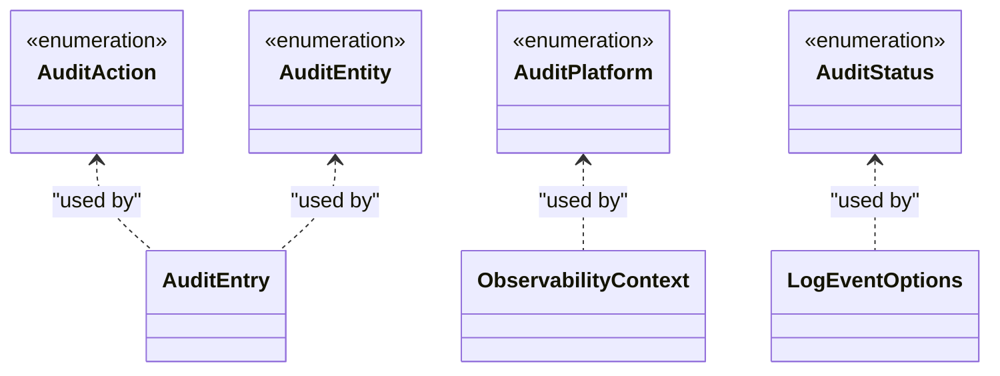

**Diagram sources**
- [actions.ts](file://server/src/shared/constants/audit/actions.ts#L1-L66)
- [entity.ts](file://server/src/shared/constants/audit/entity.ts#L1-L15)
- [platform.ts](file://server/src/shared/constants/audit/platform.ts#L1-L9)
- [status.ts](file://server/src/shared/constants/audit/status.ts#L1-L3)
- [audit.types.ts](file://server/src/modules/audit/audit.types.ts#L7-L21)
- [audit-context.ts](file://server/src/modules/audit/audit-context.ts#L7-L15)

**Section sources**
- [actions.ts](file://server/src/shared/constants/audit/actions.ts#L1-L66)
- [entity.ts](file://server/src/shared/constants/audit/entity.ts#L1-L15)
- [platform.ts](file://server/src/shared/constants/audit/platform.ts#L1-L9)
- [status.ts](file://server/src/shared/constants/audit/status.ts#L1-L3)
- [audit.types.ts](file://server/src/modules/audit/audit.types.ts#L1-L21)
- [audit-context.ts](file://server/src/modules/audit/audit-context.ts#L1-L29)

### Audit Identity Tracking and Privacy
- Masking: Partially masks email addresses for display-friendly identifiers.
- Hashing: Creates a short, deterministic hash of normalized email for correlation while preserving privacy.
- Usage: Supports privacy-preserving identification in logs and analytics.

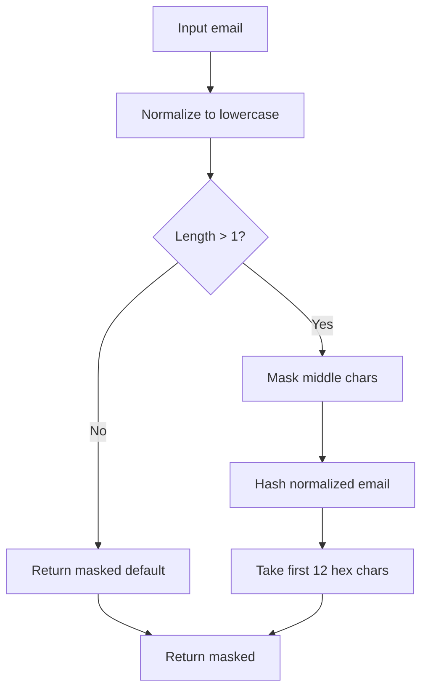

**Diagram sources**
- [audit-identity.ts](file://server/src/lib/audit-identity.ts#L1-L30)

**Section sources**
- [audit-identity.ts](file://server/src/lib/audit-identity.ts#L1-L30)

### Security Event Detection and Automated Alerting
- Failed login attempts: Detectable via auth-related audit actions with failure status.
- Suspicious activities: Correlate new device login notifications with unusual geographic locations and user agents.
- Policy violations: Monitor moderation actions and content bans/unbans.
- Automated alerts: Integrate with email templates for new device login notifications.

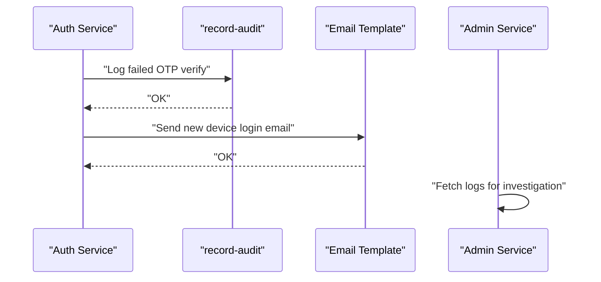

**Diagram sources**
- [actions.ts](file://server/src/shared/constants/audit/actions.ts#L20-L30)
- [status.ts](file://server/src/shared/constants/audit/status.ts#L1-L3)
- [new-device-login/index.tsx](file://server/src/infra/services/mail/templates/new-device-login/index.tsx#L1-L29)
- [template.types.ts](file://server/src/infra/services/mail/types/template.types.ts#L23-L27)
- [admin.service.ts](file://server/src/modules/admin/admin.service.ts#L37-L42)

**Section sources**
- [actions.ts](file://server/src/shared/constants/audit/actions.ts#L20-L30)
- [status.ts](file://server/src/shared/constants/audit/status.ts#L1-L3)
- [new-device-login/index.tsx](file://server/src/infra/services/mail/templates/new-device-login/index.tsx#L1-L29)
- [template.types.ts](file://server/src/infra/services/mail/types/template.types.ts#L23-L27)
- [admin.service.ts](file://server/src/modules/admin/admin.service.ts#L37-L42)

### Administrative Activities and Operational Logging
- Administrative controls: Services for managing users, colleges, reports, and feedback log significant operations suitable for audit.
- Moderation actions: Ban/unban and shadow ban operations on posts and comments are logged and can be correlated with reports.

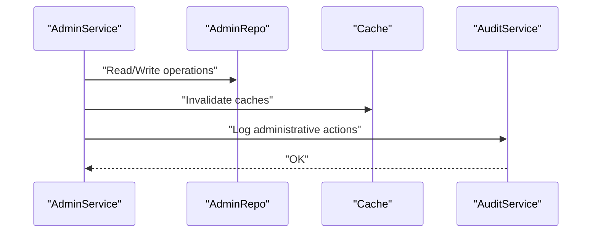

**Diagram sources**
- [admin.service.ts](file://server/src/modules/admin/admin.service.ts#L1-L94)
- [audit.service.ts](file://server/src/modules/audit/audit.service.ts#L1-L10)

**Section sources**
- [admin.service.ts](file://server/src/modules/admin/admin.service.ts#L1-L94)
- [content-moderation.service.ts](file://server/src/modules/content-report/content-moderation.service.ts#L1-L220)

## Dependency Analysis
The audit system exhibits low coupling and clear separation of concerns:
- Handlers depend on the observability context and recorder.
- Recording depends on device parsing and context retrieval.
- Persistence depends on the repository abstraction and database adapter.
- Schema and indexes are defined centrally and consumed by adapters.

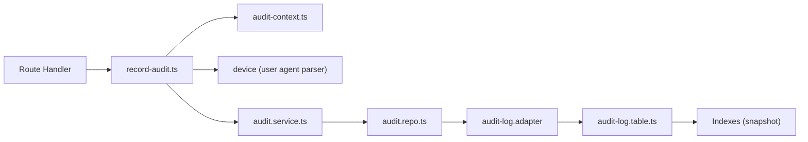

**Diagram sources**
- [record-audit.ts](file://server/src/lib/record-audit.ts#L1-L19)
- [audit-context.ts](file://server/src/modules/audit/audit-context.ts#L1-L29)
- [audit.service.ts](file://server/src/modules/audit/audit.service.ts#L1-L10)
- [audit.repo.ts](file://server/src/modules/audit/audit.repo.ts#L1-L10)
- [audit-log.table.ts](file://server/src/infra/db/tables/audit-log.table.ts#L49-L73)
- [0000_snapshot.json](file://server/drizzle/meta/0000_snapshot.json#L100-L150)
- [0001_snapshot.json](file://server/drizzle/meta/0001_snapshot.json#L100-L150)

**Section sources**
- [record-audit.ts](file://server/src/lib/record-audit.ts#L1-L19)
- [audit-context.ts](file://server/src/modules/audit/audit-context.ts#L1-L29)
- [audit.service.ts](file://server/src/modules/audit/audit.service.ts#L1-L10)
- [audit.repo.ts](file://server/src/modules/audit/audit.repo.ts#L1-L10)
- [audit-log.table.ts](file://server/src/infra/db/tables/audit-log.table.ts#L49-L73)
- [0000_snapshot.json](file://server/drizzle/meta/0000_snapshot.json#L100-L150)
- [0001_snapshot.json](file://server/drizzle/meta/0001_snapshot.json#L100-L150)

## Performance Considerations
- Asynchronous buffering: Audit entries are buffered per-request and persisted asynchronously, reducing request latency.
- Indexing strategy: Composite index on (entity_type, entity_id) supports entity-centric analytics; index on actor_id supports user-centric investigations; descending index on occurred_at optimizes reverse chronological scans.
- Rate limiting: Middleware mitigates brute-force attacks and reduces excessive load, indirectly improving audit reliability.
- Request logging overhead: Structured logging with minimal parsing overhead; skip tokens reduce noise for health endpoints.
- Storage: JSONB fields enable flexible auditing but may increase storage; consider partitioning or archiving older logs for cost control.

[No sources needed since this section provides general guidance]

## Troubleshooting Guide
- Missing context: If the observability context is unavailable, audit entries are not recorded; ensure handlers run within the context provider.
- Device parsing failures: If user agent parsing fails, deviceInfo may be absent; verify user agent extraction logic.
- Persistence errors: AuditService.writeLog throws if the repository fails; check adapter and database connectivity.
- Index performance: Slow queries on entity or actor filters may require reviewing index usage and query plans.
- Operational logs: Use request logging middleware to correlate HTTP requests with audit events.

**Section sources**
- [audit-context.ts](file://server/src/modules/audit/audit-context.ts#L27-L29)
- [record-audit.ts](file://server/src/lib/record-audit.ts#L4-L6)
- [audit.service.ts](file://server/src/modules/audit/audit.service.ts#L5-L7)
- [request-logging.middleware.ts](file://server/src/core/middlewares/request-logging.middleware.ts#L1-L40)

## Conclusion
The Flick platform implements a robust audit logging and security events framework centered on a request-scoped observability context, enriched metadata capture, and a normalized schema with targeted indexes. The system supports standardized event categorization, privacy-preserving identity handling, and operational logging across administrative and moderation workflows. Combined with security middleware and email-based alerting, the framework enables effective security monitoring, incident response, and compliance reporting.

[No sources needed since this section summarizes without analyzing specific files]

## Appendices

### Audit Log Schema Details
- Fields: actor_id, action, entity_type, entity_id, before, after, ip_address, user_agent, request_id, reason, metadata, occurred_at.
- Indexes: entity-centric, actor-centric, and time-series.

**Section sources**
- [audit-log.table.ts](file://server/src/infra/db/tables/audit-log.table.ts#L49-L73)
- [0000_snapshot.json](file://server/drizzle/meta/0000_snapshot.json#L100-L150)
- [0001_snapshot.json](file://server/drizzle/meta/0001_snapshot.json#L100-L150)

### Example Audit Log Entries
- User authentication events: action indicates OTP verification success or failure; status reflects outcome; platform indicates client type.
- Moderation actions: action indicates ban/unban/shadow ban; entity_type identifies target resource; before/after snapshots capture state changes.
- Administrative actions: action indicates creation, update, or deletion of administrative resources; reason may explain justification.

**Section sources**
- [actions.ts](file://server/src/shared/constants/audit/actions.ts#L1-L66)
- [status.ts](file://server/src/shared/constants/audit/status.ts#L1-L3)
- [platform.ts](file://server/src/shared/constants/audit/platform.ts#L1-L9)
- [audit.types.ts](file://server/src/modules/audit/audit.types.ts#L7-L21)

### Security Monitoring and Query Optimization
- Entity-centric queries: Use composite index on (entity_type, entity_id) to quickly filter by resource.
- Actor-centric queries: Use index on actor_id to track user activity.
- Chronological queries: Use descending index on occurred_at for reverse chronological scans.
- Correlation: Join audit logs with request logs using request_id for end-to-end tracing.

**Section sources**
- [audit-log.table.ts](file://server/src/infra/db/tables/audit-log.table.ts#L65-L69)
- [request-logging.middleware.ts](file://server/src/core/middlewares/request-logging.middleware.ts#L22-L39)

### Compliance and Data Privacy
- GDPR considerations: Use masked identities and hashed identifiers for correlation without exposing personal data; retain logs only as long as necessary; provide mechanisms for data portability and erasure upon request.
- Data minimization: Store only necessary fields; avoid logging sensitive content in before/after snapshots; redact personally identifiable information.
- Retention policies: Define and enforce retention periods aligned with legal obligations; implement automated archival and deletion.

[No sources needed since this section provides general guidance]

### Forensic Analysis and Incident Response
- Correlation techniques: Cross-reference audit logs with request logs using request_id; group by actor_id and entity_id to reconstruct sequences of events; filter by timestamps for temporal analysis.
- Automated alerting: Trigger alerts for failed authentication attempts, new device logins, and policy violations; route alerts to security teams and integrate with ticketing systems.
- Secure storage: Encrypt logs at rest; restrict access to audit data; maintain immutable archives for evidence preservation.

[No sources needed since this section provides general guidance]