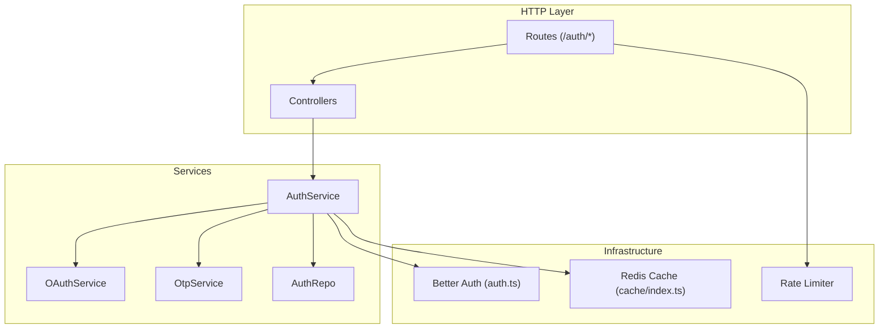
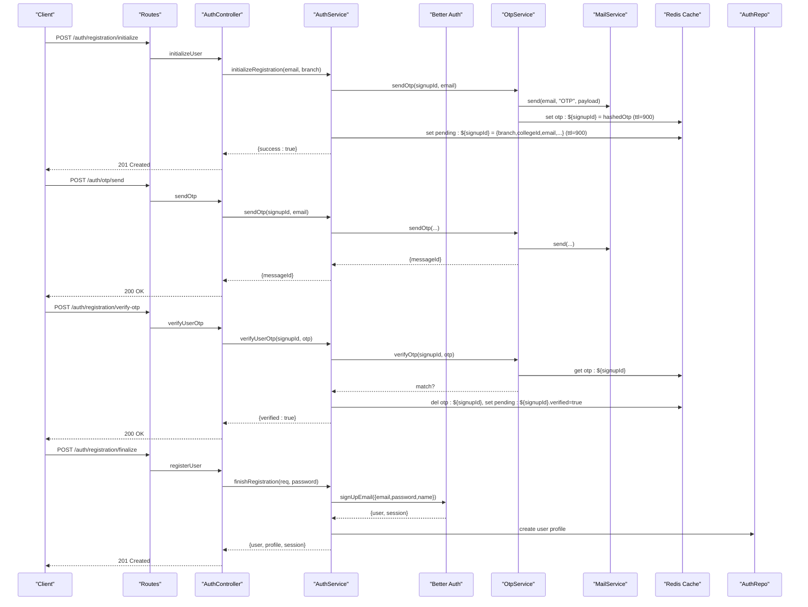
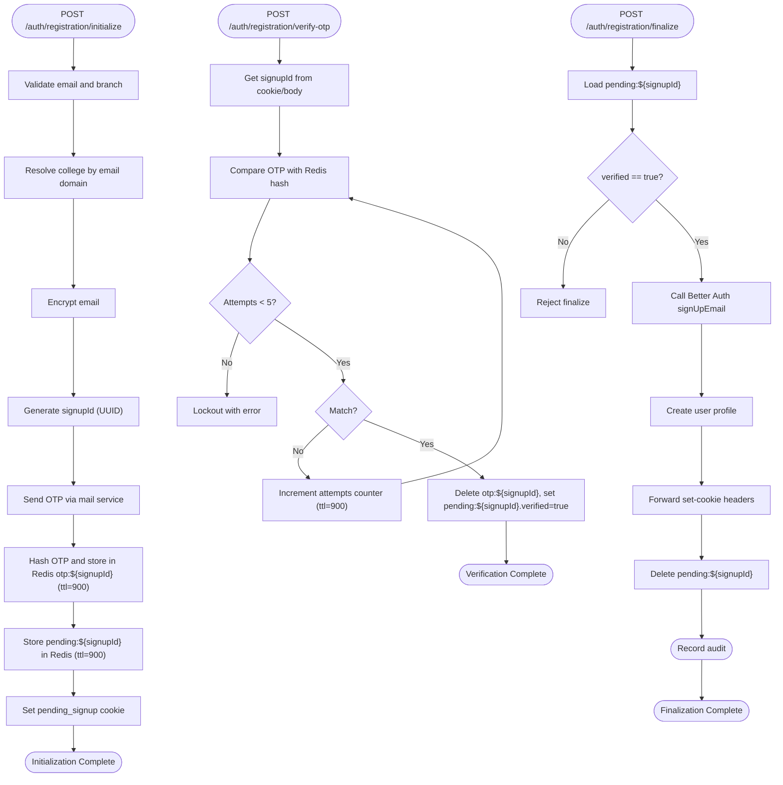
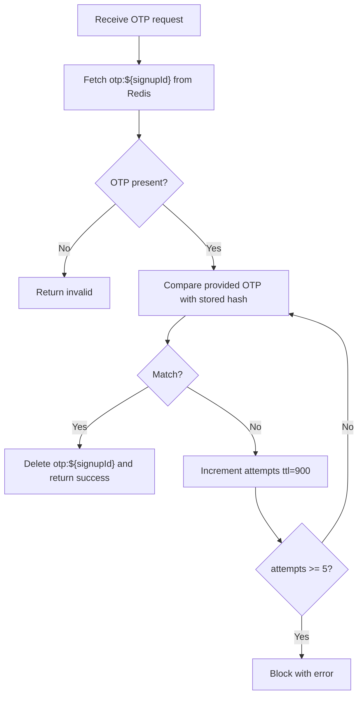
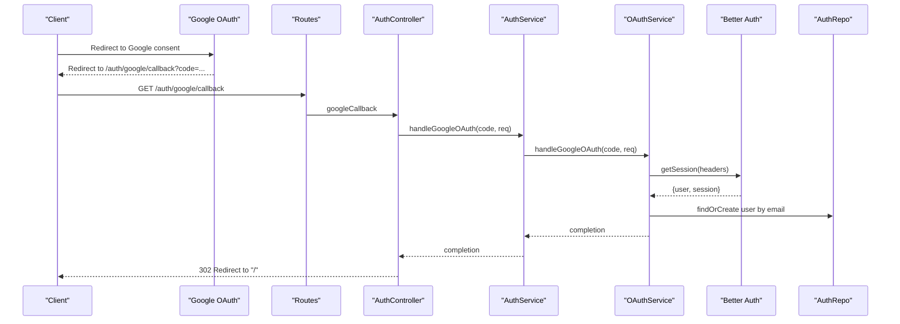
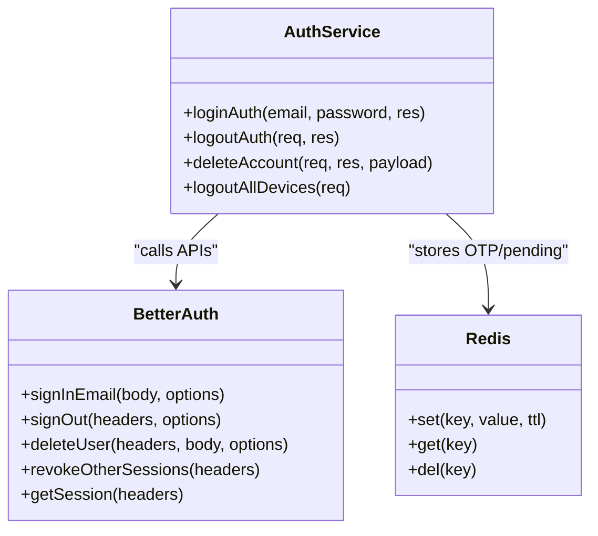
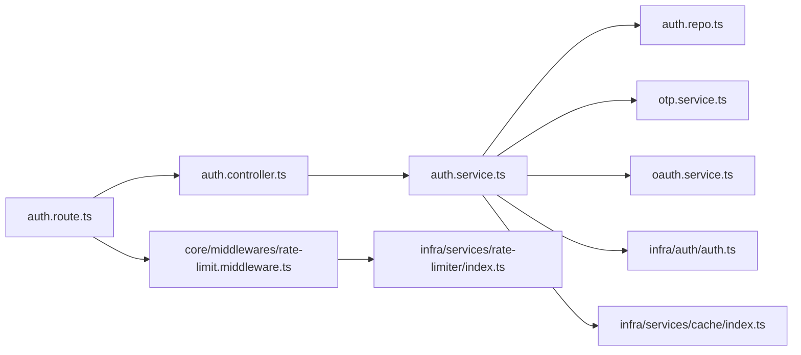

# Authentication Flow

<cite>
**Referenced Files in This Document**
- [auth.controller.ts](file://server/src/modules/auth/auth.controller.ts)
- [auth.service.ts](file://server/src/modules/auth/auth.service.ts)
- [auth.schema.ts](file://server/src/modules/auth/auth.schema.ts)
- [auth.route.ts](file://server/src/modules/auth/auth.route.ts)
- [auth.types.ts](file://server/src/modules/auth/auth.types.ts)
- [otp.service.ts](file://server/src/modules/auth/otp/otp.service.ts)
- [oauth.service.ts](file://server/src/modules/auth/oauth/oauth.service.ts)
- [auth.ts](file://server/src/infra/auth/auth.ts)
- [index.ts (cache)](file://server/src/infra/services/cache/index.ts)
- [auth.repo.ts](file://server/src/modules/auth/auth.repo.ts)
- [rate-limit.middleware.ts](file://server/src/core/middlewares/rate-limit.middleware.ts)
- [index.ts (rate limiter)](file://server/src/infra/services/rate-limiter/index.ts)
</cite>

## Table of Contents
1. [Introduction](#introduction)
2. [Project Structure](#project-structure)
3. [Core Components](#core-components)
4. [Architecture Overview](#architecture-overview)
5. [Detailed Component Analysis](#detailed-component-analysis)
6. [Dependency Analysis](#dependency-analysis)
7. [Performance Considerations](#performance-considerations)
8. [Troubleshooting Guide](#troubleshooting-guide)
9. [Conclusion](#conclusion)

## Introduction
This document explains the complete authentication flow for the Flick platform, covering:
- Email-based registration with OTP verification and email confirmation
- OAuth integration with Google, including redirect flows, token exchange, and user profile synchronization
- Multi-step authentication from initialization through final account activation
- Session management with Redis caching, token generation/validation, and session persistence strategies
- Error handling for failed authentications, account lockout mechanisms, and brute-force protection
- Authentication DTOs, validation schemas, and request/response formats
- Implementation examples and troubleshooting guides for common authentication issues

## Project Structure
The authentication subsystem is organized around a modular structure:
- Routes define endpoints and apply rate-limiting and authentication middleware
- Controllers orchestrate requests and delegate to services
- Services encapsulate business logic, integrate with Better Auth, Redis, and external services
- Repositories abstract database reads/writes and caching keys
- Schemas define validation for all request payloads
- Infrastructure integrates Better Auth, Redis, and rate limiting

**Diagram sources**
- [auth.route.ts](file://server/src/modules/auth/auth.route.ts#L1-L30)
- [auth.controller.ts](file://server/src/modules/auth/auth.controller.ts#L1-L171)
- [auth.service.ts](file://server/src/modules/auth/auth.service.ts#L1-L347)
- [oauth.service.ts](file://server/src/modules/auth/oauth/oauth.service.ts#L1-L45)
- [otp.service.ts](file://server/src/modules/auth/otp/otp.service.ts#L1-L45)
- [auth.ts](file://server/src/infra/auth/auth.ts#L1-L42)
- [index.ts (cache)](file://server/src/infra/services/cache/index.ts#L1-L7)
- [rate-limit.middleware.ts](file://server/src/core/middlewares/rate-limit.middleware.ts#L1-L9)

**Section sources**
- [auth.route.ts](file://server/src/modules/auth/auth.route.ts#L1-L30)
- [auth.controller.ts](file://server/src/modules/auth/auth.controller.ts#L1-L171)
- [auth.service.ts](file://server/src/modules/auth/auth.service.ts#L1-L347)

## Core Components
- Routes: Define endpoints for login, logout, OTP, registration, Google OAuth, password reset, and protected admin routes. Apply rate limiting and authentication middleware.
- Controllers: Parse validated inputs via Zod schemas, call service methods, and return standardized HTTP responses.
- Services: Implement core logic including OTP lifecycle, Google OAuth handling, Better Auth integration, Redis-backed pending user sessions, and audit logging.
- Repositories: Provide cached and uncached read/write operations for user and auth data.
- Schemas: Enforce strict validation for all authentication requests.
- Infrastructure: Better Auth handles sessions, cookies, and 2FA/admin plugins; Redis caches OTPs and pending signups; Rate limiter protects endpoints.

**Section sources**
- [auth.route.ts](file://server/src/modules/auth/auth.route.ts#L1-L30)
- [auth.controller.ts](file://server/src/modules/auth/auth.controller.ts#L1-L171)
- [auth.service.ts](file://server/src/modules/auth/auth.service.ts#L1-L347)
- [auth.schema.ts](file://server/src/modules/auth/auth.schema.ts#L1-L78)
- [auth.repo.ts](file://server/src/modules/auth/auth.repo.ts#L1-L35)
- [auth.ts](file://server/src/infra/auth/auth.ts#L1-L42)
- [index.ts (cache)](file://server/src/infra/services/cache/index.ts#L1-L7)
- [rate-limit.middleware.ts](file://server/src/core/middlewares/rate-limit.middleware.ts#L1-L9)

## Architecture Overview
The authentication architecture integrates:
- Express routes guarded by rate limits and authentication middleware
- Controllers delegating to services
- Services orchestrating Better Auth APIs, Redis caching, and email delivery
- Repositories abstracting database operations with caching
- OAuth handled via Better Auth’s Google provider and local sync logic

**Diagram sources**
- [auth.route.ts](file://server/src/modules/auth/auth.route.ts#L1-L30)
- [auth.controller.ts](file://server/src/modules/auth/auth.controller.ts#L1-L171)
- [auth.service.ts](file://server/src/modules/auth/auth.service.ts#L1-L347)
- [otp.service.ts](file://server/src/modules/auth/otp/otp.service.ts#L1-L45)
- [auth.ts](file://server/src/infra/auth/auth.ts#L1-L42)
- [auth.repo.ts](file://server/src/modules/auth/auth.repo.ts#L1-L35)

## Detailed Component Analysis

### Email-Based Registration Flow
- Initialization: Validates student email rules, resolves college by domain, generates UUID-based signupId, sends OTP, stores pending user in Redis, and sets a short-lived cookie.
- OTP Delivery: Sends OTP via mail service and stores a hashed OTP in Redis with TTL.
- OTP Verification: Verifies OTP against hash, enforces retry limits, marks pending user as verified on success.
- Finalization: Creates Better Auth user, builds profile, forwards cookies, clears pending state, and audits creation.

**Diagram sources**
- [auth.service.ts](file://server/src/modules/auth/auth.service.ts#L32-L106)
- [otp.service.ts](file://server/src/modules/auth/otp/otp.service.ts#L8-L31)
- [auth.controller.ts](file://server/src/modules/auth/auth.controller.ts#L47-L121)
- [auth.route.ts](file://server/src/modules/auth/auth.route.ts#L13-L15)

**Section sources**
- [auth.service.ts](file://server/src/modules/auth/auth.service.ts#L32-L106)
- [otp.service.ts](file://server/src/modules/auth/otp/otp.service.ts#L8-L31)
- [auth.controller.ts](file://server/src/modules/auth/auth.controller.ts#L47-L121)
- [auth.route.ts](file://server/src/modules/auth/auth.route.ts#L13-L15)

### OTP Verification Workflow
- Storage: OTP is hashed and stored under otp:${signupId} with 15-minute TTL.
- Verification: Retrieves hashed OTP, compares with provided OTP, deletes OTP on match, increments attempts on failure up to 5, then locks out.
- Security: Uses cryptographic hashing for OTP storage and Redis TTL to enforce expiration.

**Diagram sources**
- [otp.service.ts](file://server/src/modules/auth/otp/otp.service.ts#L33-L41)
- [auth.service.ts](file://server/src/modules/auth/auth.service.ts#L108-L151)

**Section sources**
- [otp.service.ts](file://server/src/modules/auth/otp/otp.service.ts#L33-L41)
- [auth.service.ts](file://server/src/modules/auth/auth.service.ts#L108-L151)

### OAuth Integration with Google
- Redirect Flow: Client initiates OAuth with Google; Google redirects to /auth/google/callback with authorization code.
- Token Exchange: Better Auth exchanges code for tokens and retrieves user info.
- Profile Sync: If no existing user, creates a new user record with OAuth attributes.
- Session Handling: Better Auth manages session cookies and persistence.

**Diagram sources**
- [auth.route.ts](file://server/src/modules/auth/auth.route.ts#L16-L16)
- [auth.controller.ts](file://server/src/modules/auth/auth.controller.ts#L98-L102)
- [auth.service.ts](file://server/src/modules/auth/auth.service.ts#L343-L343)
- [oauth.service.ts](file://server/src/modules/auth/oauth/oauth.service.ts#L9-L41)
- [auth.ts](file://server/src/infra/auth/auth.ts#L20-L24)

**Section sources**
- [auth.route.ts](file://server/src/modules/auth/auth.route.ts#L16-L16)
- [auth.controller.ts](file://server/src/modules/auth/auth.controller.ts#L98-L102)
- [oauth.service.ts](file://server/src/modules/auth/oauth/oauth.service.ts#L9-L41)
- [auth.ts](file://server/src/infra/auth/auth.ts#L20-L24)

### Session Management and Token Handling
- Better Auth Configuration: Enables email/password, Google OAuth, cookie-based session cache with JWE/JWT strategy, and refresh cache. Stores account cookie for stateless flows.
- Cookie Forwarding: On successful login/logout/delete/revoke, Better Auth returns headers; service forwards them to client to manage cookies.
- Redis Persistence: Used for OTP and pending user sessions; TTL ensures automatic cleanup.
- Rate Limiting: Applied to auth endpoints to mitigate brute-force attacks.

**Diagram sources**
- [auth.service.ts](file://server/src/modules/auth/auth.service.ts#L199-L301)
- [auth.ts](file://server/src/infra/auth/auth.ts#L26-L37)
- [index.ts (cache)](file://server/src/infra/services/cache/index.ts#L1-L7)

**Section sources**
- [auth.ts](file://server/src/infra/auth/auth.ts#L8-L42)
- [auth.service.ts](file://server/src/modules/auth/auth.service.ts#L199-L301)
- [index.ts (cache)](file://server/src/infra/services/cache/index.ts#L1-L7)

### Request/Response Formats and Validation Schemas
- Login: Requires email and password.
- OTP Send/Verify: Requires email for send; requires otp for verify.
- Registration Initialize/Finalize: Initialize requires email and branch; finalize requires password.
- Google Callback: Requires authorization code.
- Password Reset: Requires email and optional redirect URL; reset accepts new password and token via body or query.
- Delete Account: Accepts password/token/callbackURL (either body or query).
- Admin List Query: Supports query, limit (1–100), offset.

Examples (paths only):
- [loginSchema](file://server/src/modules/auth/auth.schema.ts#L5-L8)
- [otpSchema](file://server/src/modules/auth/auth.schema.ts#L14-L16)
- [verifyOtpSchema](file://server/src/modules/auth/auth.schema.ts#L10-L12)
- [initializeUserSchema](file://server/src/modules/auth/auth.schema.ts#L22-L30)
- [registrationSchema](file://server/src/modules/auth/auth.schema.ts#L32-L36)
- [googleCallbackSchema](file://server/src/modules/auth/auth.schema.ts#L38-L40)
- [forgotPasswordSchema](file://server/src/modules/auth/auth.schema.ts#L42-L45)
- [resetPasswordSchema](file://server/src/modules/auth/auth.schema.ts#L47-L52)
- [resetPasswordQuerySchema](file://server/src/modules/auth/auth.schema.ts#L54-L56)
- [deleteAccountSchema](file://server/src/modules/auth/auth.schema.ts#L58-L62)
- [adminListQuerySchema](file://server/src/modules/auth/auth.schema.ts#L64-L77)

**Section sources**
- [auth.schema.ts](file://server/src/modules/auth/auth.schema.ts#L1-L78)

### Authentication DTOs and Types
- InternalAuth: Transforms persisted auth records to internal shape with role, email verification, and ban status.
- PendingUser: Describes the in-memory pending registration state stored in Redis.

References:
- [toInternalAuth](file://server/src/modules/auth/auth.dto.ts#L3-L10)
- [PendingUser type](file://server/src/modules/auth/auth.types.ts#L1-L9)

**Section sources**
- [auth.dto.ts](file://server/src/modules/auth/auth.dto.ts#L1-L13)
- [auth.types.ts](file://server/src/modules/auth/auth.types.ts#L1-L10)

## Dependency Analysis
- Routes depend on controllers and middleware (rate limit, auth).
- Controllers depend on services and Zod schemas.
- Services depend on Better Auth, Redis cache, mail service, repositories, and crypto tools.
- Repositories depend on database adapters and caching keys.
- Rate limiter depends on infrastructure modules.

**Diagram sources**
- [auth.route.ts](file://server/src/modules/auth/auth.route.ts#L1-L30)
- [auth.controller.ts](file://server/src/modules/auth/auth.controller.ts#L1-L171)
- [auth.service.ts](file://server/src/modules/auth/auth.service.ts#L1-L347)
- [auth.repo.ts](file://server/src/modules/auth/auth.repo.ts#L1-L35)
- [otp.service.ts](file://server/src/modules/auth/otp/otp.service.ts#L1-L45)
- [oauth.service.ts](file://server/src/modules/auth/oauth/oauth.service.ts#L1-L45)
- [auth.ts](file://server/src/infra/auth/auth.ts#L1-L42)
- [index.ts (cache)](file://server/src/infra/services/cache/index.ts#L1-L7)
- [rate-limit.middleware.ts](file://server/src/core/middlewares/rate-limit.middleware.ts#L1-L9)
- [index.ts (rate limiter)](file://server/src/infra/services/rate-limiter/index.ts#L1-L2)

**Section sources**
- [auth.route.ts](file://server/src/modules/auth/auth.route.ts#L1-L30)
- [auth.service.ts](file://server/src/modules/auth/auth.service.ts#L1-L347)

## Performance Considerations
- Redis TTLs: OTP and pending sessions expire automatically after 15 minutes, reducing stale data and memory pressure.
- Cookie Cache: Better Auth cookie cache reduces DB lookups and improves session retrieval performance.
- Rate Limiting: Protects endpoints from brute-force attacks and reduces load.
- Caching: AuthRepo wraps reads with cached keys to minimize database queries.

[No sources needed since this section provides general guidance]

## Troubleshooting Guide
Common issues and resolutions:
- Invalid or expired signup session: Ensure pending_signup cookie is present and not expired; re-initiate registration.
  - Reference: [getPendingUser](file://server/src/modules/auth/auth.service.ts#L22-L30)
- Too many OTP attempts: After 5 failed attempts, the session is locked; wait and retry.
  - Reference: [verifyUserOtp](file://server/src/modules/auth/auth.service.ts#L116-L139)
- OTP not matching: Confirm OTP freshness and that Redis still holds otp:${signupId}; resend OTP if needed.
  - Reference: [verifyOtp](file://server/src/modules/auth/otp/otp.service.ts#L33-L41)
- College not found during initialization: Verify the email domain maps to a registered college.
  - Reference: [initializeRegistration](file://server/src/modules/auth/auth.service.ts#L52-L60)
- Disposable email blocked: Use a non-disposable email domain.
  - Reference: [checkDisposableMail](file://server/src/modules/auth/auth.service.ts#L333-L339)
- Login failures: Validate credentials and ensure Better Auth session is established.
  - Reference: [loginAuth](file://server/src/modules/auth/auth.service.ts#L199-L217)
- Logout and revoke: Use logout endpoints to clear cookies and revoke sessions.
  - Reference: [logoutAuth](file://server/src/modules/auth/auth.service.ts#L219-L229), [logoutAllDevices](file://server/src/modules/auth/auth.service.ts#L289-L301)

**Section sources**
- [auth.service.ts](file://server/src/modules/auth/auth.service.ts#L22-L30)
- [auth.service.ts](file://server/src/modules/auth/auth.service.ts#L116-L139)
- [otp.service.ts](file://server/src/modules/auth/otp/otp.service.ts#L33-L41)
- [auth.service.ts](file://server/src/modules/auth/auth.service.ts#L52-L60)
- [auth.service.ts](file://server/src/modules/auth/auth.service.ts#L333-L339)
- [auth.service.ts](file://server/src/modules/auth/auth.service.ts#L199-L217)
- [auth.service.ts](file://server/src/modules/auth/auth.service.ts#L219-L229)
- [auth.service.ts](file://server/src/modules/auth/auth.service.ts#L289-L301)

## Conclusion
The Flick authentication system combines Better Auth for robust session and credential management, Redis for ephemeral state and OTP handling, and strict validation via Zod schemas. The flow supports secure email-based registration with OTP verification, Google OAuth integration, and comprehensive error handling with brute-force protections. Following the documented endpoints, schemas, and troubleshooting steps will help ensure reliable authentication experiences across the platform.