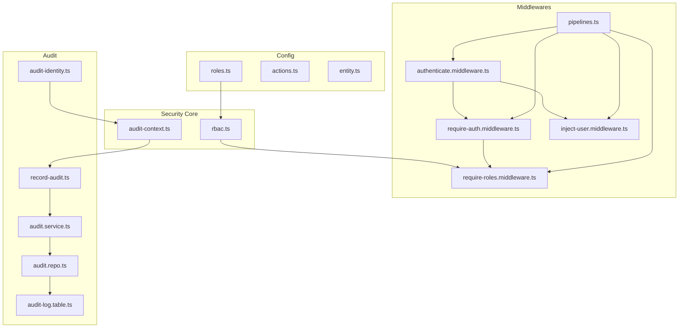
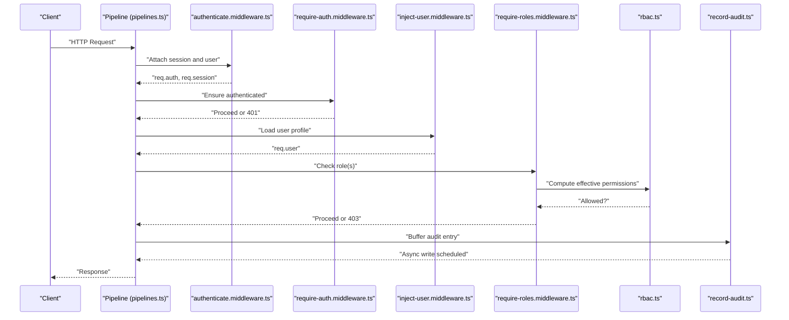
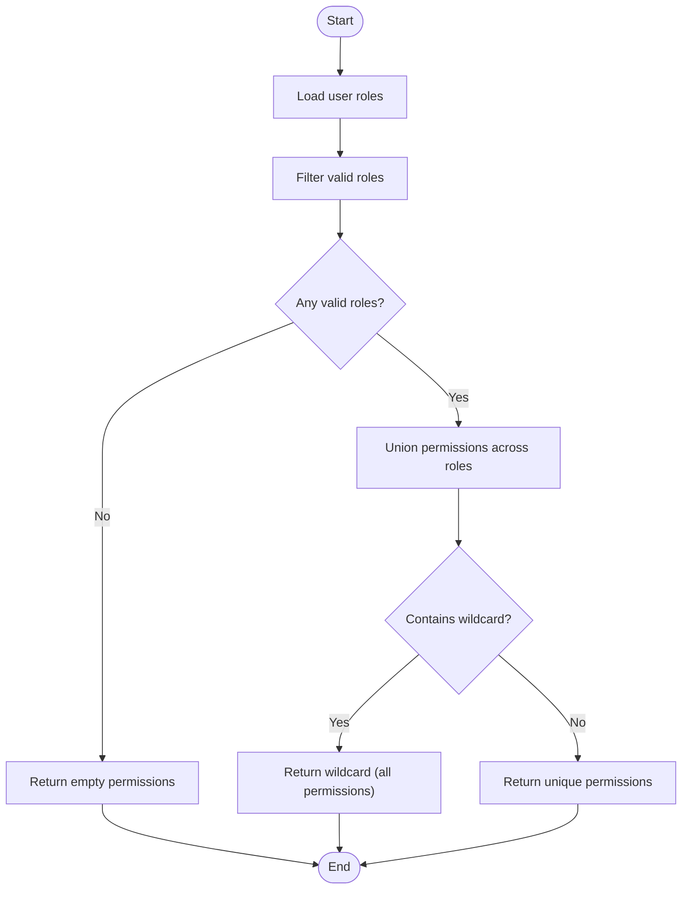
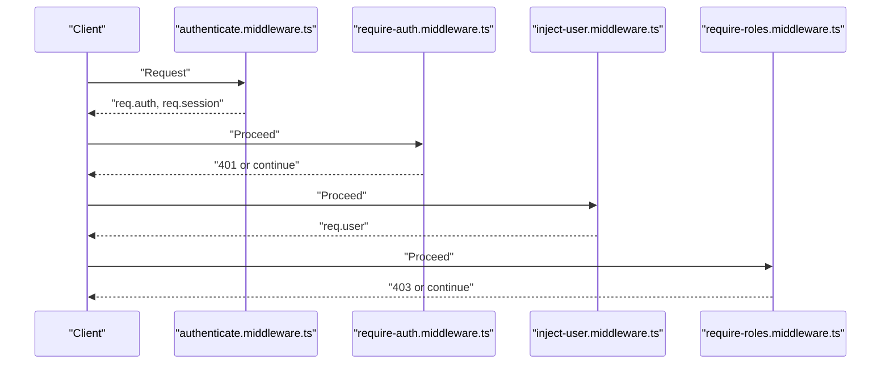
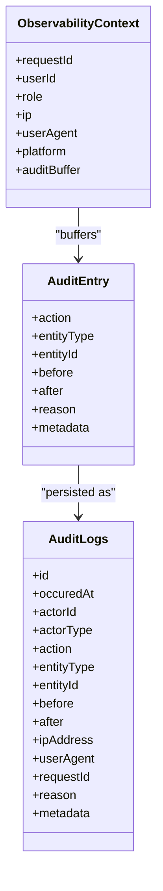
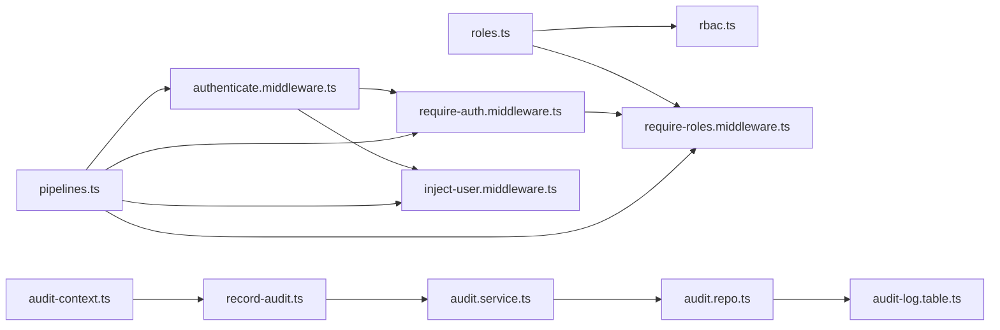

# Authorization & RBAC

<cite>
**Referenced Files in This Document**
- [roles.ts](file://server/src/config/roles.ts)
- [rbac.ts](file://server/src/core/security/rbac.ts)
- [pipelines.ts](file://server/src/core/middlewares/pipelines.ts)
- [require-auth.middleware.ts](file://server/src/core/middlewares/auth/require-auth.middleware.ts)
- [authenticate.middleware.ts](file://server/src/core/middlewares/auth/authenticate.middleware.ts)
- [inject-user.middleware.ts](file://server/src/core/middlewares/auth/inject-user.middleware.ts)
- [require-roles.middleware.ts](file://server/src/core/middlewares/auth/require-roles.middleware.ts)
- [audit-context.ts](file://server/src/modules/audit/audit-context.ts)
- [record-audit.ts](file://server/src/lib/record-audit.ts)
- [audit-identity.ts](file://server/src/lib/audit-identity.ts)
- [audit.service.ts](file://server/src/modules/audit/audit.service.ts)
- [audit.repo.ts](file://server/src/modules/audit/audit.repo.ts)
- [audit-log.table.ts](file://server/src/infra/db/tables/audit-log.table.ts)
- [actions.ts](file://server/src/shared/constants/audit/actions.ts)
- [entity.ts](file://server/src/shared/constants/audit/entity.ts)
</cite>

## Table of Contents
1. [Introduction](#introduction)
2. [Project Structure](#project-structure)
3. [Core Components](#core-components)
4. [Architecture Overview](#architecture-overview)
5. [Detailed Component Analysis](#detailed-component-analysis)
6. [Dependency Analysis](#dependency-analysis)
7. [Performance Considerations](#performance-considerations)
8. [Troubleshooting Guide](#troubleshooting-guide)
9. [Conclusion](#conclusion)
10. [Appendices](#appendices)

## Introduction
This document describes the authorization and role-based access control (RBAC) implementation for the Flick platform. It covers role definitions, permission matrices, middleware enforcement, resource-level access policies, and audit logging for permission changes and access attempts. It also provides guidelines for extending roles and permissions securely.

## Project Structure
The RBAC system spans configuration, middleware pipelines, and audit infrastructure:
- Roles and permissions are defined centrally.
- Middleware enforces authentication, user injection, and role checks.
- Audit logging records actions and contextual metadata for compliance and monitoring.

**Diagram sources**
- [roles.ts](file://server/src/config/roles.ts#L1-L11)
- [rbac.ts](file://server/src/core/security/rbac.ts#L1-L15)
- [pipelines.ts](file://server/src/core/middlewares/pipelines.ts#L1-L37)
- [authenticate.middleware.ts](file://server/src/core/middlewares/auth/authenticate.middleware.ts#L1-L21)
- [require-auth.middleware.ts](file://server/src/core/middlewares/auth/require-auth.middleware.ts#L1-L12)
- [inject-user.middleware.ts](file://server/src/core/middlewares/auth/inject-user.middleware.ts#L1-L20)
- [require-roles.middleware.ts](file://server/src/core/middlewares/auth/require-roles.middleware.ts#L1-L44)
- [audit-context.ts](file://server/src/modules/audit/audit-context.ts#L1-L29)
- [record-audit.ts](file://server/src/lib/record-audit.ts#L1-L20)
- [audit-identity.ts](file://server/src/lib/audit-identity.ts#L1-L30)
- [audit.service.ts](file://server/src/modules/audit/audit.service.ts#L1-L10)
- [audit.repo.ts](file://server/src/modules/audit/audit.repo.ts#L1-L10)
- [audit-log.table.ts](file://server/src/infra/db/tables/audit-log.table.ts#L1-L74)

**Section sources**
- [roles.ts](file://server/src/config/roles.ts#L1-L11)
- [rbac.ts](file://server/src/core/security/rbac.ts#L1-L15)
- [pipelines.ts](file://server/src/core/middlewares/pipelines.ts#L1-L37)
- [authenticate.middleware.ts](file://server/src/core/middlewares/auth/authenticate.middleware.ts#L1-L21)
- [require-auth.middleware.ts](file://server/src/core/middlewares/auth/require-auth.middleware.ts#L1-L12)
- [inject-user.middleware.ts](file://server/src/core/middlewares/auth/inject-user.middleware.ts#L1-L20)
- [require-roles.middleware.ts](file://server/src/core/middlewares/auth/require-roles.middleware.ts#L1-L44)
- [audit-context.ts](file://server/src/modules/audit/audit-context.ts#L1-L29)
- [record-audit.ts](file://server/src/lib/record-audit.ts#L1-L20)
- [audit-identity.ts](file://server/src/lib/audit-identity.ts#L1-L30)
- [audit.service.ts](file://server/src/modules/audit/audit.service.ts#L1-L10)
- [audit.repo.ts](file://server/src/modules/audit/audit.repo.ts#L1-L10)
- [audit-log.table.ts](file://server/src/infra/db/tables/audit-log.table.ts#L1-L74)

## Core Components
- Role definitions and permission matrix:
  - Roles include user, admin, and superadmin.
  - Permissions are scoped strings identifying allowed actions on resources.
  - Superadmin inherits all permissions via a wildcard.
- RBAC computation:
  - Aggregates permissions from all user roles.
  - Normalizes wildcard to full permission set.
- Middleware enforcement:
  - Authentication pipeline attaches session and user identity to requests.
  - Role-based gating ensures only authorized roles proceed.
- Audit trail:
  - Centralized observability context stores request-scoped metadata.
  - Audit entries are buffered and recorded asynchronously.

**Section sources**
- [roles.ts](file://server/src/config/roles.ts#L1-L11)
- [rbac.ts](file://server/src/core/security/rbac.ts#L1-L15)
- [pipelines.ts](file://server/src/core/middlewares/pipelines.ts#L1-L37)
- [audit-context.ts](file://server/src/modules/audit/audit-context.ts#L1-L29)

## Architecture Overview
The authorization stack integrates authentication, user injection, and role checks into reusable pipelines. Audit logging captures contextual metadata for every request.

**Diagram sources**
- [pipelines.ts](file://server/src/core/middlewares/pipelines.ts#L1-L37)
- [authenticate.middleware.ts](file://server/src/core/middlewares/auth/authenticate.middleware.ts#L1-L21)
- [require-auth.middleware.ts](file://server/src/core/middlewares/auth/require-auth.middleware.ts#L1-L12)
- [inject-user.middleware.ts](file://server/src/core/middlewares/auth/inject-user.middleware.ts#L1-L20)
- [require-roles.middleware.ts](file://server/src/core/middlewares/auth/require-roles.middleware.ts#L1-L44)
- [rbac.ts](file://server/src/core/security/rbac.ts#L1-L15)
- [record-audit.ts](file://server/src/lib/record-audit.ts#L1-L20)

## Detailed Component Analysis

### Role Definitions and Permission Matrix
- Roles:
  - user: read own profile.
  - admin: read own profile, create users, delete users.
  - superadmin: wildcard allowing all actions.
- Computation:
  - Effective permissions are unioned across all user roles.
  - Presence of wildcard implies full permission set.

**Diagram sources**
- [roles.ts](file://server/src/config/roles.ts#L1-L11)
- [rbac.ts](file://server/src/core/security/rbac.ts#L1-L15)

**Section sources**
- [roles.ts](file://server/src/config/roles.ts#L1-L11)
- [rbac.ts](file://server/src/core/security/rbac.ts#L1-L15)

### Middleware Stack and Enforcement
- Identity pipeline:
  - authenticate: fetches session and attaches auth/user context.
  - require-auth: rejects unauthenticated requests.
  - inject-user: enriches request with user profile.
  - require-user: ensures user exists in system.
- Role-based gating:
  - require-roles: verifies user role against allowed set.
- Predefined pipelines:
  - authenticated: requires auth.
  - withRequiredUserContext: requires auth + user + role checks.
  - withOptionalUserContext: optional user context.
  - checkUserContext: lightweight auth + user presence.
  - adminOnly: requires admin role.

**Diagram sources**
- [authenticate.middleware.ts](file://server/src/core/middlewares/auth/authenticate.middleware.ts#L1-L21)
- [require-auth.middleware.ts](file://server/src/core/middlewares/auth/require-auth.middleware.ts#L1-L12)
- [inject-user.middleware.ts](file://server/src/core/middlewares/auth/inject-user.middleware.ts#L1-L20)
- [require-roles.middleware.ts](file://server/src/core/middlewares/auth/require-roles.middleware.ts#L1-L44)

**Section sources**
- [pipelines.ts](file://server/src/core/middlewares/pipelines.ts#L1-L37)
- [authenticate.middleware.ts](file://server/src/core/middlewares/auth/authenticate.middleware.ts#L1-L21)
- [require-auth.middleware.ts](file://server/src/core/middlewares/auth/require-auth.middleware.ts#L1-L12)
- [inject-user.middleware.ts](file://server/src/core/middlewares/auth/inject-user.middleware.ts#L1-L20)
- [require-roles.middleware.ts](file://server/src/core/middlewares/auth/require-roles.middleware.ts#L1-L44)

### Resource-Level Access Policies
- Posts:
  - Creation and updates typically restricted to authenticated users.
  - Deletion may require ownership or elevated roles.
- Comments:
  - Creation and updates generally require authenticated users.
  - Deletion may require ownership or moderation/admin roles.
- User profiles:
  - Viewing profile may be public or restricted depending on visibility.
  - Editing profile restricted to self or admin.
- Administrative functions:
  - User management (create/delete/update users) restricted to admin/superadmin.
  - Content moderation actions (block/unblock/report handling) restricted to admin/superadmin.
- Enforcement:
  - Use adminOnly pipeline for admin endpoints.
  - Combine authenticated pipeline with require-roles for granular checks.

[No sources needed since this section provides general guidance]

### Audit Trail for Permission Changes and Access Attempts
- Observability context:
  - Stores request ID, user ID, role, IP, user agent, platform, and an audit buffer.
- Identity masking:
  - Masks email and hashes for privacy-preserving audit identifiers.
- Recording:
  - record-audit buffers entries enriched with device info.
  - audit.service writes entries via audit.repo to audit-log.table.
- Schema highlights:
  - Fields include actor type, action, entity type/id, IP, user agent, request correlation, reason, and metadata.
  - Indexes support efficient querying by entity, actor, and time.

**Diagram sources**
- [audit-context.ts](file://server/src/modules/audit/audit-context.ts#L1-L29)
- [record-audit.ts](file://server/src/lib/record-audit.ts#L1-L20)
- [audit.service.ts](file://server/src/modules/audit/audit.service.ts#L1-L10)
- [audit.repo.ts](file://server/src/modules/audit/audit.repo.ts#L1-L10)
- [audit-log.table.ts](file://server/src/infra/db/tables/audit-log.table.ts#L1-L74)

**Section sources**
- [audit-context.ts](file://server/src/modules/audit/audit-context.ts#L1-L29)
- [record-audit.ts](file://server/src/lib/record-audit.ts#L1-L20)
- [audit-identity.ts](file://server/src/lib/audit-identity.ts#L1-L30)
- [audit.service.ts](file://server/src/modules/audit/audit.service.ts#L1-L10)
- [audit.repo.ts](file://server/src/modules/audit/audit.repo.ts#L1-L10)
- [audit-log.table.ts](file://server/src/infra/db/tables/audit-log.table.ts#L1-L74)
- [actions.ts](file://server/src/shared/constants/audit/actions.ts#L1-L66)
- [entity.ts](file://server/src/shared/constants/audit/entity.ts#L1-L15)

### Examples and Dynamic Access Control
- Role assignment:
  - Assign roles to users during registration or admin operations.
  - Effective permissions computed dynamically per request via RBAC.
- Permission checking logic:
  - Use require-roles middleware to gate endpoints by role.
  - Combine with authenticated pipeline for layered enforcement.
- Edge cases:
  - Super admin privileges: wildcard grants all permissions; RBAC short-circuits to allow.
  - Role inheritance: roles are additive; effective permissions union all roles.
  - Permission conflicts: resolved by wildcard; ensure least privilege otherwise.

[No sources needed since this section provides general guidance]

## Dependency Analysis
- Role-to-permission mapping is centralized in roles.ts and consumed by rbac.ts.
- Middlewares depend on role definitions and HTTP error handling.
- Audit subsystem depends on observability context and database schema.

**Diagram sources**
- [roles.ts](file://server/src/config/roles.ts#L1-L11)
- [rbac.ts](file://server/src/core/security/rbac.ts#L1-L15)
- [pipelines.ts](file://server/src/core/middlewares/pipelines.ts#L1-L37)
- [authenticate.middleware.ts](file://server/src/core/middlewares/auth/authenticate.middleware.ts#L1-L21)
- [require-auth.middleware.ts](file://server/src/core/middlewares/auth/require-auth.middleware.ts#L1-L12)
- [inject-user.middleware.ts](file://server/src/core/middlewares/auth/inject-user.middleware.ts#L1-L20)
- [require-roles.middleware.ts](file://server/src/core/middlewares/auth/require-roles.middleware.ts#L1-L44)
- [audit-context.ts](file://server/src/modules/audit/audit-context.ts#L1-L29)
- [record-audit.ts](file://server/src/lib/record-audit.ts#L1-L20)
- [audit.service.ts](file://server/src/modules/audit/audit.service.ts#L1-L10)
- [audit.repo.ts](file://server/src/modules/audit/audit.repo.ts#L1-L10)
- [audit-log.table.ts](file://server/src/infra/db/tables/audit-log.table.ts#L1-L74)

**Section sources**
- [roles.ts](file://server/src/config/roles.ts#L1-L11)
- [rbac.ts](file://server/src/core/security/rbac.ts#L1-L15)
- [pipelines.ts](file://server/src/core/middlewares/pipelines.ts#L1-L37)
- [audit-context.ts](file://server/src/modules/audit/audit-context.ts#L1-L29)

## Performance Considerations
- Middleware composition minimizes overhead by reusing shared steps.
- RBAC computes effective permissions per request; keep role sets concise.
- Audit buffering decouples logging from request path latency.
- Use indexes on audit log tables to optimize reporting queries.

[No sources needed since this section provides general guidance]

## Troubleshooting Guide
- Unauthorized errors:
  - Occur when authentication fails or session is missing.
  - Verify authenticate middleware runs before require-auth.
- Forbidden errors:
  - Occur when user lacks required role.
  - Confirm role assignment and require-roles configuration.
- Audit gaps:
  - Ensure observability context is initialized and record-audit is invoked.
  - Check device parsing and audit buffer flushing.

**Section sources**
- [require-auth.middleware.ts](file://server/src/core/middlewares/auth/require-auth.middleware.ts#L1-L12)
- [require-roles.middleware.ts](file://server/src/core/middlewares/auth/require-roles.middleware.ts#L1-L44)
- [record-audit.ts](file://server/src/lib/record-audit.ts#L1-L20)

## Conclusion
The Flick platform implements a clear, extensible RBAC model with explicit role definitions, dynamic permission computation, robust middleware enforcement, and comprehensive audit logging. By following the guidelines below, teams can safely extend roles and permissions while maintaining strong security guarantees.

## Appendices

### Implementation Guidelines for Adding New Roles and Permissions
- Define new role and permissions in roles.ts.
- Update RBAC logic if special handling is needed beyond union and wildcard.
- Add new audit actions and entity types in actions.ts and entity.ts as applicable.
- Wire new endpoints with appropriate middleware pipelines:
  - Use authenticated for basic auth.
  - Use adminOnly for admin-only endpoints.
  - Use require-roles for custom role gates.
- Ensure audit entries capture meaningful metadata for compliance.

**Section sources**
- [roles.ts](file://server/src/config/roles.ts#L1-L11)
- [rbac.ts](file://server/src/core/security/rbac.ts#L1-L15)
- [pipelines.ts](file://server/src/core/middlewares/pipelines.ts#L1-L37)
- [actions.ts](file://server/src/shared/constants/audit/actions.ts#L1-L66)
- [entity.ts](file://server/src/shared/constants/audit/entity.ts#L1-L15)