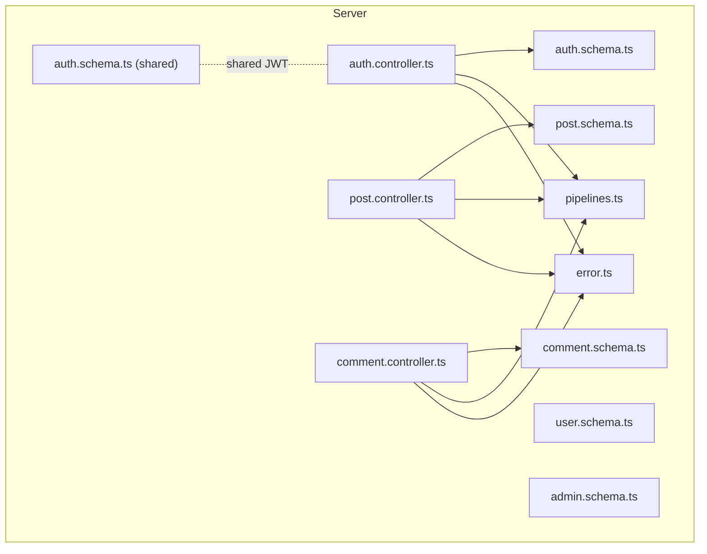
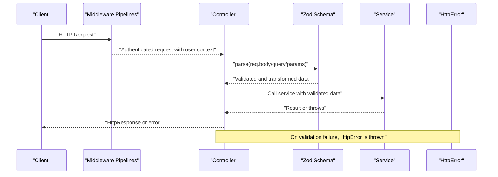
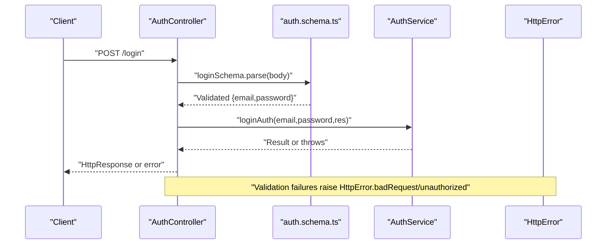
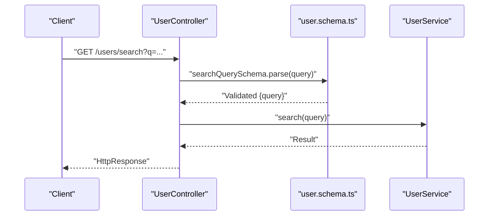
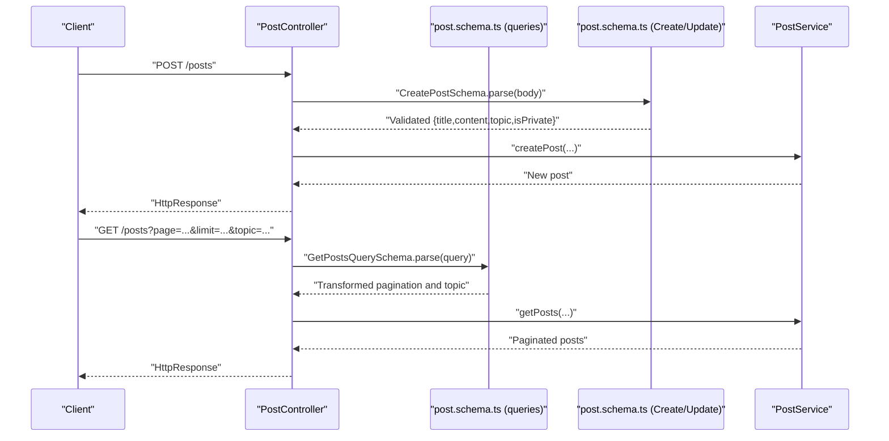
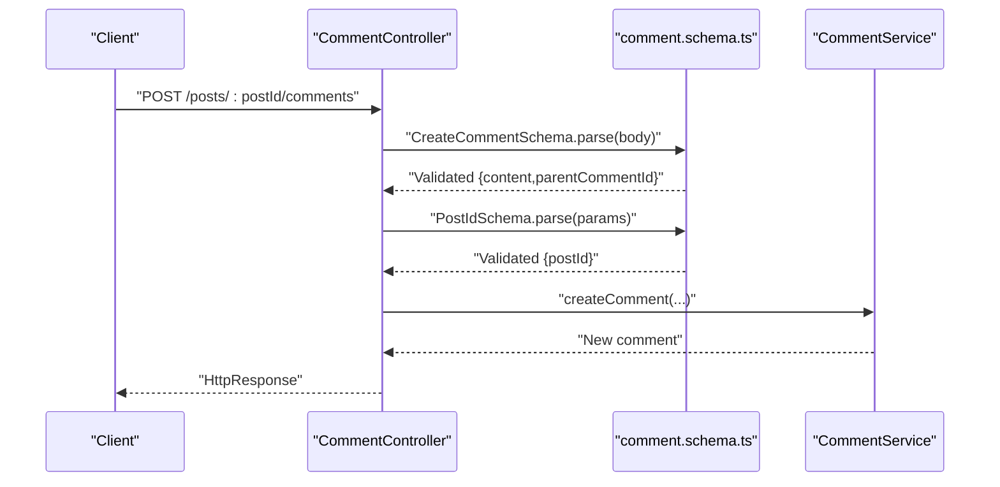
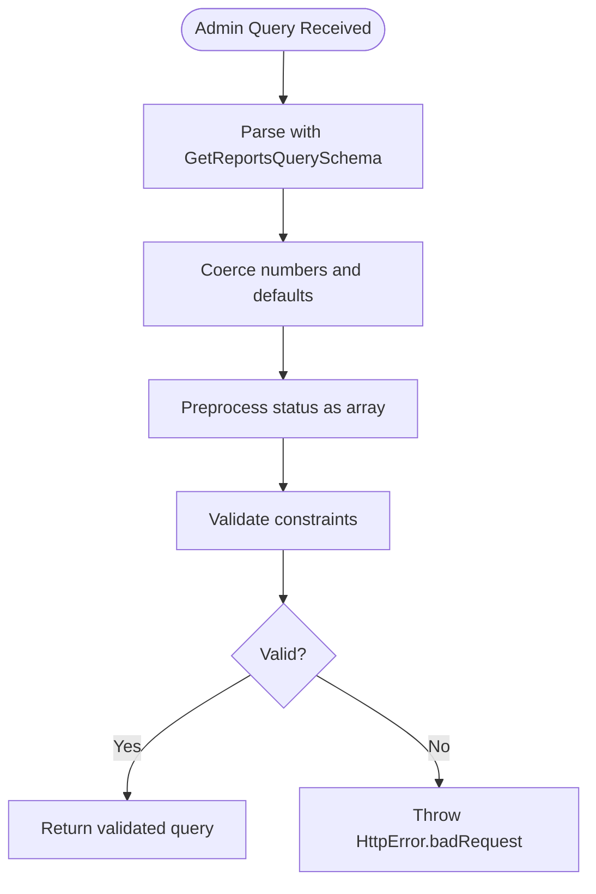
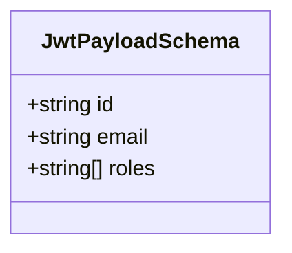
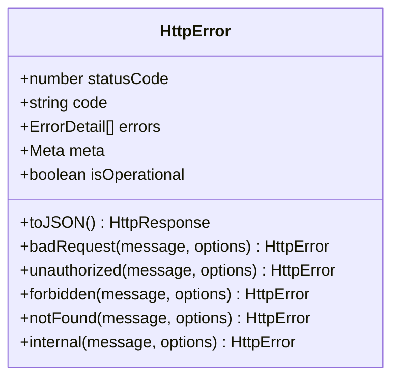
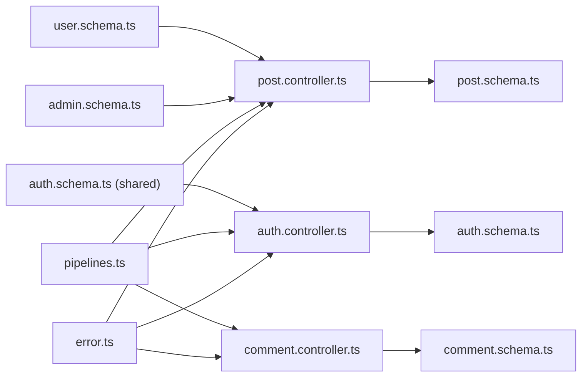

# Input Validation & Sanitization

<cite>
**Referenced Files in This Document**
- [auth.schema.ts](file://server/src/modules/auth/auth.schema.ts)
- [user.schema.ts](file://server/src/modules/user/user.schema.ts)
- [post.schema.ts](file://server/src/modules/post/post.schema.ts)
- [comment.schema.ts](file://server/src/modules/comment/comment.schema.ts)
- [admin.schema.ts](file://server/src/modules/admin/admin.schema.ts)
- [auth.schema.ts (shared)](file://server/src/shared/validators/auth.schema.ts)
- [auth.controller.ts](file://server/src/modules/auth/auth.controller.ts)
- [post.controller.ts](file://server/src/modules/post/post.controller.ts)
- [comment.controller.ts](file://server/src/modules/comment/comment.controller.ts)
- [pipelines.ts](file://server/src/core/middlewares/pipelines.ts)
- [error.ts](file://server/src/core/http/error.ts)
- [crypto-tools.ts](file://server/src/lib/crypto-tools.ts)
- [moderator.tsx](file://web/src/utils/moderator.tsx)
</cite>

## Table of Contents
1. [Introduction](#introduction)
2. [Project Structure](#project-structure)
3. [Core Components](#core-components)
4. [Architecture Overview](#architecture-overview)
5. [Detailed Component Analysis](#detailed-component-analysis)
6. [Dependency Analysis](#dependency-analysis)
7. [Performance Considerations](#performance-considerations)
8. [Troubleshooting Guide](#troubleshooting-guide)
9. [Conclusion](#conclusion)
10. [Appendices](#appendices)

## Introduction
This document describes the input validation and sanitization system used across the Flick platform. It focuses on the Zod-based validation schemas that protect all API endpoints, the validation pipelines that enforce constraints, and the error handling mechanisms that produce user-friendly responses. It also covers XSS prevention measures, SQL injection protection, input length restrictions, and internationalization considerations for validation messages.

## Project Structure
Validation logic is centralized in module-specific schema files under server/src/modules/<module>/, with controllers invoking Zod parsing to validate request bodies, queries, and params. Shared JWT payload validation resides under server/src/shared/validators/. Middleware pipelines enforce authentication and role checks prior to validation. Error responses are standardized via a dedicated HttpError class.

**Diagram sources**
- [auth.controller.ts](file://server/src/modules/auth/auth.controller.ts#L1-L171)
- [post.controller.ts](file://server/src/modules/post/post.controller.ts#L1-L135)
- [comment.controller.ts](file://server/src/modules/comment/comment.controller.ts#L1-L64)
- [auth.schema.ts](file://server/src/modules/auth/auth.schema.ts#L1-L78)
- [post.schema.ts](file://server/src/modules/post/post.schema.ts#L1-L81)
- [comment.schema.ts](file://server/src/modules/comment/comment.schema.ts#L1-L25)
- [user.schema.ts](file://server/src/modules/user/user.schema.ts#L1-L39)
- [admin.schema.ts](file://server/src/modules/admin/admin.schema.ts#L1-L52)
- [auth.schema.ts (shared)](file://server/src/shared/validators/auth.schema.ts#L1-L9)
- [pipelines.ts](file://server/src/core/middlewares/pipelines.ts#L1-L37)
- [error.ts](file://server/src/core/http/error.ts#L1-L131)

**Section sources**
- [auth.controller.ts](file://server/src/modules/auth/auth.controller.ts#L1-L171)
- [post.controller.ts](file://server/src/modules/post/post.controller.ts#L1-L135)
- [comment.controller.ts](file://server/src/modules/comment/comment.controller.ts#L1-L64)
- [auth.schema.ts](file://server/src/modules/auth/auth.schema.ts#L1-L78)
- [post.schema.ts](file://server/src/modules/post/post.schema.ts#L1-L81)
- [comment.schema.ts](file://server/src/modules/comment/comment.schema.ts#L1-L25)
- [user.schema.ts](file://server/src/modules/user/user.schema.ts#L1-L39)
- [admin.schema.ts](file://server/src/modules/admin/admin.schema.ts#L1-L52)
- [auth.schema.ts (shared)](file://server/src/shared/validators/auth.schema.ts#L1-L9)
- [pipelines.ts](file://server/src/core/middlewares/pipelines.ts#L1-L37)
- [error.ts](file://server/src/core/http/error.ts#L1-L131)

## Core Components
- Zod schemas define strict field validation, type checking, and constraints for all request payloads, query parameters, and path parameters across modules.
- Controllers parse requests using Zod schemas; invalid inputs raise structured errors handled by the error pipeline.
- Middleware pipelines enforce authentication and authorization before validation occurs.
- Shared JWT payload schema ensures consistent decoding of tokens across services.
- Cryptographic utilities handle secure hashing and encryption for sensitive data.
- Frontend moderation utilities provide additional filtering for content safety.

**Section sources**
- [auth.schema.ts](file://server/src/modules/auth/auth.schema.ts#L1-L78)
- [user.schema.ts](file://server/src/modules/user/user.schema.ts#L1-L39)
- [post.schema.ts](file://server/src/modules/post/post.schema.ts#L1-L81)
- [comment.schema.ts](file://server/src/modules/comment/comment.schema.ts#L1-L25)
- [admin.schema.ts](file://server/src/modules/admin/admin.schema.ts#L1-L52)
- [auth.schema.ts (shared)](file://server/src/shared/validators/auth.schema.ts#L1-L9)
- [auth.controller.ts](file://server/src/modules/auth/auth.controller.ts#L1-L171)
- [post.controller.ts](file://server/src/modules/post/post.controller.ts#L1-L135)
- [comment.controller.ts](file://server/src/modules/comment/comment.controller.ts#L1-L64)
- [pipelines.ts](file://server/src/core/middlewares/pipelines.ts#L1-L37)
- [crypto-tools.ts](file://server/src/lib/crypto-tools.ts#L1-L99)
- [moderator.tsx](file://web/src/utils/moderator.tsx#L1-L46)

## Architecture Overview
The validation architecture follows a consistent pattern:
- Middleware pipelines authenticate and inject user context.
- Controllers parse request data using Zod schemas.
- Services operate on validated, transformed data.
- Errors are standardized and returned as HTTP responses.

**Diagram sources**
- [pipelines.ts](file://server/src/core/middlewares/pipelines.ts#L1-L37)
- [auth.controller.ts](file://server/src/modules/auth/auth.controller.ts#L1-L171)
- [post.controller.ts](file://server/src/modules/post/post.controller.ts#L1-L135)
- [comment.controller.ts](file://server/src/modules/comment/comment.controller.ts#L1-L64)
- [error.ts](file://server/src/core/http/error.ts#L1-L131)

## Detailed Component Analysis

### Authentication Validation Pipeline
- Login, registration, OTP, password reset, and admin listing schemas enforce required fields, minimum lengths, and format validations.
- Controllers parse request bodies and query parameters using these schemas before delegating to services.
- Unauthorized or bad request conditions are surfaced via standardized HttpError instances.

**Diagram sources**
- [auth.controller.ts](file://server/src/modules/auth/auth.controller.ts#L8-L22)
- [auth.schema.ts](file://server/src/modules/auth/auth.schema.ts#L5-L8)
- [error.ts](file://server/src/core/http/error.ts#L71-L76)

**Section sources**
- [auth.schema.ts](file://server/src/modules/auth/auth.schema.ts#L1-L78)
- [auth.controller.ts](file://server/src/modules/auth/auth.controller.ts#L1-L171)
- [error.ts](file://server/src/core/http/error.ts#L1-L131)

### User Management Validation Pipeline
- OAuth initialization, user ID retrieval, and search query schemas ensure minimal and safe inputs.
- Controllers parse inputs and pass validated data to services.

**Diagram sources**
- [user.schema.ts](file://server/src/modules/user/user.schema.ts#L36-L39)
- [auth.controller.ts](file://server/src/modules/auth/auth.controller.ts#L1-L171)

**Section sources**
- [user.schema.ts](file://server/src/modules/user/user.schema.ts#L1-L39)
- [auth.controller.ts](file://server/src/modules/auth/auth.controller.ts#L1-L171)

### Post Creation and Retrieval Validation Pipeline
- Create and update schemas enforce length limits and enum constraints for topics.
- Query parsing includes robust transformations for pagination and topic normalization.
- Controllers validate inputs and delegate to services.

**Diagram sources**
- [post.controller.ts](file://server/src/modules/post/post.controller.ts#L8-L53)
- [post.schema.ts](file://server/src/modules/post/post.schema.ts#L17-L72)

**Section sources**
- [post.schema.ts](file://server/src/modules/post/post.schema.ts#L1-L81)
- [post.controller.ts](file://server/src/modules/post/post.controller.ts#L1-L135)

### Comment Processing Validation Pipeline
- Create, update, and retrieval schemas enforce content length limits and optional parent comment references.
- Controllers validate inputs and call services.

**Diagram sources**
- [comment.controller.ts](file://server/src/modules/comment/comment.controller.ts#L9-L22)
- [comment.schema.ts](file://server/src/modules/comment/comment.schema.ts#L3-L18)

**Section sources**
- [comment.schema.ts](file://server/src/modules/comment/comment.schema.ts#L1-L25)
- [comment.controller.ts](file://server/src/modules/comment/comment.controller.ts#L1-L64)

### Admin Management Validation Pipeline
- Queries for reports and logs include coercion, defaults, and array preprocessing for status filters.
- Create/update college schemas enforce minimum lengths and formats.

**Diagram sources**
- [admin.schema.ts](file://server/src/modules/admin/admin.schema.ts#L10-L18)

**Section sources**
- [admin.schema.ts](file://server/src/modules/admin/admin.schema.ts#L1-L52)

### JWT Payload Validation (Shared)
- JWT payload schema validates token claims consistently across services.

**Diagram sources**
- [auth.schema.ts (shared)](file://server/src/shared/validators/auth.schema.ts#L4-L8)

**Section sources**
- [auth.schema.ts (shared)](file://server/src/shared/validators/auth.schema.ts#L1-L9)

### XSS Prevention Measures
- Content filtering utilities in the frontend detect and flag banned words, preventing offensive content from being rendered.
- While backend schemas constrain lengths and types, content sanitization and moderation occur at the UI layer to complement backend validation.

**Section sources**
- [moderator.tsx](file://web/src/utils/moderator.tsx#L1-L46)

### SQL Injection Protection
- The backend relies on Zod schemas to validate and coerce inputs, ensuring only well-formed data reaches services. Database access is performed through typed adapters and transactions, minimizing risk from malformed inputs.

[No sources needed since this section provides general guidance]

### Input Length Restrictions
- Titles and content fields enforce minimum and maximum lengths across schemas for posts and comments.
- Topic enums restrict values to predefined sets, preventing unexpected values.

**Section sources**
- [post.schema.ts](file://server/src/modules/post/post.schema.ts#L18-L24)
- [comment.schema.ts](file://server/src/modules/comment/comment.schema.ts#L4-L6)

### Data Transformation Processes
- Query schemas transform string inputs into integers, clamp limits, and normalize topic values (case-insensitive, URL-decoded).
- Number coercion enforces integer constraints with min/max bounds.

**Section sources**
- [post.schema.ts](file://server/src/modules/post/post.schema.ts#L40-L72)
- [admin.schema.ts](file://server/src/modules/admin/admin.schema.ts#L10-L18)

### Error Handling for Validation Failures
- HttpError provides standardized constructors for bad request, unauthorized, forbidden, not found, and internal errors.
- Controllers catch validation exceptions and return appropriate HTTP responses with structured error payloads.

**Diagram sources**
- [error.ts](file://server/src/core/http/error.ts#L3-L108)

**Section sources**
- [error.ts](file://server/src/core/http/error.ts#L1-L131)
- [auth.controller.ts](file://server/src/modules/auth/auth.controller.ts#L34-L37)

### Internationalization of Validation Messages
- Validation messages are currently defined as English strings within Zod schemas.
- To support localization, consider externalizing messages and injecting locale-aware validators during schema construction.

[No sources needed since this section provides general guidance]

## Dependency Analysis
Validation schemas are consumed by controllers and middleware pipelines. Services receive only validated data, reducing downstream error handling.

**Diagram sources**
- [auth.controller.ts](file://server/src/modules/auth/auth.controller.ts#L1-L171)
- [post.controller.ts](file://server/src/modules/post/post.controller.ts#L1-L135)
- [comment.controller.ts](file://server/src/modules/comment/comment.controller.ts#L1-L64)
- [auth.schema.ts](file://server/src/modules/auth/auth.schema.ts#L1-L78)
- [post.schema.ts](file://server/src/modules/post/post.schema.ts#L1-L81)
- [comment.schema.ts](file://server/src/modules/comment/comment.schema.ts#L1-L25)
- [user.schema.ts](file://server/src/modules/user/user.schema.ts#L1-L39)
- [admin.schema.ts](file://server/src/modules/admin/admin.schema.ts#L1-L52)
- [auth.schema.ts (shared)](file://server/src/shared/validators/auth.schema.ts#L1-L9)
- [pipelines.ts](file://server/src/core/middlewares/pipelines.ts#L1-L37)
- [error.ts](file://server/src/core/http/error.ts#L1-L131)

**Section sources**
- [auth.controller.ts](file://server/src/modules/auth/auth.controller.ts#L1-L171)
- [post.controller.ts](file://server/src/modules/post/post.controller.ts#L1-L135)
- [comment.controller.ts](file://server/src/modules/comment/comment.controller.ts#L1-L64)
- [auth.schema.ts](file://server/src/modules/auth/auth.schema.ts#L1-L78)
- [post.schema.ts](file://server/src/modules/post/post.schema.ts#L1-L81)
- [comment.schema.ts](file://server/src/modules/comment/comment.schema.ts#L1-L25)
- [user.schema.ts](file://server/src/modules/user/user.schema.ts#L1-L39)
- [admin.schema.ts](file://server/src/modules/admin/admin.schema.ts#L1-L52)
- [auth.schema.ts (shared)](file://server/src/shared/validators/auth.schema.ts#L1-L9)
- [pipelines.ts](file://server/src/core/middlewares/pipelines.ts#L1-L37)
- [error.ts](file://server/src/core/http/error.ts#L1-L131)

## Performance Considerations
- Prefer early validation in controllers to fail fast and avoid unnecessary service calls.
- Use coerce and transform sparingly; ensure transforms are efficient and bounded.
- Cache frequently accessed enums (e.g., topic lists) to reduce repeated computations.
- Keep schema definitions concise and reuse common patterns to minimize runtime overhead.

[No sources needed since this section provides general guidance]

## Troubleshooting Guide
- Validation failures: Inspect the error payload’s code and errors fields to identify failing fields and messages.
- Authentication issues: Verify middleware pipelines are applied and credentials conform to schemas.
- Topic normalization: When filtering posts by topic, ensure the query value matches expected casing or URL encoding.

**Section sources**
- [error.ts](file://server/src/core/http/error.ts#L43-L51)
- [pipelines.ts](file://server/src/core/middlewares/pipelines.ts#L1-L37)
- [post.schema.ts](file://server/src/modules/post/post.schema.ts#L44-L69)

## Conclusion
Flick’s validation system leverages Zod schemas to enforce strict typing, constraints, and transformations across all API endpoints. Controllers parse inputs early, middleware pipelines ensure proper context, and standardized error handling produces consistent responses. Additional XSS safeguards and localization-ready message strategies can further strengthen the platform’s security posture.

## Appendices
- Common validation scenarios:
  - Login: email and password must be present and meet minimum length requirements.
  - Post creation: title and content must be present and within length limits; topic must be one of the allowed enum values.
  - Comment creation: content must be present and within length limits; parentCommentId must be a valid UUID if provided.
  - Admin queries: pagination and filtering parameters are coerced and defaulted appropriately.

[No sources needed since this section provides general guidance]