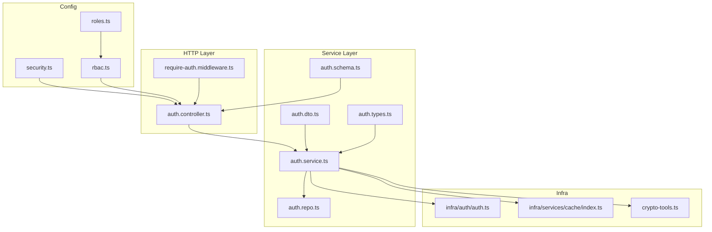
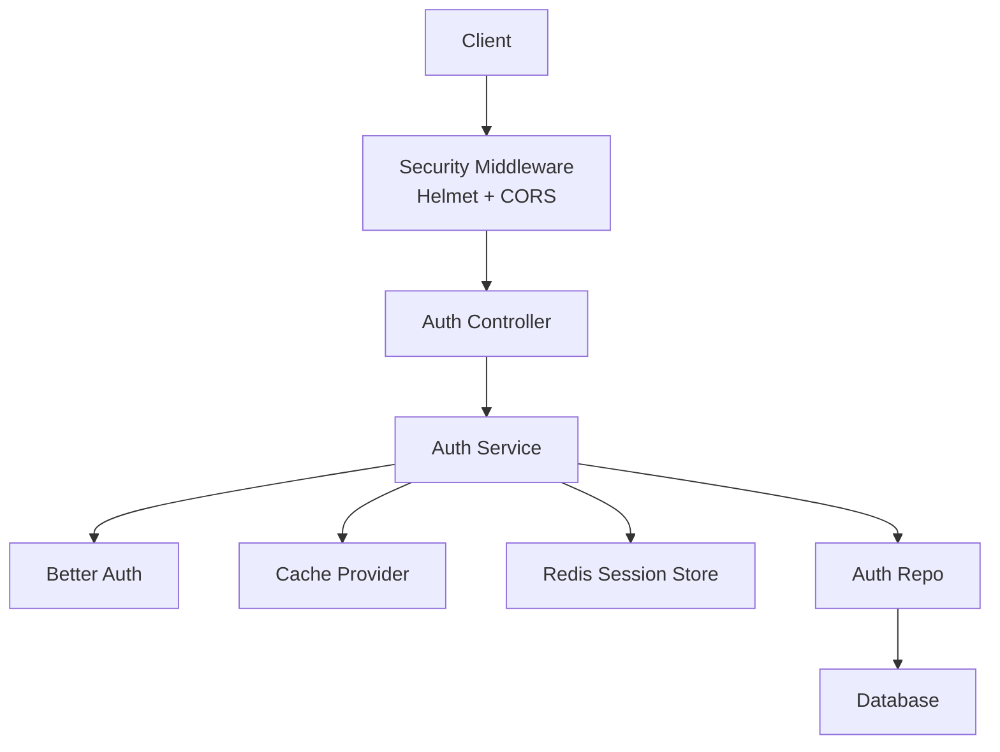
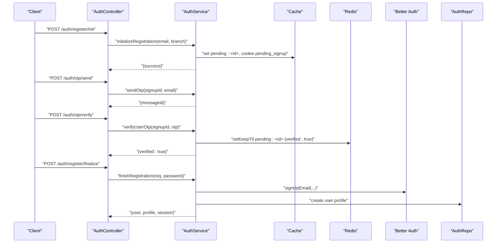
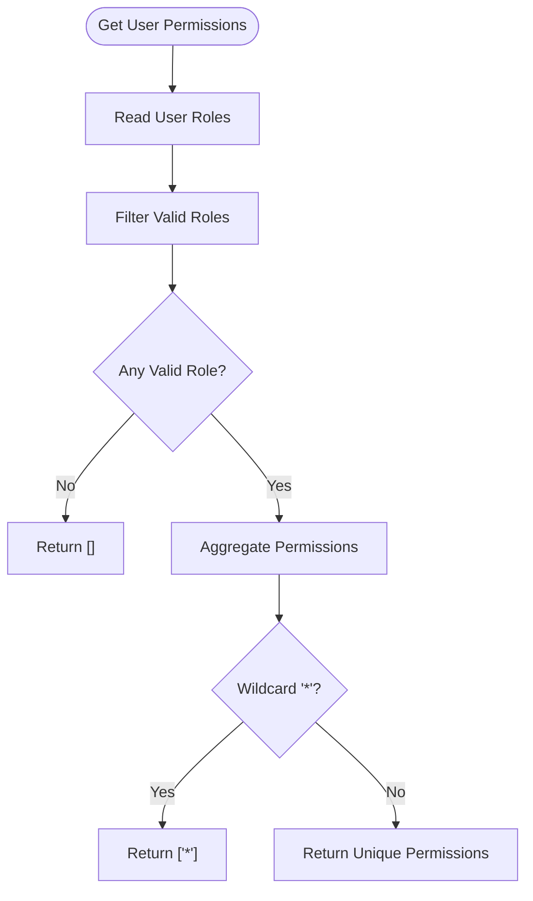
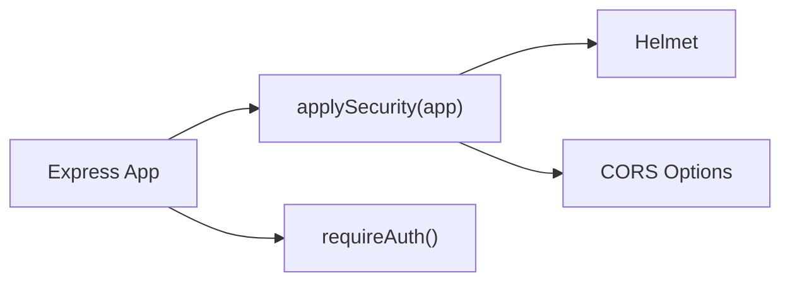
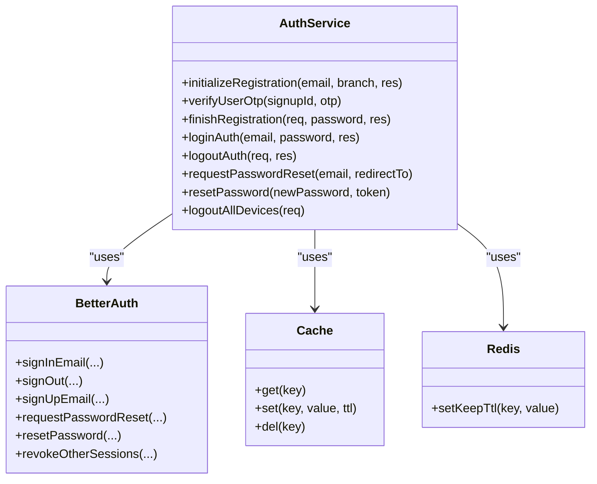
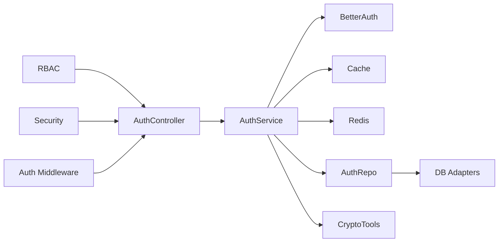

# Security & Authentication

<cite>
**Referenced Files in This Document**
- [security.ts](file://server/src/config/security.ts)
- [roles.ts](file://server/src/config/roles.ts)
- [rbac.ts](file://server/src/core/security/rbac.ts)
- [auth.controller.ts](file://server/src/modules/auth/auth.controller.ts)
- [auth.service.ts](file://server/src/modules/auth/auth.service.ts)
- [auth.repo.ts](file://server/src/modules/auth/auth.repo.ts)
- [auth.schema.ts](file://server/src/modules/auth/auth.schema.ts)
- [auth.dto.ts](file://server/src/modules/auth/auth.dto.ts)
- [auth.types.ts](file://server/src/modules/auth/auth.types.ts)
- [require-auth.middleware.ts](file://server/src/core/middlewares/auth/require-auth.middleware.ts)
- [index.ts](file://server/src/infra/auth/auth.ts)
- [index.ts](file://server/src/infra/services/cache/index.ts)
- [crypto-tools.ts](file://server/src/lib/crypto-tools.ts)
</cite>

## Table of Contents
1. [Introduction](#introduction)
2. [Project Structure](#project-structure)
3. [Core Components](#core-components)
4. [Architecture Overview](#architecture-overview)
5. [Detailed Component Analysis](#detailed-component-analysis)
6. [Dependency Analysis](#dependency-analysis)
7. [Performance Considerations](#performance-considerations)
8. [Troubleshooting Guide](#troubleshooting-guide)
9. [Conclusion](#conclusion)
10. [Appendices](#appendices)

## Introduction
This document provides comprehensive security and authentication documentation for the Flick platform. It covers the multi-layered authentication system (email-based registration with OTP verification, OAuth integration with Google), session management with Redis caching, role-based access control (RBAC), permission matrix, and resource protection strategies. It also documents security middleware (authentication, authorization, rate limiting, request logging), input validation, XSS prevention, CSRF protection, secure session handling, audit logging, threat detection, compliance measures, password security, token management, and secure communication protocols. Finally, it outlines best practices and vulnerability mitigation strategies.

## Project Structure
The security and authentication subsystem spans several layers:
- Configuration and security middleware setup
- RBAC configuration and runtime permission computation
- Authentication controller orchestrating login, logout, OTP, OAuth, password reset, and account deletion
- Authentication service implementing business logic, session handling via Better Auth, Redis-backed caching, and audit logging
- Repositories abstracting database reads/writes and cached reads
- Schemas enforcing input validation
- Crypto utilities for hashing, encryption, and HMAC
- Session and cache providers

**Diagram sources**
- [security.ts](file://server/src/config/security.ts#L1-L14)
- [roles.ts](file://server/src/config/roles.ts#L1-L11)
- [rbac.ts](file://server/src/core/security/rbac.ts#L1-L15)
- [auth.controller.ts](file://server/src/modules/auth/auth.controller.ts#L1-L171)
- [require-auth.middleware.ts](file://server/src/core/middlewares/auth/require-auth.middleware.ts#L1-L12)
- [auth.service.ts](file://server/src/modules/auth/auth.service.ts#L1-L347)
- [auth.repo.ts](file://server/src/modules/auth/auth.repo.ts#L1-L35)
- [auth.schema.ts](file://server/src/modules/auth/auth.schema.ts#L1-L78)
- [auth.dto.ts](file://server/src/modules/auth/auth.dto.ts#L1-L13)
- [auth.types.ts](file://server/src/modules/auth/auth.types.ts#L1-L10)
- [index.ts](file://server/src/infra/auth/auth.ts#L1-L42)
- [index.ts](file://server/src/infra/services/cache/index.ts#L1-L7)
- [crypto-tools.ts](file://server/src/lib/crypto-tools.ts#L1-L99)

**Section sources**
- [security.ts](file://server/src/config/security.ts#L1-L14)
- [roles.ts](file://server/src/config/roles.ts#L1-L11)
- [rbac.ts](file://server/src/core/security/rbac.ts#L1-L15)
- [auth.controller.ts](file://server/src/modules/auth/auth.controller.ts#L1-L171)
- [auth.service.ts](file://server/src/modules/auth/auth.service.ts#L1-L347)
- [auth.repo.ts](file://server/src/modules/auth/auth.repo.ts#L1-L35)
- [auth.schema.ts](file://server/src/modules/auth/auth.schema.ts#L1-L78)
- [auth.dto.ts](file://server/src/modules/auth/auth.dto.ts#L1-L13)
- [auth.types.ts](file://server/src/modules/auth/auth.types.ts#L1-L10)
- [require-auth.middleware.ts](file://server/src/core/middlewares/auth/require-auth.middleware.ts#L1-L12)
- [index.ts](file://server/src/infra/auth/auth.ts#L1-L42)
- [index.ts](file://server/src/infra/services/cache/index.ts#L1-L7)
- [crypto-tools.ts](file://server/src/lib/crypto-tools.ts#L1-L99)

## Core Components
- Security middleware stack: Helmet hardening, CORS, and proxy trust
- RBAC: Role-to-permission mapping and runtime permission resolution
- Authentication controller: Orchestrates login, logout, OTP, OAuth, password reset, and account lifecycle
- Authentication service: Implements registration flow, OTP verification, Better Auth integration, Redis caching, disposable email checks, and audit logging
- Repositories: Cached and uncached database reads/writes for auth entities
- Schemas: Zod-based input validation for all endpoints
- Crypto utilities: Password hashing, OTP hashing, email encryption/HMAC, and SHA/HMAC helpers
- Session and cache: Better Auth session management with cookie cache and JWE/refresh caching; Redis-backed session store

**Section sources**
- [security.ts](file://server/src/config/security.ts#L6-L11)
- [roles.ts](file://server/src/config/roles.ts#L1-L11)
- [rbac.ts](file://server/src/core/security/rbac.ts#L4-L14)
- [auth.controller.ts](file://server/src/modules/auth/auth.controller.ts#L8-L167)
- [auth.service.ts](file://server/src/modules/auth/auth.service.ts#L32-L197)
- [auth.repo.ts](file://server/src/modules/auth/auth.repo.ts#L6-L32)
- [auth.schema.ts](file://server/src/modules/auth/auth.schema.ts#L3-L77)
- [crypto-tools.ts](file://server/src/lib/crypto-tools.ts#L15-L96)
- [index.ts](file://server/src/infra/auth/auth.ts#L8-L42)
- [index.ts](file://server/src/infra/services/cache/index.ts#L1-L7)

## Architecture Overview
The authentication architecture integrates Better Auth for identity and sessions, Redis for caching and session storage, and layered middleware for security and authorization.

**Diagram sources**
- [security.ts](file://server/src/config/security.ts#L6-L11)
- [auth.controller.ts](file://server/src/modules/auth/auth.controller.ts#L1-L171)
- [auth.service.ts](file://server/src/modules/auth/auth.service.ts#L1-L347)
- [index.ts](file://server/src/infra/auth/auth.ts#L8-L42)
- [index.ts](file://server/src/infra/services/cache/index.ts#L1-L7)
- [auth.repo.ts](file://server/src/modules/auth/auth.repo.ts#L1-L35)

## Detailed Component Analysis

### Multi-Layered Authentication System
- Email-based registration with OTP verification:
  - Initialize registration validates student email, resolves college, encrypts email, stores pending user in cache, sets a short-lived HTTP-only cookie, and sends OTP
  - OTP verification enforces retry limits, marks user as verified in Redis, and proceeds to finalize registration
  - Final registration creates a Better Auth user and associated profile, forwards cookies, and records audit event
- OAuth integration with Google:
  - Controller receives OAuth callback code, delegates to service handler, and redirects to home
  - Better Auth configured with Google client credentials and cookie-based account storage
- Session management with Redis caching:
  - Better Auth session cookie cache with JWE/compact strategy and refresh caching
  - Redis-backed session store used during OTP verification and pending user persistence

**Diagram sources**
- [auth.controller.ts](file://server/src/modules/auth/auth.controller.ts#L47-L121)
- [auth.service.ts](file://server/src/modules/auth/auth.service.ts#L32-L197)
- [index.ts](file://server/src/infra/services/cache/index.ts#L1-L7)
- [index.ts](file://server/src/infra/auth/auth.ts#L8-L42)
- [auth.repo.ts](file://server/src/modules/auth/auth.repo.ts#L28-L31)

**Section sources**
- [auth.controller.ts](file://server/src/modules/auth/auth.controller.ts#L47-L121)
- [auth.service.ts](file://server/src/modules/auth/auth.service.ts#L32-L197)
- [auth.schema.ts](file://server/src/modules/auth/auth.schema.ts#L14-L36)
- [index.ts](file://server/src/infra/auth/auth.ts#L20-L25)
- [index.ts](file://server/src/infra/services/cache/index.ts#L1-L7)

### Role-Based Access Control (RBAC)
- Roles and permissions are defined centrally and mapped to user roles
- Runtime permission computation aggregates permissions per user role, supports wildcard, and filters invalid roles
- Authorization middleware enforces presence of authenticated session before allowing protected routes

**Diagram sources**
- [rbac.ts](file://server/src/core/security/rbac.ts#L4-L14)
- [roles.ts](file://server/src/config/roles.ts#L3-L7)

**Section sources**
- [roles.ts](file://server/src/config/roles.ts#L1-L11)
- [rbac.ts](file://server/src/core/security/rbac.ts#L1-L15)
- [require-auth.middleware.ts](file://server/src/core/middlewares/auth/require-auth.middleware.ts#L4-L10)

### Security Middleware
- Security hardening: disables x-powered-by, trusts proxy, applies Helmet, and configures CORS
- Authentication enforcement: middleware checks for presence of authenticated session
- Additional middleware modules exist for rate limiting and request logging

**Diagram sources**
- [security.ts](file://server/src/config/security.ts#L6-L11)
- [require-auth.middleware.ts](file://server/src/core/middlewares/auth/require-auth.middleware.ts#L4-L10)

**Section sources**
- [security.ts](file://server/src/config/security.ts#L6-L11)
- [require-auth.middleware.ts](file://server/src/core/middlewares/auth/require-auth.middleware.ts#L1-L12)

### Input Validation, XSS Prevention, and CSRF Protection
- Input validation: Zod schemas define strict validation for all endpoints (login, OTP, registration, password reset, admin queries)
- XSS prevention: Helmet sets secure headers; frontend frameworks enforce rendering safety
- CSRF protection: Cookie-based session strategy with SameSite strict and secure flags; CSRF tokens are not explicitly implemented in the backend reviewed

**Section sources**
- [auth.schema.ts](file://server/src/modules/auth/auth.schema.ts#L3-L77)
- [security.ts](file://server/src/config/security.ts#L7-L10)
- [auth.service.ts](file://server/src/modules/auth/auth.service.ts#L90-L97)

### Secure Session Handling and Token Management
- Better Auth manages sessions with configurable cookie cache and refresh caching
- Session cookie attributes include HTTP-only, secure, SameSite strict, and domain scoping
- Redis-backed session store is used for ephemeral state during OTP and pending user verification
- Password hashing uses bcrypt; OTP hashing uses bcrypt; email encryption uses AES-256-GCM; HMAC and SHA-256 are available for integrity

**Diagram sources**
- [auth.service.ts](file://server/src/modules/auth/auth.service.ts#L21-L347)
- [index.ts](file://server/src/infra/auth/auth.ts#L8-L42)
- [index.ts](file://server/src/infra/services/cache/index.ts#L1-L7)

**Section sources**
- [auth.service.ts](file://server/src/modules/auth/auth.service.ts#L90-L97)
- [auth.service.ts](file://server/src/modules/auth/auth.service.ts#L145-L148)
- [index.ts](file://server/src/infra/auth/auth.ts#L26-L33)
- [crypto-tools.ts](file://server/src/lib/crypto-tools.ts#L29-L50)

### Audit Logging and Compliance Measures
- Audit events recorded for key actions: user initialization, account creation, login/logout, password reset, and admin actions
- Audit captures entity type, entity ID, and metadata for traceability
- Disposable email domains are blocked to mitigate spam and abuse

**Section sources**
- [auth.service.ts](file://server/src/modules/auth/auth.service.ts#L99-L103)
- [auth.service.ts](file://server/src/modules/auth/auth.service.ts#L188-L194)
- [auth.service.ts](file://server/src/modules/auth/auth.service.ts#L210-L214)
- [auth.service.ts](file://server/src/modules/auth/auth.service.ts#L247-L252)
- [auth.service.ts](file://server/src/modules/auth/auth.service.ts#L262-L266)
- [auth.service.ts](file://server/src/modules/auth/auth.service.ts#L333-L339)

### Threat Detection and Mitigation Strategies
- OTP attempt throttling prevents brute-force attacks
- Disposable email domain blocking reduces synthetic account creation
- Strict cookie policies (HTTP-only, secure, SameSite) reduce XSS and session theft risks
- Rate limiting and request logging middleware modules are present to detect and curtail abuse

**Section sources**
- [auth.service.ts](file://server/src/modules/auth/auth.service.ts#L113-L139)
- [auth.service.ts](file://server/src/modules/auth/auth.service.ts#L333-L339)
- [security.ts](file://server/src/config/security.ts#L7-L10)

## Dependency Analysis
The authentication subsystem exhibits clear separation of concerns:
- Controller depends on service for orchestration
- Service depends on Better Auth, cache, Redis, repositories, and crypto utilities
- Repositories depend on database adapters and caching wrappers
- RBAC and roles are decoupled and reusable across modules
- Security middleware is applied at the application level

**Diagram sources**
- [auth.controller.ts](file://server/src/modules/auth/auth.controller.ts#L1-L171)
- [auth.service.ts](file://server/src/modules/auth/auth.service.ts#L1-L347)
- [auth.repo.ts](file://server/src/modules/auth/auth.repo.ts#L1-L35)
- [rbac.ts](file://server/src/core/security/rbac.ts#L1-L15)
- [security.ts](file://server/src/config/security.ts#L6-L11)
- [require-auth.middleware.ts](file://server/src/core/middlewares/auth/require-auth.middleware.ts#L1-L12)
- [index.ts](file://server/src/infra/auth/auth.ts#L1-L42)
- [index.ts](file://server/src/infra/services/cache/index.ts#L1-L7)
- [crypto-tools.ts](file://server/src/lib/crypto-tools.ts#L1-L99)

**Section sources**
- [auth.controller.ts](file://server/src/modules/auth/auth.controller.ts#L1-L171)
- [auth.service.ts](file://server/src/modules/auth/auth.service.ts#L1-L347)
- [auth.repo.ts](file://server/src/modules/auth/auth.repo.ts#L1-L35)
- [rbac.ts](file://server/src/core/security/rbac.ts#L1-L15)
- [security.ts](file://server/src/config/security.ts#L6-L11)
- [require-auth.middleware.ts](file://server/src/core/middlewares/auth/require-auth.middleware.ts#L1-L12)
- [index.ts](file://server/src/infra/auth/auth.ts#L1-L42)
- [index.ts](file://server/src/infra/services/cache/index.ts#L1-L7)
- [crypto-tools.ts](file://server/src/lib/crypto-tools.ts#L1-L99)

## Performance Considerations
- Prefer cached reads for frequently accessed user data to reduce DB load
- Use Redis for ephemeral state (pending users, OTP attempts) to minimize DB contention
- Better Auth cookie cache reduces server-side session storage overhead
- Validate inputs early to avoid unnecessary downstream processing
- Apply rate limiting to OTP resend and verification endpoints to prevent abuse

[No sources needed since this section provides general guidance]

## Troubleshooting Guide
Common issues and resolutions:
- Unauthorized errors: ensure authentication middleware is applied and session cookies are present
- OTP verification failures: check attempt limits and cache TTL; confirm OTP hashing and comparison logic
- Registration failures: verify email validation, disposable email filtering, and cache write success
- Session not persisting: confirm cookie attributes (HTTP-only, secure, SameSite) and domain configuration

**Section sources**
- [require-auth.middleware.ts](file://server/src/core/middlewares/auth/require-auth.middleware.ts#L4-L10)
- [auth.service.ts](file://server/src/modules/auth/auth.service.ts#L113-L139)
- [auth.service.ts](file://server/src/modules/auth/auth.service.ts#L333-L339)
- [auth.service.ts](file://server/src/modules/auth/auth.service.ts#L81-L88)

## Conclusion
The Flick platform implements a robust, layered security model centered on Better Auth for identity and sessions, Redis for caching and ephemeral state, and strict input validation via Zod. RBAC provides flexible permission enforcement, while middleware ensures secure headers, CORS, and authentication gating. Audit logging and disposable email checks support compliance and threat mitigation. Applying rate limiting and request logging further strengthens the system against abuse.

[No sources needed since this section summarizes without analyzing specific files]

## Appendices

### Permission Matrix (from roles)
- user: read:profile
- admin: read:profile, create:user, delete:user
- superadmin: *

**Section sources**
- [roles.ts](file://server/src/config/roles.ts#L3-L7)

### Data Model Notes
- Pending user structure includes identifiers, college association, branch, fingerprint, token, verification flag, and hashed OTP
- Internal auth DTO maps persisted fields to internal representation, including role and ban status

**Section sources**
- [auth.types.ts](file://server/src/modules/auth/auth.types.ts#L1-L10)
- [auth.dto.ts](file://server/src/modules/auth/auth.dto.ts#L3-L10)