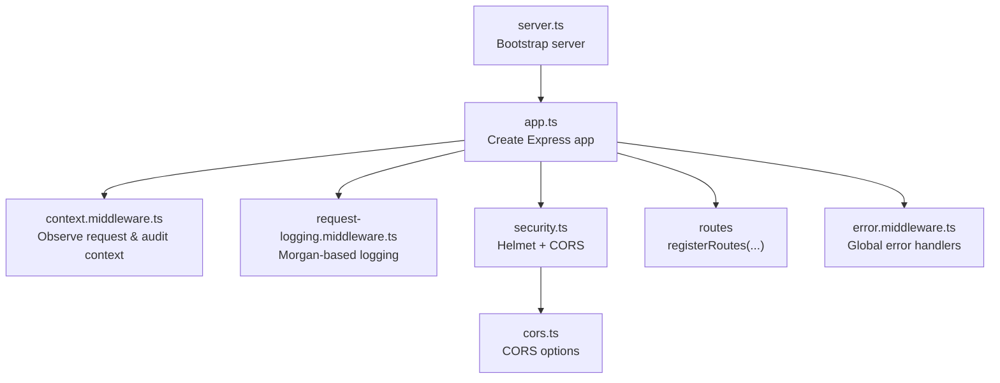
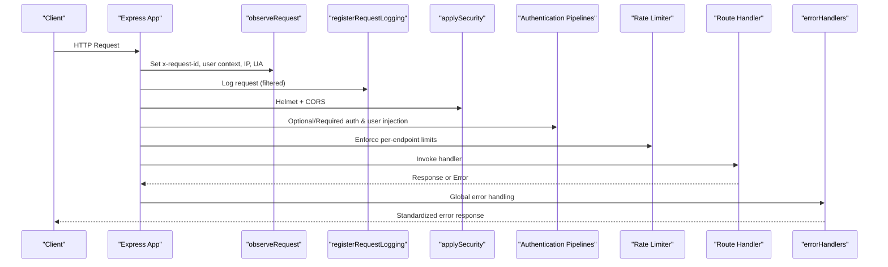
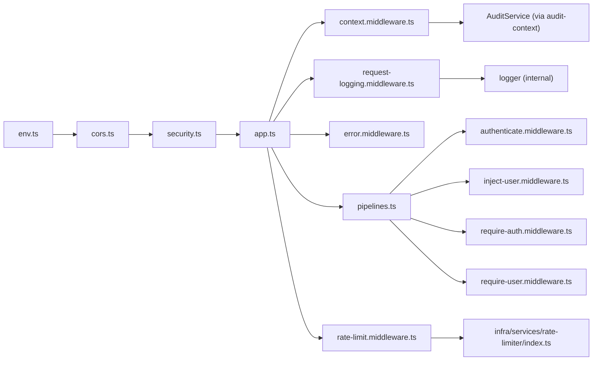

# Security Middleware

<cite>
**Referenced Files in This Document**
- [security.ts](file://server/src/config/security.ts)
- [cors.ts](file://server/src/config/cors.ts)
- [env.ts](file://server/src/config/env.ts)
- [app.ts](file://server/src/app.ts)
- [server.ts](file://server/src/server.ts)
- [context.middleware.ts](file://server/src/core/middlewares/context.middleware.ts)
- [request-logging.middleware.ts](file://server/src/core/middlewares/request-logging.middleware.ts)
- [rate-limit.middleware.ts](file://server/src/core/middlewares/rate-limit.middleware.ts)
- [pipelines.ts](file://server/src/core/middlewares/pipelines.ts)
- [authenticate.middleware.ts](file://server/src/core/middlewares/auth/authenticate.middleware.ts)
- [inject-user.middleware.ts](file://server/src/core/middlewares/auth/inject-user.middleware.ts)
- [require-auth.middleware.ts](file://server/src/core/middlewares/auth/require-auth.middleware.ts)
- [require-user.middleware.ts](file://server/src/core/middlewares/auth/require-user.middleware.ts)
- [error.middleware.ts](file://server/src/core/middlewares/error/error.middleware.ts)
- [index.ts](file://server/src/infra/services/rate-limiter/index.ts)
</cite>

## Table of Contents
1. [Introduction](#introduction)
2. [Project Structure](#project-structure)
3. [Core Components](#core-components)
4. [Architecture Overview](#architecture-overview)
5. [Detailed Component Analysis](#detailed-component-analysis)
6. [Dependency Analysis](#dependency-analysis)
7. [Performance Considerations](#performance-considerations)
8. [Troubleshooting Guide](#troubleshooting-guide)
9. [Conclusion](#conclusion)

## Introduction
This document describes the security middleware stack for the Flick platform backend. It covers authentication middleware for session validation, rate limiting for API protection, request logging for security monitoring, and CORS configuration. It also documents Helmet integration for security headers, XSS protection, and content security policies. The request pipeline, middleware ordering, error handling, and security validation steps are explained, along with rate limiting strategies, logging formats, and operational guidance.

## Project Structure
The security middleware is configured and applied during application bootstrap. The Express app initializes request context, request logging, security headers/CORS, route registration, and global error handlers.

**Diagram sources**
- [server.ts](file://server/src/server.ts#L1-L22)
- [app.ts](file://server/src/app.ts#L1-L33)
- [context.middleware.ts](file://server/src/core/middlewares/context.middleware.ts#L28-L58)
- [request-logging.middleware.ts](file://server/src/core/middlewares/request-logging.middleware.ts#L22-L39)
- [security.ts](file://server/src/config/security.ts#L6-L11)
- [cors.ts](file://server/src/config/cors.ts#L4-L10)
- [error.middleware.ts](file://server/src/core/middlewares/error/error.middleware.ts#L9-L78)

**Section sources**
- [server.ts](file://server/src/server.ts#L6-L16)
- [app.ts](file://server/src/app.ts#L10-L30)

## Core Components
- Helmet and CORS: Applied globally to secure headers and configure cross-origin allowances.
- Request context and audit: Establishes request ID, user identity, IP, and audit buffer flushing.
- Request logging: Structured HTTP logs via Morgan, filtered for health endpoints and HEAD requests.
- Authentication pipeline: Optional session injection, optional user injection, and enforcement of auth/user requirements.
- Rate limiting: Predefined limiters for authentication and general API endpoints.
- Global error handling: Unified error responses and structured logging.

**Section sources**
- [security.ts](file://server/src/config/security.ts#L6-L11)
- [cors.ts](file://server/src/config/cors.ts#L4-L10)
- [context.middleware.ts](file://server/src/core/middlewares/context.middleware.ts#L28-L58)
- [request-logging.middleware.ts](file://server/src/core/middlewares/request-logging.middleware.ts#L22-L39)
- [pipelines.ts](file://server/src/core/middlewares/pipelines.ts#L8-L36)
- [rate-limit.middleware.ts](file://server/src/core/middlewares/rate-limit.middleware.ts#L3-L6)
- [error.middleware.ts](file://server/src/core/middlewares/error/error.middleware.ts#L9-L78)

## Architecture Overview
The middleware stack is ordered to establish context early, log requests, apply security headers/CORS, enforce authentication and RBAC, and finally handle errors. Routes can opt-in to rate limiting and authentication pipelines.

**Diagram sources**
- [app.ts](file://server/src/app.ts#L20-L27)
- [context.middleware.ts](file://server/src/core/middlewares/context.middleware.ts#L28-L58)
- [request-logging.middleware.ts](file://server/src/core/middlewares/request-logging.middleware.ts#L22-L39)
- [security.ts](file://server/src/config/security.ts#L6-L11)
- [pipelines.ts](file://server/src/core/middlewares/pipelines.ts#L8-L36)
- [rate-limit.middleware.ts](file://server/src/core/middlewares/rate-limit.middleware.ts#L3-L6)
- [error.middleware.ts](file://server/src/core/middlewares/error/error.middleware.ts#L9-L78)

## Detailed Component Analysis

### Helmet and CORS
- Helmet is applied globally to set secure headers, including disabling X-Powered-By and enabling strict transport security defaults.
- CORS is configured with origins from environment, credentials support, allowed methods, and allowed headers. Options success status is standardized.

Configuration highlights:
- Origins: Controlled via environment variable.
- Credentials: Enabled for authenticated flows.
- Methods: Standard CRUD plus OPTIONS.
- Allowed headers: Content-Type and Authorization.
- Options success status: 200.

**Section sources**
- [security.ts](file://server/src/config/security.ts#L6-L11)
- [cors.ts](file://server/src/config/cors.ts#L4-L10)
- [env.ts](file://server/src/config/env.ts)

### Request Context and Audit
- Generates a request ID if not present, sets user identity, role, IP (via forwarded header), and user agent.
- Stores context in a structured store and flushes audit events on response finish.
- Ensures x-request-id is returned on responses.

Key behaviors:
- Request ID propagation.
- IP resolution via proxy-aware headers.
- Audit buffer write on completion.

**Section sources**
- [context.middleware.ts](file://server/src/core/middlewares/context.middleware.ts#L28-L58)

### Request Logging
- Uses Morgan to emit structured HTTP logs as JSON.
- Tokens include request ID, remote IP, method, URL, status, and response time.
- Skips logging for health endpoints and HEAD requests.

Logging format:
- Fields: requestId, ip, method, url, status, responseTimeMs.
- Stream writes to internal logger.http.

Filtering:
- Excludes HEAD requests.
- Excludes /api/... paths ending with /healthz or /readyz.

**Section sources**
- [request-logging.middleware.ts](file://server/src/core/middlewares/request-logging.middleware.ts#L22-L39)

### Authentication Middleware
- Optional authentication: Extracts session from headers, populates req.session and req.auth when present.
- Inject user: Loads current user into req.user if available.
- Require auth: Throws unauthorized if no session.
- Require user: Throws not found if user not present.

Pipelines:
- identity: Optional session injection.
- authenticated: Requires session.
- withRequiredUserContext: Requires session and user existence.
- withOptionalUserContext: Injects user if session exists.
- checkUserContext: Validates session and user presence.
- adminOnly: Requires session and admin role.

**Section sources**
- [authenticate.middleware.ts](file://server/src/core/middlewares/auth/authenticate.middleware.ts#L8-L20)
- [inject-user.middleware.ts](file://server/src/core/middlewares/auth/inject-user.middleware.ts#L5-L18)
- [require-auth.middleware.ts](file://server/src/core/middlewares/auth/require-auth.middleware.ts#L4-L10)
- [require-user.middleware.ts](file://server/src/core/middlewares/auth/require-user.middleware.ts#L4-L9)
- [pipelines.ts](file://server/src/core/middlewares/pipelines.ts#L8-L36)

### Rate Limiting
- Provides two named limiters: auth and api.
- Exposed via a middleware factory that binds limiters to endpoints.
- Strategy: IP-based and user-based limits are supported by the underlying limiter module; the factory exposes preconfigured instances.

Usage pattern:
- Import ensureRatelimit and bind to routes requiring protection.

**Section sources**
- [rate-limit.middleware.ts](file://server/src/core/middlewares/rate-limit.middleware.ts#L3-L6)
- [index.ts](file://server/src/infra/services/rate-limiter/index.ts#L1-L2)

### Global Error Handling
- notFound: Detects missing routes and throws a not-found error.
- general: Handles Zod errors, HttpError instances, and unhandled exceptions; logs warnings/errors; returns standardized JSON responses; includes stack traces only in development.

Response fields:
- message, statusCode, errors, code, meta (with stack in development).

**Section sources**
- [error.middleware.ts](file://server/src/core/middlewares/error/error.middleware.ts#L9-L78)

## Dependency Analysis
The middleware stack depends on:
- Environment-driven CORS configuration.
- Better Auth for session retrieval.
- Audit service for event persistence.
- Rate limiter module for throttling logic.

**Diagram sources**
- [env.ts](file://server/src/config/env.ts)
- [cors.ts](file://server/src/config/cors.ts#L4-L10)
- [security.ts](file://server/src/config/security.ts#L6-L11)
- [app.ts](file://server/src/app.ts#L1-L33)
- [context.middleware.ts](file://server/src/core/middlewares/context.middleware.ts#L1-L26)
- [request-logging.middleware.ts](file://server/src/core/middlewares/request-logging.middleware.ts#L1-L40)
- [error.middleware.ts](file://server/src/core/middlewares/error/error.middleware.ts#L1-L82)
- [pipelines.ts](file://server/src/core/middlewares/pipelines.ts#L1-L37)
- [authenticate.middleware.ts](file://server/src/core/middlewares/auth/authenticate.middleware.ts#L1-L21)
- [inject-user.middleware.ts](file://server/src/core/middlewares/auth/inject-user.middleware.ts#L1-L20)
- [require-auth.middleware.ts](file://server/src/core/middlewares/auth/require-auth.middleware.ts#L1-L12)
- [require-user.middleware.ts](file://server/src/core/middlewares/auth/require-user.middleware.ts#L1-L12)
- [rate-limit.middleware.ts](file://server/src/core/middlewares/rate-limit.middleware.ts#L1-L9)
- [index.ts](file://server/src/infra/services/rate-limiter/index.ts#L1-L2)

**Section sources**
- [app.ts](file://server/src/app.ts#L1-L33)
- [pipelines.ts](file://server/src/core/middlewares/pipelines.ts#L1-L37)

## Performance Considerations
- Request context and audit buffering: Minimal overhead; ensure audit buffer flush does not block response finish.
- Logging: Structured JSON emission is efficient; filtering reduces noise for health endpoints.
- Helmet: One-time header configuration per request.
- CORS: Static configuration loaded once; keep origins minimal to reduce preflight overhead.
- Rate limiting: Offload heavy computations to Redis or in-memory stores; tune burst and refill windows per endpoint.
- Authentication: Session retrieval via Better Auth; cache user lookups to avoid repeated database calls.

[No sources needed since this section provides general guidance]

## Troubleshooting Guide
Common issues and resolutions:
- CORS failures:
  - Verify origins list and credentials flag match client configuration.
  - Confirm allowed methods and headers align with client requests.
- Unauthorized or missing user:
  - Ensure cookies or Authorization headers are forwarded properly behind proxies.
  - Confirm authentication pipeline is applied before protected routes.
- Health endpoint flooding:
  - Requests to /healthz and /readyz are intentionally skipped; confirm path and method.
- Unexpected 429 responses:
  - Review rate limiter configuration and endpoint binding.
  - Check whether IP or user-based keys are causing collisions.
- Audit logs not appearing:
  - Confirm audit buffer flush occurs on response finish and AuditService is reachable.

**Section sources**
- [cors.ts](file://server/src/config/cors.ts#L4-L10)
- [request-logging.middleware.ts](file://server/src/core/middlewares/request-logging.middleware.ts#L34-L38)
- [rate-limit.middleware.ts](file://server/src/core/middlewares/rate-limit.middleware.ts#L3-L6)
- [context.middleware.ts](file://server/src/core/middlewares/context.middleware.ts#L50-L54)

## Conclusion
The Flick platform applies a layered security middleware stack: Helmet and CORS for transport-level protections, request context and audit for observability, structured request logging for monitoring, robust authentication pipelines for session validation, and rate limiting for API protection. The middleware order ensures context precedes logging, security headers precede routing, and errors are handled consistently. Proper configuration of environment variables and careful tuning of rate limits and audit flushing will maintain both security and performance.