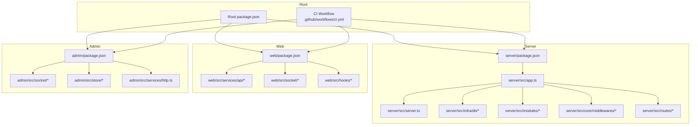
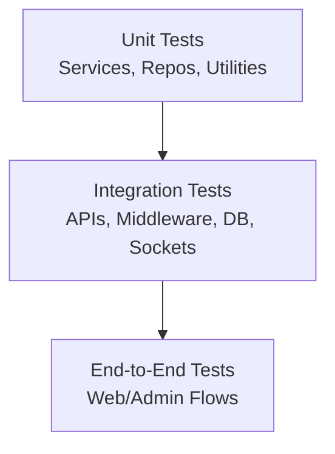
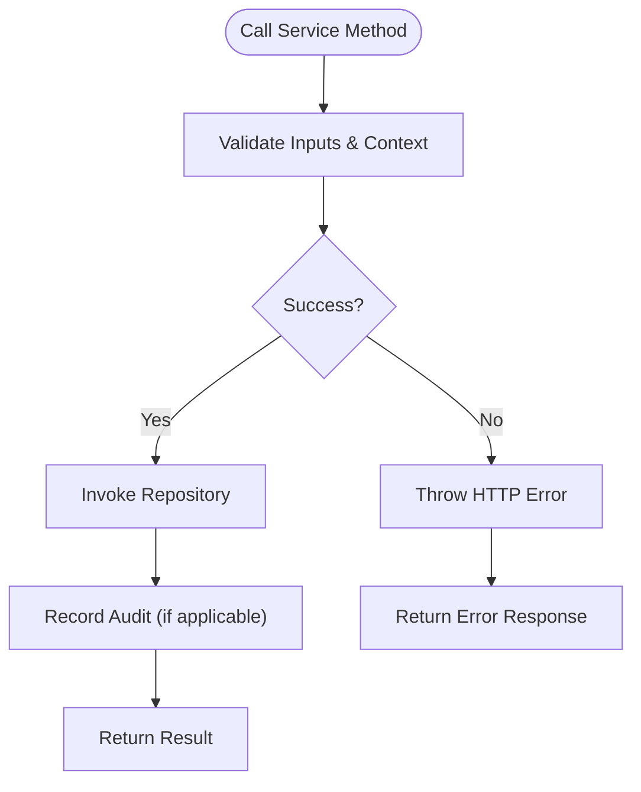
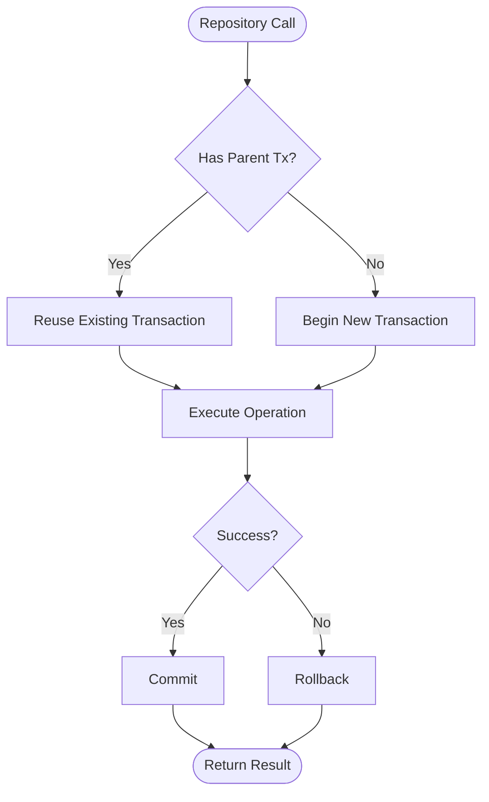
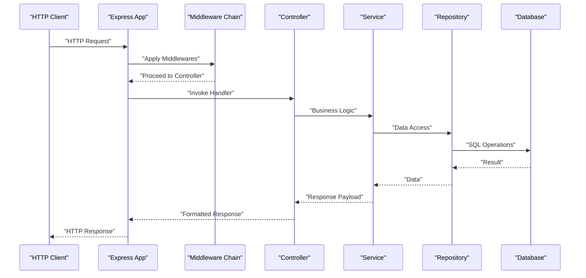
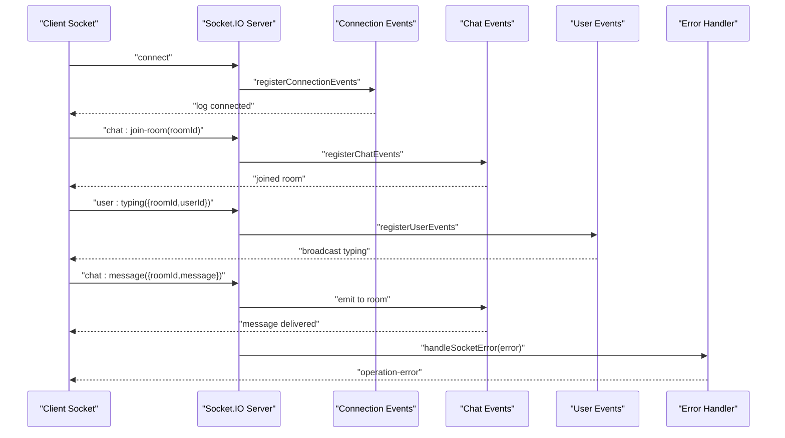
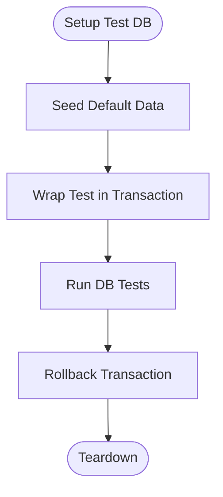
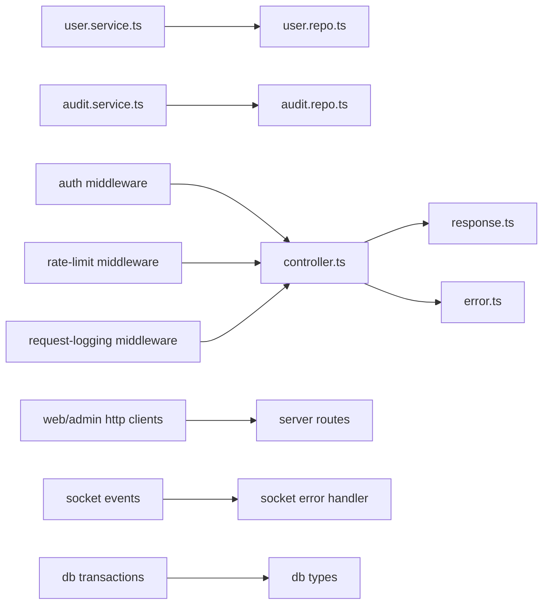

# Testing Strategy

<cite>
**Referenced Files in This Document**
- [ci.yml](file://.github/workflows/ci.yml)
- [package.json](file://package.json)
- [server/package.json](file://server/package.json)
- [web/package.json](file://web/package.json)
- [admin/package.json](file://admin/package.json)
- [server/src/infra/db/transactions.ts](file://server/src/infra/db/transactions.ts)
- [server/src/infra/db/types.ts](file://server/src/infra/db/types.ts)
- [server/scripts/seed.ts](file://server/scripts/seed.ts)
- [server/src/infra/services/socket/events/connection.events.ts](file://server/src/infra/services/socket/events/connection.events.ts)
- [server/src/infra/services/socket/events/chat.events.ts](file://server/src/infra/services/socket/events/chat.events.ts)
- [server/src/infra/services/socket/events/user.events.ts](file://server/src/infra/services/socket/events/user.events.ts)
- [server/src/infra/services/socket/errors/handleSocketError.ts](file://server/src/infra/services/socket/errors/handleSocketError.ts)
- [server/src/infra/services/socket/types/SocketEvents.ts](file://server/src/infra/services/socket/types/SocketEvents.ts)
- [server/src/modules/user/user.service.ts](file://server/src/modules/user/user.service.ts)
- [server/src/modules/audit/audit.service.ts](file://server/src/modules/audit/audit.service.ts)
- [server/src/modules/audit/audit.repo.ts](file://server/src/modules/audit/audit.repo.ts)
- [server/src/core/http/controller.ts](file://server/src/core/http/controller.ts)
- [server/src/core/http/error.ts](file://server/src/core/http/error.ts)
- [server/src/core/http/response.ts](file://server/src/core/http/response.ts)
- [server/src/core/middlewares/auth/index.ts](file://server/src/core/middlewares/auth/index.ts)
- [server/src/core/middlewares/rate-limit.middleware.ts](file://server/src/core/middlewares/rate-limit.middleware.ts)
- [server/src/core/middlewares/request-logging.middleware.ts](file://server/src/core/middlewares/request-logging.middleware.ts)
- [server/src/routes/health.routes.ts](file://server/src/routes/health.routes.ts)
- [server/src/app.ts](file://server/src/app.ts)
- [server/src/server.ts](file://server/src/server.ts)
- [web/src/services/api/app.ts](file://web/src/services/api/app.ts)
- [web/src/services/api/auth.ts](file://web/src/services/api/auth.ts)
- [web/src/services/api/post.ts](file://web/src/services/api/post.ts)
- [web/src/services/api/comment.ts](file://web/src/services/api/comment.ts)
- [web/src/services/api/user.ts](file://web/src/services/api/user.ts)
- [web/src/services/api/bookmark.ts](file://web/src/services/api/bookmark.ts)
- [web/src/services/api/notification.ts](file://web/src/services/api/notification.ts)
- [web/src/services/api/vote.ts](file://web/src/services/api/vote.ts)
- [web/src/services/api/feedback.ts](file://web/src/services/api/feedback.ts)
- [web/src/services/api/report.ts](file://web/src/services/api/report.ts)
- [web/src/services/api/ocr.ts](file://web/src/services/api/ocr.ts)
- [web/src/socket/useSocket.ts](file://web/src/socket/useSocket.ts)
- [web/src/hooks/useNotificationSocket.tsx](file://web/src/hooks/useNotificationSocket.tsx)
- [admin/src/socket/useSocket.ts](file://admin/src/socket/useSocket.ts)
- [admin/src/store/socketStore.ts](file://admin/src/store/socketStore.ts)
- [admin/src/services/http.ts](file://admin/src/services/http.ts)
- [web/src/services/http.ts](file://web/src/services/http.ts)
- [admin/src/services/http.ts](file://admin/src/services/http.ts)
- [server/src/shared/constants/db.ts](file://server/src/shared/constants/db.ts)
- [server/docs/swagger.ts](file://server/docs/swagger.ts)
- [server/src/lib/should-sample-log.ts](file://server/src/lib/should-sample-log.ts)
</cite>

## Table of Contents
1. [Introduction](#introduction)
2. [Project Structure](#project-structure)
3. [Core Components](#core-components)
4. [Architecture Overview](#architecture-overview)
5. [Detailed Component Analysis](#detailed-component-analysis)
6. [Dependency Analysis](#dependency-analysis)
7. [Performance Considerations](#performance-considerations)
8. [Troubleshooting Guide](#troubleshooting-guide)
9. [Conclusion](#conclusion)
10. [Appendices](#appendices)

## Introduction
This document defines a comprehensive testing strategy for the Flick platform. It outlines the testing pyramid across unit, integration, and end-to-end layers; details frameworks, mocking, and test data management; and prescribes approaches for service-layer, repository, and API endpoint testing. It also covers database testing, transaction rollback, test environments, real-time communication testing via WebSockets, performance testing, coverage expectations, CI testing, and automated quality gates. Guidance is provided for writing effective tests, organizing test suites, and debugging failures.

## Project Structure
The Flick platform is a monorepo with three primary packages:
- server: Express-based backend with modules, repositories, middleware, and database integration
- web: Next.js frontend with API clients and real-time socket integrations
- admin: Vite-based admin panel with API clients and real-time socket integrations

Key testing-relevant scripts and configuration:
- Root and package-level scripts orchestrate development, building, linting, and testing across workspaces
- server exposes database lifecycle scripts (migrate, generate, check) and seeding utilities
- CI workflow currently triggers on push events but requires explicit steps to be defined

**Diagram sources**
- [package.json](file://package.json#L7-L12)
- [.github/workflows/ci.yml](file://.github/workflows/ci.yml#L1-L4)
- [server/package.json](file://server/package.json#L7-L22)
- [web/package.json](file://web/package.json#L5-L11)
- [admin/package.json](file://admin/package.json#L6-L10)

**Section sources**
- [package.json](file://package.json#L7-L12)
- [.github/workflows/ci.yml](file://.github/workflows/ci.yml#L1-L4)
- [server/package.json](file://server/package.json#L7-L22)
- [web/package.json](file://web/package.json#L5-L11)
- [admin/package.json](file://admin/package.json#L6-L10)

## Core Components
This section identifies the core testing surfaces across packages and their responsibilities.

- Service Layer Testing
  - Validate business logic, error propagation, and audit recording
  - Example: user profile retrieval and acceptance of terms
  - Reference: [server/src/modules/user/user.service.ts](file://server/src/modules/user/user.service.ts#L7-L58)

- Repository Testing
  - Validate data access patterns and caching semantics
  - Example: audit log creation via repository facade
  - Reference: [server/src/modules/audit/audit.repo.ts](file://server/src/modules/audit/audit.repo.ts#L1-L9)

- API Endpoint Testing
  - Validate HTTP controllers, error handling, and response formatting
  - Reference: [server/src/core/http/controller.ts](file://server/src/core/http/controller.ts), [server/src/core/http/error.ts](file://server/src/core/http/error.ts), [server/src/core/http/response.ts](file://server/src/core/http/response.ts)

- Middleware Testing
  - Validate authentication, rate limiting, and request logging
  - Reference: [server/src/core/middlewares/auth/index.ts](file://server/src/core/middlewares/auth/index.ts), [server/src/core/middlewares/rate-limit.middleware.ts](file://server/src/core/middlewares/rate-limit.middleware.ts), [server/src/core/middlewares/request-logging.middleware.ts](file://server/src/core/middlewares/request-logging.middleware.ts)

- Real-Time Communication Testing
  - Validate socket connection lifecycle, room joining, typing indicators, and chat messaging
  - Reference: [server/src/infra/services/socket/events/connection.events.ts](file://server/src/infra/services/socket/events/connection.events.ts#L1-L20), [server/src/infra/services/socket/events/user.events.ts](file://server/src/infra/services/socket/events/user.events.ts#L1-L9), [server/src/infra/services/socket/events/chat.events.ts](file://server/src/infra/services/socket/events/chat.events.ts#L1-L26), [server/src/infra/services/socket/errors/handleSocketError.ts](file://server/src/infra/services/socket/errors/handleSocketError.ts#L1-L22), [server/src/infra/services/socket/types/SocketEvents.ts](file://server/src/infra/services/socket/types/SocketEvents.ts#L1-L3)

- Database Testing and Transactions
  - Validate transaction boundaries and nested transaction reuse
  - Reference: [server/src/infra/db/transactions.ts](file://server/src/infra/db/transactions.ts#L1-L19), [server/src/infra/db/types.ts](file://server/src/infra/db/types.ts#L1-L10)

- Test Data Management
  - Seed default users and manage test fixtures
  - Reference: [server/scripts/seed.ts](file://server/scripts/seed.ts#L1-L38)

- Frontend API Clients and Socket Integrations
  - Validate API client behavior and socket hooks
  - Reference: [web/src/services/api/app.ts](file://web/src/services/api/app.ts), [web/src/services/api/auth.ts](file://web/src/services/api/auth.ts), [web/src/services/api/post.ts](file://web/src/services/api/post.ts), [web/src/services/api/comment.ts](file://web/src/services/api/comment.ts), [web/src/services/api/user.ts](file://web/src/services/api/user.ts), [web/src/services/api/bookmark.ts](file://web/src/services/api/bookmark.ts), [web/src/services/api/notification.ts](file://web/src/services/api/notification.ts), [web/src/services/api/vote.ts](file://web/src/services/api/vote.ts), [web/src/services/api/feedback.ts](file://web/src/services/api/feedback.ts), [web/src/services/api/report.ts](file://web/src/services/api/report.ts), [web/src/services/api/ocr.ts](file://web/src/services/api/ocr.ts), [web/src/socket/useSocket.ts](file://web/src/socket/useSocket.ts), [web/src/hooks/useNotificationSocket.tsx](file://web/src/hooks/useNotificationSocket.tsx), [admin/src/socket/useSocket.ts](file://admin/src/socket/useSocket.ts), [admin/src/store/socketStore.ts](file://admin/src/store/socketStore.ts), [admin/src/services/http.ts](file://admin/src/services/http.ts), [web/src/services/http.ts](file://web/src/services/http.ts)

**Section sources**
- [server/src/modules/user/user.service.ts](file://server/src/modules/user/user.service.ts#L7-L58)
- [server/src/modules/audit/audit.repo.ts](file://server/src/modules/audit/audit.repo.ts#L1-L9)
- [server/src/core/http/controller.ts](file://server/src/core/http/controller.ts)
- [server/src/core/http/error.ts](file://server/src/core/http/error.ts)
- [server/src/core/http/response.ts](file://server/src/core/http/response.ts)
- [server/src/core/middlewares/auth/index.ts](file://server/src/core/middlewares/auth/index.ts)
- [server/src/core/middlewares/rate-limit.middleware.ts](file://server/src/core/middlewares/rate-limit.middleware.ts)
- [server/src/core/middlewares/request-logging.middleware.ts](file://server/src/core/middlewares/request-logging.middleware.ts)
- [server/src/infra/services/socket/events/connection.events.ts](file://server/src/infra/services/socket/events/connection.events.ts#L1-L20)
- [server/src/infra/services/socket/events/user.events.ts](file://server/src/infra/services/socket/events/user.events.ts#L1-L9)
- [server/src/infra/services/socket/events/chat.events.ts](file://server/src/infra/services/socket/events/chat.events.ts#L1-L26)
- [server/src/infra/services/socket/errors/handleSocketError.ts](file://server/src/infra/services/socket/errors/handleSocketError.ts#L1-L22)
- [server/src/infra/services/socket/types/SocketEvents.ts](file://server/src/infra/services/socket/types/SocketEvents.ts#L1-L3)
- [server/src/infra/db/transactions.ts](file://server/src/infra/db/transactions.ts#L1-L19)
- [server/src/infra/db/types.ts](file://server/src/infra/db/types.ts#L1-L10)
- [server/scripts/seed.ts](file://server/scripts/seed.ts#L1-L38)
- [web/src/services/api/app.ts](file://web/src/services/api/app.ts)
- [web/src/services/api/auth.ts](file://web/src/services/api/auth.ts)
- [web/src/services/api/post.ts](file://web/src/services/api/post.ts)
- [web/src/services/api/comment.ts](file://web/src/services/api/comment.ts)
- [web/src/services/api/user.ts](file://web/src/services/api/user.ts)
- [web/src/services/api/bookmark.ts](file://web/src/services/api/bookmark.ts)
- [web/src/services/api/notification.ts](file://web/src/services/api/notification.ts)
- [web/src/services/api/vote.ts](file://web/src/services/api/vote.ts)
- [web/src/services/api/feedback.ts](file://web/src/services/api/feedback.ts)
- [web/src/services/api/report.ts](file://web/src/services/api/report.ts)
- [web/src/services/api/ocr.ts](file://web/src/services/api/ocr.ts)
- [web/src/socket/useSocket.ts](file://web/src/socket/useSocket.ts)
- [web/src/hooks/useNotificationSocket.tsx](file://web/src/hooks/useNotificationSocket.tsx)
- [admin/src/socket/useSocket.ts](file://admin/src/socket/useSocket.ts)
- [admin/src/store/socketStore.ts](file://admin/src/store/socketStore.ts)
- [admin/src/services/http.ts](file://admin/src/services/http.ts)
- [web/src/services/http.ts](file://web/src/services/http.ts)

## Architecture Overview
The testing architecture aligns with a layered pyramid:
- Unit Tests: Service-layer logic, repository facades, and small isolated units
- Integration Tests: API endpoints, middleware, database transactions, and socket events
- End-to-End Tests: Full user journeys across web/admin frontends and backend APIs

[No sources needed since this diagram shows conceptual workflow, not actual code structure]

## Detailed Component Analysis

### Service Layer Testing
Approach:
- Mock repository dependencies and external services
- Validate success paths, error conditions, and audit writes
- Use deterministic inputs and assert side effects (e.g., audit records)

Examples to test:
- User service: profile retrieval by ID, user search, accept terms
  - Reference: [server/src/modules/user/user.service.ts](file://server/src/modules/user/user.service.ts#L7-L58)
- Audit service: write log via repository
  - Reference: [server/src/modules/audit/audit.service.ts](file://server/src/modules/audit/audit.service.ts#L1-L10), [server/src/modules/audit/audit.repo.ts](file://server/src/modules/audit/audit.repo.ts#L1-L9)

**Diagram sources**
- [server/src/modules/user/user.service.ts](file://server/src/modules/user/user.service.ts#L7-L58)
- [server/src/modules/audit/audit.service.ts](file://server/src/modules/audit/audit.service.ts#L1-L10)
- [server/src/modules/audit/audit.repo.ts](file://server/src/modules/audit/audit.repo.ts#L1-L9)

**Section sources**
- [server/src/modules/user/user.service.ts](file://server/src/modules/user/user.service.ts#L7-L58)
- [server/src/modules/audit/audit.service.ts](file://server/src/modules/audit/audit.service.ts#L1-L10)
- [server/src/modules/audit/audit.repo.ts](file://server/src/modules/audit/audit.repo.ts#L1-L9)

### Repository Testing
Approach:
- Wrap repository calls in controlled transactions
- Validate CRUD operations and caching behavior
- Assert correct SQL generation and parameter binding

References:
- [server/src/infra/db/transactions.ts](file://server/src/infra/db/transactions.ts#L1-L19)
- [server/src/infra/db/types.ts](file://server/src/infra/db/types.ts#L1-L10)

**Diagram sources**
- [server/src/infra/db/transactions.ts](file://server/src/infra/db/transactions.ts#L1-L19)
- [server/src/infra/db/types.ts](file://server/src/infra/db/types.ts#L1-L10)

**Section sources**
- [server/src/infra/db/transactions.ts](file://server/src/infra/db/transactions.ts#L1-L19)
- [server/src/infra/db/types.ts](file://server/src/infra/db/types.ts#L1-L10)

### API Endpoint Testing
Approach:
- Test controller flows: request parsing, middleware chain, handler logic, and response formatting
- Validate error handling and HTTP status codes
- Use lightweight server instances for isolated tests

References:
- [server/src/core/http/controller.ts](file://server/src/core/http/controller.ts)
- [server/src/core/http/error.ts](file://server/src/core/http/error.ts)
- [server/src/core/http/response.ts](file://server/src/core/http/response.ts)
- [server/src/core/middlewares/auth/index.ts](file://server/src/core/middlewares/auth/index.ts)
- [server/src/core/middlewares/rate-limit.middleware.ts](file://server/src/core/middlewares/rate-limit.middleware.ts)
- [server/src/core/middlewares/request-logging.middleware.ts](file://server/src/core/middlewares/request-logging.middleware.ts)
- [server/src/routes/health.routes.ts](file://server/src/routes/health.routes.ts)
- [server/src/app.ts](file://server/src/app.ts)
- [server/src/server.ts](file://server/src/server.ts)

**Diagram sources**
- [server/src/core/http/controller.ts](file://server/src/core/http/controller.ts)
- [server/src/core/http/error.ts](file://server/src/core/http/error.ts)
- [server/src/core/http/response.ts](file://server/src/core/http/response.ts)
- [server/src/core/middlewares/auth/index.ts](file://server/src/core/middlewares/auth/index.ts)
- [server/src/core/middlewares/rate-limit.middleware.ts](file://server/src/core/middlewares/rate-limit.middleware.ts)
- [server/src/core/middlewares/request-logging.middleware.ts](file://server/src/core/middlewares/request-logging.middleware.ts)
- [server/src/routes/health.routes.ts](file://server/src/routes/health.routes.ts)
- [server/src/app.ts](file://server/src/app.ts)
- [server/src/server.ts](file://server/src/server.ts)

**Section sources**
- [server/src/core/http/controller.ts](file://server/src/core/http/controller.ts)
- [server/src/core/http/error.ts](file://server/src/core/http/error.ts)
- [server/src/core/http/response.ts](file://server/src/core/http/response.ts)
- [server/src/core/middlewares/auth/index.ts](file://server/src/core/middlewares/auth/index.ts)
- [server/src/core/middlewares/rate-limit.middleware.ts](file://server/src/core/middlewares/rate-limit.middleware.ts)
- [server/src/core/middlewares/request-logging.middleware.ts](file://server/src/core/middlewares/request-logging.middleware.ts)
- [server/src/routes/health.routes.ts](file://server/src/routes/health.routes.ts)
- [server/src/app.ts](file://server/src/app.ts)
- [server/src/server.ts](file://server/src/server.ts)

### Real-Time Communication Testing (WebSockets)
Approach:
- Validate connection lifecycle, room join, typing events, and chat messages
- Assert emitted events and error emission on exceptions
- Use socket.io server-side event registration and error handlers

References:
- [server/src/infra/services/socket/events/connection.events.ts](file://server/src/infra/services/socket/events/connection.events.ts#L1-L20)
- [server/src/infra/services/socket/events/user.events.ts](file://server/src/infra/services/socket/events/user.events.ts#L1-L9)
- [server/src/infra/services/socket/events/chat.events.ts](file://server/src/infra/services/socket/events/chat.events.ts#L1-L26)
- [server/src/infra/services/socket/errors/handleSocketError.ts](file://server/src/infra/services/socket/errors/handleSocketError.ts#L1-L22)
- [server/src/infra/services/socket/types/SocketEvents.ts](file://server/src/infra/services/socket/types/SocketEvents.ts#L1-L3)

**Diagram sources**
- [server/src/infra/services/socket/events/connection.events.ts](file://server/src/infra/services/socket/events/connection.events.ts#L1-L20)
- [server/src/infra/services/socket/events/user.events.ts](file://server/src/infra/services/socket/events/user.events.ts#L1-L9)
- [server/src/infra/services/socket/events/chat.events.ts](file://server/src/infra/services/socket/events/chat.events.ts#L1-L26)
- [server/src/infra/services/socket/errors/handleSocketError.ts](file://server/src/infra/services/socket/errors/handleSocketError.ts#L1-L22)
- [server/src/infra/services/socket/types/SocketEvents.ts](file://server/src/infra/services/socket/types/SocketEvents.ts#L1-L3)

**Section sources**
- [server/src/infra/services/socket/events/connection.events.ts](file://server/src/infra/services/socket/events/connection.events.ts#L1-L20)
- [server/src/infra/services/socket/events/user.events.ts](file://server/src/infra/services/socket/events/user.events.ts#L1-L9)
- [server/src/infra/services/socket/events/chat.events.ts](file://server/src/infra/services/socket/events/chat.events.ts#L1-L26)
- [server/src/infra/services/socket/errors/handleSocketError.ts](file://server/src/infra/services/socket/errors/handleSocketError.ts#L1-L22)
- [server/src/infra/services/socket/types/SocketEvents.ts](file://server/src/infra/services/socket/types/SocketEvents.ts#L1-L3)

### Database Testing Strategies and Transaction Rollback
Approach:
- Use transaction wrappers to isolate tests and enable rollback
- Seed test data via scripts and clean up after runs
- Validate transaction reuse in nested contexts

References:
- [server/src/infra/db/transactions.ts](file://server/src/infra/db/transactions.ts#L1-L19)
- [server/src/infra/db/types.ts](file://server/src/infra/db/types.ts#L1-L10)
- [server/scripts/seed.ts](file://server/scripts/seed.ts#L1-L38)
- [server/src/shared/constants/db.ts](file://server/src/shared/constants/db.ts#L1-L1)

**Diagram sources**
- [server/src/infra/db/transactions.ts](file://server/src/infra/db/transactions.ts#L1-L19)
- [server/src/infra/db/types.ts](file://server/src/infra/db/types.ts#L1-L10)
- [server/scripts/seed.ts](file://server/scripts/seed.ts#L1-L38)
- [server/src/shared/constants/db.ts](file://server/src/shared/constants/db.ts#L1-L1)

**Section sources**
- [server/src/infra/db/transactions.ts](file://server/src/infra/db/transactions.ts#L1-L19)
- [server/src/infra/db/types.ts](file://server/src/infra/db/types.ts#L1-L10)
- [server/scripts/seed.ts](file://server/scripts/seed.ts#L1-L38)
- [server/src/shared/constants/db.ts](file://server/src/shared/constants/db.ts#L1-L1)

### Test Environment Setup
Approach:
- Use database migration scripts and docker compose for local environments
- Configure environment variables per package
- Ensure CI uses isolated databases and seeds for reproducibility

References:
- [server/package.json](file://server/package.json#L15-L19)
- [server/package.json](file://server/package.json#L7-L22)

**Section sources**
- [server/package.json](file://server/package.json#L15-L19)
- [server/package.json](file://server/package.json#L7-L22)

### API Client Testing (Frontend)
Approach:
- Mock HTTP clients and interceptors to simulate network conditions
- Validate request payloads, headers, and response parsing
- Test error handling and retry logic

References:
- [web/src/services/api/app.ts](file://web/src/services/api/app.ts)
- [web/src/services/api/auth.ts](file://web/src/services/api/auth.ts)
- [web/src/services/api/post.ts](file://web/src/services/api/post.ts)
- [web/src/services/api/comment.ts](file://web/src/services/api/comment.ts)
- [web/src/services/api/user.ts](file://web/src/services/api/user.ts)
- [web/src/services/api/bookmark.ts](file://web/src/services/api/bookmark.ts)
- [web/src/services/api/notification.ts](file://web/src/services/api/notification.ts)
- [web/src/services/api/vote.ts](file://web/src/services/api/vote.ts)
- [web/src/services/api/feedback.ts](file://web/src/services/api/feedback.ts)
- [web/src/services/api/report.ts](file://web/src/services/api/report.ts)
- [web/src/services/api/ocr.ts](file://web/src/services/api/ocr.ts)
- [web/src/services/http.ts](file://web/src/services/http.ts)
- [admin/src/services/http.ts](file://admin/src/services/http.ts)

**Section sources**
- [web/src/services/api/app.ts](file://web/src/services/api/app.ts)
- [web/src/services/api/auth.ts](file://web/src/services/api/auth.ts)
- [web/src/services/api/post.ts](file://web/src/services/api/post.ts)
- [web/src/services/api/comment.ts](file://web/src/services/api/comment.ts)
- [web/src/services/api/user.ts](file://web/src/services/api/user.ts)
- [web/src/services/api/bookmark.ts](file://web/src/services/api/bookmark.ts)
- [web/src/services/api/notification.ts](file://web/src/services/api/notification.ts)
- [web/src/services/api/vote.ts](file://web/src/services/api/vote.ts)
- [web/src/services/api/feedback.ts](file://web/src/services/api/feedback.ts)
- [web/src/services/api/report.ts](file://web/src/services/api/report.ts)
- [web/src/services/api/ocr.ts](file://web/src/services/api/ocr.ts)
- [web/src/services/http.ts](file://web/src/services/http.ts)
- [admin/src/services/http.ts](file://admin/src/services/http.ts)

### Real-Time Socket Testing (Frontend)
Approach:
- Simulate socket connections and events in isolation
- Validate hooks and stores update state correctly
- Mock socket.io-client behavior for deterministic tests

References:
- [web/src/socket/useSocket.ts](file://web/src/socket/useSocket.ts)
- [web/src/hooks/useNotificationSocket.tsx](file://web/src/hooks/useNotificationSocket.tsx)
- [admin/src/socket/useSocket.ts](file://admin/src/socket/useSocket.ts)
- [admin/src/store/socketStore.ts](file://admin/src/store/socketStore.ts)

**Section sources**
- [web/src/socket/useSocket.ts](file://web/src/socket/useSocket.ts)
- [web/src/hooks/useNotificationSocket.tsx](file://web/src/hooks/useNotificationSocket.tsx)
- [admin/src/socket/useSocket.ts](file://admin/src/socket/useSocket.ts)
- [admin/src/store/socketStore.ts](file://admin/src/store/socketStore.ts)

## Dependency Analysis
Testing dependencies across packages and modules:

**Diagram sources**
- [server/src/modules/user/user.service.ts](file://server/src/modules/user/user.service.ts#L1-L60)
- [server/src/modules/audit/audit.service.ts](file://server/src/modules/audit/audit.service.ts#L1-L10)
- [server/src/modules/audit/audit.repo.ts](file://server/src/modules/audit/audit.repo.ts#L1-L9)
- [server/src/core/http/controller.ts](file://server/src/core/http/controller.ts)
- [server/src/core/http/response.ts](file://server/src/core/http/response.ts)
- [server/src/core/http/error.ts](file://server/src/core/http/error.ts)
- [server/src/core/middlewares/auth/index.ts](file://server/src/core/middlewares/auth/index.ts)
- [server/src/core/middlewares/rate-limit.middleware.ts](file://server/src/core/middlewares/rate-limit.middleware.ts)
- [server/src/core/middlewares/request-logging.middleware.ts](file://server/src/core/middlewares/request-logging.middleware.ts)
- [web/src/services/http.ts](file://web/src/services/http.ts)
- [admin/src/services/http.ts](file://admin/src/services/http.ts)
- [server/src/infra/services/socket/events/chat.events.ts](file://server/src/infra/services/socket/events/chat.events.ts#L1-L26)
- [server/src/infra/services/socket/errors/handleSocketError.ts](file://server/src/infra/services/socket/errors/handleSocketError.ts#L1-L22)
- [server/src/infra/db/transactions.ts](file://server/src/infra/db/transactions.ts#L1-L19)
- [server/src/infra/db/types.ts](file://server/src/infra/db/types.ts#L1-L10)

**Section sources**
- [server/src/modules/user/user.service.ts](file://server/src/modules/user/user.service.ts#L1-L60)
- [server/src/modules/audit/audit.service.ts](file://server/src/modules/audit/audit.service.ts#L1-L10)
- [server/src/modules/audit/audit.repo.ts](file://server/src/modules/audit/audit.repo.ts#L1-L9)
- [server/src/core/http/controller.ts](file://server/src/core/http/controller.ts)
- [server/src/core/http/response.ts](file://server/src/core/http/response.ts)
- [server/src/core/http/error.ts](file://server/src/core/http/error.ts)
- [server/src/core/middlewares/auth/index.ts](file://server/src/core/middlewares/auth/index.ts)
- [server/src/core/middlewares/rate-limit.middleware.ts](file://server/src/core/middlewares/rate-limit.middleware.ts)
- [server/src/core/middlewares/request-logging.middleware.ts](file://server/src/core/middlewares/request-logging.middleware.ts)
- [web/src/services/http.ts](file://web/src/services/http.ts)
- [admin/src/services/http.ts](file://admin/src/services/http.ts)
- [server/src/infra/services/socket/events/chat.events.ts](file://server/src/infra/services/socket/events/chat.events.ts#L1-L26)
- [server/src/infra/services/socket/errors/handleSocketError.ts](file://server/src/infra/services/socket/errors/handleSocketError.ts#L1-L22)
- [server/src/infra/db/transactions.ts](file://server/src/infra/db/transactions.ts#L1-L19)
- [server/src/infra/db/types.ts](file://server/src/infra/db/types.ts#L1-L10)

## Performance Considerations
- Favor unit tests for hot-path logic; integrate lightweight mocks
- Use transaction-scoped tests to avoid repeated migrations and seeding
- Profile API endpoints under load; instrument request logging and sampling
  - Reference: [server/src/lib/should-sample-log.ts](file://server/src/lib/should-sample-log.ts#L1-L19)
- Apply rate-limit middleware in tests to validate throttling behavior
  - Reference: [server/src/core/middlewares/rate-limit.middleware.ts](file://server/src/core/middlewares/rate-limit.middleware.ts)
- Monitor socket event throughput and error rates during concurrency tests
  - Reference: [server/src/infra/services/socket/events/chat.events.ts](file://server/src/infra/services/socket/events/chat.events.ts#L1-L26), [server/src/infra/services/socket/errors/handleSocketError.ts](file://server/src/infra/services/socket/errors/handleSocketError.ts#L1-L22)

[No sources needed since this section provides general guidance]

## Troubleshooting Guide
Common issues and resolutions:
- Socket errors emit standardized operation-error events; assert error payloads
  - Reference: [server/src/infra/services/socket/errors/handleSocketError.ts](file://server/src/infra/services/socket/errors/handleSocketError.ts#L1-L22)
- HTTP error responses follow a consistent shape; validate status and body
  - Reference: [server/src/core/http/error.ts](file://server/src/core/http/error.ts), [server/src/core/http/response.ts](file://server/src/core/http/response.ts)
- Middleware misconfiguration can bypass auth or logging; test middleware order
  - Reference: [server/src/core/middlewares/auth/index.ts](file://server/src/core/middlewares/auth/index.ts), [server/src/core/middlewares/request-logging.middleware.ts](file://server/src/core/middlewares/request-logging.middleware.ts)
- Database flakiness: wrap tests in transactions and rollback after failure
  - Reference: [server/src/infra/db/transactions.ts](file://server/src/infra/db/transactions.ts#L1-L19)

**Section sources**
- [server/src/infra/services/socket/errors/handleSocketError.ts](file://server/src/infra/services/socket/errors/handleSocketError.ts#L1-L22)
- [server/src/core/http/error.ts](file://server/src/core/http/error.ts)
- [server/src/core/http/response.ts](file://server/src/core/http/response.ts)
- [server/src/core/middlewares/auth/index.ts](file://server/src/core/middlewares/auth/index.ts)
- [server/src/core/middlewares/request-logging.middleware.ts](file://server/src/core/middlewares/request-logging.middleware.ts)
- [server/src/infra/db/transactions.ts](file://server/src/infra/db/transactions.ts#L1-L19)

## Conclusion
This testing strategy establishes a robust foundation for quality assurance across Flick’s stack. By combining unit, integration, and end-to-end tests with strong database transaction management, real-time validation, and performance instrumentation, teams can ship reliable features confidently. CI should enforce linting, type checks, and a minimum coverage threshold, while automated quality gates gate merges until tests pass.

[No sources needed since this section summarizes without analyzing specific files]

## Appendices

### Continuous Integration and Quality Gates
- CI trigger: push events
  - Reference: [.github/workflows/ci.yml](file://.github/workflows/ci.yml#L1-L4)
- Recommended pipeline stages:
  - Lint and type-check across packages
  - Unit tests with coverage thresholds
  - Integration tests against migrated test database
  - End-to-end tests in isolated environments
  - Security and license scans

**Section sources**
- [.github/workflows/ci.yml](file://.github/workflows/ci.yml#L1-L4)

### API Documentation and Contract Testing
- OpenAPI spec generation for contract verification
  - Reference: [server/docs/swagger.ts](file://server/docs/swagger.ts#L1-L23)

**Section sources**
- [server/docs/swagger.ts](file://server/docs/swagger.ts#L1-L23)