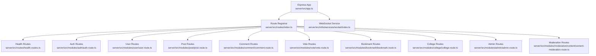
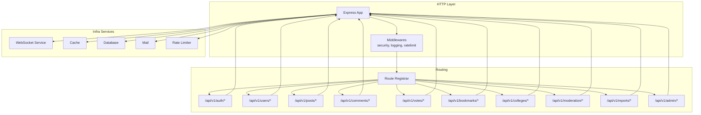
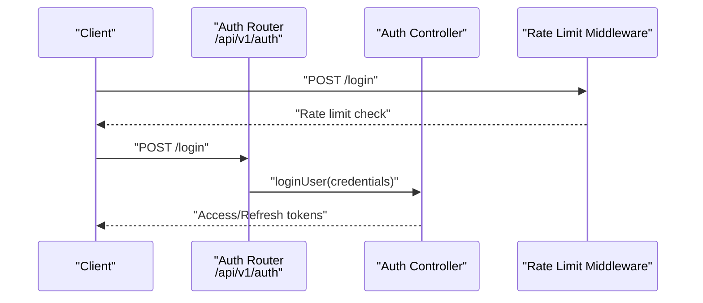
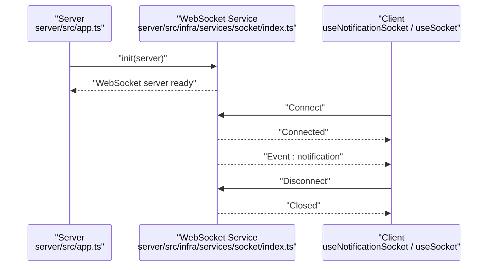
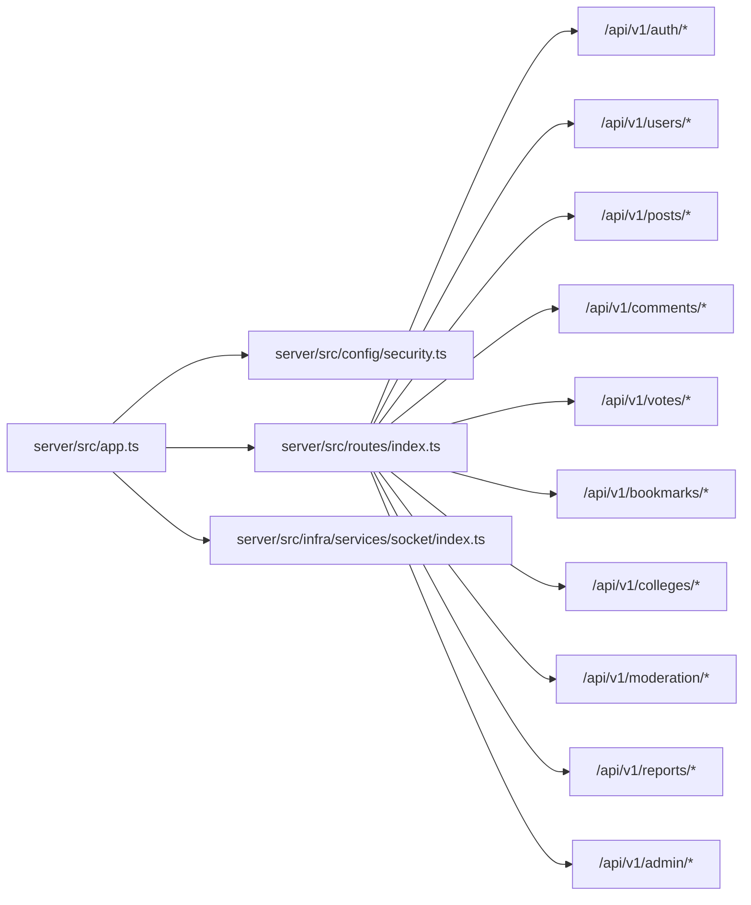

# API Reference

<cite>
**Referenced Files in This Document**
- [server/src/app.ts](file://server/src/app.ts)
- [server/src/routes/index.ts](file://server/src/routes/index.ts)
- [server/src/routes/health.routes.ts](file://server/src/routes/health.routes.ts)
- [server/src/modules/auth/auth.route.ts](file://server/src/modules/auth/auth.route.ts)
- [server/src/modules/user/user.route.ts](file://server/src/modules/user/user.route.ts)
- [server/src/modules/post/post.route.ts](file://server/src/modules/post/post.route.ts)
- [server/src/modules/comment/comment.route.ts](file://server/src/modules/comment/comment.route.ts)
- [server/src/modules/vote/vote.route.ts](file://server/src/modules/vote/vote.route.ts)
- [server/src/modules/bookmark/bookmark.route.ts](file://server/src/modules/bookmark/bookmark.route.ts)
- [server/src/modules/college/college.route.ts](file://server/src/modules/college/college.route.ts)
- [server/src/modules/admin/admin.route.ts](file://server/src/modules/admin/admin.route.ts)
- [server/src/modules/moderation/content/content-moderation.route.ts](file://server/src/modules/moderation/content/content-moderation.route.ts)
- [server/src/infra/services/socket/index.ts](file://server/src/infra/services/socket/index.ts)
- [web/src/services/api/auth.ts](file://web/src/services/api/auth.ts)
- [web/src/services/api/user.ts](file://web/src/services/api/user.ts)
- [web/src/services/api/post.ts](file://web/src/services/api/post.ts)
- [web/src/services/api/comment.ts](file://web/src/services/api/comment.ts)
- [web/src/services/api/vote.ts](file://web/src/services/api/vote.ts)
- [web/src/services/api/bookmark.ts](file://web/src/services/api/bookmark.ts)
- [web/src/services/api/college.ts](file://web/src/services/api/college.ts)
- [web/src/services/api/moderation.ts](file://web/src/services/api/moderation.ts)
- [web/src/services/api/report.ts](file://web/src/services/api/report.ts)
- [web/src/services/api/admin.ts](file://web/src/services/api/admin.ts)
- [web/src/socket/useSocket.ts](file://web/src/socket/useSocket.ts)
- [web/src/hooks/useNotificationSocket.tsx](file://web/src/hooks/useNotificationSocket.tsx)
- [server/src/core/middlewares/rate-limit.middleware.ts](file://server/src/core/middlewares/rate-limit.middleware.ts)
- [server/src/core/middlewares/index.ts](file://server/src/core/middlewares/index.ts)
- [server/src/config/security.ts](file://server/src/config/security.ts)
- [server/src/shared/constants/db.ts](file://server/src/shared/constants/db.ts)
</cite>

## Table of Contents
1. [Introduction](#introduction)
2. [Project Structure](#project-structure)
3. [Core Components](#core-components)
4. [Architecture Overview](#architecture-overview)
5. [Detailed Component Analysis](#detailed-component-analysis)
6. [Dependency Analysis](#dependency-analysis)
7. [Performance Considerations](#performance-considerations)
8. [Troubleshooting Guide](#troubleshooting-guide)
9. [Conclusion](#conclusion)
10. [Appendices](#appendices)

## Introduction
This document provides a comprehensive API reference for the Flick platform’s backend services. It covers REST endpoints for authentication, user management, posts, comments, voting, bookmarks, colleges, moderation, reporting, and administrative functions. It also documents WebSocket endpoints for real-time notifications, authentication and authorization requirements, rate limiting, error handling, and client integration patterns. Versioning and deprecation policies are outlined to guide long-term compatibility.

## Project Structure
The API surface is organized under a versioned base path with modular routers grouped by domain. The Express application initializes middleware, registers routes, and integrates WebSocket services.

**Diagram sources**
- [server/src/app.ts](file://server/src/app.ts#L10-L30)
- [server/src/routes/index.ts](file://server/src/routes/index.ts#L20-L38)

**Section sources**
- [server/src/app.ts](file://server/src/app.ts#L1-L33)
- [server/src/routes/index.ts](file://server/src/routes/index.ts#L1-L39)

## Core Components
- Base URL: https://your-host/api/v1
- Additional auth proxy endpoint: /api/auth/*
- Health endpoints:
  - GET /healthz
  - GET /readyz
- Rate limiting: Applied per-route via middleware
- Authentication: JWT-based via Better Auth; session and refresh tokens
- Authorization: Role-based (admin, superadmin) enforced on admin/moderation routes
- Real-time: WebSocket service initialized at server startup

**Section sources**
- [server/src/routes/index.ts](file://server/src/routes/index.ts#L23-L37)
- [server/src/routes/health.routes.ts](file://server/src/routes/health.routes.ts#L4-L17)
- [server/src/app.ts](file://server/src/app.ts#L10-L30)
- [server/src/modules/admin/admin.route.ts](file://server/src/modules/admin/admin.route.ts#L13-L15)
- [server/src/modules/moderation/content/content-moderation.route.ts](file://server/src/modules/moderation/content/content-moderation.route.ts#L7-L9)

## Architecture Overview
The API follows a layered architecture:
- HTTP layer: Express app with middleware pipeline
- Routing layer: Modular routers mounted under /api/v1
- Domain controllers: Handle request/response for each module
- Infra services: WebSocket, caching, database, mail, rate limiter
- Security: CORS, CSRF protection, helmet, CSP, RBAC

**Diagram sources**
- [server/src/app.ts](file://server/src/app.ts#L10-L30)
- [server/src/routes/index.ts](file://server/src/routes/index.ts#L20-L38)
- [server/src/infra/services/socket/index.ts](file://server/src/infra/services/socket/index.ts)

## Detailed Component Analysis

### Authentication API
- Base Path: /api/v1/auth
- Public endpoints (rate-limited):
  - POST /login
  - POST /refresh
  - POST /otp/send
  - POST /otp/verify
  - POST /registration/verify-otp
  - POST /registration/initialize
  - POST /registration/finalize
  - GET /google/callback
  - POST /password/forgot
  - POST /password/reset
  - POST /otp/login/send
  - POST /otp/login/verify
- Protected endpoints:
  - GET /me
  - POST /onboarding/complete
  - POST /logout
  - POST /logout-all
  - DELETE /account
  - GET /password/status
  - POST /password/set
- Admin-only endpoints:
  - GET /admins
  - GET /users

Authentication flow overview:

**Diagram sources**
- [server/src/modules/auth/auth.route.ts](file://server/src/modules/auth/auth.route.ts#L10-L21)
- [server/src/core/middlewares/rate-limit.middleware.ts](file://server/src/core/middlewares/rate-limit.middleware.ts)

**Section sources**
- [server/src/modules/auth/auth.route.ts](file://server/src/modules/auth/auth.route.ts#L1-L44)

### User Management API
- Base Path: /api/v1/users
- Endpoints:
  - GET /id/:userId
  - GET /search/:query
  - GET /me
  - PATCH /me
  - POST /accept-terms
  - POST /block/:userId
  - POST /unblock/:userId
  - GET /blocked

Authorization:
- Requires authenticated session
- Requires onboarded user for profile operations

**Section sources**
- [server/src/modules/user/user.route.ts](file://server/src/modules/user/user.route.ts#L1-L32)

### Post Operations API
- Base Path: /api/v1/posts
- Endpoints:
  - GET /
  - GET /:id
  - POST /:id/view
  - GET /college/:collegeId
  - GET /branch/:branch
  - GET /user/:userId
  - POST /
  - PATCH /:id
  - DELETE /:id

Authorization:
- GET endpoints: optional user context
- POST/PATCH/DELETE: requires authenticated user context, terms accepted, and not banned

**Section sources**
- [server/src/modules/post/post.route.ts](file://server/src/modules/post/post.route.ts#L1-L34)

### Comment Handling API
- Base Path: /api/v1/comments
- Endpoints:
  - GET /:commentId
  - GET /post/:postId
  - POST /post/:postId
  - PATCH /:commentId
  - DELETE /:commentId

Authorization:
- Optional user context for reads
- Authenticated user required for mutations; terms accepted and not banned

**Section sources**
- [server/src/modules/comment/comment.route.ts](file://server/src/modules/comment/comment.route.ts#L1-L32)

### Voting API
- Base Path: /api/v1/votes
- Endpoints:
  - POST / (create or update vote)
  - PATCH / (update vote)
  - DELETE / (remove vote)

Authorization:
- Requires authenticated user context

**Section sources**
- [server/src/modules/vote/vote.route.ts](file://server/src/modules/vote/vote.route.ts#L1-L18)

### Bookmarking API
- Base Path: /api/v1/bookmarks
- Endpoints:
  - GET /:postId
  - GET /user
  - POST /
  - DELETE /delete/:postId

Authorization:
- Requires authenticated user context

**Section sources**
- [server/src/modules/bookmark/bookmark.route.ts](file://server/src/modules/bookmark/bookmark.route.ts#L1-L19)

### Colleges API
- Base Path: /api/v1/colleges
- Endpoints:
  - POST /
  - GET /
  - POST /requests
  - GET /:id
  - GET /:id/branches
  - PATCH /:id
  - DELETE /:id

Authorization:
- Admin-only for create/update/delete
- Public for listing and fetching branches

**Section sources**
- [server/src/modules/college/college.route.ts](file://server/src/modules/college/college.route.ts#L1-L19)

### Moderation API
- Base Path: /api/v1/moderation
- Endpoints:
  - PUT /posts/:postId/moderation-state
  - PUT /comments/:commentId/moderation-state

Authorization:
- Requires authenticated session, role admin or superadmin

**Section sources**
- [server/src/modules/moderation/content/content-moderation.route.ts](file://server/src/modules/moderation/content/content-moderation.route.ts#L1-L21)

### Reporting API
- Base Path: /api/v1/reports
- Endpoints:
  - GET /manage/reports
  - (Additional report-related endpoints may be defined in related modules)

Note: The reports router is registered under the moderation namespace. Confirm exact endpoints in the reports module routes.

**Section sources**
- [server/src/routes/index.ts](file://server/src/routes/index.ts#L11-L13)

### Administrative Functions API
- Base Path: /api/v1/admin
- Endpoints:
  - GET /dashboard/overview
  - GET /manage/users/query
  - GET /manage/reports
  - GET /colleges/get/all
  - GET /college-requests
  - POST /colleges/create
  - PATCH /colleges/update/:id
  - PATCH /college-requests/:id
  - POST /colleges/upload/profile/:id (multipart/form-data)
  - GET /branches/all
  - POST /branches/create
  - PATCH /branches/update/:id
  - DELETE /branches/delete/:id
  - GET /manage/logs
  - GET /manage/feedback/all

Authorization:
- Requires authenticated session and admin role

**Section sources**
- [server/src/modules/admin/admin.route.ts](file://server/src/modules/admin/admin.route.ts#L1-L41)

### Feedback API
- Base Path: /api/v1/feedbacks
- Endpoints:
  - (Defined in feedback module; confirm exact endpoints in feedback routes)

**Section sources**
- [server/src/routes/index.ts](file://server/src/routes/index.ts#L10-L10)

### Health and Readiness
- GET /healthz
- GET /readyz

These endpoints return a simple JSON payload indicating server health and readiness.

**Section sources**
- [server/src/routes/health.routes.ts](file://server/src/routes/health.routes.ts#L4-L17)

### WebSocket Endpoints and Real-Time Communication
- Initialization: WebSocket service is initialized during server startup
- Client-side usage:
  - React hook for notifications: useNotificationSocket
  - Generic socket hook: useSocket
- Event types and connection handling:
  - Define event names and payloads in the frontend socket hooks
  - Manage connection lifecycle, reconnection, and error handling in the frontend
- Backend service:
  - WebSocket service initialization occurs at server boot

**Diagram sources**
- [server/src/app.ts](file://server/src/app.ts#L10-L14)
- [server/src/infra/services/socket/index.ts](file://server/src/infra/services/socket/index.ts)
- [web/src/hooks/useNotificationSocket.tsx](file://web/src/hooks/useNotificationSocket.tsx)
- [web/src/socket/useSocket.ts](file://web/src/socket/useSocket.ts)

**Section sources**
- [server/src/app.ts](file://server/src/app.ts#L10-L14)
- [web/src/hooks/useNotificationSocket.tsx](file://web/src/hooks/useNotificationSocket.tsx)
- [web/src/socket/useSocket.ts](file://web/src/socket/useSocket.ts)

## Dependency Analysis
Key dependencies and their roles:
- Express app initializes HTTP server and registers middleware and routes
- Route registrar mounts domain-specific routers under /api/v1
- Health routes are registered separately
- WebSocket service is initialized alongside the HTTP server
- Security middleware applies CORS, CSRF, and other protections
- Rate limit middleware is applied per route group

**Diagram sources**
- [server/src/app.ts](file://server/src/app.ts#L10-L30)
- [server/src/routes/index.ts](file://server/src/routes/index.ts#L20-L38)
- [server/src/config/security.ts](file://server/src/config/security.ts)

**Section sources**
- [server/src/app.ts](file://server/src/app.ts#L1-L33)
- [server/src/routes/index.ts](file://server/src/routes/index.ts#L1-L39)

## Performance Considerations
- Payload limits: JSON and URL-encoded bodies are limited to 16KB
- Rate limiting: Applied per route group to protect endpoints from abuse
- Optional user context: Some endpoints accept anonymous requests to reduce overhead
- Caching keys: Modules define cache keys for efficient invalidation and retrieval

Recommendations:
- Use pagination for list endpoints
- Prefer batch operations where supported
- Respect rate limits and implement client-side retry with exponential backoff

**Section sources**
- [server/src/app.ts](file://server/src/app.ts#L15-L16)
- [server/src/core/middlewares/rate-limit.middleware.ts](file://server/src/core/middlewares/rate-limit.middleware.ts)
- [server/src/modules/post/post.route.ts](file://server/src/modules/post/post.route.ts#L15-L16)
- [server/src/modules/comment/comment.route.ts](file://server/src/modules/comment/comment.route.ts#L15-L16)
- [server/src/modules/bookmark/bookmark.route.ts](file://server/src/modules/bookmark/bookmark.route.ts#L8-L8)

## Troubleshooting Guide
Common issues and resolutions:
- 404 Not Found: Verify endpoint path and version prefix (/api/v1)
- 401 Unauthorized: Ensure valid access/refresh tokens and proper authentication flow
- 403 Forbidden: Check user roles for admin-only endpoints
- 429 Too Many Requests: Implement client-side throttling and respect Retry-After headers
- 5xx Server errors: Check /healthz and /readyz endpoints; review server logs

Error handling:
- Centralized error handlers are registered after route registration

**Section sources**
- [server/src/app.ts](file://server/src/app.ts#L26-L27)
- [server/src/routes/index.ts](file://server/src/routes/index.ts#L20-L38)

## Conclusion
This API reference outlines the REST endpoints, authentication and authorization requirements, rate limiting, and WebSocket capabilities for the Flick platform. Clients should adhere to versioned endpoints, respect rate limits, and implement robust error handling and retry logic. Administrators and moderators should use role-based endpoints judiciously.

## Appendices

### API Versioning and Deprecation Policy
- Versioning: All primary endpoints are prefixed with /api/v1
- Backward compatibility: No breaking changes within v1 planned
- Deprecation: Future deprecations will be announced with migration timelines; clients should monitor changelog updates

**Section sources**
- [server/src/routes/index.ts](file://server/src/routes/index.ts#L23-L37)

### Authentication and Authorization
- JWT-based sessions via Better Auth
- Access tokens for protected resources; refresh tokens for seamless renewal
- Roles: admin, superadmin for moderation and admin panels
- CORS and CSRF protection enabled globally

**Section sources**
- [server/src/config/security.ts](file://server/src/config/security.ts)
- [server/src/modules/admin/admin.route.ts](file://server/src/modules/admin/admin.route.ts#L13-L15)
- [server/src/modules/moderation/content/content-moderation.route.ts](file://server/src/modules/moderation/content/content-moderation.route.ts#L7-L9)

### Rate Limiting
- Applied per route group to balance performance and abuse prevention
- Configure limits in rate-limit middleware

**Section sources**
- [server/src/core/middlewares/rate-limit.middleware.ts](file://server/src/core/middlewares/rate-limit.middleware.ts)
- [server/src/modules/auth/auth.route.ts](file://server/src/modules/auth/auth.route.ts#L8-L8)
- [server/src/modules/post/post.route.ts](file://server/src/modules/post/post.route.ts#L15-L15)
- [server/src/modules/comment/comment.route.ts](file://server/src/modules/comment/comment.route.ts#L15-L15)
- [server/src/modules/bookmark/bookmark.route.ts](file://server/src/modules/bookmark/bookmark.route.ts#L8-L8)
- [server/src/modules/college/college.route.ts](file://server/src/modules/college/college.route.ts#L8-L8)
- [server/src/modules/admin/admin.route.ts](file://server/src/modules/admin/admin.route.ts#L13-L13)

### Client Integration Patterns
- Frontend SDKs:
  - Auth: web/src/services/api/auth.ts
  - User: web/src/services/api/user.ts
  - Post: web/src/services/api/post.ts
  - Comment: web/src/services/api/comment.ts
  - Vote: web/src/services/api/vote.ts
  - Bookmark: web/src/services/api/bookmark.ts
  - College: web/src/services/api/college.ts
  - Moderation: web/src/services/api/moderation.ts
  - Report: web/src/services/api/report.ts
  - Admin: web/src/services/api/admin.ts
- Real-time:
  - useNotificationSocket for notifications
  - useSocket for generic events

**Section sources**
- [web/src/services/api/auth.ts](file://web/src/services/api/auth.ts)
- [web/src/services/api/user.ts](file://web/src/services/api/user.ts)
- [web/src/services/api/post.ts](file://web/src/services/api/post.ts)
- [web/src/services/api/comment.ts](file://web/src/services/api/comment.ts)
- [web/src/services/api/vote.ts](file://web/src/services/api/vote.ts)
- [web/src/services/api/bookmark.ts](file://web/src/services/api/bookmark.ts)
- [web/src/services/api/college.ts](file://web/src/services/api/college.ts)
- [web/src/services/api/moderation.ts](file://web/src/services/api/moderation.ts)
- [web/src/services/api/report.ts](file://web/src/services/api/report.ts)
- [web/src/services/api/admin.ts](file://web/src/services/api/admin.ts)
- [web/src/hooks/useNotificationSocket.tsx](file://web/src/hooks/useNotificationSocket.tsx)
- [web/src/socket/useSocket.ts](file://web/src/socket/useSocket.ts)

### Request/Response Schema Examples
- Authentication
  - POST /api/v1/auth/login
    - Request: { email, password }
    - Response: { accessToken, refreshToken, user }
  - POST /api/v1/auth/refresh
    - Request: { refreshToken }
    - Response: { accessToken, refreshToken }
  - POST /api/v1/auth/me
    - Response: { id, email, name, role, onboarded }
- Users
  - GET /api/v1/users/me
    - Response: { id, email, name, role, onboarded, profileFields... }
  - PATCH /api/v1/users/me
    - Request: { name?, branch?, collegeId? }
    - Response: { message }
- Posts
  - GET /api/v1/posts
    - Query: { page?, limit?, sortBy?, order? }
    - Response: { posts[], total, page, limit }
  - POST /api/v1/posts
    - Request: { title, content, collegeId, branch, topics[] }
    - Response: { id, title, authorId }
- Comments
  - POST /api/v1/comments/post/:postId
    - Request: { content }
    - Response: { id, postId, authorId }
- Votes
  - POST /api/v1/votes
    - Request: { entityId, entityType, voteType }
    - Response: { message }
- Bookmarks
  - POST /api/v1/bookmarks
    - Request: { postId }
    - Response: { bookmarkId }
- Colleges
  - POST /api/v1/colleges
    - Request: { name, city, state }
    - Response: { id, name }
- Moderation
  - PUT /api/v1/moderation/posts/:postId/moderation-state
    - Request: { state, reason? }
    - Response: { message }
- Admin
  - POST /api/v1/admin/colleges/create
    - Request: { name, city, state }
    - Response: { id }

Note: Replace placeholders with actual field names as defined in the schema modules.

**Section sources**
- [server/src/modules/auth/auth.schema.ts](file://server/src/modules/auth/auth.schema.ts)
- [server/src/modules/user/user.schema.ts](file://server/src/modules/user/user.schema.ts)
- [server/src/modules/post/post.schema.ts](file://server/src/modules/post/post.schema.ts)
- [server/src/modules/comment/comment.schema.ts](file://server/src/modules/comment/comment.schema.ts)
- [server/src/modules/vote/vote.schema.ts](file://server/src/modules/vote/vote.schema.ts)
- [server/src/modules/bookmark/bookmark.schema.ts](file://server/src/modules/bookmark/bookmark.schema.ts)
- [server/src/modules/college/college.schema.ts](file://server/src/modules/college/college.schema.ts)
- [server/src/modules/moderation/content/content-moderation.schema.ts](file://server/src/modules/moderation/content/content-moderation.schema.ts)
- [server/src/modules/admin/admin.schema.ts](file://server/src/modules/admin/admin.schema.ts)

### Curl Examples
- Authenticate
  - curl -X POST https://your-host/api/v1/auth/login -H "Content-Type: application/json" -d '{"email":"user@example.com","password":"pass"}'
- Get My Profile
  - curl -X GET https://your-host/api/v1/users/me -H "Authorization: Bearer ACCESS_TOKEN"
- Create Post
  - curl -X POST https://your-host/api/v1/posts -H "Authorization: Bearer ACCESS_TOKEN" -H "Content-Type: application/json" -d '{"title":"Post","content":"Body","collegeId":1,"branch":"CS","topics":["topic1"]}'
- Vote
  - curl -X POST https://your-host/api/v1/votes -H "Authorization: Bearer ACCESS_TOKEN" -H "Content-Type: application/json" -d '{"entityId":"post-id","entityType":"post","voteType":"up"}'

[No sources needed since this section provides general guidance]

### Database Constants and Types
- Shared database constants and types are available for reference across modules

**Section sources**
- [server/src/shared/constants/db.ts](file://server/src/shared/constants/db.ts)