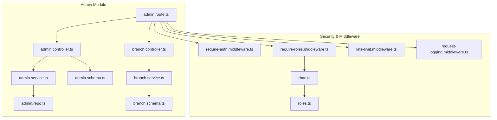
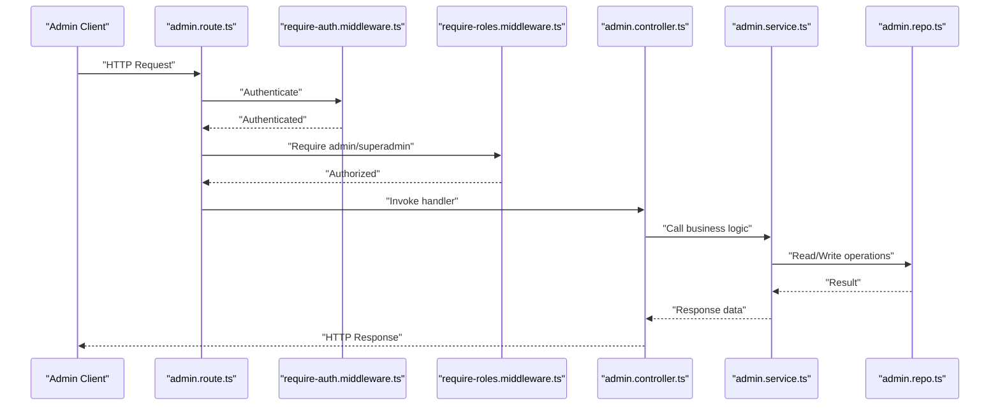
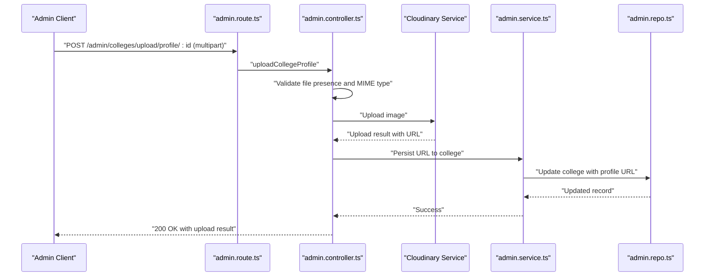
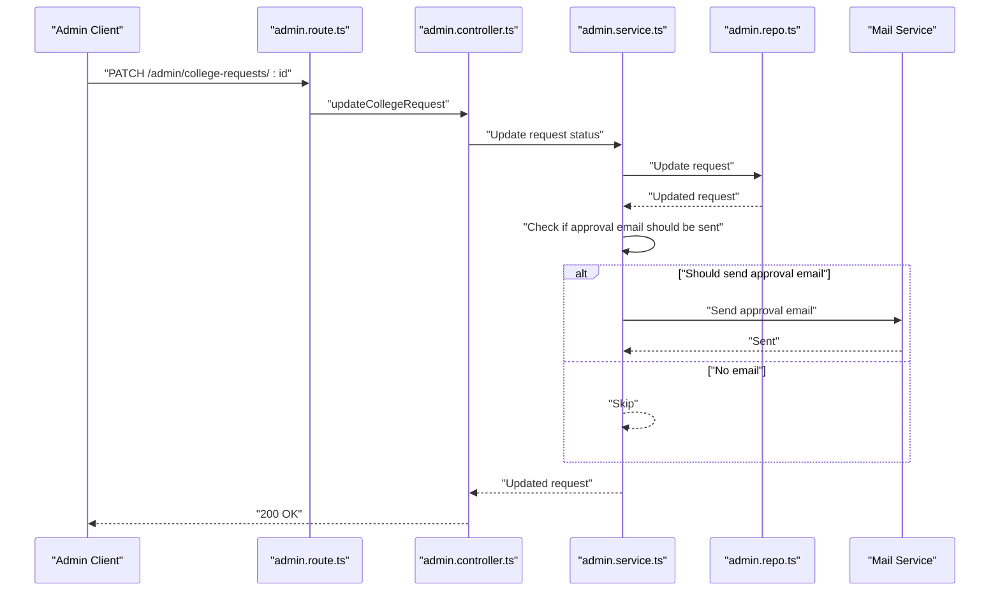
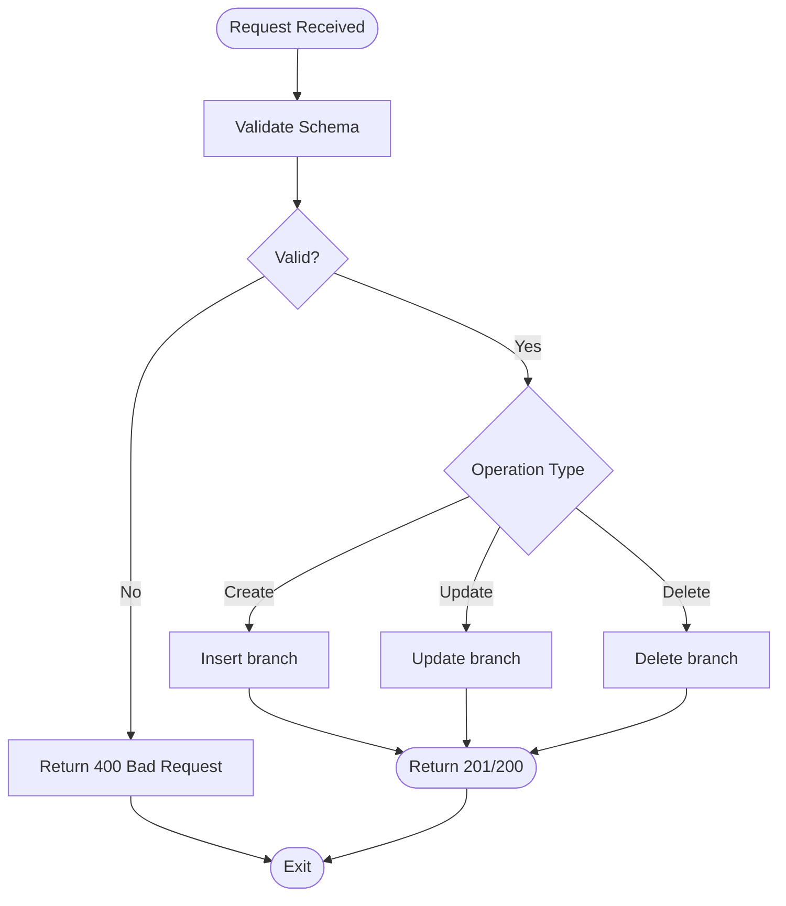
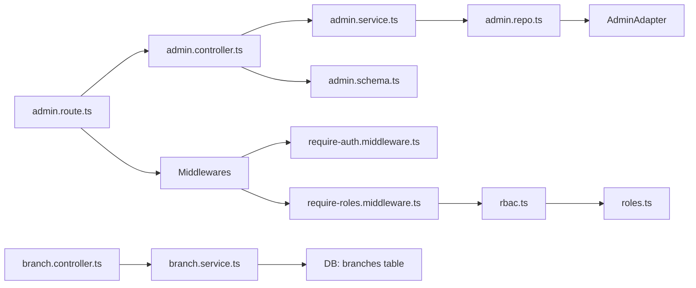

# Administrative API

<cite>
**Referenced Files in This Document**
- [admin.route.ts](file://server/src/modules/admin/admin.route.ts)
- [admin.controller.ts](file://server/src/modules/admin/admin.controller.ts)
- [admin.service.ts](file://server/src/modules/admin/admin.service.ts)
- [admin.schema.ts](file://server/src/modules/admin/admin.schema.ts)
- [admin.repo.ts](file://server/src/modules/admin/admin.repo.ts)
- [branch.controller.ts](file://server/src/modules/admin/branch/branch.controller.ts)
- [branch.service.ts](file://server/src/modules/admin/branch/branch.service.ts)
- [branch.schema.ts](file://server/src/modules/admin/branch/branch.schema.ts)
- [roles.ts](file://server/src/config/roles.ts)
- [rbac.ts](file://server/src/core/security/rbac.ts)
- [index.ts](file://server/src/core/middlewares/index.ts)
- [require-auth.middleware.ts](file://server/src/core/middlewares/auth/require-auth.middleware.ts)
- [require-roles.middleware.ts](file://server/src/core/middlewares/auth/require-roles.middleware.ts)
- [rate-limit.middleware.ts](file://server/src/core/middlewares/rate-limit.middleware.ts)
- [request-logging.middleware.ts](file://server/src/core/middlewares/request-logging.middleware.ts)
- [health.routes.ts](file://server/src/routes/health.routes.ts)
</cite>

## Table of Contents
1. [Introduction](#introduction)
2. [Project Structure](#project-structure)
3. [Core Components](#core-components)
4. [Architecture Overview](#architecture-overview)
5. [Detailed Component Analysis](#detailed-component-analysis)
6. [Dependency Analysis](#dependency-analysis)
7. [Performance Considerations](#performance-considerations)
8. [Troubleshooting Guide](#troubleshooting-guide)
9. [Conclusion](#conclusion)
10. [Appendices](#appendices)

## Introduction
This document provides comprehensive API documentation for the administrative dashboard endpoints. It covers administrative functions including user management, content oversight, system analytics, and administrative controls. Endpoints documented include admin user operations, system configuration, administrative reporting, audit logging, system monitoring, and administrative workflows. It also documents request/response schemas, permission management, role-based access controls, and administrative security measures.

## Project Structure
The administrative API is implemented under the server module with a layered architecture:
- Routes define endpoint contracts and apply middleware.
- Controllers handle request parsing, validation, and response formatting.
- Services encapsulate business logic and orchestrate repositories.
- Repositories abstract database operations.
- Schemas define request validation and type safety.
- Middlewares enforce authentication, role-based access control, rate limiting, and request logging.

**Diagram sources**
- [admin.route.ts](file://server/src/modules/admin/admin.route.ts#L1-L41)
- [admin.controller.ts](file://server/src/modules/admin/admin.controller.ts#L1-L125)
- [admin.service.ts](file://server/src/modules/admin/admin.service.ts#L1-L207)
- [admin.repo.ts](file://server/src/modules/admin/admin.repo.ts#L1-L60)
- [admin.schema.ts](file://server/src/modules/admin/admin.schema.ts#L1-L69)
- [branch.controller.ts](file://server/src/modules/admin/branch/branch.controller.ts#L1-L34)
- [branch.service.ts](file://server/src/modules/admin/branch/branch.service.ts#L1-L31)
- [branch.schema.ts](file://server/src/modules/admin/branch/branch.schema.ts#L1-L26)
- [require-auth.middleware.ts](file://server/src/core/middlewares/auth/require-auth.middleware.ts)
- [require-roles.middleware.ts](file://server/src/core/middlewares/auth/require-roles.middleware.ts)
- [rate-limit.middleware.ts](file://server/src/core/middlewares/rate-limit.middleware.ts)
- [request-logging.middleware.ts](file://server/src/core/middlewares/request-logging.middleware.ts)
- [rbac.ts](file://server/src/core/security/rbac.ts#L1-L15)
- [roles.ts](file://server/src/config/roles.ts#L1-L11)

**Section sources**
- [admin.route.ts](file://server/src/modules/admin/admin.route.ts#L1-L41)
- [admin.controller.ts](file://server/src/modules/admin/admin.controller.ts#L1-L125)
- [admin.service.ts](file://server/src/modules/admin/admin.service.ts#L1-L207)
- [admin.schema.ts](file://server/src/modules/admin/admin.schema.ts#L1-L69)
- [admin.repo.ts](file://server/src/modules/admin/admin.repo.ts#L1-L60)
- [branch.controller.ts](file://server/src/modules/admin/branch/branch.controller.ts#L1-L34)
- [branch.service.ts](file://server/src/modules/admin/branch/branch.service.ts#L1-L31)
- [branch.schema.ts](file://server/src/modules/admin/branch/branch.schema.ts#L1-L26)
- [roles.ts](file://server/src/config/roles.ts#L1-L11)
- [rbac.ts](file://server/src/core/security/rbac.ts#L1-L15)
- [index.ts](file://server/src/core/middlewares/index.ts)

## Core Components
- Admin Route: Defines all administrative endpoints, applies rate limiting, authentication, and role-based access control.
- Admin Controller: Parses and validates inputs via Zod schemas, delegates to service, and returns standardized HTTP responses.
- Admin Service: Implements business logic for dashboards, user queries, reports, colleges, logs, and feedback retrieval; orchestrates repository operations and cache invalidation.
- Admin Repo: Provides read/write operations delegated to database adapters.
- Branch Controller/Service/Schema: CRUD endpoints for branch entities with validation.
- Security & RBAC: Role definitions and permission computation; middleware enforcement.

Key responsibilities:
- Authentication: Ensures requests are made by authenticated users.
- Authorization: Restricts endpoints to admin or superadmin roles.
- Validation: Enforces strict request schemas for all inputs.
- Response: Returns standardized success/error responses with appropriate HTTP status codes.

**Section sources**
- [admin.route.ts](file://server/src/modules/admin/admin.route.ts#L13-L15)
- [admin.controller.ts](file://server/src/modules/admin/admin.controller.ts#L1-L125)
- [admin.service.ts](file://server/src/modules/admin/admin.service.ts#L1-L207)
- [admin.repo.ts](file://server/src/modules/admin/admin.repo.ts#L1-L60)
- [branch.controller.ts](file://server/src/modules/admin/branch/branch.controller.ts#L1-L34)
- [branch.service.ts](file://server/src/modules/admin/branch/branch.service.ts#L1-L31)
- [roles.ts](file://server/src/config/roles.ts#L1-L11)
- [rbac.ts](file://server/src/core/security/rbac.ts#L1-L15)

## Architecture Overview
The administrative API follows a clean architecture pattern:
- Routes layer: HTTP endpoints and middleware pipeline.
- Controller layer: Input parsing, validation, and response formatting.
- Service layer: Business logic and coordination.
- Repository layer: Data access abstraction.
- Security layer: Authentication, authorization, rate limiting, and request logging.

**Diagram sources**
- [admin.route.ts](file://server/src/modules/admin/admin.route.ts#L13-L15)
- [require-auth.middleware.ts](file://server/src/core/middlewares/auth/require-auth.middleware.ts)
- [require-roles.middleware.ts](file://server/src/core/middlewares/auth/require-roles.middleware.ts)
- [admin.controller.ts](file://server/src/modules/admin/admin.controller.ts#L1-L125)
- [admin.service.ts](file://server/src/modules/admin/admin.service.ts#L1-L207)
- [admin.repo.ts](file://server/src/modules/admin/admin.repo.ts#L1-L60)

## Detailed Component Analysis

### Endpoint Catalog and Contracts
All administrative endpoints are protected by rate limiting, authentication, and role-based access control. Requests must include a valid admin or superadmin role.

- GET /admin/dashboard/overview
  - Purpose: Retrieve dashboard overview metrics.
  - Auth: admin or superadmin.
  - Response: Overview data object.
  - Example response keys: users, posts, comments.

- GET /admin/manage/users/query
  - Purpose: Search users by optional username or email.
  - Auth: admin or superadmin.
  - Query params:
    - username: string (optional)
    - email: string (optional)
  - Response: Array of users matching criteria.

- GET /admin/manage/reports
  - Purpose: List reports with pagination and filtering by status.
  - Auth: admin or superadmin.
  - Query params:
    - page: number >= 1 (default 1)
    - limit: number 1..50 (default 10)
    - status: comma-separated list of statuses (default pending,resolved)
  - Response: data array and pagination metadata.

- GET /admin/colleges/get/all
  - Purpose: Retrieve all colleges.
  - Auth: admin or superadmin.
  - Response: Array of colleges.

- GET /admin/college-requests
  - Purpose: Retrieve all college requests.
  - Auth: admin or superadmin.
  - Response: Array of requests.

- POST /admin/colleges/create
  - Purpose: Create a new college.
  - Auth: admin or superadmin.
  - Body schema: CreateCollegeSchema.
  - Response: Created college object (including branches if provided).

- PATCH /admin/colleges/update/:id
  - Purpose: Update an existing college by ID.
  - Auth: admin or superadmin.
  - Path params:
    - id: UUID
  - Body schema: UpdateCollegeSchema (partial).
  - Response: Updated college object; 404 if not found.

- PATCH /admin/college-requests/:id
  - Purpose: Update a college request by ID (approve/reject/pending).
  - Auth: admin or superadmin.
  - Path params:
    - id: UUID
  - Body schema: UpdateCollegeRequestSchema.
  - Response: Updated request object; 404 if not found.

- POST /admin/colleges/upload/profile/:id
  - Purpose: Upload a college profile image and persist URL.
  - Auth: admin or superadmin.
  - Path params:
    - id: UUID
  - Form-data:
    - profile: single image file (max size configured)
  - Response: Upload result with URL; 400 if missing or invalid type.

- GET /admin/branches/all
  - Purpose: Retrieve all branches.
  - Auth: admin or superadmin.
  - Response: Array of branches.

- POST /admin/branches/create
  - Purpose: Create a new branch.
  - Auth: admin or superadmin.
  - Body schema: CreateBranchSchema.
  - Response: Created branch.

- PATCH /admin/branches/update/:id
  - Purpose: Update an existing branch by ID.
  - Auth: admin or superadmin.
  - Path params:
    - id: UUID
  - Body schema: UpdateBranchSchema (partial).
  - Response: Updated branch.

- DELETE /admin/branches/delete/:id
  - Purpose: Delete a branch by ID.
  - Auth: admin or superadmin.
  - Path params:
    - id: UUID
  - Response: Success message.

- GET /admin/manage/logs
  - Purpose: Retrieve system logs with pagination and sorting.
  - Auth: admin or superadmin.
  - Query params:
    - page: number >= 1 (default 1)
    - limit: number 1..100 (default 20)
    - sortBy: string (default timestamp)
    - sortOrder: "asc" or "desc" (default desc)
  - Response: data array and pagination metadata.

- GET /admin/manage/feedback/all
  - Purpose: Retrieve all feedback entries.
  - Auth: admin or superadmin.
  - Response: Array of feedback entries.

**Section sources**
- [admin.route.ts](file://server/src/modules/admin/admin.route.ts#L17-L39)
- [admin.controller.ts](file://server/src/modules/admin/admin.controller.ts#L9-L121)
- [admin.schema.ts](file://server/src/modules/admin/admin.schema.ts#L3-L69)
- [branch.controller.ts](file://server/src/modules/admin/branch/branch.controller.ts#L8-L30)
- [branch.schema.ts](file://server/src/modules/admin/branch/branch.schema.ts#L3-L26)

### Request/Response Schemas
Validation is enforced via Zod schemas for all endpoints that accept parameters or body payloads.

- ManageUsersQuerySchema
  - username: string (optional)
  - email: string (optional)

- GetReportsQuerySchema
  - page: number >= 1 (default 1)
  - limit: number 1..50 (default 10)
  - status: array of strings (default ["pending","resolved"])
  - fields: string (optional)

- GetLogsQuerySchema
  - page: number >= 1 (default 1)
  - limit: number 1..100 (default 20)
  - sortBy: string (default "timestamp")
  - sortOrder: "asc" or "desc" (default "desc")

- CreateCollegeSchema
  - name: string (min 2)
  - emailDomain: string (min 3; valid domain)
  - city: string (min 2)
  - state: string (min 2)
  - profile: url (optional)
  - branches: array of string (optional)

- UpdateCollegeSchema
  - name: string (min 2) (optional)
  - emailDomain: string (min 3) (optional)
  - city: string (min 2) (optional)
  - state: string (min 2) (optional)
  - profile: url (optional)
  - branches: array of string (optional)

- CollegeIdSchema
  - id: uuid

- UpdateCollegeRequestSchema
  - status: "pending" | "approved" | "rejected"
  - resolvedCollegeId: uuid (optional)

- CreateBranchSchema
  - name: string (min 2)
  - code: string (min 2)

- UpdateBranchSchema
  - name: string (min 2) (optional)
  - code: string (min 2) (optional)

- BranchIdSchema
  - id: uuid

**Section sources**
- [admin.schema.ts](file://server/src/modules/admin/admin.schema.ts#L1-L69)
- [branch.schema.ts](file://server/src/modules/admin/branch/branch.schema.ts#L1-L26)

### Processing Logic and Workflows

#### College Profile Upload Workflow

**Diagram sources**
- [admin.route.ts](file://server/src/modules/admin/admin.route.ts#L26-L30)
- [admin.controller.ts](file://server/src/modules/admin/admin.controller.ts#L103-L121)
- [admin.service.ts](file://server/src/modules/admin/admin.service.ts#L105-L152)
- [admin.repo.ts](file://server/src/modules/admin/admin.repo.ts#L23-L56)

#### Approve/Deny College Request Workflow

**Diagram sources**
- [admin.route.ts](file://server/src/modules/admin/admin.route.ts#L25-L30)
- [admin.controller.ts](file://server/src/modules/admin/admin.controller.ts#L87-L101)
- [admin.service.ts](file://server/src/modules/admin/admin.service.ts#L154-L203)
- [admin.repo.ts](file://server/src/modules/admin/admin.repo.ts#L12-L21)

#### Branch Management Workflow

**Diagram sources**
- [branch.controller.ts](file://server/src/modules/admin/branch/branch.controller.ts#L13-L30)
- [branch.service.ts](file://server/src/modules/admin/branch/branch.service.ts#L11-L27)
- [branch.schema.ts](file://server/src/modules/admin/branch/branch.schema.ts#L3-L26)

### Error Handling
Common errors and their typical causes:
- 401 Unauthorized: Missing or invalid authentication token.
- 403 Forbidden: Insufficient role (must be admin or superadmin).
- 400 Bad Request: Invalid input per Zod schema or missing/invalid file for uploads.
- 404 Not Found: Non-existent resource (e.g., college or request not found during update).
- 429 Too Many Requests: Rate limit exceeded.
- 500 Internal Server Error: Unexpected server errors during processing.

Administrative-specific protections:
- All admin endpoints are guarded by authentication and role middleware.
- Rate limiting is applied globally for API endpoints.
- Request logging captures metadata for auditing.

**Section sources**
- [admin.controller.ts](file://server/src/modules/admin/admin.controller.ts#L80-L113)
- [admin.route.ts](file://server/src/modules/admin/admin.route.ts#L13-L15)
- [rate-limit.middleware.ts](file://server/src/core/middlewares/rate-limit.middleware.ts)
- [request-logging.middleware.ts](file://server/src/core/middlewares/request-logging.middleware.ts)

## Dependency Analysis

**Diagram sources**
- [admin.route.ts](file://server/src/modules/admin/admin.route.ts#L1-L41)
- [admin.controller.ts](file://server/src/modules/admin/admin.controller.ts#L1-L125)
- [admin.service.ts](file://server/src/modules/admin/admin.service.ts#L1-L207)
- [admin.repo.ts](file://server/src/modules/admin/admin.repo.ts#L1-L60)
- [admin.schema.ts](file://server/src/modules/admin/admin.schema.ts#L1-L69)
- [branch.controller.ts](file://server/src/modules/admin/branch/branch.controller.ts#L1-L34)
- [branch.service.ts](file://server/src/modules/admin/branch/branch.service.ts#L1-L31)
- [require-auth.middleware.ts](file://server/src/core/middlewares/auth/require-auth.middleware.ts)
- [require-roles.middleware.ts](file://server/src/core/middlewares/auth/require-roles.middleware.ts)
- [rbac.ts](file://server/src/core/security/rbac.ts#L1-L15)
- [roles.ts](file://server/src/config/roles.ts#L1-L11)

**Section sources**
- [admin.route.ts](file://server/src/modules/admin/admin.route.ts#L1-L41)
- [admin.service.ts](file://server/src/modules/admin/admin.service.ts#L1-L207)
- [admin.repo.ts](file://server/src/modules/admin/admin.repo.ts#L1-L60)
- [branch.service.ts](file://server/src/modules/admin/branch/branch.service.ts#L1-L31)

## Performance Considerations
- Pagination: Use page and limit parameters to constrain result sets for reports, logs, and user queries.
- Sorting: Prefer indexed fields for sortBy to avoid expensive sorts.
- Batch operations: Group related updates (e.g., updating branches along with college) to minimize round trips.
- Caching: Cache invalidation is triggered after college updates to keep downstream caches consistent.
- Rate limiting: Respect global rate limits to prevent overload.

[No sources needed since this section provides general guidance]

## Troubleshooting Guide
- Authentication failures:
  - Verify bearer token is present and valid.
  - Confirm user session has not expired.
- Authorization failures:
  - Ensure the user has admin or superadmin role.
  - Check role definitions and RBAC computation.
- Validation errors:
  - Review schema constraints (min lengths, formats, enums).
  - Confirm query/body matches expected types.
- Upload issues:
  - Ensure file is present and MIME type starts with "image/".
  - Confirm file size within configured limits.
- Cache inconsistencies:
  - After updates, verify cache invalidation triggers for colleges and branches.

**Section sources**
- [roles.ts](file://server/src/config/roles.ts#L1-L11)
- [rbac.ts](file://server/src/core/security/rbac.ts#L1-L15)
- [admin.controller.ts](file://server/src/modules/admin/admin.controller.ts#L107-L113)
- [admin.service.ts](file://server/src/modules/admin/admin.service.ts#L95-L140)

## Conclusion
The administrative API provides a secure, validated, and structured set of endpoints for managing users, colleges, branches, reports, logs, and feedback. Built with role-based access control, request validation, and standardized responses, it supports robust administrative workflows while maintaining system integrity and performance.

[No sources needed since this section summarizes without analyzing specific files]

## Appendices

### Security Model
- Roles: user, admin, superadmin.
- Permissions:
  - admin: read:profile, create:user, delete:user
  - superadmin: all permissions (*)
- RBAC computes effective permissions from user roles.

**Section sources**
- [roles.ts](file://server/src/config/roles.ts#L1-L11)
- [rbac.ts](file://server/src/core/security/rbac.ts#L1-L15)

### Monitoring and Health
- Health endpoints are defined separately for system status checks.
- Request logging captures metadata for operational insights.

**Section sources**
- [health.routes.ts](file://server/src/routes/health.routes.ts)