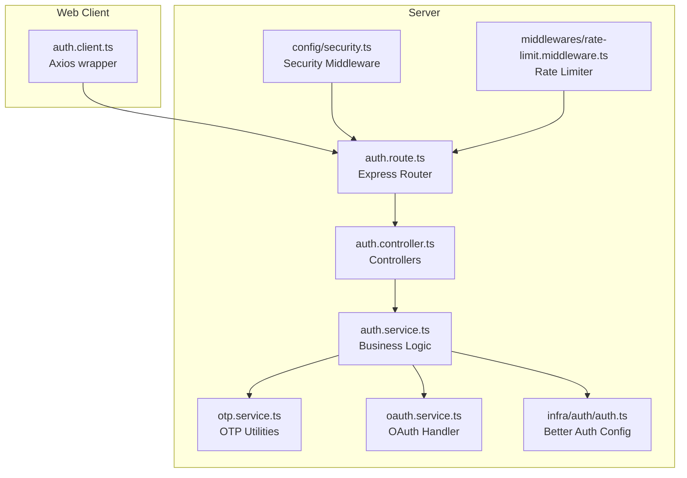
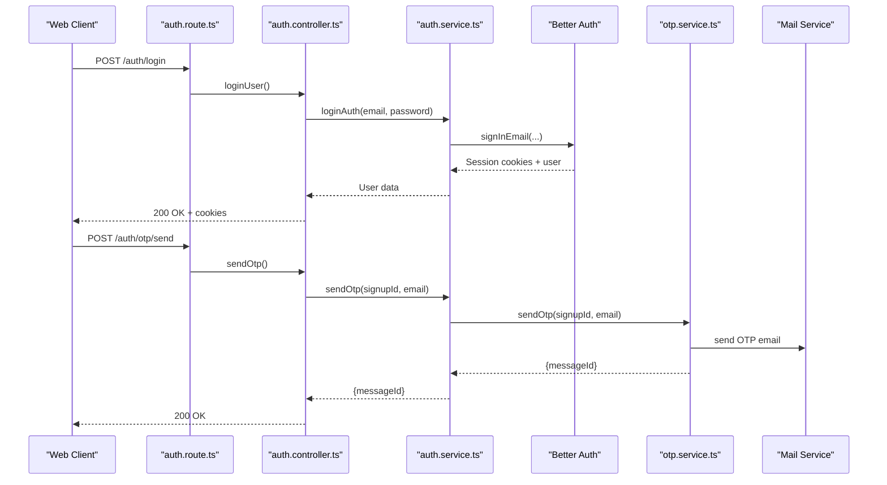
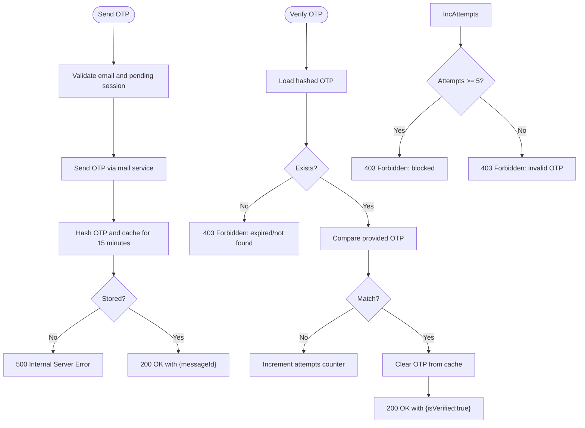
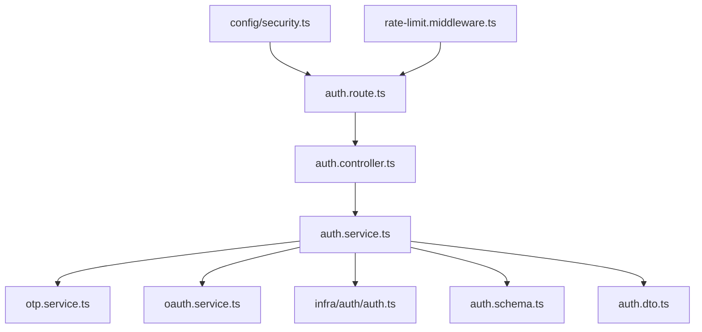

# Authentication API

<cite>
**Referenced Files in This Document**
- [auth.route.ts](file://server/src/modules/auth/auth.route.ts)
- [auth.controller.ts](file://server/src/modules/auth/auth.controller.ts)
- [auth.service.ts](file://server/src/modules/auth/auth.service.ts)
- [auth.schema.ts](file://server/src/modules/auth/auth.schema.ts)
- [auth.dto.ts](file://server/src/modules/auth/auth.dto.ts)
- [oauth.service.ts](file://server/src/modules/auth/oauth/oauth.service.ts)
- [otp.service.ts](file://server/src/modules/auth/otp/otp.service.ts)
- [auth.ts](file://server/src/infra/auth/auth.ts)
- [rate-limit.middleware.ts](file://server/src/core/middlewares/rate-limit.middleware.ts)
- [security.ts](file://server/src/config/security.ts)
- [auth.client.ts](file://web/src/services/api/auth.ts)
</cite>

## Table of Contents
1. [Introduction](#introduction)
2. [Project Structure](#project-structure)
3. [Core Components](#core-components)
4. [Architecture Overview](#architecture-overview)
5. [Detailed Component Analysis](#detailed-component-analysis)
6. [Dependency Analysis](#dependency-analysis)
7. [Performance Considerations](#performance-considerations)
8. [Troubleshooting Guide](#troubleshooting-guide)
9. [Conclusion](#conclusion)
10. [Appendices](#appendices)

## Introduction
This document provides comprehensive API documentation for the authentication system. It covers user registration, login, logout, OTP verification, password reset, and OAuth integration. It also documents request/response schemas, headers, token formats, refresh token mechanisms, session management, Better Auth integration, session persistence, device tracking, and security considerations. Curl examples, error codes, and rate limiting policies are included for operational guidance.

## Project Structure
The authentication module is implemented as an Express router with a dedicated controller, service, schemas, and supporting services for OTP and OAuth. Better Auth is configured as the identity provider with Drizzle ORM adapter and Redis caching. Frontend client wrappers encapsulate HTTP calls to the backend.

**Diagram sources**
- [auth.route.ts](file://server/src/modules/auth/auth.route.ts#L1-L44)
- [auth.controller.ts](file://server/src/modules/auth/auth.controller.ts#L1-L236)
- [auth.service.ts](file://server/src/modules/auth/auth.service.ts#L1-L811)
- [otp.service.ts](file://server/src/modules/auth/otp/otp.service.ts#L1-L45)
- [oauth.service.ts](file://server/src/modules/auth/oauth/oauth.service.ts#L1-L76)
- [auth.ts](file://server/src/infra/auth/auth.ts#L1-L85)
- [security.ts](file://server/src/config/security.ts#L1-L14)
- [rate-limit.middleware.ts](file://server/src/core/middlewares/rate-limit.middleware.ts#L1-L12)

**Section sources**
- [auth.route.ts](file://server/src/modules/auth/auth.route.ts#L1-L44)
- [auth.controller.ts](file://server/src/modules/auth/auth.controller.ts#L1-L236)
- [auth.service.ts](file://server/src/modules/auth/auth.service.ts#L1-L811)
- [auth.schema.ts](file://server/src/modules/auth/auth.schema.ts#L1-L102)
- [auth.ts](file://server/src/infra/auth/auth.ts#L1-L85)
- [security.ts](file://server/src/config/security.ts#L1-L14)
- [rate-limit.middleware.ts](file://server/src/core/middlewares/rate-limit.middleware.ts#L1-L12)
- [auth.client.ts](file://web/src/services/api/auth.ts#L1-L156)

## Core Components
- Routes: Define endpoints for login, OTP, registration, password reset, OAuth callback, protected routes, and admin endpoints.
- Controller: Parses requests, delegates to service, and returns standardized HTTP responses.
- Service: Implements core logic including Better Auth integration, OTP handling, onboarding, password operations, and session termination.
- OTP Service: Manages OTP generation, hashing, storage, and verification.
- OAuth Service: Handles Google OAuth callback and profile creation.
- Better Auth: Provides email/password, social providers, sessions, cookies, and plugins.
- Rate Limiting: Enforces per-endpoint limits for authentication.
- Security: Applies Helmet, CORS, and trusted proxy settings.

**Section sources**
- [auth.route.ts](file://server/src/modules/auth/auth.route.ts#L1-L44)
- [auth.controller.ts](file://server/src/modules/auth/auth.controller.ts#L1-L236)
- [auth.service.ts](file://server/src/modules/auth/auth.service.ts#L1-L811)
- [otp.service.ts](file://server/src/modules/auth/otp/otp.service.ts#L1-L45)
- [oauth.service.ts](file://server/src/modules/auth/oauth/oauth.service.ts#L1-L76)
- [auth.ts](file://server/src/infra/auth/auth.ts#L1-L85)
- [rate-limit.middleware.ts](file://server/src/core/middlewares/rate-limit.middleware.ts#L1-L12)
- [security.ts](file://server/src/config/security.ts#L1-L14)

## Architecture Overview
The authentication flow integrates frontend clients, Express routes, controllers, services, Better Auth, and auxiliary systems (mail, Redis cache). Rate limiting and security middleware wrap the routes.

**Diagram sources**
- [auth.route.ts](file://server/src/modules/auth/auth.route.ts#L10-L21)
- [auth.controller.ts](file://server/src/modules/auth/auth.controller.ts#L8-L18)
- [auth.service.ts](file://server/src/modules/auth/auth.service.ts#L341-L407)
- [otp.service.ts](file://server/src/modules/auth/otp/otp.service.ts#L8-L31)
- [auth.ts](file://server/src/infra/auth/auth.ts#L35-L54)

## Detailed Component Analysis

### Endpoints Overview
- Base Path: /auth
- Authentication Required: Protected routes require a valid session; admin routes additionally require role=admin.
- Headers:
  - Content-Type: application/json for JSON bodies.
  - Cookies: better-auth.session_token and related cookies for session management.
- Rate Limiting: Applied per-endpoint for authentication.

**Section sources**
- [auth.route.ts](file://server/src/modules/auth/auth.route.ts#L8-L43)
- [rate-limit.middleware.ts](file://server/src/core/middlewares/rate-limit.middleware.ts#L6-L9)
- [auth.ts](file://server/src/infra/auth/auth.ts#L69-L82)

### User Registration
- Initialize Registration
  - Method: POST
  - Path: /auth/registration/initialize
  - Body: { email, password }
  - Behavior: Validates student email, ensures college exists, sends OTP, stores pending user in cache, sets pending_signup cookie.
  - Response: 201 Created with { success: true }.
  - Errors: 400 Bad Request (invalid email/format), 403 Forbidden (user exists/expired), 404 Not Found (college not found), 500 Internal Server Error (cache failure).
  - Rate Limit: Yes.
  - Example curl:
    - curl -X POST https://yourdomain.com/auth/registration/initialize -H "Content-Type: application/json" -d '{"email":"12345@college.edu","password":"SecurePass123"}'

- Finalize Registration
  - Method: POST
  - Path: /auth/registration/finalize
  - Body: { password }
  - Behavior: Verifies pending user is marked as verified, creates Better Auth user and profile, clears pending cookie.
  - Response: 201 Created with { user, profile }.
  - Errors: 403 Forbidden (not verified), 500 Internal Server Error (profile creation).
  - Example curl:
    - curl -X POST https://yourdomain.com/auth/registration/finalize -H "Content-Type: application/json" -d '{"password":"SecurePass123"}'

- Verify OTP (Registration)
  - Method: POST
  - Path: /auth/registration/verify-otp
  - Body: { otp }
  - Behavior: Validates OTP against cache, tracks attempts, marks user as verified.
  - Response: 200 OK with { isVerified }.
  - Errors: 400 Bad Request (missing signupId), 403 Forbidden (too many attempts/expired).
  - Example curl:
    - curl -X POST https://yourdomain.com/auth/registration/verify-otp -H "Content-Type: application/json" -d '{"otp":"123456"}'

- Onboarding Completion
  - Method: POST
  - Path: /auth/onboarding/complete
  - Body: { branch }
  - Behavior: Updates profile status to ACTIVE.
  - Response: 200 OK with profile.
  - Errors: 403 Forbidden (already onboarded), 500 Internal Server Error (constraint violation).
  - Example curl:
    - curl -X POST https://yourdomain.com/auth/onboarding/complete -H "Content-Type: application/json" -d '{"branch":"Computer Science"}'

**Section sources**
- [auth.route.ts](file://server/src/modules/auth/auth.route.ts#L14-L16)
- [auth.controller.ts](file://server/src/modules/auth/auth.controller.ts#L100-L123)
- [auth.service.ts](file://server/src/modules/auth/auth.service.ts#L49-L104)
- [auth.service.ts](file://server/src/modules/auth/auth.service.ts#L106-L148)
- [auth.service.ts](file://server/src/modules/auth/auth.service.ts#L150-L244)
- [auth.schema.ts](file://server/src/modules/auth/auth.schema.ts#L22-L39)
- [auth.schema.ts](file://server/src/modules/auth/auth.schema.ts#L10-L12)
- [auth.schema.ts](file://server/src/modules/auth/auth.schema.ts#L29-L33)

### Email/Password Login
- Endpoint: POST /auth/login
- Body: { email, password }
- Behavior: Delegates to Better Auth sign-in, sets session cookies, fetches user profile and college.
- Response: 200 OK with user data (without sensitive fields).
- Errors: 401 Unauthorized (invalid credentials).
- Example curl:
  - curl -X POST https://yourdomain.com/auth/login -H "Content-Type: application/json" -d '{"email":"12345@college.edu","password":"SecurePass123"}' -c cookies.txt

**Section sources**
- [auth.route.ts](file://server/src/modules/auth/auth.route.ts#L10)
- [auth.controller.ts](file://server/src/modules/auth/auth.controller.ts#L8-L18)
- [auth.service.ts](file://server/src/modules/auth/auth.service.ts#L341-L407)
- [auth.schema.ts](file://server/src/modules/auth/auth.schema.ts#L5-L8)

### Logout and Session Management
- Logout Current Device
  - Method: POST /auth/logout
  - Behavior: Revokes current session via Better Auth, records audit.
  - Response: 200 OK.
  - Example curl:
    - curl -X POST https://yourdomain.com/auth/logout -b cookies.txt -c cookies.txt

- Logout From All Devices
  - Method: POST /auth/logout-all
  - Behavior: Revokes other sessions via Better Auth.
  - Response: 200 OK.
  - Example curl:
    - curl -X POST https://yourdomain.com/auth/logout-all -b cookies.txt -c cookies.txt

- Refresh Access Token
  - Method: POST /auth/refresh
  - Body: { refreshToken } or Cookie: refreshToken
  - Behavior: Placeholder for refresh flow; returns success message.
  - Response: 200 OK.
  - Example curl:
    - curl -X POST https://yourdomain.com/auth/refresh -H "Content-Type: application/json" -d '{"refreshToken":"..."}'

- Get Current User
  - Method: GET /auth/me
  - Behavior: Returns authenticated user profile.
  - Response: 200 OK with { user }.
  - Example curl:
    - curl -X GET https://yourdomain.com/auth/me -b cookies.txt

**Section sources**
- [auth.route.ts](file://server/src/modules/auth/auth.route.ts#L32-L36)
- [auth.controller.ts](file://server/src/modules/auth/auth.controller.ts#L20-L24)
- [auth.controller.ts](file://server/src/modules/auth/auth.controller.ts#L160-L163)
- [auth.controller.ts](file://server/src/modules/auth/auth.controller.ts#L26-L41)
- [auth.controller.ts](file://server/src/modules/auth/auth.controller.ts#L125-L128)
- [auth.service.ts](file://server/src/modules/auth/auth.service.ts#L409-L423)
- [auth.service.ts](file://server/src/modules/auth/auth.service.ts#L532-L544)

### OTP Verification Flow
- Send OTP (Registration)
  - Method: POST /auth/otp/send
  - Body: { email }
  - Behavior: Requires pending_signup cookie; sends OTP via mail service and caches hashed OTP.
  - Response: 200 OK with { messageId }.
  - Errors: 400 Bad Request (missing signupId), 500 Internal Server Error (OTP send/cache failure).
  - Example curl:
    - curl -X POST https://yourdomain.com/auth/otp/send -H "Content-Type: application/json" -d '{"email":"12345@college.edu"}'

- Verify OTP (Registration)
  - Method: POST /auth/registration/verify-otp
  - Body: { otp }
  - Behavior: Validates OTP, enforces attempt limits, marks user verified.
  - Response: 200 OK with { isVerified }.
  - Errors: 400 Bad Request (missing signupId), 403 Forbidden (too many attempts/expired).
  - Example curl:
    - curl -X POST https://yourdomain.com/auth/registration/verify-otp -H "Content-Type: application/json" -d '{"otp":"123456"}'

- Send OTP (Login)
  - Method: POST /auth/otp/login/send
  - Body: { email }
  - Behavior: Enforces per-user cooldown and attempt limits; stores hashed OTP in cache.
  - Response: 200 OK with { success: true }.
  - Errors: 429 Too Many Requests (cooldown), 403 Forbidden (too many attempts), 500 Internal Server Error (OTP send).
  - Example curl:
    - curl -X POST https://yourdomain.com/auth/otp/login/send -H "Content-Type: application/json" -d '{"email":"12345@college.edu"}'

- Verify OTP (Login)
  - Method: POST /auth/otp/login/verify
  - Body: { email, otp }
  - Behavior: Compares OTP, clears cache on success, creates local session record, signs in user.
  - Response: 200 OK with { userId }.
  - Errors: 403 Forbidden (expired/invalid/not found), 401 Unauthorized (no session).
  - Example curl:
    - curl -X POST https://yourdomain.com/auth/otp/login/verify -H "Content-Type: application/json" -d '{"email":"12345@college.edu","otp":"123456"}'

**Diagram sources**
- [otp.service.ts](file://server/src/modules/auth/otp/otp.service.ts#L8-L41)
- [auth.service.ts](file://server/src/modules/auth/auth.service.ts#L620-L658)
- [auth.service.ts](file://server/src/modules/auth/auth.service.ts#L660-L710)

**Section sources**
- [auth.route.ts](file://server/src/modules/auth/auth.route.ts#L12-L21)
- [auth.controller.ts](file://server/src/modules/auth/auth.controller.ts#L43-L92)
- [auth.controller.ts](file://server/src/modules/auth/auth.controller.ts#L189-L201)
- [otp.service.ts](file://server/src/modules/auth/otp/otp.service.ts#L1-L45)
- [auth.service.ts](file://server/src/modules/auth/auth.service.ts#L620-L710)

### Password Reset
- Forgot Password
  - Method: POST /auth/password/forgot
  - Body: { email, redirectTo? }
  - Behavior: Delegates to Better Auth to send reset link; auto-verifies email on reset completion.
  - Response: 200 OK.
  - Example curl:
    - curl -X POST https://yourdomain.com/auth/password/forgot -H "Content-Type: application/json" -d '{"email":"12345@college.edu","redirectTo":"https://yourdomain.com/reset"}'

- Reset Password
  - Method: POST /auth/password/reset
  - Body: { newPassword, token? }
  - Behavior: Uses Better Auth to reset password; optionally verifies token in DB; updates emailVerified if needed.
  - Response: 200 OK.
  - Example curl:
    - curl -X POST https://yourdomain.com/auth/password/reset -H "Content-Type: application/json" -d '{"newPassword":"NewPass123","token":"..."}'

**Section sources**
- [auth.route.ts](file://server/src/modules/auth/auth.route.ts#L18-L19)
- [auth.controller.ts](file://server/src/modules/auth/auth.controller.ts#L136-L158)
- [auth.service.ts](file://server/src/modules/auth/auth.service.ts#L481-L530)
- [auth.schema.ts](file://server/src/modules/auth/auth.schema.ts#L45-L59)

### OAuth Integration (Google)
- Setup OAuth Registration
  - Method: POST /auth/registration/initialize
  - Body: { email, password: "oauth-flow-placeholder" }
  - Behavior: Initializes registration and OTP for OAuth users.
  - Response: 201 Created.
  - Example curl:
    - curl -X POST https://yourdomain.com/auth/registration/initialize -H "Content-Type: application/json" -d '{"email":"user@gmail.com","password":"oauth-flow-placeholder"}'

- Google Callback
  - Method: GET /auth/google/callback
  - Query: { code }
  - Behavior: Exchanges code for tokens, retrieves user info, ensures college, creates profile if needed.
  - Response: 302 Redirect to home.
  - Example curl:
    - curl -k "https://yourdomain.com/auth/google/callback?code=..." -c cookies.txt

**Section sources**
- [auth.route.ts](file://server/src/modules/auth/auth.route.ts#L17)
- [auth.controller.ts](file://server/src/modules/auth/auth.controller.ts#L94-L98)
- [auth.service.ts](file://server/src/modules/auth/auth.service.ts#L782-L782)
- [oauth.service.ts](file://server/src/modules/auth/oauth/oauth.service.ts#L13-L72)
- [auth.ts](file://server/src/infra/auth/auth.ts#L55-L60)

### Account Management
- Delete Account
  - Method: DELETE /auth/account
  - Behavior: Logs out, deletes notifications/profile/auth records, clears Better Auth cookies.
  - Response: 200 OK.
  - Example curl:
    - curl -X DELETE https://yourdomain.com/auth/account -b cookies.txt -c cookies.txt

- Set/Change Password
  - Method: POST /auth/password/set
  - Body: { newPassword, currentPassword? }
  - Behavior: Sets password for OAuth-only users or changes for existing users; auto-verify email on set.
  - Response: 200 OK with { hasPassword: true }.
  - Example curl:
    - curl -X POST https://yourdomain.com/auth/password/set -H "Content-Type: application/json" -d '{"newPassword":"NewPass123"}'

**Section sources**
- [auth.route.ts](file://server/src/modules/auth/auth.route.ts#L34-L36)
- [auth.controller.ts](file://server/src/modules/auth/auth.controller.ts#L130-L134)
- [auth.controller.ts](file://server/src/modules/auth/auth.controller.ts#L210-L224)
- [auth.service.ts](file://server/src/modules/auth/auth.service.ts#L425-L479)
- [auth.service.ts](file://server/src/modules/auth/auth.service.ts#L723-L778)

### Session Persistence and Device Tracking
- Better Auth manages sessions with cookie-based caching and optional stateless refresh.
- Local session records are maintained in the database for device/session tracking and termination.
- Cookies:
  - better-auth.session_token: session identifier.
  - better-auth.session_data: session metadata.
  - pending_signup: during registration flows.

**Section sources**
- [auth.ts](file://server/src/infra/auth/auth.ts#L61-L68)
- [auth.ts](file://server/src/infra/auth/auth.ts#L73-L77)
- [auth.service.ts](file://server/src/modules/auth/auth.service.ts#L785-L811)
- [auth.service.ts](file://server/src/modules/auth/auth.service.ts#L311-L339)

### Authentication Headers and Token Formats
- Authorization:
  - Sessions are managed via cookies set by Better Auth.
  - No Bearer tokens are used in the documented flows.
- Cookies:
  - better-auth.session_token: session cookie.
  - pending_signup: temporary registration cookie.
- Headers:
  - Content-Type: application/json for JSON payloads.

**Section sources**
- [auth.ts](file://server/src/infra/auth/auth.ts#L73-L77)
- [auth.service.ts](file://server/src/modules/auth/auth.service.ts#L88-L95)
- [auth.service.ts](file://server/src/modules/auth/auth.service.ts#L225-L232)

### Security Considerations
- Helmet and CORS are applied globally.
- Secure, HttpOnly, SameSite cookies are configured based on environment.
- Trusted origins and cross-subdomain cookies are enabled.
- Disposable email domains are rejected.
- Student email validation enforces numeric enrollment ID and domain-based college lookup.

**Section sources**
- [security.ts](file://server/src/config/security.ts#L6-L11)
- [auth.ts](file://server/src/infra/auth/auth.ts#L69-L82)
- [auth.service.ts](file://server/src/modules/auth/auth.service.ts#L590-L618)

### Rate Limiting Policies
- Authentication endpoints are rate-limited per-configuration.
- Specific limits are defined in the rate limiter configuration and enforced by ensureRatelimit.auth.

**Section sources**
- [auth.route.ts](file://server/src/modules/auth/auth.route.ts#L8)
- [rate-limit.middleware.ts](file://server/src/core/middlewares/rate-limit.middleware.ts#L6-L9)

## Dependency Analysis

**Diagram sources**
- [auth.route.ts](file://server/src/modules/auth/auth.route.ts#L1-L44)
- [auth.controller.ts](file://server/src/modules/auth/auth.controller.ts#L1-L236)
- [auth.service.ts](file://server/src/modules/auth/auth.service.ts#L1-L811)
- [otp.service.ts](file://server/src/modules/auth/otp/otp.service.ts#L1-L45)
- [oauth.service.ts](file://server/src/modules/auth/oauth/oauth.service.ts#L1-L76)
- [auth.ts](file://server/src/infra/auth/auth.ts#L1-L85)
- [auth.schema.ts](file://server/src/modules/auth/auth.schema.ts#L1-L102)
- [auth.dto.ts](file://server/src/modules/auth/auth.dto.ts#L1-L12)
- [security.ts](file://server/src/config/security.ts#L1-L14)
- [rate-limit.middleware.ts](file://server/src/core/middlewares/rate-limit.middleware.ts#L1-L12)

**Section sources**
- [auth.route.ts](file://server/src/modules/auth/auth.route.ts#L1-L44)
- [auth.controller.ts](file://server/src/modules/auth/auth.controller.ts#L1-L236)
- [auth.service.ts](file://server/src/modules/auth/auth.service.ts#L1-L811)
- [auth.schema.ts](file://server/src/modules/auth/auth.schema.ts#L1-L102)
- [auth.ts](file://server/src/infra/auth/auth.ts#L1-L85)

## Performance Considerations
- OTP caching reduces repeated mail sends and DB queries.
- Better Auth cookie cache improves session retrieval performance.
- Attempt counters and cooldowns prevent brute-force attacks and reduce load.
- Consider enabling stateless refresh tokens via Better Auth for scalable session management.

## Troubleshooting Guide
- Common Errors:
  - 400 Bad Request: Invalid input (email format, missing fields).
  - 401 Unauthorized: Invalid credentials or missing session.
  - 403 Forbidden: Too many OTP attempts, expired OTP, insufficient permissions.
  - 404 Not Found: College not found for email domain.
  - 429 Too Many Requests: OTP resend cooldown exceeded.
  - 500 Internal Server Error: OTP send/cache failures, profile creation errors.
- Audit Logs: Actions are recorded for user login/logout, password reset, and session termination.
- Cookie Issues: Ensure SameSite and secure flags match environment; verify cross-subdomain cookies.

**Section sources**
- [auth.service.ts](file://server/src/modules/auth/auth.service.ts#L113-L136)
- [auth.service.ts](file://server/src/modules/auth/auth.service.ts#L620-L658)
- [auth.service.ts](file://server/src/modules/auth/auth.service.ts#L660-L710)
- [auth.service.ts](file://server/src/modules/auth/auth.service.ts#L290-L309)
- [auth.service.ts](file://server/src/modules/auth/auth.service.ts#L481-L530)

## Conclusion
The authentication system combines Better Auth for identity management with custom controllers and services for registration, OTP, password reset, and OAuth. It enforces robust security measures, rate limiting, and session persistence while providing clear APIs for client consumption.

## Appendices

### Request/Response Schemas

- Login
  - Request: { email, password }
  - Response: { user, session? }
  - Example curl:
    - curl -X POST https://yourdomain.com/auth/login -H "Content-Type: application/json" -d '{"email":"12345@college.edu","password":"SecurePass123"}'

- Registration Initialize
  - Request: { email, password }
  - Response: { success: true }
  - Example curl:
    - curl -X POST https://yourdomain.com/auth/registration/initialize -H "Content-Type: application/json" -d '{"email":"12345@college.edu","password":"SecurePass123"}'

- Registration Finalize
  - Request: { password }
  - Response: { user, profile }
  - Example curl:
    - curl -X POST https://yourdomain.com/auth/registration/finalize -H "Content-Type: application/json" -d '{"password":"SecurePass123"}'

- OTP Send (Registration)
  - Request: { email }
  - Response: { messageId }
  - Example curl:
    - curl -X POST https://yourdomain.com/auth/otp/send -H "Content-Type: application/json" -d '{"email":"12345@college.edu"}'

- OTP Verify (Registration)
  - Request: { otp }
  - Response: { isVerified }
  - Example curl:
    - curl -X POST https://yourdomain.com/auth/registration/verify-otp -H "Content-Type: application/json" -d '{"otp":"123456"}'

- OTP Send (Login)
  - Request: { email }
  - Response: { success: true }
  - Example curl:
    - curl -X POST https://yourdomain.com/auth/otp/login/send -H "Content-Type: application/json" -d '{"email":"12345@college.edu"}'

- OTP Verify (Login)
  - Request: { email, otp }
  - Response: { userId }
  - Example curl:
    - curl -X POST https://yourdomain.com/auth/otp/login/verify -H "Content-Type: application/json" -d '{"email":"12345@college.edu","otp":"123456"}'

- Forgot Password
  - Request: { email, redirectTo? }
  - Response: { }
  - Example curl:
    - curl -X POST https://yourdomain.com/auth/password/forgot -H "Content-Type: application/json" -d '{"email":"12345@college.edu","redirectTo":"https://yourdomain.com/reset"}'

- Reset Password
  - Request: { newPassword, token? }
  - Response: { }
  - Example curl:
    - curl -X POST https://yourdomain.com/auth/password/reset -H "Content-Type: application/json" -d '{"newPassword":"NewPass123","token":"..."}'

- OAuth Setup
  - Request: { email, password: "oauth-flow-placeholder" }
  - Response: { }
  - Example curl:
    - curl -X POST https://yourdomain.com/auth/registration/initialize -H "Content-Type: application/json" -d '{"email":"user@gmail.com","password":"oauth-flow-placeholder"}'

- Google Callback
  - Request: GET /auth/google/callback?code=...
  - Response: Redirect to home
  - Example curl:
    - curl -k "https://yourdomain.com/auth/google/callback?code=..."

- Logout
  - Request: POST /auth/logout
  - Response: { }
  - Example curl:
    - curl -X POST https://yourdomain.com/auth/logout -b cookies.txt -c cookies.txt

- Logout All Devices
  - Request: POST /auth/logout-all
  - Response: { }
  - Example curl:
    - curl -X POST https://yourdomain.com/auth/logout-all -b cookies.txt -c cookies.txt

- Refresh Token
  - Request: POST /auth/refresh
  - Response: { }
  - Example curl:
    - curl -X POST https://yourdomain.com/auth/refresh -H "Content-Type: application/json" -d '{"refreshToken":"..."}'

- Get Current User
  - Request: GET /auth/me
  - Response: { user }
  - Example curl:
    - curl -X GET https://yourdomain.com/auth/me -b cookies.txt

- Set/Change Password
  - Request: POST /auth/password/set
  - Response: { hasPassword: true }
  - Example curl:
    - curl -X POST https://yourdomain.com/auth/password/set -H "Content-Type: application/json" -d '{"newPassword":"NewPass123"}'

- Delete Account
  - Request: DELETE /auth/account
  - Response: { }
  - Example curl:
    - curl -X DELETE https://yourdomain.com/auth/account -b cookies.txt -c cookies.txt