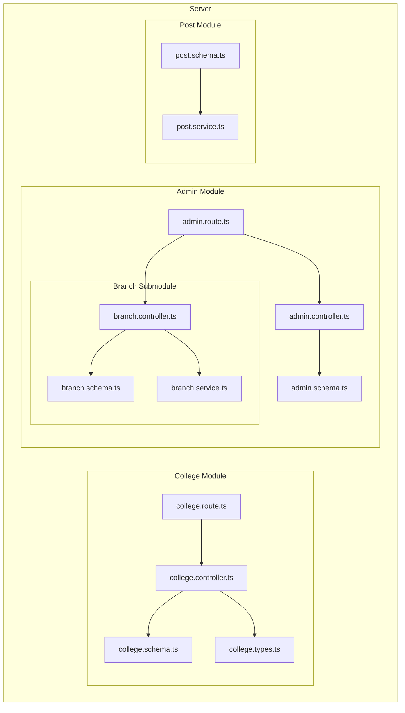
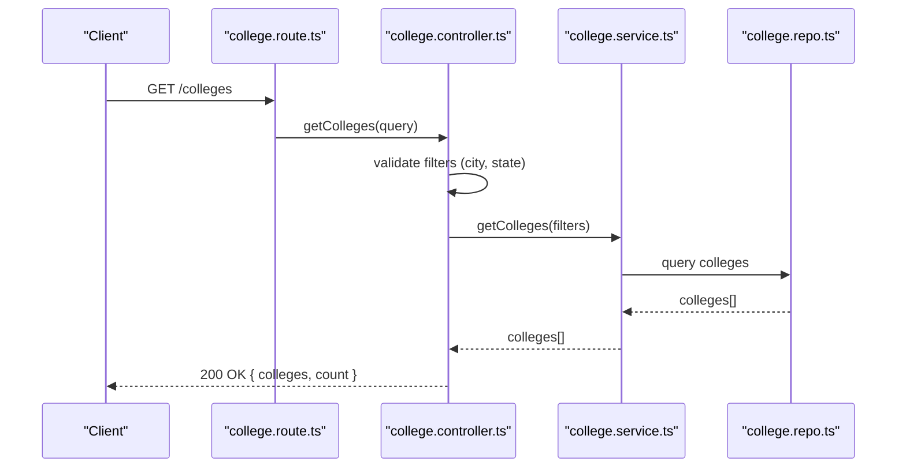
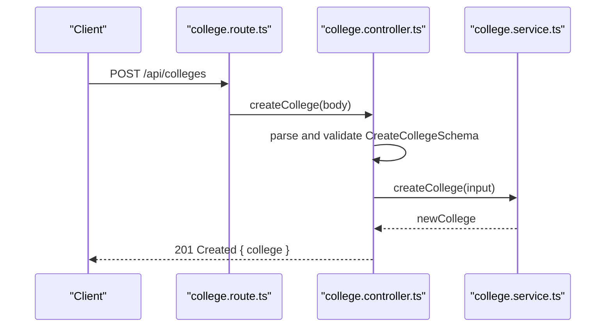
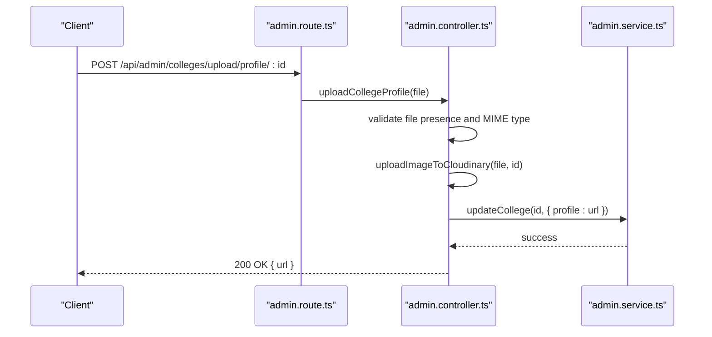
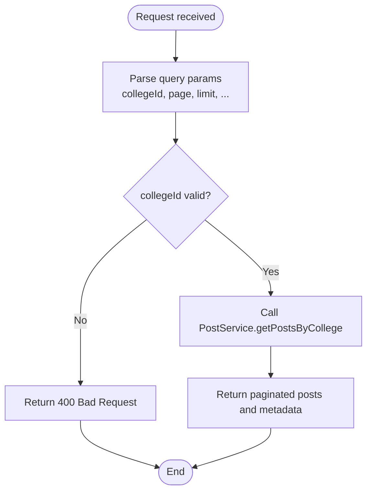
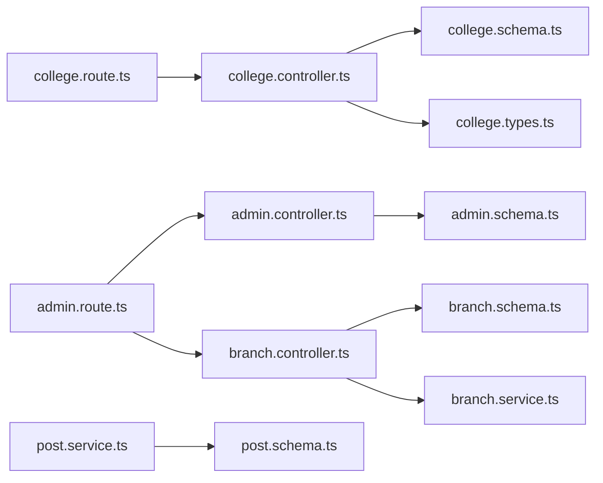

# College & Branch API

<cite>
**Referenced Files in This Document**
- [college.route.ts](file://server/src/modules/college/college.route.ts)
- [college.controller.ts](file://server/src/modules/college/college.controller.ts)
- [college.schema.ts](file://server/src/modules/college/college.schema.ts)
- [college.types.ts](file://server/src/modules/college/college.types.ts)
- [admin.route.ts](file://server/src/modules/admin/admin.route.ts)
- [admin.controller.ts](file://server/src/modules/admin/admin.controller.ts)
- [admin.schema.ts](file://server/src/modules/admin/admin.schema.ts)
- [branch.controller.ts](file://server/src/modules/admin/branch/branch.controller.ts)
- [branch.schema.ts](file://server/src/modules/admin/branch/branch.schema.ts)
- [branch.service.ts](file://server/src/modules/admin/branch/branch.service.ts)
- [post.schema.ts](file://server/src/modules/post/post.schema.ts)
- [post.service.ts](file://server/src/modules/post/post.service.ts)
- [College.ts (shared)](file://server/src/shared/types/College.ts)
- [College.ts (web)](file://web/src/types/College.ts)
</cite>

## Table of Contents
1. [Introduction](#introduction)
2. [Project Structure](#project-structure)
3. [Core Components](#core-components)
4. [Architecture Overview](#architecture-overview)
5. [Detailed Component Analysis](#detailed-component-analysis)
6. [Dependency Analysis](#dependency-analysis)
7. [Performance Considerations](#performance-considerations)
8. [Troubleshooting Guide](#troubleshooting-guide)
9. [Conclusion](#conclusion)
10. [Appendices](#appendices)

## Introduction
This document provides comprehensive API documentation for institutional organization endpoints focused on colleges and branches. It covers:
- College management: listing, creation, updates, deletion, and retrieval by ID
- Branch management: creation, updates, deletion, and retrieval
- College-branch relationships and filtering of posts by college and branch
- Administrative workflows for managing colleges and branches
- Access controls, validation rules, and error handling

The documentation includes endpoint definitions, request/response schemas, operational flows, and practical examples for enrollment and administrative oversight.

## Project Structure
The institutional organization APIs are implemented under the server module with clear separation of concerns:
- College endpoints: route, controller, service, schema, and types
- Admin endpoints: route, controller, service, and schemas for administrative functions
- Branch endpoints: route, controller, service, and schema
- Post filtering: schemas and service supporting college and branch-based queries

**Diagram sources**
- [college.route.ts](file://server/src/modules/college/college.route.ts#L1-L19)
- [college.controller.ts](file://server/src/modules/college/college.controller.ts#L1-L109)
- [college.schema.ts](file://server/src/modules/college/college.schema.ts#L1-L67)
- [college.types.ts](file://server/src/modules/college/college.types.ts#L1-L28)
- [admin.route.ts](file://server/src/modules/admin/admin.route.ts#L1-L41)
- [admin.controller.ts](file://server/src/modules/admin/admin.controller.ts#L1-L125)
- [admin.schema.ts](file://server/src/modules/admin/admin.schema.ts#L1-L69)
- [branch.controller.ts](file://server/src/modules/admin/branch/branch.controller.ts#L1-L34)
- [branch.schema.ts](file://server/src/modules/admin/branch/branch.schema.ts#L1-L26)
- [branch.service.ts](file://server/src/modules/admin/branch/branch.service.ts#L1-L31)
- [post.schema.ts](file://server/src/modules/post/post.schema.ts#L1-L122)
- [post.service.ts](file://server/src/modules/post/post.service.ts#L1-L451)

**Section sources**
- [college.route.ts](file://server/src/modules/college/college.route.ts#L1-L19)
- [admin.route.ts](file://server/src/modules/admin/admin.route.ts#L1-L41)

## Core Components
- College endpoints: expose CRUD operations for colleges and retrieval of related branches and requests
- Admin endpoints: provide administrative controls for colleges and branches, including bulk operations and profile uploads
- Branch endpoints: support CRUD operations for branch entities
- Post filtering: enable filtering posts by college and branch identifiers

Key responsibilities:
- Validation via Zod schemas
- Role-based access control (RBAC) for administrative endpoints
- Rate limiting middleware applied to API routes
- Response formatting via a unified HTTP response handler

**Section sources**
- [college.controller.ts](file://server/src/modules/college/college.controller.ts#L1-L109)
- [admin.controller.ts](file://server/src/modules/admin/admin.controller.ts#L1-L125)
- [branch.controller.ts](file://server/src/modules/admin/branch/branch.controller.ts#L1-L34)
- [post.service.ts](file://server/src/modules/post/post.service.ts#L145-L193)

## Architecture Overview
The API follows a layered architecture:
- Routes define endpoints and apply middleware (authentication, role checks, rate limits)
- Controllers handle request parsing, delegation to services, and response construction
- Services encapsulate business logic and interact with repositories/data stores
- Schemas enforce strict input validation and error reporting
- Shared types define consistent interfaces across modules

**Diagram sources**
- [college.route.ts](file://server/src/modules/college/college.route.ts#L10-L11)
- [college.controller.ts](file://server/src/modules/college/college.controller.ts#L26-L37)
- [college.schema.ts](file://server/src/modules/college/college.schema.ts#L32-L35)

**Section sources**
- [college.route.ts](file://server/src/modules/college/college.route.ts#L1-L19)
- [college.controller.ts](file://server/src/modules/college/college.controller.ts#L1-L109)

## Detailed Component Analysis

### College Endpoints
- Base path: /api/colleges
- Public listing and retrieval
- Administrative creation, updates, and deletion

Endpoints:
- POST /api/colleges
  - Description: Create a new college
  - Authentication: Admin-only
  - Request body: CreateCollegeSchema
  - Response: Created college object
- GET /api/colleges
  - Description: List colleges with optional city/state filters
  - Query params: city (optional), state (optional)
  - Response: Array of colleges and count
- GET /api/colleges/requests
  - Description: Submit a college creation request
  - Request body: CreateCollegeRequestSchema
  - Response: Submitted request object
- GET /api/colleges/:id
  - Description: Retrieve a college by ID
  - Path param: id (UUID)
  - Response: College object
- GET /api/colleges/:id/branches
  - Description: Retrieve branches associated with a college
  - Path param: id (UUID)
  - Response: Array of branches
- PATCH /api/colleges/:id
  - Description: Update a college (admin-only)
  - Path param: id (UUID)
  - Request body: UpdateCollegeSchema
  - Response: Updated college object
- DELETE /api/colleges/:id
  - Description: Delete a college (admin-only)
  - Path param: id (UUID)
  - Response: Success message

Request/Response Schemas:
- CreateCollegeSchema
  - Fields: name*, emailDomain*, city*, state*, profile?, branches?
  - Notes: emailDomain must match a valid domain regex; branches must be UUID array
- UpdateCollegeSchema
  - Fields: name?, emailDomain?, city?, state?, profile?, branches?
  - Notes: Optional fields; emailDomain validated if provided
- CollegeFiltersSchema
  - Fields: city?, state?
- CreateCollegeRequestSchema
  - Fields: name*, emailDomain*, city*, state*, requestedByEmail*
  - Notes: Super-refined to ensure requester email domain matches college email domain
- UpdateCollegeRequestSchema
  - Fields: status* ("pending" | "approved" | "rejected"), resolvedCollegeId?

Operational flow (example: create college):

**Diagram sources**
- [college.route.ts](file://server/src/modules/college/college.route.ts#L10-L10)
- [college.controller.ts](file://server/src/modules/college/college.controller.ts#L8-L24)
- [college.schema.ts](file://server/src/modules/college/college.schema.ts#L3-L13)

**Section sources**
- [college.route.ts](file://server/src/modules/college/college.route.ts#L10-L16)
- [college.controller.ts](file://server/src/modules/college/college.controller.ts#L8-L24)
- [college.schema.ts](file://server/src/modules/college/college.schema.ts#L3-L13)
- [college.types.ts](file://server/src/modules/college/college.types.ts#L1-L8)

### Admin Endpoints (Institutional Management)
- Base path: /api/admin
- Admin-only endpoints for managing colleges and branches
- Includes dashboard overview, logs, reports, and feedback retrieval

Endpoints:
- GET /api/admin/dashboard/overview
  - Description: Fetch dashboard overview metrics
  - Response: Overview data
- GET /api/admin/manage/users/query
  - Description: Query users by username/email
  - Query params: username?, email?
  - Response: Users list
- GET /api/admin/manage/reports
  - Description: Fetch reports with pagination and status filter
  - Query params: page, limit, status (comma-separated)
  - Response: Paginated reports
- GET /api/admin/colleges/get/all
  - Description: Retrieve all colleges
  - Response: Colleges list
- GET /api/admin/college-requests
  - Description: Retrieve all college requests
  - Response: Requests list
- POST /api/admin/colleges/create
  - Description: Create a college (admin)
  - Request body: CreateCollegeSchema
  - Response: Created college
- PATCH /api/admin/colleges/update/:id
  - Description: Update a college (admin)
  - Path param: id (UUID)
  - Request body: UpdateCollegeSchema
  - Response: Updated college
- PATCH /api/admin/college-requests/:id
  - Description: Update a college request (admin)
  - Path param: id (UUID)
  - Request body: UpdateCollegeRequestSchema
  - Response: Updated request
- POST /api/admin/colleges/upload/profile/:id
  - Description: Upload college profile image
  - Path param: id (UUID)
  - Form-data: profile (image)
  - Response: Uploaded image metadata

Branch endpoints:
- GET /api/admin/branches/all
  - Description: Retrieve all branches
  - Response: Branches list
- POST /api/admin/branches/create
  - Description: Create a branch
  - Request body: CreateBranchSchema
  - Response: Created branch
- PATCH /api/admin/branches/update/:id
  - Description: Update a branch
  - Path param: id (UUID)
  - Request body: UpdateBranchSchema
  - Response: Updated branch
- DELETE /api/admin/branches/delete/:id
  - Description: Delete a branch
  - Path param: id (UUID)
  - Response: Success message

Request/Response Schemas:
- CreateCollegeSchema (admin)
  - Fields: name*, emailDomain*, city*, state*, profile?, branches?
- UpdateCollegeSchema (admin)
  - Fields: name?, emailDomain?, city?, state?, profile?, branches?
- CreateBranchSchema
  - Fields: name*, code*
- UpdateBranchSchema
  - Fields: name?, code?
- BranchIdSchema
  - Fields: id (UUID)
- GetLogsQuerySchema
  - Fields: page, limit, sortBy, sortOrder
- GetReportsQuerySchema
  - Fields: page, limit, status (array), fields?

Operational flow (example: upload college profile):

**Diagram sources**
- [admin.route.ts](file://server/src/modules/admin/admin.route.ts#L26-L30)
- [admin.controller.ts](file://server/src/modules/admin/admin.controller.ts#L103-L121)
- [admin.schema.ts](file://server/src/modules/admin/admin.schema.ts#L31-L40)

**Section sources**
- [admin.route.ts](file://server/src/modules/admin/admin.route.ts#L17-L40)
- [admin.controller.ts](file://server/src/modules/admin/admin.controller.ts#L68-L121)
- [admin.schema.ts](file://server/src/modules/admin/admin.schema.ts#L31-L69)
- [branch.controller.ts](file://server/src/modules/admin/branch/branch.controller.ts#L8-L30)
- [branch.schema.ts](file://server/src/modules/admin/branch/branch.schema.ts#L3-L25)

### Branch Management Endpoints
Branch endpoints support CRUD operations for branch entities. Validation ensures branch names and codes meet minimum length requirements, and IDs are UUID-formatted.

Endpoints:
- GET /api/admin/branches/all
- POST /api/admin/branches/create
- PATCH /api/admin/branches/update/:id
- DELETE /api/admin/branches/delete/:id

Validation:
- CreateBranchSchema: name (min 2 chars), code (min 2 chars)
- UpdateBranchSchema: optional name/code with min-length constraints
- BranchIdSchema: UUID format validation

Service behavior:
- Retrieve all branches
- Insert new branch
- Update branch with timestamps
- Delete branch by ID

**Section sources**
- [branch.controller.ts](file://server/src/modules/admin/branch/branch.controller.ts#L1-L34)
- [branch.schema.ts](file://server/src/modules/admin/branch/branch.schema.ts#L1-L26)
- [branch.service.ts](file://server/src/modules/admin/branch/branch.service.ts#L1-L31)

### College-Branch Relationships and Filtering
- Relationship model: colleges may reference multiple branches via branch IDs
- Filtering: posts can be filtered by collegeId and branch

Filtering schemas:
- GetPostsQuerySchema
  - Fields: page, limit, sortBy, sortOrder, topic, collegeId (UUID), branch (string)
- Post retrieval supports:
  - By college: getPostsByCollege
  - By branch: getPostsByBranch
  - By author: getPostsByAuthor

Operational flow (filter posts by college):

**Diagram sources**
- [post.schema.ts](file://server/src/modules/post/post.schema.ts#L53-L98)
- [post.service.ts](file://server/src/modules/post/post.service.ts#L394-L410)

**Section sources**
- [post.schema.ts](file://server/src/modules/post/post.schema.ts#L53-L106)
- [post.service.ts](file://server/src/modules/post/post.service.ts#L145-L193)
- [post.service.ts](file://server/src/modules/post/post.service.ts#L394-L428)

### Administrative Workflows and Examples
- College enrollment workflow (conceptual):
  - Student selects a college during onboarding
  - System validates collegeId and persists association
  - Example path: client-side selection followed by backend persistence (not shown here)
- Branch selection workflow (conceptual):
  - After selecting a college, student chooses a branch
  - Posts filtered by branch for community-specific content
- Administrative oversight:
  - Admin approves or rejects college requests
  - Admin manages branches and assigns them to colleges
  - Admin monitors logs and reports

[No sources needed since this section provides conceptual workflows]

## Dependency Analysis
The following diagram shows key dependencies among modules:

**Diagram sources**
- [college.route.ts](file://server/src/modules/college/college.route.ts#L1-L19)
- [college.controller.ts](file://server/src/modules/college/college.controller.ts#L1-L109)
- [college.schema.ts](file://server/src/modules/college/college.schema.ts#L1-L67)
- [college.types.ts](file://server/src/modules/college/college.types.ts#L1-L28)
- [admin.route.ts](file://server/src/modules/admin/admin.route.ts#L1-L41)
- [admin.controller.ts](file://server/src/modules/admin/admin.controller.ts#L1-L125)
- [admin.schema.ts](file://server/src/modules/admin/admin.schema.ts#L1-L69)
- [branch.controller.ts](file://server/src/modules/admin/branch/branch.controller.ts#L1-L34)
- [branch.schema.ts](file://server/src/modules/admin/branch/branch.schema.ts#L1-L26)
- [branch.service.ts](file://server/src/modules/admin/branch/branch.service.ts#L1-L31)
- [post.service.ts](file://server/src/modules/post/post.service.ts#L1-L451)
- [post.schema.ts](file://server/src/modules/post/post.schema.ts#L1-L122)

**Section sources**
- [college.route.ts](file://server/src/modules/college/college.route.ts#L1-L19)
- [admin.route.ts](file://server/src/modules/admin/admin.route.ts#L1-L41)
- [post.service.ts](file://server/src/modules/post/post.service.ts#L145-L193)

## Performance Considerations
- Pagination: Queries support page and limit parameters to avoid large payloads
- Sorting: sortBy and sortOrder reduce client-side sorting overhead
- Filtering: Topic normalization and flexible matching improve search relevance
- Caching: Post service increments cache versions on create/update/delete to invalidate stale data
- Rate limiting: Applied at route level to protect endpoints from abuse

[No sources needed since this section provides general guidance]

## Troubleshooting Guide
Common errors and resolutions:
- Validation failures
  - Cause: Invalid schema fields (e.g., invalid UUID, malformed email domain)
  - Resolution: Ensure fields conform to schema requirements
- Not found
  - Cause: College or branch ID does not exist
  - Resolution: Verify IDs and retry
- Unauthorized/Forbidden
  - Cause: Missing authentication or insufficient permissions
  - Resolution: Authenticate and ensure admin role for protected endpoints
- Content policy violations
  - Cause: Post content flagged by moderation
  - Resolution: Edit content to comply with policies

**Section sources**
- [college.controller.ts](file://server/src/modules/college/college.controller.ts#L88-L105)
- [admin.controller.ts](file://server/src/modules/admin/admin.controller.ts#L80-L101)
- [post.service.ts](file://server/src/modules/post/post.service.ts#L12-L38)
- [post.service.ts](file://server/src/modules/post/post.service.ts#L238-L343)

## Conclusion
The institutional organization API provides robust endpoints for managing colleges and branches, enabling administrative oversight and user-driven filtering. Strict validation, role-based access control, and clear schemas ensure reliable operation. The design supports scalable growth and maintainable extension.

[No sources needed since this section summarizes without analyzing specific files]

## Appendices

### Endpoint Reference Summary
- College
  - POST /api/colleges
  - GET /api/colleges
  - GET /api/colleges/requests
  - GET /api/colleges/:id
  - GET /api/colleges/:id/branches
  - PATCH /api/colleges/:id
  - DELETE /api/colleges/:id
- Admin
  - GET /api/admin/dashboard/overview
  - GET /api/admin/manage/users/query
  - GET /api/admin/manage/reports
  - GET /api/admin/colleges/get/all
  - GET /api/admin/college-requests
  - POST /api/admin/colleges/create
  - PATCH /api/admin/colleges/update/:id
  - PATCH /api/admin/college-requests/:id
  - POST /api/admin/colleges/upload/profile/:id
  - GET /api/admin/branches/all
  - POST /api/admin/branches/create
  - PATCH /api/admin/branches/update/:id
  - DELETE /api/admin/branches/delete/:id

**Section sources**
- [college.route.ts](file://server/src/modules/college/college.route.ts#L10-L16)
- [admin.route.ts](file://server/src/modules/admin/admin.route.ts#L17-L40)

### Data Models
- College (shared)
  - Insert type derived from database schema
  - Select type derived from database schema
- College (web)
  - Fields: id, name, profile

**Section sources**
- [College.ts (shared)](file://server/src/shared/types/College.ts#L1-L5)
- [College.ts (web)](file://web/src/types/College.ts#L1-L6)