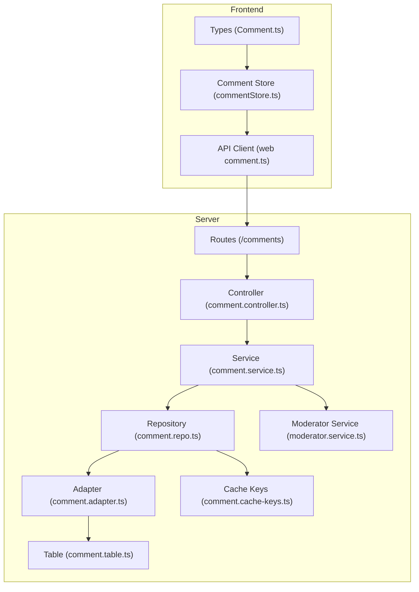
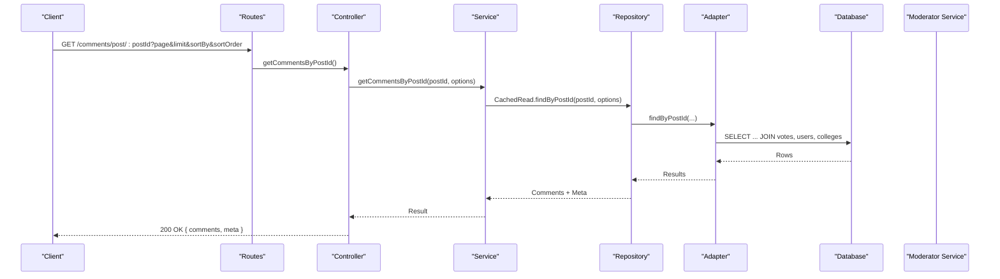
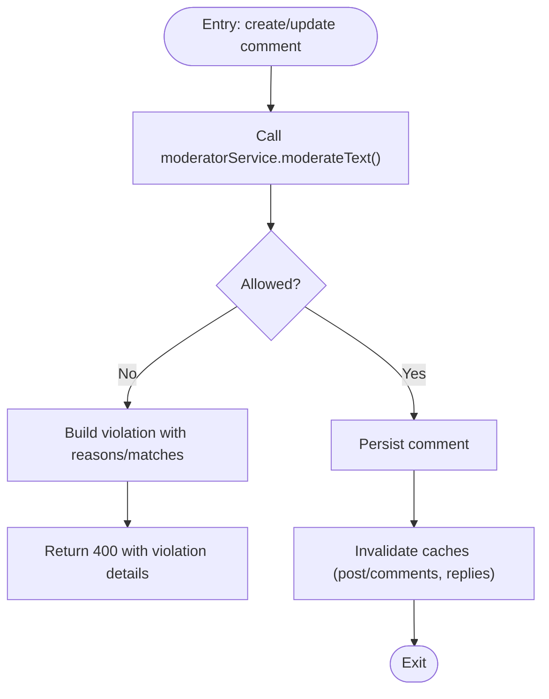
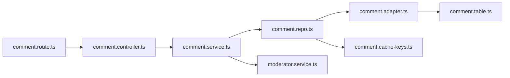
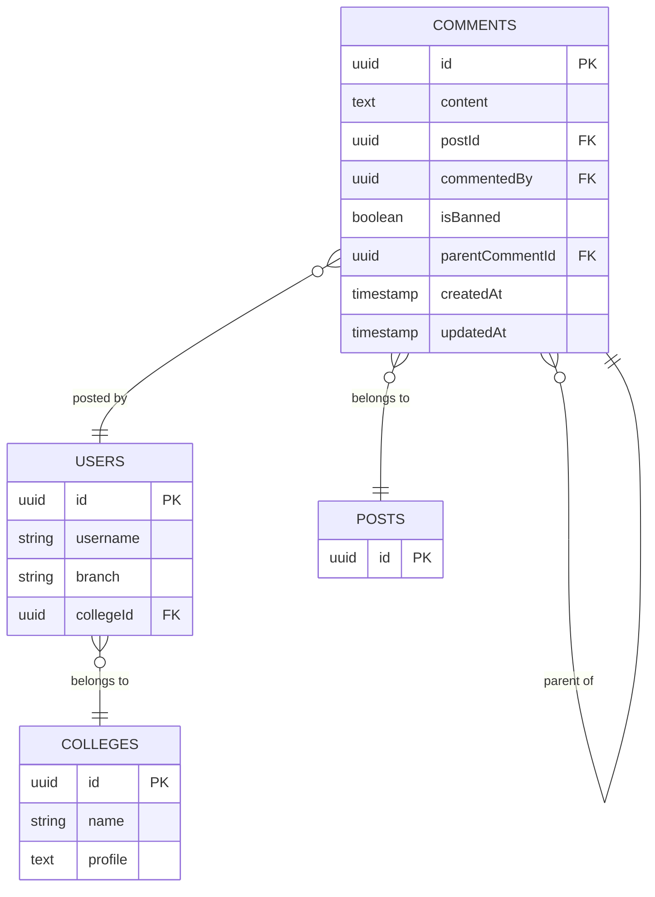

# Comment API

<cite>
**Referenced Files in This Document**
- [comment.controller.ts](file://server/src/modules/comment/comment.controller.ts)
- [comment.service.ts](file://server/src/modules/comment/comment.service.ts)
- [comment.repo.ts](file://server/src/modules/comment/comment.repo.ts)
- [comment.route.ts](file://server/src/modules/comment/comment.route.ts)
- [comment.schema.ts](file://server/src/modules/comment/comment.schema.ts)
- [comment.adapter.ts](file://server/src/infra/db/adapters/comment.adapter.ts)
- [comment.table.ts](file://server/src/infra/db/tables/comment.table.ts)
- [comment.cache-keys.ts](file://server/src/modules/comment/comment.cache-keys.ts)
- [moderator.service.ts](file://server/src/infra/services/moderator/moderator.service.ts)
- [content-moderation.controller.ts](file://server/src/modules/moderation/content/content-moderation.controller.ts)
- [content-moderation.service.ts](file://server/src/modules/moderation/content/content-moderation.service.ts)
- [comment.ts](file://web/src/services/api/comment.ts)
- [commentStore.ts](file://web/src/store/commentStore.ts)
- [comment.ts](file://web/src/types/Comment.ts)
- [useSocket.ts](file://web/src/socket/useSocket.ts)
</cite>

## Table of Contents
1. [Introduction](#introduction)
2. [Project Structure](#project-structure)
3. [Core Components](#core-components)
4. [Architecture Overview](#architecture-overview)
5. [Detailed Component Analysis](#detailed-component-analysis)
6. [Dependency Analysis](#dependency-analysis)
7. [Performance Considerations](#performance-considerations)
8. [Troubleshooting Guide](#troubleshooting-guide)
9. [Conclusion](#conclusion)
10. [Appendices](#appendices)

## Introduction
This document provides comprehensive API documentation for comment management endpoints. It covers comment CRUD operations, nested comment creation and reply management, threaded display, listing with sorting and pagination, editing and deletion, moderation actions, and integration with content moderation and caching. It also outlines request/response schemas, error handling, and operational guidance for moderation workflows, spam detection, and search-like filtering via moderation.

## Project Structure
The comment module is implemented as a layered architecture:
- Routes define HTTP endpoints and middleware.
- Controllers parse requests and delegate to services.
- Services encapsulate business logic, validation, moderation checks, and cache invalidation.
- Repositories abstract data access with caching.
- Adapters map to the database schema.
- Frontend integrates via an API client and a local store.

**Diagram sources**
- [comment.route.ts](file://server/src/modules/comment/comment.route.ts#L1-L32)
- [comment.controller.ts](file://server/src/modules/comment/comment.controller.ts#L1-L79)
- [comment.service.ts](file://server/src/modules/comment/comment.service.ts#L1-L377)
- [comment.repo.ts](file://server/src/modules/comment/comment.repo.ts#L1-L90)
- [comment.adapter.ts](file://server/src/infra/db/adapters/comment.adapter.ts#L1-L280)
- [comment.table.ts](file://server/src/infra/db/tables/comment.table.ts#L1-L22)
- [comment.cache-keys.ts](file://server/src/modules/comment/comment.cache-keys.ts#L1-L39)
- [moderator.service.ts](file://server/src/infra/services/moderator/moderator.service.ts#L1-L642)
- [comment.ts](file://web/src/services/api/comment.ts#L1-L24)
- [commentStore.ts](file://web/src/store/commentStore.ts#L1-L34)
- [comment.ts](file://web/src/types/Comment.ts)

**Section sources**
- [comment.route.ts](file://server/src/modules/comment/comment.route.ts#L1-L32)
- [comment.controller.ts](file://server/src/modules/comment/comment.controller.ts#L1-L79)
- [comment.service.ts](file://server/src/modules/comment/comment.service.ts#L1-L377)
- [comment.repo.ts](file://server/src/modules/comment/comment.repo.ts#L1-L90)
- [comment.adapter.ts](file://server/src/infra/db/adapters/comment.adapter.ts#L1-L280)
- [comment.table.ts](file://server/src/infra/db/tables/comment.table.ts#L1-L22)
- [comment.cache-keys.ts](file://server/src/modules/comment/comment.cache-keys.ts#L1-L39)
- [moderator.service.ts](file://server/src/infra/services/moderator/moderator.service.ts#L1-L642)
- [comment.ts](file://web/src/services/api/comment.ts#L1-L24)
- [commentStore.ts](file://web/src/store/commentStore.ts#L1-L34)

## Core Components
- Routes: Expose endpoints for retrieving a single comment, listing comments by post, and performing authenticated operations (create, update, delete).
- Controller: Parses request bodies and parameters, validates with Zod schemas, and invokes service methods.
- Service: Implements business logic, enforces permissions, performs moderation checks, and manages cache invalidation.
- Repository: Provides cached and uncached reads/writes, with pagination and sorting support.
- Adapter: Maps to the database using Drizzle ORM, including joins for author and college, and vote aggregation.
- Frontend API client and store: Integrate with the backend and manage local state.

**Section sources**
- [comment.route.ts](file://server/src/modules/comment/comment.route.ts#L1-L32)
- [comment.controller.ts](file://server/src/modules/comment/comment.controller.ts#L1-L79)
- [comment.service.ts](file://server/src/modules/comment/comment.service.ts#L1-L377)
- [comment.repo.ts](file://server/src/modules/comment/comment.repo.ts#L1-L90)
- [comment.adapter.ts](file://server/src/infra/db/adapters/comment.adapter.ts#L1-L280)
- [comment.ts](file://web/src/services/api/comment.ts#L1-L24)
- [commentStore.ts](file://web/src/store/commentStore.ts#L1-L34)

## Architecture Overview
The comment API follows a clean architecture with explicit separation of concerns. Requests flow from routes to controllers, then to services, repositories, and adapters. Moderation is integrated centrally via the moderator service, and caching is managed through cache keys to invalidate comment lists and replies efficiently.

**Diagram sources**
- [comment.route.ts](file://server/src/modules/comment/comment.route.ts#L18-L19)
- [comment.controller.ts](file://server/src/modules/comment/comment.controller.ts#L50-L65)
- [comment.service.ts](file://server/src/modules/comment/comment.service.ts#L13-L67)
- [comment.repo.ts](file://server/src/modules/comment/comment.repo.ts#L21-L51)
- [comment.adapter.ts](file://server/src/infra/db/adapters/comment.adapter.ts#L27-L168)

## Detailed Component Analysis

### Endpoints

- GET /comments/:commentId
  - Description: Retrieve a single comment by ID.
  - Authentication: Optional user context enabled.
  - Query parameters: None.
  - Response: 200 OK with comment object.
  - Errors: 404 Not Found if comment not found or banned.

- GET /comments/post/:postId
  - Description: List comments for a post with pagination and sorting.
  - Authentication: Optional user context enabled.
  - Query parameters:
    - page: integer, default 1
    - limit: integer, default 10
    - sortBy: enum "createdAt" | "updatedAt", default "createdAt"
    - sortOrder: enum "asc" | "desc", default "desc"
  - Response: 200 OK with comments array and metadata (total, page, limit, totalPages).
  - Errors: 404 Not Found if post not found or shadow/banned.

- POST /comments/post/:postId
  - Description: Create a new top-level or nested comment.
  - Authentication: Required; terms checked; banned users blocked.
  - Request body: { content: string, parentCommentId: string | null }
  - Response: 201 Created with comment object.
  - Errors: Validation errors, moderation policy violations, unauthorized, invalid parent.

- PATCH /comments/:commentId
  - Description: Edit an existing comment’s content.
  - Authentication: Required; terms checked; banned users blocked.
  - Request body: { content: string }
  - Response: 200 OK with updated comment.
  - Errors: 404 Not Found, 403 Forbidden (authorship), moderation policy violations.

- DELETE /comments/:commentId
  - Description: Delete a comment.
  - Authentication: Required.
  - Response: 200 OK with deletion confirmation.
  - Errors: 404 Not Found, 403 Forbidden (authorship).

**Section sources**
- [comment.route.ts](file://server/src/modules/comment/comment.route.ts#L18-L29)
- [comment.controller.ts](file://server/src/modules/comment/comment.controller.ts#L8-L76)
- [comment.schema.ts](file://server/src/modules/comment/comment.schema.ts#L1-L38)
- [comment.service.ts](file://server/src/modules/comment/comment.service.ts#L13-L67)

### Request/Response Schemas

- Create Comment
  - Request body:
    - content: string (min 1, max 1000)
    - parentCommentId: string | null (UUID)
  - Response:
    - comment: object with fields: id, content, postId, parentCommentId, isBanned, createdAt, updatedAt, commentedBy (with author and college), upvoteCount, downvoteCount, userVote

- Update Comment
  - Request body:
    - content: string (min 1, max 1000)
  - Response:
    - comment: object mirroring create response shape

- Get Comments by Post
  - Query parameters:
    - page: string (parsed to integer, default 1)
    - limit: string (parsed to integer, default 10)
    - sortBy: "createdAt" | "updatedAt" (default "createdAt")
    - sortOrder: "asc" | "desc" (default "desc")
  - Response:
    - comments: array of comment objects
    - meta: { total, page, limit, totalPages }

- Get Comment by ID
  - Path parameter:
    - commentId: UUID
  - Response:
    - comment: object (same shape as create/update)

**Section sources**
- [comment.schema.ts](file://server/src/modules/comment/comment.schema.ts#L3-L37)
- [comment.adapter.ts](file://server/src/infra/db/adapters/comment.adapter.ts#L103-L168)
- [comment.controller.ts](file://server/src/modules/comment/comment.controller.ts#L50-L76)

### Moderation Integration
- Creation and update enforce moderation checks via the moderator service:
  - Dynamic moderation: banned words and patterns.
  - Validator moderation: toxicity and related attributes via external API with fail-closed behavior.
- Violations return structured errors with reasons and optional matches.

**Diagram sources**
- [comment.service.ts](file://server/src/modules/comment/comment.service.ts#L135-L160)
- [comment.service.ts](file://server/src/modules/comment/comment.service.ts#L208-L233)
- [moderator.service.ts](file://server/src/infra/services/moderator/moderator.service.ts#L583-L636)

**Section sources**
- [comment.service.ts](file://server/src/modules/comment/comment.service.ts#L135-L160)
- [comment.service.ts](file://server/src/modules/comment/comment.service.ts#L208-L233)
- [moderator.service.ts](file://server/src/infra/services/moderator/moderator.service.ts#L583-L636)

### Real-time Updates and Notifications
- Real-time notifications are currently disabled in the notification service implementation.
- Socket integration is present in the frontend but not wired in the backend.
- Recommendation: Implement server-side event emission and frontend consumption to notify users of replies and moderation actions.

**Section sources**
- [notification.service.ts](file://server/src/modules/notification/notification.service.ts#L1-L211)
- [useSocket.ts](file://web/src/socket/useSocket.ts#L1-L9)

### Search Functionality
- Comments are filtered by post ID and visibility flags.
- Sorting supports createdAt and updatedAt with ascending or descending order.
- Pagination is supported via page and limit parameters.
- No dedicated text search endpoint is exposed; moderation acts as a filter for policy-compliant content.

**Section sources**
- [comment.adapter.ts](file://server/src/infra/db/adapters/comment.adapter.ts#L27-L168)
- [comment.service.ts](file://server/src/modules/comment/comment.service.ts#L13-L67)

### Comment Threading and Nested Replies
- Parent-child relationship is enforced at creation:
  - parentCommentId must belong to the same post.
  - Parent must exist and not be banned.
  - Block relations are respected for both creator and parent author.
- Replies are invalidated via cache keys upon creation or updates.

**Section sources**
- [comment.service.ts](file://server/src/modules/comment/comment.service.ts#L101-L133)
- [comment.cache-keys.ts](file://server/src/modules/comment/comment.cache-keys.ts#L14-L15)

### Bulk Operations
- No explicit bulk endpoints are defined for comments.
- Moderation actions for comments are handled via a separate moderation controller.

**Section sources**
- [content-moderation.controller.ts](file://server/src/modules/moderation/content/content-moderation.controller.ts#L63-L86)

## Dependency Analysis

**Diagram sources**
- [comment.route.ts](file://server/src/modules/comment/comment.route.ts#L1-L32)
- [comment.controller.ts](file://server/src/modules/comment/comment.controller.ts#L1-L79)
- [comment.service.ts](file://server/src/modules/comment/comment.service.ts#L1-L377)
- [comment.repo.ts](file://server/src/modules/comment/comment.repo.ts#L1-L90)
- [comment.adapter.ts](file://server/src/infra/db/adapters/comment.adapter.ts#L1-L280)
- [comment.table.ts](file://server/src/infra/db/tables/comment.table.ts#L1-L22)
- [comment.cache-keys.ts](file://server/src/modules/comment/comment.cache-keys.ts#L1-L39)
- [moderator.service.ts](file://server/src/infra/services/moderator/moderator.service.ts#L1-L642)

**Section sources**
- [comment.route.ts](file://server/src/modules/comment/comment.route.ts#L1-L32)
- [comment.controller.ts](file://server/src/modules/comment/comment.controller.ts#L1-L79)
- [comment.service.ts](file://server/src/modules/comment/comment.service.ts#L1-L377)
- [comment.repo.ts](file://server/src/modules/comment/comment.repo.ts#L1-L90)
- [comment.adapter.ts](file://server/src/infra/db/adapters/comment.adapter.ts#L1-L280)
- [comment.table.ts](file://server/src/infra/db/tables/comment.table.ts#L1-L22)
- [comment.cache-keys.ts](file://server/src/modules/comment/comment.cache-keys.ts#L1-L39)
- [moderator.service.ts](file://server/src/infra/services/moderator/moderator.service.ts#L1-L642)

## Performance Considerations
- Caching:
  - Post-level comment list and replies are versioned via cache keys to invalidate efficiently after mutations.
  - Queries are cached per page, sort criteria, and user context.
- Database:
  - Vote aggregation is computed via a CTE and left joins to avoid N+1 queries.
  - Sorting and pagination are applied at the database level.
- Moderation:
  - Dynamic banned word matching uses efficient automata; validator moderation caches results and reuses compiled sets.

Recommendations:
- Monitor cache hit rates for comment lists and replies.
- Consider precomputing thread counts or using materialized views if threading becomes complex.
- Apply rate limiting consistently across endpoints.

**Section sources**
- [comment.cache-keys.ts](file://server/src/modules/comment/comment.cache-keys.ts#L6-L35)
- [comment.adapter.ts](file://server/src/infra/db/adapters/comment.adapter.ts#L46-L137)
- [moderator.service.ts](file://server/src/infra/services/moderator/moderator.service.ts#L427-L458)

## Troubleshooting Guide
Common errors and resolutions:
- 400 Bad Request
  - Validation failures: Ensure content length and UUID formats are correct.
  - Moderation policy violation: Adjust content to comply with banned words or toxicity thresholds.
- 401 Unauthorized
  - Authentication required for create/update/delete; ensure user context is present.
- 403 Forbidden
  - Editing/deleting requires ownership; verify the requester is the comment author.
- 404 Not Found
  - Post not found or shadow/banned; comment not found; parent comment missing or banned.
- 429 Too Many Requests
  - Rate limit exceeded; reduce request frequency or adjust limits.

Operational tips:
- For moderation conflicts, review violation details returned in the error payload to identify offending words or attributes.
- If replies are not updating, confirm cache invalidation keys are incremented on mutation.

**Section sources**
- [comment.service.ts](file://server/src/modules/comment/comment.service.ts#L135-L160)
- [comment.service.ts](file://server/src/modules/comment/comment.service.ts#L208-L233)
- [comment.service.ts](file://server/src/modules/comment/comment.service.ts#L235-L266)
- [comment.service.ts](file://server/src/modules/comment/comment.service.ts#L300-L325)
- [comment.route.ts](file://server/src/modules/comment/comment.route.ts#L15-L21)

## Conclusion
The comment API provides robust CRUD capabilities with strong moderation integration, efficient caching, and clear error signaling. While real-time notifications are not yet implemented, the architecture supports easy extension. The moderation pipeline ensures content safety and compliance, and the repository layer offers scalable read/write operations with pagination and sorting.

## Appendices

### Data Model

**Diagram sources**
- [comment.table.ts](file://server/src/infra/db/tables/comment.table.ts#L5-L21)

### Moderation Actions
- Upsert comment state:
  - Endpoint: PATCH /moderation/comments/:commentId
  - Body: { state: "active" | "banned" }
  - Behavior: Unban or ban comment accordingly; shadow-banned posts are handled elsewhere.

**Section sources**
- [content-moderation.controller.ts](file://server/src/modules/moderation/content/content-moderation.controller.ts#L63-L86)
- [content-moderation.service.ts](file://server/src/modules/moderation/content/content-moderation.service.ts#L179-L209)