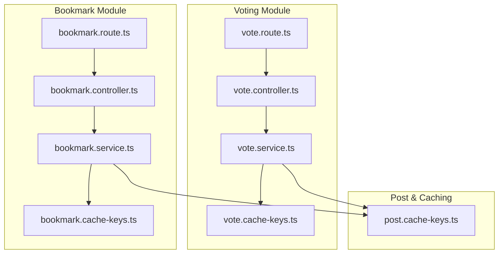
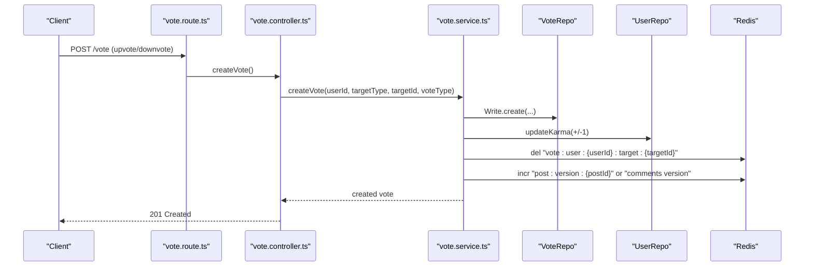
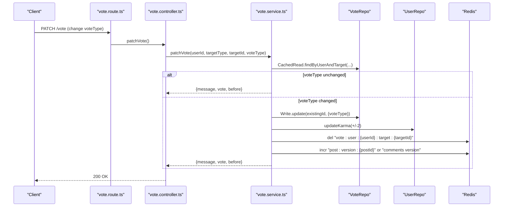
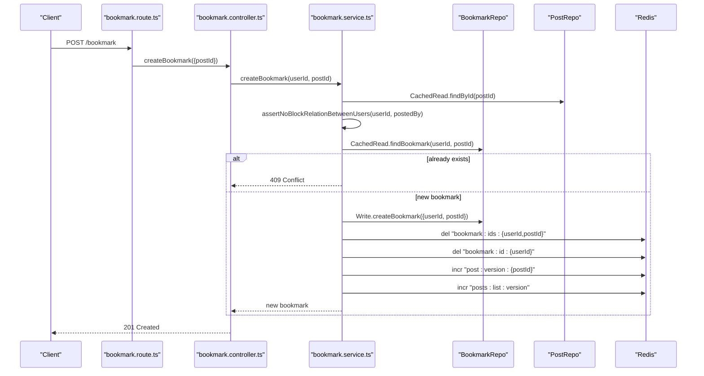
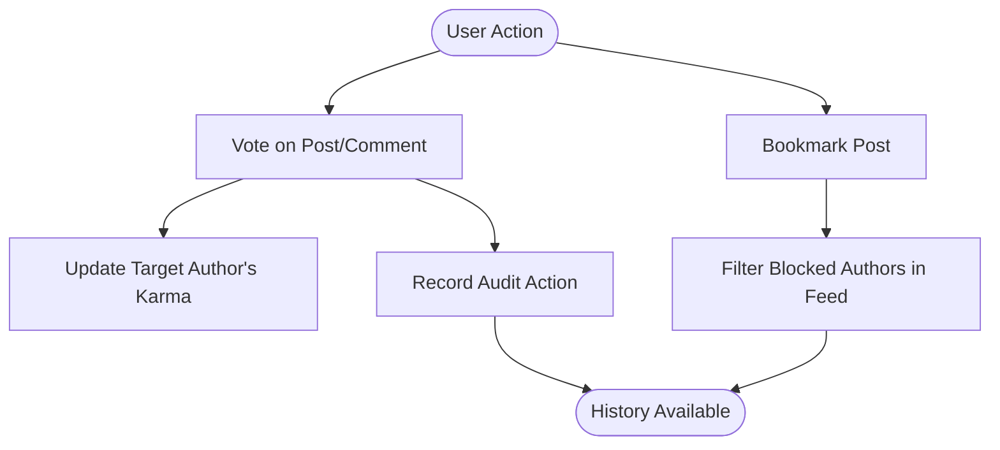
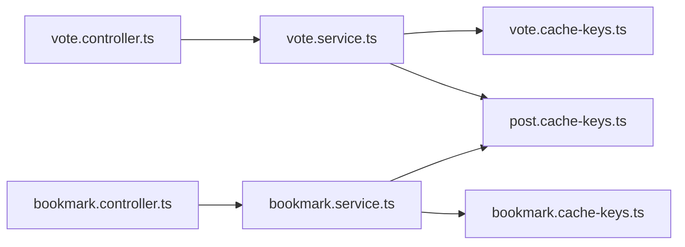

# Interaction API

<cite>
**Referenced Files in This Document**
- [vote.route.ts](file://server/src/modules/vote/vote.route.ts)
- [vote.controller.ts](file://server/src/modules/vote/vote.controller.ts)
- [vote.schema.ts](file://server/src/modules/vote/vote.schema.ts)
- [vote.service.ts](file://server/src/modules/vote/vote.service.ts)
- [vote.cache-keys.ts](file://server/src/modules/vote/vote.cache-keys.ts)
- [bookmark.route.ts](file://server/src/modules/bookmark/bookmark.route.ts)
- [bookmark.controller.ts](file://server/src/modules/bookmark/bookmark.controller.ts)
- [bookmark.schema.ts](file://server/src/modules/bookmark/bookmark.schema.ts)
- [bookmark.service.ts](file://server/src/modules/bookmark/bookmark.service.ts)
- [bookmark.cache-keys.ts](file://server/src/modules/bookmark/bookmark.cache-keys.ts)
- [post.cache-keys.ts](file://server/src/modules/post/post.cache-keys.ts)
- [user.route.ts](file://server/src/modules/user/user.route.ts)
- [user.controller.ts](file://server/src/modules/user/user.controller.ts)
- [user.service.ts](file://server/src/modules/user/user.service.ts)
</cite>

## Table of Contents
1. [Introduction](#introduction)
2. [Project Structure](#project-structure)
3. [Core Components](#core-components)
4. [Architecture Overview](#architecture-overview)
5. [Detailed Component Analysis](#detailed-component-analysis)
6. [Dependency Analysis](#dependency-analysis)
7. [Performance Considerations](#performance-considerations)
8. [Troubleshooting Guide](#troubleshooting-guide)
9. [Conclusion](#conclusion)
10. [Appendices](#appendices)

## Introduction
This document provides comprehensive API documentation for user interaction endpoints focused on:
- Voting system: upvote/downvote operations, score calculation via karma, and vote modification.
- Bookmark management: saving and retrieving saved posts with privacy controls.
- Engagement tracking, interaction history, and preference management.

It covers request/response schemas, real-time interaction updates, caching strategies, performance optimizations, examples, and error handling.

## Project Structure
The Interaction API spans three primary modules:
- Vote: handles voting operations on posts and comments.
- Bookmark: manages saved posts per user with privacy-aware retrieval.
- User: provides profile and blocking controls impacting interactions.

**Diagram sources**
- [vote.route.ts](file://server/src/modules/vote/vote.route.ts#L1-L18)
- [vote.controller.ts](file://server/src/modules/vote/vote.controller.ts#L1-L52)
- [vote.service.ts](file://server/src/modules/vote/vote.service.ts#L1-L315)
- [vote.cache-keys.ts](file://server/src/modules/vote/vote.cache-keys.ts#L1-L7)
- [bookmark.route.ts](file://server/src/modules/bookmark/bookmark.route.ts#L1-L19)
- [bookmark.controller.ts](file://server/src/modules/bookmark/bookmark.controller.ts#L1-L48)
- [bookmark.service.ts](file://server/src/modules/bookmark/bookmark.service.ts#L1-L158)
- [bookmark.cache-keys.ts](file://server/src/modules/bookmark/bookmark.cache-keys.ts#L1-L7)
- [post.cache-keys.ts](file://server/src/modules/post/post.cache-keys.ts#L1-L48)

**Section sources**
- [vote.route.ts](file://server/src/modules/vote/vote.route.ts#L1-L18)
- [bookmark.route.ts](file://server/src/modules/bookmark/bookmark.route.ts#L1-L19)
- [user.route.ts](file://server/src/modules/user/user.route.ts#L1-L32)

## Core Components
- Voting endpoints: create, patch (modify), and delete votes.
- Bookmark endpoints: create, retrieve by post, list user’s bookmarks, and delete.
- Privacy-aware retrieval: blocked users are excluded from bookmarked post feeds.
- Caching: per-user vote targeting, bookmark sets, and post list/version invalidation.

**Section sources**
- [vote.controller.ts](file://server/src/modules/vote/vote.controller.ts#L1-L52)
- [bookmark.controller.ts](file://server/src/modules/bookmark/bookmark.controller.ts#L1-L48)
- [bookmark.service.ts](file://server/src/modules/bookmark/bookmark.service.ts#L62-L90)

## Architecture Overview
High-level flow:
- Routes define HTTP endpoints and apply middleware (rate limit, user context).
- Controllers parse validated inputs and delegate to services.
- Services orchestrate transactions, repository reads/writes, and cache invalidation.
- Repositories interact with the database; caches track versions and keys for invalidation.

**Diagram sources**
- [vote.route.ts](file://server/src/modules/vote/vote.route.ts#L9-L15)
- [vote.controller.ts](file://server/src/modules/vote/vote.controller.ts#L10-L22)
- [vote.service.ts](file://server/src/modules/vote/vote.service.ts#L48-L131)
- [vote.cache-keys.ts](file://server/src/modules/vote/vote.cache-keys.ts#L1-L7)
- [post.cache-keys.ts](file://server/src/modules/post/post.cache-keys.ts#L6-L7)

## Detailed Component Analysis

### Voting Endpoints
- Endpoint: POST /vote
  - Purpose: Create a vote (upvote or downvote) on a post or comment.
  - Authentication: Required user context enforced by middleware pipeline.
  - Request body schema:
    - targetType: Enum ["post", "comment"]
    - targetId: UUID string
    - voteType: Enum ["upvote", "downvote"]
  - Response: Created vote object.
  - Behavior:
    - Validates target existence and resolves target author.
    - Enforces block relation checks between voter and target author.
    - Updates target author’s karma (+1 for upvote, -1 for downvote).
    - Records audit action and invalidates caches for the target and related lists.

- Endpoint: PATCH /vote
  - Purpose: Modify an existing vote (change from upvote to downvote or vice versa).
  - Request body schema: Same as create.
  - Behavior:
    - If the requested voteType equals current, return without changes.
    - Otherwise, update vote and adjust karma by twice the delta (net change of ±2).
    - Audit action logs the switch.
    - Invalidate caches similarly.

- Endpoint: DELETE /vote
  - Purpose: Remove a vote.
  - Request body schema:
    - targetType: Enum ["post", "comment"]
    - targetId: UUID string
  - Behavior:
    - Deletes vote and adjusts karma opposite to the removed vote type.
    - Audit action logs deletion.
    - Invalidate caches.

**Diagram sources**
- [vote.route.ts](file://server/src/modules/vote/vote.route.ts#L14-L15)
- [vote.controller.ts](file://server/src/modules/vote/vote.controller.ts#L40-L48)
- [vote.service.ts](file://server/src/modules/vote/vote.service.ts#L133-L239)
- [vote.cache-keys.ts](file://server/src/modules/vote/vote.cache-keys.ts#L1-L7)
- [post.cache-keys.ts](file://server/src/modules/post/post.cache-keys.ts#L6-L7)

**Section sources**
- [vote.route.ts](file://server/src/modules/vote/vote.route.ts#L7-L15)
- [vote.controller.ts](file://server/src/modules/vote/vote.controller.ts#L10-L48)
- [vote.schema.ts](file://server/src/modules/vote/vote.schema.ts#L1-L14)
- [vote.service.ts](file://server/src/modules/vote/vote.service.ts#L48-L311)
- [vote.cache-keys.ts](file://server/src/modules/vote/vote.cache-keys.ts#L1-L7)

### Bookmark Management Endpoints
- Endpoint: POST /bookmark
  - Purpose: Save a post to the current user’s bookmarks.
  - Request body schema:
    - postId: String (Post identifier)
  - Behavior:
    - Validates post existence and block relation with post author.
    - Prevents duplicate bookmarks (409 Conflict).
    - Invalidates bookmark and post caches and increments post/list versions.

- Endpoint: GET /bookmark/:postId
  - Purpose: Retrieve a bookmark for the current user and a specific post.
  - Path params:
    - postId: String
  - Behavior:
    - Returns bookmark if it exists and post exists; enforces block relation.

- Endpoint: GET /bookmark/user
  - Purpose: List all posts bookmarked by the current user.
  - Behavior:
    - Retrieves bookmarks and filters out posts by users blocked by the current user.
    - Returns count and list of posts.

- Endpoint: DELETE /bookmark/delete/:postId
  - Purpose: Remove a bookmark.
  - Path params:
    - postId: String
  - Behavior:
    - Deletes bookmark, invalidates caches, and increments versions.

**Diagram sources**
- [bookmark.route.ts](file://server/src/modules/bookmark/bookmark.route.ts#L16-L16)
- [bookmark.controller.ts](file://server/src/modules/bookmark/bookmark.controller.ts#L8-L17)
- [bookmark.service.ts](file://server/src/modules/bookmark/bookmark.service.ts#L12-L60)
- [bookmark.cache-keys.ts](file://server/src/modules/bookmark/bookmark.cache-keys.ts#L1-L7)
- [post.cache-keys.ts](file://server/src/modules/post/post.cache-keys.ts#L6-L7)

**Section sources**
- [bookmark.route.ts](file://server/src/modules/bookmark/bookmark.route.ts#L11-L16)
- [bookmark.controller.ts](file://server/src/modules/bookmark/bookmark.controller.ts#L8-L44)
- [bookmark.schema.ts](file://server/src/modules/bookmark/bookmark.schema.ts#L1-L6)
- [bookmark.service.ts](file://server/src/modules/bookmark/bookmark.service.ts#L12-L154)
- [bookmark.cache-keys.ts](file://server/src/modules/bookmark/bookmark.cache-keys.ts#L1-L7)

### Engagement Tracking, Interaction History, and Preference Management
- Engagement tracking:
  - Karma is updated atomically with vote creation/modification/deletion.
  - Audit records capture user actions for compliance/history.
- Interaction history:
  - Audit logs include entity type “vote” and metadata such as targetId/targetType.
- Preference management:
  - Blocking/unblocking users affects visibility in bookmark feeds.
  - User profile updates (e.g., branch) are supported via user endpoints.

**Section sources**
- [vote.service.ts](file://server/src/modules/vote/vote.service.ts#L100-L127)
- [bookmark.service.ts](file://server/src/modules/bookmark/bookmark.service.ts#L75-L89)
- [user.route.ts](file://server/src/modules/user/user.route.ts#L27-L29)
- [user.controller.ts](file://server/src/modules/user/user.controller.ts#L53-L68)
- [user.service.ts](file://server/src/modules/user/user.service.ts#L91-L133)

## Dependency Analysis
- Controllers depend on Zod schemas for input validation and on services for business logic.
- Services depend on repositories for persistence and cache utilities for invalidation.
- Caching keys are centralized to ensure consistent invalidation across vote and bookmark operations.

**Diagram sources**
- [vote.controller.ts](file://server/src/modules/vote/vote.controller.ts#L1-L52)
- [bookmark.controller.ts](file://server/src/modules/bookmark/bookmark.controller.ts#L1-L48)
- [vote.cache-keys.ts](file://server/src/modules/vote/vote.cache-keys.ts#L1-L7)
- [bookmark.cache-keys.ts](file://server/src/modules/bookmark/bookmark.cache-keys.ts#L1-L7)
- [post.cache-keys.ts](file://server/src/modules/post/post.cache-keys.ts#L1-L48)

**Section sources**
- [vote.controller.ts](file://server/src/modules/vote/vote.controller.ts#L1-L52)
- [bookmark.controller.ts](file://server/src/modules/bookmark/bookmark.controller.ts#L1-L48)
- [vote.service.ts](file://server/src/modules/vote/vote.service.ts#L1-L315)
- [bookmark.service.ts](file://server/src/modules/bookmark/bookmark.service.ts#L1-L158)

## Performance Considerations
- Caching strategy:
  - Vote targeting cache keyed by user and target prevents redundant lookups.
  - Post and comments version keys enable cache busting on write operations.
  - Post list version key ensures feed invalidation when votes/bookmarks change.
- Transactional writes:
  - Vote creation/patch/delete occur inside a transaction to maintain consistency.
- Rate limiting:
  - Middleware applied at route level reduces load and abuse risk.

Recommendations:
- Monitor cache hit rates for vote and bookmark keys.
- Consider batch invalidation for bulk operations.
- Use Redis TTLs for ephemeral caches where appropriate.

**Section sources**
- [vote.cache-keys.ts](file://server/src/modules/vote/vote.cache-keys.ts#L1-L7)
- [bookmark.cache-keys.ts](file://server/src/modules/bookmark/bookmark.cache-keys.ts#L1-L7)
- [post.cache-keys.ts](file://server/src/modules/post/post.cache-keys.ts#L6-L7)
- [vote.service.ts](file://server/src/modules/vote/vote.service.ts#L29-L46)
- [bookmark.service.ts](file://server/src/modules/bookmark/bookmark.service.ts#L50-L53)
- [bookmark.route.ts](file://server/src/modules/bookmark/bookmark.route.ts#L8-L9)

## Troubleshooting Guide
Common errors and resolutions:
- Vote not found:
  - Occurs when attempting to patch or delete a non-existent vote.
  - Resolution: Ensure the user has previously voted on the target.
- Target not found:
  - Occurs when voting on a post/comment that does not exist.
  - Resolution: Verify targetId and targetType.
- Permission violation (blocked):
  - Occurs when interacting with a user who has blocked you or whom you have blocked.
  - Resolution: Unblock the user or avoid interactions.
- Duplicate bookmark:
  - Occurs when creating a bookmark that already exists.
  - Resolution: Check existing bookmarks before creating.
- Bookmark not found:
  - Occurs when deleting or retrieving a bookmark that does not belong to the user.
  - Resolution: Confirm postId and user context.

**Section sources**
- [vote.service.ts](file://server/src/modules/vote/vote.service.ts#L148-L155)
- [vote.service.ts](file://server/src/modules/vote/vote.service.ts#L248-L263)
- [bookmark.service.ts](file://server/src/modules/bookmark/bookmark.service.ts#L29-L44)
- [bookmark.service.ts](file://server/src/modules/bookmark/bookmark.service.ts#L95-L105)
- [bookmark.service.ts](file://server/src/modules/bookmark/bookmark.service.ts#L119-L132)

## Conclusion
The Interaction API provides robust, privacy-aware endpoints for voting and bookmarking with strong caching and audit support. By leveraging atomic transactions, targeted cache invalidation, and block-aware retrieval, it ensures correctness, performance, and compliance with user preferences.

## Appendices

### API Definitions

- Voting Endpoints
  - POST /vote
    - Body: targetType, targetId, voteType
    - Responses: 201 Created (created vote), 404 Not Found (target not found), 400 Bad Request (invalid input), 500 Internal Server Error
  - PATCH /vote
    - Body: targetType, targetId, voteType
    - Responses: 200 OK (updated vote), 404 Not Found (no existing vote), 400 Bad Request
  - DELETE /vote
    - Body: targetType, targetId
    - Responses: 200 OK (deleted voteId), 404 Not Found (no existing vote), 400 Bad Request

- Bookmark Endpoints
  - POST /bookmark
    - Body: postId
    - Responses: 201 Created (new bookmark), 409 Conflict (already bookmarked), 404 Not Found (post not found), 400 Bad Request
  - GET /bookmark/:postId
    - Params: postId
    - Responses: 200 OK (bookmark), 404 Not Found (bookmark not found)
  - GET /bookmark/user
    - Responses: 200 OK (posts[], count)
  - DELETE /bookmark/delete/:postId
    - Params: postId
    - Responses: 200 OK (deleted), 404 Not Found (bookmark not found)

- User Interaction and Preferences
  - GET /user/me
    - Responses: 200 OK (user profile)
  - PATCH /user/me
    - Body: branch
    - Responses: 200 OK (updated user), 404 Not Found
  - POST /user/block/:userId
    - Responses: 200 OK (blocked: true), 400 Bad Request (self-block), 404 Not Found
  - POST /user/unblock/:userId
    - Responses: 200 OK (blocked: false), 404 Not Found
  - GET /user/blocked
    - Responses: 200 OK (blocked users)

**Section sources**
- [vote.route.ts](file://server/src/modules/vote/vote.route.ts#L9-L15)
- [bookmark.route.ts](file://server/src/modules/bookmark/bookmark.route.ts#L11-L16)
- [user.route.ts](file://server/src/modules/user/user.route.ts#L21-L29)

### Request/Response Schemas

- Vote Creation/Patch
  - targetType: Enum ["post", "comment"]
  - targetId: UUID string
  - voteType: Enum ["upvote", "downvote"]

- Bookmark Creation
  - postId: String

- Vote Deletion
  - targetType: Enum ["post", "comment"]
  - targetId: UUID string

**Section sources**
- [vote.schema.ts](file://server/src/modules/vote/vote.schema.ts#L1-L14)
- [bookmark.schema.ts](file://server/src/modules/bookmark/bookmark.schema.ts#L1-L6)

### Examples

- Vote Validation
  - Ensure targetType and targetId match the intended resource; voteType must be one of the allowed values.
  - Example path: [InsertVoteSchema](file://server/src/modules/vote/vote.schema.ts#L11-L13)

- Bookmark Privacy Settings
  - Bookmarked posts exclude content from users who have blocked the current user.
  - Example path: [getUserBookmarkedPosts filtering](file://server/src/modules/bookmark/bookmark.service.ts#L75-L89)

- Interaction Analytics
  - Audit logs capture user actions (e.g., user:upvoted:post, user:switched:vote:on:post).
  - Example path: [Audit recording in vote service](file://server/src/modules/vote/vote.service.ts#L113-L124)

**Section sources**
- [vote.schema.ts](file://server/src/modules/vote/vote.schema.ts#L1-L14)
- [bookmark.service.ts](file://server/src/modules/bookmark/bookmark.service.ts#L75-L89)
- [vote.service.ts](file://server/src/modules/vote/vote.service.ts#L113-L124)