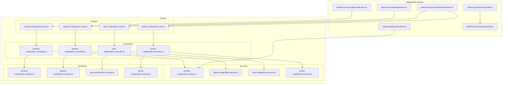
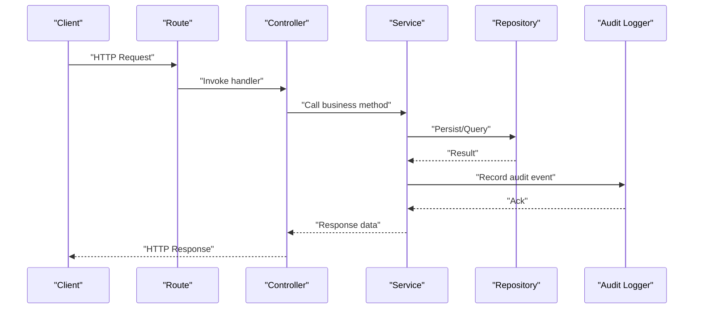
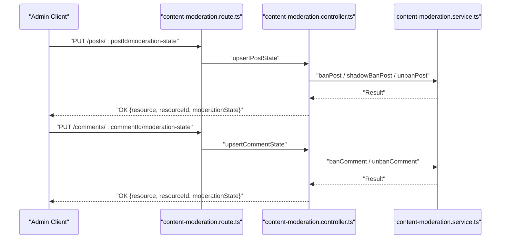
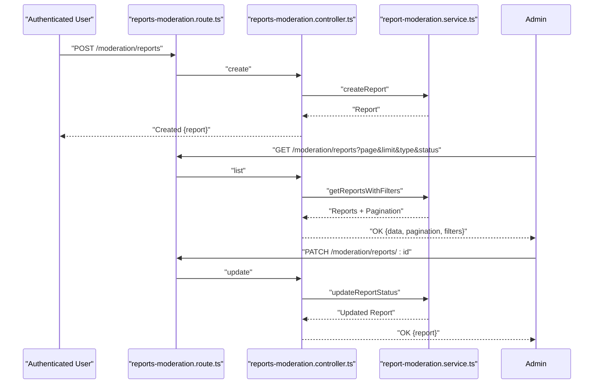
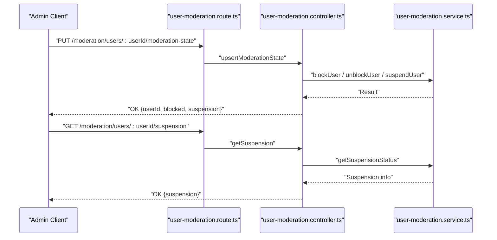
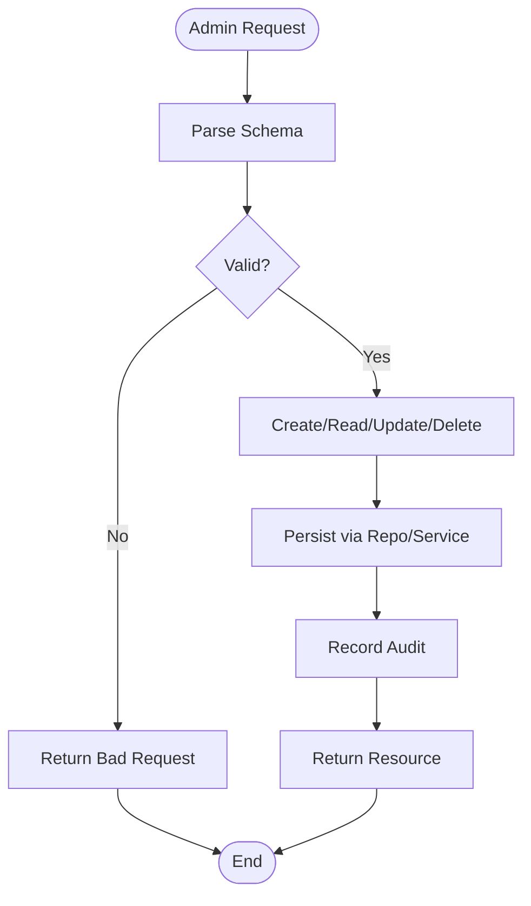
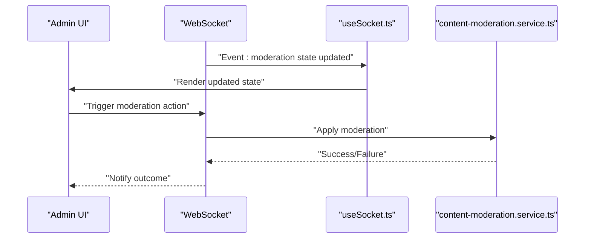
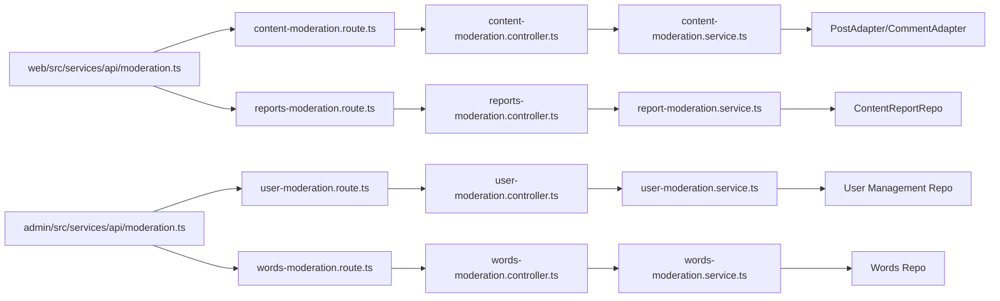

# Moderation API

<cite>
**Referenced Files in This Document**
- [content-moderation.controller.ts](file://server/src/modules/moderation/content/content-moderation.controller.ts)
- [content-moderation.route.ts](file://server/src/modules/moderation/content/content-moderation.route.ts)
- [content-moderation.schema.ts](file://server/src/modules/moderation/content/content-moderation.schema.ts)
- [content-moderation.service.ts](file://server/src/modules/moderation/content/content-moderation.service.ts)
- [reports-moderation.controller.ts](file://server/src/modules/moderation/reports/reports-moderation.controller.ts)
- [reports-moderation.route.ts](file://server/src/modules/moderation/reports/reports-moderation.route.ts)
- [reports-moderation.schema.ts](file://server/src/modules/moderation/reports/reports-moderation.schema.ts)
- [report-moderation.service.ts](file://server/src/modules/moderation/reports/report-moderation.service.ts)
- [user-moderation.controller.ts](file://server/src/modules/moderation/user/user-moderation.controller.ts)
- [user-moderation.route.ts](file://server/src/modules/moderation/user/user-moderation.route.ts)
- [user-moderation.schema.ts](file://server/src/modules/moderation/user/user-moderation.schema.ts)
- [user-moderation.service.ts](file://server/src/modules/moderation/user/user-moderation.service.ts)
- [words-moderation.controller.ts](file://server/src/modules/moderation/words/words-moderation.controller.ts)
- [words-moderation.route.ts](file://server/src/modules/moderation/words/words-moderation.route.ts)
- [words-moderation.schema.ts](file://server/src/modules/moderation/words/words-moderation.schema.ts)
- [words-moderation.service.ts](file://server/src/modules/moderation/words/words-moderation.service.ts)
- [words-moderation.repo.ts](file://server/src/modules/moderation/words/words-moderation.repo.ts)
- [moderation.ts](file://admin/src/services/api/moderation.ts)
- [moderation.ts](file://web/src/services/api/moderation.ts)
- [report.ts](file://web/src/services/api/report.ts)
- [moderation.ts](file://web/src/utils/moderation.ts)
- [SocketContext.tsx](file://admin/src/socket/SocketContext.tsx)
- [useSocket.ts](file://admin/src/socket/useSocket.ts)
- [useSocket.ts](file://web/src/socket/useSocket.ts)
</cite>

## Table of Contents
1. [Introduction](#introduction)
2. [Project Structure](#project-structure)
3. [Core Components](#core-components)
4. [Architecture Overview](#architecture-overview)
5. [Detailed Component Analysis](#detailed-component-analysis)
6. [Dependency Analysis](#dependency-analysis)
7. [Performance Considerations](#performance-considerations)
8. [Troubleshooting Guide](#troubleshooting-guide)
9. [Conclusion](#conclusion)
10. [Appendices](#appendices)

## Introduction
This document provides comprehensive API documentation for the content moderation system. It covers automated filtering, manual review workflows, content flagging, reporting resolution tracking, banned words management, and user moderation actions. It also documents request/response schemas, real-time moderation updates, appeal processes, and administrative dashboards. The goal is to enable developers and administrators to integrate, operate, and troubleshoot the moderation endpoints effectively.

## Project Structure
The moderation subsystem is organized by domain:
- Content moderation: posts and comments lifecycle controls (ban, unban, shadow ban).
- Reporting system: report creation, filtering, status updates, bulk deletion.
- User moderation: blocking/unblocking and suspension management.
- Banned words management: CRUD operations for word filtering rules.

**Diagram sources**
- [content-moderation.route.ts](file://server/src/modules/moderation/content/content-moderation.route.ts#L1-L21)
- [reports-moderation.route.ts](file://server/src/modules/moderation/reports/reports-moderation.route.ts#L1-L35)
- [user-moderation.route.ts](file://server/src/modules/moderation/user/user-moderation.route.ts#L1-L20)
- [words-moderation.route.ts](file://server/src/modules/moderation/words/words-moderation.route.ts#L1-L200)
- [content-moderation.controller.ts](file://server/src/modules/moderation/content/content-moderation.controller.ts#L1-L90)
- [reports-moderation.controller.ts](file://server/src/modules/moderation/reports/reports-moderation.controller.ts#L1-L86)
- [user-moderation.controller.ts](file://server/src/modules/moderation/user/user-moderation.controller.ts#L1-L82)
- [words-moderation.controller.ts](file://server/src/modules/moderation/words/words-moderation.controller.ts#L1-L200)
- [content-moderation.service.ts](file://server/src/modules/moderation/content/content-moderation.service.ts#L1-L252)
- [report-moderation.service.ts](file://server/src/modules/moderation/reports/report-moderation.service.ts#L1-L177)
- [user-moderation.service.ts](file://server/src/modules/moderation/user/user-moderation.service.ts#L1-L200)
- [words-moderation.service.ts](file://server/src/modules/moderation/words/words-moderation.service.ts#L1-L200)
- [content-moderation.schema.ts](file://server/src/modules/moderation/content/content-moderation.schema.ts#L1-L18)
- [reports-moderation.schema.ts](file://server/src/modules/moderation/reports/reports-moderation.schema.ts#L1-L44)
- [user-moderation.schema.ts](file://server/src/modules/moderation/user/user-moderation.schema.ts#L1-L200)
- [words-moderation.schema.ts](file://server/src/modules/moderation/words/words-moderation.schema.ts#L1-L200)
- [moderation.ts](file://web/src/services/api/moderation.ts#L1-L200)
- [report.ts](file://web/src/services/api/report.ts#L1-L200)
- [moderation.ts](file://admin/src/services/api/moderation.ts#L1-L200)
- [moderation.ts](file://web/src/utils/moderation.ts#L1-L200)
- [useSocket.ts](file://web/src/socket/useSocket.ts#L1-L200)
- [useSocket.ts](file://admin/src/socket/useSocket.ts#L1-L200)

**Section sources**
- [content-moderation.route.ts](file://server/src/modules/moderation/content/content-moderation.route.ts#L1-L21)
- [reports-moderation.route.ts](file://server/src/modules/moderation/reports/reports-moderation.route.ts#L1-L35)
- [user-moderation.route.ts](file://server/src/modules/moderation/user/user-moderation.route.ts#L1-L20)
- [words-moderation.route.ts](file://server/src/modules/moderation/words/words-moderation.route.ts#L1-L200)

## Core Components
- Content moderation endpoints manage post/comment states (active, banned, shadow_banned for posts; active/banned for comments).
- Reporting endpoints support creation, listing, filtering, updating status, and bulk deletion of reports.
- User moderation endpoints handle blocking/unblocking and suspension administration.
- Banned words management endpoints provide CRUD operations for word filtering rules.
- Real-time updates via WebSocket are integrated in both admin and web clients.

**Section sources**
- [content-moderation.controller.ts](file://server/src/modules/moderation/content/content-moderation.controller.ts#L29-L87)
- [reports-moderation.controller.ts](file://server/src/modules/moderation/reports/reports-moderation.controller.ts#L6-L83)
- [user-moderation.controller.ts](file://server/src/modules/moderation/user/user-moderation.controller.ts#L26-L79)
- [words-moderation.controller.ts](file://server/src/modules/moderation/words/words-moderation.controller.ts#L1-L200)

## Architecture Overview
The moderation API follows a layered architecture:
- Routes define HTTP endpoints and apply middleware (authentication, role checks).
- Controllers parse requests, enforce schemas, and orchestrate service calls.
- Services encapsulate business logic, database operations, and audit logging.
- Repositories abstract persistence; schemas validate inputs.
- Clients (web/admin) consume APIs and receive real-time updates.

**Diagram sources**
- [content-moderation.route.ts](file://server/src/modules/moderation/content/content-moderation.route.ts#L1-L21)
- [reports-moderation.route.ts](file://server/src/modules/moderation/reports/reports-moderation.route.ts#L1-L35)
- [user-moderation.route.ts](file://server/src/modules/moderation/user/user-moderation.route.ts#L1-L20)
- [content-moderation.controller.ts](file://server/src/modules/moderation/content/content-moderation.controller.ts#L29-L87)
- [reports-moderation.controller.ts](file://server/src/modules/moderation/reports/reports-moderation.controller.ts#L6-L83)
- [user-moderation.controller.ts](file://server/src/modules/moderation/user/user-moderation.controller.ts#L26-L79)
- [content-moderation.service.ts](file://server/src/modules/moderation/content/content-moderation.service.ts#L1-L252)
- [report-moderation.service.ts](file://server/src/modules/moderation/reports/report-moderation.service.ts#L1-L177)
- [user-moderation.service.ts](file://server/src/modules/moderation/user/user-moderation.service.ts#L1-L200)

## Detailed Component Analysis

### Content Moderation Endpoints
- Purpose: Automated and manual control of post/comment states.
- Endpoints:
  - PUT /moderation/posts/:postId/moderation-state
  - PUT /moderation/comments/:commentId/moderation-state
- Authentication and roles: Requires authentication and admin/superadmin roles.
- Request body schemas:
  - Post state: active, banned, shadow_banned
  - Comment state: active, banned
- Behavior:
  - Setting state to active removes bans and shadow bans.
  - Setting state to banned removes shadow ban and applies ban.
  - Setting state to shadow_banned removes ban and applies shadow ban.
- Responses:
  - On success: OK with resource type, resource ID, and new moderation state.
- Error handling:
  - Best-effort attempts to avoid throwing on certain pre-existing states.

**Diagram sources**
- [content-moderation.route.ts](file://server/src/modules/moderation/content/content-moderation.route.ts#L11-L18)
- [content-moderation.controller.ts](file://server/src/modules/moderation/content/content-moderation.controller.ts#L31-L86)
- [content-moderation.service.ts](file://server/src/modules/moderation/content/content-moderation.service.ts#L8-L248)

**Section sources**
- [content-moderation.route.ts](file://server/src/modules/moderation/content/content-moderation.route.ts#L7-L18)
- [content-moderation.controller.ts](file://server/src/modules/moderation/content/content-moderation.controller.ts#L29-L87)
- [content-moderation.schema.ts](file://server/src/modules/moderation/content/content-moderation.schema.ts#L3-L17)
- [content-moderation.service.ts](file://server/src/modules/moderation/content/content-moderation.service.ts#L8-L248)

### Reporting System Endpoints
- Purpose: Allow users to submit reports and enable admins to manage reports.
- Endpoints:
  - POST /moderation/reports (authenticated, onboarded, non-banned user)
  - GET /moderation/reports (admin/superadmin)
  - GET /moderation/reports/users/:userId (admin/superadmin)
  - GET /moderation/reports/:id (admin/superadmin)
  - PATCH /moderation/reports/:id (admin/superadmin)
  - DELETE /moderation/reports/:id (admin/superadmin)
  - POST /moderation/reports/bulk-deletion (admin/superadmin)
- Request body schemas:
  - Create: targetId (UUID), type ("Post" | "Comment"), reason (string), message (string)
  - Filters: page, limit, type ("Post" | "Comment" | "Both"), status (comma-separated enum)
  - Update: status ("pending" | "resolved" | "ignored")
  - Bulk delete: reportIds (array of UUIDs)
- Responses:
  - Create: Created with report object
  - List: OK with reports array, pagination metadata, and applied filters
  - Get by ID: OK with single report
  - Update/Delete/Bulk Delete: OK with operation result
- Audit:
  - Audit events recorded for report creation and status updates.

**Diagram sources**
- [reports-moderation.route.ts](file://server/src/modules/moderation/reports/reports-moderation.route.ts#L17-L32)
- [reports-moderation.controller.ts](file://server/src/modules/moderation/reports/reports-moderation.controller.ts#L8-L68)
- [reports-moderation.schema.ts](file://server/src/modules/moderation/reports/reports-moderation.schema.ts#L5-L43)
- [report-moderation.service.ts](file://server/src/modules/moderation/reports/report-moderation.service.ts#L10-L123)

**Section sources**
- [reports-moderation.route.ts](file://server/src/modules/moderation/reports/reports-moderation.route.ts#L14-L32)
- [reports-moderation.controller.ts](file://server/src/modules/moderation/reports/reports-moderation.controller.ts#L6-L83)
- [reports-moderation.schema.ts](file://server/src/modules/moderation/reports/reports-moderation.schema.ts#L5-L43)
- [report-moderation.service.ts](file://server/src/modules/moderation/reports/report-moderation.service.ts#L8-L177)

### User Moderation Endpoints
- Purpose: Admin-controlled user safety actions including blocking/unblocking and suspensions.
- Endpoints:
  - GET /moderation/users (admin/superadmin)
  - GET /moderation/users/search (admin/superadmin)
  - PUT /moderation/users/:userId/moderation-state (admin/superadmin)
  - GET /moderation/users/:userId/suspension (admin/superadmin)
- Request body schemas:
  - Upsert moderation state: blocked (boolean), suspension (object with ends and reason)
  - Search query: filters parsed by user-moderation.schema
- Responses:
  - List/Search: OK with users data
  - Upsert: OK with userId, blocked flag, and optional suspension
  - Suspension: OK with suspension status
- Error handling:
  - Best-effort attempts to avoid throwing on certain pre-existing states.

**Diagram sources**
- [user-moderation.route.ts](file://server/src/modules/moderation/user/user-moderation.route.ts#L11-L17)
- [user-moderation.controller.ts](file://server/src/modules/moderation/user/user-moderation.controller.ts#L48-L78)
- [user-moderation.schema.ts](file://server/src/modules/moderation/user/user-moderation.schema.ts#L1-L200)
- [user-moderation.service.ts](file://server/src/modules/moderation/user/user-moderation.service.ts#L1-L200)

**Section sources**
- [user-moderation.route.ts](file://server/src/modules/moderation/user/user-moderation.route.ts#L7-L17)
- [user-moderation.controller.ts](file://server/src/modules/moderation/user/user-moderation.controller.ts#L26-L79)
- [user-moderation.schema.ts](file://server/src/modules/moderation/user/user-moderation.schema.ts#L1-L200)
- [user-moderation.service.ts](file://server/src/modules/moderation/user/user-moderation.service.ts#L1-L200)

### Banned Words Management Endpoints
- Purpose: Manage word filtering rules and blacklists.
- Endpoints:
  - CRUD endpoints for banned words (defined in words module route/controller/service/schema).
- Authentication and roles: Admin/superadmin required.
- Request body schemas:
  - Word insert/update: validated by words-moderation.schema.
- Responses:
  - Standard CRUD responses with created/updated/deleted resources.
- Notes:
  - Implementation details are defined in the words module files.

**Diagram sources**
- [words-moderation.route.ts](file://server/src/modules/moderation/words/words-moderation.route.ts#L1-L200)
- [words-moderation.controller.ts](file://server/src/modules/moderation/words/words-moderation.controller.ts#L1-L200)
- [words-moderation.schema.ts](file://server/src/modules/moderation/words/words-moderation.schema.ts#L1-L200)
- [words-moderation.service.ts](file://server/src/modules/moderation/words/words-moderation.service.ts#L1-L200)
- [words-moderation.repo.ts](file://server/src/modules/moderation/words/words-moderation.repo.ts#L1-L200)

**Section sources**
- [words-moderation.route.ts](file://server/src/modules/moderation/words/words-moderation.route.ts#L1-L200)
- [words-moderation.controller.ts](file://server/src/modules/moderation/words/words-moderation.controller.ts#L1-L200)
- [words-moderation.schema.ts](file://server/src/modules/moderation/words/words-moderation.schema.ts#L1-L200)
- [words-moderation.service.ts](file://server/src/modules/moderation/words/words-moderation.service.ts#L1-L200)
- [words-moderation.repo.ts](file://server/src/modules/moderation/words/words-moderation.repo.ts#L1-L200)

### Real-Time Moderation Updates and Appeals
- Real-time updates:
  - WebSocket integration in both admin and web clients enables live moderation notifications.
- Appeal processes:
  - While explicit appeal endpoints are not present in the reviewed files, the reporting system supports status transitions that can be leveraged to model appeals (e.g., pending -> resolved/ignored).

**Diagram sources**
- [useSocket.ts](file://admin/src/socket/useSocket.ts#L1-L200)
- [useSocket.ts](file://web/src/socket/useSocket.ts#L1-L200)
- [content-moderation.service.ts](file://server/src/modules/moderation/content/content-moderation.service.ts#L1-L252)

**Section sources**
- [useSocket.ts](file://admin/src/socket/useSocket.ts#L1-L200)
- [useSocket.ts](file://web/src/socket/useSocket.ts#L1-L200)

## Dependency Analysis
- Controllers depend on services and schemas.
- Services depend on repositories and audit/logging utilities.
- Routes depend on middleware for authentication and role checks.
- Clients depend on API services and sockets.

**Diagram sources**
- [content-moderation.route.ts](file://server/src/modules/moderation/content/content-moderation.route.ts#L1-L21)
- [reports-moderation.route.ts](file://server/src/modules/moderation/reports/reports-moderation.route.ts#L1-L35)
- [user-moderation.route.ts](file://server/src/modules/moderation/user/user-moderation.route.ts#L1-L20)
- [words-moderation.route.ts](file://server/src/modules/moderation/words/words-moderation.route.ts#L1-L200)
- [content-moderation.controller.ts](file://server/src/modules/moderation/content/content-moderation.controller.ts#L1-L90)
- [reports-moderation.controller.ts](file://server/src/modules/moderation/reports/reports-moderation.controller.ts#L1-L86)
- [user-moderation.controller.ts](file://server/src/modules/moderation/user/user-moderation.controller.ts#L1-L82)
- [content-moderation.service.ts](file://server/src/modules/moderation/content/content-moderation.service.ts#L1-L252)
- [report-moderation.service.ts](file://server/src/modules/moderation/reports/report-moderation.service.ts#L1-L177)
- [user-moderation.service.ts](file://server/src/modules/moderation/user/user-moderation.service.ts#L1-L200)
- [words-moderation.service.ts](file://server/src/modules/moderation/words/words-moderation.service.ts#L1-L200)
- [moderation.ts](file://web/src/services/api/moderation.ts#L1-L200)
- [moderation.ts](file://admin/src/services/api/moderation.ts#L1-L200)

**Section sources**
- [content-moderation.service.ts](file://server/src/modules/moderation/content/content-moderation.service.ts#L1-L252)
- [report-moderation.service.ts](file://server/src/modules/moderation/reports/report-moderation.service.ts#L1-L177)
- [user-moderation.service.ts](file://server/src/modules/moderation/user/user-moderation.service.ts#L1-L200)
- [words-moderation.service.ts](file://server/src/modules/moderation/words/words-moderation.service.ts#L1-L200)

## Performance Considerations
- Pagination: Reporting endpoints support pagination parameters to control page size and total counts.
- Filtering: Reports can be filtered by type and status to reduce payload sizes.
- Best-effort moderation: Controllers wrap operations to minimize cascading failures during concurrent moderation actions.
- Audit sampling: Audit logs are conditionally recorded to balance observability and performance.

[No sources needed since this section provides general guidance]

## Troubleshooting Guide
Common issues and resolutions:
- Conflict errors:
  - Attempting to ban an already banned resource or unban a not-banned resource results in bad request errors.
- False positives:
  - Use best-effort wrappers to avoid failing on pre-existing states; verify outcomes and retry if necessary.
- Administrative access violations:
  - Ensure endpoints are protected by admin/superadmin roles; unauthorized access will be rejected by middleware.
- Report status invalid:
  - Only allowed statuses are pending, resolved, ignored; invalid values cause bad request errors.
- Audit and logging:
  - Audit events are recorded for report creation and status updates; inspect logs for traceability.

**Section sources**
- [content-moderation.controller.ts](file://server/src/modules/moderation/content/content-moderation.controller.ts#L7-L27)
- [content-moderation.service.ts](file://server/src/modules/moderation/content/content-moderation.service.ts#L17-L28)
- [reports-moderation.controller.ts](file://server/src/modules/moderation/reports/reports-moderation.controller.ts#L61-L68)
- [report-moderation.service.ts](file://server/src/modules/moderation/reports/report-moderation.service.ts#L106-L123)

## Conclusion
The moderation API provides a robust set of endpoints for content governance, reporting workflows, user safety, and banned words management. With strict schema validation, role-based access control, audit logging, and real-time updates, it supports both automated moderation and manual review processes. Administrators can efficiently manage content and users while maintaining transparency and traceability.

[No sources needed since this section summarizes without analyzing specific files]

## Appendices

### API Definitions and Schemas

- Content Moderation
  - PUT /moderation/posts/{postId}/moderation-state
    - Request body: { state: "active" | "banned" | "shadow_banned" }
    - Response: { resource: "post", resourceId: string, moderationState: string }
  - PUT /moderation/comments/{commentId}/moderation-state
    - Request body: { state: "active" | "banned" }
    - Response: { resource: "comment", resourceId: string, moderationState: string }

- Reporting System
  - POST /moderation/reports
    - Request body: { targetId: string, type: "Post" | "Comment", reason: string, message: string }
    - Response: { report: object }
  - GET /moderation/reports
    - Query params: page, limit, type, status (comma-separated)
    - Response: { data: [...], pagination: {...}, filters: {...} }
  - GET /moderation/reports/users/{userId}
    - Response: { reports: [...] }
  - GET /moderation/reports/{id}
    - Response: { report: object }
  - PATCH /moderation/reports/{id}
    - Request body: { status: "pending" | "resolved" | "ignored" }
    - Response: { report: object }
  - DELETE /moderation/reports/{id}
    - Response: { success: true }
  - POST /moderation/reports/bulk-deletion
    - Request body: { reportIds: string[] }
    - Response: { success: true, deletedCount: number }

- User Moderation
  - GET /moderation/users
    - Response: { users: [...] }
  - GET /moderation/users/search
    - Response: { users: [...] }
  - PUT /moderation/users/{userId}/moderation-state
    - Request body: { blocked: boolean, suspension: { ends: string, reason: string } | null }
    - Response: { userId: string, blocked: boolean, suspension: object | null }
  - GET /moderation/users/{userId}/suspension
    - Response: { suspension: object }

- Banned Words Management
  - CRUD endpoints for banned words (insert/update/delete/read) with schema validation.

**Section sources**
- [content-moderation.schema.ts](file://server/src/modules/moderation/content/content-moderation.schema.ts#L11-L17)
- [reports-moderation.schema.ts](file://server/src/modules/moderation/reports/reports-moderation.schema.ts#L5-L43)
- [user-moderation.schema.ts](file://server/src/modules/moderation/user/user-moderation.schema.ts#L1-L200)
- [words-moderation.schema.ts](file://server/src/modules/moderation/words/words-moderation.schema.ts#L1-L200)

### Client Integration Examples
- Web client moderation utilities:
  - Use moderation utilities to format and display moderation actions and states.
- Admin client moderation API:
  - Integrate with admin services for user and content moderation workflows.
- Real-time updates:
  - Subscribe to WebSocket channels for live moderation notifications.

**Section sources**
- [moderation.ts](file://web/src/utils/moderation.ts#L1-L200)
- [moderation.ts](file://web/src/services/api/moderation.ts#L1-L200)
- [moderation.ts](file://admin/src/services/api/moderation.ts#L1-L200)
- [useSocket.ts](file://web/src/socket/useSocket.ts#L1-L200)
- [useSocket.ts](file://admin/src/socket/useSocket.ts#L1-L200)