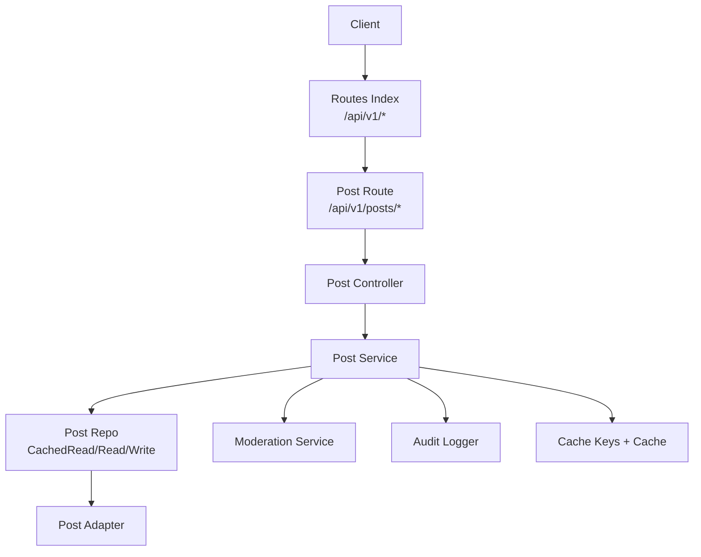
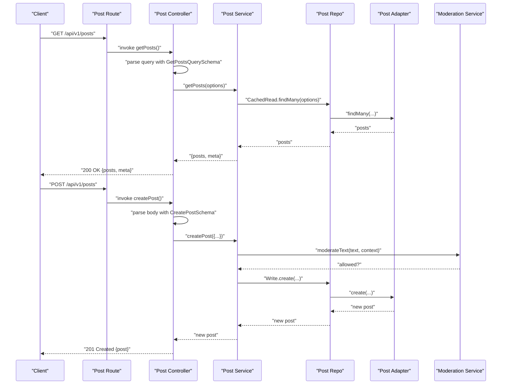
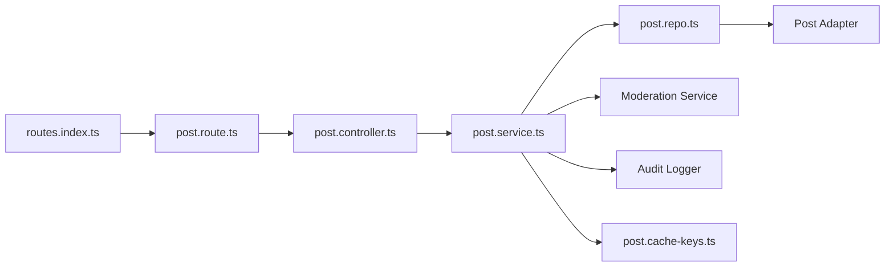

# Post API

<cite>
**Referenced Files in This Document**
- [post.route.ts](file://server/src/modules/post/post.route.ts)
- [post.controller.ts](file://server/src/modules/post/post.controller.ts)
- [post.service.ts](file://server/src/modules/post/post.service.ts)
- [post.schema.ts](file://server/src/modules/post/post.schema.ts)
- [post.repo.ts](file://server/src/modules/post/post.repo.ts)
- [post.cache-keys.ts](file://server/src/modules/post/post.cache-keys.ts)
- [routes.index.ts](file://server/src/routes/index.ts)
- [multipart-upload.middleware.ts](file://server/src/core/middlewares/multipart-upload.middleware.ts)
- [stop-banned-user.middleware.ts](file://server/src/core/middlewares/auth/stop-banned-user.middleware.ts)
- [cloudinary.service.ts](file://server/src/infra/services/media/cloudinary.service.ts)
- [post.ts (web services)](file://web/src/services/api/post.ts)
</cite>

## Table of Contents
1. [Introduction](#introduction)
2. [Project Structure](#project-structure)
3. [Core Components](#core-components)
4. [Architecture Overview](#architecture-overview)
5. [Detailed Component Analysis](#detailed-component-analysis)
6. [Dependency Analysis](#dependency-analysis)
7. [Performance Considerations](#performance-considerations)
8. [Troubleshooting Guide](#troubleshooting-guide)
9. [Conclusion](#conclusion)
10. [Appendices](#appendices)

## Introduction
This document provides comprehensive API documentation for post management endpoints. It covers CRUD operations for posts, listing with filters, view increment, and integration with content moderation. It also documents request/response schemas, pagination, sorting, and search/filtering behavior. Where applicable, it outlines media upload integration and visibility controls. Error handling for validation, moderation, and permissions is included.

## Project Structure
The Post API is implemented as a modular Express route module with a controller, service, repository, and schema layers. Routing is registered under the base path /api/v1/posts. The frontend client exposes a typed API wrapper for convenience.

**Diagram sources**
- [routes.index.ts](file://server/src/routes/index.ts#L20-L39)
- [post.route.ts](file://server/src/modules/post/post.route.ts#L1-L34)
- [post.controller.ts](file://server/src/modules/post/post.controller.ts#L1-L162)
- [post.service.ts](file://server/src/modules/post/post.service.ts#L1-L408)
- [post.repo.ts](file://server/src/modules/post/post.repo.ts#L1-L133)
- [post.cache-keys.ts](file://server/src/modules/post/post.cache-keys.ts#L1-L48)

**Section sources**
- [routes.index.ts](file://server/src/routes/index.ts#L20-L39)
- [post.route.ts](file://server/src/modules/post/post.route.ts#L1-L34)

## Core Components
- Post Route: Defines endpoints for listing, retrieving, creating, updating, deleting, and incrementing views. Applies middleware for rate limiting, optional user context, and authentication checks for write operations.
- Post Controller: Parses query/body using Zod schemas and delegates to the service layer.
- Post Service: Implements business logic, integrates moderation, enforces permissions, records audit events, and invalidates caches.
- Post Repo: Provides CachedRead, Read, and Write accessors backed by an adapter and cache keys.
- Post Schema: Defines strict request/response validation for create, update, and query parameters.
- Cache Keys: Generates cache keys for posts by ID, lists, counts, and versions.

**Section sources**
- [post.route.ts](file://server/src/modules/post/post.route.ts#L1-L34)
- [post.controller.ts](file://server/src/modules/post/post.controller.ts#L1-L162)
- [post.service.ts](file://server/src/modules/post/post.service.ts#L1-L408)
- [post.repo.ts](file://server/src/modules/post/post.repo.ts#L1-L133)
- [post.schema.ts](file://server/src/modules/post/post.schema.ts#L1-L107)
- [post.cache-keys.ts](file://server/src/modules/post/post.cache-keys.ts#L1-L48)

## Architecture Overview
The Post API follows a layered architecture:
- HTTP Layer: Express routes and middleware.
- Controller Layer: Request parsing and delegation.
- Service Layer: Business logic, moderation, auditing, and cache invalidation.
- Repository Layer: Data access via cached and uncached reads/writes.
- Persistence: Adapter-backed storage.

**Diagram sources**
- [post.route.ts](file://server/src/modules/post/post.route.ts#L18-L31)
- [post.controller.ts](file://server/src/modules/post/post.controller.ts#L24-L46)
- [post.service.ts](file://server/src/modules/post/post.service.ts#L40-L94)
- [post.repo.ts](file://server/src/modules/post/post.repo.ts#L19-L62)
- [post.schema.ts](file://server/src/modules/post/post.schema.ts#L53-L98)

## Detailed Component Analysis

### Endpoints

- Base Path: /api/v1/posts
- Authentication: Optional for GET endpoints; required for write operations (/post/:id, /post/:id/view)
- Rate Limiting: Applied globally to the posts router

Endpoints:
- GET / (list posts)
- GET /:id (get post by ID)
- POST /:id/view (increment views)
- GET /college/:collegeId (posts by college)
- GET /branch/:branch (posts by branch)
- GET /user/:userId (posts by author)
- POST / (create post)
- PATCH /:id (update post)
- DELETE /:id (delete post)

Notes:
- Anonymous viewing of posts is supported; private posts require a logged-in user from the same college.
- View increments are permitted without authentication.

**Section sources**
- [post.route.ts](file://server/src/modules/post/post.route.ts#L18-L31)
- [routes.index.ts](file://server/src/routes/index.ts#L23-L23)

### Request/Response Schemas

- Create Post
  - Required: title, content, topic
  - Optional: isPrivate
  - Validation: length limits, topic enum, optional boolean
  - Example payload path: [CreatePostSchema](file://server/src/modules/post/post.schema.ts#L17-L27)

- Update Post
  - Fields: title (optional), content (optional), topic (optional), isPrivate (optional)
  - Validation: same constraints as create, with optional fields
  - Example payload path: [UpdatePostSchema](file://server/src/modules/post/post.schema.ts#L29-L47)

- List Posts Query
  - Filters: page, limit, sortBy, sortOrder, topic, collegeId, branch
  - Defaults and bounds: page >= 1, 1 <= limit <= 50, sortBy in [createdAt, updatedAt, views], sortOrder in [asc, desc]
  - Topic normalization: supports exact match, case-insensitive, and URL-decoded variants
  - Example payload path: [GetPostsQuerySchema](file://server/src/modules/post/post.schema.ts#L53-L98)

- Path Parameters
  - Post ID: UUID validation
  - College ID: UUID validation
  - Branch: non-empty string
  - Author/User ID: string (no UUID enforcement in controller)
  - Example payload paths:
    - [PostIdSchema](file://server/src/modules/post/post.schema.ts#L49-L51)
    - [CollegeIdSchema](file://server/src/modules/post/post.schema.ts#L100-L102)
    - [BranchSchema](file://server/src/modules/post/post.schema.ts#L104-L106)

- Response Body Patterns
  - Success: { success: true, message, data? }
  - Errors: { success: false, message, code?, errors?, meta? }

**Section sources**
- [post.schema.ts](file://server/src/modules/post/post.schema.ts#L17-L106)
- [post.controller.ts](file://server/src/modules/post/post.controller.ts#L8-L88)

### Pagination, Sorting, and Filtering

- Pagination
  - page: integer >= 1 (default 1)
  - limit: integer clamped to 1..50 (default 10)
  - meta includes total, page, limit, totalPages, hasMore

- Sorting
  - sortBy: createdAt | updatedAt | views
  - sortOrder: asc | desc

- Filtering
  - topic: normalized to enum (exact, case-insensitive, URL-decoded)
  - collegeId: UUID filter
  - branch: string filter
  - authorId: string filter (from /user/:userId)

- Search
  - No explicit text search endpoint is defined; filtering is limited to topic, college, branch, and author.

**Section sources**
- [post.schema.ts](file://server/src/modules/post/post.schema.ts#L53-L98)
- [post.service.ts](file://server/src/modules/post/post.service.ts#L145-L193)
- [post.repo.ts](file://server/src/modules/post/post.repo.ts#L19-L85)

### Media Uploads and Visibility Controls

- Media Uploads
  - The server includes a Cloudinary integration and a multer middleware for image uploads.
  - The Post API does not define a dedicated media upload endpoint; media handling appears to be part of broader media services.
  - Multer configuration allows images only, up to 5MB, stored in memory.
  - Cloudinary upload endpoint returns a secure URL and public ID; failures raise a bad request error.

- Visibility Controls
  - isPrivate flag is supported during creation/update.
  - Private posts require a logged-in user whose college matches the post’s author’s college.
  - Unauthorized or forbidden access returns appropriate errors.

**Section sources**
- [multipart-upload.middleware.ts](file://server/src/core/middlewares/multipart-upload.middleware.ts#L1-L13)
- [cloudinary.service.ts](file://server/src/infra/services/media/cloudinary.service.ts#L42-L75)
- [post.service.ts](file://server/src/modules/post/post.service.ts#L109-L128)

### Content Moderation Integration

- Policy Enforcement
  - Creation and update trigger moderation checks on combined title+content.
  - Violations return structured errors with reasons and moderation metadata.

- Error Codes
  - CONTENT_POLICY_VIOLATION with nested reasons and matches.

**Section sources**
- [post.service.ts](file://server/src/modules/post/post.service.ts#L13-L38)
- [post.service.ts](file://server/src/modules/post/post.service.ts#L60-L62)
- [post.service.ts](file://server/src/modules/post/post.service.ts#L260-L278)

### Anonymous Posting and Permissions

- Anonymous Posting
  - Listing and retrieval endpoints are accessible anonymously.
  - Creating posts requires authentication and terms acceptance.

- Permission Checks
  - Banned users are blocked from write operations.
  - Update/Delete require ownership verification.
  - Private posts restrict access to users from the same college.

**Section sources**
- [post.route.ts](file://server/src/modules/post/post.route.ts#L25-L31)
- [stop-banned-user.middleware.ts](file://server/src/core/middlewares/auth/stop-banned-user.middleware.ts#L1-L22)
- [post.service.ts](file://server/src/modules/post/post.service.ts#L302-L340)
- [post.service.ts](file://server/src/modules/post/post.service.ts#L109-L128)

### Post Interaction Endpoints

- Increment Views
  - POST /posts/:id/view increments view count.
  - No authentication required.

- Trending Posts
  - The frontend queries posts with sortBy=views, sortOrder=desc, limit=5.
  - Endpoint path: GET /posts

**Section sources**
- [post.route.ts](file://server/src/modules/post/post.route.ts#L20-L20)
- [post.controller.ts](file://server/src/modules/post/post.controller.ts#L82-L88)
- [post.ts (web services)](file://web/src/services/api/post.ts#L52-L60)

### Bulk Operations

- No dedicated bulk endpoints are defined in the Post module.
- Moderation module includes bulk operations for reports; these are not part of the Post API.

**Section sources**
- [post.service.ts](file://server/src/modules/post/post.service.ts#L145-L193)

## Dependency Analysis

**Diagram sources**
- [post.route.ts](file://server/src/modules/post/post.route.ts#L1-L34)
- [post.controller.ts](file://server/src/modules/post/post.controller.ts#L1-L162)
- [post.service.ts](file://server/src/modules/post/post.service.ts#L1-L408)
- [post.repo.ts](file://server/src/modules/post/post.repo.ts#L1-L133)
- [post.cache-keys.ts](file://server/src/modules/post/post.cache-keys.ts#L1-L48)
- [routes.index.ts](file://server/src/routes/index.ts#L20-L39)

**Section sources**
- [post.route.ts](file://server/src/modules/post/post.route.ts#L1-L34)
- [post.controller.ts](file://server/src/modules/post/post.controller.ts#L1-L162)
- [post.service.ts](file://server/src/modules/post/post.service.ts#L1-L408)
- [post.repo.ts](file://server/src/modules/post/post.repo.ts#L1-L133)
- [post.cache-keys.ts](file://server/src/modules/post/post.cache-keys.ts#L1-L48)
- [routes.index.ts](file://server/src/routes/index.ts#L20-L39)

## Performance Considerations
- Caching
  - CachedRead layers are used for listing and counts; cache keys incorporate filters and versions.
  - Post and list versions are bumped on create/update/delete to invalidate caches.
- Pagination Limits
  - Default limit is 10; maximum is 50 to prevent heavy loads.
- Sorting
  - Sorting by views is supported; ensure database indexes exist for optimal performance.
- Moderation
  - Moderation checks occur on create/update; consider batching or async moderation for high throughput.

**Section sources**
- [post.repo.ts](file://server/src/modules/post/post.repo.ts#L19-L85)
- [post.cache-keys.ts](file://server/src/modules/post/post.cache-keys.ts#L15-L44)
- [post.service.ts](file://server/src/modules/post/post.service.ts#L85-L86)
- [post.service.ts](file://server/src/modules/post/post.service.ts#L296-L297)
- [post.schema.ts](file://server/src/modules/post/post.schema.ts#L58-L61)

## Troubleshooting Guide

Common Errors and Causes:
- Validation Failures
  - Title/content length or missing fields; topic enum mismatch.
  - Reference: [CreatePostSchema](file://server/src/modules/post/post.schema.ts#L17-L27), [UpdatePostSchema](file://server/src/modules/post/post.schema.ts#L29-L47), [GetPostsQuerySchema](file://server/src/modules/post/post.schema.ts#L53-L98)

- Not Found
  - Post ID invalid or post not found.
  - Reference: [getPostById](file://server/src/modules/post/post.service.ts#L96-L107)

- Unauthorized/Forbidden
  - Viewing private posts without authentication or from another college.
  - Write operations without authentication or banned user.
  - Ownership checks for update/delete.
  - References:
    - [Private post access](file://server/src/modules/post/post.service.ts#L109-L128)
    - [stopBannedUser middleware](file://server/src/core/middlewares/auth/stop-banned-user.middleware.ts#L1-L22)
    - [updatePost ownership](file://server/src/modules/post/post.service.ts#L222-L239)
    - [deletePost ownership](file://server/src/modules/post/post.service.ts#L313-L325)

- Moderation Violation
  - Content fails moderation policy; error includes reasons and matches.
  - Reference: [throwModerationViolation](file://server/src/modules/post/post.service.ts#L13-L38)

- Media Upload Failure
  - Non-image files or upload errors; returns bad request.
  - References:
    - [Multer config](file://server/src/core/middlewares/multipart-upload.middleware.ts#L1-L13)
    - [Cloudinary upload](file://server/src/infra/services/media/cloudinary.service.ts#L68-L72)

**Section sources**
- [post.schema.ts](file://server/src/modules/post/post.schema.ts#L17-L106)
- [post.service.ts](file://server/src/modules/post/post.service.ts#L96-L128)
- [post.service.ts](file://server/src/modules/post/post.service.ts#L13-L38)
- [stop-banned-user.middleware.ts](file://server/src/core/middlewares/auth/stop-banned-user.middleware.ts#L1-L22)
- [multipart-upload.middleware.ts](file://server/src/core/middlewares/multipart-upload.middleware.ts#L1-L13)
- [cloudinary.service.ts](file://server/src/infra/services/media/cloudinary.service.ts#L68-L72)

## Conclusion
The Post API provides a robust, validated, and audited interface for managing posts with integrated moderation and caching. It supports listing with flexible filters, sorting, and pagination, along with visibility controls and anonymous read access. While media upload is handled by separate services, moderation is tightly integrated into create/update flows. The architecture cleanly separates concerns and offers clear extension points for future enhancements such as search and bulk operations.

## Appendices

### Endpoint Reference

- GET /
  - Description: List posts with pagination, sorting, and filtering.
  - Query: page, limit, sortBy, sortOrder, topic, collegeId, branch
  - Response: { posts[], meta: { total, page, limit, totalPages, hasMore } }

- GET /:id
  - Description: Retrieve a single post by ID.
  - Path: id (UUID)
  - Response: { post }

- POST /:id/view
  - Description: Increment view count for a post.
  - Path: id (UUID)
  - Response: { message }

- GET /college/:collegeId
  - Description: List posts filtered by college.
  - Path: collegeId (UUID)
  - Query: page, limit, sortBy, sortOrder
  - Response: { posts[], meta }

- GET /branch/:branch
  - Description: List posts filtered by branch.
  - Path: branch (string)
  - Query: page, limit, sortBy, sortOrder
  - Response: { posts[], meta }

- GET /user/:userId
  - Description: List posts filtered by author.
  - Path: userId (string)
  - Query: page, limit, sortBy, sortOrder
  - Response: { posts[], meta }

- POST /
  - Description: Create a new post.
  - Body: { title, content, topic, isPrivate? }
  - Response: { post }

- PATCH /:id
  - Description: Update an existing post.
  - Path: id (UUID)
  - Body: { title?, content?, topic?, isPrivate? }
  - Response: { post }

- DELETE /:id
  - Description: Delete a post.
  - Path: id (UUID)
  - Response: { message }

**Section sources**
- [post.route.ts](file://server/src/modules/post/post.route.ts#L18-L31)
- [post.controller.ts](file://server/src/modules/post/post.controller.ts#L24-L158)
- [post.schema.ts](file://server/src/modules/post/post.schema.ts#L17-L106)
- [post.ts (web services)](file://web/src/services/api/post.ts#L13-L64)