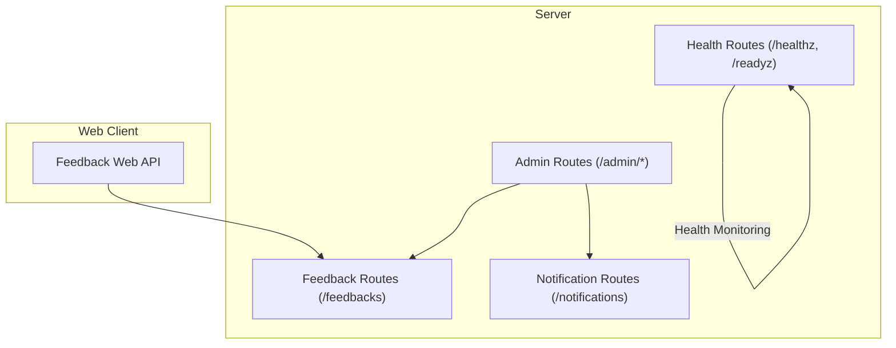
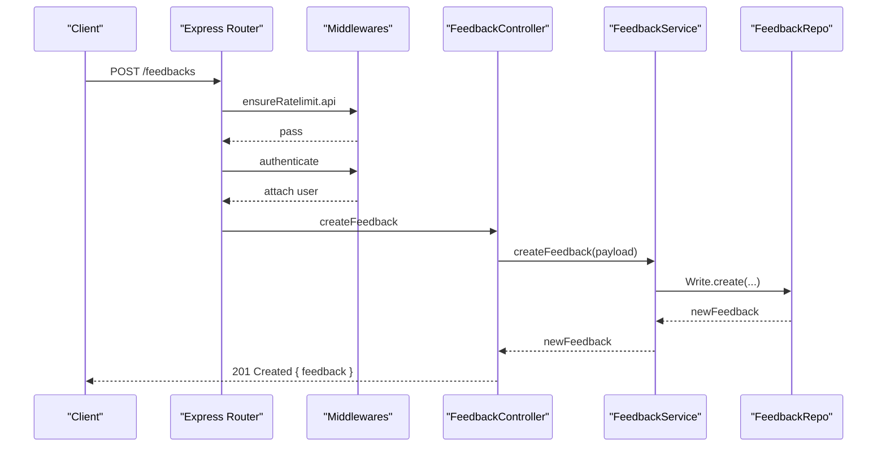
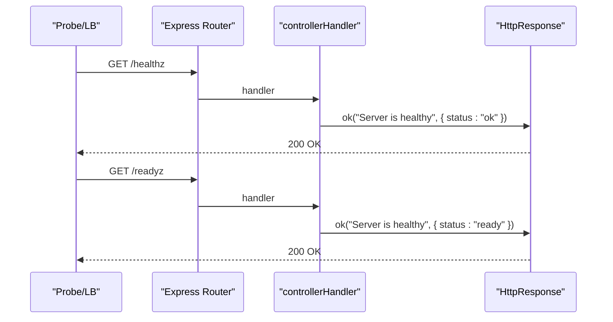
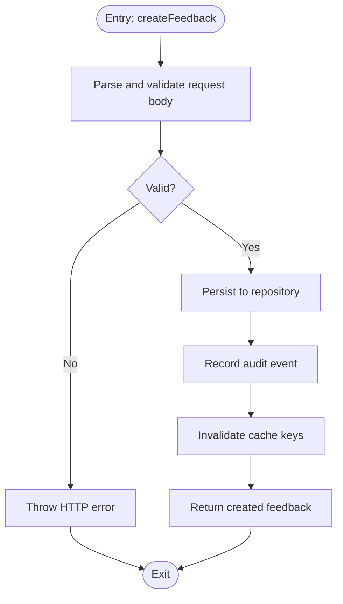
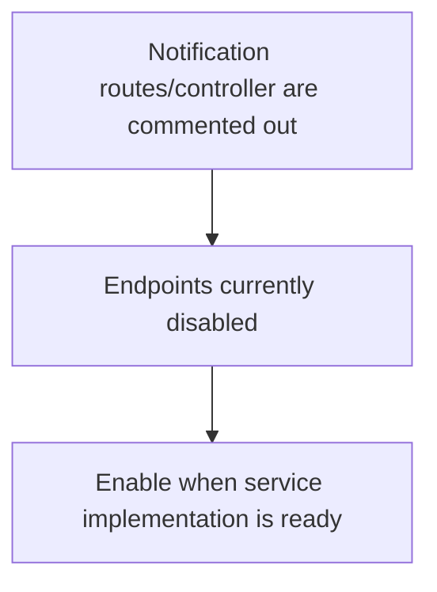
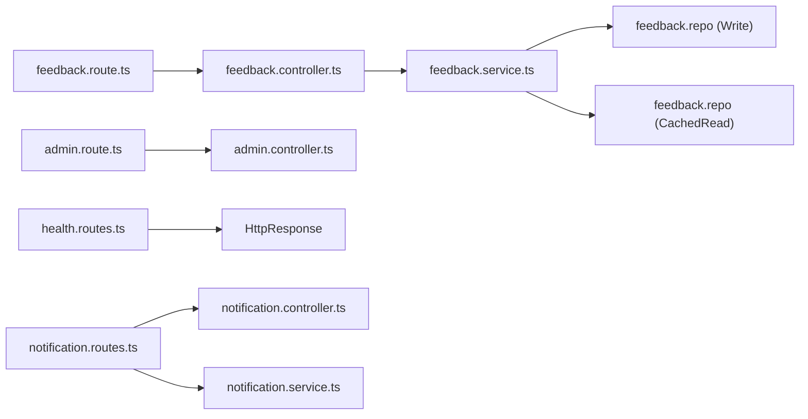

# System API

<cite>
**Referenced Files in This Document**
- [health.routes.ts](file://server/src/routes/health.routes.ts)
- [feedback.route.ts](file://server/src/modules/feedback/feedback.route.ts)
- [feedback.controller.ts](file://server/src/modules/feedback/feedback.controller.ts)
- [feedback.schema.ts](file://server/src/modules/feedback/feedback.schema.ts)
- [feedback.service.ts](file://server/src/modules/feedback/feedback.service.ts)
- [notification.routes.ts](file://server/src/modules/notification/notification.routes.ts)
- [notification.controller.ts](file://server/src/modules/notification/notification.controller.ts)
- [notification.service.ts](file://server/src/modules/notification/notification.service.ts)
- [admin.route.ts](file://server/src/modules/admin/admin.route.ts)
- [env.ts](file://server/src/config/env.ts)
- [feedback.ts](file://web/src/services/api/feedback.ts)
</cite>

## Table of Contents
1. [Introduction](#introduction)
2. [Project Structure](#project-structure)
3. [Core Components](#core-components)
4. [Architecture Overview](#architecture-overview)
5. [Detailed Component Analysis](#detailed-component-analysis)
6. [Dependency Analysis](#dependency-analysis)
7. [Performance Considerations](#performance-considerations)
8. [Troubleshooting Guide](#troubleshooting-guide)
9. [Conclusion](#conclusion)
10. [Appendices](#appendices)

## Introduction
This document provides comprehensive API documentation for system utility endpoints across health monitoring, feedback collection, notifications, and system configuration. It covers endpoint definitions, request/response schemas, middleware usage, error handling, and practical examples for integration and automation.

## Project Structure
The system exposes utility endpoints under the server module:
- Health endpoints: readiness and liveness checks
- Feedback endpoints: creation, listing, retrieval, status updates, and deletion (admin-only)
- Notification endpoints: placeholder for future notification listing and read receipts
- Admin endpoints: dashboard, user management, logs, and feedback administration
- Environment configuration: validated runtime configuration via strongly typed schema

**Diagram sources**
- [health.routes.ts](file://server/src/routes/health.routes.ts#L4-L17)
- [feedback.route.ts](file://server/src/modules/feedback/feedback.route.ts#L1-L28)
- [notification.routes.ts](file://server/src/modules/notification/notification.routes.ts#L1-L11)
- [admin.route.ts](file://server/src/modules/admin/admin.route.ts#L1-L41)
- [feedback.ts](file://web/src/services/api/feedback.ts#L1-L12)

**Section sources**
- [health.routes.ts](file://server/src/routes/health.routes.ts#L1-L18)
- [feedback.route.ts](file://server/src/modules/feedback/feedback.route.ts#L1-L28)
- [notification.routes.ts](file://server/src/modules/notification/notification.routes.ts#L1-L11)
- [admin.route.ts](file://server/src/modules/admin/admin.route.ts#L1-L41)
- [env.ts](file://server/src/config/env.ts#L1-L42)
- [feedback.ts](file://web/src/services/api/feedback.ts#L1-L12)

## Core Components
- Health endpoints: lightweight status checks for container orchestration and load balancers
- Feedback endpoints: authenticated submissions and admin-driven lifecycle management
- Notification endpoints: planned for listing and marking notifications as seen
- Admin endpoints: dashboards, user and content management, logs, and feedback administration
- Environment configuration: validated and normalized runtime settings

**Section sources**
- [health.routes.ts](file://server/src/routes/health.routes.ts#L4-L17)
- [feedback.route.ts](file://server/src/modules/feedback/feedback.route.ts#L8-L25)
- [notification.routes.ts](file://server/src/modules/notification/notification.routes.ts#L1-L11)
- [admin.route.ts](file://server/src/modules/admin/admin.route.ts#L17-L39)
- [env.ts](file://server/src/config/env.ts#L4-L39)

## Architecture Overview
The system composes routes with middleware and controllers, delegating business logic to services and repositories. Feedback endpoints enforce rate limiting and authentication, while admin endpoints enforce role-based access.

**Diagram sources**
- [feedback.route.ts](file://server/src/modules/feedback/feedback.route.ts#L8-L11)
- [feedback.controller.ts](file://server/src/modules/feedback/feedback.controller.ts#L8-L24)
- [feedback.service.ts](file://server/src/modules/feedback/feedback.service.ts#L16-L43)
- [feedback.schema.ts](file://server/src/modules/feedback/feedback.schema.ts#L3-L10)

## Detailed Component Analysis

### Health Endpoints
- Purpose: Liveness and readiness probes for monitoring and load balancing
- Endpoints:
  - GET /healthz: server health status
  - GET /readyz: server readiness status
- Response: Standardized success envelope with status field

**Diagram sources**
- [health.routes.ts](file://server/src/routes/health.routes.ts#L4-L17)

**Section sources**
- [health.routes.ts](file://server/src/routes/health.routes.ts#L4-L17)

### Feedback Collection Endpoints
- Purpose: Allow authenticated users to submit feedback and enable admins to manage it
- Authentication and rate limiting enforced at route level
- Admin-only endpoints for listing, retrieving, updating status, and deleting feedback

Endpoints:
- POST /feedbacks
  - Authenticated users
  - Rate-limited
  - Request body validated by schema
  - Response: 201 with created feedback object
- GET /feedbacks
  - Admin-only
  - Query params: limit, skip, type, status
  - Response: 200 with list and metadata
- GET /feedbacks/:id
  - Admin-only
  - Response: 200 with feedback object
- PATCH /feedbacks/:id/status
  - Admin-only
  - Request body validated by status schema
  - Response: 200 with updated feedback
- DELETE /feedbacks/:id
  - Admin-only
  - Response: 200 success message

Request/Response Schemas:
- CreateFeedbackSchema
  - Fields: title (string), content (string), type (enum)
  - Validation: min/max lengths, enum defaults
- UpdateFeedbackStatusSchema
  - Fields: status (enum: new, reviewed, dismissed)
- FeedbackIdSchema
  - Fields: id (uuid)
- ListFeedbacksQuerySchema
  - Fields: limit (1–100), skip (>=0), type, status

Processing Logic:
- Controller parses and forwards to service
- Service persists, records audit, updates caches, and returns results
- Errors are thrown as HTTP errors with structured metadata

**Diagram sources**
- [feedback.controller.ts](file://server/src/modules/feedback/feedback.controller.ts#L8-L24)
- [feedback.service.ts](file://server/src/modules/feedback/feedback.service.ts#L16-L43)
- [feedback.schema.ts](file://server/src/modules/feedback/feedback.schema.ts#L3-L10)

**Section sources**
- [feedback.route.ts](file://server/src/modules/feedback/feedback.route.ts#L8-L25)
- [feedback.controller.ts](file://server/src/modules/feedback/feedback.controller.ts#L8-L70)
- [feedback.schema.ts](file://server/src/modules/feedback/feedback.schema.ts#L3-L35)
- [feedback.service.ts](file://server/src/modules/feedback/feedback.service.ts#L16-L159)

### Notification Endpoints
- Purpose: Planned endpoints for listing notifications and marking as seen
- Current state: Routes and controller placeholders are present but endpoints are disabled
- Future usage: Intended for authenticated users to fetch and acknowledge notifications

**Diagram sources**
- [notification.routes.ts](file://server/src/modules/notification/notification.routes.ts#L1-L11)
- [notification.controller.ts](file://server/src/modules/notification/notification.controller.ts#L1-L46)
- [notification.service.ts](file://server/src/modules/notification/notification.service.ts#L1-L211)

**Section sources**
- [notification.routes.ts](file://server/src/modules/notification/notification.routes.ts#L1-L11)
- [notification.controller.ts](file://server/src/modules/notification/notification.controller.ts#L1-L46)
- [notification.service.ts](file://server/src/modules/notification/notification.service.ts#L1-L211)

### Admin Endpoints
- Purpose: Administrative dashboard and management operations
- Includes: dashboard overview, user queries, reports, colleges, branches, logs, and feedback administration
- Middleware: rate limit, authentication, role enforcement

Example endpoints:
- GET /admin/dashboard/overview
- GET /admin/manage/users/query
- GET /admin/manage/reports
- GET /admin/colleges/get/all
- GET /admin/college-requests
- POST /admin/colleges/create
- PATCH /admin/colleges/update/:id
- PATCH /admin/college-requests/:id
- POST /admin/colleges/upload/profile/:id
- GET /admin/branches/all
- POST /admin/branches/create
- PATCH /admin/branches/update/:id
- DELETE /admin/branches/delete/:id
- GET /admin/manage/logs
- GET /admin/manage/feedback/all

**Section sources**
- [admin.route.ts](file://server/src/modules/admin/admin.route.ts#L17-L39)

### System Configuration Endpoints
- Purpose: Expose validated environment configuration for operational settings
- Implementation: Environment variables are parsed and exposed via a typed configuration object
- Usage: Access configuration values for database, cache, tokens, OAuth, mail, and secrets

Environment variables (selected):
- PORT, HOST, NODE_ENV
- DATABASE_URL, REDIS_URL
- CACHE_DRIVER, CACHE_TTL
- ACCESS_TOKEN_TTL, REFRESH_TOKEN_TTL
- ACCESS_TOKEN_SECRET, REFRESH_TOKEN_SECRET
- GOOGLE_OAUTH_CLIENT_ID, GOOGLE_OAUTH_CLIENT_SECRET
- GMAIL_APP_USER, GMAIL_APP_PASS, MAILTRAP_TOKEN, MAIL_PROVIDER
- SERVER_BASE_URI, PERSPECTIVE_API_KEY
- MAIL_FROM, EMAIL_ENCRYPTION_KEY, EMAIL_SECRET, HMAC_SECRET
- ADMIN_EMAIL, ADMIN_PASSWORD
- BETTER_AUTH_URL, BETTER_AUTH_SECRET
- Optional cloudinary settings

**Section sources**
- [env.ts](file://server/src/config/env.ts#L4-L39)

## Dependency Analysis
- Route-to-controller coupling is thin; controllers depend on services and schemas
- Services depend on repositories and caching/audit utilities
- Admin routes depend on authentication and role middleware
- Health routes are standalone and minimal

**Diagram sources**
- [feedback.route.ts](file://server/src/modules/feedback/feedback.route.ts#L1-L28)
- [feedback.controller.ts](file://server/src/modules/feedback/feedback.controller.ts#L1-L74)
- [feedback.service.ts](file://server/src/modules/feedback/feedback.service.ts#L1-L182)
- [admin.route.ts](file://server/src/modules/admin/admin.route.ts#L1-L41)
- [health.routes.ts](file://server/src/routes/health.routes.ts#L4-L17)
- [notification.routes.ts](file://server/src/modules/notification/notification.routes.ts#L1-L11)
- [notification.controller.ts](file://server/src/modules/notification/notification.controller.ts#L1-L46)
- [notification.service.ts](file://server/src/modules/notification/notification.service.ts#L1-L211)

**Section sources**
- [feedback.route.ts](file://server/src/modules/feedback/feedback.route.ts#L1-L28)
- [feedback.controller.ts](file://server/src/modules/feedback/feedback.controller.ts#L1-L74)
- [feedback.service.ts](file://server/src/modules/feedback/feedback.service.ts#L1-L182)
- [admin.route.ts](file://server/src/modules/admin/admin.route.ts#L1-L41)
- [health.routes.ts](file://server/src/routes/health.routes.ts#L4-L17)
- [notification.routes.ts](file://server/src/modules/notification/notification.routes.ts#L1-L11)
- [notification.controller.ts](file://server/src/modules/notification/notification.controller.ts#L1-L46)
- [notification.service.ts](file://server/src/modules/notification/notification.service.ts#L1-L211)

## Performance Considerations
- Feedback listing supports pagination and filtering; use limit/skip to control payload sizes
- Cache invalidation is performed after feedback mutations to maintain consistency
- Rate limiting is applied at the route level to protect endpoints from abuse
- Consider enabling Redis for production-grade caching and distributed cache TTL tuning

[No sources needed since this section provides general guidance]

## Troubleshooting Guide
Common issues and resolutions:
- Feedback not found
  - Symptom: 404 Not Found when retrieving/updating/deleting feedback
  - Cause: Invalid or missing feedback ID
  - Resolution: Verify UUID format and existence
- Unauthorized access
  - Symptom: 401 Unauthorized on protected endpoints
  - Cause: Missing or invalid authentication
  - Resolution: Ensure bearer token is attached and valid
- Rate limit exceeded
  - Symptom: 429 Too Many Requests
  - Cause: Exceeded per-user rate limits
  - Resolution: Back off and retry after the specified window
- Validation errors
  - Symptom: 400 Bad Request with field-specific messages
  - Cause: Missing or invalid fields in request body
  - Resolution: Match schemas for title/content/type/status/id

**Section sources**
- [feedback.service.ts](file://server/src/modules/feedback/feedback.service.ts#L54-L61)
- [feedback.service.ts](file://server/src/modules/feedback/feedback.service.ts#L112-L118)
- [feedback.service.ts](file://server/src/modules/feedback/feedback.service.ts#L138-L144)
- [feedback.schema.ts](file://server/src/modules/feedback/feedback.schema.ts#L3-L10)
- [feedback.schema.ts](file://server/src/modules/feedback/feedback.schema.ts#L12-L18)
- [feedback.schema.ts](file://server/src/modules/feedback/feedback.schema.ts#L20-L22)
- [feedback.schema.ts](file://server/src/modules/feedback/feedback.schema.ts#L24-L35)

## Conclusion
The system provides essential utility endpoints for health monitoring, feedback management, and administrative operations. Health endpoints support infrastructure monitoring, feedback endpoints enable user-submitted insights with admin controls, and notification endpoints are prepared for future rollout. Environment configuration is strongly typed and validated for reliable operations.

[No sources needed since this section summarizes without analyzing specific files]

## Appendices

### API Reference: Health
- GET /healthz
  - Description: Returns server health status
  - Response: 200 OK with status field set to "ok"
- GET /readyz
  - Description: Returns server readiness status
  - Response: 200 OK with status field set to "ready"

**Section sources**
- [health.routes.ts](file://server/src/routes/health.routes.ts#L4-L17)

### API Reference: Feedback
- POST /feedbacks
  - Authenticated: Yes
  - Rate-limited: Yes
  - Body: { type, title, content }
  - Response: 201 Created with feedback object
- GET /feedbacks
  - Authenticated: Yes
  - Role: Admin
  - Query: limit, skip, type, status
  - Response: 200 OK with list and metadata
- GET /feedbacks/:id
  - Authenticated: Yes
  - Role: Admin
  - Path: id (UUID)
  - Response: 200 OK with feedback object
- PATCH /feedbacks/:id/status
  - Authenticated: Yes
  - Role: Admin
  - Path: id (UUID)
  - Body: { status }
  - Response: 200 OK with updated feedback
- DELETE /feedbacks/:id
  - Authenticated: Yes
  - Role: Admin
  - Path: id (UUID)
  - Response: 200 OK

**Section sources**
- [feedback.route.ts](file://server/src/modules/feedback/feedback.route.ts#L8-L25)
- [feedback.controller.ts](file://server/src/modules/feedback/feedback.controller.ts#L8-L70)
- [feedback.schema.ts](file://server/src/modules/feedback/feedback.schema.ts#L3-L35)

### API Reference: Notifications
- GET /notifications/list
  - Authenticated: Yes
  - Status: Planned (currently disabled)
- PATCH /notifications/mark-seen
  - Authenticated: Yes
  - Status: Planned (currently disabled)

**Section sources**
- [notification.routes.ts](file://server/src/modules/notification/notification.routes.ts#L1-L11)
- [notification.controller.ts](file://server/src/modules/notification/notification.controller.ts#L1-L46)

### API Reference: Admin
- GET /admin/dashboard/overview
- GET /admin/manage/users/query
- GET /admin/manage/reports
- GET /admin/colleges/get/all
- GET /admin/college-requests
- POST /admin/colleges/create
- PATCH /admin/colleges/update/:id
- PATCH /admin/college-requests/:id
- POST /admin/colleges/upload/profile/:id
- GET /admin/branches/all
- POST /admin/branches/create
- PATCH /admin/branches/update/:id
- DELETE /admin/branches/delete/:id
- GET /admin/manage/logs
- GET /admin/manage/feedback/all

**Section sources**
- [admin.route.ts](file://server/src/modules/admin/admin.route.ts#L17-L39)

### Environment Variables
- Database and cache: DATABASE_URL, REDIS_URL, CACHE_DRIVER, CACHE_TTL
- Tokens and secrets: ACCESS_TOKEN_TTL, REFRESH_TOKEN_TTL, ACCESS_TOKEN_SECRET, REFRESH_TOKEN_SECRET, HMAC_SECRET
- OAuth and mail: GOOGLE_OAUTH_CLIENT_ID, GOOGLE_OAUTH_CLIENT_SECRET, MAIL_PROVIDER, MAIL_FROM, EMAIL_ENCRYPTION_KEY, EMAIL_SECRET
- Admin: ADMIN_EMAIL, ADMIN_PASSWORD
- Better Auth: BETTER_AUTH_URL, BETTER_AUTH_SECRET
- Cloudinary (optional): CLOUDINARY_CLOUD_NAME, CLOUDINARY_API_KEY, CLOUDINARY_API_SECRET, CLOUDINARY_UPLOAD_FOLDER

**Section sources**
- [env.ts](file://server/src/config/env.ts#L4-L39)

### Examples

- Health monitoring integration
  - Configure Kubernetes readiness/liveness probes against /readyz and /healthz
  - Example curl commands:
    - curl -f https://your-host/readyz
    - curl -f https://your-host/healthz

- Feedback workflow automation
  - Web client submits feedback via POST /feedbacks
  - Admin reviews via GET /admin/manage/feedback/all and updates status via PATCH /feedbacks/:id/status
  - Example web API usage:
    - feedbackApi.create({ type: "bug", title: "...", content: "..." })

- Notification broadcasting
  - Once enabled, clients can list notifications via GET /notifications/list and mark as seen via PATCH /notifications/mark-seen

**Section sources**
- [feedback.ts](file://web/src/services/api/feedback.ts#L3-L11)
- [admin.route.ts](file://server/src/modules/admin/admin.route.ts#L38-L39)
- [notification.routes.ts](file://server/src/modules/notification/notification.routes.ts#L7-L8)