# User Management API

<cite>
**Referenced Files in This Document**
- [user.route.ts](file://server/src/modules/user/user.route.ts)
- [user.controller.ts](file://server/src/modules/user/user.controller.ts)
- [user.service.ts](file://server/src/modules/user/user.service.ts)
- [user.schema.ts](file://server/src/modules/user/user.schema.ts)
- [user.dto.ts](file://server/src/modules/user/user.dto.ts)
- [user.repo.ts](file://server/src/modules/user/user.repo.ts)
- [user.adapter.ts](file://server/src/infra/db/adapters/user.adapter.ts)
- [block.guard.ts](file://server/src/modules/user/block.guard.ts)
- [User.ts](file://server/src/shared/types/User.ts)
- [auth.controller.ts](file://server/src/modules/auth/auth.controller.ts)
- [auth.schema.ts](file://server/src/shared/validators/auth.schema.ts)
- [health.routes.ts](file://server/src/routes/health.routes.ts)
- [index.ts](file://server/src/app.ts)
- [cors.ts](file://server/src/config/cors.ts)
- [env.ts](file://server/src/config/env.ts)
- [rbac.ts](file://server/src/core/security/rbac.ts)
- [roles.ts](file://server/src/config/roles.ts)
- [rate-limit.middleware.ts](file://server/src/core/middlewares/rate-limit.middleware.ts)
- [request-logging.middleware.ts](file://server/src/core/middlewares/request-logging.middleware.ts)
- [context.middleware.ts](file://server/src/core/middlewares/context.middleware.ts)
- [authenticated.ts](file://server/src/core/middlewares/pipelines.ts)
- [injectUser.ts](file://server/src/core/middlewares/injectUser.ts)
- [requireOnboardedUser.ts](file://server/src/core/middlewares/requireOnboardedUser.ts)
- [error.ts](file://server/src/core/http/error.ts)
- [response.ts](file://server/src/core/http/response.ts)
- [logger.ts](file://server/src/core/logger/logger.ts)
- [cache.ts](file://server/src/infra/services/cache/cache.ts)
- [record-audit.ts](file://server/src/lib/record-audit.ts)
- [swagger.ts](file://server/docs/swagger.ts)
</cite>

## Table of Contents
1. [Introduction](#introduction)
2. [Project Structure](#project-structure)
3. [Core Components](#core-components)
4. [Architecture Overview](#architecture-overview)
5. [Detailed Component Analysis](#detailed-component-analysis)
6. [Dependency Analysis](#dependency-analysis)
7. [Performance Considerations](#performance-considerations)
8. [Troubleshooting Guide](#troubleshooting-guide)
9. [Conclusion](#conclusion)
10. [Appendices](#appendices)

## Introduction
This document provides comprehensive API documentation for user management endpoints. It covers profile operations (GET, PATCH), user search, blocking/unblocking users, and profile visibility controls. It also documents request/response schemas, validation rules, privacy settings, permissions, role-based access controls, and account lifecycle management. Examples are included for profile picture upload, bio editing, and notification preferences, along with error handling for invalid operations and validation failures.

## Project Structure
The user management API is implemented in the server module under the user domain. Key components include:
- Routes: Define endpoint paths and middleware
- Controller: Orchestrates requests and responses
- Service: Implements business logic and interacts with repositories
- Repository: Abstracts database operations and caching
- Adapter: Drizzle ORM mapping to database tables
- Guards and Middlewares: Enforce authentication, authorization, and rate limits
- Schemas: Define request validation rules
- DTOs: Transform internal models to public representations

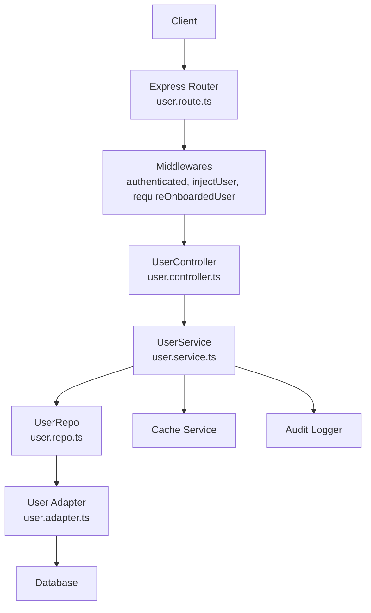

**Diagram sources**
- [user.route.ts](file://server/src/modules/user/user.route.ts#L1-L32)
- [user.controller.ts](file://server/src/modules/user/user.controller.ts#L1-L72)
- [user.service.ts](file://server/src/modules/user/user.service.ts#L1-L137)
- [user.repo.ts](file://server/src/modules/user/user.repo.ts#L1-L67)
- [user.adapter.ts](file://server/src/infra/db/adapters/user.adapter.ts#L1-L537)

**Section sources**
- [user.route.ts](file://server/src/modules/user/user.route.ts#L1-L32)
- [user.controller.ts](file://server/src/modules/user/user.controller.ts#L1-L72)
- [user.service.ts](file://server/src/modules/user/user.service.ts#L1-L137)
- [user.repo.ts](file://server/src/modules/user/user.repo.ts#L1-L67)
- [user.adapter.ts](file://server/src/infra/db/adapters/user.adapter.ts#L1-L537)

## Core Components
- Endpoints
  - GET /api/users/id/:userId
  - GET /api/users/search/:query
  - GET /api/users/me
  - PATCH /api/users/me
  - POST /api/users/accept-terms
  - POST /api/users/block/:userId
  - POST /api/users/unblock/:userId
  - GET /api/users/blocked
- Authentication and Authorization
  - Authenticated pipeline ensures a valid session
  - Inject user context into requests
  - Require onboarded users for protected endpoints
- Validation
  - Zod schemas for route parameters and request bodies
- Caching and Persistence
  - Cached reads for user profiles
  - Write operations invalidate caches
- Privacy Controls
  - Block relations prevent interactions between users
  - Guard checks block relations before sensitive operations

**Section sources**
- [user.route.ts](file://server/src/modules/user/user.route.ts#L15-L29)
- [user.schema.ts](file://server/src/modules/user/user.schema.ts#L14-L39)
- [authenticated.ts](file://server/src/core/middlewares/pipelines.ts)
- [injectUser.ts](file://server/src/core/middlewares/injectUser.ts)
- [requireOnboardedUser.ts](file://server/src/core/middlewares/requireOnboardedUser.ts)
- [block.guard.ts](file://server/src/modules/user/block.guard.ts#L1-L41)

## Architecture Overview
The user management API follows a layered architecture:
- Presentation Layer: Express routes and controllers
- Application Layer: Services encapsulate business logic
- Domain Layer: Repositories abstract persistence
- Infrastructure Layer: Adapters map to database tables and external services
- Security and Observability: Middlewares, RBAC, logging, and caching

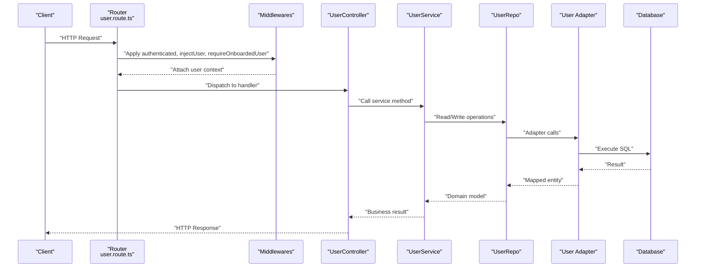

**Diagram sources**
- [user.route.ts](file://server/src/modules/user/user.route.ts#L12-L19)
- [user.controller.ts](file://server/src/modules/user/user.controller.ts#L8-L68)
- [user.service.ts](file://server/src/modules/user/user.service.ts#L9-L133)
- [user.repo.ts](file://server/src/modules/user/user.repo.ts#L6-L63)
- [user.adapter.ts](file://server/src/infra/db/adapters/user.adapter.ts#L11-L232)

## Detailed Component Analysis

### Endpoints and Operations

#### Get User Profile by ID
- Method: GET
- Path: /api/users/id/:userId
- Description: Retrieve a user’s public profile by their unique identifier
- Authentication: Required (authenticated middleware)
- Authorization: No explicit RBAC enforced in controller
- Validation: Route parameter validated by userId schema
- Response: Public user representation
- Errors:
  - 404 Not Found if user does not exist

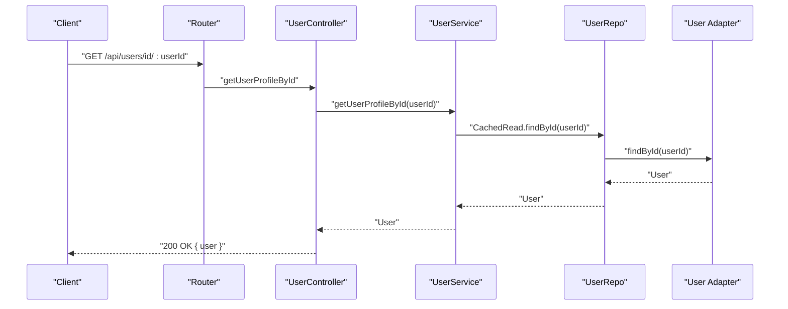

**Diagram sources**
- [user.route.ts](file://server/src/modules/user/user.route.ts#L15-L15)
- [user.controller.ts](file://server/src/modules/user/user.controller.ts#L9-L15)
- [user.service.ts](file://server/src/modules/user/user.service.ts#L10-L27)
- [user.repo.ts](file://server/src/modules/user/user.repo.ts#L24-L28)
- [user.adapter.ts](file://server/src/infra/db/adapters/user.adapter.ts#L11-L62)

**Section sources**
- [user.route.ts](file://server/src/modules/user/user.route.ts#L15-L15)
- [user.controller.ts](file://server/src/modules/user/user.controller.ts#L9-L15)
- [user.schema.ts](file://server/src/modules/user/user.schema.ts#L14-L16)
- [user.service.ts](file://server/src/modules/user/user.service.ts#L10-L27)
- [user.dto.ts](file://server/src/modules/user/user.dto.ts#L3-L11)

#### Search Users
- Method: GET
- Path: /api/users/search/:query
- Description: Search users by query string (username/email)
- Authentication: Required
- Authorization: No explicit RBAC enforced in controller
- Validation: Route parameter validated by searchQuery schema
- Response: Array of public users
- Behavior: Uses AuthRepo.CachedRead.searchUsers with limit and filters

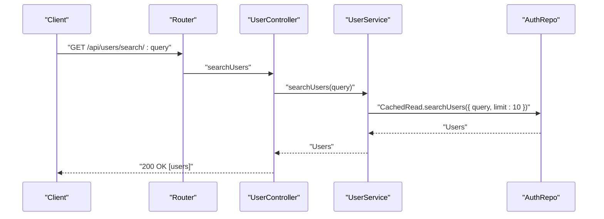

**Diagram sources**
- [user.route.ts](file://server/src/modules/user/user.route.ts#L16-L16)
- [user.controller.ts](file://server/src/modules/user/user.controller.ts#L17-L26)
- [user.service.ts](file://server/src/modules/user/user.service.ts#L29-L41)

**Section sources**
- [user.route.ts](file://server/src/modules/user/user.route.ts#L16-L16)
- [user.controller.ts](file://server/src/modules/user/user.controller.ts#L17-L26)
- [user.schema.ts](file://server/src/modules/user/user.schema.ts#L33-L35)
- [user.service.ts](file://server/src/modules/user/user.service.ts#L29-L41)

#### Get Own Profile
- Method: GET
- Path: /api/users/me
- Description: Retrieve the authenticated user’s own profile
- Authentication: Required
- Authorization: Onboarded user required
- Response: Public user representation

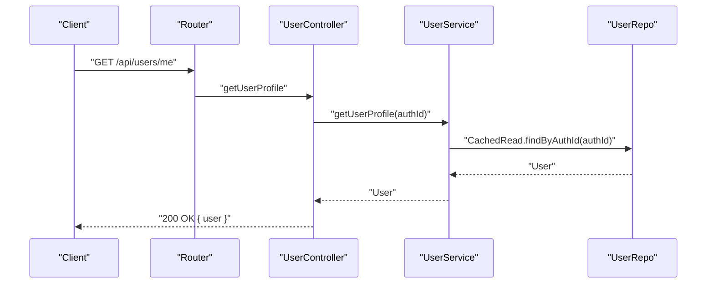

**Diagram sources**
- [user.route.ts](file://server/src/modules/user/user.route.ts#L21-L24)
- [user.controller.ts](file://server/src/modules/user/user.controller.ts#L28-L33)
- [user.service.ts](file://server/src/modules/user/user.service.ts#L43-L45)
- [user.repo.ts](file://server/src/modules/user/user.repo.ts#L30-L37)

**Section sources**
- [user.route.ts](file://server/src/modules/user/user.route.ts#L21-L24)
- [user.controller.ts](file://server/src/modules/user/user.controller.ts#L28-L33)
- [user.service.ts](file://server/src/modules/user/user.service.ts#L43-L45)

#### Update Own Profile
- Method: PATCH
- Path: /api/users/me
- Description: Update the authenticated user’s profile (example: branch)
- Authentication: Required
- Authorization: Onboarded user required
- Validation: Body validated by UpdateProfileSchema (branch min length 1)
- Response: Updated public user
- Side effects:
  - Cache keys invalidated for user and auth
  - Audit record logged

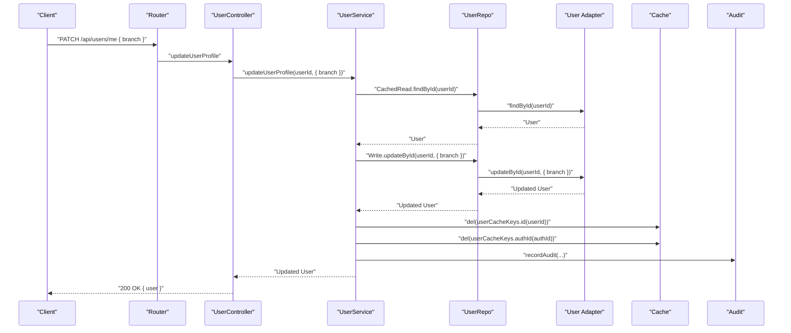

**Diagram sources**
- [user.route.ts](file://server/src/modules/user/user.route.ts#L21-L24)
- [user.controller.ts](file://server/src/modules/user/user.controller.ts#L41-L51)
- [user.service.ts](file://server/src/modules/user/user.service.ts#L64-L89)
- [user.repo.ts](file://server/src/modules/user/user.repo.ts#L49-L56)
- [user.adapter.ts](file://server/src/infra/db/adapters/user.adapter.ts#L213-L232)
- [user.cache-keys.ts](file://server/src/modules/user/user.cache-keys.ts)

**Section sources**
- [user.route.ts](file://server/src/modules/user/user.route.ts#L21-L24)
- [user.controller.ts](file://server/src/modules/user/user.controller.ts#L41-L51)
- [user.schema.ts](file://server/src/modules/user/user.schema.ts#L37-L39)
- [user.service.ts](file://server/src/modules/user/user.service.ts#L64-L89)
- [user.dto.ts](file://server/src/modules/user/user.dto.ts#L3-L11)

#### Accept Terms
- Method: POST
- Path: /api/users/accept-terms
- Description: Mark terms as accepted for the authenticated user
- Authentication: Required
- Authorization: Onboarded user required
- Response: Success message
- Side effects:
  - Cache keys invalidated for user and auth
  - Audit record logged

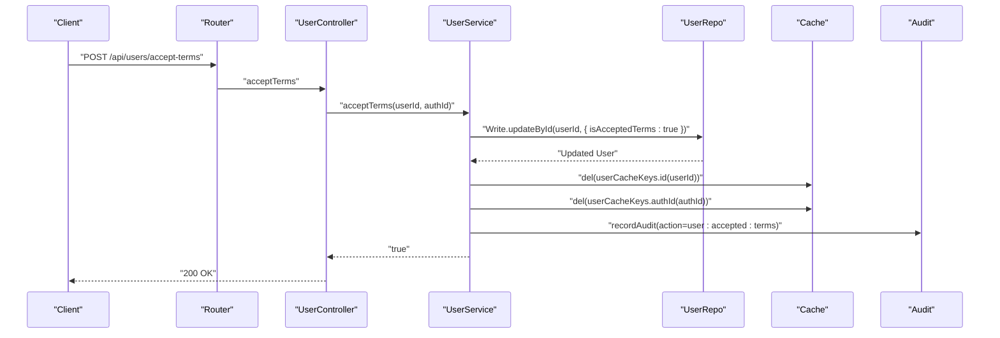

**Diagram sources**
- [user.route.ts](file://server/src/modules/user/user.route.ts#L25-L25)
- [user.controller.ts](file://server/src/modules/user/user.controller.ts#L35-L39)
- [user.service.ts](file://server/src/modules/user/user.service.ts#L47-L62)

**Section sources**
- [user.route.ts](file://server/src/modules/user/user.route.ts#L25-L25)
- [user.controller.ts](file://server/src/modules/user/user.controller.ts#L35-L39)
- [user.service.ts](file://server/src/modules/user/user.service.ts#L47-L62)

#### Block User
- Method: POST
- Path: /api/users/block/:userId
- Description: Block another user
- Authentication: Required
- Authorization: Onboarded user required
- Validation: Route parameter validated by userId schema
- Business rules:
  - Cannot block self
  - Both requester and target must exist
  - Creates a block relation
- Response: { blocked: true }
- Errors:
  - 400 Bad Request if attempting to block self
  - 404 Not Found if either user does not exist

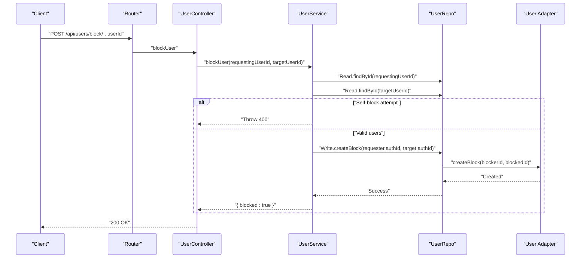

**Diagram sources**
- [user.route.ts](file://server/src/modules/user/user.route.ts#L27-L27)
- [user.controller.ts](file://server/src/modules/user/user.controller.ts#L53-L57)
- [user.service.ts](file://server/src/modules/user/user.service.ts#L91-L109)
- [user.repo.ts](file://server/src/modules/user/user.repo.ts#L54-L55)
- [user.adapter.ts](file://server/src/infra/db/adapters/user.adapter.ts#L426-L441)

**Section sources**
- [user.route.ts](file://server/src/modules/user/user.route.ts#L27-L27)
- [user.controller.ts](file://server/src/modules/user/user.controller.ts#L53-L57)
- [user.service.ts](file://server/src/modules/user/user.service.ts#L91-L109)
- [user.schema.ts](file://server/src/modules/user/user.schema.ts#L14-L16)

#### Unblock User
- Method: POST
- Path: /api/users/unblock/:userId
- Description: Unblock a previously blocked user
- Authentication: Required
- Authorization: Onboarded user required
- Validation: Route parameter validated by userId schema
- Business rules:
  - Both requester and target must exist
  - Removes block relation
- Response: { blocked: false }
- Errors:
  - 404 Not Found if either user does not exist

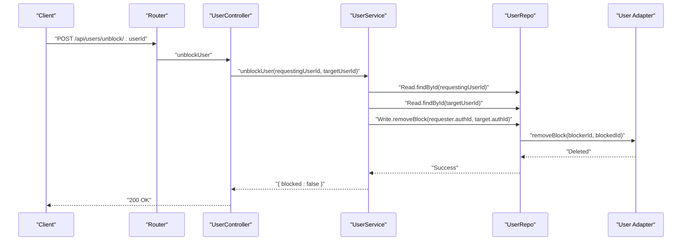

**Diagram sources**
- [user.route.ts](file://server/src/modules/user/user.route.ts#L28-L28)
- [user.controller.ts](file://server/src/modules/user/user.controller.ts#L59-L63)
- [user.service.ts](file://server/src/modules/user/user.service.ts#L111-L125)
- [user.repo.ts](file://server/src/modules/user/user.repo.ts#L54-L55)
- [user.adapter.ts](file://server/src/infra/db/adapters/user.adapter.ts#L443-L459)

**Section sources**
- [user.route.ts](file://server/src/modules/user/user.route.ts#L28-L28)
- [user.controller.ts](file://server/src/modules/user/user.controller.ts#L59-L63)
- [user.service.ts](file://server/src/modules/user/user.service.ts#L111-L125)
- [user.schema.ts](file://server/src/modules/user/user.schema.ts#L14-L16)

#### List Blocked Users
- Method: GET
- Path: /api/users/blocked
- Description: Retrieve the list of users blocked by the authenticated user
- Authentication: Required
- Authorization: Onboarded user required
- Response: Array of blocked users with minimal details
- Errors:
  - 404 Not Found if the authenticated user does not exist

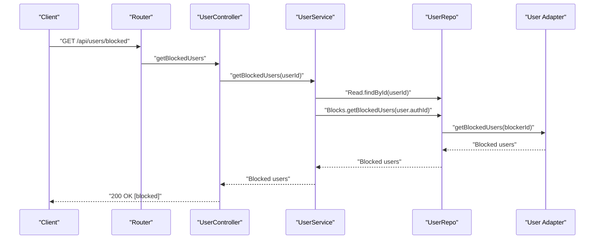

**Diagram sources**
- [user.route.ts](file://server/src/modules/user/user.route.ts#L29-L29)
- [user.controller.ts](file://server/src/modules/user/user.controller.ts#L65-L68)
- [user.service.ts](file://server/src/modules/user/user.service.ts#L127-L133)
- [user.repo.ts](file://server/src/modules/user/user.repo.ts#L58-L63)
- [user.adapter.ts](file://server/src/infra/db/adapters/user.adapter.ts#L461-L481)

**Section sources**
- [user.route.ts](file://server/src/modules/user/user.route.ts#L29-L29)
- [user.controller.ts](file://server/src/modules/user/user.controller.ts#L65-L68)
- [user.service.ts](file://server/src/modules/user/user.service.ts#L127-L133)

### Request and Response Schemas

#### Route Parameters
- userId
  - Type: string
  - Required: Yes
  - Validation: Non-empty string
- query
  - Type: string
  - Required: Yes
  - Validation: Non-empty string

**Section sources**
- [user.schema.ts](file://server/src/modules/user/user.schema.ts#L14-L16)
- [user.schema.ts](file://server/src/modules/user/user.schema.ts#L33-L35)

#### Request Bodies
- Update Profile
  - branch: string (min length 1)
  - Example: { "branch": "Computer Science" }

**Section sources**
- [user.schema.ts](file://server/src/modules/user/user.schema.ts#L37-L39)

#### Response Models
- Public User
  - id: string
  - username: string
  - karma: number
  - collegeId: string
  - branch: string
  - createdAt: datetime
  - updatedAt: datetime

**Section sources**
- [user.dto.ts](file://server/src/modules/user/user.dto.ts#L3-L11)
- [User.ts](file://server/src/shared/types/User.ts#L3-L4)

### Privacy and Interaction Controls
- Block Relations
  - Users can block other users
  - Blocked users cannot interact (as enforced by guards)
  - Self-blocking is prevented
- Guard Enforcement
  - assertNoBlockRelationBetweenUsers checks for block relations before sensitive operations

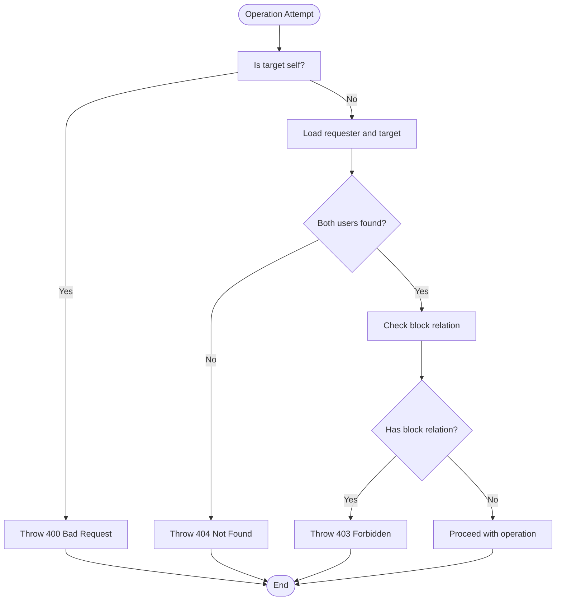

**Diagram sources**
- [block.guard.ts](file://server/src/modules/user/block.guard.ts#L5-L40)

**Section sources**
- [block.guard.ts](file://server/src/modules/user/block.guard.ts#L1-L41)
- [user.service.ts](file://server/src/modules/user/user.service.ts#L91-L109)

### Permissions and Role-Based Access Control
- Authentication Pipeline
  - authenticated middleware validates session
- User Context Injection
  - injectUser attaches req.user and req.auth
- Onboarding Requirement
  - requireOnboardedUser ensures user has completed onboarding
- Roles and RBAC
  - Role definitions and RBAC utilities exist in core/security and config
  - Current user endpoints do not enforce role-specific restrictions

**Section sources**
- [authenticated.ts](file://server/src/core/middlewares/pipelines.ts)
- [injectUser.ts](file://server/src/core/middlewares/injectUser.ts)
- [requireOnboardedUser.ts](file://server/src/core/middlewares/requireOnboardedUser.ts)
- [rbac.ts](file://server/src/core/security/rbac.ts)
- [roles.ts](file://server/src/config/roles.ts)

### Account Lifecycle Management
- Terms Acceptance
  - POST /api/users/accept-terms marks terms as accepted
  - Triggers cache invalidation and audit logging
- Suspension and Blocking
  - Moderation adapter supports blocking/suspending users via auth table
  - These operations are separate from user CRUD and are intended for moderation workflows

**Section sources**
- [user.service.ts](file://server/src/modules/user/user.service.ts#L47-L62)
- [user.adapter.ts](file://server/src/infra/db/adapters/user.adapter.ts#L323-L379)

### Examples

#### Profile Picture Upload
- Endpoint: PATCH /api/users/me
- Payload: { "branch": "..." }
- Notes:
  - Current schema supports branch updates
  - For profile picture, extend request body schema to include image upload (multipart/form-data)
  - Use multipart-upload middleware and media services for handling images

**Section sources**
- [user.route.ts](file://server/src/modules/user/user.route.ts#L21-L24)
- [user.schema.ts](file://server/src/modules/user/user.schema.ts#L37-L39)

#### Bio Editing
- Endpoint: PATCH /api/users/me
- Payload: { "branch": "..." }
- Notes:
  - Extend schema to include bio field
  - Update service to handle bio updates
  - Invalidate caches and log audit

**Section sources**
- [user.schema.ts](file://server/src/modules/user/user.schema.ts#L37-L39)
- [user.service.ts](file://server/src/modules/user/user.service.ts#L64-L89)

#### Notification Preferences
- Endpoint: PATCH /api/users/me
- Payload: { "preferences": { "email": true, "push": false } }
- Notes:
  - Add preferences field to user schema and DTO
  - Implement service methods to persist preferences
  - Integrate with notification service

**Section sources**
- [user.schema.ts](file://server/src/modules/user/user.schema.ts#L37-L39)
- [user.dto.ts](file://server/src/modules/user/user.dto.ts#L3-L11)

## Dependency Analysis
The user module depends on:
- Core HTTP utilities for responses and errors
- Middlewares for authentication, injection, and rate limiting
- Repository pattern abstracting database operations
- Adapter mapping to database tables
- Cache service for performance
- Audit logging for compliance

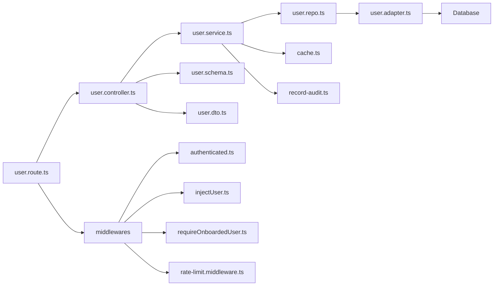

**Diagram sources**
- [user.route.ts](file://server/src/modules/user/user.route.ts#L1-L32)
- [user.controller.ts](file://server/src/modules/user/user.controller.ts#L1-L72)
- [user.service.ts](file://server/src/modules/user/user.service.ts#L1-L137)
- [user.repo.ts](file://server/src/modules/user/user.repo.ts#L1-L67)
- [user.adapter.ts](file://server/src/infra/db/adapters/user.adapter.ts#L1-L537)
- [user.schema.ts](file://server/src/modules/user/user.schema.ts#L1-L40)
- [user.dto.ts](file://server/src/modules/user/user.dto.ts#L1-L17)

**Section sources**
- [user.route.ts](file://server/src/modules/user/user.route.ts#L1-L32)
- [user.controller.ts](file://server/src/modules/user/user.controller.ts#L1-L72)
- [user.service.ts](file://server/src/modules/user/user.service.ts#L1-L137)
- [user.repo.ts](file://server/src/modules/user/user.repo.ts#L1-L67)
- [user.adapter.ts](file://server/src/infra/db/adapters/user.adapter.ts#L1-L537)

## Performance Considerations
- Caching
  - CachedRead in UserRepo reduces database load for profile reads
  - Cache invalidation after writes ensures consistency
- Database Indexes
  - Ensure indexes on users(id), users(authId), users(username), auth(id)
- Pagination and Limits
  - Search uses a fixed limit; consider configurable limits for scalability
- Audit Logging
  - Audit records are written synchronously; consider batching for high throughput

[No sources needed since this section provides general guidance]

## Troubleshooting Guide
- Common HTTP Errors
  - 400 Bad Request: Invalid input (e.g., self-block attempt)
  - 401 Unauthorized: Missing or invalid session
  - 403 Forbidden: Insufficient permissions or blocked interaction
  - 404 Not Found: User not found
  - 429 Too Many Requests: Rate limit exceeded
- Validation Failures
  - Route parameters must match schema requirements
  - Request bodies must satisfy UpdateProfileSchema
- Audit and Logging
  - Check logs for audit events and error traces
  - Verify cache keys and invalidation flows

**Section sources**
- [error.ts](file://server/src/core/http/error.ts)
- [logger.ts](file://server/src/core/logger/logger.ts)
- [rate-limit.middleware.ts](file://server/src/core/middlewares/rate-limit.middleware.ts)
- [user.schema.ts](file://server/src/modules/user/user.schema.ts#L14-L39)
- [user.service.ts](file://server/src/modules/user/user.service.ts#L92-L100)

## Conclusion
The user management API provides robust endpoints for profile retrieval, updates, search, and privacy controls through blocking. It leverages validation, caching, and audit logging to ensure reliability and compliance. Extending the API for profile pictures, bio editing, and notification preferences requires schema updates and corresponding service implementations while maintaining security and performance best practices.

[No sources needed since this section summarizes without analyzing specific files]

## Appendices

### API Definitions

- GET /api/users/id/:userId
  - Authenticated: Yes
  - Onboarded: Implicit via authenticated middleware
  - Response: Public user
  - Errors: 404 Not Found

- GET /api/users/search/:query
  - Authenticated: Yes
  - Response: Array of public users
  - Errors: None (returns empty array if no matches)

- GET /api/users/me
  - Authenticated: Yes
  - Onboarded: Yes
  - Response: Public user

- PATCH /api/users/me
  - Authenticated: Yes
  - Onboarded: Yes
  - Body: { branch: string }
  - Response: Public user
  - Errors: 400 Bad Request (invalid branch), 404 Not Found

- POST /api/users/accept-terms
  - Authenticated: Yes
  - Onboarded: Yes
  - Response: Success message

- POST /api/users/block/:userId
  - Authenticated: Yes
  - Onboarded: Yes
  - Response: { blocked: true }
  - Errors: 400 Bad Request (self-block), 404 Not Found

- POST /api/users/unblock/:userId
  - Authenticated: Yes
  - Onboarded: Yes
  - Response: { blocked: false }
  - Errors: 404 Not Found

- GET /api/users/blocked
  - Authenticated: Yes
  - Onboarded: Yes
  - Response: Array of blocked users
  - Errors: 404 Not Found

**Section sources**
- [user.route.ts](file://server/src/modules/user/user.route.ts#L15-L29)
- [user.controller.ts](file://server/src/modules/user/user.controller.ts#L9-L68)
- [user.schema.ts](file://server/src/modules/user/user.schema.ts#L14-L39)

### Swagger/OpenAPI
- The server includes a Swagger definition file for API documentation generation
- Use this to auto-generate client SDKs and interactive docs

**Section sources**
- [swagger.ts](file://server/docs/swagger.ts)