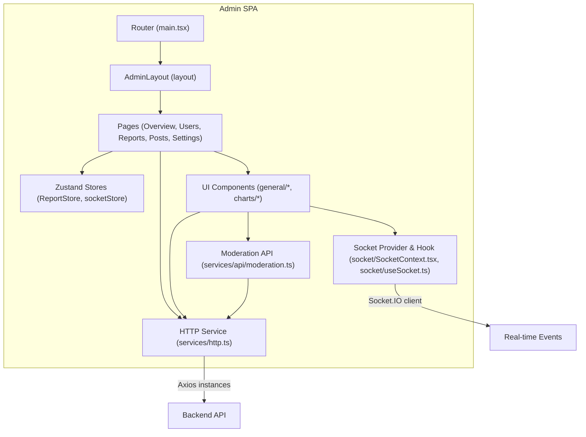
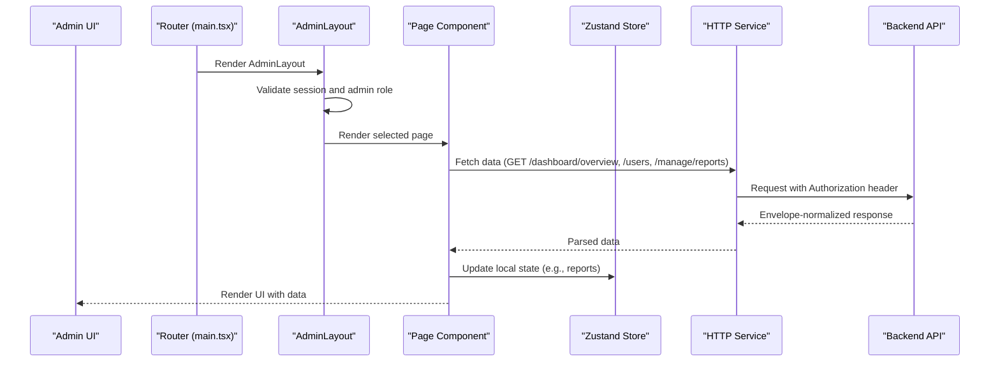
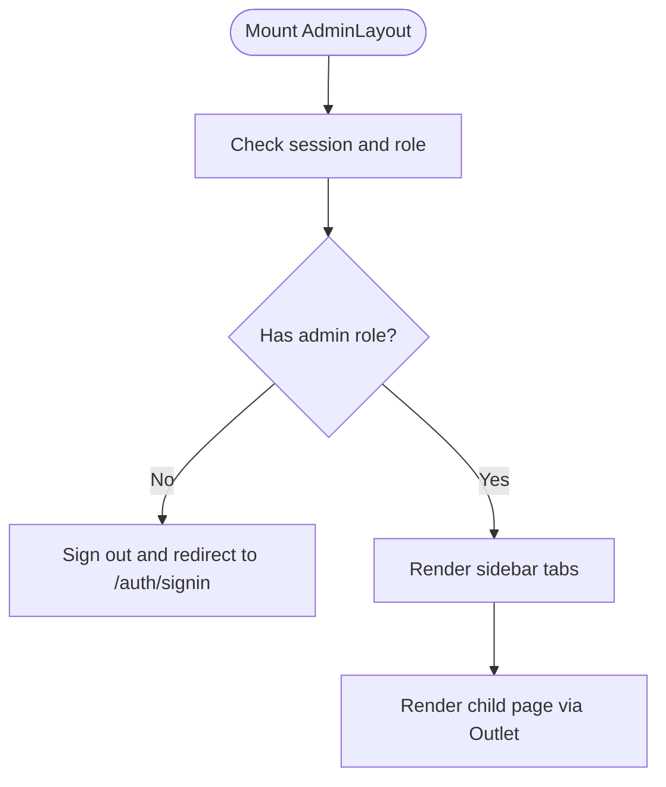
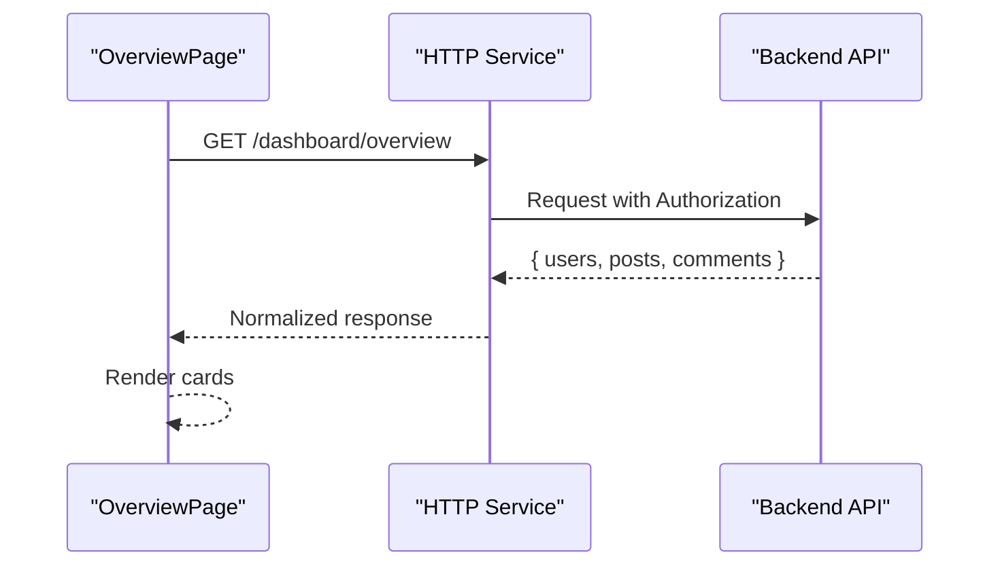
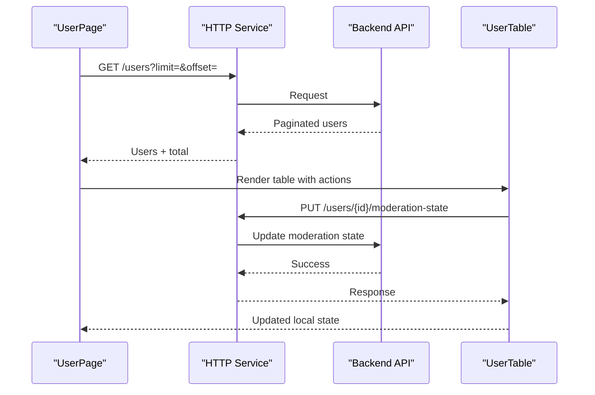
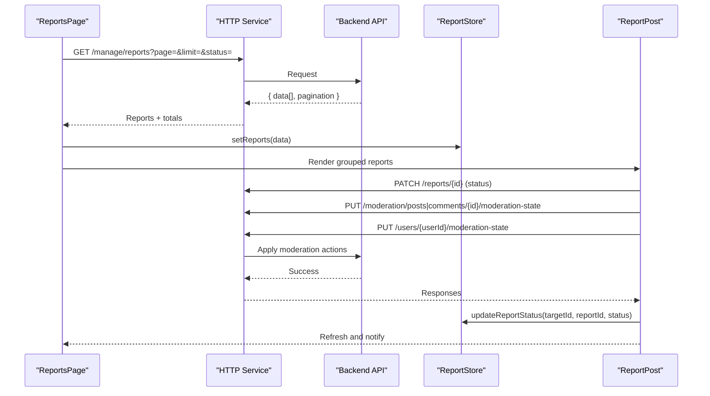
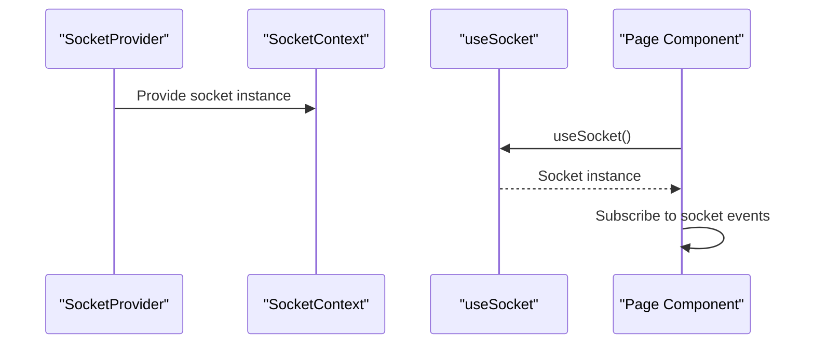
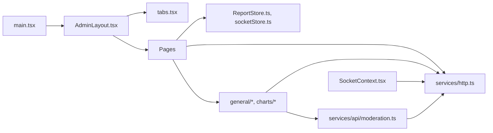

# Administrative Dashboard

<cite>
**Referenced Files in This Document**
- [admin/src/main.tsx](file://admin/src/main.tsx)
- [admin/src/layouts/AdminLayout.tsx](file://admin/src/layouts/AdminLayout.tsx)
- [admin/src/constants/tabs.tsx](file://admin/src/constants/tabs.tsx)
- [admin/src/lib/roles.ts](file://admin/src/lib/roles.ts)
- [admin/src/services/http.ts](file://admin/src/services/http.ts)
- [admin/src/services/api/moderation.ts](file://admin/src/services/api/moderation.ts)
- [admin/src/socket/SocketContext.tsx](file://admin/src/socket/SocketContext.tsx)
- [admin/src/socket/useSocket.ts](file://admin/src/socket/useSocket.ts)
- [admin/src/store/ReportStore.ts](file://admin/src/store/ReportStore.ts)
- [admin/src/store/socketStore.ts](file://admin/src/store/socketStore.ts)
- [admin/src/pages/OverviewPage.tsx](file://admin/src/pages/OverviewPage.tsx)
- [admin/src/pages/ReportsPage.tsx](file://admin/src/pages/ReportsPage.tsx)
- [admin/src/pages/UserPage.tsx](file://admin/src/pages/UserPage.tsx)
- [admin/src/pages/PostsPage.tsx](file://admin/src/pages/PostsPage.tsx)
- [admin/src/components/general/ReportPost.tsx](file://admin/src/components/general/ReportPost.tsx)
- [admin/src/components/general/UserTable.tsx](file://admin/src/components/general/UserTable.tsx)
- [admin/src/components/charts/TimelineChart.tsx](file://admin/src/components/charts/TimelineChart.tsx)
- [admin/src/types/ReportedPost.ts](file://admin/src/types/ReportedPost.ts)
</cite>

## Table of Contents
1. [Introduction](#introduction)
2. [Project Structure](#project-structure)
3. [Core Components](#core-components)
4. [Architecture Overview](#architecture-overview)
5. [Detailed Component Analysis](#detailed-component-analysis)
6. [Dependency Analysis](#dependency-analysis)
7. [Performance Considerations](#performance-considerations)
8. [Troubleshooting Guide](#troubleshooting-guide)
9. [Conclusion](#conclusion)

## Introduction
This document describes the administrative dashboard system for managing users, content, and moderation workflows. It covers the admin interface architecture, analytics visualization components, user management tools, content oversight features, reporting systems for flagged content, user moderation capabilities, and system monitoring dashboards. It also explains backend API integration, real-time data updates via sockets, administrative workflows, role permissions, bulk operations, and configuration tools.

## Project Structure
The admin application is a React-based single-page application with TypeScript, routing via react-router-dom, state managed by Zustand, and UI built with custom components and shared primitives. It integrates with a backend API through an HTTP service with interceptors and envelope normalization, and supports real-time updates via Socket.IO.

**Diagram sources**
- [admin/src/main.tsx](file://admin/src/main.tsx#L1-L96)
- [admin/src/layouts/AdminLayout.tsx](file://admin/src/layouts/AdminLayout.tsx#L1-L132)
- [admin/src/services/http.ts](file://admin/src/services/http.ts#L1-L154)
- [admin/src/services/api/moderation.ts](file://admin/src/services/api/moderation.ts#L1-L49)
- [admin/src/socket/SocketContext.tsx](file://admin/src/socket/SocketContext.tsx#L1-L26)
- [admin/src/socket/useSocket.ts](file://admin/src/socket/useSocket.ts#L1-L13)
- [admin/src/store/ReportStore.ts](file://admin/src/store/ReportStore.ts#L1-L43)
- [admin/src/store/socketStore.ts](file://admin/src/store/socketStore.ts#L1-L14)

**Section sources**
- [admin/src/main.tsx](file://admin/src/main.tsx#L1-L96)
- [admin/src/layouts/AdminLayout.tsx](file://admin/src/layouts/AdminLayout.tsx#L1-L132)

## Core Components
- Routing and navigation: The router defines admin routes and nested pages under an AdminLayout, including Overview, Users, Reports, Posts, Colleges, Branches, Logs, Feedbacks, Settings, and Banned Words.
- Authentication and permissions: AdminLayout validates sessions and enforces admin-only access using a role-check utility.
- HTTP service: Two Axios instances are configured for admin and root APIs, with interceptors for bearer tokens, response envelope normalization, and automatic token refresh on 401.
- Moderation API: Typed endpoints for banned words configuration and CRUD operations.
- Real-time updates: Socket.IO provider and hook enable real-time integrations.
- Stores: Zustand stores manage report state locally and socket user state.
- UI components: Reusable UI primitives and specialized components for tables, charts, dialogs, and modals.

**Section sources**
- [admin/src/main.tsx](file://admin/src/main.tsx#L19-L89)
- [admin/src/layouts/AdminLayout.tsx](file://admin/src/layouts/AdminLayout.tsx#L11-L65)
- [admin/src/lib/roles.ts](file://admin/src/lib/roles.ts#L1-L7)
- [admin/src/services/http.ts](file://admin/src/services/http.ts#L11-L154)
- [admin/src/services/api/moderation.ts](file://admin/src/services/api/moderation.ts#L23-L48)
- [admin/src/socket/SocketContext.tsx](file://admin/src/socket/SocketContext.tsx#L12-L23)
- [admin/src/socket/useSocket.ts](file://admin/src/socket/useSocket.ts#L4-L10)
- [admin/src/store/ReportStore.ts](file://admin/src/store/ReportStore.ts#L11-L40)
- [admin/src/store/socketStore.ts](file://admin/src/store/socketStore.ts#L8-L11)

## Architecture Overview
The admin dashboard follows a layered architecture:
- Presentation layer: Pages and components render UI and orchestrate user interactions.
- Service layer: HTTP service encapsulates API communication and token management.
- Domain layer: Pages coordinate data fetching, filtering, pagination, and state updates.
- Real-time layer: Socket provider connects to backend events for live updates.

**Diagram sources**
- [admin/src/main.tsx](file://admin/src/main.tsx#L19-L89)
- [admin/src/layouts/AdminLayout.tsx](file://admin/src/layouts/AdminLayout.tsx#L17-L65)
- [admin/src/services/http.ts](file://admin/src/services/http.ts#L97-L150)
- [admin/src/pages/OverviewPage.tsx](file://admin/src/pages/OverviewPage.tsx#L16-L29)
- [admin/src/pages/UserPage.tsx](file://admin/src/pages/UserPage.tsx#L45-L71)
- [admin/src/pages/ReportsPage.tsx](file://admin/src/pages/ReportsPage.tsx#L24-L61)
- [admin/src/store/ReportStore.ts](file://admin/src/store/ReportStore.ts#L11-L40)

## Detailed Component Analysis

### Admin Layout and Navigation
- Validates session and redirects unauthorized users to sign-in.
- Enforces admin-only access using role checks.
- Provides responsive sidebar navigation with tab definitions.

**Diagram sources**
- [admin/src/layouts/AdminLayout.tsx](file://admin/src/layouts/AdminLayout.tsx#L17-L65)
- [admin/src/lib/roles.ts](file://admin/src/lib/roles.ts#L3-L6)
- [admin/src/constants/tabs.tsx](file://admin/src/constants/tabs.tsx#L7-L53)

**Section sources**
- [admin/src/layouts/AdminLayout.tsx](file://admin/src/layouts/AdminLayout.tsx#L11-L132)
- [admin/src/constants/tabs.tsx](file://admin/src/constants/tabs.tsx#L1-L53)
- [admin/src/lib/roles.ts](file://admin/src/lib/roles.ts#L1-L7)

### Dashboard Overview
- Fetches aggregated metrics (users, posts, comments) and renders cards.
- Uses the HTTP service for API requests.

**Diagram sources**
- [admin/src/pages/OverviewPage.tsx](file://admin/src/pages/OverviewPage.tsx#L16-L29)
- [admin/src/services/http.ts](file://admin/src/services/http.ts#L97-L150)

**Section sources**
- [admin/src/pages/OverviewPage.tsx](file://admin/src/pages/OverviewPage.tsx#L1-L80)

### User Management
- Lists users with pagination and filtering by username/email.
- Supports banning/unbanning and suspending/removing suspension.
- Computes statistics for blocked/suspended/active users.

**Diagram sources**
- [admin/src/pages/UserPage.tsx](file://admin/src/pages/UserPage.tsx#L45-L117)
- [admin/src/components/general/UserTable.tsx](file://admin/src/components/general/UserTable.tsx#L48-L116)
- [admin/src/services/http.ts](file://admin/src/services/http.ts#L11-L19)

**Section sources**
- [admin/src/pages/UserPage.tsx](file://admin/src/pages/UserPage.tsx#L1-L235)
- [admin/src/components/general/UserTable.tsx](file://admin/src/components/general/UserTable.tsx#L1-L323)

### Reporting and Content Oversight
- Fetches reported posts with pagination and status filter (pending/resolved/ignored).
- Renders actionable reports with dropdown menus for moderation actions.
- Updates report status and content/user moderation states via API.

**Diagram sources**
- [admin/src/pages/ReportsPage.tsx](file://admin/src/pages/ReportsPage.tsx#L24-L69)
- [admin/src/components/general/ReportPost.tsx](file://admin/src/components/general/ReportPost.tsx#L85-L207)
- [admin/src/store/ReportStore.ts](file://admin/src/store/ReportStore.ts#L14-L39)

**Section sources**
- [admin/src/pages/ReportsPage.tsx](file://admin/src/pages/ReportsPage.tsx#L1-L122)
- [admin/src/components/general/ReportPost.tsx](file://admin/src/components/general/ReportPost.tsx#L1-L503)
- [admin/src/store/ReportStore.ts](file://admin/src/store/ReportStore.ts#L1-L43)
- [admin/src/types/ReportedPost.ts](file://admin/src/types/ReportedPost.ts#L1-L28)

### Posts Oversight
- Similar to reports but scoped to posts and comments with pending/resolved status.
- Provides refresh and pagination controls.

**Section sources**
- [admin/src/pages/PostsPage.tsx](file://admin/src/pages/PostsPage.tsx#L1-L68)

### Moderation Configuration (Banned Words)
- Lists, creates, updates, and deletes banned words with severity and strict mode.
- Integrates with typed API module.

**Section sources**
- [admin/src/services/api/moderation.ts](file://admin/src/services/api/moderation.ts#L1-L49)

### Real-Time Data Updates
- Socket provider initializes a Socket.IO connection with WebSocket transport.
- Custom hook exposes the socket instance to components.
- Socket user store maintains current user context for socket events.

**Diagram sources**
- [admin/src/socket/SocketContext.tsx](file://admin/src/socket/SocketContext.tsx#L12-L23)
- [admin/src/socket/useSocket.ts](file://admin/src/socket/useSocket.ts#L4-L10)
- [admin/src/store/socketStore.ts](file://admin/src/store/socketStore.ts#L8-L11)

**Section sources**
- [admin/src/socket/SocketContext.tsx](file://admin/src/socket/SocketContext.tsx#L1-L26)
- [admin/src/socket/useSocket.ts](file://admin/src/socket/useSocket.ts#L1-L13)
- [admin/src/store/socketStore.ts](file://admin/src/store/socketStore.ts#L1-L14)

### Analytics Visualization Components
- TimelineChart renders a responsive stacked bar chart for time-series-like data.
- Can be integrated into dashboards for activity or sentiment timelines.

**Section sources**
- [admin/src/components/charts/TimelineChart.tsx](file://admin/src/components/charts/TimelineChart.tsx#L1-L47)

## Dependency Analysis
- Router depends on AdminLayout and page components.
- AdminLayout depends on auth client, role checks, and tab definitions.
- Pages depend on HTTP service and stores.
- ReportPost and UserTable depend on HTTP service and share TableWrapper.
- Moderation API module depends on root HTTP for non-admin endpoints.
- Socket provider depends on environment variable for server URI.

**Diagram sources**
- [admin/src/main.tsx](file://admin/src/main.tsx#L19-L89)
- [admin/src/layouts/AdminLayout.tsx](file://admin/src/layouts/AdminLayout.tsx#L1-L132)
- [admin/src/constants/tabs.tsx](file://admin/src/constants/tabs.tsx#L1-L53)
- [admin/src/services/http.ts](file://admin/src/services/http.ts#L1-L154)
- [admin/src/services/api/moderation.ts](file://admin/src/services/api/moderation.ts#L1-L49)
- [admin/src/socket/SocketContext.tsx](file://admin/src/socket/SocketContext.tsx#L1-L26)
- [admin/src/store/ReportStore.ts](file://admin/src/store/ReportStore.ts#L1-L43)
- [admin/src/store/socketStore.ts](file://admin/src/store/socketStore.ts#L1-L14)

**Section sources**
- [admin/src/main.tsx](file://admin/src/main.tsx#L1-L96)
- [admin/src/layouts/AdminLayout.tsx](file://admin/src/layouts/AdminLayout.tsx#L1-L132)
- [admin/src/services/http.ts](file://admin/src/services/http.ts#L1-L154)

## Performance Considerations
- Pagination reduces payload sizes for user and report listings.
- Local state updates via Zustand minimize re-renders and avoid unnecessary network calls.
- Token refresh interceptor prevents redundant manual refresh logic.
- Responsive charts adapt to container size without heavy computations.
- Consider debouncing search inputs and caching envelopes for repeated queries.

## Troubleshooting Guide
- Unauthorized access: AdminLayout signs out non-admin users and redirects to sign-in.
- 401 responses: HTTP service automatically refreshes tokens and retries failed requests.
- Toast notifications: Sonner is used across components for user feedback on actions.
- Report status updates: Local store updates are applied immediately while backend sync occurs.

**Section sources**
- [admin/src/layouts/AdminLayout.tsx](file://admin/src/layouts/AdminLayout.tsx#L35-L57)
- [admin/src/services/http.ts](file://admin/src/services/http.ts#L97-L150)
- [admin/src/pages/ReportsPage.tsx](file://admin/src/pages/ReportsPage.tsx#L50-L58)
- [admin/src/components/general/ReportPost.tsx](file://admin/src/components/general/ReportPost.tsx#L199-L204)

## Conclusion
The administrative dashboard provides a secure, modular, and extensible platform for monitoring and moderating users and content. Its layered architecture, robust HTTP service with token refresh, real-time socket integration, and reusable UI components enable efficient administration workflows. Role-based access control, pagination, and local state management ensure responsiveness and scalability.