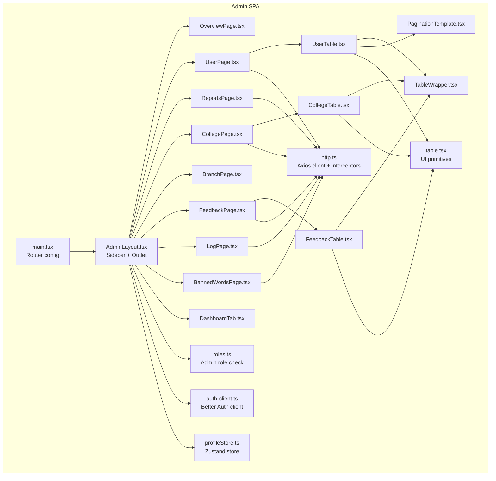
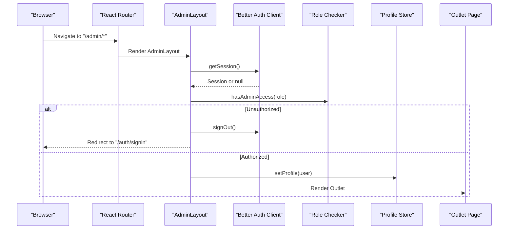
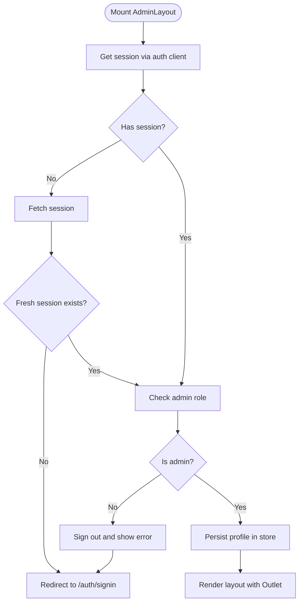
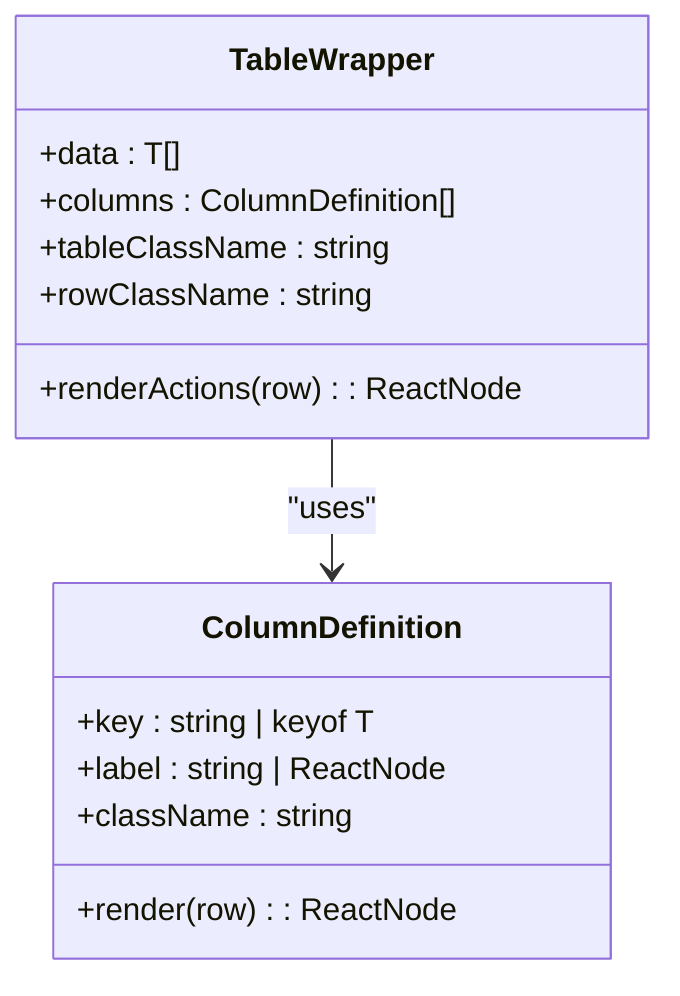
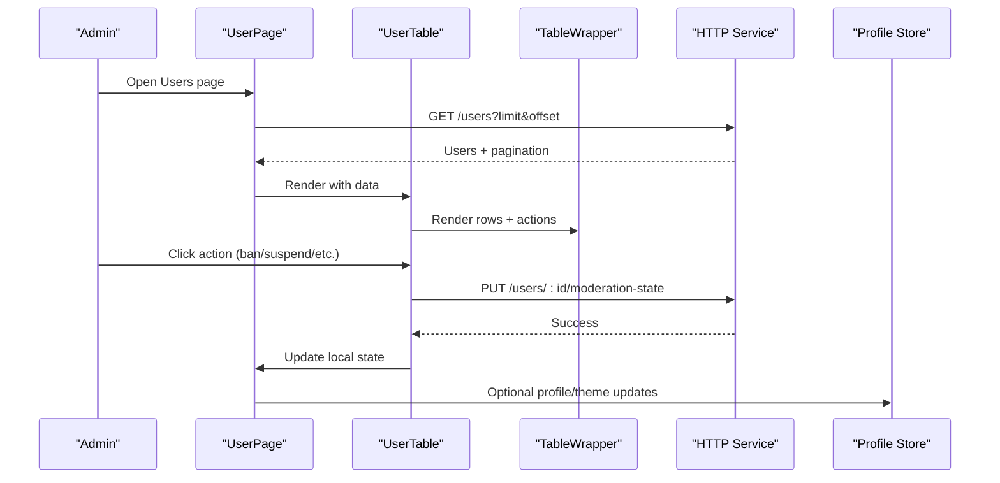
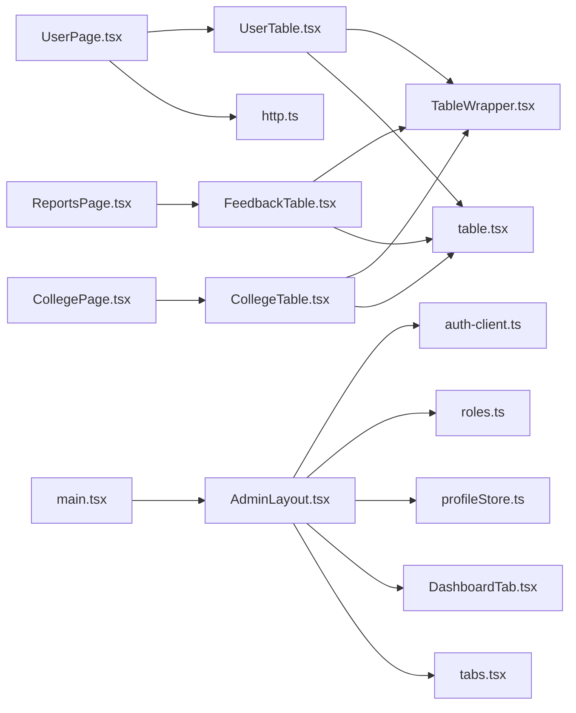

# Administrative Interfaces

<cite>
**Referenced Files in This Document**
- [AdminLayout.tsx](file://admin/src/layouts/AdminLayout.tsx)
- [DashboardTab.tsx](file://admin/src/components/general/DashboardTab.tsx)
- [TableWrapper.tsx](file://admin/src/components/general/TableWrapper.tsx)
- [tabs.tsx](file://admin/src/constants/tabs.tsx)
- [auth-client.ts](file://admin/src/lib/auth-client.ts)
- [roles.ts](file://admin/src/lib/roles.ts)
- [main.tsx](file://admin/src/main.tsx)
- [OverviewPage.tsx](file://admin/src/pages/OverviewPage.tsx)
- [UserPage.tsx](file://admin/src/pages/UserPage.tsx)
- [ReportsPage.tsx](file://admin/src/pages/ReportsPage.tsx)
- [UserTable.tsx](file://admin/src/components/general/UserTable.tsx)
- [CollegeTable.tsx](file://admin/src/components/general/CollegeTable.tsx)
- [FeedbackTable.tsx](file://admin/src/components/general/FeedbackTable.tsx)
- [PaginationTemplate.tsx](file://admin/src/components/general/PaginationTemplate.tsx)
- [table.tsx](file://admin/src/components/ui/table.tsx)
- [profileStore.ts](file://admin/src/store/profileStore.ts)
- [http.ts](file://admin/src/services/http.ts)
</cite>

## Table of Contents
1. [Introduction](#introduction)
2. [Project Structure](#project-structure)
3. [Core Components](#core-components)
4. [Architecture Overview](#architecture-overview)
5. [Detailed Component Analysis](#detailed-component-analysis)
6. [Dependency Analysis](#dependency-analysis)
7. [Performance Considerations](#performance-considerations)
8. [Troubleshooting Guide](#troubleshooting-guide)
9. [Conclusion](#conclusion)
10. [Appendices](#appendices)

## Introduction
This document describes the administrative interface components and layout system. It covers the dashboard tab navigation, reusable table wrapper components, and the administrative layout structure. It also documents reusable UI components, responsive design patterns, administrative workflow interfaces, authentication and permission-based access control, administrative routing, component composition patterns, layout customization, administrative user experience, accessibility features, and efficiency tools.

## Project Structure
The administrative application is a React SPA built with Vite and TypeScript, styled with Tailwind CSS. Routing is handled via React Router. The admin-specific code resides under admin/src, including:
- Layouts: AdminLayout, AuthLayout, AppLayout, RootLayout
- Pages: Overview, Users, Reports, Colleges, Branches, Logs, Feedback, Settings, Banned Words
- Components: General UI building blocks (tables, forms, pagination), reusable UI primitives
- Services: HTTP client with interceptors and envelope normalization
- Stores: Zustand stores for profile and socket/report state
- Authentication: Better Auth client configured for admin plugin
- Constants: Navigation tabs definition

**Diagram sources**
- [main.tsx](file://admin/src/main.tsx#L19-L89)
- [AdminLayout.tsx](file://admin/src/layouts/AdminLayout.tsx#L1-L132)
- [UserPage.tsx](file://admin/src/pages/UserPage.tsx#L1-L235)
- [UserTable.tsx](file://admin/src/components/general/UserTable.tsx#L1-L323)
- [CollegeTable.tsx](file://admin/src/components/general/CollegeTable.tsx#L1-L95)
- [FeedbackTable.tsx](file://admin/src/components/general/FeedbackTable.tsx#L1-L130)
- [TableWrapper.tsx](file://admin/src/components/general/TableWrapper.tsx#L1-L101)
- [PaginationTemplate.tsx](file://admin/src/components/general/PaginationTemplate.tsx#L1-L88)
- [table.tsx](file://admin/src/components/ui/table.tsx#L1-L121)
- [http.ts](file://admin/src/services/http.ts#L1-L154)
- [roles.ts](file://admin/src/lib/roles.ts#L1-L7)
- [auth-client.ts](file://admin/src/lib/auth-client.ts#L1-L11)
- [profileStore.ts](file://admin/src/store/profileStore.ts#L1-L39)

**Section sources**
- [main.tsx](file://admin/src/main.tsx#L19-L89)
- [AdminLayout.tsx](file://admin/src/layouts/AdminLayout.tsx#L1-L132)

## Core Components
- AdminLayout: Provides the admin shell with sidebar navigation, mobile menu, session validation, and outlet rendering. Integrates authentication, role checks, and profile persistence.
- DashboardTab: Reusable tab item for sidebar navigation with active state styling.
- TableWrapper: Generic table renderer supporting nested property access, custom cell renderers, and optional actions column.
- PaginationTemplate: Reusable pagination controls with boundary links and ellipsis.
- UI primitives: Table components (Table, TableBody, TableRow, TableHead, TableCell) used by TableWrapper and other tables.
- Pages: Overview, Users, Reports, Colleges, Branches, Feedback, Logs, Banned Words, Settings, and NotFoundPage.
- Stores: Profile store for admin identity and theme.
- Services: HTTP client with credential support, access token injection, response envelope normalization, and automatic token refresh on 401.

**Section sources**
- [AdminLayout.tsx](file://admin/src/layouts/AdminLayout.tsx#L11-L132)
- [DashboardTab.tsx](file://admin/src/components/general/DashboardTab.tsx#L4-L28)
- [TableWrapper.tsx](file://admin/src/components/general/TableWrapper.tsx#L11-L101)
- [PaginationTemplate.tsx](file://admin/src/components/general/PaginationTemplate.tsx#L11-L88)
- [table.tsx](file://admin/src/components/ui/table.tsx#L1-L121)
- [main.tsx](file://admin/src/main.tsx#L19-L89)
- [profileStore.ts](file://admin/src/store/profileStore.ts#L12-L35)
- [http.ts](file://admin/src/services/http.ts#L11-L154)

## Architecture Overview
The admin SPA is structured around a central AdminLayout that wraps child pages. Navigation is driven by a constant list of tabs. Authentication is enforced at the layout level using a Better Auth client and role checks. Data access is centralized via an Axios-based HTTP service with interceptors for token injection and response normalization. State is managed with Zustand for profile data.

**Diagram sources**
- [AdminLayout.tsx](file://admin/src/layouts/AdminLayout.tsx#L17-L65)
- [auth-client.ts](file://admin/src/lib/auth-client.ts#L4-L10)
- [roles.ts](file://admin/src/lib/roles.ts#L3-L6)
- [profileStore.ts](file://admin/src/store/profileStore.ts#L12-L35)

## Detailed Component Analysis

### AdminLayout: Navigation and Access Control
- Mobile-first responsive sidebar with overlay and close button.
- Fixed header on mobile; collapsible sidebar on larger screens.
- Renders DashboardTab entries from a constant list.
- Validates session and enforces admin-only access; redirects unauthorized users and clears stale sessions.
- Persists admin profile in a Zustand store for downstream components.

**Diagram sources**
- [AdminLayout.tsx](file://admin/src/layouts/AdminLayout.tsx#L17-L65)
- [roles.ts](file://admin/src/lib/roles.ts#L3-L6)
- [profileStore.ts](file://admin/src/store/profileStore.ts#L12-L35)

**Section sources**
- [AdminLayout.tsx](file://admin/src/layouts/AdminLayout.tsx#L11-L132)
- [tabs.tsx](file://admin/src/constants/tabs.tsx#L7-L53)
- [DashboardTab.tsx](file://admin/src/components/general/DashboardTab.tsx#L4-L28)
- [roles.ts](file://admin/src/lib/roles.ts#L1-L7)
- [profileStore.ts](file://admin/src/store/profileStore.ts#L12-L35)

### DashboardTab: Navigation Item
- Styled link using NavLink with active state styling.
- Accepts arbitrary children for icons and labels.

**Section sources**
- [DashboardTab.tsx](file://admin/src/components/general/DashboardTab.tsx#L4-L28)
- [tabs.tsx](file://admin/src/constants/tabs.tsx#L7-L53)

### TableWrapper: Generic Table Renderer
- Supports generic data typing and column definitions.
- Nested property access via dot notation (e.g., "college.profile").
- Optional custom renderers per column and per row actions.
- Uses UI table primitives for consistent styling.

**Diagram sources**
- [TableWrapper.tsx](file://admin/src/components/general/TableWrapper.tsx#L11-L41)
- [table.tsx](file://admin/src/components/ui/table.tsx#L1-L121)

**Section sources**
- [TableWrapper.tsx](file://admin/src/components/general/TableWrapper.tsx#L35-L101)
- [table.tsx](file://admin/src/components/ui/table.tsx#L1-L121)

### PaginationTemplate: Pagination Controls
- Renders previous/next buttons and first pages with ellipsis for large page sets.
- Controlled via props for current page and total pages.

**Section sources**
- [PaginationTemplate.tsx](file://admin/src/components/general/PaginationTemplate.tsx#L17-L88)

### User Management Workflow
- UserPage orchestrates loading, filtering, pagination, and statistics.
- UserTable renders user data, supports inline actions (ban/unban, suspend/remove suspension), and opens a dialog for suspension details.
- Uses HTTP service for CRUD operations and updates local state.

**Diagram sources**
- [UserPage.tsx](file://admin/src/pages/UserPage.tsx#L45-L117)
- [UserTable.tsx](file://admin/src/components/general/UserTable.tsx#L48-L116)
- [TableWrapper.tsx](file://admin/src/components/general/TableWrapper.tsx#L35-L101)
- [http.ts](file://admin/src/services/http.ts#L11-L154)
- [profileStore.ts](file://admin/src/store/profileStore.ts#L12-L35)

**Section sources**
- [UserPage.tsx](file://admin/src/pages/UserPage.tsx#L22-L235)
- [UserTable.tsx](file://admin/src/components/general/UserTable.tsx#L41-L323)
- [CollegeTable.tsx](file://admin/src/components/general/CollegeTable.tsx#L23-L95)
- [FeedbackTable.tsx](file://admin/src/components/general/FeedbackTable.tsx#L13-L130)
- [PaginationTemplate.tsx](file://admin/src/components/general/PaginationTemplate.tsx#L17-L88)

### Reports Management Workflow
- ReportsPage loads paginated reports filtered by status and supports manual refresh.
- Uses a dedicated store for report state and a reusable table component for display.

**Section sources**
- [ReportsPage.tsx](file://admin/src/pages/ReportsPage.tsx#L14-L122)
- [FeedbackTable.tsx](file://admin/src/components/general/FeedbackTable.tsx#L13-L130)

### Overview Dashboard
- OverviewPage fetches summary metrics and displays them in cards.

**Section sources**
- [OverviewPage.tsx](file://admin/src/pages/OverviewPage.tsx#L12-L80)

### Routing and Navigation
- Admin routes are nested under "/" with children for each page.
- Auth routes are nested under "/auth".
- Sidebar tabs map to these routes.

**Section sources**
- [main.tsx](file://admin/src/main.tsx#L19-L89)
- [tabs.tsx](file://admin/src/constants/tabs.tsx#L7-L53)

## Dependency Analysis
- AdminLayout depends on:
  - Better Auth client for session management
  - Role checker for admin-only access
  - Profile store for persisted admin identity
  - DashboardTab and tabs constant for navigation
- Pages depend on:
  - HTTP service for API calls
  - UI primitives and reusable components
  - Stores for state
- TableWrapper is consumed by:
  - UserTable, CollegeTable, FeedbackTable

**Diagram sources**
- [AdminLayout.tsx](file://admin/src/layouts/AdminLayout.tsx#L1-L132)
- [auth-client.ts](file://admin/src/lib/auth-client.ts#L1-L11)
- [roles.ts](file://admin/src/lib/roles.ts#L1-L7)
- [profileStore.ts](file://admin/src/store/profileStore.ts#L1-L39)
- [DashboardTab.tsx](file://admin/src/components/general/DashboardTab.tsx#L1-L28)
- [tabs.tsx](file://admin/src/constants/tabs.tsx#L1-L53)
- [UserPage.tsx](file://admin/src/pages/UserPage.tsx#L1-L235)
- [UserTable.tsx](file://admin/src/components/general/UserTable.tsx#L1-L323)
- [CollegeTable.tsx](file://admin/src/components/general/CollegeTable.tsx#L1-L95)
- [FeedbackTable.tsx](file://admin/src/components/general/FeedbackTable.tsx#L1-L130)
- [TableWrapper.tsx](file://admin/src/components/general/TableWrapper.tsx#L1-L101)
- [table.tsx](file://admin/src/components/ui/table.tsx#L1-L121)
- [http.ts](file://admin/src/services/http.ts#L1-L154)
- [main.tsx](file://admin/src/main.tsx#L1-L96)

**Section sources**
- [AdminLayout.tsx](file://admin/src/layouts/AdminLayout.tsx#L1-L132)
- [main.tsx](file://admin/src/main.tsx#L19-L89)

## Performance Considerations
- Prefer virtualized lists for very large datasets (not currently implemented).
- Debounce search inputs in UserPage to reduce network requests.
- Memoize derived stats and computed values to avoid unnecessary re-renders.
- Lazy-load heavy pages or components if needed.
- Use efficient table rendering with minimal re-renders for row updates.

## Troubleshooting Guide
- Unauthorized access attempts:
  - AdminLayout signs out and redirects to sign-in when role is insufficient.
  - Toast notifications inform the user.
- Token refresh failures:
  - HTTP service queues pending requests during refresh and rejects after failure.
  - On failure callback triggers navigation to sign-in.
- Network errors:
  - Pages display toasts and fallback UI states (loading skeletons, empty states).
- Pagination anomalies:
  - Ensure page resets when filters change and total pages are recalculated.

**Section sources**
- [AdminLayout.tsx](file://admin/src/layouts/AdminLayout.tsx#L35-L57)
- [http.ts](file://admin/src/services/http.ts#L97-L150)

## Conclusion
The administrative interface leverages a clean layout with robust access control, reusable UI components, and a consistent data-fetching pattern. The modular design enables rapid development of administrative features while maintaining a cohesive UX. Extending the system involves adding new pages, integrating with the HTTP service, and composing existing components like TableWrapper and PaginationTemplate.

## Appendices

### Accessibility Features
- Semantic HTML and proper heading hierarchy in pages.
- Focusable controls with visible focus indicators.
- Sufficient color contrast for text and backgrounds.
- Interactive elements provide hover and focus states.
- Clipboard copy actions include feedback via toasts.

### Administrative Efficiency Tools
- Bulk actions and inline editing in tables.
- Quick filters and status toggles.
- Responsive sidebar with mobile-friendly navigation.
- Persistent profile and theme preferences via the profile store.