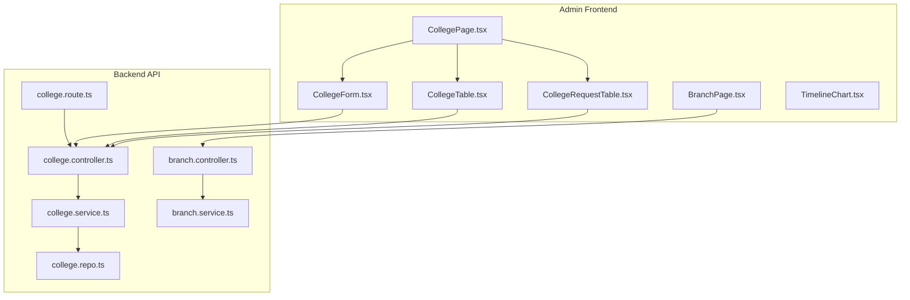
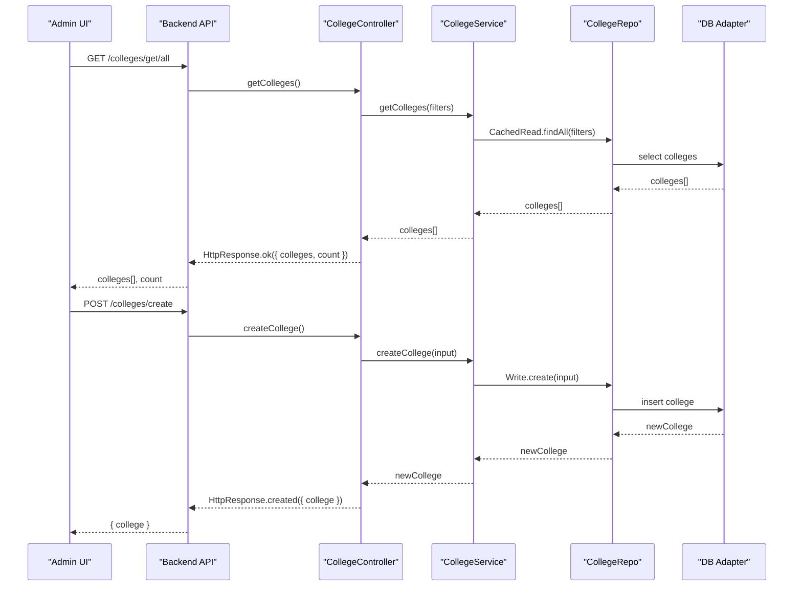
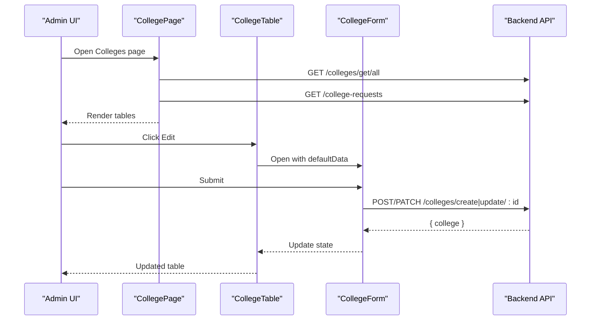
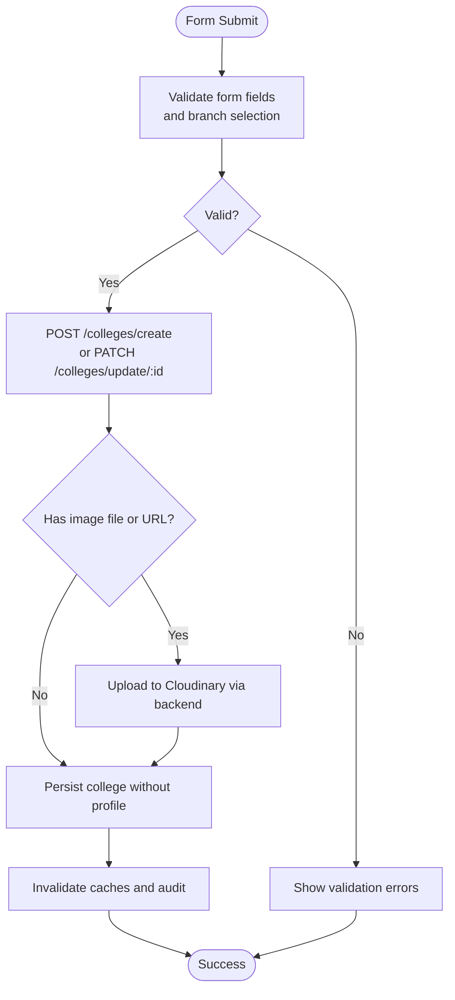
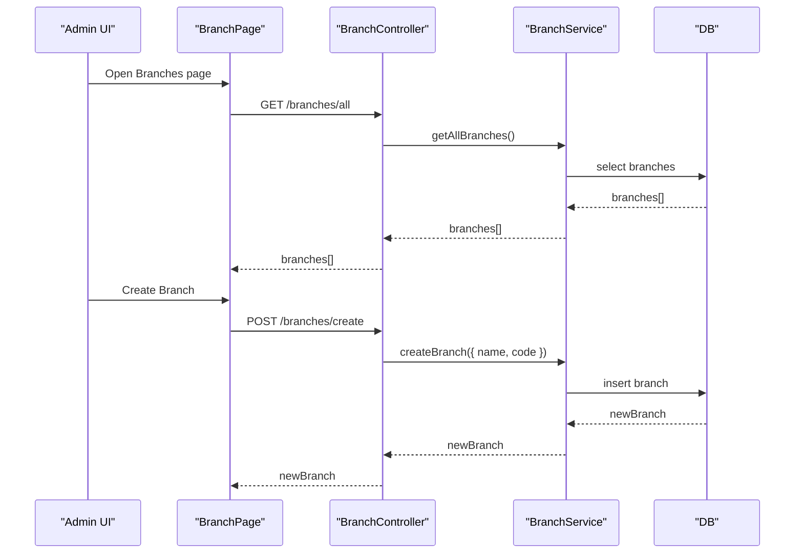
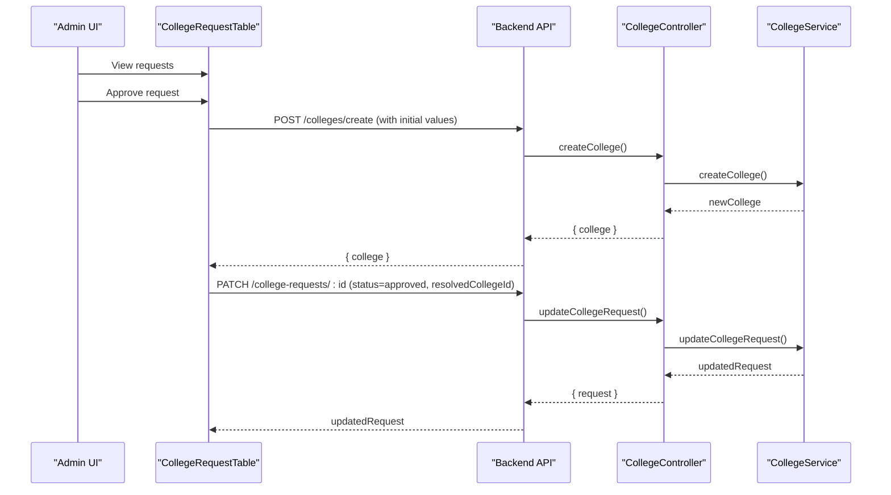
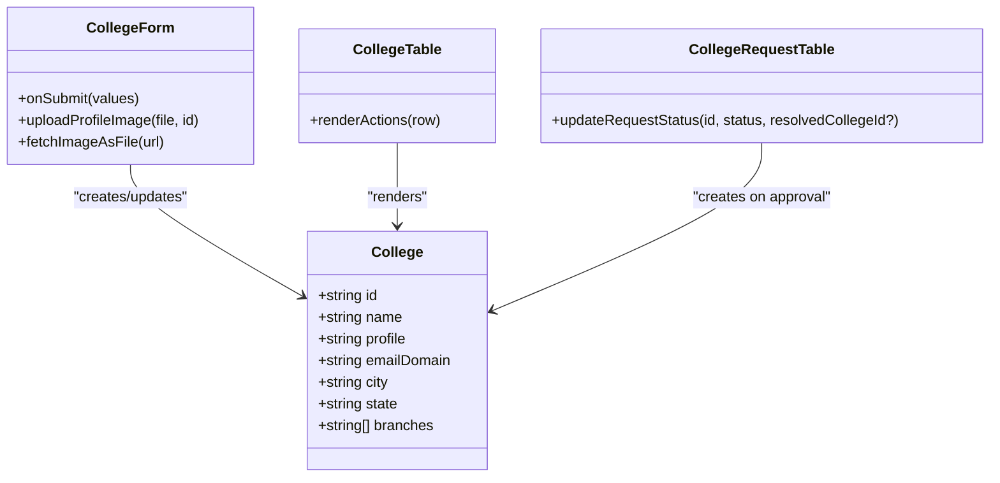
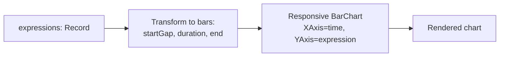
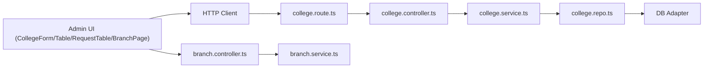

# College Administration

<cite>
**Referenced Files in This Document**
- [CollegePage.tsx](file://admin/src/pages/CollegePage.tsx)
- [CollegeForm.tsx](file://admin/src/components/forms/CollegeForm.tsx)
- [CollegeTable.tsx](file://admin/src/components/general/CollegeTable.tsx)
- [CollegeRequestTable.tsx](file://admin/src/components/general/CollegeRequestTable.tsx)
- [BranchPage.tsx](file://admin/src/pages/BranchPage.tsx)
- [TimelineChart.tsx](file://admin/src/components/charts/TimelineChart.tsx)
- [College.ts](file://admin/src/types/College.ts)
- [college.controller.ts](file://server/src/modules/college/college.controller.ts)
- [college.service.ts](file://server/src/modules/college/college.service.ts)
- [college.schema.ts](file://server/src/modules/college/college.schema.ts)
- [college.repo.ts](file://server/src/modules/college/college.repo.ts)
- [college.route.ts](file://server/src/modules/college/college.route.ts)
- [branch.controller.ts](file://server/src/modules/admin/branch/branch.controller.ts)
- [branch.service.ts](file://server/src/modules/admin/branch/branch.service.ts)
</cite>

## Table of Contents
1. [Introduction](#introduction)
2. [Project Structure](#project-structure)
3. [Core Components](#core-components)
4. [Architecture Overview](#architecture-overview)
5. [Detailed Component Analysis](#detailed-component-analysis)
6. [Dependency Analysis](#dependency-analysis)
7. [Performance Considerations](#performance-considerations)
8. [Troubleshooting Guide](#troubleshooting-guide)
9. [Conclusion](#conclusion)
10. [Appendices](#appendices)

## Introduction
This document describes the college administration system covering the institution management interface, workflows for creating and modifying colleges, branch-level organization controls, and administrative approval processes. It documents the college table with CRUD operations, form validation, and bulk management features, along with integration to the college backend API, caching and data synchronization, and analytics/reporting capabilities.

## Project Structure
The system comprises:
- Admin frontend (Next.js) for managing colleges, branches, and approvals
- Backend API (Express) for college and branch operations
- Shared types and HTTP clients
- Charts for analytics visualization

**Diagram sources**
- [CollegePage.tsx](file://admin/src/pages/CollegePage.tsx#L1-L98)
- [CollegeTable.tsx](file://admin/src/components/general/CollegeTable.tsx#L1-L95)
- [CollegeRequestTable.tsx](file://admin/src/components/general/CollegeRequestTable.tsx#L1-L145)
- [CollegeForm.tsx](file://admin/src/components/forms/CollegeForm.tsx#L1-L432)
- [BranchPage.tsx](file://admin/src/pages/BranchPage.tsx#L1-L142)
- [college.route.ts](file://server/src/modules/college/college.route.ts#L1-L19)
- [college.controller.ts](file://server/src/modules/college/college.controller.ts#L1-L109)
- [college.service.ts](file://server/src/modules/college/college.service.ts#L1-L284)
- [college.repo.ts](file://server/src/modules/college/college.repo.ts#L1-L54)
- [branch.controller.ts](file://server/src/modules/admin/branch/branch.controller.ts#L1-L34)
- [branch.service.ts](file://server/src/modules/admin/branch/branch.service.ts#L1-L31)

**Section sources**
- [CollegePage.tsx](file://admin/src/pages/CollegePage.tsx#L1-L98)
- [college.route.ts](file://server/src/modules/college/college.route.ts#L1-L19)

## Core Components
- College management page with:
  - Listing colleges and requests
  - Creating/updating colleges via a form
  - Approving/rejecting college requests
- Branch management page for creating/deleting branches
- Analytics chart component for timeline visualization
- Shared types for colleges and HTTP integration

**Section sources**
- [CollegePage.tsx](file://admin/src/pages/CollegePage.tsx#L1-L98)
- [CollegeTable.tsx](file://admin/src/components/general/CollegeTable.tsx#L1-L95)
- [CollegeRequestTable.tsx](file://admin/src/components/general/CollegeRequestTable.tsx#L1-L145)
- [CollegeForm.tsx](file://admin/src/components/forms/CollegeForm.tsx#L1-L432)
- [BranchPage.tsx](file://admin/src/pages/BranchPage.tsx#L1-L142)
- [College.ts](file://admin/src/types/College.ts#L1-L10)

## Architecture Overview
The admin frontend communicates with the backend API through typed HTTP requests. The backend enforces schema validation, performs business logic, and interacts with repositories and adapters for persistence and caching. Approval workflows connect client-submitted requests to admin actions.

**Diagram sources**
- [college.route.ts](file://server/src/modules/college/college.route.ts#L1-L19)
- [college.controller.ts](file://server/src/modules/college/college.controller.ts#L1-L109)
- [college.service.ts](file://server/src/modules/college/college.service.ts#L1-L284)
- [college.repo.ts](file://server/src/modules/college/college.repo.ts#L1-L54)

## Detailed Component Analysis

### Institution Management Interface
- CollegePage orchestrates:
  - Parallel loading of colleges and requests
  - Dialog-based creation of colleges
  - Rendering of tables for colleges and requests
- CollegeTable displays metadata and allows inline editing via a modal form
- CollegeRequestTable supports admin approval by creating a college from a request or rejecting it

**Diagram sources**
- [CollegePage.tsx](file://admin/src/pages/CollegePage.tsx#L1-L98)
- [CollegeTable.tsx](file://admin/src/components/general/CollegeTable.tsx#L1-L95)
- [CollegeForm.tsx](file://admin/src/components/forms/CollegeForm.tsx#L1-L432)
- [college.route.ts](file://server/src/modules/college/college.route.ts#L1-L19)

**Section sources**
- [CollegePage.tsx](file://admin/src/pages/CollegePage.tsx#L1-L98)
- [CollegeTable.tsx](file://admin/src/components/general/CollegeTable.tsx#L1-L95)
- [CollegeRequestTable.tsx](file://admin/src/components/general/CollegeRequestTable.tsx#L1-L145)

### College Creation and Modification Workflows
- Validation:
  - Frontend uses Zod-based form validation for required fields, URL format, and branch selection
  - Backend validates inputs and enforces uniqueness of email domain
- Image handling:
  - Supports uploading a file or providing a URL; images are uploaded to Cloudinary via a backend endpoint and stored as URLs
- Update semantics:
  - Updates can change name, email domain, location, profile, and branch assignments
  - Branches are atomically reassigned during updates

**Diagram sources**
- [CollegeForm.tsx](file://admin/src/components/forms/CollegeForm.tsx#L1-L432)
- [college.schema.ts](file://server/src/modules/college/college.schema.ts#L1-L67)
- [college.service.ts](file://server/src/modules/college/college.service.ts#L1-L284)

**Section sources**
- [CollegeForm.tsx](file://admin/src/components/forms/CollegeForm.tsx#L16-L29)
- [college.schema.ts](file://server/src/modules/college/college.schema.ts#L3-L26)
- [college.service.ts](file://server/src/modules/college/college.service.ts#L14-L78)

### Branch-Level Organization Controls
- BranchPage lists all branches and supports creation and deletion
- CollegeForm fetches available branches and lets admins select multiple branches per college
- Backend branch endpoints support listing, creation, update, and deletion

**Diagram sources**
- [BranchPage.tsx](file://admin/src/pages/BranchPage.tsx#L1-L142)
- [branch.controller.ts](file://server/src/modules/admin/branch/branch.controller.ts#L1-L34)
- [branch.service.ts](file://server/src/modules/admin/branch/branch.service.ts#L1-L31)

**Section sources**
- [BranchPage.tsx](file://admin/src/pages/BranchPage.tsx#L1-L142)
- [CollegeForm.tsx](file://admin/src/components/forms/CollegeForm.tsx#L46-L58)
- [branch.controller.ts](file://server/src/modules/admin/branch/branch.controller.ts#L8-L30)
- [branch.service.ts](file://server/src/modules/admin/branch/branch.service.ts#L7-L27)

### Administrative Approval Processes
- Requests are created by users when a college is missing
- Admins can approve a request by creating a college from it or reject it
- On approval, the request is marked with resolution metadata and optionally linked to the newly created college

**Diagram sources**
- [CollegeRequestTable.tsx](file://admin/src/components/general/CollegeRequestTable.tsx#L1-L145)
- [college.controller.ts](file://server/src/modules/college/college.controller.ts#L59-L86)
- [college.service.ts](file://server/src/modules/college/college.service.ts#L120-L181)

**Section sources**
- [CollegeRequestTable.tsx](file://admin/src/components/general/CollegeRequestTable.tsx#L34-L59)
- [college.controller.ts](file://server/src/modules/college/college.controller.ts#L59-L86)
- [college.service.ts](file://server/src/modules/college/college.service.ts#L120-L181)

### College Table: CRUD Operations, Validation, and Bulk Management
- CRUD:
  - Create: via dialog form submission
  - Read: paginated listing with filters
  - Update: inline edit opens form pre-filled with current values
  - Delete: handled by service and audit logging
- Validation:
  - Frontend: Zod schema enforces minimum lengths, URL format, and branch selection
  - Backend: strict schema validation and conflict checks (e.g., email domain uniqueness)
- Bulk management:
  - Multi-select checkboxes in forms (e.g., branch selection)
  - Batch-like operations via individual row actions

**Diagram sources**
- [College.ts](file://admin/src/types/College.ts#L1-L10)
- [CollegeForm.tsx](file://admin/src/components/forms/CollegeForm.tsx#L172-L255)
- [CollegeTable.tsx](file://admin/src/components/general/CollegeTable.tsx#L64-L83)
- [CollegeRequestTable.tsx](file://admin/src/components/general/CollegeRequestTable.tsx#L34-L59)

**Section sources**
- [College.ts](file://admin/src/types/College.ts#L1-L10)
- [CollegeForm.tsx](file://admin/src/components/forms/CollegeForm.tsx#L16-L29)
- [CollegeTable.tsx](file://admin/src/components/general/CollegeTable.tsx#L26-L62)
- [CollegeRequestTable.tsx](file://admin/src/components/general/CollegeRequestTable.tsx#L61-L83)

### Analytics and Reporting Features
- TimelineChart renders a horizontal stacked bar chart representing expression durations over time
- Useful for visualizing temporal distributions of metrics across categories

**Diagram sources**
- [TimelineChart.tsx](file://admin/src/components/charts/TimelineChart.tsx#L10-L44)

**Section sources**
- [TimelineChart.tsx](file://admin/src/components/charts/TimelineChart.tsx#L1-L47)

## Dependency Analysis
- Frontend depends on:
  - HTTP client for API calls
  - Zod-based form validation
  - UI primitives and dialogs
- Backend depends on:
  - Express routers and controllers
  - Zod schemas for validation
  - Service layer encapsulating business logic
  - Repository layer with caching and database adapters
  - Audit logging and cache invalidation

**Diagram sources**
- [college.route.ts](file://server/src/modules/college/college.route.ts#L1-L19)
- [college.controller.ts](file://server/src/modules/college/college.controller.ts#L1-L109)
- [college.service.ts](file://server/src/modules/college/college.service.ts#L1-L284)
- [college.repo.ts](file://server/src/modules/college/college.repo.ts#L1-L54)
- [branch.controller.ts](file://server/src/modules/admin/branch/branch.controller.ts#L1-L34)
- [branch.service.ts](file://server/src/modules/admin/branch/branch.service.ts#L1-L31)

**Section sources**
- [college.route.ts](file://server/src/modules/college/college.route.ts#L1-L19)
- [college.service.ts](file://server/src/modules/college/college.service.ts#L1-L284)
- [college.repo.ts](file://server/src/modules/college/college.repo.ts#L1-L54)
- [branch.controller.ts](file://server/src/modules/admin/branch/branch.controller.ts#L1-L34)
- [branch.service.ts](file://server/src/modules/admin/branch/branch.service.ts#L1-L31)

## Performance Considerations
- Caching:
  - Backend caches queries for colleges and branches; cache keys are invalidated on write operations to maintain consistency
- Concurrency:
  - Parallel fetches for colleges and requests reduce load time
- Image uploads:
  - Deferred profile image upload after college creation reduces initial request latency
- Rate limiting:
  - API endpoints are protected by rate limit middleware

[No sources needed since this section provides general guidance]

## Troubleshooting Guide
- Validation errors:
  - Frontend shows field-specific messages; backend returns structured errors for malformed inputs
- Conflict handling:
  - Duplicate email domains trigger conflicts during create/update; adjust domain or contact support
- Network failures:
  - Toast notifications indicate failures; retry after checking network connectivity
- Cache staleness:
  - After edits, wait briefly for cache invalidation; refresh the page if stale data persists

**Section sources**
- [CollegeForm.tsx](file://admin/src/components/forms/CollegeForm.tsx#L244-L251)
- [college.service.ts](file://server/src/modules/college/college.service.ts#L34-L46)
- [college.schema.ts](file://server/src/modules/college/college.schema.ts#L5-L8)

## Conclusion
The college administration system provides a robust interface for managing institutions, branches, and approval workflows. It integrates frontend validation with backend schema enforcement, supports flexible image handling, and maintains data consistency through caching and audit trails. The analytics chart component enables basic reporting visualization, while the approval pipeline streamlines onboarding of new colleges.

[No sources needed since this section summarizes without analyzing specific files]

## Appendices

### Example Workflows

- Create a college
  - Open the Colleges page, click “Create College”, fill the form, attach an image or provide a URL, submit, and confirm success
  - Reference: [CollegePage.tsx](file://admin/src/pages/CollegePage.tsx#L51-L64), [CollegeForm.tsx](file://admin/src/components/forms/CollegeForm.tsx#L172-L255)

- Approve a college request
  - Navigate to the “College requests” section, choose “Approve”, pre-filled form creates the college, then mark the request as approved
  - Reference: [CollegeRequestTable.tsx](file://admin/src/components/general/CollegeRequestTable.tsx#L87-L114), [college.controller.ts](file://server/src/modules/college/college.controller.ts#L59-L75)

- Assign branches to a college
  - During creation/edit, select one or more branches from the available list
  - Reference: [CollegeForm.tsx](file://admin/src/components/forms/CollegeForm.tsx#L382-L414), [college.service.ts](file://server/src/modules/college/college.service.ts#L226-L233)

- Manage branches
  - Create or delete branches from the Branches page
  - Reference: [BranchPage.tsx](file://admin/src/pages/BranchPage.tsx#L82-L105), [branch.controller.ts](file://server/src/modules/admin/branch/branch.controller.ts#L13-L30)