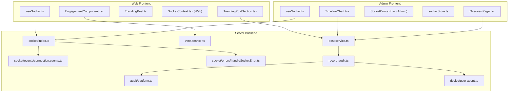
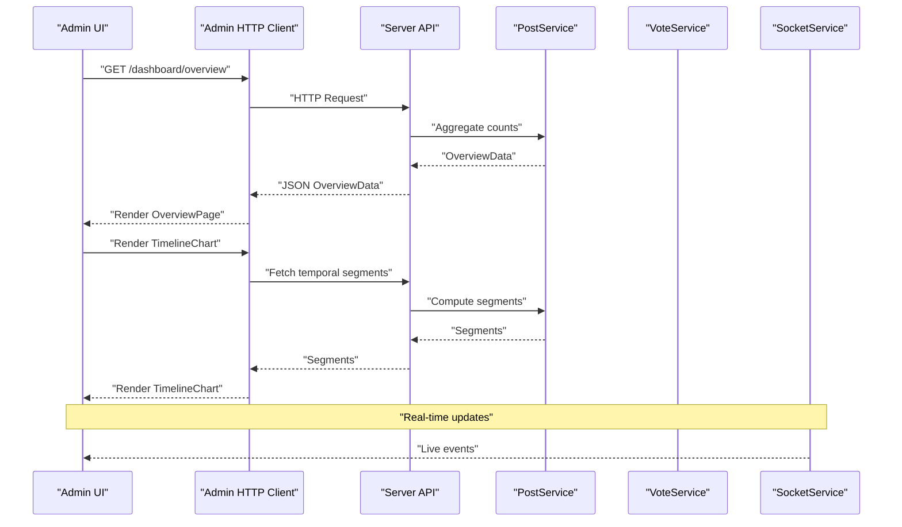
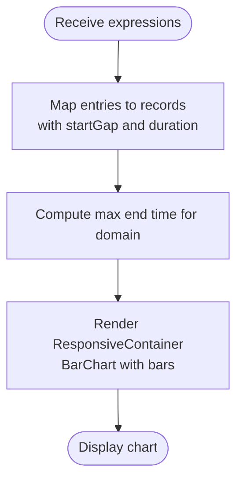
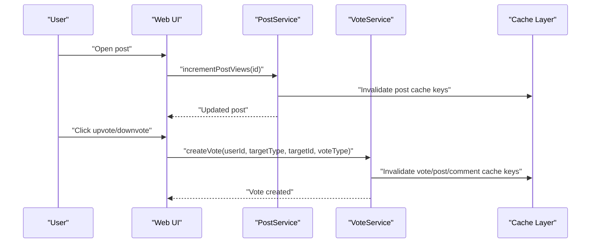
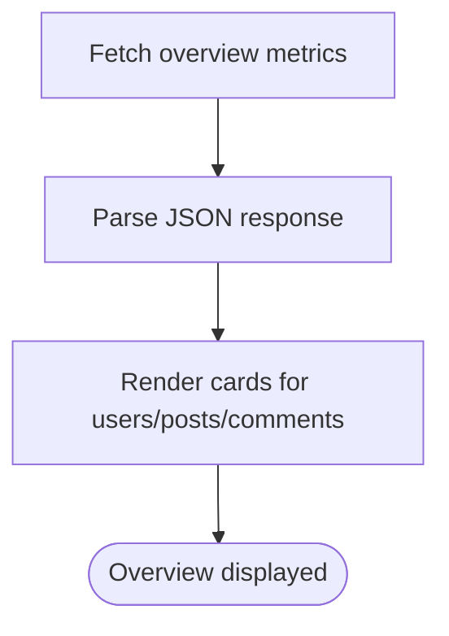
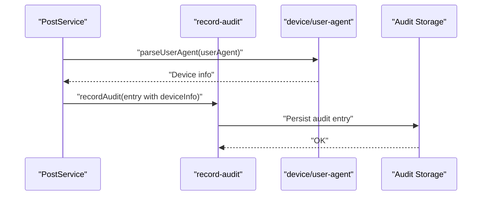
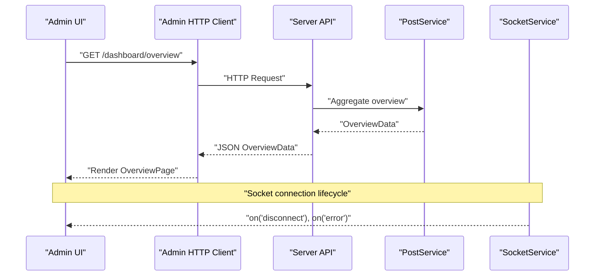
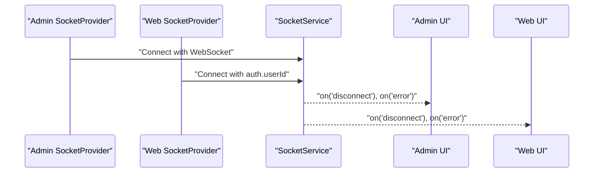
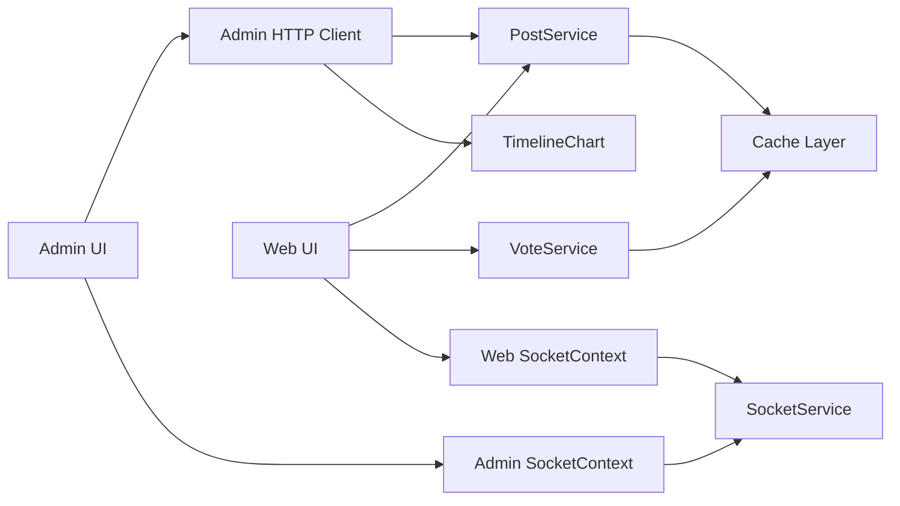

# Content Analytics

<cite>
**Referenced Files in This Document**
- [admin/src/components/charts/TimelineChart.tsx](file://admin/src/components/charts/TimelineChart.tsx)
- [admin/src/pages/OverviewPage.tsx](file://admin/src/pages/OverviewPage.tsx)
- [admin/src/socket/SocketContext.tsx](file://admin/src/socket/SocketContext.tsx)
- [admin/src/store/socketStore.ts](file://admin/src/store/socketStore.ts)
- [admin/src/socket/useSocket.ts](file://admin/src/socket/useSocket.ts)
- [server/src/infra/services/socket/index.ts](file://server/src/infra/services/socket/index.ts)
- [server/src/infra/services/socket/events/connection.events.ts](file://server/src/infra/services/socket/events/connection.events.ts)
- [server/src/infra/services/socket/errors/handleSocketError.ts](file://server/src/infra/services/socket/errors/handleSocketError.ts)
- [server/src/modules/post/post.service.ts](file://server/src/modules/post/post.service.ts)
- [server/src/modules/vote/vote.service.ts](file://server/src/modules/vote/vote.service.ts)
- [web/src/components/general/EngagementComponent.tsx](file://web/src/components/general/EngagementComponent.tsx)
- [web/src/components/general/TrendingPostSection.tsx](file://web/src/components/general/TrendingPostSection.tsx)
- [web/src/types/TrendingPost.ts](file://web/src/types/TrendingPost.ts)
- [web/src/socket/SocketContext.tsx](file://web/src/socket/SocketContext.tsx)
- [web/src/socket/useSocket.ts](file://web/src/socket/useSocket.ts)
- [server/src/shared/constants/audit/platform.ts](file://server/src/shared/constants/audit/platform.ts)
- [server/src/lib/record-audit.ts](file://server/src/lib/record-audit.ts)
- [server/src/lib/device/user-agent.ts](file://server/src/lib/device/user-agent.ts)
</cite>

## Table of Contents
1. [Introduction](#introduction)
2. [Project Structure](#project-structure)
3. [Core Components](#core-components)
4. [Architecture Overview](#architecture-overview)
5. [Detailed Component Analysis](#detailed-component-analysis)
6. [Dependency Analysis](#dependency-analysis)
7. [Performance Considerations](#performance-considerations)
8. [Troubleshooting Guide](#troubleshooting-guide)
9. [Conclusion](#conclusion)
10. [Appendices](#appendices)

## Introduction
This document describes the administrative content analytics system, focusing on:
- Timeline chart visualization for temporal content activity
- Content trend analysis and engagement metrics tracking
- Data aggregation and time-series insights
- Backend analytics integration, real-time updates, and chart rendering
- Examples of content popularity tracking, trending topic analysis, and user engagement patterns
- Data export and custom reporting capabilities

The system combines frontend charting components, backend services, and real-time sockets to deliver actionable insights for administrators.

## Project Structure
The analytics system spans three primary areas:
- Admin dashboard: overview cards, timeline charts, and socket-driven updates
- Web application: engagement UI and trending content display
- Server backend: analytics-aware services, caching, auditing, and socket infrastructure

**Diagram sources**
- [admin/src/pages/OverviewPage.tsx](file://admin/src/pages/OverviewPage.tsx#L1-L80)
- [admin/src/components/charts/TimelineChart.tsx](file://admin/src/components/charts/TimelineChart.tsx#L1-L47)
- [admin/src/socket/SocketContext.tsx](file://admin/src/socket/SocketContext.tsx#L1-L25)
- [admin/src/store/socketStore.ts](file://admin/src/store/socketStore.ts#L1-L13)
- [admin/src/socket/useSocket.ts](file://admin/src/socket/useSocket.ts#L1-L13)
- [web/src/components/general/EngagementComponent.tsx](file://web/src/components/general/EngagementComponent.tsx#L1-L246)
- [web/src/components/general/TrendingPostSection.tsx](file://web/src/components/general/TrendingPostSection.tsx#L1-L113)
- [web/src/types/TrendingPost.ts](file://web/src/types/TrendingPost.ts#L1-L6)
- [web/src/socket/SocketContext.tsx](file://web/src/socket/SocketContext.tsx#L1-L44)
- [web/src/socket/useSocket.ts](file://web/src/socket/useSocket.ts#L1-L8)
- [server/src/modules/post/post.service.ts](file://server/src/modules/post/post.service.ts#L1-L451)
- [server/src/modules/vote/vote.service.ts](file://server/src/modules/vote/vote.service.ts#L1-L315)
- [server/src/infra/services/socket/index.ts](file://server/src/infra/services/socket/index.ts#L1-L47)
- [server/src/infra/services/socket/events/connection.events.ts](file://server/src/infra/services/socket/events/connection.events.ts#L1-L20)
- [server/src/infra/services/socket/errors/handleSocketError.ts](file://server/src/infra/services/socket/errors/handleSocketError.ts#L1-L22)
- [server/src/shared/constants/audit/platform.ts](file://server/src/shared/constants/audit/platform.ts#L1-L9)
- [server/src/lib/record-audit.ts](file://server/src/lib/record-audit.ts#L1-L22)
- [server/src/lib/device/user-agent.ts](file://server/src/lib/device/user-agent.ts#L1-L29)

**Section sources**
- [admin/src/pages/OverviewPage.tsx](file://admin/src/pages/OverviewPage.tsx#L1-L80)
- [admin/src/components/charts/TimelineChart.tsx](file://admin/src/components/charts/TimelineChart.tsx#L1-L47)
- [web/src/components/general/TrendingPostSection.tsx](file://web/src/components/general/TrendingPostSection.tsx#L1-L113)
- [server/src/modules/post/post.service.ts](file://server/src/modules/post/post.service.ts#L1-L451)
- [server/src/modules/vote/vote.service.ts](file://server/src/modules/vote/vote.service.ts#L1-L315)
- [server/src/infra/services/socket/index.ts](file://server/src/infra/services/socket/index.ts#L1-L47)

## Core Components
- TimelineChart: Renders a vertical stacked bar chart for temporal segments (expressions) with responsive sizing and tooltips.
- OverviewPage: Fetches and displays high-level counts (users, posts, comments) via HTTP.
- EngagementComponent: Provides engagement UI elements (upvotes, downvotes, comments, views) with optimistic counters and placeholder analytics messaging.
- TrendingPostSection: Loads and renders trending content cards using a dedicated API endpoint.
- Socket integrations: Real-time connectivity for admin and web clients, with centralized socket service and event/error handling.

**Section sources**
- [admin/src/components/charts/TimelineChart.tsx](file://admin/src/components/charts/TimelineChart.tsx#L1-L47)
- [admin/src/pages/OverviewPage.tsx](file://admin/src/pages/OverviewPage.tsx#L1-L80)
- [web/src/components/general/EngagementComponent.tsx](file://web/src/components/general/EngagementComponent.tsx#L1-L246)
- [web/src/components/general/TrendingPostSection.tsx](file://web/src/components/general/TrendingPostSection.tsx#L1-L113)

## Architecture Overview
The analytics pipeline connects frontend components to backend services and real-time sockets:
- Admin dashboard pulls overview metrics and renders timeline charts.
- Web application surfaces engagement and trending content.
- Server services manage content, votes, caching, and auditing.
- Socket service enables real-time updates and robust error handling.

**Diagram sources**
- [admin/src/pages/OverviewPage.tsx](file://admin/src/pages/OverviewPage.tsx#L1-L80)
- [admin/src/components/charts/TimelineChart.tsx](file://admin/src/components/charts/TimelineChart.tsx#L1-L47)
- [server/src/modules/post/post.service.ts](file://server/src/modules/post/post.service.ts#L1-L451)
- [server/src/infra/services/socket/index.ts](file://server/src/infra/services/socket/index.ts#L1-L47)

## Detailed Component Analysis

### Timeline Chart Visualization
The timeline chart component accepts a normalized expressions object and transforms it into a vertical stacked bar chart:
- Data transformation: Converts expression tuples into records with start offsets and durations.
- Axis configuration: Numeric X-axis domain computed from maximum end time; categorical Y-axis for expression labels.
- Rendering: Transparent offset bar plus colored duration bar per expression segment.

**Diagram sources**
- [admin/src/components/charts/TimelineChart.tsx](file://admin/src/components/charts/TimelineChart.tsx#L10-L44)

**Section sources**
- [admin/src/components/charts/TimelineChart.tsx](file://admin/src/components/charts/TimelineChart.tsx#L1-L47)

### Content Trend Analysis and Engagement Metrics
- Trending content: TrendingPostSection fetches trending posts and renders cards with time, views, category, and title.
- Engagement UI: EngagementComponent exposes buttons for upvotes, downvotes, comments, and views; optimistic counters are maintained locally.
- Backend services:
  - PostService increments view counts and supports sorting by views.
  - VoteService manages upvotes/downvotes, updates author karma, and invalidates caches.

**Diagram sources**
- [web/src/components/general/TrendingPostSection.tsx](file://web/src/components/general/TrendingPostSection.tsx#L18-L44)
- [web/src/types/TrendingPost.ts](file://web/src/types/TrendingPost.ts#L1-L6)
- [web/src/components/general/EngagementComponent.tsx](file://web/src/components/general/EngagementComponent.tsx#L1-L246)
- [server/src/modules/post/post.service.ts](file://server/src/modules/post/post.service.ts#L385-L392)
- [server/src/modules/vote/vote.service.ts](file://server/src/modules/vote/vote.service.ts#L48-L131)

**Section sources**
- [web/src/components/general/TrendingPostSection.tsx](file://web/src/components/general/TrendingPostSection.tsx#L1-L113)
- [web/src/types/TrendingPost.ts](file://web/src/types/TrendingPost.ts#L1-L6)
- [web/src/components/general/EngagementComponent.tsx](file://web/src/components/general/EngagementComponent.tsx#L1-L246)
- [server/src/modules/post/post.service.ts](file://server/src/modules/post/post.service.ts#L385-L392)
- [server/src/modules/vote/vote.service.ts](file://server/src/modules/vote/vote.service.ts#L48-L131)

### Data Aggregation and Time-Series Analysis
- Aggregation: OverviewPage aggregates users, posts, and comments via a single endpoint.
- Temporal segments: TimelineChart consumes pre-aggregated expression intervals for rendering.
- Sorting and filtering: PostService supports sorting by views and filtering by topic/college/branch.

**Diagram sources**
- [admin/src/pages/OverviewPage.tsx](file://admin/src/pages/OverviewPage.tsx#L16-L29)

**Section sources**
- [admin/src/pages/OverviewPage.tsx](file://admin/src/pages/OverviewPage.tsx#L1-L80)
- [admin/src/components/charts/TimelineChart.tsx](file://admin/src/components/charts/TimelineChart.tsx#L1-L47)
- [server/src/modules/post/post.service.ts](file://server/src/modules/post/post.service.ts#L145-L193)

### Content Performance Monitoring
- View increments: PostService increments view counts and invalidates caches.
- Audit trail: record-audit captures device metadata and audit actions for traceability.
- Platform metadata: device/user-agent parsing enriches audit logs with browser, OS, and device type.

**Diagram sources**
- [server/src/modules/post/post.service.ts](file://server/src/modules/post/post.service.ts#L385-L392)
- [server/src/lib/record-audit.ts](file://server/src/lib/record-audit.ts#L1-L22)
- [server/src/lib/device/user-agent.ts](file://server/src/lib/device/user-agent.ts#L1-L29)
- [server/src/shared/constants/audit/platform.ts](file://server/src/shared/constants/audit/platform.ts#L1-L9)

**Section sources**
- [server/src/modules/post/post.service.ts](file://server/src/modules/post/post.service.ts#L385-L392)
- [server/src/lib/record-audit.ts](file://server/src/lib/record-audit.ts#L1-L22)
- [server/src/lib/device/user-agent.ts](file://server/src/lib/device/user-agent.ts#L1-L29)
- [server/src/shared/constants/audit/platform.ts](file://server/src/shared/constants/audit/platform.ts#L1-L9)

### Integration with Analytics Backend Services
- HTTP client usage: Admin OverviewPage uses an HTTP client to fetch dashboard metrics.
- Endpoint exposure: PostService supports listing posts with sorting and pagination, enabling downstream analytics queries.
- Socket integration: Centralized SocketService initializes connections with CORS and transport settings, emitting errors via a standardized channel.

**Diagram sources**
- [admin/src/pages/OverviewPage.tsx](file://admin/src/pages/OverviewPage.tsx#L1-L80)
- [server/src/modules/post/post.service.ts](file://server/src/modules/post/post.service.ts#L145-L193)
- [server/src/infra/services/socket/index.ts](file://server/src/infra/services/socket/index.ts#L10-L32)
- [server/src/infra/services/socket/events/connection.events.ts](file://server/src/infra/services/socket/events/connection.events.ts#L4-L18)
- [server/src/infra/services/socket/errors/handleSocketError.ts](file://server/src/infra/services/socket/errors/handleSocketError.ts#L3-L22)

**Section sources**
- [admin/src/pages/OverviewPage.tsx](file://admin/src/pages/OverviewPage.tsx#L1-L80)
- [server/src/modules/post/post.service.ts](file://server/src/modules/post/post.service.ts#L145-L193)
- [server/src/infra/services/socket/index.ts](file://server/src/infra/services/socket/index.ts#L1-L47)
- [server/src/infra/services/socket/events/connection.events.ts](file://server/src/infra/services/socket/events/connection.events.ts#L1-L20)
- [server/src/infra/services/socket/errors/handleSocketError.ts](file://server/src/infra/services/socket/errors/handleSocketError.ts#L1-L22)

### Real-Time Data Updates and Chart Rendering
- Admin socket provider: Admin uses a socket provider to connect to the server with WebSocket transport.
- Web socket provider: Web client authenticates with user ID and maintains a persistent socket connection.
- Socket lifecycle: Connection events and error handling are centralized for robustness.

**Diagram sources**
- [admin/src/socket/SocketContext.tsx](file://admin/src/socket/SocketContext.tsx#L12-L23)
- [web/src/socket/SocketContext.tsx](file://web/src/socket/SocketContext.tsx#L16-L37)
- [server/src/infra/services/socket/index.ts](file://server/src/infra/services/socket/index.ts#L10-L24)
- [server/src/infra/services/socket/events/connection.events.ts](file://server/src/infra/services/socket/events/connection.events.ts#L4-L18)
- [server/src/infra/services/socket/errors/handleSocketError.ts](file://server/src/infra/services/socket/errors/handleSocketError.ts#L3-L22)

**Section sources**
- [admin/src/socket/SocketContext.tsx](file://admin/src/socket/SocketContext.tsx#L1-L25)
- [admin/src/socket/useSocket.ts](file://admin/src/socket/useSocket.ts#L1-L13)
- [web/src/socket/SocketContext.tsx](file://web/src/socket/SocketContext.tsx#L1-L44)
- [web/src/socket/useSocket.ts](file://web/src/socket/useSocket.ts#L1-L8)
- [server/src/infra/services/socket/index.ts](file://server/src/infra/services/socket/index.ts#L1-L47)
- [server/src/infra/services/socket/events/connection.events.ts](file://server/src/infra/services/socket/events/connection.events.ts#L1-L20)
- [server/src/infra/services/socket/errors/handleSocketError.ts](file://server/src/infra/services/socket/errors/handleSocketError.ts#L1-L22)

### Examples and Use Cases
- Content popularity tracking:
  - Use PostService sorting by views to power leaderboards and dashboards.
  - Render top N posts in a chart or table within the admin UI.
- Trending topic analysis:
  - TrendingPostSection fetches trending posts and displays them with time and view metrics.
  - Combine with topic filters to analyze category-wise trends.
- User engagement patterns:
  - EngagementComponent provides optimistic counters for views, comments, and votes.
  - VoteService tracks karma changes and invalidates caches to reflect real-time engagement.

**Section sources**
- [web/src/components/general/TrendingPostSection.tsx](file://web/src/components/general/TrendingPostSection.tsx#L1-L113)
- [web/src/types/TrendingPost.ts](file://web/src/types/TrendingPost.ts#L1-L6)
- [web/src/components/general/EngagementComponent.tsx](file://web/src/components/general/EngagementComponent.tsx#L1-L246)
- [server/src/modules/post/post.service.ts](file://server/src/modules/post/post.service.ts#L145-L193)
- [server/src/modules/vote/vote.service.ts](file://server/src/modules/vote/vote.service.ts#L48-L131)

### Data Export and Custom Reporting
- Current state: The repository does not expose explicit export endpoints or custom reporting UI components.
- Recommended extension points:
  - Add export handlers in server routes to produce CSV/JSON reports for posts, votes, and audit logs.
  - Integrate with the existing socket service to stream large exports to admins.
  - Extend PostService and VoteService with filtered, paginated export APIs.

[No sources needed since this section proposes future enhancements]

## Dependency Analysis
The analytics system exhibits layered dependencies:
- Admin depends on HTTP client and socket contexts to render overview metrics and timeline charts.
- Web depends on engagement and trending components backed by PostService and VoteService.
- Server services depend on caching, auditing, and socket infrastructure.

**Diagram sources**
- [admin/src/pages/OverviewPage.tsx](file://admin/src/pages/OverviewPage.tsx#L1-L80)
- [admin/src/components/charts/TimelineChart.tsx](file://admin/src/components/charts/TimelineChart.tsx#L1-L47)
- [admin/src/socket/SocketContext.tsx](file://admin/src/socket/SocketContext.tsx#L1-L25)
- [web/src/components/general/EngagementComponent.tsx](file://web/src/components/general/EngagementComponent.tsx#L1-L246)
- [web/src/components/general/TrendingPostSection.tsx](file://web/src/components/general/TrendingPostSection.tsx#L1-L113)
- [web/src/socket/SocketContext.tsx](file://web/src/socket/SocketContext.tsx#L1-L44)
- [server/src/modules/post/post.service.ts](file://server/src/modules/post/post.service.ts#L1-L451)
- [server/src/modules/vote/vote.service.ts](file://server/src/modules/vote/vote.service.ts#L1-L315)
- [server/src/infra/services/socket/index.ts](file://server/src/infra/services/socket/index.ts#L1-L47)

**Section sources**
- [admin/src/pages/OverviewPage.tsx](file://admin/src/pages/OverviewPage.tsx#L1-L80)
- [admin/src/components/charts/TimelineChart.tsx](file://admin/src/components/charts/TimelineChart.tsx#L1-L47)
- [web/src/components/general/EngagementComponent.tsx](file://web/src/components/general/EngagementComponent.tsx#L1-L246)
- [web/src/components/general/TrendingPostSection.tsx](file://web/src/components/general/TrendingPostSection.tsx#L1-L113)
- [server/src/modules/post/post.service.ts](file://server/src/modules/post/post.service.ts#L1-L451)
- [server/src/modules/vote/vote.service.ts](file://server/src/modules/vote/vote.service.ts#L1-L315)
- [server/src/infra/services/socket/index.ts](file://server/src/infra/services/socket/index.ts#L1-L47)

## Performance Considerations
- Caching: PostService and VoteService invalidate cache keys after writes to ensure freshness while minimizing repeated computation.
- Sorting and pagination: PostService supports efficient retrieval with configurable sort order and limits.
- Real-time transport: WebSocket transport is configured for low-latency updates; ensure proper error handling and reconnection strategies.

[No sources needed since this section provides general guidance]

## Troubleshooting Guide
- Socket errors: Centralized error handler emits standardized error messages; inspect logs for error codes and messages.
- Connection lifecycle: Verify connection events and disconnection logs to diagnose session issues.
- Engagement placeholders: Views analytics is marked as under development; expect placeholder notifications until implemented.

**Section sources**
- [server/src/infra/services/socket/errors/handleSocketError.ts](file://server/src/infra/services/socket/errors/handleSocketError.ts#L1-L22)
- [server/src/infra/services/socket/events/connection.events.ts](file://server/src/infra/services/socket/events/connection.events.ts#L1-L20)
- [web/src/components/general/EngagementComponent.tsx](file://web/src/components/general/EngagementComponent.tsx#L225-L239)

## Conclusion
The administrative content analytics system integrates frontend charting, engagement UI, and backend services with real-time sockets. It currently supports overview metrics, timeline visualization, trending content, and engagement counters. Extending the system with export endpoints, custom reporting, and deeper analytics would further enhance administrative insights.

## Appendices
- Audit platforms: Enumerated platform types for audit logging.
- Device parsing: Utility to extract browser, OS, and device type from user agent strings.

**Section sources**
- [server/src/shared/constants/audit/platform.ts](file://server/src/shared/constants/audit/platform.ts#L1-L9)
- [server/src/lib/device/user-agent.ts](file://server/src/lib/device/user-agent.ts#L1-L29)