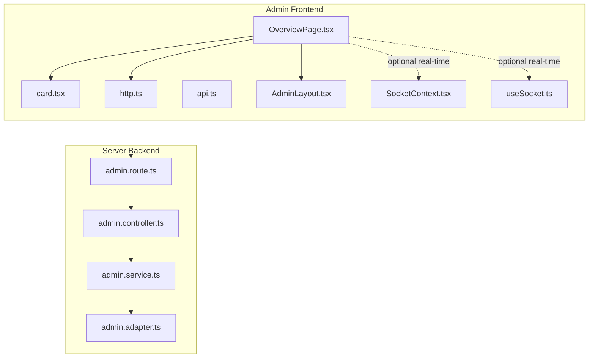
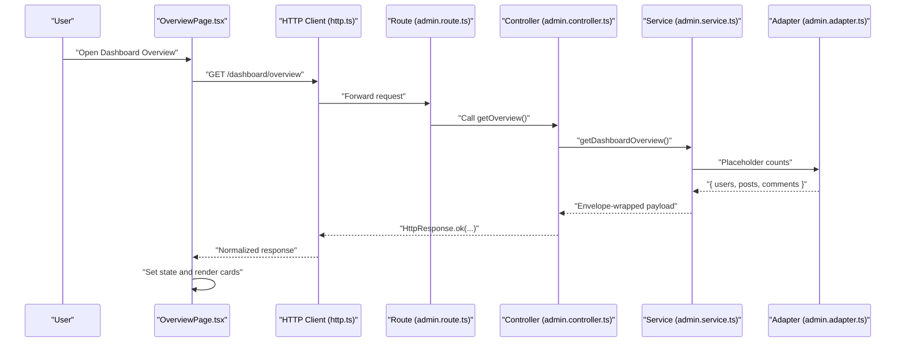
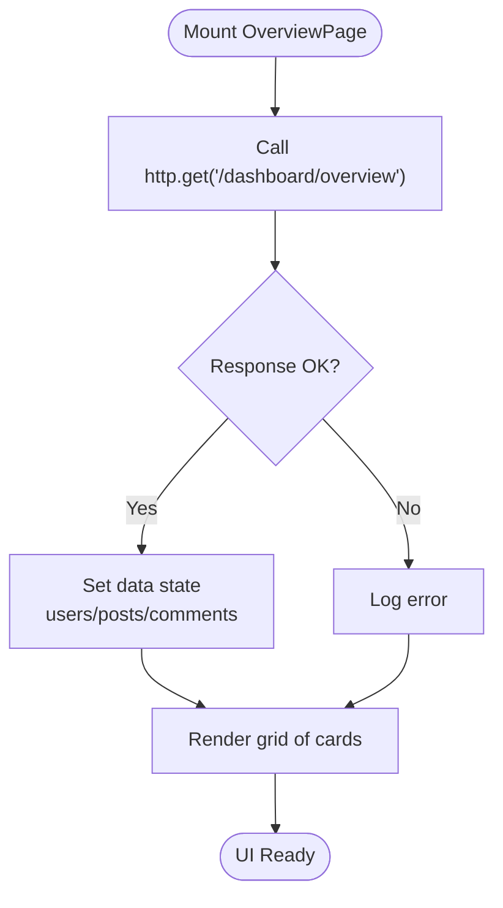
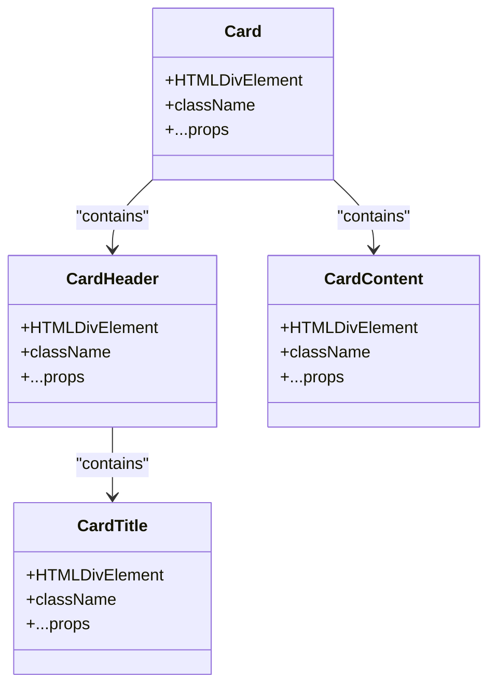
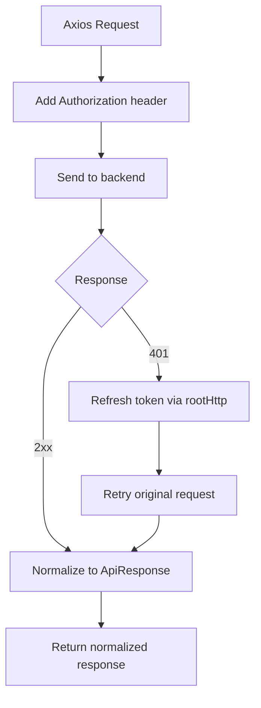
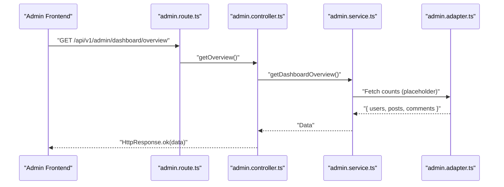
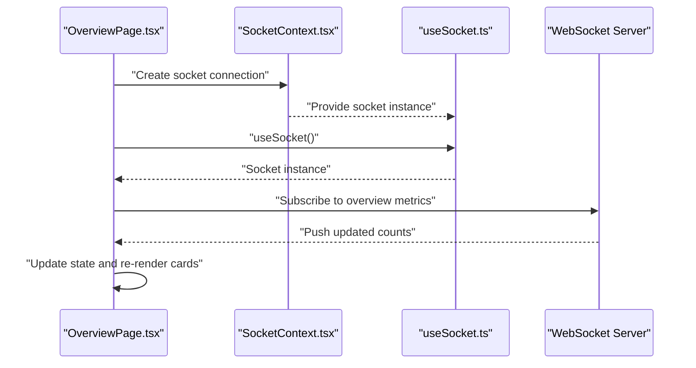
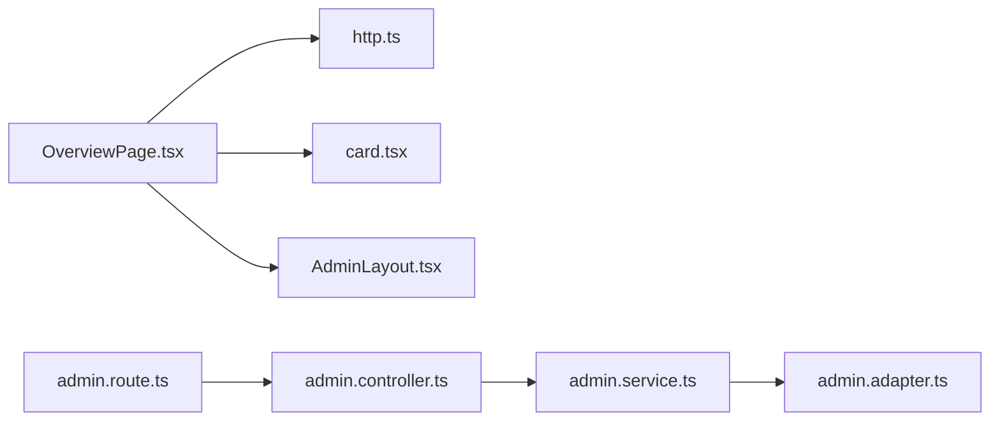

# Dashboard Overview

<cite>
**Referenced Files in This Document**
- [OverviewPage.tsx](file://admin/src/pages/OverviewPage.tsx)
- [card.tsx](file://admin/src/components/ui/card.tsx)
- [http.ts](file://admin/src/services/http.ts)
- [api.ts](file://admin/src/types/api.ts)
- [admin.route.ts](file://server/src/modules/admin/admin.route.ts)
- [admin.controller.ts](file://server/src/modules/admin/admin.controller.ts)
- [admin.service.ts](file://server/src/modules/admin/admin.service.ts)
- [admin.adapter.ts](file://server/src/infra/db/adapters/admin.adapter.ts)
- [AdminLayout.tsx](file://admin/src/layouts/AdminLayout.tsx)
- [SocketContext.tsx](file://admin/src/socket/SocketContext.tsx)
- [useSocket.ts](file://admin/src/socket/useSocket.ts)
</cite>

## Table of Contents
1. [Introduction](#introduction)
2. [Project Structure](#project-structure)
3. [Core Components](#core-components)
4. [Architecture Overview](#architecture-overview)
5. [Detailed Component Analysis](#detailed-component-analysis)
6. [Dependency Analysis](#dependency-analysis)
7. [Performance Considerations](#performance-considerations)
8. [Troubleshooting Guide](#troubleshooting-guide)
9. [Conclusion](#conclusion)

## Introduction
This document explains the administrative dashboard overview page, focusing on the analytics dashboard components that display user statistics, post metrics, and comment analytics. It details the data fetching mechanism against the backend endpoint, the current lack of real-time updates, and the card-based layout system used to present key performance indicators. It also documents the integration with the backend’s /dashboard/overview endpoint and the data structures returned.

## Project Structure
The dashboard overview page is implemented in the admin frontend under the pages directory and integrates with reusable UI components and HTTP services. The backend exposes the /dashboard/overview endpoint via an admin route, controller, service, and adapter layers.

**Diagram sources**
- [OverviewPage.tsx](file://admin/src/pages/OverviewPage.tsx#L1-L80)
- [card.tsx](file://admin/src/components/ui/card.tsx#L1-L77)
- [http.ts](file://admin/src/services/http.ts#L1-L154)
- [api.ts](file://admin/src/types/api.ts#L1-L20)
- [admin.route.ts](file://server/src/modules/admin/admin.route.ts#L1-L40)
- [admin.controller.ts](file://server/src/modules/admin/admin.controller.ts#L1-L125)
- [admin.service.ts](file://server/src/modules/admin/admin.service.ts#L1-L207)
- [admin.adapter.ts](file://server/src/infra/db/adapters/admin.adapter.ts#L1-L398)
- [AdminLayout.tsx](file://admin/src/layouts/AdminLayout.tsx#L1-L132)
- [SocketContext.tsx](file://admin/src/socket/SocketContext.tsx#L1-L26)
- [useSocket.ts](file://admin/src/socket/useSocket.ts#L1-L13)

**Section sources**
- [OverviewPage.tsx](file://admin/src/pages/OverviewPage.tsx#L1-L80)
- [admin.route.ts](file://server/src/modules/admin/admin.route.ts#L1-L40)

## Core Components
- OverviewPage: Fetches and renders the dashboard overview metrics using a grid of cards.
- Card UI: Reusable card component used to render each metric.
- HTTP client: Centralized HTTP client with interceptors and envelope normalization.
- Types: Shared API response envelope types used across the app.
- Admin route/controller/service/adapter: Backend pipeline for the /dashboard/overview endpoint.

Key responsibilities:
- OverviewPage fetches data from /dashboard/overview and displays three KPI cards: total users, total posts, and total comments.
- The HTTP client ensures consistent request headers and normalized responses.
- The backend currently returns placeholder values; future enhancements can integrate database queries in the adapter.

**Section sources**
- [OverviewPage.tsx](file://admin/src/pages/OverviewPage.tsx#L6-L30)
- [card.tsx](file://admin/src/components/ui/card.tsx#L1-L77)
- [http.ts](file://admin/src/services/http.ts#L1-L154)
- [api.ts](file://admin/src/types/api.ts#L1-L20)
- [admin.controller.ts](file://server/src/modules/admin/admin.controller.ts#L9-L12)
- [admin.service.ts](file://server/src/modules/admin/admin.service.ts#L8-L17)
- [admin.adapter.ts](file://server/src/infra/db/adapters/admin.adapter.ts#L1-L398)

## Architecture Overview
The overview page follows a straightforward request-response pattern:
- Frontend: OverviewPage triggers a GET request to /dashboard/overview via the HTTP client.
- Backend: Route maps the path to AdminController.getOverview, which delegates to AdminService.getDashboardOverview and returns a structured response envelope.
- Adapter: AdminAdapter currently returns placeholder counts; database queries can be integrated here.

**Diagram sources**
- [OverviewPage.tsx](file://admin/src/pages/OverviewPage.tsx#L16-L29)
- [http.ts](file://admin/src/services/http.ts#L34-L57)
- [admin.route.ts](file://server/src/modules/admin/admin.route.ts#L17-L17)
- [admin.controller.ts](file://server/src/modules/admin/admin.controller.ts#L9-L12)
- [admin.service.ts](file://server/src/modules/admin/admin.service.ts#L8-L17)
- [admin.adapter.ts](file://server/src/infra/db/adapters/admin.adapter.ts#L1-L398)

## Detailed Component Analysis

### OverviewPage: Data Fetching and Rendering
- Fetching: On mount, OverviewPage calls http.get("/dashboard/overview"), sets loading, and on success stores the payload in state. It falls back to zeros if the payload is missing.
- Rendering: Displays a responsive grid of three cards for users, posts, and comments. Each card uses CardHeader/CardTitle for labels/icons and CardContent for the numeric value.
- Layout: Uses Tailwind classes to achieve a responsive grid (single column on small screens, three columns on large screens).

**Diagram sources**
- [OverviewPage.tsx](file://admin/src/pages/OverviewPage.tsx#L16-L76)

**Section sources**
- [OverviewPage.tsx](file://admin/src/pages/OverviewPage.tsx#L1-L80)

### Card-Based Layout System
- Card component: Provides Card, CardHeader, CardTitle, CardContent, CardFooter abstractions with consistent styling and spacing.
- Usage: Each metric is rendered inside a card with a descriptive title and a matching icon.

**Diagram sources**
- [card.tsx](file://admin/src/components/ui/card.tsx#L1-L77)

**Section sources**
- [card.tsx](file://admin/src/components/ui/card.tsx#L1-L77)

### HTTP Client and Envelope Normalization
- Base URLs: Two clients are configured—adminApiBase and rootApiBase—to support admin-specific and root-level endpoints.
- Interceptors:
  - Authorization header injection using a token getter.
  - Response envelope normalization to a consistent shape across the app.
- Authentication refresh: Handles 401 responses by refreshing tokens and retrying failed requests.

**Diagram sources**
- [http.ts](file://admin/src/services/http.ts#L21-L95)
- [http.ts](file://admin/src/services/http.ts#L97-L150)
- [api.ts](file://admin/src/types/api.ts#L3-L19)

**Section sources**
- [http.ts](file://admin/src/services/http.ts#L1-L154)
- [api.ts](file://admin/src/types/api.ts#L1-L20)

### Backend Endpoint: /dashboard/overview
- Route: Defined under /api/v1/admin and mapped to AdminController.getOverview.
- Controller: Calls service method and wraps the result in HttpResponse.ok with a success message.
- Service: Returns a simple object with users, posts, and comments counts.
- Adapter: Placeholder counts; can be extended to query database tables for accurate metrics.

**Diagram sources**
- [admin.route.ts](file://server/src/modules/admin/admin.route.ts#L17-L17)
- [admin.controller.ts](file://server/src/modules/admin/admin.controller.ts#L9-L12)
- [admin.service.ts](file://server/src/modules/admin/admin.service.ts#L8-L17)
- [admin.adapter.ts](file://server/src/infra/db/adapters/admin.adapter.ts#L1-L398)

**Section sources**
- [admin.route.ts](file://server/src/modules/admin/admin.route.ts#L17-L17)
- [admin.controller.ts](file://server/src/modules/admin/admin.controller.ts#L9-L12)
- [admin.service.ts](file://server/src/modules/admin/admin.service.ts#L8-L17)

### Real-Time Updates: Current Status and Extension Points
- Current state: The overview page performs a single fetch on mount and does not subscribe to real-time updates.
- Socket infrastructure exists in the admin app (SocketContext and useSocket), but are not wired to the overview page.
- Extension points:
  - Integrate a WebSocket connection via SocketContext/useSocket in OverviewPage.
  - Listen for events that signal metric changes and update state accordingly.
  - Ensure cleanup of listeners on unmount.

**Diagram sources**
- [SocketContext.tsx](file://admin/src/socket/SocketContext.tsx#L12-L23)
- [useSocket.ts](file://admin/src/socket/useSocket.ts#L4-L9)

**Section sources**
- [SocketContext.tsx](file://admin/src/socket/SocketContext.tsx#L1-L26)
- [useSocket.ts](file://admin/src/socket/useSocket.ts#L1-L13)
- [OverviewPage.tsx](file://admin/src/pages/OverviewPage.tsx#L16-L29)

## Dependency Analysis
- Frontend dependencies:
  - OverviewPage depends on http.ts for data fetching and card.tsx for rendering.
  - AdminLayout provides routing context and navigation for the admin area.
- Backend dependencies:
  - Route depends on AdminController.
  - Controller depends on Service.
  - Service depends on Adapter for data retrieval.

**Diagram sources**
- [OverviewPage.tsx](file://admin/src/pages/OverviewPage.tsx#L1-L80)
- [card.tsx](file://admin/src/components/ui/card.tsx#L1-L77)
- [http.ts](file://admin/src/services/http.ts#L1-L154)
- [AdminLayout.tsx](file://admin/src/layouts/AdminLayout.tsx#L1-L132)
- [admin.route.ts](file://server/src/modules/admin/admin.route.ts#L1-L40)
- [admin.controller.ts](file://server/src/modules/admin/admin.controller.ts#L1-L125)
- [admin.service.ts](file://server/src/modules/admin/admin.service.ts#L1-L207)
- [admin.adapter.ts](file://server/src/infra/db/adapters/admin.adapter.ts#L1-L398)

**Section sources**
- [OverviewPage.tsx](file://admin/src/pages/OverviewPage.tsx#L1-L80)
- [admin.route.ts](file://server/src/modules/admin/admin.route.ts#L1-L40)

## Performance Considerations
- Single fetch on mount: The overview page currently performs one request on load. This is efficient for a summary dashboard.
- No caching: There is no client-side caching of overview metrics. Consider adding a simple cache with a TTL if the page is frequently revisited.
- Real-time updates: If metrics change frequently, consider integrating WebSocket updates to avoid polling and reduce unnecessary network overhead.
- Rendering: The card-based grid is lightweight; ensure that additional real-time subscriptions do not cause excessive re-renders.

[No sources needed since this section provides general guidance]

## Troubleshooting Guide
- Endpoint not found:
  - Verify the route registration for /api/v1/admin/dashboard/overview.
  - Confirm the base URL and middleware stack for admin routes.
- Unauthorized or forbidden:
  - Ensure the user has admin role and is authenticated.
  - Check authentication middleware and RBAC enforcement.
- Empty or zero metrics:
  - The backend currently returns placeholder values. Extend admin.adapter.ts to query actual counts from the database.
- Network errors:
  - Inspect the HTTP client interceptors and error handling for 401 refresh logic.
  - Confirm the backend response envelope matches the expected shape.

**Section sources**
- [admin.route.ts](file://server/src/modules/admin/admin.route.ts#L17-L17)
- [admin.controller.ts](file://server/src/modules/admin/admin.controller.ts#L9-L12)
- [admin.service.ts](file://server/src/modules/admin/admin.service.ts#L8-L17)
- [http.ts](file://admin/src/services/http.ts#L97-L150)

## Conclusion
The dashboard overview page provides a clean, responsive presentation of key metrics using a card-based layout. Data is fetched from the backend’s /dashboard/overview endpoint, with a normalized response envelope ensuring consistent handling. While the current backend implementation returns placeholder values, the architecture supports straightforward extension to integrate live metrics and real-time updates via WebSockets.