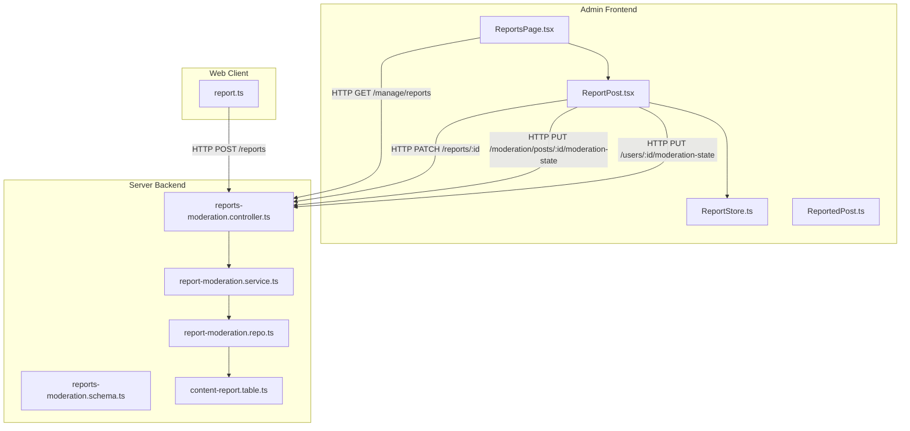
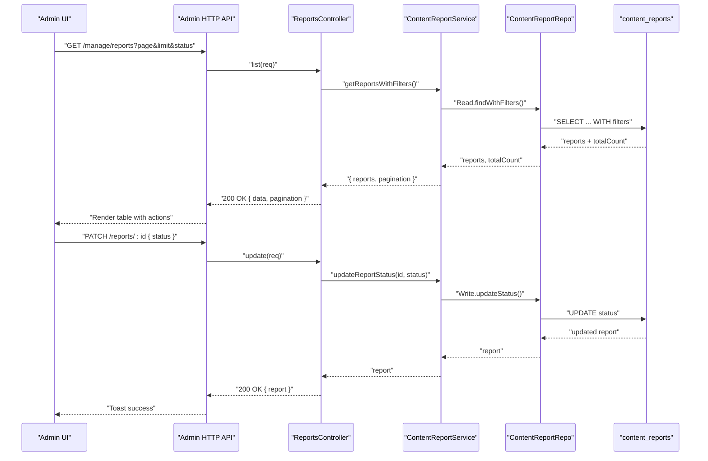
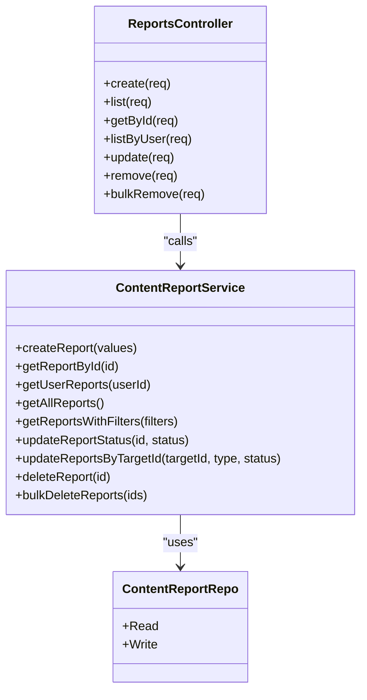
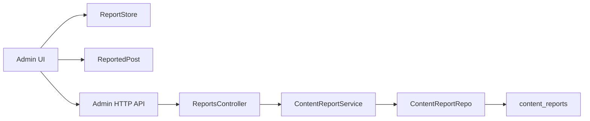

# Reports Management

<cite>
**Referenced Files in This Document**
- [ReportsPage.tsx](file://admin/src/pages/ReportsPage.tsx)
- [ReportPost.tsx](file://admin/src/components/general/ReportPost.tsx)
- [ReportStore.ts](file://admin/src/store/ReportStore.ts)
- [ReportedPost.ts](file://admin/src/types/ReportedPost.ts)
- [moderation.ts](file://admin/src/services/api/moderation.ts)
- [report.ts](file://web/src/services/api/report.ts)
- [reports-moderation.controller.ts](file://server/src/modules/moderation/reports/reports-moderation.controller.ts)
- [reports-moderation.schema.ts](file://server/src/modules/moderation/reports/reports-moderation.schema.ts)
- [report-moderation.service.ts](file://server/src/modules/moderation/reports/report-moderation.service.ts)
- [report-moderation.repo.ts](file://server/src/modules/moderation/reports/report-moderation.repo.ts)
- [content-report.table.ts](file://server/src/infra/db/tables/content-report.table.ts)
</cite>

## Table of Contents
1. [Introduction](#introduction)
2. [Project Structure](#project-structure)
3. [Core Components](#core-components)
4. [Architecture Overview](#architecture-overview)
5. [Detailed Component Analysis](#detailed-component-analysis)
6. [Dependency Analysis](#dependency-analysis)
7. [Performance Considerations](#performance-considerations)
8. [Troubleshooting Guide](#troubleshooting-guide)
9. [Conclusion](#conclusion)

## Introduction
This document describes the administrative reports management system responsible for content reporting workflows, flagged content review, moderation queue management, and administrative decision-making. It covers the report post component, bulk report handling, report resolution workflows, integration with the reporting backend API, report status management, and automated moderation triggers. It also documents report filtering, sorting, and search capabilities, along with examples of report categorization, user appeals processes, and administrative interfaces.

## Project Structure
The reports management system spans three layers:
- Frontend Admin UI: displays reports, supports filtering, pagination, and administrative actions.
- Web API client: exposes report creation for end users.
- Backend moderation service: persists reports, enforces validations, and manages moderation states.

**Diagram sources**
- [ReportsPage.tsx](file://admin/src/pages/ReportsPage.tsx#L1-L122)
- [ReportPost.tsx](file://admin/src/components/general/ReportPost.tsx#L1-L503)
- [ReportStore.ts](file://admin/src/store/ReportStore.ts#L1-L43)
- [ReportedPost.ts](file://admin/src/types/ReportedPost.ts#L1-L28)
- [report.ts](file://web/src/services/api/report.ts#L1-L13)
- [reports-moderation.controller.ts](file://server/src/modules/moderation/reports/reports-moderation.controller.ts#L1-L86)
- [report-moderation.service.ts](file://server/src/modules/moderation/reports/report-moderation.service.ts#L1-L177)
- [report-moderation.repo.ts](file://server/src/modules/moderation/reports/report-moderation.repo.ts#L1-L22)
- [reports-moderation.schema.ts](file://server/src/modules/moderation/reports/reports-moderation.schema.ts#L1-L44)
- [content-report.table.ts](file://server/src/infra/db/tables/content-report.table.ts#L1-L26)

**Section sources**
- [ReportsPage.tsx](file://admin/src/pages/ReportsPage.tsx#L1-L122)
- [ReportPost.tsx](file://admin/src/components/general/ReportPost.tsx#L1-L503)
- [ReportStore.ts](file://admin/src/store/ReportStore.ts#L1-L43)
- [ReportedPost.ts](file://admin/src/types/ReportedPost.ts#L1-L28)
- [report.ts](file://web/src/services/api/report.ts#L1-L13)
- [reports-moderation.controller.ts](file://server/src/modules/moderation/reports/reports-moderation.controller.ts#L1-L86)
- [report-moderation.service.ts](file://server/src/modules/moderation/reports/report-moderation.service.ts#L1-L177)
- [report-moderation.repo.ts](file://server/src/modules/moderation/reports/report-moderation.repo.ts#L1-L22)
- [reports-moderation.schema.ts](file://server/src/modules/moderation/reports/reports-moderation.schema.ts#L1-L44)
- [content-report.table.ts](file://server/src/infra/db/tables/content-report.table.ts#L1-L26)

## Core Components
- Admin Reports Page: fetches paginated reports filtered by status, renders actionable cards, and refreshes the queue.
- Report Post Component: presents a table of reports grouped by target, exposes administrative actions, and updates local state.
- Report Store: maintains normalized report data and allows in-place updates for status and individual report records.
- Backend Reports Controller: validates and orchestrates report creation, listing, retrieval, updates, and bulk deletion.
- Moderation Service: enforces status values, applies filters, and records audit events for administrative actions.
- Database Schema: defines the persisted report entity with type, status, and foreign keys to posts/comments/users.

Key responsibilities:
- Filtering and pagination: Admin UI sends page, limit, and status filters; backend enforces Zod validation and returns pagination metadata.
- Status management: Supports pending, resolved, ignored; updates propagate to both report records and moderation states.
- Administrative actions: Ban/unban posts, shadow ban/unban posts, ban/unban/suspend users/reporters, ignore/mark pending, undo actions.

**Section sources**
- [ReportsPage.tsx](file://admin/src/pages/ReportsPage.tsx#L14-L122)
- [ReportPost.tsx](file://admin/src/components/general/ReportPost.tsx#L39-L207)
- [ReportStore.ts](file://admin/src/store/ReportStore.ts#L11-L40)
- [reports-moderation.controller.ts](file://server/src/modules/moderation/reports/reports-moderation.controller.ts#L25-L43)
- [report-moderation.service.ts](file://server/src/modules/moderation/reports/report-moderation.service.ts#L82-L104)
- [content-report.table.ts](file://server/src/infra/db/tables/content-report.table.ts#L7-L22)

## Architecture Overview
The system integrates the Admin UI with the backend via typed APIs and Zod schemas. The Admin UI groups reports by target and renders per-report actions. The backend validates inputs, queries the database, and records audit trails.

**Diagram sources**
- [ReportsPage.tsx](file://admin/src/pages/ReportsPage.tsx#L24-L61)
- [ReportPost.tsx](file://admin/src/components/general/ReportPost.tsx#L85-L90)
- [reports-moderation.controller.ts](file://server/src/modules/moderation/reports/reports-moderation.controller.ts#L25-L43)
- [report-moderation.service.ts](file://server/src/modules/moderation/reports/report-moderation.service.ts#L106-L123)
- [report-moderation.repo.ts](file://server/src/modules/moderation/reports/report-moderation.repo.ts#L3-L18)
- [content-report.table.ts](file://server/src/infra/db/tables/content-report.table.ts#L7-L22)

## Detailed Component Analysis

### Admin Reports Page
- Fetches paginated reports with status filter and refresh capability.
- Renders buttons for Pending, Resolved, and Ignored filters.
- Uses a dedicated store to manage report state and updates after actions.

Operational flow:
- On filter change or page change, constructs query params and requests backend.
- Updates total pages based on returned pagination metadata.
- Displays loading state and empty state per selected filter.

**Section sources**
- [ReportsPage.tsx](file://admin/src/pages/ReportsPage.tsx#L14-L122)

### Report Post Component
- Groups reports by target (Post or Comment) and renders a table with columns for Post, Reporter, Reason, Message, and Status.
- Provides a dropdown menu of actions per report:
  - Content moderation: Ban/Unban Post, Shadow Ban/Unban Post (comments cannot be shadow banned).
  - User moderation: Ban/Unban User, Suspend/Remove User Suspension.
  - Reporter moderation: Ban/Unban Reporter, Suspend/Remove Reporter Suspension.
  - Queue management: Mark Pending, Ignore Report, Undo All Actions.
- Handles suspension dialogs with days and reason validation.
- Updates local state and refreshes the queue after successful actions.

```mermaid
flowchart TD
Start(["Action Triggered"]) --> Choose{"Action Type?"}
Choose --> |Ban Post| UpdatePost["PUT /moderation/posts/:id/moderation-state {state: banned}"]
Choose --> |Unban Post| UpdatePost2["PUT /moderation/posts/:id/moderation-state {state: active}"]
Choose --> |Shadow Ban Post| UpdatePost3["PUT /moderation/posts/:id/moderation-state {state: shadow_banned}"]
Choose --> |Shadow Unban Post| UpdatePost4["PUT /moderation/posts/:id/moderation-state {state: active}"]
Choose --> |Ban User| UpdateUser["PUT /users/:id/moderation-state {blocked: true}"]
Choose --> |Unban User| UpdateUser2["PUT /users/:id/moderation-state {blocked: false}"]
Choose --> |Suspend User| SuspendUser["PUT /users/:id/moderation-state {blocked: true, suspension}"]
Choose --> |Remove User Suspension| UpdateUser3["PUT /users/:id/moderation-state {blocked: false}"]
Choose --> |Ban Reporter| UpdateReporter["PUT /users/:id/moderation-state {blocked: true}"]
Choose --> |Unban Reporter| UpdateReporter2["PUT /users/:id/moderation-state {blocked: false}"]
Choose --> |Suspend Reporter| SuspendReporter["PUT /users/:id/moderation-state {blocked: true, suspension}"]
Choose --> |Remove Reporter Suspension| UpdateReporter3["PUT /users/:id/moderation-state {blocked: false}"]
Choose --> |Ignore Report| PatchReport["PATCH /reports/:id {status: ignored}"]
Choose --> |Mark Pending| PatchReport2["PATCH /reports/:id {status: pending}"]
Choose --> |Undo All Actions| UndoOps["Undo content/user/reporter states + status"]
UpdatePost --> PatchReport3["PATCH /reports/:id {status: resolved}"]
UpdatePost2 --> PatchReport4["PATCH /reports/:id {status: pending}"]
UpdatePost3 --> PatchReport5["PATCH /reports/:id {status: resolved}"]
UpdatePost4 --> PatchReport6["PATCH /reports/:id {status: pending}"]
SuspendUser --> PatchReport7["PATCH /reports/:id {status: resolved}"]
SuspendReporter --> PatchReport8["PATCH /reports/:id {status: resolved}"]
UpdateUser --> PatchReport9["PATCH /reports/:id {status: resolved}"]
UpdateReporter --> PatchReport10["PATCH /reports/:id {status: resolved}"]
UpdateUser2 --> PatchReport11["PATCH /reports/:id {status: pending}"]
UpdateReporter2 --> PatchReport12["PATCH /reports/:id {status: pending}"]
UpdateUser3 --> PatchReport13["PATCH /reports/:id {status: pending}"]
UpdateReporter3 --> PatchReport14["PATCH /reports/:id {status: pending}"]
PatchReport --> Done(["Refresh & Toast"])
PatchReport2 --> Done
UndoOps --> Done
PatchReport3 --> Done
PatchReport4 --> Done
PatchReport5 --> Done
PatchReport6 --> Done
PatchReport7 --> Done
PatchReport8 --> Done
PatchReport9 --> Done
PatchReport10 --> Done
PatchReport11 --> Done
PatchReport12 --> Done
PatchReport13 --> Done
PatchReport14 --> Done
```

**Diagram sources**
- [ReportPost.tsx](file://admin/src/components/general/ReportPost.tsx#L61-L207)

**Section sources**
- [ReportPost.tsx](file://admin/src/components/general/ReportPost.tsx#L39-L503)

### Report Store
- Holds normalized reports grouped by target.
- Provides setters for replacing the entire dataset and updating a report’s status or record.
- Ensures consistent UI updates without re-fetching.

**Section sources**
- [ReportStore.ts](file://admin/src/store/ReportStore.ts#L11-L40)

### Types and Data Model
- ReportedPost model captures target details, type, and an array of reports with reporter info and status.
- The backend table defines the persisted schema with UUID primary key, type enum, optional foreign keys to posts/comments, reporter reference, reason, status, timestamps, and cascading deletes.

**Section sources**
- [ReportedPost.ts](file://admin/src/types/ReportedPost.ts#L1-L28)
- [content-report.table.ts](file://server/src/infra/db/tables/content-report.table.ts#L7-L22)

### Backend Reports Controller and Service
- Controller validates request bodies and query parameters using Zod schemas and delegates to the service.
- Service enforces valid status values, applies filters, computes pagination, and records audit events.
- Repository abstracts read/write operations to the adapter layer.

**Diagram sources**
- [reports-moderation.controller.ts](file://server/src/modules/moderation/reports/reports-moderation.controller.ts#L6-L86)
- [report-moderation.service.ts](file://server/src/modules/moderation/reports/report-moderation.service.ts#L9-L177)
- [report-moderation.repo.ts](file://server/src/modules/moderation/reports/report-moderation.repo.ts#L3-L18)

**Section sources**
- [reports-moderation.controller.ts](file://server/src/modules/moderation/reports/reports-moderation.controller.ts#L1-L86)
- [reports-moderation.schema.ts](file://server/src/modules/moderation/reports/reports-moderation.schema.ts#L1-L44)
- [report-moderation.service.ts](file://server/src/modules/moderation/reports/report-moderation.service.ts#L1-L177)
- [report-moderation.repo.ts](file://server/src/modules/moderation/reports/report-moderation.repo.ts#L1-L22)

### Web Client Report Creation
- Exposes a simple API to create reports with targetId, type, reason, and message.
- Used by end users to submit reports.

**Section sources**
- [report.ts](file://web/src/services/api/report.ts#L1-L13)

### Admin Moderation API (Non-Report)
- Provides CRUD operations for banned words and moderation configuration.
- Not part of the report queue but relevant for broader moderation workflows.

**Section sources**
- [moderation.ts](file://admin/src/services/api/moderation.ts#L23-L48)

## Dependency Analysis
- Admin UI depends on:
  - HTTP client for API calls.
  - Zustand store for state management.
  - Typed models for report data.
- Backend depends on:
  - Zod schemas for validation.
  - Repository abstraction for data access.
  - Drizzle ORM table definitions for persistence.
- No circular dependencies observed between modules.

**Diagram sources**
- [ReportsPage.tsx](file://admin/src/pages/ReportsPage.tsx#L1-L122)
- [ReportPost.tsx](file://admin/src/components/general/ReportPost.tsx#L1-L503)
- [ReportStore.ts](file://admin/src/store/ReportStore.ts#L1-L43)
- [ReportedPost.ts](file://admin/src/types/ReportedPost.ts#L1-L28)
- [reports-moderation.controller.ts](file://server/src/modules/moderation/reports/reports-moderation.controller.ts#L1-L86)
- [report-moderation.service.ts](file://server/src/modules/moderation/reports/report-moderation.service.ts#L1-L177)
- [report-moderation.repo.ts](file://server/src/modules/moderation/reports/report-moderation.repo.ts#L1-L22)
- [content-report.table.ts](file://server/src/infra/db/tables/content-report.table.ts#L1-L26)

**Section sources**
- [ReportsPage.tsx](file://admin/src/pages/ReportsPage.tsx#L1-L122)
- [ReportPost.tsx](file://admin/src/components/general/ReportPost.tsx#L1-L503)
- [ReportStore.ts](file://admin/src/store/ReportStore.ts#L1-L43)
- [ReportedPost.ts](file://admin/src/types/ReportedPost.ts#L1-L28)
- [reports-moderation.controller.ts](file://server/src/modules/moderation/reports/reports-moderation.controller.ts#L1-L86)
- [report-moderation.service.ts](file://server/src/modules/moderation/reports/report-moderation.service.ts#L1-L177)
- [report-moderation.repo.ts](file://server/src/modules/moderation/reports/report-moderation.repo.ts#L1-L22)
- [content-report.table.ts](file://server/src/infra/db/tables/content-report.table.ts#L1-L26)

## Performance Considerations
- Pagination: Backend computes total pages and hasMore flags; frontend sets page and limit accordingly.
- Filtering: Status filter is comma-separated and validated; avoid excessive filters for large datasets.
- Local updates: Store updates are immediate, reducing network round-trips for UI responsiveness.
- Audit logging: Sampling reduces overhead while preserving visibility for administrative actions.

[No sources needed since this section provides general guidance]

## Troubleshooting Guide
Common issues and resolutions:
- Invalid response from server: Admin UI checks response shape and shows an error toast; verify backend route availability and schema compliance.
- Unknown action type: Defensive logging prevents unexpected behavior; ensure action dispatch matches supported types.
- Suspension validation: Days must be positive integers and reason must be non-empty; enforce client-side validation before submission.
- Status update errors: Service validates allowed statuses; ensure UI only sends pending/resolved/ignored.
- Bulk delete validation: Report IDs must be a non-empty array; ensure selection before invoking bulk removal.

**Section sources**
- [ReportsPage.tsx](file://admin/src/pages/ReportsPage.tsx#L42-L61)
- [ReportPost.tsx](file://admin/src/components/general/ReportPost.tsx#L143-L156)
- [report-moderation.service.ts](file://server/src/modules/moderation/reports/report-moderation.service.ts#L106-L110)

## Conclusion
The reports management system provides a robust, auditable, and responsive workflow for administrators to triage and resolve reported content. It supports granular moderation actions, queue management, and scalable pagination. The Admin UI integrates tightly with backend APIs, while the backend enforces validation and maintains audit trails. Extending categorization, appeals, and automated moderation triggers can be achieved by enhancing schemas, adding new endpoints, and integrating with external moderation services.