# User Management

<cite>
**Referenced Files in This Document**
- [UserPage.tsx](file://admin/src/pages/UserPage.tsx)
- [UserTable.tsx](file://admin/src/components/general/UserTable.tsx)
- [UserProfile.tsx](file://admin/src/components/general/UserProfile.tsx)
- [User.ts](file://admin/src/types/User.ts)
- [user-moderation.route.ts](file://server/src/modules/moderation/user/user-moderation.route.ts)
- [user-moderation.controller.ts](file://server/src/modules/moderation/user/user-moderation.controller.ts)
- [user-moderation.service.ts](file://server/src/modules/moderation/user/user-moderation.service.ts)
- [user-moderation.schema.ts](file://server/src/modules/moderation/user/user-moderation.schema.ts)
- [user.controller.ts](file://server/src/modules/user/user.controller.ts)
- [user.service.ts](file://server/src/modules/user/user.service.ts)
- [user.repo.ts](file://server/src/modules/user/user.repo.ts)
- [user.schema.ts](file://server/src/modules/user/user.schema.ts)
- [user.dto.ts](file://server/src/modules/user/user.dto.ts)
</cite>

## Table of Contents
1. [Introduction](#introduction)
2. [Project Structure](#project-structure)
3. [Core Components](#core-components)
4. [Architecture Overview](#architecture-overview)
5. [Detailed Component Analysis](#detailed-component-analysis)
6. [Dependency Analysis](#dependency-analysis)
7. [Performance Considerations](#performance-considerations)
8. [Troubleshooting Guide](#troubleshooting-guide)
9. [Conclusion](#conclusion)
10. [Appendices](#appendices)

## Introduction
This document describes the administrative user management system, focusing on user account oversight, profile viewing capabilities, and user action controls. It explains the user table interface with filtering, sorting, and bulk operations, details user profile management, account status changes, and user activity monitoring. It also covers user suspension workflows, account verification processes, user data inspection tools, search functionality, role management, and permission administration.

## Project Structure
The user management system spans the admin frontend and the server backend:
- Admin frontend: user listing, search, and moderation actions.
- Server backend: admin routes for listing/searching users and updating moderation state; service and adapter layers for persistence and caching.

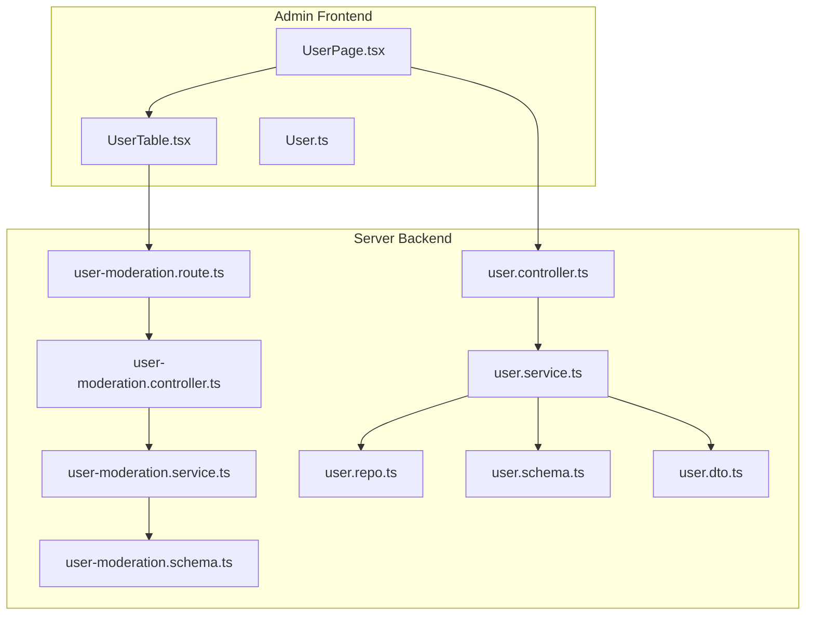

**Diagram sources**
- [UserPage.tsx](file://admin/src/pages/UserPage.tsx#L1-L235)
- [UserTable.tsx](file://admin/src/components/general/UserTable.tsx#L1-L323)
- [User.ts](file://admin/src/types/User.ts#L1-L16)
- [user-moderation.route.ts](file://server/src/modules/moderation/user/user-moderation.route.ts#L1-L20)
- [user-moderation.controller.ts](file://server/src/modules/moderation/user/user-moderation.controller.ts#L1-L82)
- [user-moderation.service.ts](file://server/src/modules/moderation/user/user-moderation.service.ts#L1-L187)
- [user-moderation.schema.ts](file://server/src/modules/moderation/user/user-moderation.schema.ts#L1-L30)
- [user.controller.ts](file://server/src/modules/user/user.controller.ts#L1-L72)
- [user.service.ts](file://server/src/modules/user/user.service.ts#L1-L137)
- [user.repo.ts](file://server/src/modules/user/user.repo.ts#L1-L67)
- [user.schema.ts](file://server/src/modules/user/user.schema.ts#L1-L40)
- [user.dto.ts](file://server/src/modules/user/user.dto.ts#L1-L17)

**Section sources**
- [UserPage.tsx](file://admin/src/pages/UserPage.tsx#L1-L235)
- [UserTable.tsx](file://admin/src/components/general/UserTable.tsx#L1-L323)
- [User.ts](file://admin/src/types/User.ts#L1-L16)
- [user-moderation.route.ts](file://server/src/modules/moderation/user/user-moderation.route.ts#L1-L20)
- [user-moderation.controller.ts](file://server/src/modules/moderation/user/user-moderation.controller.ts#L1-L82)
- [user-moderation.service.ts](file://server/src/modules/moderation/user/user-moderation.service.ts#L1-L187)
- [user-moderation.schema.ts](file://server/src/modules/moderation/user/user-moderation.schema.ts#L1-L30)
- [user.controller.ts](file://server/src/modules/user/user.controller.ts#L1-L72)
- [user.service.ts](file://server/src/modules/user/user.service.ts#L1-L137)
- [user.repo.ts](file://server/src/modules/user/user.repo.ts#L1-L67)
- [user.schema.ts](file://server/src/modules/user/user.schema.ts#L1-L40)
- [user.dto.ts](file://server/src/modules/user/user.dto.ts#L1-L17)

## Core Components
- Admin user listing and search:
  - Fetches paginated user lists and supports username/email search.
  - Displays counts for visible users, active, blocked, and suspended users.
- User table:
  - Renders user data with profile preview and actions dropdown.
  - Supports blocking/unblocking and suspension/removal of suspension.
- Moderation endpoints:
  - Admin-only endpoints to list/search users and update moderation state (block/suspend).
- User profile management:
  - Profile retrieval and updates via dedicated user endpoints.
- Role and permissions:
  - Admin/moderator routes protected by authentication and role checks.

**Section sources**
- [UserPage.tsx](file://admin/src/pages/UserPage.tsx#L22-L133)
- [UserTable.tsx](file://admin/src/components/general/UserTable.tsx#L41-L116)
- [user-moderation.route.ts](file://server/src/modules/moderation/user/user-moderation.route.ts#L7-L17)
- [user.controller.ts](file://server/src/modules/user/user.controller.ts#L9-L33)

## Architecture Overview
The admin user management flow connects the frontend UI to backend moderation APIs and user services.

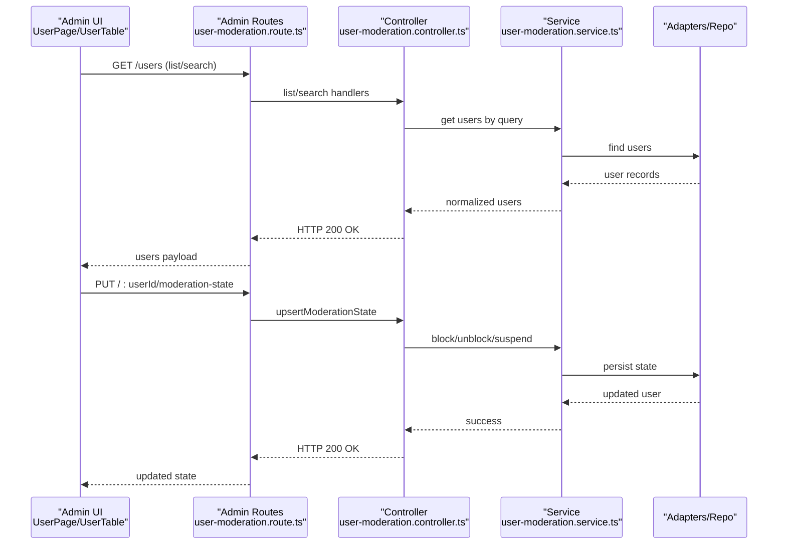

**Diagram sources**
- [UserPage.tsx](file://admin/src/pages/UserPage.tsx#L45-L111)
- [UserTable.tsx](file://admin/src/components/general/UserTable.tsx#L48-L116)
- [user-moderation.route.ts](file://server/src/modules/moderation/user/user-moderation.route.ts#L11-L17)
- [user-moderation.controller.ts](file://server/src/modules/moderation/user/user-moderation.controller.ts#L28-L78)
- [user-moderation.service.ts](file://server/src/modules/moderation/user/user-moderation.service.ts#L7-L183)

## Detailed Component Analysis

### Admin User Listing and Search (UserPage)
- Purpose: Paginated listing of users and search by username or email.
- Key behaviors:
  - Uses limit/offset for pagination.
  - Switches to search endpoint when filters are present.
  - Resets to default list when filters are cleared.
  - Computes dashboard-like stats for active/block/suspend counts.
- Data mapping:
  - Translates backend admin list payload to frontend User type, including suspension metadata.

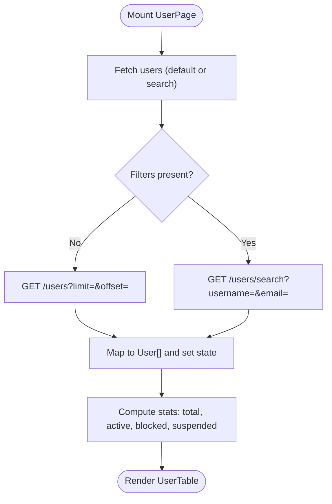

**Diagram sources**
- [UserPage.tsx](file://admin/src/pages/UserPage.tsx#L45-L133)

**Section sources**
- [UserPage.tsx](file://admin/src/pages/UserPage.tsx#L22-L133)

### User Table and Actions (UserTable)
- Purpose: Render user rows, provide profile preview, and perform moderation actions.
- Columns:
  - Username, Branch, Blocked status, Suspension expiry.
- Actions:
  - Ban/Unban user.
  - Suspend user (opens dialog to set days and reason).
  - Remove suspension.
- State management:
  - Updates local state after successful requests.
  - Handles active action busy state per row.

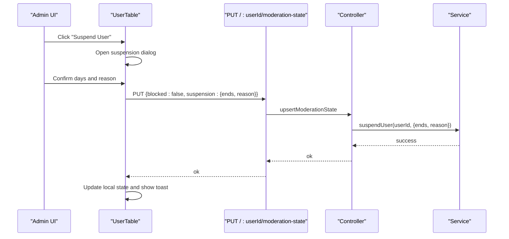

**Diagram sources**
- [UserTable.tsx](file://admin/src/components/general/UserTable.tsx#L48-L144)
- [user-moderation.controller.ts](file://server/src/modules/moderation/user/user-moderation.controller.ts#L48-L71)
- [user-moderation.service.ts](file://server/src/modules/moderation/user/user-moderation.service.ts#L79-L128)

**Section sources**
- [UserTable.tsx](file://admin/src/components/general/UserTable.tsx#L41-L116)
- [UserTable.tsx](file://admin/src/components/general/UserTable.tsx#L146-L262)
- [UserTable.tsx](file://admin/src/components/general/UserTable.tsx#L274-L321)

### Moderation Endpoints and Validation
- Routes:
  - GET /users (admin list with pagination).
  - GET /users/search (admin search by username/email).
  - PUT /:userId/moderation-state (update block/suspension).
  - GET /:userId/suspension (fetch suspension status).
- Authentication and roles:
  - Protected by authenticate, requireAuth, and requireRole("admin", "superadmin").
- Validation:
  - user-moderation.schema enforces presence of either email or username for search, and validates suspension payload.

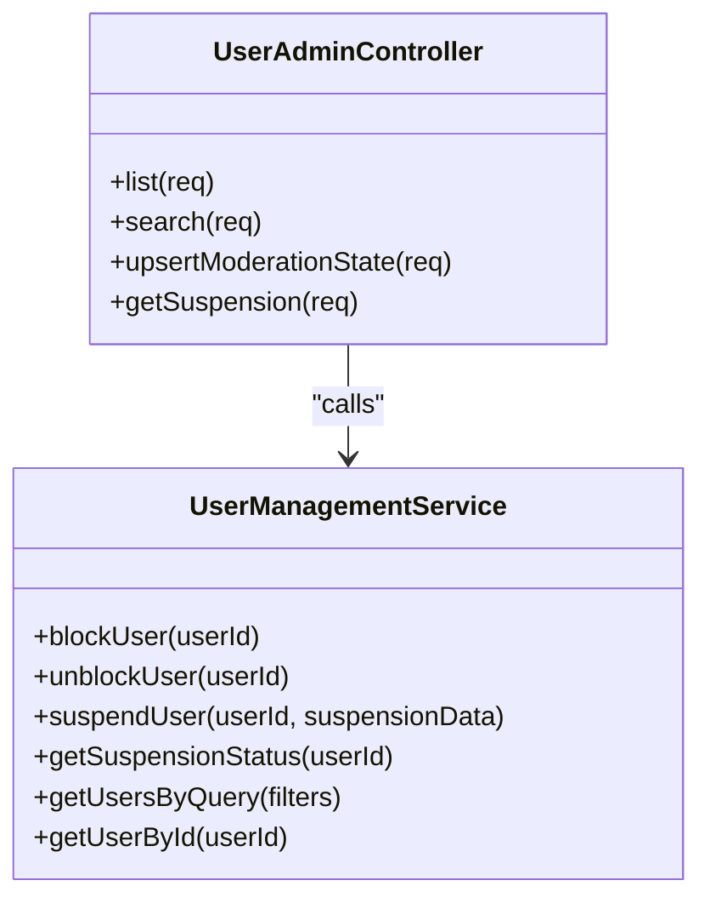

**Diagram sources**
- [user-moderation.controller.ts](file://server/src/modules/moderation/user/user-moderation.controller.ts#L27-L79)
- [user-moderation.service.ts](file://server/src/modules/moderation/user/user-moderation.service.ts#L6-L186)
- [user-moderation.route.ts](file://server/src/modules/moderation/user/user-moderation.route.ts#L7-L17)
- [user-moderation.schema.ts](file://server/src/modules/moderation/user/user-moderation.schema.ts#L3-L29)

**Section sources**
- [user-moderation.route.ts](file://server/src/modules/moderation/user/user-moderation.route.ts#L1-L20)
- [user-moderation.controller.ts](file://server/src/modules/moderation/user/user-moderation.controller.ts#L26-L79)
- [user-moderation.service.ts](file://server/src/modules/moderation/user/user-moderation.service.ts#L142-L183)
- [user-moderation.schema.ts](file://server/src/modules/moderation/user/user-moderation.schema.ts#L1-L30)

### User Profile Management and Verification
- Profile retrieval:
  - Admin can fetch user details via user controller endpoints.
- Profile updates:
  - Update branch via updateUserProfile endpoint.
- Verification and terms:
  - acceptTerms endpoint marks user as having accepted terms.
- DTO and schemas:
  - toPublicUser maps internal user to public shape.
  - user.schema defines validation for branch updates and search queries.

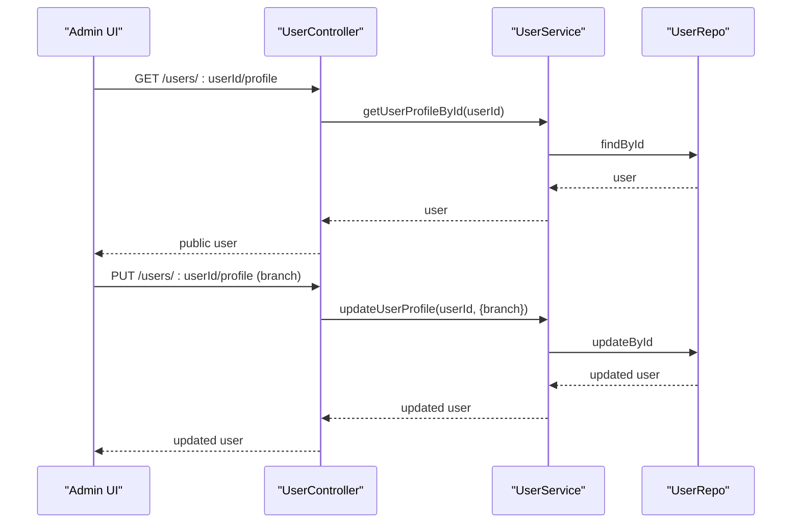

**Diagram sources**
- [user.controller.ts](file://server/src/modules/user/user.controller.ts#L9-L51)
- [user.service.ts](file://server/src/modules/user/user.service.ts#L9-L89)
- [user.repo.ts](file://server/src/modules/user/user.repo.ts#L6-L66)
- [user.dto.ts](file://server/src/modules/user/user.dto.ts#L3-L11)
- [user.schema.ts](file://server/src/modules/user/user.schema.ts#L33-L39)

**Section sources**
- [user.controller.ts](file://server/src/modules/user/user.controller.ts#L9-L51)
- [user.service.ts](file://server/src/modules/user/user.service.ts#L43-L89)
- [user.repo.ts](file://server/src/modules/user/user.repo.ts#L6-L66)
- [user.dto.ts](file://server/src/modules/user/user.dto.ts#L1-L17)
- [user.schema.ts](file://server/src/modules/user/user.schema.ts#L33-L39)

### User Suspension Workflows
- Suspension creation:
  - Admin sets suspension end date and reason; backend validates future date and non-empty reason.
- Removal of suspension:
  - Admin removes suspension; backend clears suspension data.
- Active suspension detection:
  - Frontend determines if a suspension is currently active based on end date.

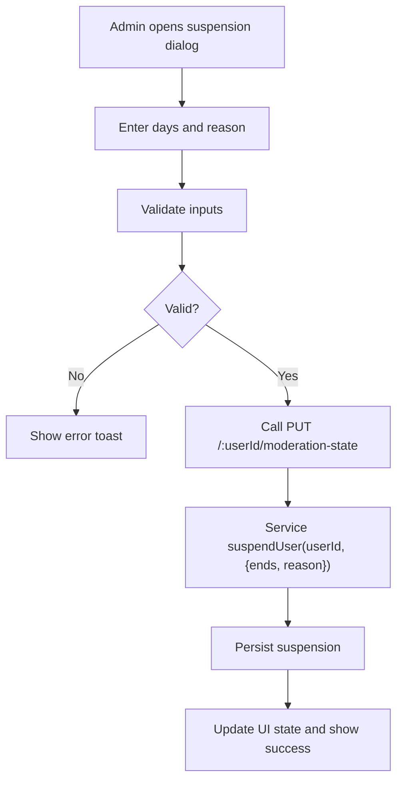

**Diagram sources**
- [UserTable.tsx](file://admin/src/components/general/UserTable.tsx#L118-L144)
- [user-moderation.controller.ts](file://server/src/modules/moderation/user/user-moderation.controller.ts#L48-L71)
- [user-moderation.service.ts](file://server/src/modules/moderation/user/user-moderation.service.ts#L79-L128)

**Section sources**
- [UserTable.tsx](file://admin/src/components/general/UserTable.tsx#L48-L116)
- [user-moderation.service.ts](file://server/src/modules/moderation/user/user-moderation.service.ts#L79-L128)

### User Search Functionality
- Admin search:
  - Requires at least one of email or username; backend returns filtered users without exposing sensitive fields.
- Public search:
  - Public user search endpoint returns public profiles.

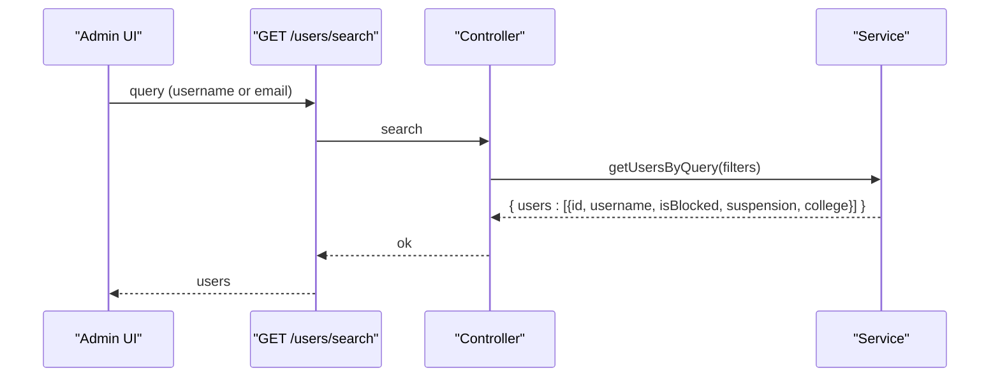

**Diagram sources**
- [UserPage.tsx](file://admin/src/pages/UserPage.tsx#L73-L111)
- [user-moderation.controller.ts](file://server/src/modules/moderation/user/user-moderation.controller.ts#L41-L46)
- [user-moderation.service.ts](file://server/src/modules/moderation/user/user-moderation.service.ts#L142-L162)

**Section sources**
- [UserPage.tsx](file://admin/src/pages/UserPage.tsx#L73-L111)
- [user-moderation.controller.ts](file://server/src/modules/moderation/user/user-moderation.controller.ts#L41-L46)
- [user-moderation.service.ts](file://server/src/modules/moderation/user/user-moderation.service.ts#L142-L162)

### Role Management and Permission Administration
- Route protection:
  - Admin/moderator endpoints require authentication and role checks ("admin", "superadmin").
- User roles:
  - User retrieval includes roles in the returned payload.

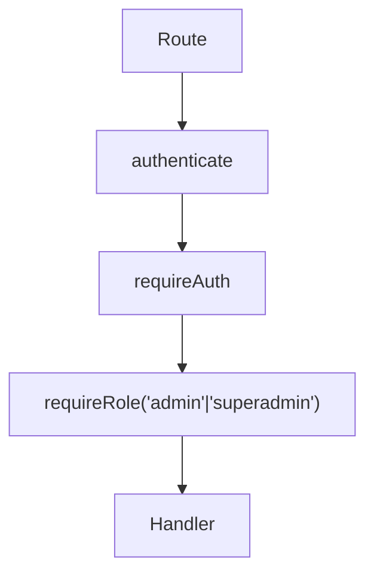

**Diagram sources**
- [user-moderation.route.ts](file://server/src/modules/moderation/user/user-moderation.route.ts#L7-L9)

**Section sources**
- [user-moderation.route.ts](file://server/src/modules/moderation/user/user-moderation.route.ts#L7-L9)
- [user-moderation.service.ts](file://server/src/modules/moderation/user/user-moderation.service.ts#L164-L183)

### User Activity Monitoring
- Suspension status:
  - Admin can fetch current suspension status for a user.
- Audit logging:
  - User actions are recorded via audit logging utilities.

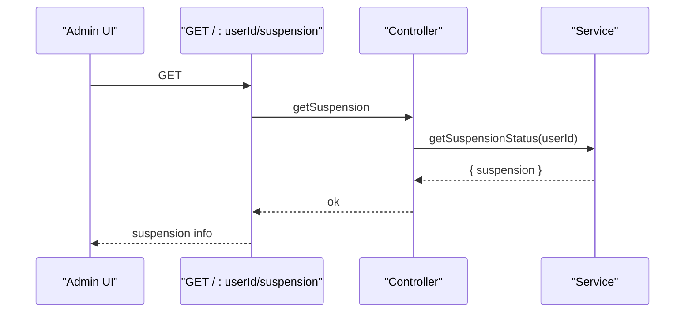

**Diagram sources**
- [user-moderation.controller.ts](file://server/src/modules/moderation/user/user-moderation.controller.ts#L73-L78)
- [user-moderation.service.ts](file://server/src/modules/moderation/user/user-moderation.service.ts#L130-L140)

**Section sources**
- [user-moderation.controller.ts](file://server/src/modules/moderation/user/user-moderation.controller.ts#L73-L78)
- [user-moderation.service.ts](file://server/src/modules/moderation/user/user-moderation.service.ts#L130-L140)

## Dependency Analysis
- Frontend-to-backend:
  - UserPage depends on HTTP client to call admin endpoints.
  - UserTable depends on HTTP client and dialogs to trigger moderation actions.
- Backend:
  - Routes depend on controller methods.
  - Controllers depend on service methods.
  - Services depend on repositories/adapters and schemas for validation.
- Types:
  - Admin frontend uses a User type aligned with backend DTOs.

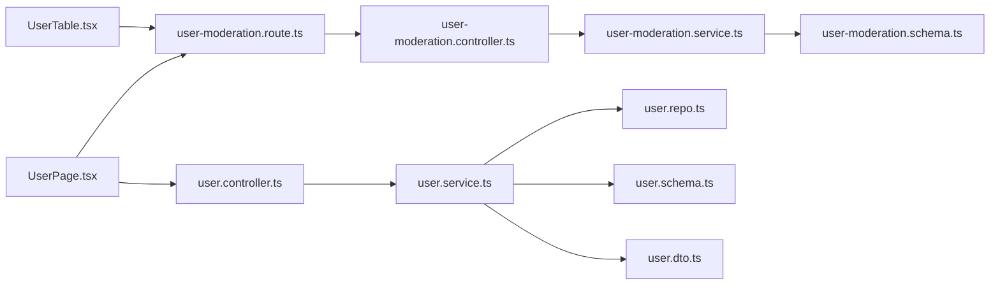

**Diagram sources**
- [UserTable.tsx](file://admin/src/components/general/UserTable.tsx#L1-L14)
- [UserPage.tsx](file://admin/src/pages/UserPage.tsx#L7-L8)
- [user-moderation.route.ts](file://server/src/modules/moderation/user/user-moderation.route.ts#L1-L19)
- [user-moderation.controller.ts](file://server/src/modules/moderation/user/user-moderation.controller.ts#L1-L79)
- [user-moderation.service.ts](file://server/src/modules/moderation/user/user-moderation.service.ts#L1-L187)
- [user-moderation.schema.ts](file://server/src/modules/moderation/user/user-moderation.schema.ts#L1-L30)
- [user.controller.ts](file://server/src/modules/user/user.controller.ts#L1-L72)
- [user.service.ts](file://server/src/modules/user/user.service.ts#L1-L137)
- [user.repo.ts](file://server/src/modules/user/user.repo.ts#L1-L67)
- [user.schema.ts](file://server/src/modules/user/user.schema.ts#L1-L40)
- [user.dto.ts](file://server/src/modules/user/user.dto.ts#L1-L17)

**Section sources**
- [UserTable.tsx](file://admin/src/components/general/UserTable.tsx#L1-L14)
- [UserPage.tsx](file://admin/src/pages/UserPage.tsx#L7-L8)
- [user-moderation.route.ts](file://server/src/modules/moderation/user/user-moderation.route.ts#L1-L19)
- [user-moderation.controller.ts](file://server/src/modules/moderation/user/user-moderation.controller.ts#L1-L79)
- [user-moderation.service.ts](file://server/src/modules/moderation/user/user-moderation.service.ts#L1-L187)
- [user.controller.ts](file://server/src/modules/user/user.controller.ts#L1-L72)
- [user.service.ts](file://server/src/modules/user/user.service.ts#L1-L137)
- [user.repo.ts](file://server/src/modules/user/user.repo.ts#L1-L67)

## Performance Considerations
- Pagination:
  - Use limit/offset to avoid large payloads; keep limit reasonable (as configured in frontend).
- Caching:
  - User reads leverage cached adapters; invalidation occurs on updates to minimize stale data.
- Network efficiency:
  - Prefer search with at least one filter to reduce result sets.
  - Batch moderation actions where possible (bulk operations are not implemented; apply actions individually).

## Troubleshooting Guide
- Common errors:
  - Bad request: invalid suspension end date or missing inputs.
  - Not found: user not found for block/unblock/suspend/get.
  - Role errors: unauthorized access if missing admin/superadmin role.
- Frontend tips:
  - Verify active action busy state to prevent concurrent actions.
  - Ensure suspension reason and days are valid before submitting.
  - Use reset filters to return to default list view.

**Section sources**
- [user-moderation.service.ts](file://server/src/modules/moderation/user/user-moderation.service.ts#L98-L105)
- [user-moderation.controller.ts](file://server/src/modules/moderation/user/user-moderation.controller.ts#L9-L24)
- [UserTable.tsx](file://admin/src/components/general/UserTable.tsx#L122-L144)

## Conclusion
The administrative user management system provides a robust interface for overseeing users, performing moderation actions, and inspecting user data. It integrates secure admin endpoints with a responsive frontend, enabling efficient user oversight, profile management, and activity monitoring while enforcing role-based permissions and input validation.

## Appendices

### Data Model: User Type
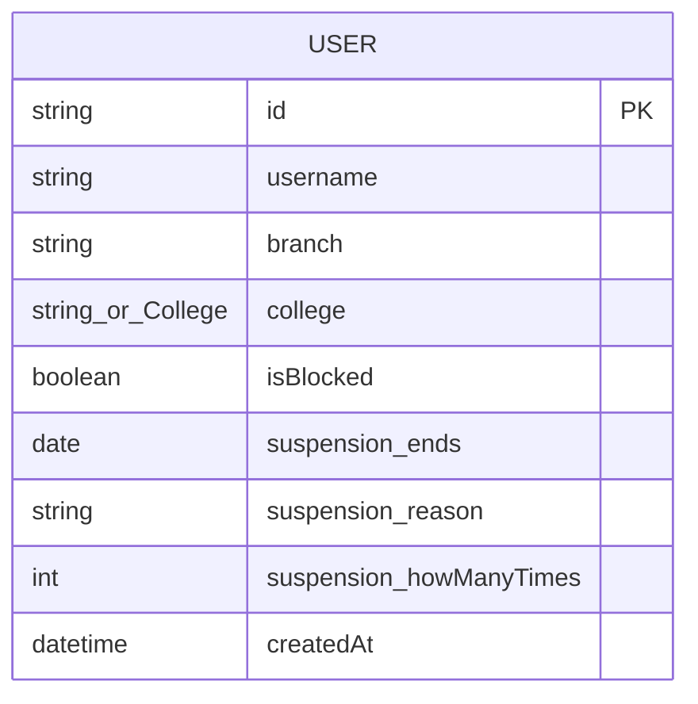

**Diagram sources**
- [User.ts](file://admin/src/types/User.ts#L3-L15)

**Section sources**
- [User.ts](file://admin/src/types/User.ts#L1-L16)

### API Definitions
- List users (admin):
  - Method: GET
  - Path: /users
  - Query: query, limit, offset
  - Response: users array with id, username, isBlocked, suspension, college
- Search users (admin):
  - Method: GET
  - Path: /users/search
  - Query: username (optional), email (optional)
  - Response: users array with id, username, isBlocked, suspension, college
- Upsert moderation state:
  - Method: PUT
  - Path: /:userId/moderation-state
  - Body: blocked (boolean), suspension (optional: { ends (ISO), reason })
  - Response: { userId, blocked, suspension }
- Get suspension status:
  - Method: GET
  - Path: /:userId/suspension
  - Response: { suspension }

**Section sources**
- [user-moderation.route.ts](file://server/src/modules/moderation/user/user-moderation.route.ts#L11-L17)
- [user-moderation.controller.ts](file://server/src/modules/moderation/user/user-moderation.controller.ts#L28-L78)
- [user-moderation.schema.ts](file://server/src/modules/moderation/user/user-moderation.schema.ts#L12-L29)