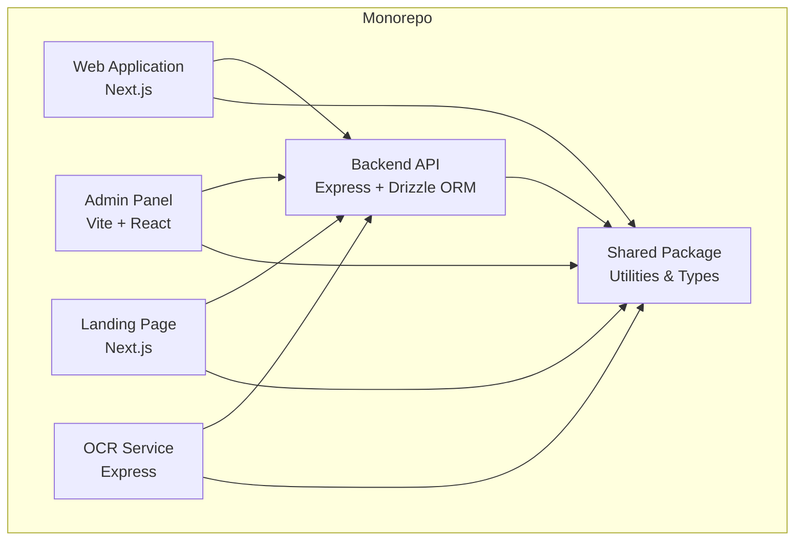
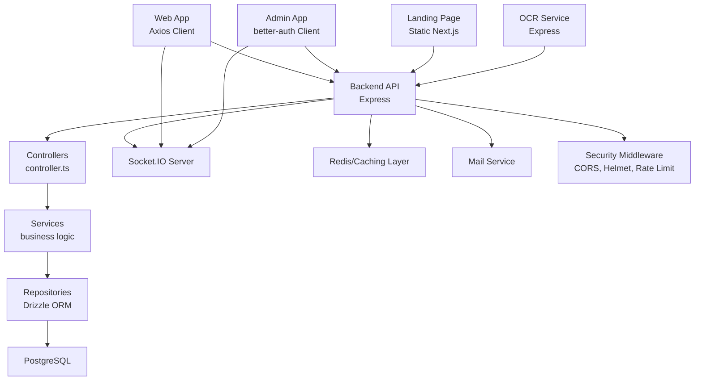
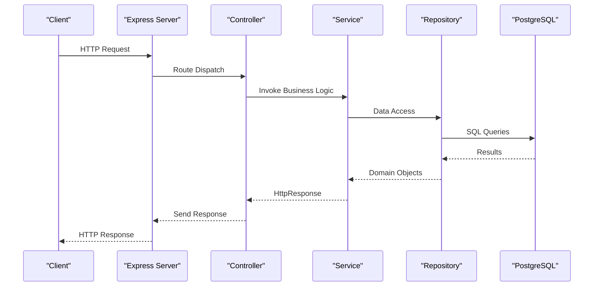
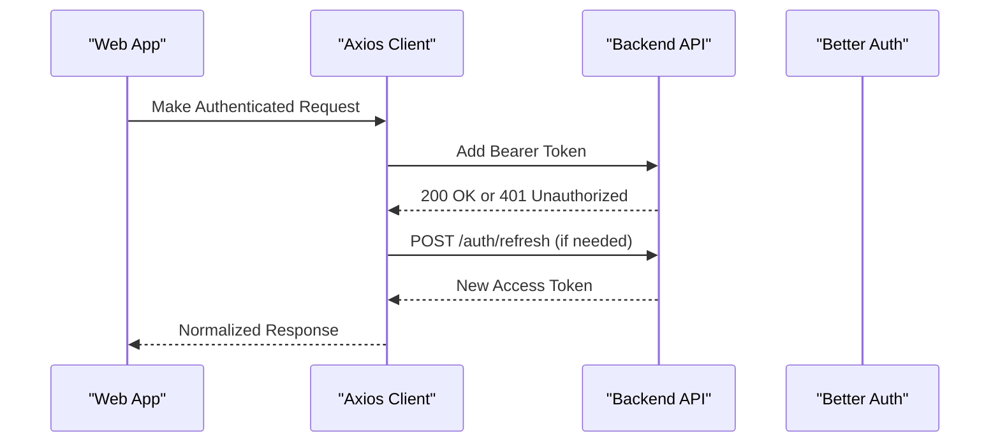
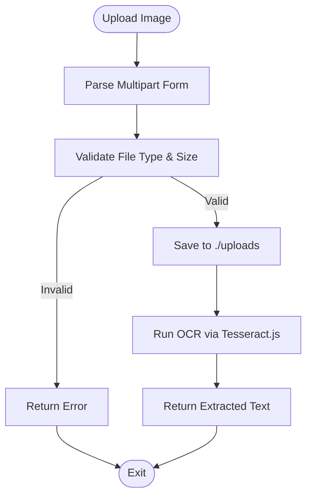
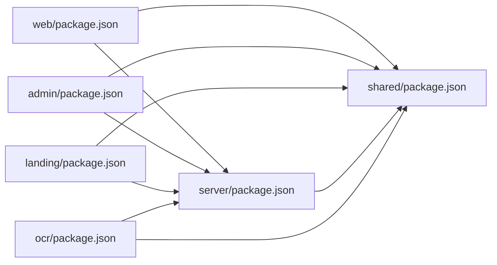

# Architecture

<cite>
**Referenced Files in This Document**
- [package.json](file://package.json)
- [pnpm-workspace.yaml](file://pnpm-workspace.yaml)
- [turbo.json](file://turbo.json)
- [server/package.json](file://server/package.json)
- [web/package.json](file://web/package.json)
- [admin/package.json](file://admin/package.json)
- [landing/package.json](file://landing/package.json)
- [ocr/package.json](file://ocr/package.json)
- [shared/package.json](file://shared/package.json)
- [server/src/app.ts](file://server/src/app.ts)
- [server/src/core/http/controller.ts](file://server/src/core/http/controller.ts)
- [server/src/infra/services/socket/index.ts](file://server/src/infra/services/socket/index.ts)
- [server/src/infra/db/index.ts](file://server/src/infra/db/index.ts)
- [web/src/services/http.ts](file://web/src/services/http.ts)
- [admin/src/lib/auth-client.ts](file://admin/src/lib/auth-client.ts)
- [landing/src/app/layout.tsx](file://landing/src/app/layout.tsx)
- [ocr/src/app.ts](file://ocr/src/app.ts)
- [shared/src/index.ts](file://shared/src/index.ts)
</cite>

## Table of Contents
1. [Introduction](#introduction)
2. [Project Structure](#project-structure)
3. [Core Components](#core-components)
4. [Architecture Overview](#architecture-overview)
5. [Detailed Component Analysis](#detailed-component-analysis)
6. [Dependency Analysis](#dependency-analysis)
7. [Performance Considerations](#performance-considerations)
8. [Troubleshooting Guide](#troubleshooting-guide)
9. [Conclusion](#conclusion)

## Introduction
This document describes the architecture of the Flick system, a monorepo composed of five distinct applications and a shared package. It explains the layered architecture pattern (controllers, services, repositories), component interactions, and data flows. It also documents technology stack choices, design patterns, system boundaries, integration patterns, and cross-cutting concerns such as authentication, caching, and real-time communication.

## Project Structure
The monorepo is organized using a workspace-first approach with pnpm and Turborepo. The five primary applications are:
- Web application (Next.js)
- Admin panel (Vite + React)
- Landing page (Next.js)
- OCR service (Express)
- Backend API (Express + Drizzle ORM)

A shared package provides reusable utilities and types across applications.

**Diagram sources**
- [pnpm-workspace.yaml](file://pnpm-workspace.yaml#L1-L15)
- [turbo.json](file://turbo.json#L1-L27)
- [server/src/app.ts](file://server/src/app.ts#L1-L33)
- [web/src/services/http.ts](file://web/src/services/http.ts#L1-L135)
- [admin/src/lib/auth-client.ts](file://admin/src/lib/auth-client.ts#L1-L11)
- [landing/src/app/layout.tsx](file://landing/src/app/layout.tsx#L1-L27)
- [ocr/src/app.ts](file://ocr/src/app.ts#L1-L37)
- [shared/src/index.ts](file://shared/src/index.ts#L1-L8)

**Section sources**
- [pnpm-workspace.yaml](file://pnpm-workspace.yaml#L1-L15)
- [turbo.json](file://turbo.json#L1-L27)
- [package.json](file://package.json#L1-L32)

## Core Components
- Web application: Next.js frontend that communicates with the backend API via Axios, handles authentication, and integrates real-time updates via Socket.IO.
- Admin panel: Vite-built React admin interface using better-auth client for session management and interacting with backend moderation endpoints.
- Landing page: Next.js marketing site with minimal UI and routing.
- OCR service: Standalone Express service for image-to-text extraction, exposing a single endpoint for uploaded images.
- Backend API: Express server with layered architecture, Drizzle ORM for database access, Socket.IO for real-time events, and middleware for security and logging.
- Shared package: Reusable utilities and types consumed by all applications.

**Section sources**
- [web/package.json](file://web/package.json#L1-L67)
- [admin/package.json](file://admin/package.json#L1-L78)
- [landing/package.json](file://landing/package.json#L1-L37)
- [ocr/package.json](file://ocr/package.json#L1-L33)
- [server/package.json](file://server/package.json#L1-L80)
- [shared/package.json](file://shared/package.json)

## Architecture Overview
The system follows a layered backend architecture with clear separation of concerns:
- Controllers: HTTP entry points decorated with a controller decorator that enforce return type safety and response handling.
- Services: Business logic orchestration, including caching keys, rate limiting, and external integrations.
- Repositories: Data access layer backed by Drizzle ORM and PostgreSQL.

Real-time communication is handled by Socket.IO, while authentication is centralized via better-auth with separate clients in the web and admin apps. Cross-cutting concerns include request logging, error handling, CORS, rate limiting, and caching.

**Diagram sources**
- [server/src/core/http/controller.ts](file://server/src/core/http/controller.ts#L1-L80)
- [server/src/infra/db/index.ts](file://server/src/infra/db/index.ts#L1-L38)
- [server/src/infra/services/socket/index.ts](file://server/src/infra/services/socket/index.ts#L1-L48)
- [server/src/app.ts](file://server/src/app.ts#L1-L33)
- [web/src/services/http.ts](file://web/src/services/http.ts#L1-L135)
- [admin/src/lib/auth-client.ts](file://admin/src/lib/auth-client.ts#L1-L11)
- [ocr/src/app.ts](file://ocr/src/app.ts#L1-L37)

## Detailed Component Analysis

### Backend API (server)
- Entry point initializes Express, HTTP server, Socket.IO, security middleware, and routes.
- Uses a controller decorator to enforce HttpResponse return types and standardized response handling.
- Drizzle ORM connects to PostgreSQL and exposes typed tables for all domain entities.
- Socket.IO service manages real-time connections and event modules.

**Diagram sources**
- [server/src/app.ts](file://server/src/app.ts#L1-L33)
- [server/src/core/http/controller.ts](file://server/src/core/http/controller.ts#L1-L80)
- [server/src/infra/db/index.ts](file://server/src/infra/db/index.ts#L1-L38)

**Section sources**
- [server/src/app.ts](file://server/src/app.ts#L1-L33)
- [server/src/core/http/controller.ts](file://server/src/core/http/controller.ts#L1-L80)
- [server/src/infra/db/index.ts](file://server/src/infra/db/index.ts#L1-L38)

### Web Application
- Axios client configured with base URL, credentials, and interceptors for token injection and automatic refresh.
- Real-time integration via Socket.IO client for live updates.
- Better-auth client for authentication flows.

**Diagram sources**
- [web/src/services/http.ts](file://web/src/services/http.ts#L1-L135)
- [admin/src/lib/auth-client.ts](file://admin/src/lib/auth-client.ts#L1-L11)

**Section sources**
- [web/src/services/http.ts](file://web/src/services/http.ts#L1-L135)
- [admin/src/lib/auth-client.ts](file://admin/src/lib/auth-client.ts#L1-L11)

### Admin Panel
- React admin built with Vite, using better-auth client to communicate with the backend authentication endpoints.
- Integrates charts, forms, and real-time features via Socket.IO client.

**Section sources**
- [admin/package.json](file://admin/package.json#L1-L78)
- [admin/src/lib/auth-client.ts](file://admin/src/lib/auth-client.ts#L1-L11)

### Landing Page
- Minimal Next.js application providing marketing content and routing.

**Section sources**
- [landing/package.json](file://landing/package.json#L1-L37)
- [landing/src/app/layout.tsx](file://landing/src/app/layout.tsx#L1-L27)

### OCR Service
- Express service with Multer for image uploads and Tesseract.js for OCR.
- Exposes a single route for extracting text from images.

**Diagram sources**
- [ocr/src/app.ts](file://ocr/src/app.ts#L1-L37)

**Section sources**
- [ocr/src/app.ts](file://ocr/src/app.ts#L1-L37)
- [ocr/package.json](file://ocr/package.json#L1-L33)

### Shared Package
- Provides shared utilities and types used across applications.

**Section sources**
- [shared/src/index.ts](file://shared/src/index.ts#L1-L8)
- [shared/package.json](file://shared/package.json)

## Dependency Analysis
- Workspace management: pnpm workspace defines all packages and only builds specific native dependencies.
- Build orchestration: Turborepo tasks define build order, caching, and incremental builds.
- Internal dependencies: Applications depend on the shared package; the backend depends on shared and infrastructure libraries.
- External dependencies: Express, Drizzle ORM, Socket.IO, better-auth, and others are declared per application.

**Diagram sources**
- [pnpm-workspace.yaml](file://pnpm-workspace.yaml#L1-L15)
- [web/package.json](file://web/package.json#L1-L67)
- [admin/package.json](file://admin/package.json#L1-L78)
- [landing/package.json](file://landing/package.json#L1-L37)
- [server/package.json](file://server/package.json#L1-L80)
- [ocr/package.json](file://ocr/package.json#L1-L33)
- [shared/package.json](file://shared/package.json)

**Section sources**
- [pnpm-workspace.yaml](file://pnpm-workspace.yaml#L1-L15)
- [turbo.json](file://turbo.json#L1-L27)
- [web/package.json](file://web/package.json#L1-L67)
- [admin/package.json](file://admin/package.json#L1-L78)
- [landing/package.json](file://landing/package.json#L1-L37)
- [server/package.json](file://server/package.json#L1-L80)
- [ocr/package.json](file://ocr/package.json#L1-L33)
- [shared/package.json](file://shared/package.json)

## Performance Considerations
- Caching: The backend leverages caching keys and Redis for performance-sensitive operations. Use cache invalidation strategies consistently across services.
- Rate limiting: Apply rate limits at middleware level to protect endpoints from abuse.
- Streaming and uploads: The OCR service uses Multer; configure appropriate limits and disk storage policies.
- Real-time scaling: Socket.IO supports horizontal scaling with a stateless design; ensure proper load balancing and connection persistence.

[No sources needed since this section provides general guidance]

## Troubleshooting Guide
- Authentication refresh failures: The web app’s Axios interceptor attempts to refresh tokens automatically. If refresh fails, queued requests are rejected and the user is logged out. Verify refresh endpoint availability and token validity.
- Socket.IO connectivity: Ensure CORS origins match between the backend and clients. Confirm transport settings and event module attachments.
- Database migrations: Use Drizzle Kit commands to migrate and generate schema changes. Keep migration scripts under version control.
- Environment variables: Confirm environment files for each app and service are properly loaded and validated.

**Section sources**
- [web/src/services/http.ts](file://web/src/services/http.ts#L1-L135)
- [server/src/infra/services/socket/index.ts](file://server/src/infra/services/socket/index.ts#L1-L48)
- [server/package.json](file://server/package.json#L1-L80)

## Conclusion
The Flick system employs a clean monorepo architecture with five focused applications and a shared package. The backend follows a layered design with controllers, services, and repositories, integrating caching, real-time communication, and robust authentication. The frontend apps consume the backend via HTTP and Socket.IO, while the OCR service provides specialized functionality. This structure promotes maintainability, scalability, and clear system boundaries.