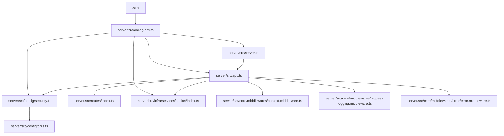
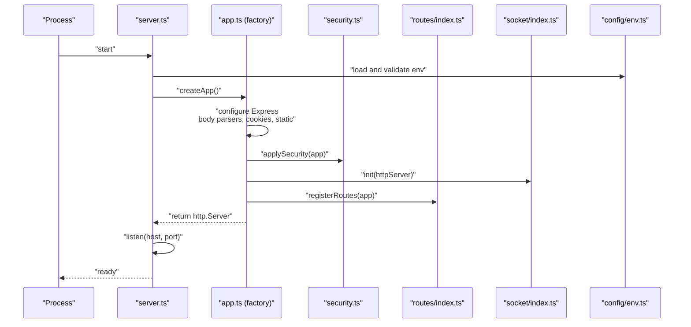
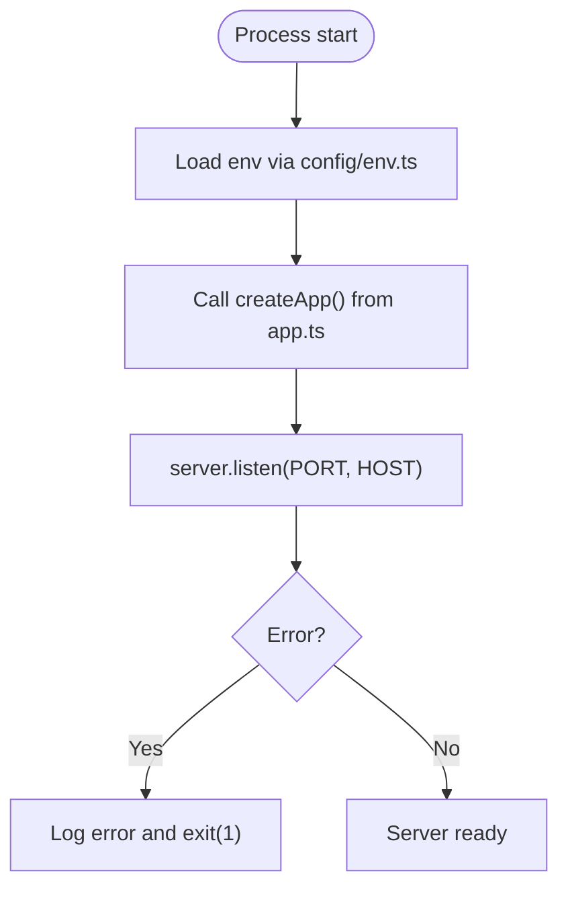
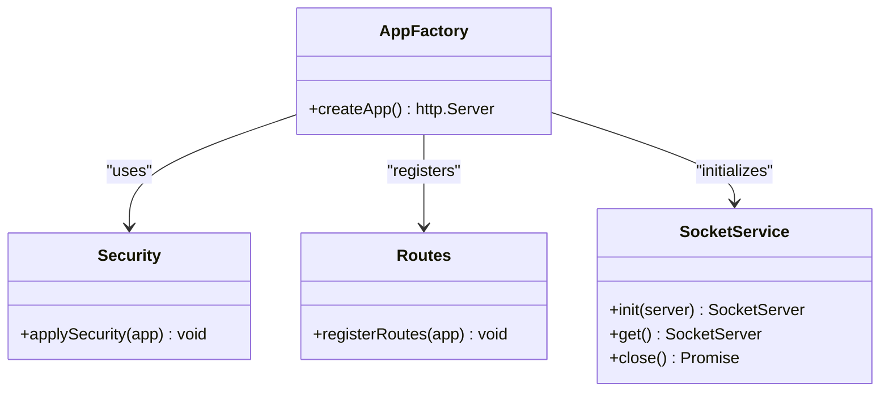
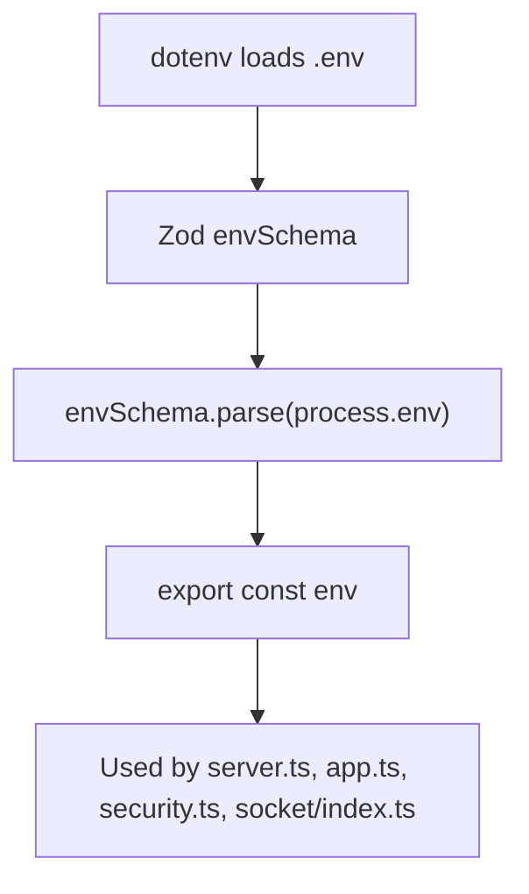
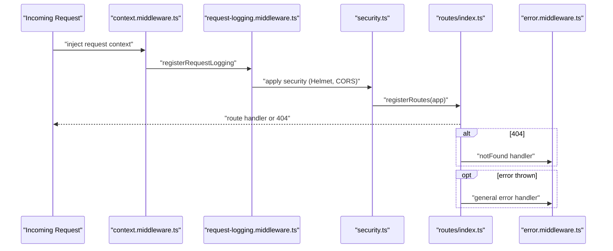
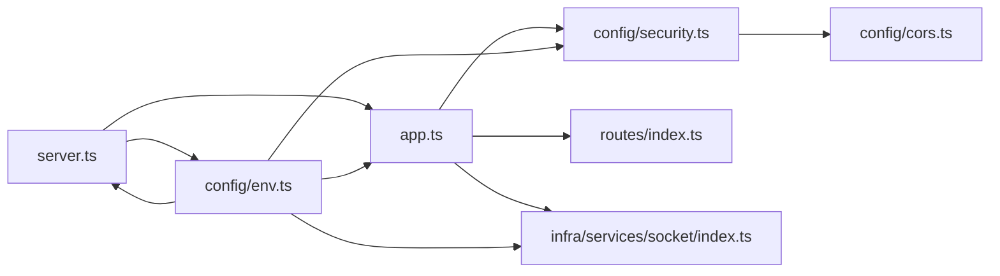

# Application Bootstrap

<cite>
**Referenced Files in This Document**
- [server.ts](file://server/src/server.ts)
- [app.ts](file://server/src/app.ts)
- [env.ts](file://server/src/config/env.ts)
- [.env](file://server/.env)
- [security.ts](file://server/src/config/security.ts)
- [cors.ts](file://server/src/config/cors.ts)
- [index.ts](file://server/src/routes/index.ts)
- [health.routes.ts](file://server/src/routes/health.routes.ts)
- [error.middleware.ts](file://server/src/core/middlewares/error/error.middleware.ts)
- [context.middleware.ts](file://server/src/core/middlewares/context.middleware.ts)
- [request-logging.middleware.ts](file://server/src/core/middlewares/request-logging.middleware.ts)
- [logger.ts](file://server/src/core/logger/logger.ts)
- [socket/index.ts](file://server/src/infra/services/socket/index.ts)
- [package.json](file://server/package.json)
</cite>

## Table of Contents
1. [Introduction](#introduction)
2. [Project Structure](#project-structure)
3. [Core Components](#core-components)
4. [Architecture Overview](#architecture-overview)
5. [Detailed Component Analysis](#detailed-component-analysis)
6. [Dependency Analysis](#dependency-analysis)
7. [Performance Considerations](#performance-considerations)
8. [Troubleshooting Guide](#troubleshooting-guide)
9. [Conclusion](#conclusion)

## Introduction
This document explains the Flick application bootstrap process for the server. It covers how the Express.js application is created, how environment configuration is loaded and validated, and how the application factory pattern is used to initialize the server. It also documents the startup sequence, port and host configuration, error handling during startup, and the modular approach to integrating configuration modules. Practical examples of environment variable usage, startup sequence, and graceful shutdown procedures are included, along with common startup issues and debugging techniques.

## Project Structure
The server bootstrap spans a small set of focused modules:
- Entry point initializes the application and starts the HTTP server.
- Application factory configures Express, middleware, security, routing, and sockets.
- Environment configuration is loaded and validated via Zod.
- Health endpoints and error handling are registered early in the pipeline.
- Logging and auditing middleware provide observability.

**Diagram sources**
- [server.ts](file://server/src/server.ts#L1-L23)
- [app.ts](file://server/src/app.ts#L1-L33)
- [security.ts](file://server/src/config/security.ts#L1-L14)
- [cors.ts](file://server/src/config/cors.ts#L1-L13)
- [index.ts](file://server/src/routes/index.ts#L1-L39)
- [socket/index.ts](file://server/src/infra/services/socket/index.ts#L1-L48)
- [env.ts](file://server/src/config/env.ts#L1-L42)
- [.env](file://server/.env#L1-L49)

**Section sources**
- [server.ts](file://server/src/server.ts#L1-L23)
- [app.ts](file://server/src/app.ts#L1-L33)
- [env.ts](file://server/src/config/env.ts#L1-L42)
- [.env](file://server/.env#L1-L49)

## Core Components
- Server entry point: Creates the Express application via the factory, binds to configured host and port, and registers startup and error event handlers.
- Application factory: Initializes Express, sets up body parsing, cookies, static serving, request context, logging, security, routes, and error handlers.
- Environment configuration: Loads and validates environment variables using Zod, providing defaults and strict typing.
- Security middleware: Applies Helmet and CORS with origin lists from environment.
- Routing: Registers health endpoints and all module routes.
- Error handling: Centralized handler for Zod and HTTP errors, plus a not-found handler.
- Observability: Request ID injection, audit buffer flushing, structured request logs, and Winston-based logging.

**Section sources**
- [server.ts](file://server/src/server.ts#L1-L23)
- [app.ts](file://server/src/app.ts#L1-L33)
- [env.ts](file://server/src/config/env.ts#L1-L42)
- [security.ts](file://server/src/config/security.ts#L1-L14)
- [cors.ts](file://server/src/config/cors.ts#L1-L13)
- [index.ts](file://server/src/routes/index.ts#L1-L39)
- [error.middleware.ts](file://server/src/core/middlewares/error/error.middleware.ts#L1-L68)
- [context.middleware.ts](file://server/src/core/middlewares/context.middleware.ts#L1-L61)
- [request-logging.middleware.ts](file://server/src/core/middlewares/request-logging.middleware.ts#L1-L40)
- [logger.ts](file://server/src/core/logger/logger.ts#L1-L25)

## Architecture Overview
The bootstrap follows a layered, modular design:
- Entry point depends on the application factory and environment configuration.
- The factory composes middleware, security, routing, and sockets.
- Routes are grouped per domain and mounted under API prefixes.
- Health endpoints are mounted early for readiness probes.
- Error handling is attached last to catch all unhandled exceptions and unmatched routes.

**Diagram sources**
- [server.ts](file://server/src/server.ts#L1-L23)
- [app.ts](file://server/src/app.ts#L1-L33)
- [security.ts](file://server/src/config/security.ts#L1-L14)
- [index.ts](file://server/src/routes/index.ts#L1-L39)
- [socket/index.ts](file://server/src/infra/services/socket/index.ts#L1-L48)
- [env.ts](file://server/src/config/env.ts#L1-L42)

## Detailed Component Analysis

### Server Entry Point
- Loads environment configuration.
- Calls the application factory to create an Express app wrapped in an HTTP server.
- Binds to HOST and PORT from environment.
- Logs successful startup and exits on startup or runtime errors.

**Diagram sources**
- [server.ts](file://server/src/server.ts#L1-L23)
- [env.ts](file://server/src/config/env.ts#L1-L42)
- [app.ts](file://server/src/app.ts#L1-L33)

**Section sources**
- [server.ts](file://server/src/server.ts#L1-L23)

### Application Factory Pattern
- Creates an Express app and wraps it in an HTTP server.
- Registers body parsers, cookies, static assets, and middleware order.
- Applies security (Helmet, CORS) and logging.
- Mounts routes and attaches error handlers.

**Diagram sources**
- [app.ts](file://server/src/app.ts#L1-L33)
- [security.ts](file://server/src/config/security.ts#L1-L14)
- [index.ts](file://server/src/routes/index.ts#L1-L39)
- [socket/index.ts](file://server/src/infra/services/socket/index.ts#L1-L48)

**Section sources**
- [app.ts](file://server/src/app.ts#L1-L33)

### Environment Configuration Loading and Validation
- Loads environment variables from .env using dotenv.
- Validates and parses variables with Zod, providing defaults and strict types.
- Exposes a strongly typed env object to the rest of the application.

**Diagram sources**
- [env.ts](file://server/src/config/env.ts#L1-L42)
- [.env](file://server/.env#L1-L49)

**Section sources**
- [env.ts](file://server/src/config/env.ts#L1-L42)
- [.env](file://server/.env#L1-L49)

### Express.js Application Creation and Middleware Pipeline
- Body parsing with size limits.
- Cookie parsing.
- Static asset serving.
- Request context injection with request IDs and audit buffers.
- Request logging via Morgan to Winston.
- Security headers and CORS.
- Route registration.
- Not-found and general error handlers.

**Diagram sources**
- [context.middleware.ts](file://server/src/core/middlewares/context.middleware.ts#L1-L61)
- [request-logging.middleware.ts](file://server/src/core/middlewares/request-logging.middleware.ts#L1-L40)
- [security.ts](file://server/src/config/security.ts#L1-L14)
- [index.ts](file://server/src/routes/index.ts#L1-L39)
- [error.middleware.ts](file://server/src/core/middlewares/error/error.middleware.ts#L1-L68)

**Section sources**
- [app.ts](file://server/src/app.ts#L1-L33)
- [context.middleware.ts](file://server/src/core/middlewares/context.middleware.ts#L1-L61)
- [request-logging.middleware.ts](file://server/src/core/middlewares/request-logging.middleware.ts#L1-L40)
- [security.ts](file://server/src/config/security.ts#L1-L14)
- [index.ts](file://server/src/routes/index.ts#L1-L39)
- [error.middleware.ts](file://server/src/core/middlewares/error/error.middleware.ts#L1-L68)

### Port and Host Configuration
- Host and port are taken from env.PORT and env.HOST.
- Defaults are enforced by the Zod schema; development defaults are applied when NODE_ENV is not set.

Practical example locations:
- [Port and host usage](file://server/src/server.ts#L4-L5)
- [Environment schema defaults](file://server/src/config/env.ts#L4-L6)
- [Environment sample values](file://server/.env#L2-L3)

**Section sources**
- [server.ts](file://server/src/server.ts#L4-L5)
- [env.ts](file://server/src/config/env.ts#L4-L6)
- [.env](file://server/.env#L2-L3)

### Error Handling During Startup
- Startup error: Catches exceptions from main and logs them before exiting.
- Runtime error: Listens for "error" events on the HTTP server and exits with failure code.
- Request-time errors: Centralized handler for Zod and HTTP errors, with environment-aware messages and optional stack traces.

Practical example locations:
- [Startup error handling](file://server/src/server.ts#L19-L22)
- [Server error event](file://server/src/server.ts#L13-L16)
- [Request error handling](file://server/src/core/middlewares/error/error.middleware.ts#L9-L53)

**Section sources**
- [server.ts](file://server/src/server.ts#L13-L22)
- [error.middleware.ts](file://server/src/core/middlewares/error/error.middleware.ts#L9-L53)

### Modular Approach to Application Setup
- Security configuration is isolated in its own module and applied by the factory.
- CORS options are derived from environment variables.
- Routes are grouped by domain and mounted under API prefixes.
- Socket service initialization is encapsulated and attached to the HTTP server.
- Logging and auditing middleware are composed early in the pipeline.

Practical example locations:
- [Security composition](file://server/src/app.ts#L23-L24)
- [CORS options](file://server/src/config/cors.ts#L4-L10)
- [Route registration](file://server/src/routes/index.ts#L20-L38)
- [Socket initialization](file://server/src/app.ts#L13-L13)
- [Socket service](file://server/src/infra/services/socket/index.ts#L10-L24)

**Section sources**
- [app.ts](file://server/src/app.ts#L1-L33)
- [security.ts](file://server/src/config/security.ts#L1-L14)
- [cors.ts](file://server/src/config/cors.ts#L1-L13)
- [index.ts](file://server/src/routes/index.ts#L1-L39)
- [socket/index.ts](file://server/src/infra/services/socket/index.ts#L1-L48)

### Graceful Shutdown Procedures
- Socket service exposes a close method that gracefully closes the Socket.IO server.
- The HTTP server can be closed externally by obtaining the server instance from the factory and calling close.
- Audit buffer is flushed on response finish to ensure audit logs are persisted before shutdown.

Practical example locations:
- [Socket close](file://server/src/infra/services/socket/index.ts#L39-L44)
- [Audit flush on finish](file://server/src/core/middlewares/context.middleware.ts#L50-L54)

**Section sources**
- [socket/index.ts](file://server/src/infra/services/socket/index.ts#L39-L44)
- [context.middleware.ts](file://server/src/core/middlewares/context.middleware.ts#L50-L54)

### Practical Examples

#### Environment Variable Usage
- Example keys used during bootstrap:
  - PORT, HOST, NODE_ENV, ACCESS_CONTROL_ORIGINS, SERVER_BASE_URI, DATABASE_URL, REDIS_URL, CACHE_DRIVER, CACHE_TTL, ACCESS_TOKEN_TTL, REFRESH_TOKEN_TTL, ACCESS_TOKEN_SECRET, REFRESH_TOKEN_SECRET, GOOGLE_OAUTH_CLIENT_ID, GOOGLE_OAUTH_CLIENT_SECRET, MAIL_PROVIDER, MAIL_FROM, HMAC_SECRET, EMAIL_ENCRYPTION_KEY, EMAIL_SECRET, COOKIE_DOMAIN, PERSPECTIVE_API_KEY, BETTER_AUTH_URL, BETTER_AUTH_SECRET, ADMIN_EMAIL, ADMIN_PASSWORD, CLOUDINARY_*.
- Reference locations:
  - [Environment schema](file://server/src/config/env.ts#L4-L39)
  - [Sample environment values](file://server/.env#L1-L49)

**Section sources**
- [env.ts](file://server/src/config/env.ts#L4-L39)
- [.env](file://server/.env#L1-L49)

#### Startup Sequence
- Load environment.
- Create application via factory.
- Initialize sockets.
- Register routes and error handlers.
- Start HTTP server on configured host/port.
- Log ready message.

Reference locations:
- [Entry point](file://server/src/server.ts#L7-L16)
- [Factory](file://server/src/app.ts#L10-L30)

**Section sources**
- [server.ts](file://server/src/server.ts#L7-L16)
- [app.ts](file://server/src/app.ts#L10-L30)

## Dependency Analysis
The bootstrap modules exhibit low coupling and clear separation of concerns:
- server.ts depends on app.ts and env.ts.
- app.ts depends on security.ts, routes/index.ts, socket/index.ts, and middleware modules.
- env.ts is consumed by server.ts, app.ts, security.ts, and socket/index.ts.
- Routes depend on module routers; error middleware depends on HttpError and logger.

**Diagram sources**
- [server.ts](file://server/src/server.ts#L1-L23)
- [app.ts](file://server/src/app.ts#L1-L33)
- [env.ts](file://server/src/config/env.ts#L1-L42)
- [security.ts](file://server/src/config/security.ts#L1-L14)
- [cors.ts](file://server/src/config/cors.ts#L1-L13)
- [index.ts](file://server/src/routes/index.ts#L1-L39)
- [socket/index.ts](file://server/src/infra/services/socket/index.ts#L1-L48)

**Section sources**
- [server.ts](file://server/src/server.ts#L1-L23)
- [app.ts](file://server/src/app.ts#L1-L33)
- [env.ts](file://server/src/config/env.ts#L1-L42)
- [security.ts](file://server/src/config/security.ts#L1-L14)
- [cors.ts](file://server/src/config/cors.ts#L1-L13)
- [index.ts](file://server/src/routes/index.ts#L1-L39)
- [socket/index.ts](file://server/src/infra/services/socket/index.ts#L1-L48)

## Performance Considerations
- Body parser limits are set to modest sizes to prevent large payload overhead.
- Logging is structured and filtered to reduce noise for health endpoints.
- Socket transport is restricted to WebSocket for lower overhead.
- Environment validation prevents misconfiguration-induced performance regressions.

[No sources needed since this section provides general guidance]

## Troubleshooting Guide
Common startup issues and debugging techniques:
- Port already in use:
  - Verify PORT and HOST in environment and ensure nothing else is bound to the port.
  - Reference: [Port and host usage](file://server/src/server.ts#L4-L5)
- Environment validation errors:
  - Confirm all required variables are present and correctly formatted.
  - Reference: [Environment schema](file://server/src/config/env.ts#L4-L39), [Sample values](file://server/.env#L1-L49)
- CORS or security policy errors:
  - Ensure ACCESS_CONTROL_ORIGINS matches client origins and SERVER_BASE_URI is correct.
  - Reference: [CORS options](file://server/src/config/cors.ts#L4-L10), [Security application](file://server/src/config/security.ts#L6-L11)
- Socket connection failures:
  - Check Redis connectivity and REDIS_URL; confirm CORS origin list allows the client origin.
  - Reference: [Socket init](file://server/src/infra/services/socket/index.ts#L10-L24), [Redis URL](file://server/src/config/env.ts#L12-L12)
- Health endpoint not responding:
  - Confirm health routes are registered and accessible.
  - Reference: [Health routes](file://server/src/routes/health.routes.ts#L4-L17)
- Unexpected 500 errors:
  - Inspect logs and stack traces in development mode; production hides stack traces by default.
  - Reference: [Error handler](file://server/src/core/middlewares/error/error.middleware.ts#L16-L52), [Logger](file://server/src/core/logger/logger.ts#L4-L22)

**Section sources**
- [server.ts](file://server/src/server.ts#L4-L5)
- [env.ts](file://server/src/config/env.ts#L4-L39)
- [cors.ts](file://server/src/config/cors.ts#L4-L10)
- [security.ts](file://server/src/config/security.ts#L6-L11)
- [socket/index.ts](file://server/src/infra/services/socket/index.ts#L10-L24)
- [health.routes.ts](file://server/src/routes/health.routes.ts#L4-L17)
- [error.middleware.ts](file://server/src/core/middlewares/error/error.middleware.ts#L16-L52)
- [logger.ts](file://server/src/core/logger/logger.ts#L4-L22)

## Conclusion
The Flick server bootstrap leverages a clean application factory pattern, robust environment validation, and a modular middleware and routing architecture. The startup sequence is explicit and resilient, with dedicated error handling for both startup and runtime. By centralizing configuration and applying security early, the system remains maintainable and observable. Following the troubleshooting steps and environment examples outlined here will help diagnose and resolve common startup issues efficiently.