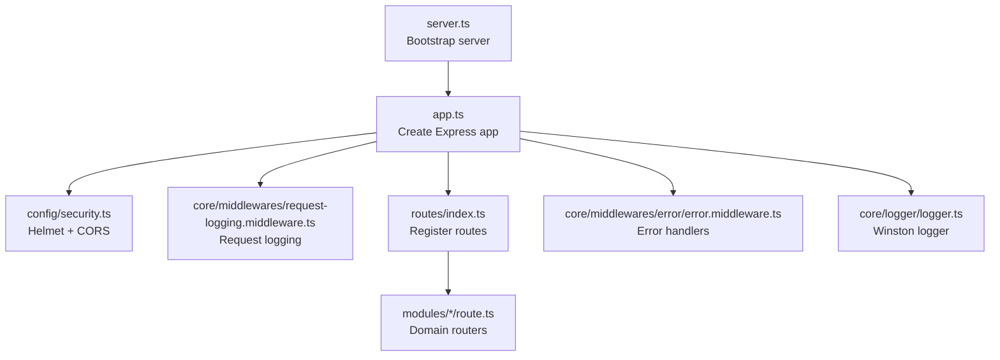
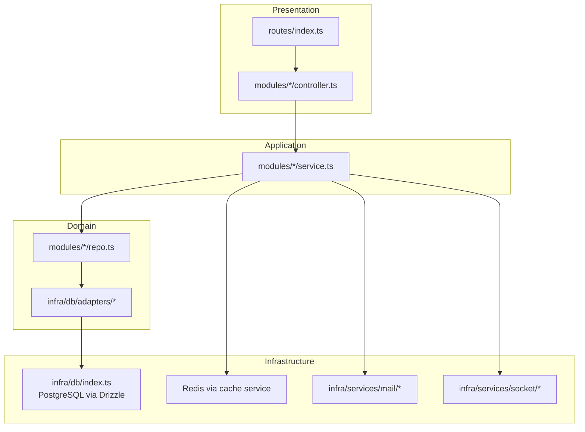
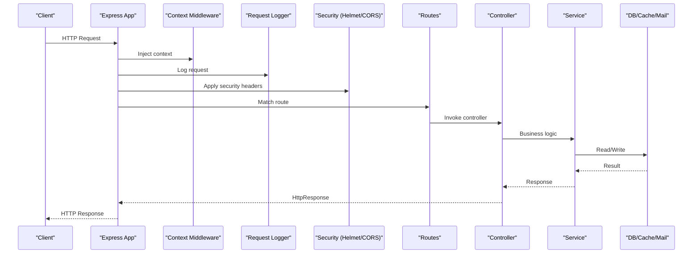
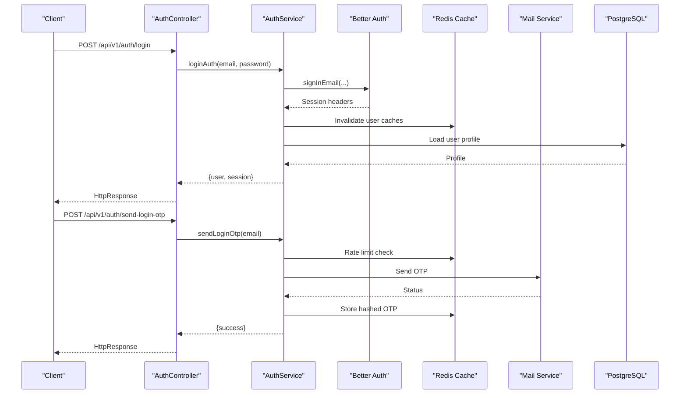
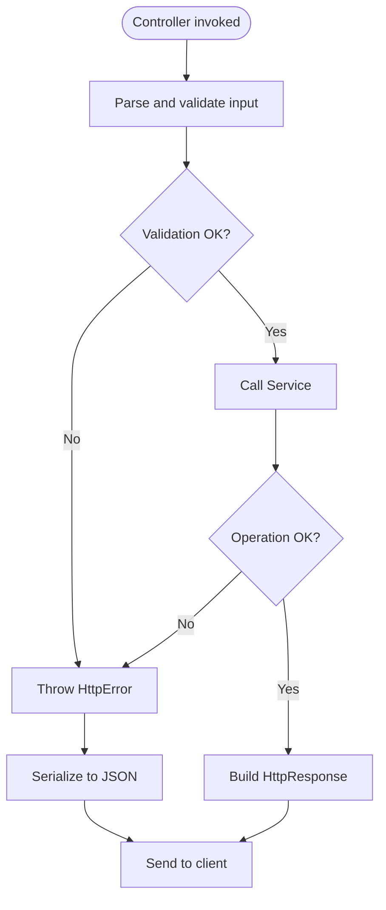
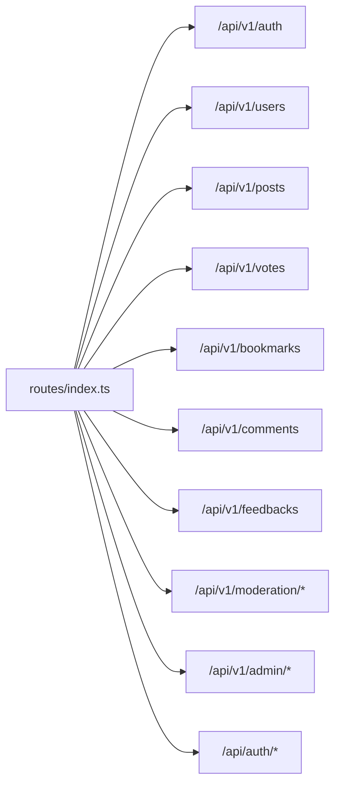
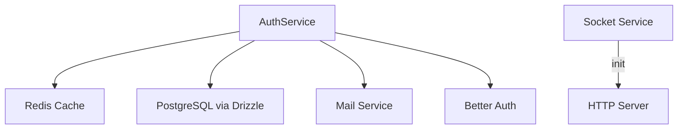
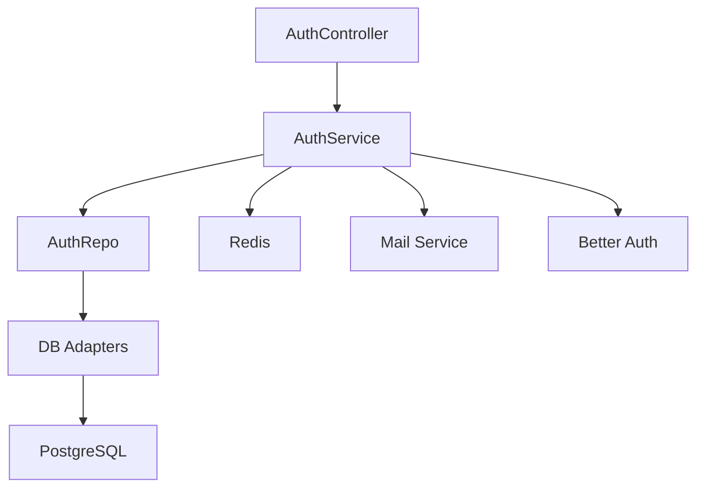

# Backend Architecture

<cite>
**Referenced Files in This Document**
- [server.ts](file://server/src/server.ts)
- [app.ts](file://server/src/app.ts)
- [index.ts](file://server/src/routes/index.ts)
- [controller.ts](file://server/src/core/http/controller.ts)
- [error.ts](file://server/src/core/http/error.ts)
- [logger.ts](file://server/src/core/logger/logger.ts)
- [security.ts](file://server/src/config/security.ts)
- [rbac.ts](file://server/src/core/security/rbac.ts)
- [auth.controller.ts](file://server/src/modules/auth/auth.controller.ts)
- [auth.service.ts](file://server/src/modules/auth/auth.service.ts)
- [auth.repo.ts](file://server/src/modules/auth/auth.repo.ts)
- [db/index.ts](file://server/src/infra/db/index.ts)
- [mail.service.ts](file://server/src/infra/services/mail/core/mail.service.ts)
- [socket/index.ts](file://server/src/infra/services/socket/index.ts)
- [rate-limit.middleware.ts](file://server/src/core/middlewares/rate-limit.middleware.ts)
- [request-logging.middleware.ts](file://server/src/core/middlewares/request-logging.middleware.ts)
- [error.middleware.ts](file://server/src/core/middlewares/error/error.middleware.ts)
- [context.middleware.ts](file://server/src/core/middlewares/context.middleware.ts)
- [inject-user.middleware.ts](file://server/src/core/middlewares/auth/inject-user.middleware.ts)
- [require-auth.middleware.ts](file://server/src/core/middlewares/auth/require-auth.middleware.ts)
- [require-permission.middleware.ts](file://server/src/core/middlewares/auth/require-permission.middleware.ts)
- [require-roles.middleware.ts](file://server/src/core/middlewares/auth/require-roles.middleware.ts)
- [stop-banned-user.middleware.ts](file://server/src/core/middlewares/auth/stop-banned-user.middleware.ts)
- [require-user.middleware.ts](file://server/src/core/middlewares/auth/require-user.middleware.ts)
- [require-terms.middleware.ts](file://server/src/core/middlewares/auth/require-terms.middleware.ts)
- [pipelines.ts](file://server/src/core/middlewares/pipelines.ts)
- [multipart-upload.middleware.ts](file://server/src/core/middlewares/multipart-upload.middleware.ts)
- [health.routes.ts](file://server/src/routes/health.routes.ts)
</cite>

## Table of Contents
1. [Introduction](#introduction)
2. [Project Structure](#project-structure)
3. [Core Components](#core-components)
4. [Architecture Overview](#architecture-overview)
5. [Detailed Component Analysis](#detailed-component-analysis)
6. [Dependency Analysis](#dependency-analysis)
7. [Performance Considerations](#performance-considerations)
8. [Troubleshooting Guide](#troubleshooting-guide)
9. [Conclusion](#conclusion)

## Introduction
This document describes the backend architecture of the Flick platform. It focuses on the Express.js application structure, the layered architecture pattern (controllers, services, repositories), the middleware pipeline, request/response flow, error handling, logging, security (authentication, authorization, rate limiting), and integration points with external systems such as Redis, PostgreSQL, and email providers. The backend is organized into modular business domains (e.g., auth, user, post, moderation, admin) that align with the routing structure.

## Project Structure
The backend is implemented as a TypeScript/Express application bootstrapped in the server directory. The application initializes HTTP server, applies security and logging middleware, registers routes, and wires up domain modules. Routing is centralized and mounts domain-specific routers under API prefixes.

**Diagram sources**
- [server.ts](file://server/src/server.ts#L1-L23)
- [app.ts](file://server/src/app.ts#L1-L33)
- [security.ts](file://server/src/config/security.ts#L1-L14)
- [request-logging.middleware.ts](file://server/src/core/middlewares/request-logging.middleware.ts)
- [index.ts](file://server/src/routes/index.ts#L1-L39)
- [logger.ts](file://server/src/core/logger/logger.ts#L1-L25)

**Section sources**
- [server.ts](file://server/src/server.ts#L1-L23)
- [app.ts](file://server/src/app.ts#L1-L33)
- [index.ts](file://server/src/routes/index.ts#L1-L39)

## Core Components
- Express bootstrap and server lifecycle:
  - The server entry creates the Express app, initializes sockets, sets JSON/URL encoding, cookies, and registers middleware and routes.
- HTTP layer:
  - Controllers enforce a consistent return type via a decorator and handler that ensures HttpResponse instances are returned and sent to clients.
  - Centralized HttpError class encapsulates structured error responses with status codes, error codes, and optional metadata.
- Logging:
  - Winston-based logger configured for development vs production with colored output in dev and stack traces included.
- Security:
  - Helmet hardening, CORS configuration, and RBAC utilities for role-to-permission resolution.
- Middleware pipeline:
  - Context injection, request logging, authentication, authorization, rate limiting, multipart upload, and error handling.

**Section sources**
- [server.ts](file://server/src/server.ts#L1-L23)
- [app.ts](file://server/src/app.ts#L1-L33)
- [controller.ts](file://server/src/core/http/controller.ts#L1-L80)
- [error.ts](file://server/src/core/http/error.ts#L1-L131)
- [logger.ts](file://server/src/core/logger/logger.ts#L1-L25)
- [security.ts](file://server/src/config/security.ts#L1-L14)
- [rbac.ts](file://server/src/core/security/rbac.ts#L1-L15)

## Architecture Overview
The backend follows a layered architecture:
- Presentation Layer: Express routes and controllers
- Application Layer: Services orchestrate business logic
- Domain Layer: Repositories abstract persistence
- Infrastructure Layer: DB, cache, mail, and socket integrations

**Diagram sources**
- [index.ts](file://server/src/routes/index.ts#L1-L39)
- [auth.controller.ts](file://server/src/modules/auth/auth.controller.ts#L1-L236)
- [auth.service.ts](file://server/src/modules/auth/auth.service.ts#L1-L885)
- [auth.repo.ts](file://server/src/modules/auth/auth.repo.ts#L1-L50)
- [db/index.ts](file://server/src/infra/db/index.ts#L1-L38)
- [mail.service.ts](file://server/src/infra/services/mail/core/mail.service.ts)
- [socket/index.ts](file://server/src/infra/services/socket/index.ts)

## Detailed Component Analysis

### Express Application Bootstrap and Middleware Pipeline
- Bootstrap:
  - server.ts initializes the HTTP server and logs startup.
  - app.ts configures Express, cookies, static files, security, logging, and routes.
- Middleware order and responsibilities:
  - Context middleware: enriches requests with runtime context.
  - Request logging: records request metadata.
  - Security: Helmet and CORS applied globally.
  - Routes: mounted under /api/v1/* and special auth passthrough.
  - Error handlers: 404 and general error middleware registered last.

**Diagram sources**
- [server.ts](file://server/src/server.ts#L1-L23)
- [app.ts](file://server/src/app.ts#L1-L33)
- [context.middleware.ts](file://server/src/core/middlewares/context.middleware.ts)
- [request-logging.middleware.ts](file://server/src/core/middlewares/request-logging.middleware.ts)
- [security.ts](file://server/src/config/security.ts#L1-L14)
- [index.ts](file://server/src/routes/index.ts#L1-L39)
- [controller.ts](file://server/src/core/http/controller.ts#L1-L80)
- [auth.service.ts](file://server/src/modules/auth/auth.service.ts#L1-L885)
- [db/index.ts](file://server/src/infra/db/index.ts#L1-L38)

**Section sources**
- [server.ts](file://server/src/server.ts#L1-L23)
- [app.ts](file://server/src/app.ts#L1-L33)
- [index.ts](file://server/src/routes/index.ts#L1-L39)

### Authentication and Authorization Layer
- Authentication:
  - Uses Better Auth for session management, sign-up/sign-in, password reset, and OAuth callbacks.
  - OTP flows for initialization and login are integrated with Redis-backed caching and email provider.
- Authorization:
  - Role-based permission extraction utility computes effective permissions for a user’s roles.
  - Middleware guards enforce authentication, roles, permissions, terms acceptance, and banned user checks.

**Diagram sources**
- [auth.controller.ts](file://server/src/modules/auth/auth.controller.ts#L1-L236)
- [auth.service.ts](file://server/src/modules/auth/auth.service.ts#L1-L885)
- [rbac.ts](file://server/src/core/security/rbac.ts#L1-L15)
- [inject-user.middleware.ts](file://server/src/core/middlewares/auth/inject-user.middleware.ts)
- [require-auth.middleware.ts](file://server/src/core/middlewares/auth/require-auth.middleware.ts)
- [require-permission.middleware.ts](file://server/src/core/middlewares/auth/require-permission.middleware.ts)
- [require-roles.middleware.ts](file://server/src/core/middlewares/auth/require-roles.middleware.ts)
- [stop-banned-user.middleware.ts](file://server/src/core/middlewares/auth/stop-banned-user.middleware.ts)
- [require-user.middleware.ts](file://server/src/core/middlewares/auth/require-user.middleware.ts)
- [require-terms.middleware.ts](file://server/src/core/middlewares/auth/require-terms.middleware.ts)

**Section sources**
- [auth.controller.ts](file://server/src/modules/auth/auth.controller.ts#L1-L236)
- [auth.service.ts](file://server/src/modules/auth/auth.service.ts#L1-L885)
- [auth.repo.ts](file://server/src/modules/auth/auth.repo.ts#L1-L50)
- [rbac.ts](file://server/src/core/security/rbac.ts#L1-L15)

### Request/Response Flow and Error Handling
- Controllers:
  - Enforce HttpResponse return type via decorator and handler to prevent inconsistent responses.
- Services:
  - Perform business logic, interact with repositories, cache, DB, and external services.
  - Throw HttpError with structured metadata for client-friendly error payloads.
- Error middleware:
  - Converts HttpError to standardized JSON responses and handles non-HTTP exceptions.

**Diagram sources**
- [controller.ts](file://server/src/core/http/controller.ts#L1-L80)
- [error.ts](file://server/src/core/http/error.ts#L1-L131)
- [error.middleware.ts](file://server/src/core/middlewares/error/error.middleware.ts)

**Section sources**
- [controller.ts](file://server/src/core/http/controller.ts#L1-L80)
- [error.ts](file://server/src/core/http/error.ts#L1-L131)

### Logging System
- Winston logger:
  - Configured with timestamps, colored output in development, stack traces, and console transport.
  - Used across services for warnings, errors, and audit events.

**Section sources**
- [logger.ts](file://server/src/core/logger/logger.ts#L1-L25)
- [auth.service.ts](file://server/src/modules/auth/auth.service.ts#L1-L885)

### Security Architecture
- Transport and HTTP hardening:
  - Helmet and trusted proxy settings applied globally.
  - CORS configured via centralized options.
- Authentication:
  - Better Auth manages sessions, cookies, and OAuth.
  - OTP flows validated against cached tokens and rate-limited.
- Authorization:
  - RBAC resolves permissions from roles; middleware enforces roles and permissions.
- Rate limiting:
  - Dedicated middleware module provides rate-limit enforcement.

**Section sources**
- [security.ts](file://server/src/config/security.ts#L1-L14)
- [rbac.ts](file://server/src/core/security/rbac.ts#L1-L15)
- [rate-limit.middleware.ts](file://server/src/core/middlewares/rate-limit.middleware.ts)

### Modular Design and Domain Modules
- Routing:
  - Central route registry mounts domain routers under /api/v1/* and exposes Better Auth passthrough.
- Examples:
  - Auth module: controllers, services, repositories, schemas, and cache keys.
  - Other modules (user, post, vote, bookmark, comment, feedback, moderation, admin) follow the same pattern.

**Diagram sources**
- [index.ts](file://server/src/routes/index.ts#L1-L39)

**Section sources**
- [index.ts](file://server/src/routes/index.ts#L1-L39)

### Data Flow Patterns and Integrations
- Database:
  - Drizzle ORM connects to PostgreSQL; schema includes tables for auth, users, posts, comments, votes, bookmarks, feedbacks, notifications, audit logs, colleges, branches, and college requests.
- Cache:
  - Redis-backed cache used for OTP, pending signups, user profiles, and session data.
- Email:
  - Mail service abstraction integrates with external providers for OTP delivery.
- Socket:
  - Socket service initialization on server startup.

**Diagram sources**
- [auth.service.ts](file://server/src/modules/auth/auth.service.ts#L1-L885)
- [db/index.ts](file://server/src/infra/db/index.ts#L1-L38)
- [mail.service.ts](file://server/src/infra/services/mail/core/mail.service.ts)
- [socket/index.ts](file://server/src/infra/services/socket/index.ts)

**Section sources**
- [db/index.ts](file://server/src/infra/db/index.ts#L1-L38)
- [auth.service.ts](file://server/src/modules/auth/auth.service.ts#L1-L885)

## Dependency Analysis
- Internal dependencies:
  - Controllers depend on Services.
  - Services depend on Repositories and Infra (DB, Cache, Mail).
  - Repositories depend on DB adapters.
- External dependencies:
  - Express, Helmet, CORS, Drizzle, Better Auth, Winston, Redis, and mail provider SDKs.
- Coupling:
  - Modules are loosely coupled via clear boundaries (controller -> service -> repo -> adapter -> DB).
  - Middleware composition enables cross-cutting concerns without tight coupling.

**Diagram sources**
- [auth.controller.ts](file://server/src/modules/auth/auth.controller.ts#L1-L236)
- [auth.service.ts](file://server/src/modules/auth/auth.service.ts#L1-L885)
- [auth.repo.ts](file://server/src/modules/auth/auth.repo.ts#L1-L50)
- [db/index.ts](file://server/src/infra/db/index.ts#L1-L38)

**Section sources**
- [auth.controller.ts](file://server/src/modules/auth/auth.controller.ts#L1-L236)
- [auth.service.ts](file://server/src/modules/auth/auth.service.ts#L1-L885)
- [auth.repo.ts](file://server/src/modules/auth/auth.repo.ts#L1-L50)
- [db/index.ts](file://server/src/infra/db/index.ts#L1-L38)

## Performance Considerations
- Caching:
  - Use Redis for OTP, pending signups, and user profiles to reduce DB load and latency.
- DB:
  - Prefer indexed lookups and batched operations where applicable; leverage Drizzle’s query builder for correctness and performance.
- Logging:
  - Keep log levels appropriate to environment; avoid excessive debug logs in production.
- Middleware:
  - Place fast-fail middleware early (e.g., rate limiting) to minimize downstream work.

## Troubleshooting Guide
- Startup failures:
  - Check server bootstrap logs and error event handling.
- Authentication issues:
  - Verify Better Auth configuration, session cookies, and OTP cache TTLs.
- Database connectivity:
  - Confirm DATABASE_URL and Drizzle schema registration.
- Logging:
  - Ensure Winston transports and format match environment expectations.
- Health checks:
  - Use health routes to validate service readiness.

**Section sources**
- [server.ts](file://server/src/server.ts#L1-L23)
- [auth.service.ts](file://server/src/modules/auth/auth.service.ts#L1-L885)
- [db/index.ts](file://server/src/infra/db/index.ts#L1-L38)
- [logger.ts](file://server/src/core/logger/logger.ts#L1-L25)
- [health.routes.ts](file://server/src/routes/health.routes.ts)

## Conclusion
The Flick backend employs a clean, layered architecture with explicit separation of concerns. Express serves as the presentation layer, controllers enforce consistent responses, services encapsulate business logic, and repositories abstract persistence. Security is enforced via Helmet, CORS, RBAC, and middleware guards. Redis, PostgreSQL, and email providers integrate seamlessly through dedicated infrastructure services. The modular routing structure supports scalable growth across business domains while maintaining a cohesive middleware pipeline for logging, rate limiting, and error handling.