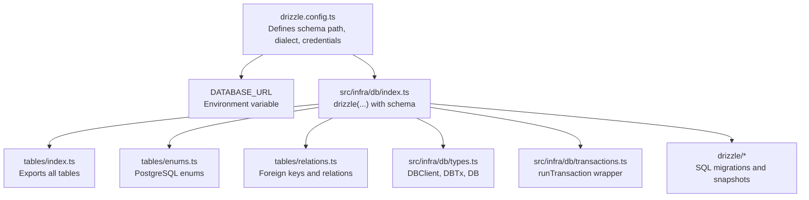
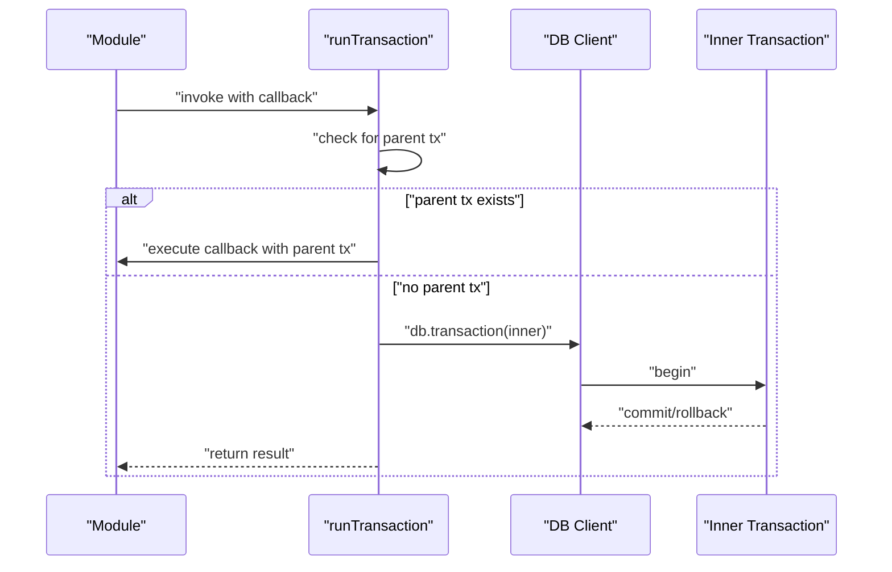
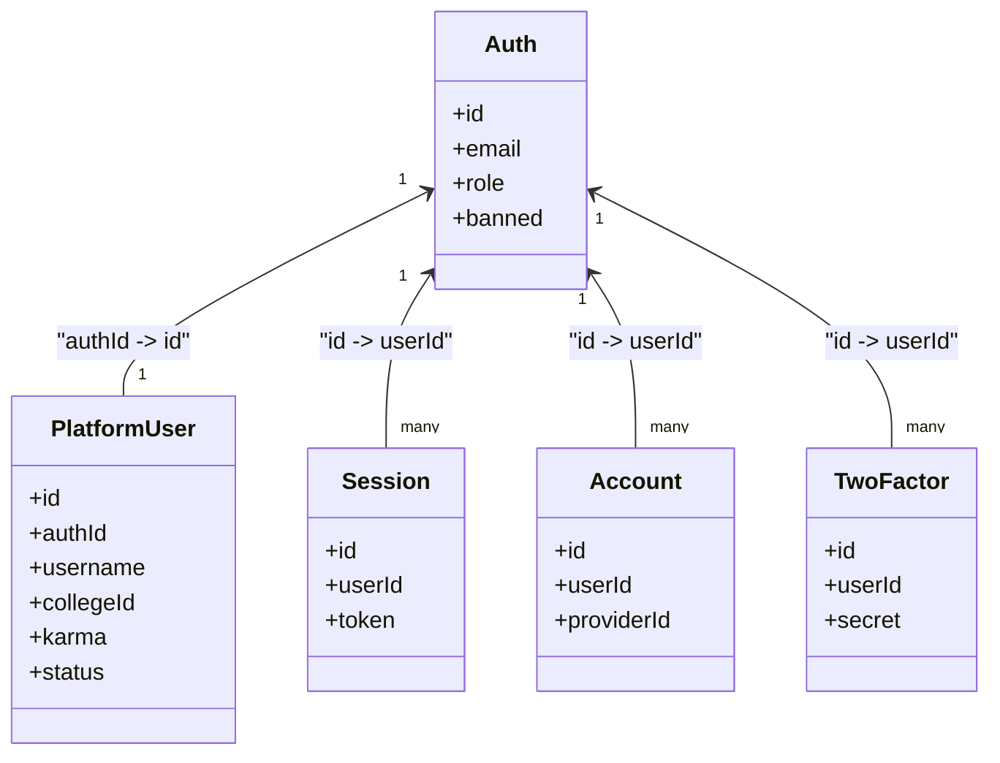
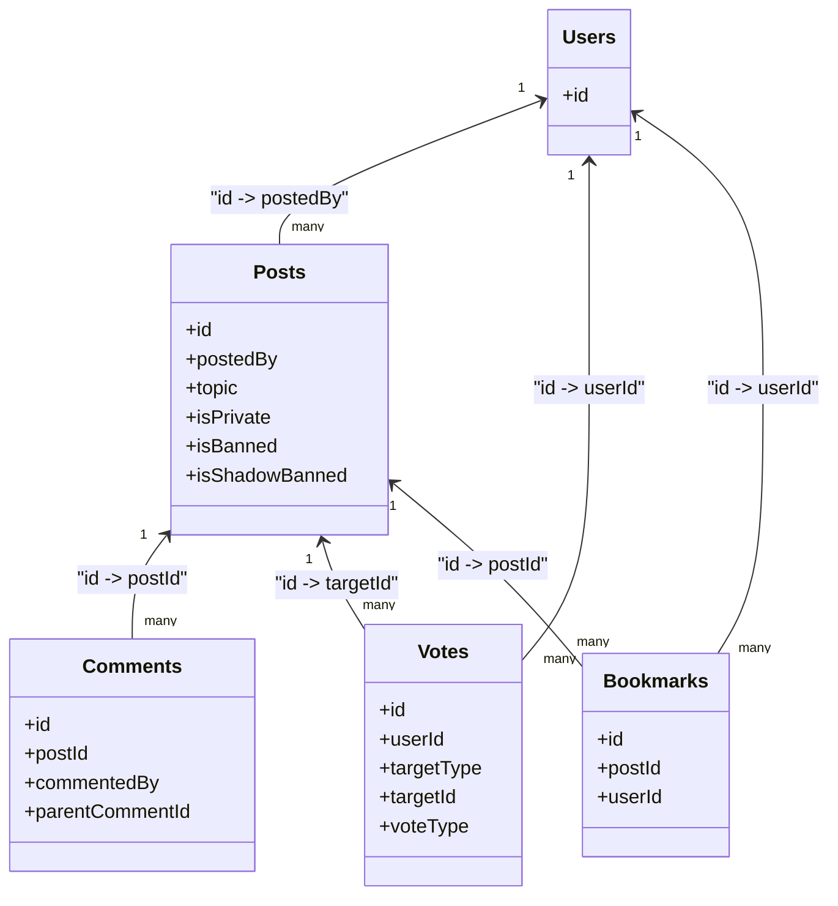
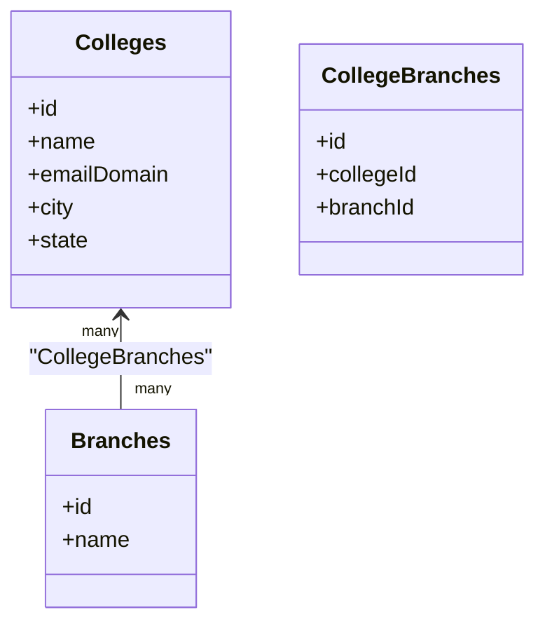
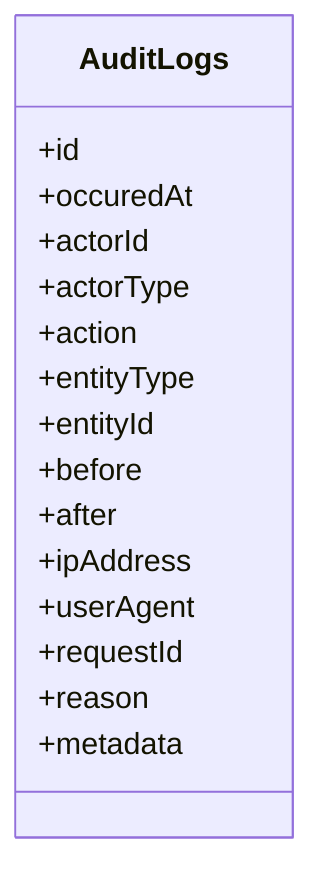
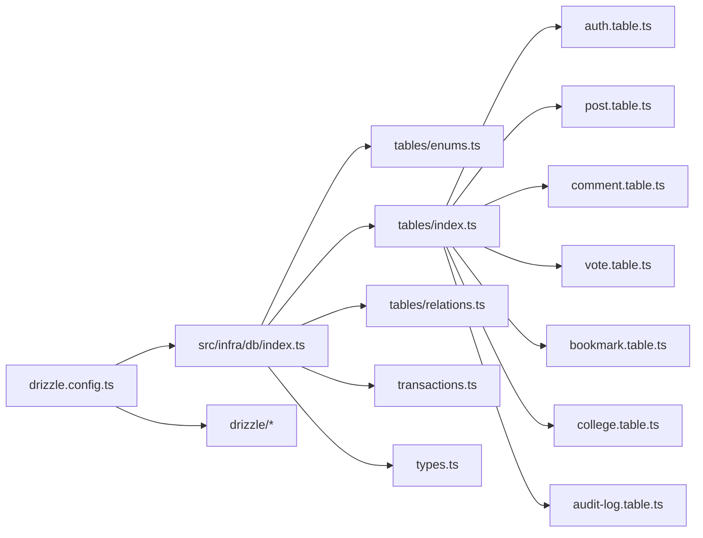
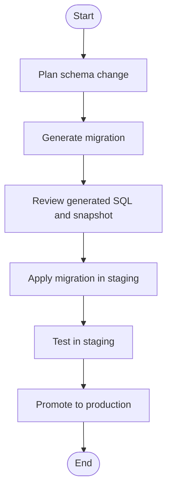

# Database Integration

<cite>
**Referenced Files in This Document**
- [drizzle.config.ts](file://server/drizzle.config.ts)
- [db index](file://server/src/infra/db/index.ts)
- [db types](file://server/src/infra/db/types.ts)
- [transactions](file://server/src/infra/db/transactions.ts)
- [tables index](file://server/src/infra/db/tables/index.ts)
- [relations](file://server/src/infra/db/tables/relations.ts)
- [enums](file://server/src/infra/db/tables/enums.ts)
- [auth table](file://server/src/infra/db/tables/auth.table.ts)
- [post table](file://server/src/infra/db/tables/post.table.ts)
- [comment table](file://server/src/infra/db/tables/comment.table.ts)
- [vote table](file://server/src/infra/db/tables/vote.table.ts)
- [bookmark table](file://server/src/infra/db/tables/bookmark.table.ts)
- [college table](file://server/src/infra/db/tables/college.table.ts)
- [audit log table](file://server/src/infra/db/tables/audit-log.table.ts)
- [migration 0000](file://server/drizzle/0000_loose_edwin_jarvis.sql)
- [migration 0001](file://server/drizzle/0001_flat_mathemanic.sql)
- [migration 0002](file://server/drizzle/0002_perfect_drax.sql)
- [migration 0003](file://server/drizzle/0003_flat_reptil.sql)
- [migration 0004](file://server/drizzle/0004_brisk_harrier.sql)
- [migration 0005](file://server/drizzle/0005_superb_ken_ellis.sql)
- [snapshot 0000](file://server/drizzle/meta/0000_snapshot.json)
- [snapshot 0001](file://server/drizzle/meta/0001_snapshot.json)
- [snapshot 0002](file://server/drizzle/meta/0002_snapshot.json)
- [snapshot 0003](file://server/drizzle/meta/0003_snapshot.json)
- [snapshot 0005](file://server/drizzle/meta/0005_snapshot.json)
- [_journal snapshot](file://server/drizzle/meta/_journal.json)
</cite>

## Table of Contents
1. [Introduction](#introduction)
2. [Project Structure](#project-structure)
3. [Core Components](#core-components)
4. [Architecture Overview](#architecture-overview)
5. [Detailed Component Analysis](#detailed-component-analysis)
6. [Dependency Analysis](#dependency-analysis)
7. [Performance Considerations](#performance-considerations)
8. [Troubleshooting Guide](#troubleshooting-guide)
9. [Conclusion](#conclusion)
10. [Appendices](#appendices)

## Introduction
This document explains the database integration architecture of the project, focusing on Drizzle ORM configuration, the migration system, and database connection management. It documents table definitions, relationships, and indexing strategy, and details transaction handling, connection pooling, and performance optimization. Practical examples of schema changes, migration workflows, and database administration tasks are included, along with security, backup, and monitoring recommendations.

## Project Structure
The database layer is organized under the server module with:
- Drizzle configuration for schema discovery and credentials
- A centralized database client initialization with schema mapping
- Strongly-typed transaction utilities
- Modular table definitions with enums and relations
- Migrations stored as SQL files with JSON snapshots

```mermaid
graph TB
subgraph "Drizzle Config"
DCFG["drizzle.config.ts"]
end
subgraph "DB Client"
DBIDX["src/infra/db/index.ts"]
DBTYPES["src/infra/db/types.ts"]
TX["src/infra/db/transactions.ts"]
end
subgraph "Tables"
TIDX["src/infra/db/tables/index.ts"]
ENUMS["src/infra/db/tables/enums.ts"]
RELS["src/infra/db/tables/relations.ts"]
AUTH["src/infra/db/tables/auth.table.ts"]
POST["src/infra/db/tables/post.table.ts"]
COMMENT["src/infra/db/tables/comment.table.ts"]
VOTE["src/infra/db/tables/vote.table.ts"]
BOOK["src/infra/db/tables/bookmark.table.ts"]
COLLEGE["src/infra/db/tables/college.table.ts"]
AUDIT["src/infra/db/tables/audit-log.table.ts"]
end
subgraph "Migrations"
MIG0000["drizzle/0000_loose_edwin_jarvis.sql"]
MIG0001["drizzle/0001_flat_mathemanic.sql"]
MIG0002["drizzle/0002_perfect_drax.sql"]
MIG0003["drizzle/0003_flat_reptil.sql"]
MIG0004["drizzle/0004_brisk_harrier.sql"]
MIG0005["drizzle/0005_superb_ken_ellis.sql"]
SNAP0000["drizzle/meta/0000_snapshot.json"]
SNAP0001["drizzle/meta/0001_snapshot.json"]
SNAP0002["drizzle/meta/0002_snapshot.json"]
SNAP0003["drizzle/meta/0003_snapshot.json"]
SNAP0005["drizzle/meta/0005_snapshot.json"]
JOURNAL["_journal.json"]
end
DCFG --> DBIDX
DBIDX --> TIDX
TIDX --> AUTH
TIDX --> POST
TIDX --> COMMENT
TIDX --> VOTE
TIDX --> BOOK
TIDX --> COLLEGE
TIDX --> AUDIT
DBIDX --> ENUMS
DBIDX --> RELS
DBIDX --> TX
DCFG --> MIG0000
DCFG --> MIG0001
DCFG --> MIG0002
DCFG --> MIG0003
DCFG --> MIG0004
DCFG --> MIG0005
DCFG --> SNAP0000
DCFG --> SNAP0001
DCFG --> SNAP0002
DCFG --> SNAP0003
DCFG --> SNAP0005
DCFG --> JOURNAL
```

**Diagram sources**
- [drizzle.config.ts](file://server/drizzle.config.ts#L1-L14)
- [db index](file://server/src/infra/db/index.ts#L1-L40)
- [db types](file://server/src/infra/db/types.ts#L1-L11)
- [transactions](file://server/src/infra/db/transactions.ts#L1-L20)
- [tables index](file://server/src/infra/db/tables/index.ts#L1-L23)
- [relations](file://server/src/infra/db/tables/relations.ts#L1-L100)
- [enums](file://server/src/infra/db/tables/enums.ts#L1-L51)
- [auth table](file://server/src/infra/db/tables/auth.table.ts#L1-L187)
- [post table](file://server/src/infra/db/tables/post.table.ts#L1-L39)
- [comment table](file://server/src/infra/db/tables/comment.table.ts#L1-L22)
- [vote table](file://server/src/infra/db/tables/vote.table.ts#L1-L33)
- [bookmark table](file://server/src/infra/db/tables/bookmark.table.ts#L1-L19)
- [college table](file://server/src/infra/db/tables/college.table.ts#L1-L24)
- [audit log table](file://server/src/infra/db/tables/audit-log.table.ts#L1-L76)
- [migration 0000](file://server/drizzle/0000_loose_edwin_jarvis.sql)
- [migration 0001](file://server/drizzle/0001_flat_mathemanic.sql)
- [migration 0002](file://server/drizzle/0002_perfect_drax.sql)
- [migration 0003](file://server/drizzle/0003_flat_reptil.sql)
- [migration 0004](file://server/drizzle/0004_brisk_harrier.sql)
- [migration 0005](file://server/drizzle/0005_superb_ken_ellis.sql)
- [snapshot 0000](file://server/drizzle/meta/0000_snapshot.json)
- [snapshot 0001](file://server/drizzle/meta/0001_snapshot.json)
- [snapshot 0002](file://server/drizzle/meta/0002_snapshot.json)
- [snapshot 0003](file://server/drizzle/meta/0003_snapshot.json)
- [snapshot 0005](file://server/drizzle/meta/0005_snapshot.json)
- [_journal snapshot](file://server/drizzle/meta/_journal.json)

**Section sources**
- [drizzle.config.ts](file://server/drizzle.config.ts#L1-L14)
- [db index](file://server/src/infra/db/index.ts#L1-L40)
- [db types](file://server/src/infra/db/types.ts#L1-L11)
- [transactions](file://server/src/infra/db/transactions.ts#L1-L20)
- [tables index](file://server/src/infra/db/tables/index.ts#L1-L23)
- [relations](file://server/src/infra/db/tables/relations.ts#L1-L100)
- [enums](file://server/src/infra/db/tables/enums.ts#L1-L51)

## Core Components
- Drizzle configuration: Defines schema discovery, dialect, credentials, and strictness.
- Database client: Initializes Drizzle with PostgreSQL dialect and exposes a typed schema-bound client.
- Transaction utilities: Provides a wrapper to reuse parent transactions or create managed inner transactions.
- Types: Exposes DBClient, DBTx, and DB union types for consistent typing across modules.
- Tables and relations: Centralized exports of all tables and their relations.
- Enums: Shared PostgreSQL enums for domain-specific constrained values.
- Migrations: SQL migrations and JSON snapshots maintained by Drizzle Kit.

**Section sources**
- [drizzle.config.ts](file://server/drizzle.config.ts#L1-L14)
- [db index](file://server/src/infra/db/index.ts#L1-L40)
- [db types](file://server/src/infra/db/types.ts#L1-L11)
- [transactions](file://server/src/infra/db/transactions.ts#L1-L20)
- [tables index](file://server/src/infra/db/tables/index.ts#L1-L23)
- [enums](file://server/src/infra/db/tables/enums.ts#L1-L51)

## Architecture Overview
The database architecture follows a schema-driven design with Drizzle ORM:
- Configuration drives schema discovery and credential loading.
- The client binds the schema and exposes a strongly-typed API.
- Modules import the client and use it for queries and transactions.
- Relations define foreign keys and named relation sets for joins.
- Migrations evolve the schema while maintaining snapshots.

**Diagram sources**
- [drizzle.config.ts](file://server/drizzle.config.ts#L1-L14)
- [db index](file://server/src/infra/db/index.ts#L1-L40)
- [db types](file://server/src/infra/db/types.ts#L1-L11)
- [transactions](file://server/src/infra/db/transactions.ts#L1-L20)
- [tables index](file://server/src/infra/db/tables/index.ts#L1-L23)
- [enums](file://server/src/infra/db/tables/enums.ts#L1-L51)
- [relations](file://server/src/infra/db/tables/relations.ts#L1-L100)
- [migration 0000](file://server/drizzle/0000_loose_edwin_jarvis.sql)
- [snapshot 0000](file://server/drizzle/meta/0000_snapshot.json)

## Detailed Component Analysis

### Drizzle ORM Configuration
- Schema discovery targets TypeScript table definitions under the tables directory.
- Dialect is PostgreSQL; credentials are loaded from DATABASE_URL.
- Strict mode and verbose logging enable robust development and CI workflows.

**Section sources**
- [drizzle.config.ts](file://server/drizzle.config.ts#L1-L14)

### Database Client Initialization
- The client is initialized with DATABASE_URL and a schema object containing all tables.
- This ensures type-safe queries and automatic join inference via relations.

**Section sources**
- [db index](file://server/src/infra/db/index.ts#L1-L40)

### Transaction Handling
- The runTransaction utility detects an existing transaction context and either reuses it or creates a managed inner transaction.
- This pattern prevents nested transaction errors and supports composability across modules.

**Diagram sources**
- [transactions](file://server/src/infra/db/transactions.ts#L1-L20)
- [db index](file://server/src/infra/db/index.ts#L1-L40)

**Section sources**
- [transactions](file://server/src/infra/db/transactions.ts#L1-L20)
- [db types](file://server/src/infra/db/types.ts#L1-L11)

### Table Definitions and Relationships

#### Authentication and User Tables
- Auth table stores identity and security fields.
- Platform user links to auth via unique foreign key and includes profile and college association.
- Session, account, and two-factor tables support authentication flows.
- Relations define one-to-one and one-to-many associations.

**Diagram sources**
- [auth table](file://server/src/infra/db/tables/auth.table.ts#L1-L187)

**Section sources**
- [auth table](file://server/src/infra/db/tables/auth.table.ts#L1-L187)

#### Posts, Comments, Votes, and Bookmarks
- Posts belong to users, include visibility and topic fields, and have indexes for efficient filtering.
- Comments reference posts and optionally parent comments, with cascading deletes.
- Votes enforce uniqueness per user-target combination and include target-type routing.
- Bookmarks link users and posts with composite indexing.

**Diagram sources**
- [post table](file://server/src/infra/db/tables/post.table.ts#L1-L39)
- [comment table](file://server/src/infra/db/tables/comment.table.ts#L1-L22)
- [vote table](file://server/src/infra/db/tables/vote.table.ts#L1-L33)
- [bookmark table](file://server/src/infra/db/tables/bookmark.table.ts#L1-L19)
- [auth table](file://server/src/infra/db/tables/auth.table.ts#L1-L187)

**Section sources**
- [post table](file://server/src/infra/db/tables/post.table.ts#L1-L39)
- [comment table](file://server/src/infra/db/tables/comment.table.ts#L1-L22)
- [vote table](file://server/src/infra/db/tables/vote.table.ts#L1-L33)
- [bookmark table](file://server/src/infra/db/tables/bookmark.table.ts#L1-L19)

#### Colleges and Many-to-Many Relationship
- Colleges table includes indexed fields for name, email domain, and city/state.
- A junction table connects colleges and branches; relations define many-to-many.

**Diagram sources**
- [college table](file://server/src/infra/db/tables/college.table.ts#L1-L24)
- [relations](file://server/src/infra/db/tables/relations.ts#L76-L99)

**Section sources**
- [college table](file://server/src/infra/db/tables/college.table.ts#L1-L24)
- [relations](file://server/src/infra/db/tables/relations.ts#L76-L99)

#### Audit Logs
- Audit log table captures actor, action, entity, and change payloads with timezone-aware timestamps and IP/user-agent.
- Indexes optimize lookups by entity, actor, and time.

**Diagram sources**
- [audit log table](file://server/src/infra/db/tables/audit-log.table.ts#L1-L76)

**Section sources**
- [audit log table](file://server/src/infra/db/tables/audit-log.table.ts#L1-L76)

### Indexing Strategy
- Visibility and feed ordering: Composite index on posts for ban/shadow-ban and descending creation time.
- Session and account lookup: Indexes on user identifiers for fast auth queries.
- Verification tokens: Identifier index for OTP and verification flows.
- Two-factor secrets: Multi-column indexes for secret and user lookup.
- Bookmark deduplication: Composite index on user and post.
- Vote uniqueness: Unique index on user-target triple with target-type routing.
- Audit log performance: Entity, actor, and timestamp indexes.

**Section sources**
- [post table](file://server/src/infra/db/tables/post.table.ts#L31-L37)
- [auth table](file://server/src/infra/db/tables/auth.table.ts#L70-L88)
- [auth table](file://server/src/infra/db/tables/auth.table.ts#L90-L112)
- [auth table](file://server/src/infra/db/tables/auth.table.ts#L114-L128)
- [auth table](file://server/src/infra/db/tables/auth.table.ts#L130-L144)
- [bookmark table](file://server/src/infra/db/tables/bookmark.table.ts#L17-L18)
- [vote table](file://server/src/infra/db/tables/vote.table.ts#L21-L29)
- [audit log table](file://server/src/infra/db/tables/audit-log.table.ts#L67-L72)

### Enumerations
- Auth types, audit roles, platforms, statuses, and actions.
- Notification types, user status, topics, vote types, and moderation severity.
- Enums centralize domain constraints and improve maintainability.

**Section sources**
- [enums](file://server/src/infra/db/tables/enums.ts#L1-L51)

## Dependency Analysis
The database layer exhibits low coupling and high cohesion:
- Configuration depends on environment variables.
- Client depends on tables and enums; relations depend on tables.
- Transactions depend on the client and types.
- Migrations depend on configuration and snapshots.

**Diagram sources**
- [drizzle.config.ts](file://server/drizzle.config.ts#L1-L14)
- [db index](file://server/src/infra/db/index.ts#L1-L40)
- [db types](file://server/src/infra/db/types.ts#L1-L11)
- [transactions](file://server/src/infra/db/transactions.ts#L1-L20)
- [tables index](file://server/src/infra/db/tables/index.ts#L1-L23)
- [relations](file://server/src/infra/db/tables/relations.ts#L1-L100)
- [enums](file://server/src/infra/db/tables/enums.ts#L1-L51)
- [auth table](file://server/src/infra/db/tables/auth.table.ts#L1-L187)
- [post table](file://server/src/infra/db/tables/post.table.ts#L1-L39)
- [comment table](file://server/src/infra/db/tables/comment.table.ts#L1-L22)
- [vote table](file://server/src/infra/db/tables/vote.table.ts#L1-L33)
- [bookmark table](file://server/src/infra/db/tables/bookmark.table.ts#L1-L19)
- [college table](file://server/src/infra/db/tables/college.table.ts#L1-L24)
- [audit log table](file://server/src/infra/db/tables/audit-log.table.ts#L1-L76)
- [migration 0000](file://server/drizzle/0000_loose_edwin_jarvis.sql)
- [snapshot 0000](file://server/drizzle/meta/0000_snapshot.json)

**Section sources**
- [db index](file://server/src/infra/db/index.ts#L1-L40)
- [relations](file://server/src/infra/db/tables/relations.ts#L1-L100)

## Performance Considerations
- Use composite indexes for frequent filter/order combinations (e.g., posts visibility and creation time).
- Enforce uniqueness where appropriate (e.g., votes per user-target) to avoid duplicates and simplify queries.
- Prefer targeted queries with indexes on foreign keys (e.g., session and account lookups).
- Keep audit payloads minimal; leverage indexes for time-series analytics.
- Avoid N+1 queries by leveraging relations and preloading related records.

[No sources needed since this section provides general guidance]

## Troubleshooting Guide
- Migration drift: Compare current schema with snapshots; regenerate migrations if needed.
- Transaction errors: Ensure runTransaction is used consistently; avoid manual begin/commit.
- Type errors: Verify DBClient/DBTx usage and that tables are exported via tables/index.ts.
- Connection issues: Confirm DATABASE_URL and environment loading.

**Section sources**
- [transactions](file://server/src/infra/db/transactions.ts#L1-L20)
- [db types](file://server/src/infra/db/types.ts#L1-L11)
- [tables index](file://server/src/infra/db/tables/index.ts#L1-L23)

## Conclusion
The database integration leverages Drizzle ORM for a type-safe, schema-driven design. The configuration, client initialization, and transaction utilities provide a robust foundation. Carefully designed tables, relations, and indexes support performance and maintainability. The migration system with SQL files and snapshots enables controlled evolution of the schema.

[No sources needed since this section summarizes without analyzing specific files]

## Appendices

### Migration Workflow
- Generate a new migration: Use Drizzle Kit to create a new migration file and snapshot.
- Apply migrations: Run the migration process in your deployment pipeline.
- Rollback strategy: Use Drizzle Kit’s rollback commands to revert to a previous snapshot.

**Section sources**
- [drizzle.config.ts](file://server/drizzle.config.ts#L1-L14)
- [migration 0000](file://server/drizzle/0000_loose_edwin_jarvis.sql)
- [migration 0001](file://server/drizzle/0001_flat_mathemanic.sql)
- [migration 0002](file://server/drizzle/0002_perfect_drax.sql)
- [migration 0003](file://server/drizzle/0003_flat_reptil.sql)
- [migration 0004](file://server/drizzle/0004_brisk_harrier.sql)
- [migration 0005](file://server/drizzle/0005_superb_ken_ellis.sql)
- [snapshot 0000](file://server/drizzle/meta/0000_snapshot.json)
- [snapshot 0001](file://server/drizzle/meta/0001_snapshot.json)
- [snapshot 0002](file://server/drizzle/meta/0002_snapshot.json)
- [snapshot 0003](file://server/drizzle/meta/0003_snapshot.json)
- [snapshot 0005](file://server/drizzle/meta/0005_snapshot.json)
- [_journal snapshot](file://server/drizzle/meta/_journal.json)

### Practical Examples

- Add a new column to posts:
  - Define the column in the posts table definition.
  - Add an index if needed for performance.
  - Generate and apply a migration.

- Introduce a new domain enum:
  - Add the enum in enums.ts.
  - Reference it in the relevant table(s).
  - Generate and apply a migration.

- Enforce referential integrity:
  - Use relations to define foreign keys.
  - Add indexes on foreign key columns for lookup performance.

- Optimize audit log queries:
  - Use indexes on entity_type and entity_id.
  - Filter by occurred_at for time-series reporting.

**Section sources**
- [post table](file://server/src/infra/db/tables/post.table.ts#L1-L39)
- [enums](file://server/src/infra/db/tables/enums.ts#L1-L51)
- [audit log table](file://server/src/infra/db/tables/audit-log.table.ts#L1-L76)

### Security, Backup, and Monitoring
- Security:
  - Store DATABASE_URL in environment variables; never commit secrets.
  - Use least-privilege database users for application and migration roles.
  - Enable SSL connections to the database.
  - Regularly rotate secrets and tokens.

- Backup:
  - Schedule regular logical backups of the PostgreSQL database.
  - Validate restore procedures periodically.

- Monitoring:
  - Track slow queries and long-running transactions.
  - Monitor index usage and missing indexes.
  - Observe migration application logs and snapshot integrity.

[No sources needed since this section provides general guidance]