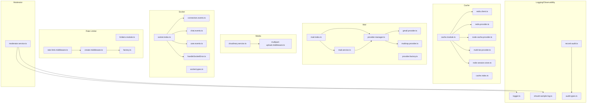
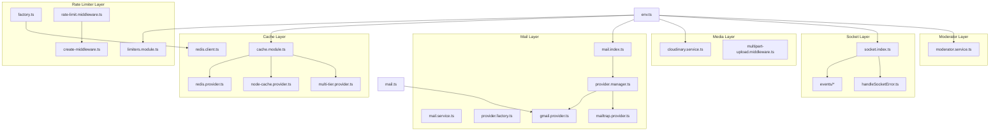
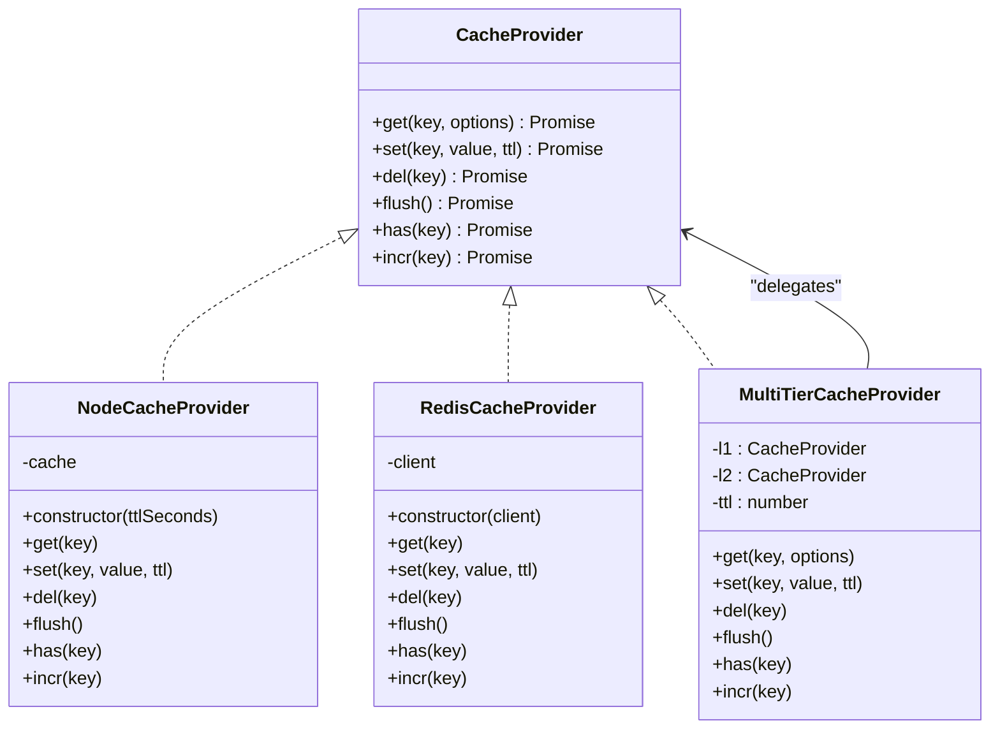
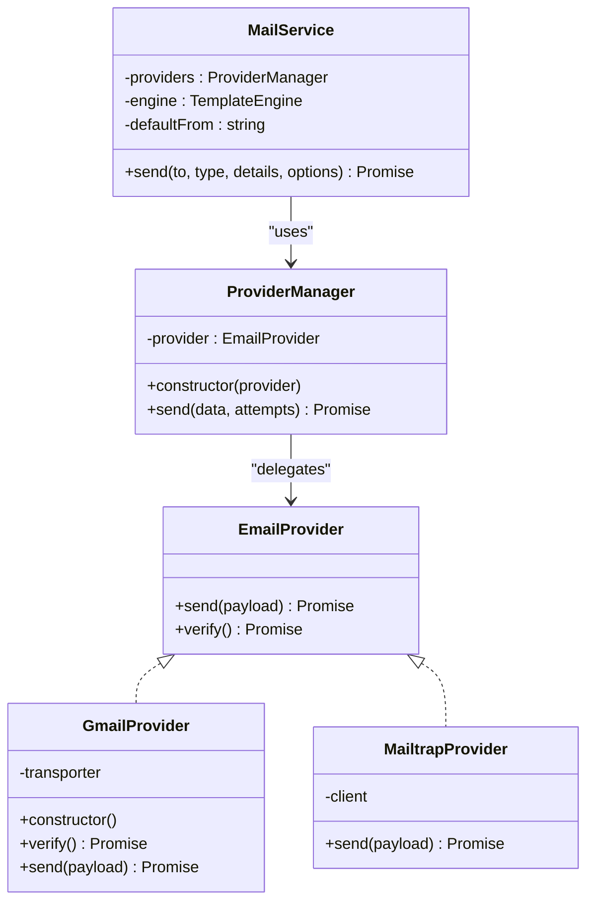
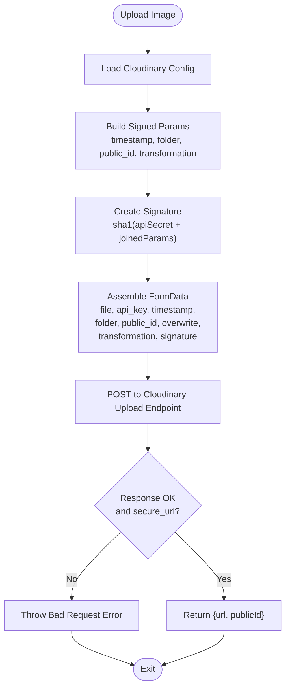
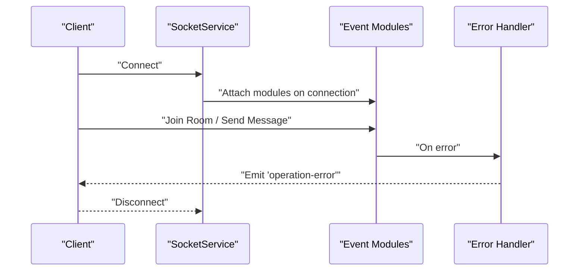
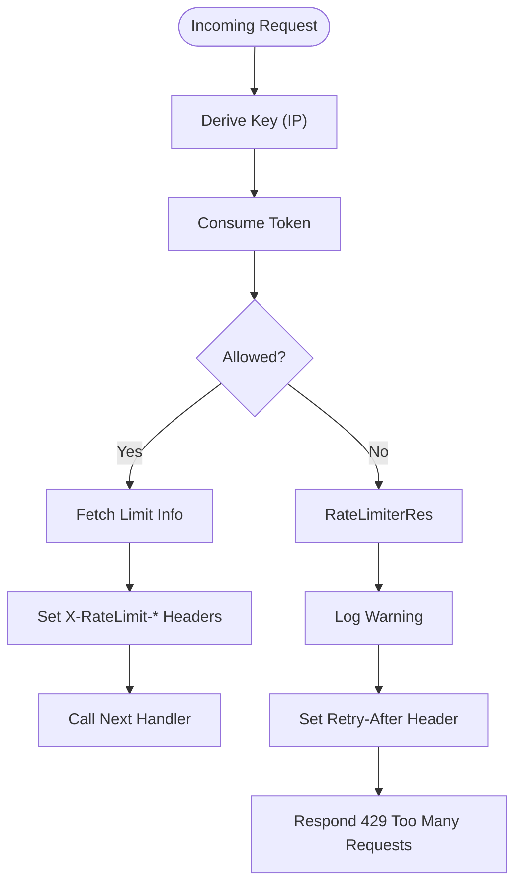
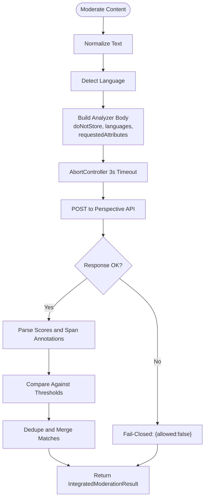
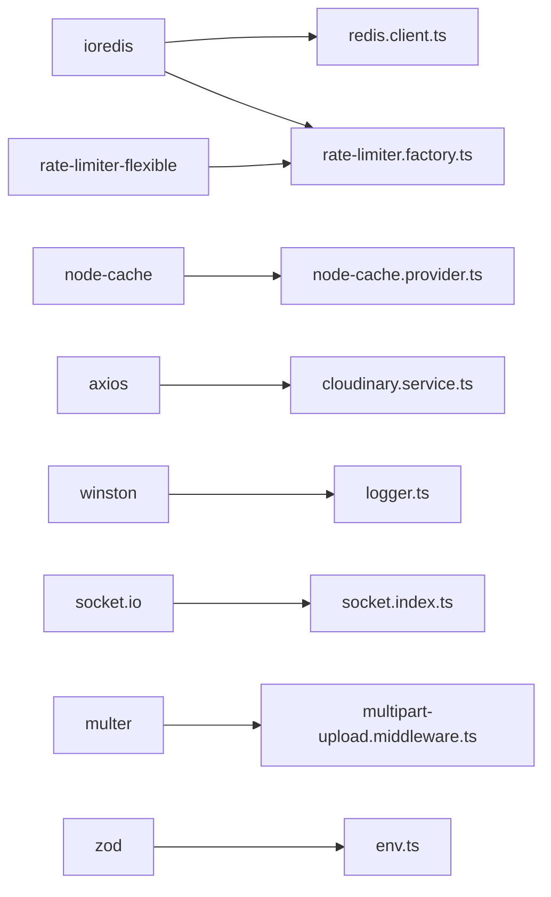

# External Services Integration

<cite>
**Referenced Files in This Document**
- [env.ts](file://server/src/config/env.ts)
- [mail.ts](file://server/src/config/mail.ts)
- [redis.client.ts](file://server/src/infra/services/cache/clients/redis.client.ts)
- [cache.module.ts](file://server/src/infra/services/cache/cache.module.ts)
- [cache.interface.ts](file://server/src/infra/services/cache/cache.interface.ts)
- [redis.provider.ts](file://server/src/infra/services/cache/providers/redis.provider.ts)
- [node-cache.provider.ts](file://server/src/infra/services/cache/providers/node-cache.provider.ts)
- [multi-tier.provider.ts](file://server/src/infra/services/cache/providers/multi-tier.provider.ts)
- [redis-session.store.ts](file://server/src/infra/services/cache/providers/redis-session.store.ts)
- [index.ts](file://server/src/infra/services/cache/index.ts)
- [mail.service.ts](file://server/src/infra/services/mail/core/mail.service.ts)
- [provider.factory.ts](file://server/src/infra/services/mail/core/provider.factory.ts)
- [mail.interface.ts](file://server/src/infra/services/mail/core/mail.interface.ts)
- [provider.manager.ts](file://server/src/infra/services/mail/core/provider.manager.ts)
- [gmail.provider.ts](file://server/src/infra/services/mail/providers/gmail.provider.ts)
- [mailtrap.provider.ts](file://server/src/infra/services/mail/providers/mailtrap.provider.ts)
- [mail.index.ts](file://server/src/infra/services/mail/index.ts)
- [cloudinary.service.ts](file://server/src/infra/services/media/cloudinary.service.ts)
- [multipart-upload.middleware.ts](file://server/src/core/middlewares/multipart-upload.middleware.ts)
- [socket.index.ts](file://server/src/infra/services/socket/index.ts)
- [socket.events.connection.ts](file://server/src/infra/services/socket/events/connection.events.ts)
- [socket.events.chat.ts](file://server/src/infra/services/socket/events/chat.events.ts)
- [socket.events.user.ts](file://server/src/infra/services/socket/events/user.events.ts)
- [socket.handle-error.ts](file://server/src/infra/services/socket/errors/handleSocketError.ts)
- [socket.types.ts](file://server/src/infra/services/socket/types/SocketEvents.ts)
- [web SocketContext.tsx](file://web/src/socket/SocketContext.tsx)
- [admin SocketContext.tsx](file://admin/src/socket/SocketContext.tsx)
- [useSocket.ts](file://web/src/socket/useSocket.ts)
- [rate-limiter.module.ts](file://server/src/infra/services/rate-limiter/rate-limiter.module.ts)
- [rate-limiter.factory.ts](file://server/src/infra/services/rate-limiter/rate-limiter.factory.ts)
- [rate-limiter.create-middleware.ts](file://server/src/infra/services/rate-limiter/rate-limiter.create-middleware.ts)
- [rate-limit.middleware.ts](file://server/src/core/middlewares/rate-limit.middleware.ts)
- [moderator.service.ts](file://server/src/infra/services/moderator/moderator.service.ts)
- [logger.ts](file://server/src/core/logger/logger.ts)
- [should-sample-log.ts](file://server/src/lib/should-sample-log.ts)
- [record-audit.ts](file://server/src/lib/record-audit.ts)
- [audit.types.ts](file://server/src/modules/audit/audit.types.ts)
</cite>

## Table of Contents
1. [Introduction](#introduction)
2. [Project Structure](#project-structure)
3. [Core Components](#core-components)
4. [Architecture Overview](#architecture-overview)
5. [Detailed Component Analysis](#detailed-component-analysis)
6. [Dependency Analysis](#dependency-analysis)
7. [Performance Considerations](#performance-considerations)
8. [Troubleshooting Guide](#troubleshooting-guide)
9. [Conclusion](#conclusion)
10. [Appendices](#appendices)

## Introduction
This document explains how external services are integrated and abstracted across the backend server, covering:
- Cache service architecture with Redis and in-memory providers, including a multi-tier setup
- Email service configuration supporting multiple providers with verification and retry
- Media storage integration via Cloudinary
- Real-time communication using socket.io
- Rate limiter backed by Redis
- Third-party API integrations (Google Perspective) with fail-closed behavior
- Monitoring, logging, and performance optimization strategies

## Project Structure
External service integrations are organized under dedicated modules with clear separation of concerns:
- Cache: providers and factory for memory, Redis, and multi-tier caching
- Mail: provider manager, factories, and providers (Gmail, Mailtrap)
- Media: Cloudinary upload service
- Socket: socket.io server initialization and event modules
- Rate limiter: Redis-backed limiter with Express middleware
- Moderator: Google Perspective integration with caching and thresholds
- Logging and observability: Winston logger, sampling, and audit recording

**Diagram sources**
- [cache.module.ts](file://server/src/infra/services/cache/cache.module.ts#L1-L33)
- [redis.client.ts](file://server/src/infra/services/cache/clients/redis.client.ts#L1-L12)
- [redis.provider.ts](file://server/src/infra/services/cache/providers/redis.provider.ts#L1-L39)
- [node-cache.provider.ts](file://server/src/infra/services/cache/providers/node-cache.provider.ts#L1-L44)
- [multi-tier.provider.ts](file://server/src/infra/services/cache/providers/multi-tier.provider.ts#L1-L53)
- [redis-session.store.ts](file://server/src/infra/services/cache/providers/redis-session.store.ts#L1-L24)
- [cache.index.ts](file://server/src/infra/services/cache/index.ts#L1-L6)
- [mail.index.ts](file://server/src/infra/services/mail/index.ts#L1-L15)
- [mail.service.ts](file://server/src/infra/services/mail/core/mail.service.ts#L1-L101)
- [provider.manager.ts](file://server/src/infra/services/mail/core/provider.manager.ts#L1-L41)
- [provider.factory.ts](file://server/src/infra/services/mail/core/provider.factory.ts#L1-L44)
- [gmail.provider.ts](file://server/src/infra/services/mail/providers/gmail.provider.ts#L1-L53)
- [mailtrap.provider.ts](file://server/src/infra/services/mail/providers/mailtrap.provider.ts#L1-L26)
- [cloudinary.service.ts](file://server/src/infra/services/media/cloudinary.service.ts#L1-L75)
- [multipart-upload.middleware.ts](file://server/src/core/middlewares/multipart-upload.middleware.ts#L1-L13)
- [socket.index.ts](file://server/src/infra/services/socket/index.ts#L1-L47)
- [connection.events.ts](file://server/src/infra/services/socket/events/connection.events.ts#L1-L20)
- [chat.events.ts](file://server/src/infra/services/socket/events/chat.events.ts#L1-L26)
- [user.events.ts](file://server/src/infra/services/socket/events/user.events.ts#L1-L9)
- [handleSocketError.ts](file://server/src/infra/services/socket/errors/handleSocketError.ts#L1-L22)
- [socket.types.ts](file://server/src/infra/services/socket/types/SocketEvents.ts#L1-L3)
- [limiters.module.ts](file://server/src/infra/services/rate-limiter/rate-limiter.module.ts#L1-L8)
- [factory.ts](file://server/src/infra/services/rate-limiter/rate-limiter.factory.ts#L1-L41)
- [create-middleware.ts](file://server/src/infra/services/rate-limiter/rate-limiter.create-middleware.ts#L1-L42)
- [rate-limit.middleware.ts](file://server/src/core/middlewares/rate-limit.middleware.ts#L1-L11)
- [moderator.service.ts](file://server/src/infra/services/moderator/moderator.service.ts#L57-L542)
- [logger.ts](file://server/src/core/logger/logger.ts#L1-L25)
- [should-sample-log.ts](file://server/src/lib/should-sample-log.ts#L1-L16)
- [record-audit.ts](file://server/src/lib/record-audit.ts#L1-L22)
- [audit.types.ts](file://server/src/modules/audit/audit.types.ts#L1-L22)

**Section sources**
- [cache.module.ts](file://server/src/infra/services/cache/cache.module.ts#L1-L33)
- [mail.index.ts](file://server/src/infra/services/mail/index.ts#L1-L15)
- [cloudinary.service.ts](file://server/src/infra/services/media/cloudinary.service.ts#L1-L75)
- [socket.index.ts](file://server/src/infra/services/socket/index.ts#L1-L47)
- [rate-limiter.module.ts](file://server/src/infra/services/rate-limiter/rate-limiter.module.ts#L1-L8)
- [moderator.service.ts](file://server/src/infra/services/moderator/moderator.service.ts#L57-L542)
- [logger.ts](file://server/src/core/logger/logger.ts#L1-L25)

## Core Components
- Cache service: supports memory, Redis, and multi-tier caching with TTL and atomic increment support
- Email service: provider manager with pluggable providers (Gmail, Mailtrap), verification, and retry
- Media storage: Cloudinary upload with signed parameters and transformation pipeline
- Socket.io: server initialization with CORS and transport configuration, event modules, and error handling
- Rate limiter: Redis-backed limiter with Express middleware and standardized headers
- Moderator: Google Perspective integration with caching, thresholds, and fail-closed policy
- Observability: Winston logger, sampling, and audit recording

**Section sources**
- [cache.interface.ts](file://server/src/infra/services/cache/cache.interface.ts#L1-L15)
- [mail.service.ts](file://server/src/infra/services/mail/core/mail.service.ts#L1-L101)
- [cloudinary.service.ts](file://server/src/infra/services/media/cloudinary.service.ts#L1-L75)
- [socket.index.ts](file://server/src/infra/services/socket/index.ts#L1-L47)
- [rate-limiter.create-middleware.ts](file://server/src/infra/services/rate-limiter/rate-limiter.create-middleware.ts#L1-L42)
- [moderator.service.ts](file://server/src/infra/services/moderator/moderator.service.ts#L57-L542)
- [logger.ts](file://server/src/core/logger/logger.ts#L1-L25)

## Architecture Overview
The system uses a layered approach:
- Environment-driven configuration selects cache driver, mail provider, and Cloudinary credentials
- Providers encapsulate external clients behind a unified interface
- Middleware integrates rate limiting and request logging
- Real-time events are handled by modular socket handlers
- Moderation integrates with external APIs and caches results

**Diagram sources**
- [env.ts](file://server/src/config/env.ts#L1-L42)
- [mail.ts](file://server/src/config/mail.ts#L1-L16)
- [cache.module.ts](file://server/src/infra/services/cache/cache.module.ts#L1-L33)
- [redis.client.ts](file://server/src/infra/services/cache/clients/redis.client.ts#L1-L12)
- [redis.provider.ts](file://server/src/infra/services/cache/providers/redis.provider.ts#L1-L39)
- [node-cache.provider.ts](file://server/src/infra/services/cache/providers/node-cache.provider.ts#L1-L44)
- [multi-tier.provider.ts](file://server/src/infra/services/cache/providers/multi-tier.provider.ts#L1-L53)
- [mail.index.ts](file://server/src/infra/services/mail/index.ts#L1-L15)
- [mail.service.ts](file://server/src/infra/services/mail/core/mail.service.ts#L1-L101)
- [provider.manager.ts](file://server/src/infra/services/mail/core/provider.manager.ts#L1-L41)
- [provider.factory.ts](file://server/src/infra/services/mail/core/provider.factory.ts#L1-L44)
- [gmail.provider.ts](file://server/src/infra/services/mail/providers/gmail.provider.ts#L1-L53)
- [mailtrap.provider.ts](file://server/src/infra/services/mail/providers/mailtrap.provider.ts#L1-L26)
- [cloudinary.service.ts](file://server/src/infra/services/media/cloudinary.service.ts#L1-L75)
- [multipart-upload.middleware.ts](file://server/src/core/middlewares/multipart-upload.middleware.ts#L1-L13)
- [socket.index.ts](file://server/src/infra/services/socket/index.ts#L1-L47)
- [connection.events.ts](file://server/src/infra/services/socket/events/connection.events.ts#L1-L20)
- [chat.events.ts](file://server/src/infra/services/socket/events/chat.events.ts#L1-L26)
- [user.events.ts](file://server/src/infra/services/socket/events/user.events.ts#L1-L9)
- [handleSocketError.ts](file://server/src/infra/services/socket/errors/handleSocketError.ts#L1-L22)
- [limiters.module.ts](file://server/src/infra/services/rate-limiter/rate-limiter.module.ts#L1-L8)
- [factory.ts](file://server/src/infra/services/rate-limiter/rate-limiter.factory.ts#L1-L41)
- [create-middleware.ts](file://server/src/infra/services/rate-limiter/rate-limiter.create-middleware.ts#L1-L42)
- [rate-limit.middleware.ts](file://server/src/core/middlewares/rate-limit.middleware.ts#L1-L11)
- [moderator.service.ts](file://server/src/infra/services/moderator/moderator.service.ts#L57-L542)

## Detailed Component Analysis

### Cache Service Architecture
The cache subsystem provides a unified interface for multiple providers:
- Memory provider: in-process caching with TTL and periodic cleanup
- Redis provider: persistent caching with TTL and atomic increment
- Multi-tier provider: transparent L1/L2 caching with write-through and L1 promotion on hits

**Diagram sources**
- [cache.interface.ts](file://server/src/infra/services/cache/cache.interface.ts#L1-L15)
- [node-cache.provider.ts](file://server/src/infra/services/cache/providers/node-cache.provider.ts#L1-L44)
- [redis.provider.ts](file://server/src/infra/services/cache/providers/redis.provider.ts#L1-L39)
- [multi-tier.provider.ts](file://server/src/infra/services/cache/providers/multi-tier.provider.ts#L1-L53)

Key configuration and selection:
- Driver selection and TTL are controlled via environment variables
- Redis client is configured with readiness checks and error handling
- Session store wraps Redis for session-specific operations

Concrete configuration examples:
- Cache driver selection and TTL: see [cache.module.ts](file://server/src/infra/services/cache/cache.module.ts#L9-L27)
- Redis client creation and error handling: see [redis.client.ts](file://server/src/infra/services/cache/clients/redis.client.ts#L4-L11)
- Redis session store operations: see [redis-session.store.ts](file://server/src/infra/services/cache/providers/redis-session.store.ts#L4-L24)

Error handling and fallback:
- TTL validation throws on invalid values in memory and Redis providers
- Multi-tier promotes L2 hits into L1 on successful retrieval
- Redis client emits errors for connectivity issues

**Section sources**
- [cache.interface.ts](file://server/src/infra/services/cache/cache.interface.ts#L1-L15)
- [cache.module.ts](file://server/src/infra/services/cache/cache.module.ts#L1-L33)
- [redis.client.ts](file://server/src/infra/services/cache/clients/redis.client.ts#L1-L12)
- [redis.provider.ts](file://server/src/infra/services/cache/providers/redis.provider.ts#L1-L39)
- [node-cache.provider.ts](file://server/src/infra/services/cache/providers/node-cache.provider.ts#L1-L44)
- [multi-tier.provider.ts](file://server/src/infra/services/cache/providers/multi-tier.provider.ts#L1-L53)
- [redis-session.store.ts](file://server/src/infra/services/cache/providers/redis-session.store.ts#L1-L24)

### Email Service Configuration
The email service abstracts multiple providers behind a single interface:
- Provider manager supports retries and consistent error reporting
- Factory chooses provider based on environment and performs verification outside tests
- Providers implement send and optional verify methods

**Diagram sources**
- [mail.interface.ts](file://server/src/infra/services/mail/core/mail.interface.ts#L1-L12)
- [gmail.provider.ts](file://server/src/infra/services/mail/providers/gmail.provider.ts#L1-L53)
- [mailtrap.provider.ts](file://server/src/infra/services/mail/providers/mailtrap.provider.ts#L1-L26)
- [provider.manager.ts](file://server/src/infra/services/mail/core/provider.manager.ts#L1-L41)
- [mail.service.ts](file://server/src/infra/services/mail/core/mail.service.ts#L1-L101)

Concrete configuration examples:
- Provider selection and verification: see [provider.factory.ts](file://server/src/infra/services/mail/core/provider.factory.ts#L7-L42)
- Gmail transport configuration: see [mail.ts](file://server/src/config/mail.ts#L4-L15)
- Service composition: see [mail.index.ts](file://server/src/infra/services/mail/index.ts#L9-L15)

Error handling and fallback:
- Validation of recipient email addresses
- Template rendering failures are captured and returned as errors
- Provider send failures are logged and surfaced with consistent shape
- Retry mechanism configurable via provider manager

**Section sources**
- [mail.service.ts](file://server/src/infra/services/mail/core/mail.service.ts#L1-L101)
- [provider.factory.ts](file://server/src/infra/services/mail/core/provider.factory.ts#L1-L44)
- [provider.manager.ts](file://server/src/infra/services/mail/core/provider.manager.ts#L1-L41)
- [mail.interface.ts](file://server/src/infra/services/mail/core/mail.interface.ts#L1-L12)
- [gmail.provider.ts](file://server/src/infra/services/mail/providers/gmail.provider.ts#L1-L53)
- [mailtrap.provider.ts](file://server/src/infra/services/mail/providers/mailtrap.provider.ts#L1-L26)
- [mail.index.ts](file://server/src/infra/services/mail/index.ts#L1-L15)
- [mail.ts](file://server/src/config/mail.ts#L1-L16)

### Media Storage Integration (Cloudinary)
Cloudinary integration uploads images with signed parameters and transformations:
- Generates signature using Cloudinary API secret
- Applies transformations and sets overwrite behavior
- Validates response and throws structured HTTP errors on failure

**Diagram sources**
- [cloudinary.service.ts](file://server/src/infra/services/media/cloudinary.service.ts#L6-L75)

Concrete configuration examples:
- Environment variables for Cloudinary credentials and defaults: see [env.ts](file://server/src/config/env.ts#L35-L38)
- Multer middleware for image uploads: see [multipart-upload.middleware.ts](file://server/src/core/middlewares/multipart-upload.middleware.ts#L3-L13)

Error handling and fallback:
- On upload failure, returns structured HTTP error with message
- Enforces image MIME type and size limits via middleware

**Section sources**
- [cloudinary.service.ts](file://server/src/infra/services/media/cloudinary.service.ts#L1-L75)
- [multipart-upload.middleware.ts](file://server/src/core/middlewares/multipart-upload.middleware.ts#L1-L13)
- [env.ts](file://server/src/config/env.ts#L35-L38)

### Socket.io Real-Time Communication
The socket service initializes socket.io with CORS and WebSocket transport, registers event modules, and centralizes error handling:
- Server initialization with origin and method policies
- Event modules for connection, chat, and user typing
- Centralized error handler emitting operation-error to clients

**Diagram sources**
- [socket.index.ts](file://server/src/infra/services/socket/index.ts#L10-L32)
- [connection.events.ts](file://server/src/infra/services/socket/events/connection.events.ts#L4-L17)
- [chat.events.ts](file://server/src/infra/services/socket/events/chat.events.ts#L5-L14)
- [user.events.ts](file://server/src/infra/services/socket/events/user.events.ts#L4-L6)
- [handleSocketError.ts](file://server/src/infra/services/socket/errors/handleSocketError.ts#L3-L21)

Frontend integration:
- Web and admin apps initialize socket.io with WebSocket transport
- Hooks expose socket instances for components

**Section sources**
- [socket.index.ts](file://server/src/infra/services/socket/index.ts#L1-L47)
- [connection.events.ts](file://server/src/infra/services/socket/events/connection.events.ts#L1-L20)
- [chat.events.ts](file://server/src/infra/services/socket/events/chat.events.ts#L1-L26)
- [user.events.ts](file://server/src/infra/services/socket/events/user.events.ts#L1-L9)
- [handleSocketError.ts](file://server/src/infra/services/socket/errors/handleSocketError.ts#L1-L22)
- [web SocketContext.tsx](file://web/src/socket/SocketContext.tsx#L12-L23)
- [admin SocketContext.tsx](file://admin/src/socket/SocketContext.tsx#L12-L23)
- [useSocket.ts](file://web/src/socket/useSocket.ts#L1-L8)

### Rate Limiter Implementation
The rate limiter uses Redis-backed tokens with flexible configuration:
- Factory creates Redis-based limiter with points and duration
- Express middleware consumes tokens, exposes headers, and responds with 429
- Predefined limiters for API and auth

**Diagram sources**
- [rate-limiter.create-middleware.ts](file://server/src/infra/services/rate-limiter/rate-limiter.create-middleware.ts#L6-L41)
- [rate-limiter.module.ts](file://server/src/infra/services/rate-limiter/rate-limiter.module.ts#L3-L6)
- [rate-limit.middleware.ts](file://server/src/core/middlewares/rate-limit.middleware.ts#L6-L9)

Concrete configuration examples:
- Limiter factory and keys: see [rate-limiter.module.ts](file://server/src/infra/services/rate-limiter/rate-limiter.module.ts#L3-L6)
- Redis limiter wrapper: see [rate-limiter.factory.ts](file://server/src/infra/services/rate-limiter/rate-limiter.factory.ts#L4-L24)
- Express middleware binding: see [rate-limit.middleware.ts](file://server/src/core/middlewares/rate-limit.middleware.ts#L6-L9)

**Section sources**
- [rate-limiter.module.ts](file://server/src/infra/services/rate-limiter/rate-limiter.module.ts#L1-L8)
- [rate-limiter.factory.ts](file://server/src/infra/services/rate-limiter/rate-limiter.factory.ts#L1-L41)
- [rate-limiter.create-middleware.ts](file://server/src/infra/services/rate-limiter/rate-limiter.create-middleware.ts#L1-L42)
- [rate-limit.middleware.ts](file://server/src/core/middlewares/rate-limit.middleware.ts#L1-L11)

### Third-Party API Integrations (Google Perspective)
Moderation integrates with Google Perspective:
- Fetches analysis with language detection and span annotations
- Applies thresholds per attribute and merges overlapping matches
- Fail-closed behavior on API errors or timeouts

**Diagram sources**
- [moderator.service.ts](file://server/src/infra/services/moderator/moderator.service.ts#L57-L542)

Concrete configuration examples:
- API key and URL construction: see [moderator.service.ts](file://server/src/infra/services/moderator/moderator.service.ts#L65-L65)
- Thresholds and attributes: see [moderator.service.ts](file://server/src/infra/services/moderator/moderator.service.ts#L67-L73)

**Section sources**
- [moderator.service.ts](file://server/src/infra/services/moderator/moderator.service.ts#L57-L542)

## Dependency Analysis
External dependencies and their management:
- Redis: used by cache providers and rate limiter; centralized client with error handling
- Nodemailer and Mailtrap: used by email providers; configured via environment
- Axios: used by Cloudinary uploader
- Socket.io: server and client libraries for real-time communication
- Winston: structured logging
- NodeCache: in-memory caching

**Diagram sources**
- [redis.client.ts](file://server/src/infra/services/cache/clients/redis.client.ts#L1-L12)
- [rate-limiter.factory.ts](file://server/src/infra/services/rate-limiter/rate-limiter.factory.ts#L1-L41)
- [node-cache.provider.ts](file://server/src/infra/services/cache/providers/node-cache.provider.ts#L1-L44)
- [cloudinary.service.ts](file://server/src/infra/services/media/cloudinary.service.ts#L1-L75)
- [logger.ts](file://server/src/core/logger/logger.ts#L1-L25)
- [socket.index.ts](file://server/src/infra/services/socket/index.ts#L1-L47)
- [multipart-upload.middleware.ts](file://server/src/core/middlewares/multipart-upload.middleware.ts#L1-L13)
- [env.ts](file://server/src/config/env.ts#L1-L42)

**Section sources**
- [redis.client.ts](file://server/src/infra/services/cache/clients/redis.client.ts#L1-L12)
- [rate-limiter.factory.ts](file://server/src/infra/services/rate-limiter/rate-limiter.factory.ts#L1-L41)
- [cloudinary.service.ts](file://server/src/infra/services/media/cloudinary.service.ts#L1-L75)
- [logger.ts](file://server/src/core/logger/logger.ts#L1-L25)
- [socket.index.ts](file://server/src/infra/services/socket/index.ts#L1-L47)
- [multipart-upload.middleware.ts](file://server/src/core/middlewares/multipart-upload.middleware.ts#L1-L13)
- [env.ts](file://server/src/config/env.ts#L1-L42)

## Performance Considerations
- Cache tiering reduces latency for hot keys while maintaining persistence
- Redis client readiness and null retry limits improve resilience
- Rate limiter uses Redis for distributed enforcement and minimal overhead
- Socket.io configured for WebSocket transport and CORS origins
- Moderation caches results and applies timeouts to prevent slow downstream
- Logging supports sampling to reduce overhead in high-volume scenarios

[No sources needed since this section provides general guidance]

## Troubleshooting Guide
Common issues and resolutions:
- Cache provider errors: verify TTL values and Redis connectivity; check error logs for Redis client
- Email provider verification failures: ensure credentials are set and provider supports verify; fallback to Mailtrap in development
- Cloudinary upload failures: confirm API credentials and network reachability; inspect error messages
- Socket errors: check connection events and error handler emissions; verify CORS origins and transports
- Rate limit exceeded: inspect X-RateLimit headers and Retry-After; adjust limiter configuration or client backoff
- Moderation service unavailability: expect fail-closed behavior; monitor Perspective API status

**Section sources**
- [redis.client.ts](file://server/src/infra/services/cache/clients/redis.client.ts#L9-L11)
- [provider.factory.ts](file://server/src/infra/services/mail/core/provider.factory.ts#L10-L20)
- [cloudinary.service.ts](file://server/src/infra/services/media/cloudinary.service.ts#L68-L74)
- [handleSocketError.ts](file://server/src/infra/services/socket/errors/handleSocketError.ts#L3-L21)
- [rate-limiter.create-middleware.ts](file://server/src/infra/services/rate-limiter/rate-limiter.create-middleware.ts#L21-L40)
- [moderator.service.ts](file://server/src/infra/services/moderator/moderator.service.ts#L518-L528)

## Conclusion
The platform integrates external services through well-defined abstractions:
- Cache, mail, media, socket, rate limiter, and moderation are modular and configurable
- Redis underpins persistence and distributed coordination
- Structured logging and sampling enable observability
- Clear error handling and fallbacks ensure robustness

[No sources needed since this section summarizes without analyzing specific files]

## Appendices

### Environment Variables Reference
- Cache: CACHE_DRIVER, CACHE_TTL
- Redis: REDIS_URL
- Mail: MAIL_PROVIDER, GMAIL_APP_USER, GMAIL_APP_PASS, MAILTRAP_TOKEN, MAIL_FROM
- Cloudinary: CLOUDINARY_CLOUD_NAME, CLOUDINARY_API_KEY, CLOUDINARY_API_SECRET, CLOUDINARY_UPLOAD_FOLDER
- Perspective: PERSPECTIVE_API_KEY
- Socket: ACCESS_CONTROL_ORIGINS

**Section sources**
- [env.ts](file://server/src/config/env.ts#L4-L39)