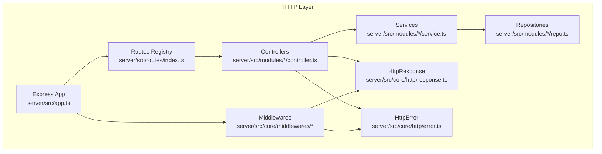
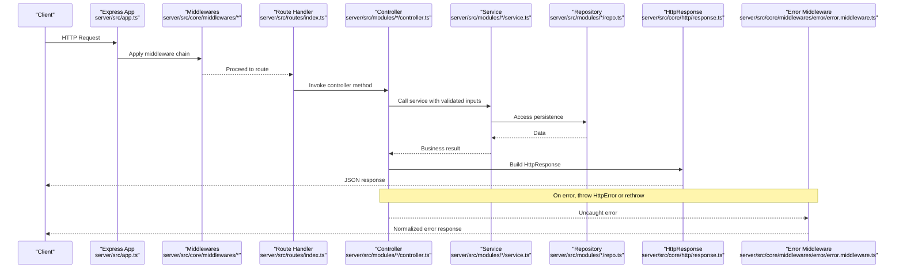
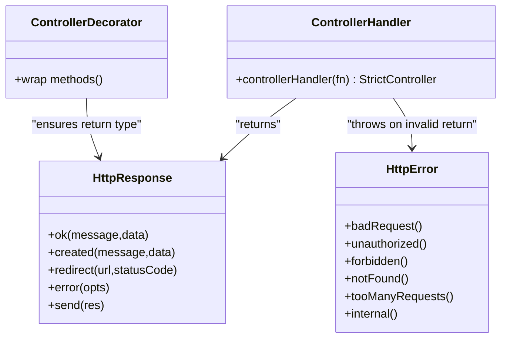
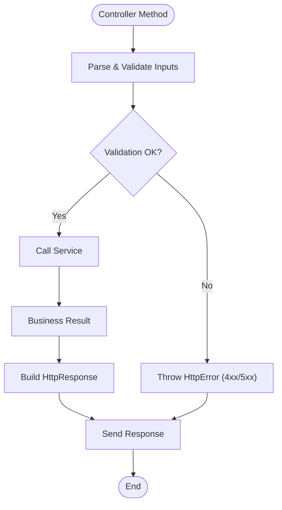
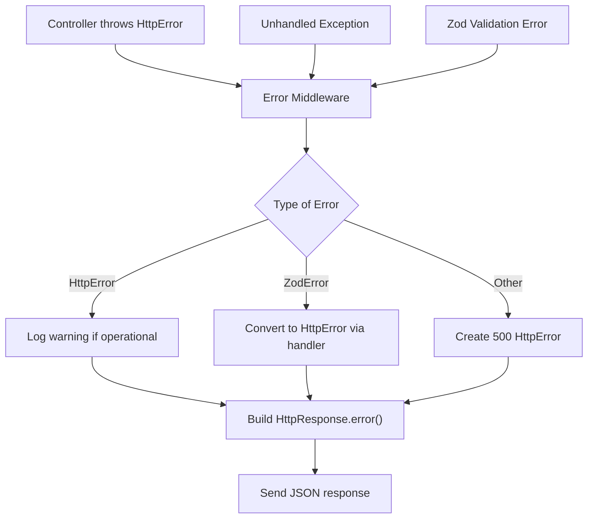
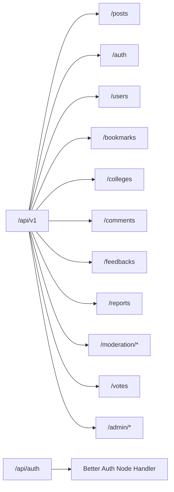
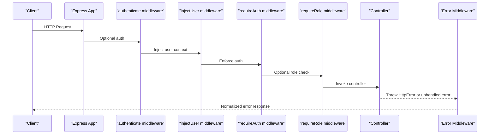
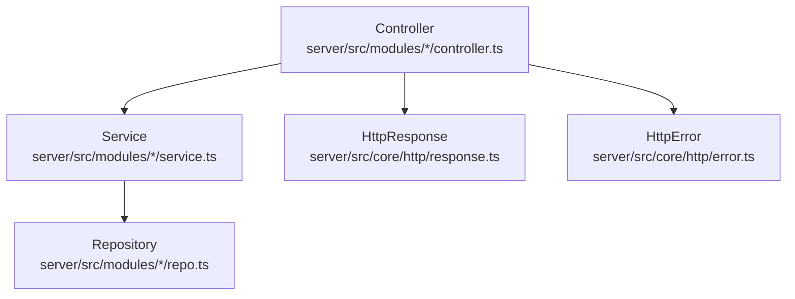
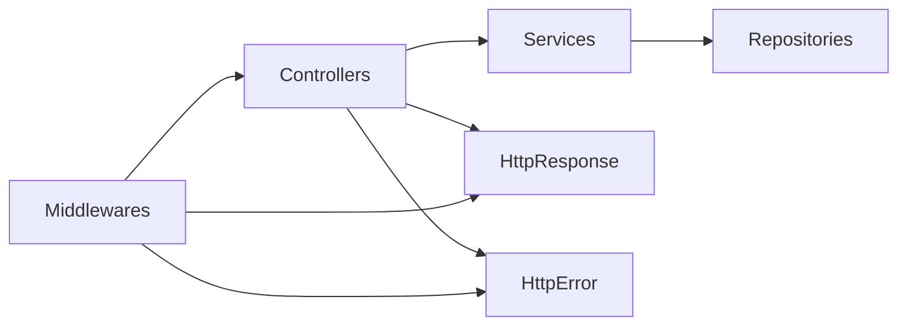

# HTTP Layer & Routing

<cite>
**Referenced Files in This Document**
- [app.ts](file://server/src/app.ts)
- [index.ts](file://server/src/routes/index.ts)
- [controller.ts](file://server/src/core/http/controller.ts)
- [error.ts](file://server/src/core/http/error.ts)
- [response.ts](file://server/src/core/http/response.ts)
- [types/index.ts](file://server/src/core/http/types/index.ts)
- [error.middleware.ts](file://server/src/core/middlewares/error/error.middleware.ts)
- [pipelines.ts](file://server/src/core/middlewares/pipelines.ts)
- [authenticate.middleware.ts](file://server/src/core/middlewares/auth/authenticate.middleware.ts)
- [auth.controller.ts](file://server/src/modules/auth/auth.controller.ts)
- [user.controller.ts](file://server/src/modules/user/user.controller.ts)
- [post.controller.ts](file://server/src/modules/post/post.controller.ts)
</cite>

## Table of Contents
1. [Introduction](#introduction)
2. [Project Structure](#project-structure)
3. [Core Components](#core-components)
4. [Architecture Overview](#architecture-overview)
5. [Detailed Component Analysis](#detailed-component-analysis)
6. [Dependency Analysis](#dependency-analysis)
7. [Performance Considerations](#performance-considerations)
8. [Troubleshooting Guide](#troubleshooting-guide)
9. [Conclusion](#conclusion)

## Introduction
This document explains the HTTP layer architecture of the server module, focusing on the controller pattern, request/response handling, error management, routing, middleware integration, and status code conventions. It also documents how controllers interact with services and repositories, common HTTP patterns, validation approaches, and performance considerations.

## Project Structure
The HTTP layer is implemented in the server module using Express. The application bootstraps middleware, registers routes, and delegates request handling to controllers. Controllers return typed responses via a dedicated response wrapper and may throw structured HTTP errors. Middleware integrates authentication, logging, rate limiting, and error handling.

**Diagram sources**
- [app.ts](file://server/src/app.ts#L10-L30)
- [index.ts](file://server/src/routes/index.ts#L20-L38)
- [controller.ts](file://server/src/core/http/controller.ts#L13-L35)
- [error.middleware.ts](file://server/src/core/middlewares/error/error.middleware.ts#L9-L67)
- [response.ts](file://server/src/core/http/response.ts#L4-L32)
- [error.ts](file://server/src/core/http/error.ts#L9-L39)

**Section sources**
- [app.ts](file://server/src/app.ts#L1-L33)
- [index.ts](file://server/src/routes/index.ts#L1-L39)

## Core Components
- Controller pattern: Controllers are decorated or wrapped to enforce a consistent contract. They receive Express Request/Response and return an HttpResponse instance.
- Response formatting: HttpResponse encapsulates standardized JSON envelopes with success flags, messages, optional codes, data payloads, errors, and metadata.
- Error management: HttpError models structured HTTP errors with status codes, codes, messages, optional nested errors, and operational flags. The error middleware converts thrown errors and Zod validation failures into consistent responses.
- Routing: Routes are mounted under a versioned base path and delegate to module-specific routers.
- Middleware: Authentication, request logging, rate limiting, multipart upload, and error handlers are integrated centrally.

**Section sources**
- [controller.ts](file://server/src/core/http/controller.ts#L7-L35)
- [response.ts](file://server/src/core/http/response.ts#L4-L98)
- [error.ts](file://server/src/core/http/error.ts#L9-L109)
- [index.ts](file://server/src/routes/index.ts#L20-L38)
- [error.middleware.ts](file://server/src/core/middlewares/error/error.middleware.ts#L9-L67)

## Architecture Overview
The HTTP request lifecycle follows a predictable flow:
- Express app initializes middleware and registers routes.
- Requests hit route handlers that optionally apply middleware pipelines.
- Controllers validate inputs using module-specific schemas, call services, and return HttpResponse instances.
- Errors are normalized by the error middleware and returned as consistent JSON responses.

**Diagram sources**
- [app.ts](file://server/src/app.ts#L10-L30)
- [index.ts](file://server/src/routes/index.ts#L20-L38)
- [controller.ts](file://server/src/core/http/controller.ts#L13-L35)
- [response.ts](file://server/src/core/http/response.ts#L84-L97)
- [error.middleware.ts](file://server/src/core/middlewares/error/error.middleware.ts#L9-L67)

## Detailed Component Analysis

### Controller Pattern Implementation
- Decorator and factory: The controller decorator and factory wrap controller methods to ensure they return HttpResponse instances and automatically send responses to Express.
- Contract enforcement: Non-HttpResponse returns trigger an error, ensuring consistent response handling.
- Class-level wrapping: Applying @Controller() to a class wraps all its methods, while controllerHandler() adapts standalone functions.

**Diagram sources**
- [controller.ts](file://server/src/core/http/controller.ts#L59-L79)
- [controller.ts](file://server/src/core/http/controller.ts#L13-L35)
- [response.ts](file://server/src/core/http/response.ts#L34-L97)
- [error.ts](file://server/src/core/http/error.ts#L77-L108)

**Section sources**
- [controller.ts](file://server/src/core/http/controller.ts#L7-L35)
- [controller.ts](file://server/src/core/http/controller.ts#L59-L79)

### Request/Response Handling
- Validation: Controllers parse and validate request bodies, queries, and params using module-specific Zod schemas.
- Service orchestration: Controllers call services to perform business logic and fetch data.
- Response construction: Controllers return HttpResponse.ok(), HttpResponse.created(), or HttpResponse.redirect() depending on semantics.
- Redirect support: HttpResponse supports HTTP redirects with standard redirect codes.

**Diagram sources**
- [auth.controller.ts](file://server/src/modules/auth/auth.controller.ts#L8-L18)
- [user.controller.ts](file://server/src/modules/user/user.controller.ts#L9-L15)
- [post.controller.ts](file://server/src/modules/post/post.controller.ts#L8-L22)
- [response.ts](file://server/src/core/http/response.ts#L34-L97)
- [error.ts](file://server/src/core/http/error.ts#L77-L108)

**Section sources**
- [auth.controller.ts](file://server/src/modules/auth/auth.controller.ts#L8-L18)
- [user.controller.ts](file://server/src/modules/user/user.controller.ts#L9-L15)
- [post.controller.ts](file://server/src/modules/post/post.controller.ts#L8-L22)
- [response.ts](file://server/src/core/http/response.ts#L34-L97)

### Error Management System
- HttpError: Structured error with status code, code, message, optional nested errors, meta, and operational flag.
- Factory methods: Dedicated constructors for common HTTP statuses (400, 401, 403, 404, 429, 500).
- Serialization: toJSON() produces a consistent error envelope.
- Error middleware: Converts Zod errors, HttpErrors, and unhandled exceptions into normalized JSON responses. In development, stack traces and extra meta are included; otherwise, production hides internals.

**Diagram sources**
- [error.ts](file://server/src/core/http/error.ts#L9-L109)
- [error.middleware.ts](file://server/src/core/middlewares/error/error.middleware.ts#L9-L67)

**Section sources**
- [error.ts](file://server/src/core/http/error.ts#L9-L109)
- [error.middleware.ts](file://server/src/core/middlewares/error/error.middleware.ts#L9-L67)

### Routing Structure
- Versioned base path: Routes are registered under /api/v1/* and grouped by domain modules.
- Health checks: Health routes are registered separately.
- OAuth passthrough: Better Auth’s node handler is mounted at /api/auth to support OAuth flows.

**Diagram sources**
- [index.ts](file://server/src/routes/index.ts#L20-L38)

**Section sources**
- [index.ts](file://server/src/routes/index.ts#L20-L38)

### Middleware Integration
- Authentication: Optional authentication middleware attaches session and user context to the request.
- Pipelines: Composable middleware pipelines provide common sequences for identity, authenticated access, user context injection, role checks, and admin-only access.
- Logging: Request logging middleware records request metadata.
- Error handling: Centralized error handlers convert errors to responses and log appropriately.

**Diagram sources**
- [authenticate.middleware.ts](file://server/src/core/middlewares/auth/authenticate.middleware.ts#L8-L26)
- [pipelines.ts](file://server/src/core/middlewares/pipelines.ts#L8-L27)
- [error.middleware.ts](file://server/src/core/middlewares/error/error.middleware.ts#L9-L67)

**Section sources**
- [authenticate.middleware.ts](file://server/src/core/middlewares/auth/authenticate.middleware.ts#L8-L26)
- [pipelines.ts](file://server/src/core/middlewares/pipelines.ts#L1-L28)
- [error.middleware.ts](file://server/src/core/middlewares/error/error.middleware.ts#L9-L67)

### HTTP Status Code Conventions
- 200 OK: Successful GETs, updates, and informational responses.
- 201 Created: Successful resource creation.
- 301/302/303/307/308: Redirects for flows like OAuth callbacks.
- 400 Bad Request: Validation failures and malformed requests.
- 401 Unauthorized: Missing or invalid authentication.
- 403 Forbidden: Insufficient permissions.
- 404 Not Found: Unknown resources or routes.
- 429 Too Many Requests: Rate limiting triggers.
- 500 Internal Server Error: Unexpected server failures.

These conventions are enforced by HttpError factory methods and the error middleware.

**Section sources**
- [error.ts](file://server/src/core/http/error.ts#L77-L108)
- [error.middleware.ts](file://server/src/core/middlewares/error/error.middleware.ts#L32-L37)

### Relationship Between Controllers, Services, and Repositories
- Controllers: Parse inputs, validate, and orchestrate service calls. They return HttpResponse.
- Services: Contain business logic, coordinate domain operations, and interact with repositories.
- Repositories: Encapsulate data access and persistence logic.

**Diagram sources**
- [auth.controller.ts](file://server/src/modules/auth/auth.controller.ts#L1-L236)
- [user.controller.ts](file://server/src/modules/user/user.controller.ts#L1-L72)
- [post.controller.ts](file://server/src/modules/post/post.controller.ts#L1-L182)
- [response.ts](file://server/src/core/http/response.ts#L4-L98)
- [error.ts](file://server/src/core/http/error.ts#L9-L109)

**Section sources**
- [auth.controller.ts](file://server/src/modules/auth/auth.controller.ts#L1-L236)
- [user.controller.ts](file://server/src/modules/user/user.controller.ts#L1-L72)
- [post.controller.ts](file://server/src/modules/post/post.controller.ts#L1-L182)

### Common HTTP Patterns and Validation Approaches
- Validation-first controllers: Inputs are parsed using Zod schemas before any business logic.
- Standardized responses: All successful responses use HttpResponse.ok()/created()/redirect().
- Error-first responses: Errors are thrown as HttpError instances or surfaced by Zod conversion.
- Redirects: OAuth callbacks and similar flows use HttpResponse.redirect().

Examples of patterns:
- Login flow validates credentials, authenticates, and returns a success response.
- Search and listing endpoints validate query parameters and return paginated results.
- Deletion endpoints validate identifiers and return success messages.

**Section sources**
- [auth.controller.ts](file://server/src/modules/auth/auth.controller.ts#L8-L18)
- [user.controller.ts](file://server/src/modules/user/user.controller.ts#L17-L26)
- [post.controller.ts](file://server/src/modules/post/post.controller.ts#L24-L46)
- [response.ts](file://server/src/core/http/response.ts#L52-L59)

## Dependency Analysis
The HTTP layer exhibits clean separation of concerns:
- Controllers depend on services and schemas.
- Services depend on repositories and domain logic.
- Middlewares are orthogonal and applied globally or per-route.
- Responses and errors are centralized abstractions consumed across the system.

**Diagram sources**
- [controller.ts](file://server/src/core/http/controller.ts#L13-L35)
- [response.ts](file://server/src/core/http/response.ts#L4-L98)
- [error.ts](file://server/src/core/http/error.ts#L9-L109)
- [error.middleware.ts](file://server/src/core/middlewares/error/error.middleware.ts#L9-L67)

**Section sources**
- [controller.ts](file://server/src/core/http/controller.ts#L13-L35)
- [response.ts](file://server/src/core/http/response.ts#L4-L98)
- [error.ts](file://server/src/core/http/error.ts#L9-L109)
- [error.middleware.ts](file://server/src/core/middlewares/error/error.middleware.ts#L9-L67)

## Performance Considerations
- Payload limits: Body parsing is configured with small limits suitable for typical API payloads.
- Middleware ordering: Place fast middlewares early (logging, compression) and expensive ones later (rate limiting, auth).
- Response size: Prefer paginated lists and avoid returning large embedded objects; use selective field selection in services.
- Redirects: Use appropriate redirect codes to minimize client retries.
- Validation cost: Keep Zod schemas efficient; avoid overly complex validations in hot paths.

[No sources needed since this section provides general guidance]

## Troubleshooting Guide
- Validation errors: Zod errors are normalized into structured HTTP errors with consistent envelopes.
- Operational vs non-operational errors: Operational errors are surfaced to clients; non-operational errors (like 500s) hide internal details except in development.
- Logging: Request failures and unhandled exceptions are logged with contextual metadata; inspect logs for stack traces in development mode.
- Route not found: The notFound middleware converts unmatched routes into 404 responses.

**Section sources**
- [error.middleware.ts](file://server/src/core/middlewares/error/error.middleware.ts#L9-L67)
- [error.ts](file://server/src/core/http/error.ts#L49-L57)

## Conclusion
The HTTP layer enforces a strict controller pattern with standardized responses and errors, a robust middleware pipeline, and a clear separation between controllers, services, and repositories. The routing structure is modular and versioned, while validation and error handling are centralized for consistency and reliability.