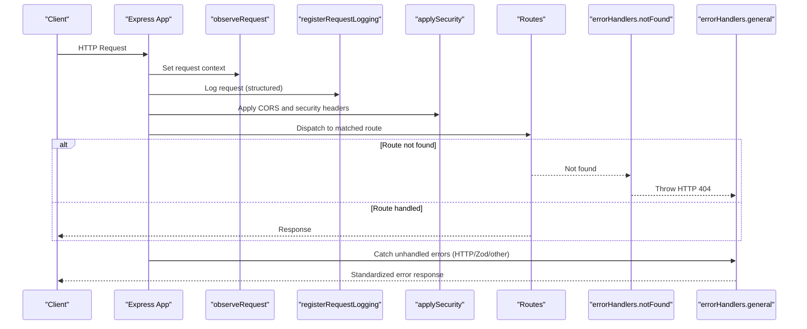
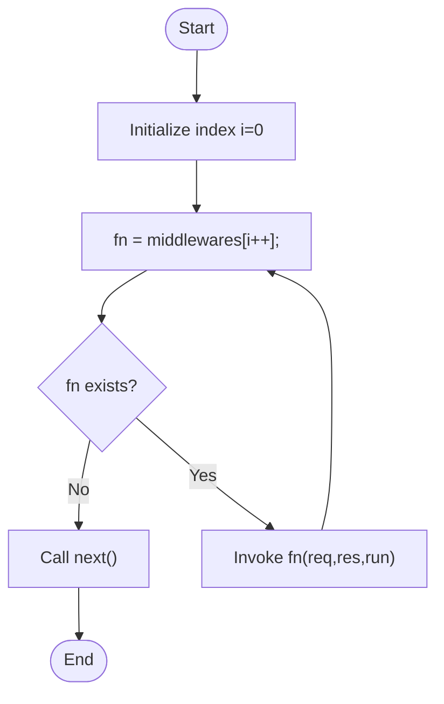
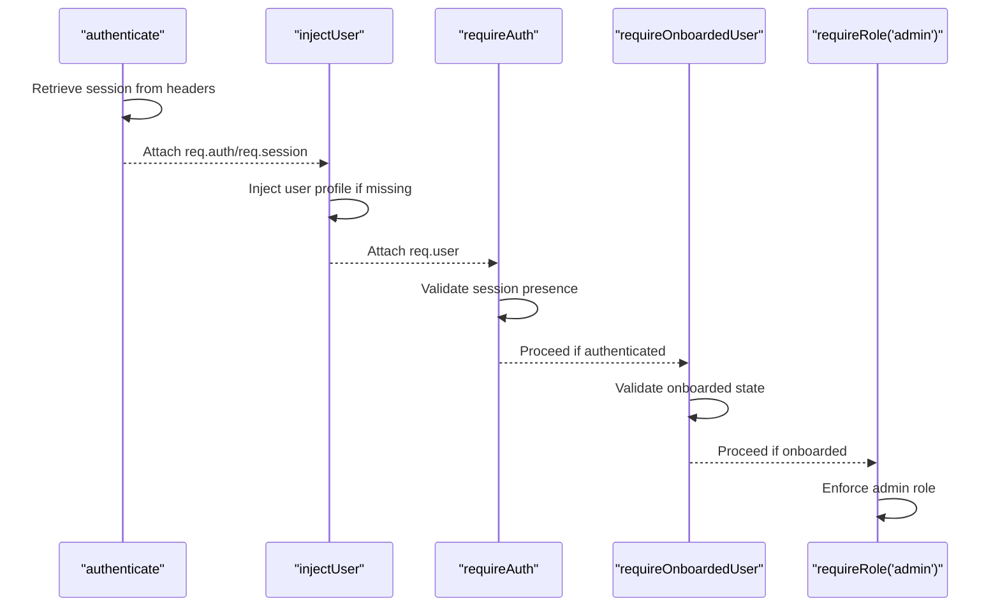
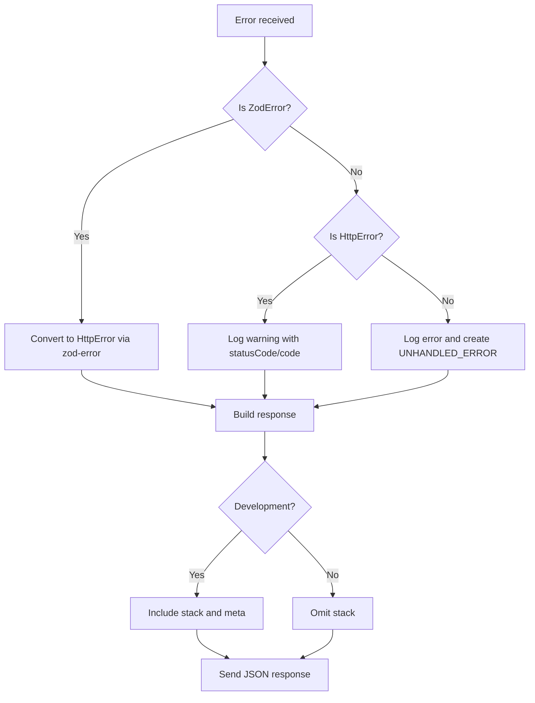
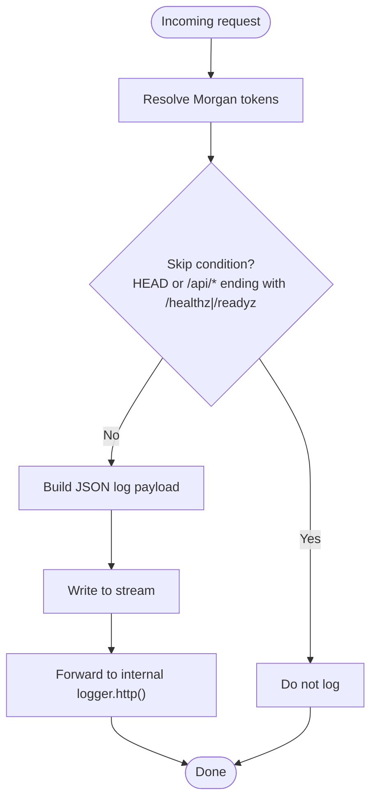
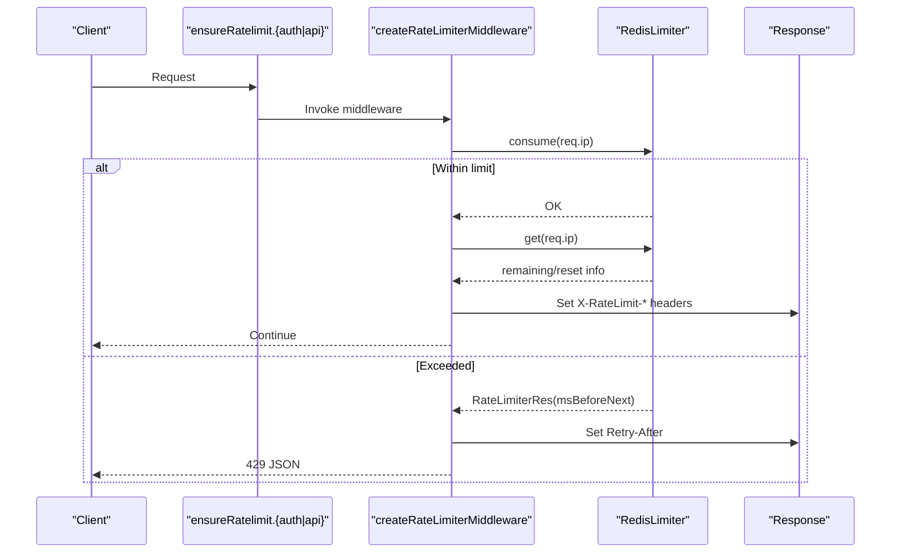
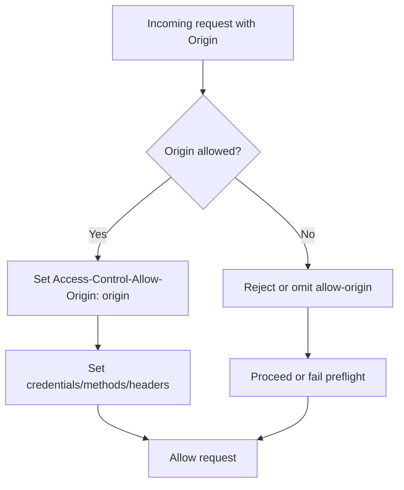
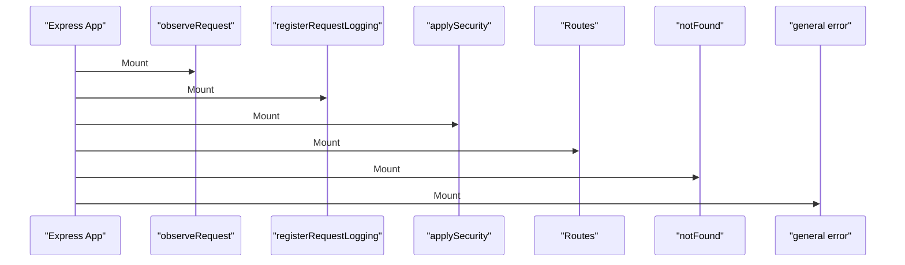
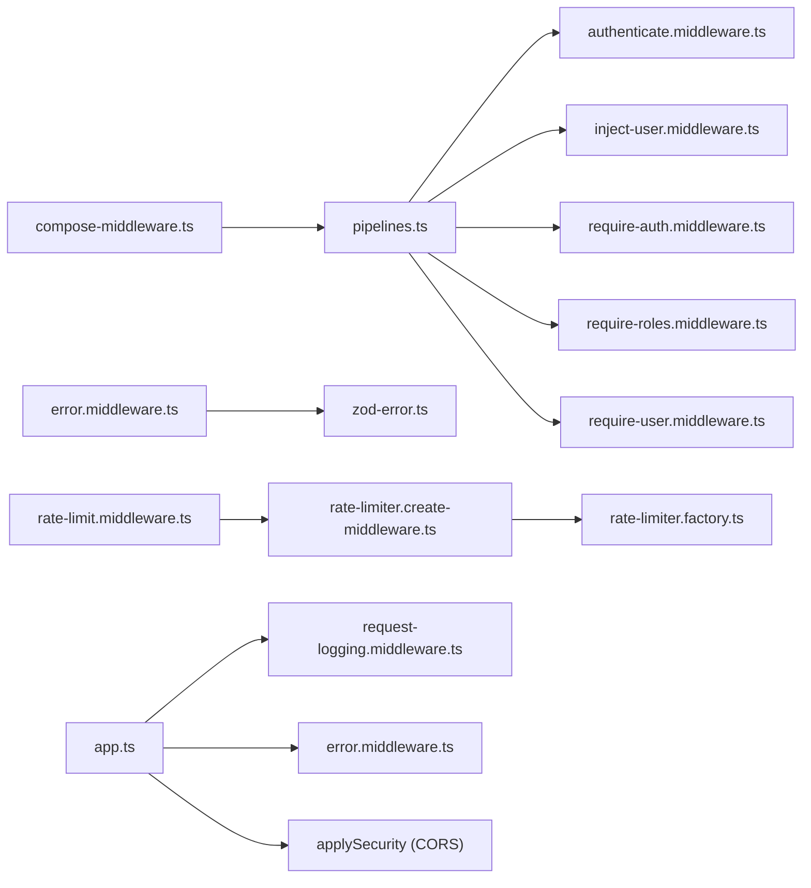

# Middleware System

<cite>
**Referenced Files in This Document**
- [index.ts](file://server/src/core/middlewares/index.ts)
- [pipelines.ts](file://server/src/core/middlewares/pipelines.ts)
- [compose-middleware.ts](file://server/src/lib/compose-middleware.ts)
- [authenticate.middleware.ts](file://server/src/core/middlewares/auth/authenticate.middleware.ts)
- [inject-user.middleware.ts](file://server/src/core/middlewares/auth/inject-user.middleware.ts)
- [require-auth.middleware.ts](file://server/src/core/middlewares/auth/require-auth.middleware.ts)
- [require-roles.middleware.ts](file://server/src/core/middlewares/auth/require-roles.middleware.ts)
- [require-user.middleware.ts](file://server/src/core/middlewares/auth/require-user.middleware.ts)
- [stop-banned-user.middleware.ts](file://server/src/core/middlewares/auth/stop-banned-user.middleware.ts)
- [context.middleware.ts](file://server/src/core/middlewares/context.middleware.ts)
- [error.middleware.ts](file://server/src/core/middlewares/error/error.middleware.ts)
- [zod-error.ts](file://server/src/core/middlewares/error/zod-error.ts)
- [request-logging.middleware.ts](file://server/src/core/middlewares/request-logging.middleware.ts)
- [rate-limit.middleware.ts](file://server/src/core/middlewares/rate-limit.middleware.ts)
- [rate-limiter.create-middleware.ts](file://server/src/infra/services/rate-limiter/rate-limiter.create-middleware.ts)
- [rate-limiter.factory.ts](file://server/src/infra/services/rate-limiter/rate-limiter.factory.ts)
- [cors.ts](file://server/src/config/cors.ts)
- [app.ts](file://server/src/app.ts)
</cite>

## Table of Contents
1. [Introduction](#introduction)
2. [Project Structure](#project-structure)
3. [Core Components](#core-components)
4. [Architecture Overview](#architecture-overview)
5. [Detailed Component Analysis](#detailed-component-analysis)
6. [Dependency Analysis](#dependency-analysis)
7. [Performance Considerations](#performance-considerations)
8. [Troubleshooting Guide](#troubleshooting-guide)
9. [Conclusion](#conclusion)
10. [Appendices](#appendices)

## Introduction
This document explains the middleware architecture of the backend service. It covers the middleware pipeline design, the authentication middleware chain, error handling middleware, request logging, rate limiting, and CORS configuration. It also details the execution order, interactions between middleware types, and provides practical guidance for creating custom middleware, implementing authentication flows, propagating errors, optimizing performance, and debugging middleware behavior.

## Project Structure
The middleware system resides under the server module and is composed of:
- Authentication middleware set for session retrieval, user injection, role checks, and permission enforcement
- Pipeline composition utilities to assemble reusable middleware sequences
- Request logging via Morgan with structured log forwarding
- Rate limiting backed by Redis
- Global error handling for HTTP and Zod errors
- CORS configuration applied at the security layer

```mermaid
graph TB
subgraph "Express App"
A["express() app"]
B["observeRequest (context)"]
C["registerRequestLogging (Morgan)"]
D["applySecurity (CORS, helmet, etc.)"]
E["registerRoutes()"]
F["errorHandlers.notFound"]
G["errorHandlers.general"]
end
subgraph "Pipelines"
P1["identity"]
P2["authenticated"]
P3["withRequiredUserContext"]
P4["withOptionalUserContext"]
P5["checkUserContext"]
P6["adminOnly"]
end
A --> B --> C --> D --> E --> F --> G
P1 --> P2 --> P3 --> P4 --> P5 --> P6
```

**Diagram sources**
- [app.ts](file://server/src/app.ts#L10-L33)
- [pipelines.ts](file://server/src/core/middlewares/pipelines.ts#L1-L28)

**Section sources**
- [app.ts](file://server/src/app.ts#L10-L33)
- [index.ts](file://server/src/core/middlewares/index.ts#L1-L15)

## Core Components
- Middleware composition engine: a small recursive runner that executes middleware in sequence until completion or error.
- Authentication chain: optional session retrieval, followed by user injection and onboarded user checks.
- Pipelines: prebuilt compositions for common patterns (identity, authenticated, with user context, admin-only).
- Request logging: Morgan-based structured logging with filtering and forwarding to the internal logger.
- Rate limiting: IP-based limits with Redis-backed counters and standardized response headers.
- Error handling: centralized handler for Zod and HTTP errors, plus a not-found terminator.
- CORS: origin-controlled cross-origin policy with credentials and allowed methods/headers.

**Section sources**
- [compose-middleware.ts](file://server/src/lib/compose-middleware.ts#L1-L20)
- [pipelines.ts](file://server/src/core/middlewares/pipelines.ts#L1-L28)
- [request-logging.middleware.ts](file://server/src/core/middlewares/request-logging.middleware.ts#L1-L40)
- [rate-limit.middleware.ts](file://server/src/core/middlewares/rate-limit.middleware.ts#L1-L12)
- [error.middleware.ts](file://server/src/core/middlewares/error/error.middleware.ts#L1-L68)
- [cors.ts](file://server/src/config/cors.ts#L1-L13)

## Architecture Overview
The Express app initializes middleware in a specific order to ensure context availability, logging, security, routing, and robust error handling. Pipelines encapsulate common authentication and authorization sequences, enabling route handlers to focus on business logic.

**Diagram sources**
- [app.ts](file://server/src/app.ts#L10-L33)
- [error.middleware.ts](file://server/src/core/middlewares/error/error.middleware.ts#L55-L64)

## Detailed Component Analysis

### Middleware Pipeline Design
The composition utility runs middleware sequentially, passing control to the next in the chain until completion or an error is thrown. This enables building reusable pipelines for common flows.

**Diagram sources**
- [compose-middleware.ts](file://server/src/lib/compose-middleware.ts#L3-L17)

**Section sources**
- [compose-middleware.ts](file://server/src/lib/compose-middleware.ts#L1-L20)
- [pipelines.ts](file://server/src/core/middlewares/pipelines.ts#L1-L28)

### Authentication Middleware Chain
The authentication chain performs:
- Optional session retrieval and attaches auth/session to the request
- Optional user injection and onboarding checks
- Required authentication enforcement
- Role-based restrictions

Key behaviors:
- Optional authentication: session retrieval without failing if absent
- User injection: auto-create user profile if needed, handle constraint violations, and audit creation
- Onboarding requirement: reject requests from incomplete profiles
- Role enforcement: restrict endpoints to admins

**Diagram sources**
- [authenticate.middleware.ts](file://server/src/core/middlewares/auth/authenticate.middleware.ts#L8-L26)
- [inject-user.middleware.ts](file://server/src/core/middlewares/auth/inject-user.middleware.ts#L12-L68)
- [require-auth.middleware.ts](file://server/src/core/middlewares/auth/require-auth.middleware.ts#L4-L10)
- [require-roles.middleware.ts](file://server/src/core/middlewares/auth/require-roles.middleware.ts)
- [require-user.middleware.ts](file://server/src/core/middlewares/auth/require-user.middleware.ts)

**Section sources**
- [authenticate.middleware.ts](file://server/src/core/middlewares/auth/authenticate.middleware.ts#L1-L27)
- [inject-user.middleware.ts](file://server/src/core/middlewares/auth/inject-user.middleware.ts#L1-L71)
- [require-auth.middleware.ts](file://server/src/core/middlewares/auth/require-auth.middleware.ts#L1-L13)
- [require-roles.middleware.ts](file://server/src/core/middlewares/auth/require-roles.middleware.ts)
- [require-user.middleware.ts](file://server/src/core/middlewares/auth/require-user.middleware.ts)
- [pipelines.ts](file://server/src/core/middlewares/pipelines.ts#L8-L27)

### Error Handling Middleware
The error handler:
- Detects Zod validation errors and converts them to HTTP errors
- Logs warnings for HTTP errors and logs unexpected exceptions
- Returns standardized JSON responses with operational messages in production
- Provides developer-friendly metadata in development

**Diagram sources**
- [error.middleware.ts](file://server/src/core/middlewares/error/error.middleware.ts#L9-L53)
- [zod-error.ts](file://server/src/core/middlewares/error/zod-error.ts)

**Section sources**
- [error.middleware.ts](file://server/src/core/middlewares/error/error.middleware.ts#L1-L68)
- [zod-error.ts](file://server/src/core/middlewares/error/zod-error.ts)

### Request Logging System
The logging middleware:
- Uses Morgan to produce structured JSON logs
- Skips noisy endpoints (health checks) and HEAD requests
- Forwards parsed logs to the internal logger
- Attaches request ID and remote address tokens

**Diagram sources**
- [request-logging.middleware.ts](file://server/src/core/middlewares/request-logging.middleware.ts#L22-L39)

**Section sources**
- [request-logging.middleware.ts](file://server/src/core/middlewares/request-logging.middleware.ts#L1-L40)

### Rate Limiting Implementation
The rate limiter:
- Consumes points per client IP using Redis-backed limiter
- Sets X-RateLimit-* headers when available
- Returns 429 with Retry-After header when limits are exceeded
- Propagates internal errors (e.g., Redis connectivity) to the general error handler

**Diagram sources**
- [rate-limit.middleware.ts](file://server/src/core/middlewares/rate-limit.middleware.ts#L6-L11)
- [rate-limiter.create-middleware.ts](file://server/src/infra/services/rate-limiter/rate-limiter.create-middleware.ts#L6-L42)
- [rate-limiter.factory.ts](file://server/src/infra/services/rate-limiter/rate-limiter.factory.ts#L26-L40)

**Section sources**
- [rate-limit.middleware.ts](file://server/src/core/middlewares/rate-limit.middleware.ts#L1-L12)
- [rate-limiter.create-middleware.ts](file://server/src/infra/services/rate-limiter/rate-limiter.create-middleware.ts#L1-L43)
- [rate-limiter.factory.ts](file://server/src/infra/services/rate-limiter/rate-limiter.factory.ts#L1-L41)

### CORS Configuration
CORS is configured with:
- Dynamic origins from environment
- Credentials support
- Allowed methods and headers
- Preflight success status

**Diagram sources**
- [cors.ts](file://server/src/config/cors.ts#L4-L10)

**Section sources**
- [cors.ts](file://server/src/config/cors.ts#L1-L13)

### Middleware Execution Order
The app mounts middleware in this order:
1. Context: attach request identifiers and metadata
2. Logging: structured request logs
3. Security: CORS and related headers
4. Routes: application endpoints
5. Not found: terminate unmatched routes with 404
6. General error: catch-all error handler

**Diagram sources**
- [app.ts](file://server/src/app.ts#L20-L27)

**Section sources**
- [app.ts](file://server/src/app.ts#L10-L33)

### Practical Examples

- Custom middleware creation
  - Use the composition utility to chain your own middleware functions. See [compose-middleware.ts](file://server/src/lib/compose-middleware.ts#L3-L17).
  - Export your middleware from a dedicated file and integrate via pipelines or route-specific mounting.

- Authentication flow
  - For optional context: use the identity pipeline to attach session data without enforcing auth.
  - For required context: use withRequiredUserContext to enforce authentication and onboarded user state.
  - For admin-only endpoints: use adminOnly to enforce role gating.
  - See [pipelines.ts](file://server/src/core/middlewares/pipelines.ts#L8-L27).

- Error propagation
  - Throw HttpError instances to propagate controlled errors; they will be normalized by the general error handler.
  - Zod errors are automatically converted to HTTP errors.
  - See [error.middleware.ts](file://server/src/core/middlewares/error/error.middleware.ts#L9-L53).

- Rate limiting integration
  - Wrap route handlers or groups with ensureRatelimit.auth or ensureRatelimit.api.
  - Inspect X-RateLimit-* headers and Retry-After on 429 responses.
  - See [rate-limit.middleware.ts](file://server/src/core/middlewares/rate-limit.middleware.ts#L6-L11).

- Request logging
  - Structured logs are forwarded to the internal logger; skip conditions avoid noise for health endpoints.
  - See [request-logging.middleware.ts](file://server/src/core/middlewares/request-logging.middleware.ts#L22-L39).

## Dependency Analysis
The middleware system exhibits low coupling and high cohesion:
- Pipelines depend on composition and individual middleware functions
- Authentication middleware depends on the auth adapter and user repository
- Error handling depends on HTTP error types and Zod error conversion
- Rate limiting depends on Redis and the rate limiter factory
- CORS is configured centrally and applied by the security layer

**Diagram sources**
- [compose-middleware.ts](file://server/src/lib/compose-middleware.ts#L1-L20)
- [pipelines.ts](file://server/src/core/middlewares/pipelines.ts#L1-L28)
- [error.middleware.ts](file://server/src/core/middlewares/error/error.middleware.ts#L1-L68)
- [rate-limit.middleware.ts](file://server/src/core/middlewares/rate-limit.middleware.ts#L1-L12)
- [rate-limiter.create-middleware.ts](file://server/src/infra/services/rate-limiter/rate-limiter.create-middleware.ts#L1-L43)
- [rate-limiter.factory.ts](file://server/src/infra/services/rate-limiter/rate-limiter.factory.ts#L1-L41)
- [request-logging.middleware.ts](file://server/src/core/middlewares/request-logging.middleware.ts#L1-L40)
- [app.ts](file://server/src/app.ts#L1-L33)

**Section sources**
- [index.ts](file://server/src/core/middlewares/index.ts#L1-L15)
- [app.ts](file://server/src/app.ts#L10-L33)

## Performance Considerations
- Prefer optional authentication where feasible to minimize overhead for public endpoints.
- Use pipelines to reuse validated contexts and avoid repeated checks.
- Enable rate limiting early in the pipeline to protect downstream services.
- Keep logging selective (skip health endpoints) to reduce I/O overhead.
- Ensure Redis connectivity for rate limiting to avoid unnecessary retries.
- Cache user lookups during injection to reduce database load.

## Troubleshooting Guide
- Authentication failures
  - Verify session retrieval and cookie handling in the authenticate middleware.
  - Confirm user injection logic and constraint handling for profile creation.
  - Check role and onboarded user requirements for admin endpoints.

- Error handling
  - Review the general error handler for logged codes and messages.
  - Ensure Zod errors are converted to HttpError consistently.

- Logging
  - Confirm Morgan stream forwards logs to the internal logger.
  - Adjust skip conditions for noisy endpoints if needed.

- Rate limiting
  - Validate Redis connectivity and limiter configuration.
  - Inspect X-RateLimit-* headers and Retry-After on 429 responses.

- CORS
  - Verify allowed origins and credentials configuration.
  - Check preflight behavior for cross-origin requests.

**Section sources**
- [inject-user.middleware.ts](file://server/src/core/middlewares/auth/inject-user.middleware.ts#L46-L56)
- [error.middleware.ts](file://server/src/core/middlewares/error/error.middleware.ts#L23-L37)
- [request-logging.middleware.ts](file://server/src/core/middlewares/request-logging.middleware.ts#L32-L39)
- [rate-limiter.create-middleware.ts](file://server/src/infra/services/rate-limiter/rate-limiter.create-middleware.ts#L21-L41)
- [cors.ts](file://server/src/config/cors.ts#L4-L10)

## Conclusion
The middleware system provides a clean, composable foundation for authentication, logging, rate limiting, and error handling. By leveraging pipelines and a consistent composition model, developers can implement secure, observable, and resilient APIs while maintaining predictable performance characteristics.

## Appendices
- Middleware export surface: see [index.ts](file://server/src/core/middlewares/index.ts#L1-L15)
- Application bootstrap and middleware mounting: see [app.ts](file://server/src/app.ts#L10-L33)