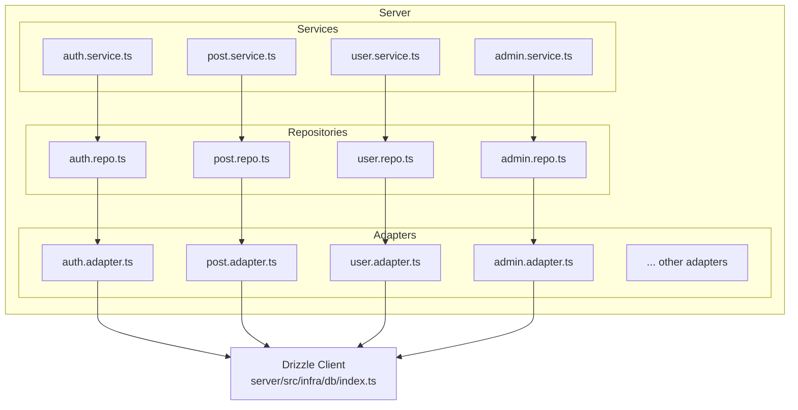
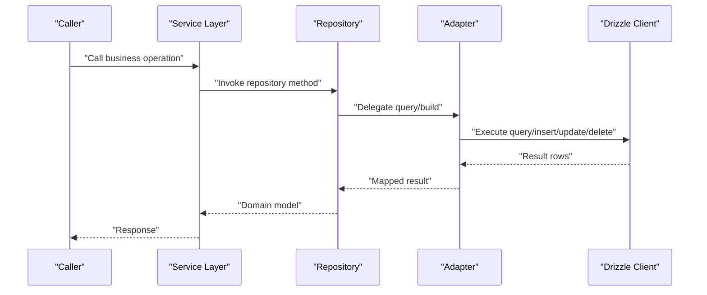
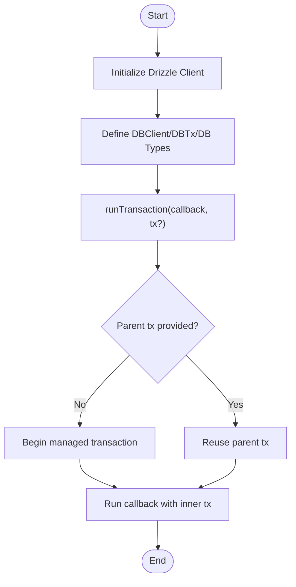
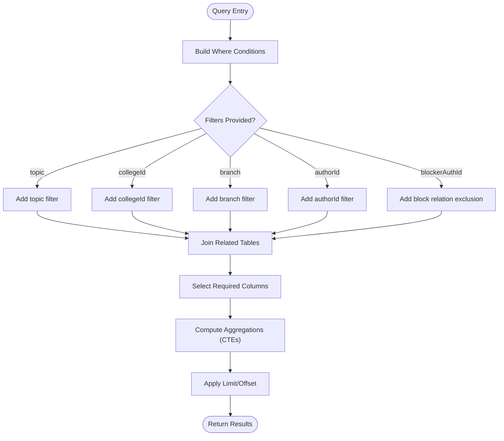
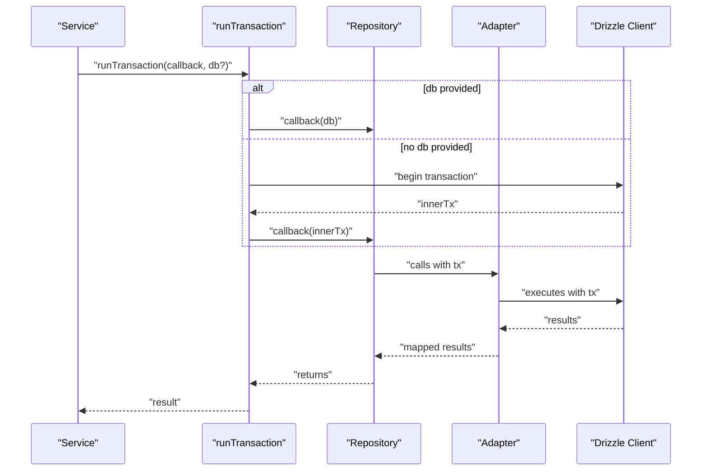
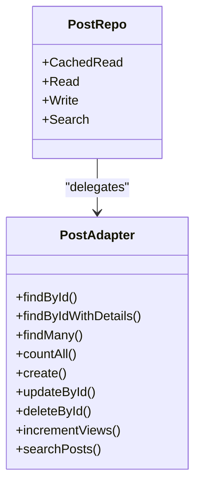
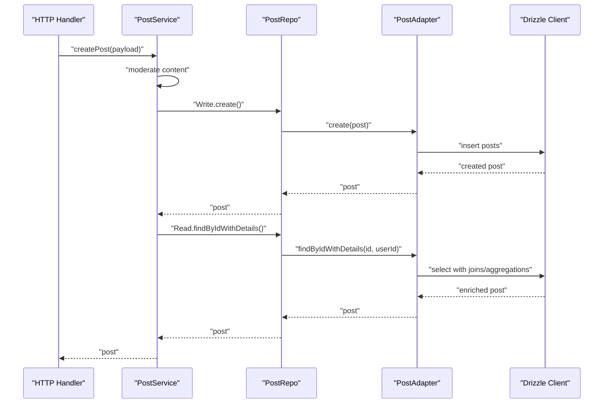
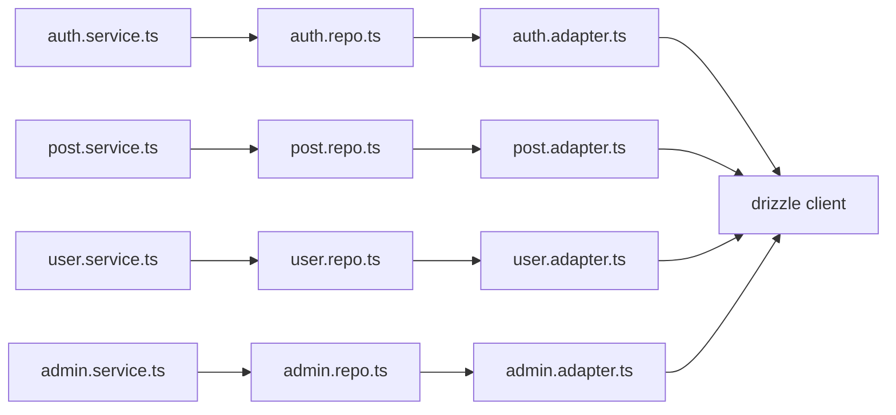

# Repository Pattern

<cite>
**Referenced Files in This Document**
- [index.ts](file://server/src/infra/db/index.ts)
- [types.ts](file://server/src/infra/db/types.ts)
- [transactions.ts](file://server/src/infra/db/transactions.ts)
- [auth.adapter.ts](file://server/src/infra/db/adapters/auth.adapter.ts)
- [post.adapter.ts](file://server/src/infra/db/adapters/post.adapter.ts)
- [user.adapter.ts](file://server/src/infra/db/adapters/user.adapter.ts)
- [admin.adapter.ts](file://server/src/infra/db/adapters/admin.adapter.ts)
- [audit-log.adapter.ts](file://server/src/infra/db/adapters/audit-log.adapter.ts)
- [bookmark.adapter.ts](file://server/src/infra/db/adapters/bookmark.adapter.ts)
- [college.adapter.ts](file://server/src/infra/db/adapters/college.adapter.ts)
- [comment.adapter.ts](file://server/src/infra/db/adapters/comment.adapter.ts)
- [content-report.adapter.ts](file://server/src/infra/db/adapters/content-report.adapter.ts)
- [feedback.adapter.ts](file://server/src/infra/db/adapters/feedback.adapter.ts)
- [notification.adapter.ts](file://server/src/infra/db/adapters/notification.adapter.ts)
- [vote.adapter.ts](file://server/src/infra/db/adapters/vote.adapter.ts)
- [auth.repo.ts](file://server/src/modules/auth/auth.repo.ts)
- [post.repo.ts](file://server/src/modules/post/post.repo.ts)
- [user.repo.ts](file://server/src/modules/user/user.repo.ts)
- [admin.repo.ts](file://server/src/modules/admin/admin.repo.ts)
- [auth.service.ts](file://server/src/modules/auth/auth.service.ts)
- [post.service.ts](file://server/src/modules/post/post.service.ts)
- [user.service.ts](file://server/src/modules/user/user.service.ts)
- [admin.service.ts](file://server/src/modules/admin/admin.service.ts)
</cite>

## Table of Contents
1. [Introduction](#introduction)
2. [Project Structure](#project-structure)
3. [Core Components](#core-components)
4. [Architecture Overview](#architecture-overview)
5. [Detailed Component Analysis](#detailed-component-analysis)
6. [Dependency Analysis](#dependency-analysis)
7. [Performance Considerations](#performance-considerations)
8. [Troubleshooting Guide](#troubleshooting-guide)
9. [Conclusion](#conclusion)

## Introduction
This document explains the repository pattern implementation in the backend server module. It covers the data access abstraction layer built on top of Drizzle ORM, the adapter pattern used to encapsulate database queries, query building strategies, result mapping, transaction management, and the relationship between repositories and services. It also provides guidance on performance optimization, connection pooling, and error handling strategies.

## Project Structure
The repository pattern is implemented per domain module with three layers:
- Adapter layer: Encapsulates all database operations for a domain entity using Drizzle ORM.
- Repository layer: Exposes a clean interface for reads, writes, cached reads, and specialized operations.
- Service layer: Orchestrates business logic, coordinates repository calls, and manages transactions.

**Diagram sources**
- [index.ts](file://server/src/infra/db/index.ts#L1-L40)
- [auth.adapter.ts](file://server/src/infra/db/adapters/auth.adapter.ts#L1-L190)
- [post.adapter.ts](file://server/src/infra/db/adapters/post.adapter.ts#L1-L661)
- [user.adapter.ts](file://server/src/infra/db/adapters/user.adapter.ts#L1-L537)
- [admin.adapter.ts](file://server/src/infra/db/adapters/admin.adapter.ts#L1-L200)
- [auth.repo.ts](file://server/src/modules/auth/auth.repo.ts#L1-L50)
- [post.repo.ts](file://server/src/modules/post/post.repo.ts#L1-L147)
- [user.repo.ts](file://server/src/modules/user/user.repo.ts#L1-L67)
- [admin.repo.ts](file://server/src/modules/admin/admin.repo.ts#L1-L60)
- [auth.service.ts](file://server/src/modules/auth/auth.service.ts#L1-L921)
- [post.service.ts](file://server/src/modules/post/post.service.ts#L1-L451)
- [user.service.ts](file://server/src/modules/user/user.service.ts#L1-L137)
- [admin.service.ts](file://server/src/modules/admin/admin.service.ts#L1-L207)

**Section sources**
- [index.ts](file://server/src/infra/db/index.ts#L1-L40)
- [auth.repo.ts](file://server/src/modules/auth/auth.repo.ts#L1-L50)
- [post.repo.ts](file://server/src/modules/post/post.repo.ts#L1-L147)
- [user.repo.ts](file://server/src/modules/user/user.repo.ts#L1-L67)
- [admin.repo.ts](file://server/src/modules/admin/admin.repo.ts#L1-L60)
- [auth.adapter.ts](file://server/src/infra/db/adapters/auth.adapter.ts#L1-L190)
- [post.adapter.ts](file://server/src/infra/db/adapters/post.adapter.ts#L1-L661)
- [user.adapter.ts](file://server/src/infra/db/adapters/user.adapter.ts#L1-L537)
- [admin.adapter.ts](file://server/src/infra/db/adapters/admin.adapter.ts#L1-L200)
- [auth.service.ts](file://server/src/modules/auth/auth.service.ts#L1-L921)
- [post.service.ts](file://server/src/modules/post/post.service.ts#L1-L451)
- [user.service.ts](file://server/src/modules/user/user.service.ts#L1-L137)
- [admin.service.ts](file://server/src/modules/admin/admin.service.ts#L1-L207)

## Core Components
- Drizzle client initialization defines the schema and exposes a typed client for database operations.
- Transaction utilities provide a unified way to run operations inside or reuse an existing transaction.
- Adapters encapsulate all SQL logic for a domain entity, including joins, aggregations, and filtering.
- Repositories expose a structured API grouped by Read, Write, CachedRead, and specialized namespaces.
- Services orchestrate business logic, call repositories, and coordinate caching and auditing.

**Section sources**
- [index.ts](file://server/src/infra/db/index.ts#L1-L40)
- [types.ts](file://server/src/infra/db/types.ts#L1-L11)
- [transactions.ts](file://server/src/infra/db/transactions.ts#L1-L20)
- [auth.adapter.ts](file://server/src/infra/db/adapters/auth.adapter.ts#L1-L190)
- [post.adapter.ts](file://server/src/infra/db/adapters/post.adapter.ts#L1-L661)
- [user.adapter.ts](file://server/src/infra/db/adapters/user.adapter.ts#L1-L537)
- [auth.repo.ts](file://server/src/modules/auth/auth.repo.ts#L1-L50)
- [post.repo.ts](file://server/src/modules/post/post.repo.ts#L1-L147)
- [user.repo.ts](file://server/src/modules/user/user.repo.ts#L1-L67)

## Architecture Overview
The repository pattern isolates data access concerns behind adapters and repositories, while services remain agnostic of the underlying persistence mechanism. Transactions are centralized and reusable across repositories.

**Diagram sources**
- [auth.service.ts](file://server/src/modules/auth/auth.service.ts#L1-L921)
- [auth.repo.ts](file://server/src/modules/auth/auth.repo.ts#L1-L50)
- [auth.adapter.ts](file://server/src/infra/db/adapters/auth.adapter.ts#L1-L190)
- [index.ts](file://server/src/infra/db/index.ts#L1-L40)

## Detailed Component Analysis

### Data Access Abstraction Layer
- Drizzle client initialization binds the schema and exposes a typed client for queries and mutations.
- Types define DBClient, DBTx, and DB union to accept either a transaction or a client.
- Transaction helper runs callbacks inside a managed transaction or reuses an existing parent transaction.

**Diagram sources**
- [index.ts](file://server/src/infra/db/index.ts#L1-L40)
- [types.ts](file://server/src/infra/db/types.ts#L1-L11)
- [transactions.ts](file://server/src/infra/db/transactions.ts#L1-L20)

**Section sources**
- [index.ts](file://server/src/infra/db/index.ts#L1-L40)
- [types.ts](file://server/src/infra/db/types.ts#L1-L11)
- [transactions.ts](file://server/src/infra/db/transactions.ts#L1-L20)

### Adapter Pattern Usage
- Each domain module has a dedicated adapter that encapsulates:
  - Typed CRUD operations
  - Complex joins and aggregations
  - Filtering and pagination logic
  - Specialized search and reporting queries
- Adapters accept an optional DB argument to reuse an existing transaction.

Examples of adapter responsibilities:
- Authentication adapter: find by id/email, create/update/delete, search users, admin listing with counts.
- Post adapter: findById, findByIdWithDetails, findMany with filters, counts, searchPosts, incrementViews.
- User adapter: findById/byAuthId/byUsername with include options, create/update/delete, karma updates, block/unblock relations.
- Admin adapter: manage users, reports, colleges, requests, logs, feedbacks.

**Section sources**
- [auth.adapter.ts](file://server/src/infra/db/adapters/auth.adapter.ts#L1-L190)
- [post.adapter.ts](file://server/src/infra/db/adapters/post.adapter.ts#L1-L661)
- [user.adapter.ts](file://server/src/infra/db/adapters/user.adapter.ts#L1-L537)
- [admin.adapter.ts](file://server/src/infra/db/adapters/admin.adapter.ts#L1-L200)

### Query Building Strategies
- Conditional filters: adapters build dynamic where clauses based on provided options (e.g., topic, collegeId, branch, authorId, blockerAuthId).
- Aggregations via CTEs: post adapter computes upvote/downvote counts, user-specific votes, and comment counts using with/CTE constructs.
- Joined selects: adapters join related tables (users, colleges, votes, comments, bookmarks) and map to domain-friendly shapes.
- Pagination: adapters compute limits/offsets and return both items and total counts for metadata.

**Diagram sources**
- [post.adapter.ts](file://server/src/infra/db/adapters/post.adapter.ts#L167-L373)
- [user.adapter.ts](file://server/src/infra/db/adapters/user.adapter.ts#L1-L537)

**Section sources**
- [post.adapter.ts](file://server/src/infra/db/adapters/post.adapter.ts#L167-L373)
- [user.adapter.ts](file://server/src/infra/db/adapters/user.adapter.ts#L1-L537)

### Result Mapping
- Adapters return normalized domain-like objects, mapping database columns to logical fields (e.g., author info, counts, flags).
- For example, post adapter maps aggregated vote counts, user-specific vote, comment counts, bookmark presence, and author/college details into a cohesive shape.

**Section sources**
- [post.adapter.ts](file://server/src/infra/db/adapters/post.adapter.ts#L28-L165)

### Transaction Management
- Centralized transaction runner accepts a callback and an optional parent transaction.
- If a parent is present, it reuses it; otherwise, it starts a managed transaction and passes an inner transaction to the callback.
- Services can wrap multiple repository calls in a single transaction by passing the same DB instance.

**Diagram sources**
- [transactions.ts](file://server/src/infra/db/transactions.ts#L1-L20)
- [auth.service.ts](file://server/src/modules/auth/auth.service.ts#L1-L921)

**Section sources**
- [transactions.ts](file://server/src/infra/db/transactions.ts#L1-L20)
- [auth.service.ts](file://server/src/modules/auth/auth.service.ts#L1-L921)

### Repository Implementations
- Grouped namespaces:
  - Read: simple fetches and listings
  - Write: create/update/delete/increment operations
  - CachedRead: memoized reads with cache keys
  - Specialized namespaces: e.g., Post.Search, User.Blocks
- Example: PostRepo exposes CachedRead.findMany/countAll, Read.findByIdWithDetails, Write.incrementViews, and Search.searchPosts.

**Diagram sources**
- [post.repo.ts](file://server/src/modules/post/post.repo.ts#L1-L147)
- [post.adapter.ts](file://server/src/infra/db/adapters/post.adapter.ts#L1-L661)

**Section sources**
- [post.repo.ts](file://server/src/modules/post/post.repo.ts#L1-L147)
- [user.repo.ts](file://server/src/modules/user/user.repo.ts#L1-L67)
- [auth.repo.ts](file://server/src/modules/auth/auth.repo.ts#L1-L50)
- [admin.repo.ts](file://server/src/modules/admin/admin.repo.ts#L1-L60)

### Relationship Between Repositories and Services
- Services depend on repositories to access data, keeping business logic separate from persistence.
- Repositories depend on adapters for SQL logic and optionally on transactions for atomicity.
- Example flows:
  - PostService.createPost validates content, persists via PostRepo.Write.create, and returns enriched data via PostRepo.Read.findByIdWithDetails.
  - UserService.updateUserProfile updates via UserRepo.Write.updateById and invalidates caches.
  - AdminService orchestrates AdminRepo.Read and AdminRepo.Write for administrative tasks.

**Diagram sources**
- [post.service.ts](file://server/src/modules/post/post.service.ts#L1-L451)
- [post.repo.ts](file://server/src/modules/post/post.repo.ts#L1-L147)
- [post.adapter.ts](file://server/src/infra/db/adapters/post.adapter.ts#L1-L661)

**Section sources**
- [post.service.ts](file://server/src/modules/post/post.service.ts#L1-L451)
- [user.service.ts](file://server/src/modules/user/user.service.ts#L1-L137)
- [admin.service.ts](file://server/src/modules/admin/admin.service.ts#L1-L207)
- [auth.service.ts](file://server/src/modules/auth/auth.service.ts#L1-L921)

### Complex Queries and Examples
- Post listing with privacy, filters, and block checks:
  - Filters include topic, collegeId, branch, authorId, and blockerAuthId to exclude blocked users.
  - Uses joins with users and colleges, and applies private visibility rules.
- Post search with pagination and counts:
  - Full-text-like matching on title/content with ILIKE and pagination.
  - Returns both items and total count for metadata.
- User blocking relations:
  - Detects bidirectional block relations and returns blocked users for a given user.

**Section sources**
- [post.adapter.ts](file://server/src/infra/db/adapters/post.adapter.ts#L167-L373)
- [post.adapter.ts](file://server/src/infra/db/adapters/post.adapter.ts#L498-L660)
- [user.adapter.ts](file://server/src/infra/db/adapters/user.adapter.ts#L426-L537)

## Dependency Analysis
- Cohesion: Each adapter focuses on a single domain entity, increasing cohesion.
- Coupling: Repositories depend on adapters; services depend on repositories. Coupling is directed and controlled.
- External dependencies: Drizzle ORM, PostgreSQL driver, Redis for caching, Better Auth for auth integration.
- No circular dependencies observed among modules; adapters are leaf dependencies.

**Diagram sources**
- [auth.service.ts](file://server/src/modules/auth/auth.service.ts#L1-L921)
- [post.service.ts](file://server/src/modules/post/post.service.ts#L1-L451)
- [user.service.ts](file://server/src/modules/user/user.service.ts#L1-L137)
- [admin.service.ts](file://server/src/modules/admin/admin.service.ts#L1-L207)
- [auth.repo.ts](file://server/src/modules/auth/auth.repo.ts#L1-L50)
- [post.repo.ts](file://server/src/modules/post/post.repo.ts#L1-L147)
- [user.repo.ts](file://server/src/modules/user/user.repo.ts#L1-L67)
- [admin.repo.ts](file://server/src/modules/admin/admin.repo.ts#L1-L60)
- [auth.adapter.ts](file://server/src/infra/db/adapters/auth.adapter.ts#L1-L190)
- [post.adapter.ts](file://server/src/infra/db/adapters/post.adapter.ts#L1-L661)
- [user.adapter.ts](file://server/src/infra/db/adapters/user.adapter.ts#L1-L537)
- [admin.adapter.ts](file://server/src/infra/db/adapters/admin.adapter.ts#L1-L200)
- [index.ts](file://server/src/infra/db/index.ts#L1-L40)

**Section sources**
- [auth.service.ts](file://server/src/modules/auth/auth.service.ts#L1-L921)
- [post.service.ts](file://server/src/modules/post/post.service.ts#L1-L451)
- [user.service.ts](file://server/src/modules/user/user.service.ts#L1-L137)
- [admin.service.ts](file://server/src/modules/admin/admin.service.ts#L1-L207)
- [auth.repo.ts](file://server/src/modules/auth/auth.repo.ts#L1-L50)
- [post.repo.ts](file://server/src/modules/post/post.repo.ts#L1-L147)
- [user.repo.ts](file://server/src/modules/user/user.repo.ts#L1-L67)
- [admin.repo.ts](file://server/src/modules/admin/admin.repo.ts#L1-L60)
- [auth.adapter.ts](file://server/src/infra/db/adapters/auth.adapter.ts#L1-L190)
- [post.adapter.ts](file://server/src/infra/db/adapters/post.adapter.ts#L1-L661)
- [user.adapter.ts](file://server/src/infra/db/adapters/user.adapter.ts#L1-L537)
- [admin.adapter.ts](file://server/src/infra/db/adapters/admin.adapter.ts#L1-L200)
- [index.ts](file://server/src/infra/db/index.ts#L1-L40)

## Performance Considerations
- Connection pooling: Drizzle’s Node PostgreSQL driver manages connections; ensure DATABASE_URL is configured appropriately for production.
- Prepared statements and batching: Prefer adapter methods that reuse prepared queries and minimize round trips.
- Aggregation via CTEs: Use computed aggregates in adapters to avoid N+1 queries (e.g., post adapter’s CTE-based vote/comment counts).
- Pagination: Always apply limit/offset and compute totals efficiently; avoid loading entire datasets.
- Caching: Leverage CachedRead in repositories and cache invalidation in services to reduce database load.
- Indexing: Ensure database indexes exist on commonly filtered columns (e.g., posts.postedBy, users.authId, votes.targetId).
- Avoid N+1 selects: Use joins and precomputed aggregates in adapters.

[No sources needed since this section provides general guidance]

## Troubleshooting Guide
- Constraint violations: Services detect constraint violations and gracefully recover or return meaningful errors.
- Transaction failures: Use the centralized transaction runner to ensure rollback on errors; pass the same DB instance across repository calls.
- Orphan records: Adapters handle cleanup of related rows (e.g., verification rows when deleting auth).
- Audit logging: Services record audit events around sensitive operations for traceability.

**Section sources**
- [auth.service.ts](file://server/src/modules/auth/auth.service.ts#L1-L921)
- [auth.adapter.ts](file://server/src/infra/db/adapters/auth.adapter.ts#L43-L68)

## Conclusion
The repository pattern in this codebase cleanly separates data access concerns through adapters and repositories, with services orchestrating business logic. The adapter layer encapsulates complex queries, joins, and aggregations, while the repository layer offers a consistent API for reads, writes, and cached reads. Centralized transaction management ensures atomicity across operations, and caching reduces database load. Following the outlined strategies helps maintain scalability, readability, and reliability.