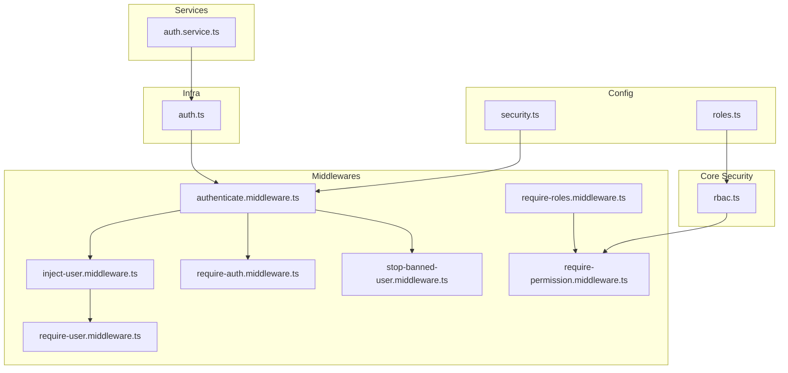
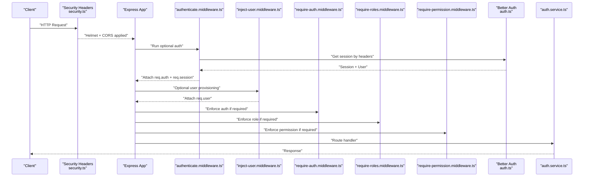
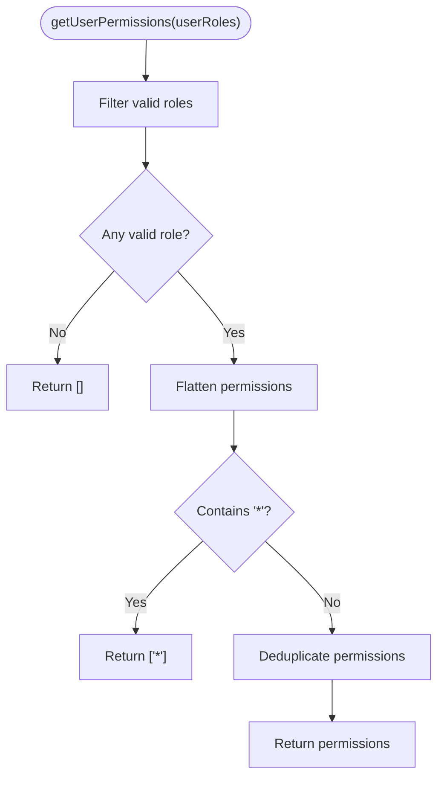
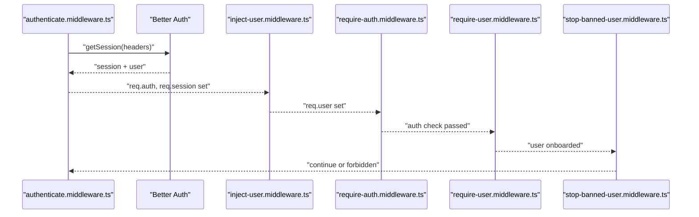
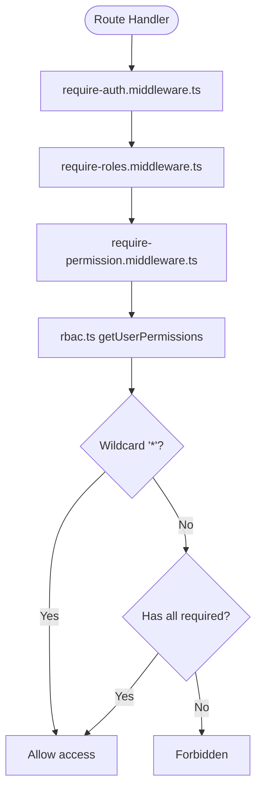
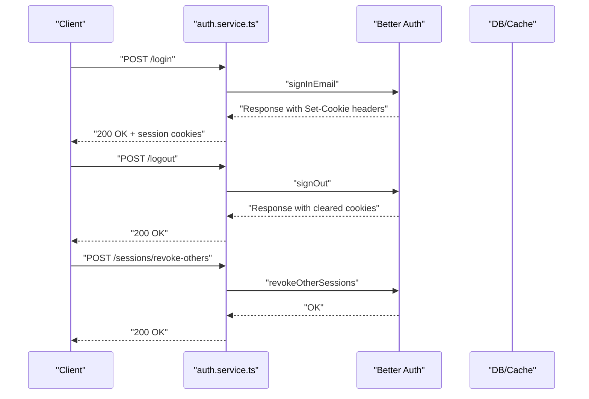
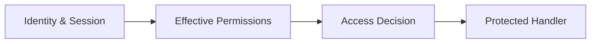
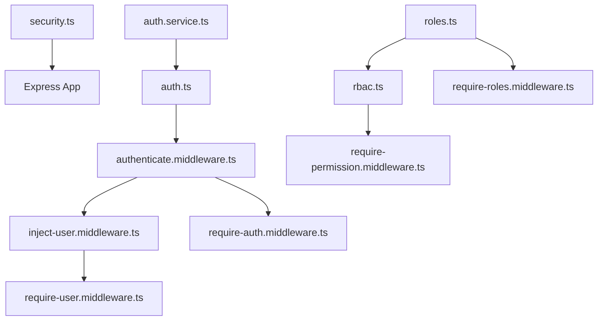

# Security Architecture

<cite>
**Referenced Files in This Document**
- [security.ts](file://server/src/config/security.ts)
- [roles.ts](file://server/src/config/roles.ts)
- [rbac.ts](file://server/src/core/security/rbac.ts)
- [authenticate.middleware.ts](file://server/src/core/middlewares/auth/authenticate.middleware.ts)
- [inject-user.middleware.ts](file://server/src/core/middlewares/auth/inject-user.middleware.ts)
- [require-auth.middleware.ts](file://server/src/core/middlewares/auth/require-auth.middleware.ts)
- [require-permission.middleware.ts](file://server/src/core/middlewares/auth/require-permission.middleware.ts)
- [require-roles.middleware.ts](file://server/src/core/middlewares/auth/require-roles.middleware.ts)
- [require-user.middleware.ts](file://server/src/core/middlewares/auth/require-user.middleware.ts)
- [stop-banned-user.middleware.ts](file://server/src/core/middlewares/auth/stop-banned-user.middleware.ts)
- [auth.ts](file://server/src/infra/auth/auth.ts)
- [auth.service.ts](file://server/src/modules/auth/auth.service.ts)
- [Auth.ts](file://server/src/shared/types/Auth.ts)
</cite>

## Table of Contents
1. [Introduction](#introduction)
2. [Project Structure](#project-structure)
3. [Core Components](#core-components)
4. [Architecture Overview](#architecture-overview)
5. [Detailed Component Analysis](#detailed-component-analysis)
6. [Dependency Analysis](#dependency-analysis)
7. [Performance Considerations](#performance-considerations)
8. [Troubleshooting Guide](#troubleshooting-guide)
9. [Conclusion](#conclusion)
10. [Appendices](#appendices)

## Introduction
This document explains the security architecture of the system with a focus on authentication, authorization, and session management. It details the role-based access control (RBAC) model, the middleware chain that enforces security policies, and the integration with Better Auth for identity and session handling. It also covers permission checking mechanisms, session lifecycle, and practical guidance for secure development and testing.

## Project Structure
Security-related code is organized across configuration, middleware, infrastructure, and service layers:
- Configuration: Security headers and CORS setup
- RBAC: Role-to-permissions mapping and lookup
- Middleware: Authentication, user injection, role checks, permission checks, and user state enforcement
- Infrastructure: Better Auth configuration and session cookies
- Services: Authentication workflows, OTP, password management, and session termination

**Diagram sources**
- [security.ts](file://server/src/config/security.ts#L1-L14)
- [roles.ts](file://server/src/config/roles.ts#L1-L11)
- [rbac.ts](file://server/src/core/security/rbac.ts#L1-L15)
- [authenticate.middleware.ts](file://server/src/core/middlewares/auth/authenticate.middleware.ts#L1-L27)
- [inject-user.middleware.ts](file://server/src/core/middlewares/auth/inject-user.middleware.ts#L1-L71)
- [require-auth.middleware.ts](file://server/src/core/middlewares/auth/require-auth.middleware.ts#L1-L13)
- [require-permission.middleware.ts](file://server/src/core/middlewares/auth/require-permission.middleware.ts#L1-L52)
- [require-roles.middleware.ts](file://server/src/core/middlewares/auth/require-roles.middleware.ts#L1-L44)
- [require-user.middleware.ts](file://server/src/core/middlewares/auth/require-user.middleware.ts#L1-L27)
- [stop-banned-user.middleware.ts](file://server/src/core/middlewares/auth/stop-banned-user.middleware.ts#L1-L23)
- [auth.ts](file://server/src/infra/auth/auth.ts#L1-L85)
- [auth.service.ts](file://server/src/modules/auth/auth.service.ts#L1-L921)

**Section sources**
- [security.ts](file://server/src/config/security.ts#L1-L14)
- [roles.ts](file://server/src/config/roles.ts#L1-L11)
- [rbac.ts](file://server/src/core/security/rbac.ts#L1-L15)
- [authenticate.middleware.ts](file://server/src/core/middlewares/auth/authenticate.middleware.ts#L1-L27)
- [inject-user.middleware.ts](file://server/src/core/middlewares/auth/inject-user.middleware.ts#L1-L71)
- [require-auth.middleware.ts](file://server/src/core/middlewares/auth/require-auth.middleware.ts#L1-L13)
- [require-permission.middleware.ts](file://server/src/core/middlewares/auth/require-permission.middleware.ts#L1-L52)
- [require-roles.middleware.ts](file://server/src/core/middlewares/auth/require-roles.middleware.ts#L1-L44)
- [require-user.middleware.ts](file://server/src/core/middlewares/auth/require-user.middleware.ts#L1-L27)
- [stop-banned-user.middleware.ts](file://server/src/core/middlewares/auth/stop-banned-user.middleware.ts#L1-L23)
- [auth.ts](file://server/src/infra/auth/auth.ts#L1-L85)
- [auth.service.ts](file://server/src/modules/auth/auth.service.ts#L1-L921)

## Core Components
- Security headers and CORS: Helmet and CORS applied globally to mitigate common web vulnerabilities and control cross-origin requests.
- RBAC model: Roles map to sets of permissions; a wildcard permission allows superuser behavior.
- Authentication middleware: Optional session retrieval and optional user injection for authenticated sessions.
- Authorization middleware: Enforce role-based and permission-based access checks.
- Session management: Better Auth handles sessions, cookies, and advanced controls like cross-subdomain cookies and cookie attributes.

**Section sources**
- [security.ts](file://server/src/config/security.ts#L6-L11)
- [roles.ts](file://server/src/config/roles.ts#L1-L11)
- [rbac.ts](file://server/src/core/security/rbac.ts#L4-L14)
- [authenticate.middleware.ts](file://server/src/core/middlewares/auth/authenticate.middleware.ts#L8-L26)
- [inject-user.middleware.ts](file://server/src/core/middlewares/auth/inject-user.middleware.ts#L12-L68)
- [require-auth.middleware.ts](file://server/src/core/middlewares/auth/require-auth.middleware.ts#L4-L10)
- [require-permission.middleware.ts](file://server/src/core/middlewares/auth/require-permission.middleware.ts#L7-L51)
- [require-roles.middleware.ts](file://server/src/core/middlewares/auth/require-roles.middleware.ts#L6-L43)
- [auth.ts](file://server/src/infra/auth/auth.ts#L61-L82)

## Architecture Overview
The security architecture integrates three pillars:
- Authentication: Better Auth validates identities and manages sessions.
- Authorization: RBAC resolves effective permissions per user and enforces checks.
- Resource Protection: Middlewares enforce auth, roles, permissions, and user state across routes.

**Diagram sources**
- [security.ts](file://server/src/config/security.ts#L6-L11)
- [authenticate.middleware.ts](file://server/src/core/middlewares/auth/authenticate.middleware.ts#L8-L26)
- [inject-user.middleware.ts](file://server/src/core/middlewares/auth/inject-user.middleware.ts#L12-L68)
- [require-auth.middleware.ts](file://server/src/core/middlewares/auth/require-auth.middleware.ts#L4-L10)
- [require-roles.middleware.ts](file://server/src/core/middlewares/auth/require-roles.middleware.ts#L6-L43)
- [require-permission.middleware.ts](file://server/src/core/middlewares/auth/require-permission.middleware.ts#L7-L51)
- [auth.ts](file://server/src/infra/auth/auth.ts#L11-L84)
- [auth.service.ts](file://server/src/modules/auth/auth.service.ts#L348-L462)

## Detailed Component Analysis

### Role-Based Access Control (RBAC)
- Roles and permissions:
  - user: read-only profile access
  - admin: profile read/write and user CRUD
  - superadmin: wildcard permission allowing unrestricted access
- Effective permission computation:
  - Validates provided roles against known roles
  - Flattens permissions; wildcard implies all permissions
  - Returns deduplicated permission set

**Diagram sources**
- [rbac.ts](file://server/src/core/security/rbac.ts#L4-L14)
- [roles.ts](file://server/src/config/roles.ts#L3-L7)

**Section sources**
- [roles.ts](file://server/src/config/roles.ts#L1-L11)
- [rbac.ts](file://server/src/core/security/rbac.ts#L4-L14)

### Authentication Middleware Chain
- Optional authentication:
  - Extracts session via Better Auth API using Node headers
  - Attaches session and user to request for downstream middleware
- User injection:
  - Provisions a platform user if missing and email is verified
  - Handles college association and audit logging
  - Ensures uniqueness and handles constraint violations gracefully
- Enforce authentication:
  - Throws unauthorized if required and no session present
- Enforce user state:
  - Requires onboarded user; rejects ONBOARDING status
- Ban enforcement:
  - Blocks banned users from accessing protected resources

**Diagram sources**
- [authenticate.middleware.ts](file://server/src/core/middlewares/auth/authenticate.middleware.ts#L8-L26)
- [inject-user.middleware.ts](file://server/src/core/middlewares/auth/inject-user.middleware.ts#L12-L68)
- [require-auth.middleware.ts](file://server/src/core/middlewares/auth/require-auth.middleware.ts#L4-L10)
- [require-user.middleware.ts](file://server/src/core/middlewares/auth/require-user.middleware.ts#L4-L24)
- [stop-banned-user.middleware.ts](file://server/src/core/middlewares/auth/stop-banned-user.middleware.ts#L4-L19)

**Section sources**
- [authenticate.middleware.ts](file://server/src/core/middlewares/auth/authenticate.middleware.ts#L8-L26)
- [inject-user.middleware.ts](file://server/src/core/middlewares/auth/inject-user.middleware.ts#L12-L68)
- [require-auth.middleware.ts](file://server/src/core/middlewares/auth/require-auth.middleware.ts#L4-L10)
- [require-user.middleware.ts](file://server/src/core/middlewares/auth/require-user.middleware.ts#L4-L24)
- [stop-banned-user.middleware.ts](file://server/src/core/middlewares/auth/stop-banned-user.middleware.ts#L4-L19)

### Authorization Patterns
- Role-based enforcement:
  - Validates presence of auth context
  - Checks if user’s role is among allowed roles
  - Logs and denies with forbidden on mismatch
- Permission-based enforcement:
  - Resolves effective permissions from roles
  - Supports wildcard for superuser
  - Ensures all required permissions are satisfied
- Composition:
  - Middleware chain composes role and permission checks
  - Optional authentication precedes authorization checks

**Diagram sources**
- [require-auth.middleware.ts](file://server/src/core/middlewares/auth/require-auth.middleware.ts#L4-L10)
- [require-roles.middleware.ts](file://server/src/core/middlewares/auth/require-roles.middleware.ts#L6-L43)
- [require-permission.middleware.ts](file://server/src/core/middlewares/auth/require-permission.middleware.ts#L7-L51)
- [rbac.ts](file://server/src/core/security/rbac.ts#L4-L14)

**Section sources**
- [require-roles.middleware.ts](file://server/src/core/middlewares/auth/require-roles.middleware.ts#L6-L43)
- [require-permission.middleware.ts](file://server/src/core/middlewares/auth/require-permission.middleware.ts#L7-L51)
- [rbac.ts](file://server/src/core/security/rbac.ts#L4-L14)

### Session Management
- Better Auth configuration:
  - Cookie cache with JWE/JWT strategy and refresh caching
  - Cross-subdomain cookies enabled
  - Secure, httpOnly, and SameSite attributes vary by environment
- Session lifecycle:
  - Login creates session and sets cookies
  - Logout revokes session and clears cookies
  - Revoking other sessions supports security hygiene
  - Terminating specific sessions enables targeted session control

**Diagram sources**
- [auth.ts](file://server/src/infra/auth/auth.ts#L61-L82)
- [auth.service.ts](file://server/src/modules/auth/auth.service.ts#L348-L462)
- [auth.service.ts](file://server/src/modules/auth/auth.service.ts#L571-L582)
- [auth.service.ts](file://server/src/modules/auth/auth.service.ts#L585-L608)

**Section sources**
- [auth.ts](file://server/src/infra/auth/auth.ts#L61-L82)
- [auth.service.ts](file://server/src/modules/auth/auth.service.ts#L348-L462)
- [auth.service.ts](file://server/src/modules/auth/auth.service.ts#L571-L582)
- [auth.service.ts](file://server/src/modules/auth/auth.service.ts#L585-L608)

### Relationship Between Authentication, Authorization, and Resource Protection
- Authentication establishes identity and session state.
- Authorization translates identity into permissions and enforces access rules.
- Resource protection is enforced by middleware at route boundaries, ensuring that only authorized requests reach handlers.

[No sources needed since this diagram shows conceptual workflow, not actual code structure]

## Dependency Analysis
- Configuration depends on environment variables and external libraries (Helmet, CORS).
- RBAC depends on role definitions.
- Middlewares depend on Better Auth for session retrieval and on RBAC for permission resolution.
- Services orchestrate Better Auth APIs and database operations for authentication workflows.

**Diagram sources**
- [security.ts](file://server/src/config/security.ts#L6-L11)
- [roles.ts](file://server/src/config/roles.ts#L1-L11)
- [rbac.ts](file://server/src/core/security/rbac.ts#L1-L15)
- [authenticate.middleware.ts](file://server/src/core/middlewares/auth/authenticate.middleware.ts#L1-L27)
- [inject-user.middleware.ts](file://server/src/core/middlewares/auth/inject-user.middleware.ts#L1-L71)
- [require-auth.middleware.ts](file://server/src/core/middlewares/auth/require-auth.middleware.ts#L1-L13)
- [require-permission.middleware.ts](file://server/src/core/middlewares/auth/require-permission.middleware.ts#L1-L52)
- [require-roles.middleware.ts](file://server/src/core/middlewares/auth/require-roles.middleware.ts#L1-L44)
- [require-user.middleware.ts](file://server/src/core/middlewares/auth/require-user.middleware.ts#L1-L27)
- [auth.ts](file://server/src/infra/auth/auth.ts#L1-L85)
- [auth.service.ts](file://server/src/modules/auth/auth.service.ts#L1-L921)

**Section sources**
- [security.ts](file://server/src/config/security.ts#L6-L11)
- [roles.ts](file://server/src/config/roles.ts#L1-L11)
- [rbac.ts](file://server/src/core/security/rbac.ts#L1-L15)
- [authenticate.middleware.ts](file://server/src/core/middlewares/auth/authenticate.middleware.ts#L1-L27)
- [inject-user.middleware.ts](file://server/src/core/middlewares/auth/inject-user.middleware.ts#L1-L71)
- [require-auth.middleware.ts](file://server/src/core/middlewares/auth/require-auth.middleware.ts#L1-L13)
- [require-permission.middleware.ts](file://server/src/core/middlewares/auth/require-permission.middleware.ts#L1-L52)
- [require-roles.middleware.ts](file://server/src/core/middlewares/auth/require-roles.middleware.ts#L1-L44)
- [require-user.middleware.ts](file://server/src/core/middlewares/auth/require-user.middleware.ts#L1-L27)
- [auth.ts](file://server/src/infra/auth/auth.ts#L1-L85)
- [auth.service.ts](file://server/src/modules/auth/auth.service.ts#L1-L921)

## Performance Considerations
- Prefer optional authentication middleware upstream to avoid unnecessary work for public routes.
- Cache lookups for user roles and permissions where feasible to reduce repeated computations.
- Use wildcard permissions judiciously; delegate to explicit permissions for fine-grained control.
- Keep session caches efficient; leverage Better Auth cookie cache settings to minimize round-trips.

[No sources needed since this section provides general guidance]

## Troubleshooting Guide
Common issues and mitigations:
- Unauthorized access:
  - Ensure authentication middleware runs before authorization checks.
  - Verify session cookies are being sent and accepted by Better Auth.
- Permission denied:
  - Confirm user roles are correctly assigned and mapped to permissions.
  - Check for wildcard permissions and required permission sets.
- User not onboarded:
  - Route handlers requiring onboarded users should run after user injection middleware.
- Banned user blocked:
  - Validate ban status and handle accordingly in UI or redirect to appropriate page.
- Session cleanup:
  - Use logout and revoke other sessions endpoints to clear stale sessions.

**Section sources**
- [require-auth.middleware.ts](file://server/src/core/middlewares/auth/require-auth.middleware.ts#L4-L10)
- [require-permission.middleware.ts](file://server/src/core/middlewares/auth/require-permission.middleware.ts#L10-L48)
- [require-user.middleware.ts](file://server/src/core/middlewares/auth/require-user.middleware.ts#L9-L21)
- [stop-banned-user.middleware.ts](file://server/src/core/middlewares/auth/stop-banned-user.middleware.ts#L9-L17)
- [auth.service.ts](file://server/src/modules/auth/auth.service.ts#L448-L462)
- [auth.service.ts](file://server/src/modules/auth/auth.service.ts#L571-L582)

## Conclusion
The system employs a layered security model: secure transport and headers, robust authentication via Better Auth, and strict authorization through RBAC enforced by middleware. The design emphasizes composability, clarity, and operational safety with session controls and user provisioning safeguards.

[No sources needed since this section summarizes without analyzing specific files]

## Appendices

### A. Role Definitions and Permission Hierarchies
- Roles:
  - user: read:profile
  - admin: read:profile, create:user, delete:user
  - superadmin: wildcard permission
- Effective permissions:
  - Combine role permissions; wildcard implies all permissions

**Section sources**
- [roles.ts](file://server/src/config/roles.ts#L1-L11)
- [rbac.ts](file://server/src/core/security/rbac.ts#L4-L14)

### B. Security Middleware Usage Examples
- Enforce authentication:
  - Apply require-auth middleware on routes needing logged-in users.
- Enforce roles:
  - Apply require-roles middleware with allowed roles.
- Enforce permissions:
  - Apply require-permission middleware with required permissions.
- Optional authentication:
  - Apply authenticate middleware to enable optional session retrieval.

**Section sources**
- [require-auth.middleware.ts](file://server/src/core/middlewares/auth/require-auth.middleware.ts#L4-L10)
- [require-roles.middleware.ts](file://server/src/core/middlewares/auth/require-roles.middleware.ts#L6-L43)
- [require-permission.middleware.ts](file://server/src/core/middlewares/auth/require-permission.middleware.ts#L7-L51)
- [authenticate.middleware.ts](file://server/src/core/middlewares/auth/authenticate.middleware.ts#L8-L26)

### C. Best Practices and Testing Approaches
- Best practices:
  - Always apply Helmet and CORS at startup.
  - Use role-first checks, then permission checks.
  - Limit wildcard usage; prefer explicit permissions.
  - Enforce user state (onboarded) before sensitive operations.
  - Rotate secrets and review cookie attributes regularly.
- Testing approaches:
  - Unit tests for RBAC permission resolution.
  - Integration tests for middleware chains under various auth states.
  - End-to-end tests for login, logout, OTP, and session termination flows.
  - Penetration testing for CSRF, XSS, and session fixation vectors.

[No sources needed since this section provides general guidance]