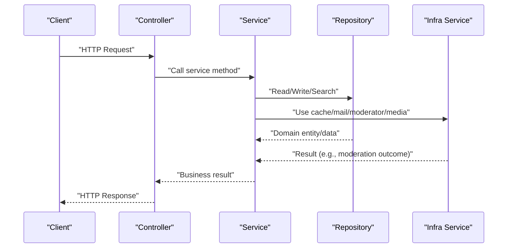
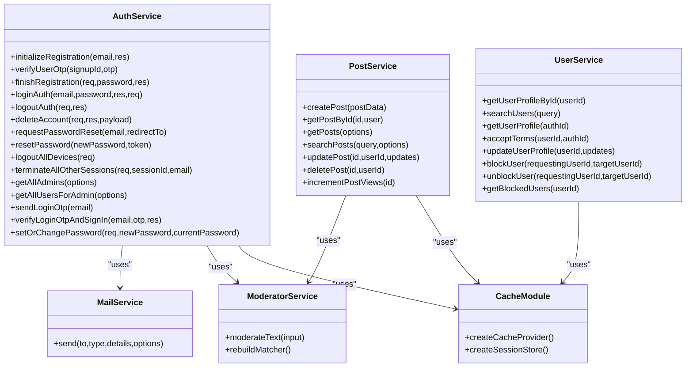
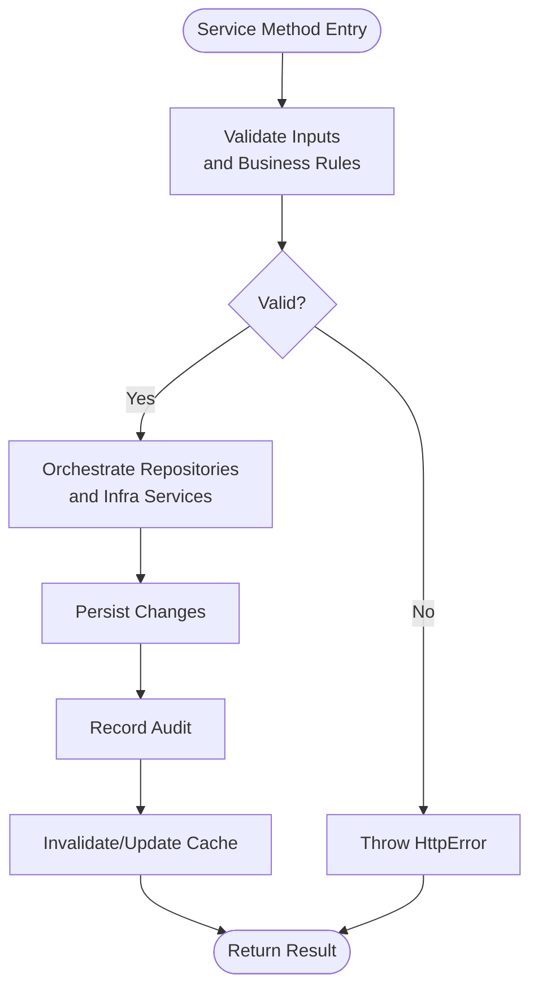
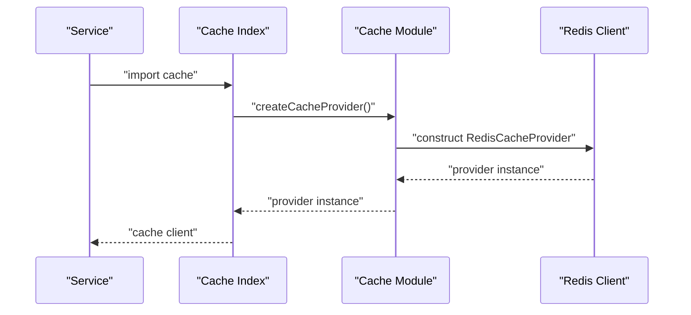
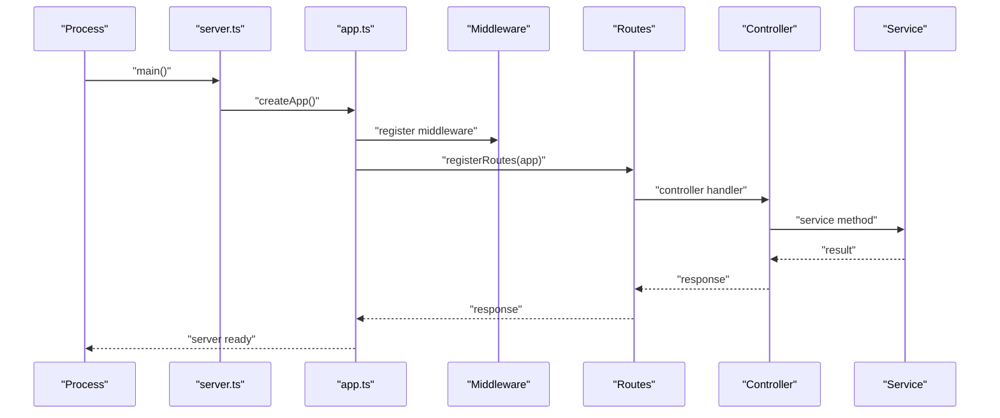
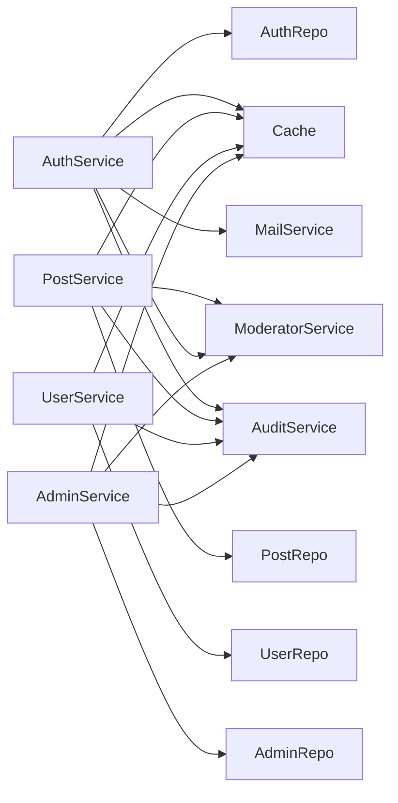

# Service Layer

<cite>
**Referenced Files in This Document**
- [server.ts](file://server/src/server.ts)
- [app.ts](file://server/src/app.ts)
- [auth.service.ts](file://server/src/modules/auth/auth.service.ts)
- [post.service.ts](file://server/src/modules/post/post.service.ts)
- [user.service.ts](file://server/src/modules/user/user.service.ts)
- [moderator.service.ts](file://server/src/infra/services/moderator/moderator.service.ts)
- [mail.service.ts](file://server/src/infra/services/mail/core/mail.service.ts)
- [cache.module.ts](file://server/src/infra/services/cache/cache.module.ts)
- [index.ts (cache)](file://server/src/infra/services/cache/index.ts)
- [cloudinary.service.ts](file://server/src/infra/services/media/cloudinary.service.ts)
- [audit.service.ts](file://server/src/modules/audit/audit.service.ts)
- [audit-context.ts](file://server/src/modules/audit/audit-context.ts)
- [block.guard.ts](file://server/src/modules/user/block.guard.ts)
- [auth.repo.ts](file://server/src/modules/auth/auth.repo.ts)
- [user.repo.ts](file://server/src/modules/user/user.repo.ts)
- [post.repo.ts](file://server/src/modules/post/post.repo.ts)
- [college.repo.ts](file://server/src/modules/college/college.repo.ts)
- [admin.service.ts](file://server/src/modules/admin/admin.service.ts)
- [admin.repo.ts](file://server/src/modules/admin/admin.repo.ts)
- [admin.route.ts](file://server/src/modules/admin/admin.route.ts)
- [admin.controller.ts](file://server/src/modules/admin/admin.controller.ts)
- [health.routes.ts](file://server/src/routes/health.routes.ts)
- [index.ts (routes)](file://server/src/routes/index.ts)
</cite>

## Table of Contents
1. [Introduction](#introduction)
2. [Project Structure](#project-structure)
3. [Core Components](#core-components)
4. [Architecture Overview](#architecture-overview)
5. [Detailed Component Analysis](#detailed-component-analysis)
6. [Dependency Analysis](#dependency-analysis)
7. [Performance Considerations](#performance-considerations)
8. [Troubleshooting Guide](#troubleshooting-guide)
9. [Conclusion](#conclusion)
10. [Appendices](#appendices)

## Introduction
This document explains the service layer architecture used in the backend server module. It covers the service pattern implementation, business logic encapsulation, dependency injection approach, service lifecycle, transaction management, error handling, and the relationship between services and repositories. It also documents how business rules are enforced, provides practical examples of service method implementations, validation logic, and cross-service interactions, and outlines testing strategies and performance optimization techniques.

## Project Structure
The service layer is organized per-domain feature under modules, with each feature exposing a service singleton that orchestrates repositories, infrastructure services, and cross-cutting concerns. Infrastructure services (e.g., cache, mail, media, moderator) are injected via constructor-based DI or factory functions. The server bootstraps the application and wires routes to controllers, which delegate to services.

```mermaid
graph TB
subgraph "Server Boot"
Srv["server.ts"]
App["app.ts"]
Routes["routes/index.ts"]
Health["routes/health.routes.ts"]
end
subgraph "Modules (Services)"
AuthSvc["modules/auth/auth.service.ts"]
PostSvc["modules/post/post.service.ts"]
UserSvc["modules/user/user.service.ts"]
AuditSvc["modules/audit/audit.service.ts"]
AdminSvc["modules/admin/admin.service.ts"]
end
subgraph "Repositories"
AuthRepo["modules/auth/auth.repo.ts"]
UserRepo["modules/user/user.repo.ts"]
PostRepo["modules/post/post.repo.ts"]
AdminRepo["modules/admin/admin.repo.ts"]
end
subgraph "Infra Services"
CacheMod["infra/services/cache/cache.module.ts"]
CacheIdx["infra/services/cache/index.ts"]
MailSvc["infra/services/mail/core/mail.service.ts"]
ModSvc["infra/services/moderator/moderator.service.ts"]
CloudSvc["infra/services/media/cloudinary.service.ts"]
end
Srv --> App
App --> Routes
Routes --> Health
AuthSvc --> AuthRepo
PostSvc --> PostRepo
UserSvc --> UserRepo
AdminSvc --> AdminRepo
AuthSvc --> CacheIdx
PostSvc --> CacheIdx
UserSvc --> CacheIdx
AdminSvc --> CacheIdx
AuthSvc --> MailSvc
PostSvc --> ModSvc
AuthSvc --> ModSvc
AdminSvc --> ModSvc
AuthSvc --> CloudSvc
PostSvc --> CloudSvc
AuthSvc --> AuditSvc
PostSvc --> AuditSvc
UserSvc --> AuditSvc
AdminSvc --> AuditSvc
```

**Diagram sources**
- [server.ts](file://server/src/server.ts#L1-L23)
- [app.ts](file://server/src/app.ts#L1-L33)
- [index.ts (routes)](file://server/src/routes/index.ts)
- [health.routes.ts](file://server/src/routes/health.routes.ts)
- [auth.service.ts](file://server/src/modules/auth/auth.service.ts#L1-L921)
- [post.service.ts](file://server/src/modules/post/post.service.ts#L1-L451)
- [user.service.ts](file://server/src/modules/user/user.service.ts#L1-L137)
- [audit.service.ts](file://server/src/modules/audit/audit.service.ts)
- [admin.service.ts](file://server/src/modules/admin/admin.service.ts)
- [auth.repo.ts](file://server/src/modules/auth/auth.repo.ts)
- [user.repo.ts](file://server/src/modules/user/user.repo.ts)
- [post.repo.ts](file://server/src/modules/post/post.repo.ts)
- [admin.repo.ts](file://server/src/modules/admin/admin.repo.ts)
- [cache.module.ts](file://server/src/infra/services/cache/cache.module.ts#L1-L33)
- [index.ts (cache)](file://server/src/infra/services/cache/index.ts#L1-L7)
- [mail.service.ts](file://server/src/infra/services/mail/core/mail.service.ts#L1-L101)
- [moderator.service.ts](file://server/src/infra/services/moderator/moderator.service.ts#L1-L642)
- [cloudinary.service.ts](file://server/src/infra/services/media/cloudinary.service.ts#L1-L76)

**Section sources**
- [server.ts](file://server/src/server.ts#L1-L23)
- [app.ts](file://server/src/app.ts#L1-L33)
- [index.ts (routes)](file://server/src/routes/index.ts)
- [health.routes.ts](file://server/src/routes/health.routes.ts)

## Core Components
- Service singletons: Each domain exposes a default-exported singleton service instance that encapsulates business logic and coordinates repositories and infrastructure services.
- Repositories: Thin data access layers per domain, exposing Read/CachedRead/Write/Search variants to decouple services from raw database queries.
- Infrastructure services: Injected via constructor-based DI or factory functions (cache, mail, media, moderator).
- Cross-cutting concerns: Logging, auditing, caching, and error handling are consistently applied across services.

Examples of service method responsibilities:
- Authentication service: Registration flow, OTP verification, login/logout, password reset/change, cleanup orphaned accounts, admin listing.
- Post service: Creation, retrieval, updates, deletions, moderation checks, view increments, and search.
- User service: Profile retrieval, user search, terms acceptance, profile updates, blocking/unblocking users.
- Moderator service: Dynamic banned-word matching and validator scoring integrated into moderation pipeline.
- Cache service: Factory-driven provider selection (memory, redis, multi-tier) with unified interface.

**Section sources**
- [auth.service.ts](file://server/src/modules/auth/auth.service.ts#L32-L921)
- [post.service.ts](file://server/src/modules/post/post.service.ts#L12-L451)
- [user.service.ts](file://server/src/modules/user/user.service.ts#L9-L137)
- [moderator.service.ts](file://server/src/infra/services/moderator/moderator.service.ts#L420-L642)
- [cache.module.ts](file://server/src/infra/services/cache/cache.module.ts#L9-L33)
- [index.ts (cache)](file://server/src/infra/services/cache/index.ts#L1-L7)

## Architecture Overview
The service layer follows a layered architecture:
- Controllers receive requests and delegate to services.
- Services enforce business rules, orchestrate repositories, and integrate infrastructure services.
- Repositories abstract persistence and caching strategies.
- Infrastructure services provide cross-cutting capabilities (cache, mail, media, moderation).

**Diagram sources**
- [auth.service.ts](file://server/src/modules/auth/auth.service.ts#L49-L251)
- [post.service.ts](file://server/src/modules/post/post.service.ts#L40-L94)
- [user.service.ts](file://server/src/modules/user/user.service.ts#L10-L89)
- [moderator.service.ts](file://server/src/infra/services/moderator/moderator.service.ts#L583-L636)
- [cache.module.ts](file://server/src/infra/services/cache/cache.module.ts#L9-L33)
- [mail.service.ts](file://server/src/infra/services/mail/core/mail.service.ts#L30-L99)

## Detailed Component Analysis

### Service Pattern Implementation
- Singleton services: Each domain exports a default instance of a class containing business methods. This ensures a single point of control and easy mocking in tests.
- Constructor-based DI: Infrastructure services like mail are constructed with providers and engines, enabling pluggable transport and templating.
- Factory-based DI: Cache provider is created via a factory that selects memory, redis, or multi-tier based on environment configuration.

**Diagram sources**
- [auth.service.ts](file://server/src/modules/auth/auth.service.ts#L32-L921)
- [post.service.ts](file://server/src/modules/post/post.service.ts#L12-L451)
- [user.service.ts](file://server/src/modules/user/user.service.ts#L9-L137)
- [moderator.service.ts](file://server/src/infra/services/moderator/moderator.service.ts#L420-L642)
- [mail.service.ts](file://server/src/infra/services/mail/core/mail.service.ts#L15-L101)
- [cache.module.ts](file://server/src/infra/services/cache/cache.module.ts#L9-L33)

**Section sources**
- [auth.service.ts](file://server/src/modules/auth/auth.service.ts#L32-L921)
- [post.service.ts](file://server/src/modules/post/post.service.ts#L12-L451)
- [user.service.ts](file://server/src/modules/user/user.service.ts#L9-L137)
- [moderator.service.ts](file://server/src/infra/services/moderator/moderator.service.ts#L420-L642)
- [mail.service.ts](file://server/src/infra/services/mail/core/mail.service.ts#L15-L101)
- [cache.module.ts](file://server/src/infra/services/cache/cache.module.ts#L9-L33)

### Business Logic Encapsulation and Validation
- Authentication service enforces student email validation, disposable email filtering, OTP limits, and registration/session cleanup.
- Post service validates moderation policies before create/update and applies privacy rules and block guards.
- User service enforces self-block prevention and updates cache keys upon changes.
- Moderator service integrates dynamic banned-word matching and validator scoring with fail-closed behavior.

**Diagram sources**
- [auth.service.ts](file://server/src/modules/auth/auth.service.ts#L626-L654)
- [post.service.ts](file://server/src/modules/post/post.service.ts#L13-L38)
- [post.service.ts](file://server/src/modules/post/post.service.ts#L96-L143)
- [user.service.ts](file://server/src/modules/user/user.service.ts#L91-L125)

**Section sources**
- [auth.service.ts](file://server/src/modules/auth/auth.service.ts#L626-L654)
- [post.service.ts](file://server/src/modules/post/post.service.ts#L13-L38)
- [post.service.ts](file://server/src/modules/post/post.service.ts#L96-L143)
- [user.service.ts](file://server/src/modules/user/user.service.ts#L91-L125)

### Dependency Injection Approach
- Constructor-based DI: MailService accepts provider manager, template engine, and default sender.
- Factory-based DI: Cache provider selection based on environment variables; redis/multi-tier/memory drivers supported.
- Module-level exports: cache and redis instances are exported from a central index for consumption across services.

**Diagram sources**
- [index.ts (cache)](file://server/src/infra/services/cache/index.ts#L1-L7)
- [cache.module.ts](file://server/src/infra/services/cache/cache.module.ts#L9-L33)

**Section sources**
- [mail.service.ts](file://server/src/infra/services/mail/core/mail.service.ts#L15-L20)
- [index.ts (cache)](file://server/src/infra/services/cache/index.ts#L1-L7)
- [cache.module.ts](file://server/src/infra/services/cache/cache.module.ts#L9-L33)

### Service Lifecycle
- Bootstrap: server.ts creates the HTTP server and registers middleware and routes.
- Middleware: request logging, security, and error handlers are registered early.
- Routing: routes are registered to controllers; controllers call services.
- Shutdown: server listens on configured host/port and logs startup errors.

**Diagram sources**
- [server.ts](file://server/src/server.ts#L7-L17)
- [app.ts](file://server/src/app.ts#L10-L30)
- [index.ts (routes)](file://server/src/routes/index.ts)

**Section sources**
- [server.ts](file://server/src/server.ts#L1-L23)
- [app.ts](file://server/src/app.ts#L1-L33)

### Transaction Management
- The codebase does not expose explicit transaction APIs in services. Persistence operations are executed against repositories, which encapsulate database interactions. For multi-step operations requiring atomicity, services should coordinate repository calls and rely on database-level constraints or external transaction managers if introduced. Current services demonstrate robust error handling and audit recording around write operations.

[No sources needed since this section provides general guidance]

### Error Handling Within Services
- Centralized HTTP error types are thrown with structured metadata and codes for clients.
- Examples include forbidden, not found, unauthorized, bad request, and too many requests.
- Services wrap infrastructure calls (e.g., mail, moderation) and translate failures into appropriate HTTP errors.

**Section sources**
- [auth.service.ts](file://server/src/modules/auth/auth.service.ts#L42-L44)
- [post.service.ts](file://server/src/modules/post/post.service.ts#L102-L106)
- [post.service.ts](file://server/src/modules/post/post.service.ts#L258-L262)
- [user.service.ts](file://server/src/modules/user/user.service.ts#L69-L71)

### Relationship Between Services and Repositories
- Services depend on repositories for data access, ensuring separation of concerns.
- Repositories expose multiple read/write/search variants (e.g., CachedRead, Write, Search) to support caching and specialized queries.
- Cross-service interactions occur via shared repositories (e.g., user and auth repositories) or shared infrastructure services (e.g., cache, moderator).

**Section sources**
- [auth.service.ts](file://server/src/modules/auth/auth.service.ts#L25-L29)
- [post.service.ts](file://server/src/modules/post/post.service.ts#L8-L10)
- [user.service.ts](file://server/src/modules/user/user.service.ts#L4-L7)

### Practical Examples of Service Method Implementations
- Authentication initialization and OTP verification with caching and audit.
- Post creation with moderation checks and cache invalidation.
- User profile updates with cache invalidation and audit.
- Admin actions leveraging moderator service and audit.

**Section sources**
- [auth.service.ts](file://server/src/modules/auth/auth.service.ts#L49-L104)
- [auth.service.ts](file://server/src/modules/auth/auth.service.ts#L106-L148)
- [post.service.ts](file://server/src/modules/post/post.service.ts#L40-L94)
- [user.service.ts](file://server/src/modules/user/user.service.ts#L64-L89)
- [admin.service.ts](file://server/src/modules/admin/admin.service.ts)

### Cross-Service Interactions
- Post service depends on moderator service for content moderation and on cache for versioning.
- Auth service collaborates with user and college repositories, mail service for notifications, and audit service for audit trails.
- Admin service leverages moderator and audit services for moderation and audit actions.

**Section sources**
- [post.service.ts](file://server/src/modules/post/post.service.ts#L4-L6)
- [auth.service.ts](file://server/src/modules/auth/auth.service.ts#L18-L29)
- [admin.service.ts](file://server/src/modules/admin/admin.service.ts)

### Testing Strategies
- Mock repositories: Replace repository implementations with mocks to isolate service logic.
- Mock infrastructure services: Stub cache, mail, and moderator services to simulate outcomes.
- Test data builders: Create minimal domain objects for inputs and expected outputs.
- Assertion patterns: Verify repository calls, infrastructure calls, audit events, and error propagation.

[No sources needed since this section provides general guidance]

### Performance Optimization Techniques
- Caching: Use cache invalidation keys and version counters to avoid stale reads and reduce load.
- Moderation caching: Leverage built-in moderation cache and periodic revalidation.
- Multi-tier cache: Configure multi-tier cache for hot data and reduced latency.
- Asynchronous operations: Offload non-blocking tasks (e.g., notifications) to background workers.

**Section sources**
- [post.service.ts](file://server/src/modules/post/post.service.ts#L85-L86)
- [post.service.ts](file://server/src/modules/post/post.service.ts#L339-L340)
- [moderator.service.ts](file://server/src/infra/services/moderator/moderator.service.ts#L59-L63)
- [cache.module.ts](file://server/src/infra/services/cache/cache.module.ts#L17-L21)

## Dependency Analysis
The service layer exhibits low coupling and high cohesion:
- Services depend on repositories and infrastructure services via abstractions.
- Repositories depend on database clients and caching layers.
- Controllers depend on services only, maintaining clean boundaries.

**Diagram sources**
- [auth.service.ts](file://server/src/modules/auth/auth.service.ts#L18-L29)
- [post.service.ts](file://server/src/modules/post/post.service.ts#L4-L6)
- [user.service.ts](file://server/src/modules/user/user.service.ts#L4-L7)
- [admin.service.ts](file://server/src/modules/admin/admin.service.ts)
- [audit.service.ts](file://server/src/modules/audit/audit.service.ts)

**Section sources**
- [auth.service.ts](file://server/src/modules/auth/auth.service.ts#L18-L29)
- [post.service.ts](file://server/src/modules/post/post.service.ts#L4-L6)
- [user.service.ts](file://server/src/modules/user/user.service.ts#L4-L7)
- [admin.service.ts](file://server/src/modules/admin/admin.service.ts)

## Performance Considerations
- Prefer CachedRead variants for frequently accessed data to reduce database load.
- Use cache version keys to invalidate lists and items atomically.
- Batch moderation checks and leverage moderation cache to minimize external API calls.
- Avoid synchronous heavy computations inside request handlers; defer to background jobs when possible.

[No sources needed since this section provides general guidance]

## Troubleshooting Guide
Common issues and resolutions:
- Authentication failures: Validate email format, disposable domains, and OTP attempts; ensure cache entries are present and not expired.
- Post moderation violations: Inspect moderation results and adjust banned-word configurations or thresholds.
- Cache inconsistencies: Clear version keys and retry; verify cache driver configuration.
- Audit gaps: Confirm audit recording calls are invoked after successful writes.

**Section sources**
- [auth.service.ts](file://server/src/modules/auth/auth.service.ts#L626-L654)
- [post.service.ts](file://server/src/modules/post/post.service.ts#L13-L38)
- [audit.service.ts](file://server/src/modules/audit/audit.service.ts)

## Conclusion
The service layer cleanly separates business logic from data access and infrastructure concerns. It leverages constructor-based and factory-based DI, consistent error handling, and cross-cutting services for caching, moderation, and notifications. By adhering to repository abstractions and enforcing business rules at the service boundary, the system remains maintainable, testable, and scalable.

## Appendices
- Audit context and guards: Audit context and block guard utilities are used to enforce access controls and maintain audit trails across services.
- Admin module: Admin service coordinates administrative actions and integrates with moderator and audit services.

**Section sources**
- [audit-context.ts](file://server/src/modules/audit/audit-context.ts)
- [block.guard.ts](file://server/src/modules/user/block.guard.ts)
- [admin.service.ts](file://server/src/modules/admin/admin.service.ts)
- [admin.repo.ts](file://server/src/modules/admin/admin.repo.ts)
- [admin.route.ts](file://server/src/modules/admin/admin.route.ts)
- [admin.controller.ts](file://server/src/modules/admin/admin.controller.ts)