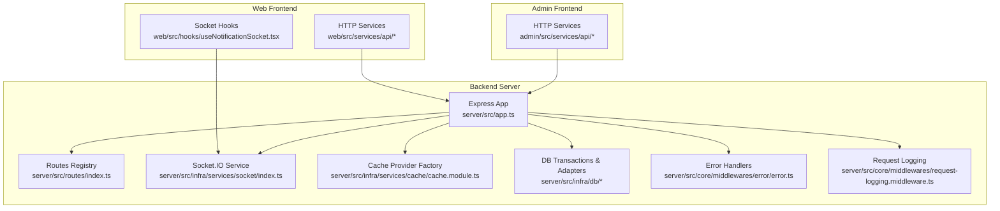
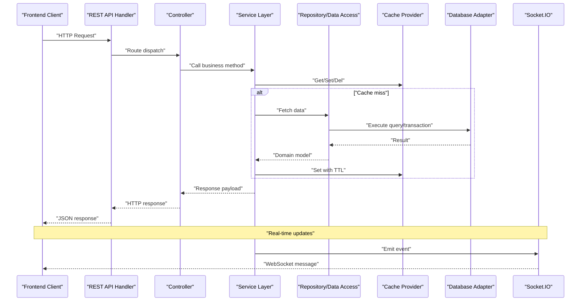
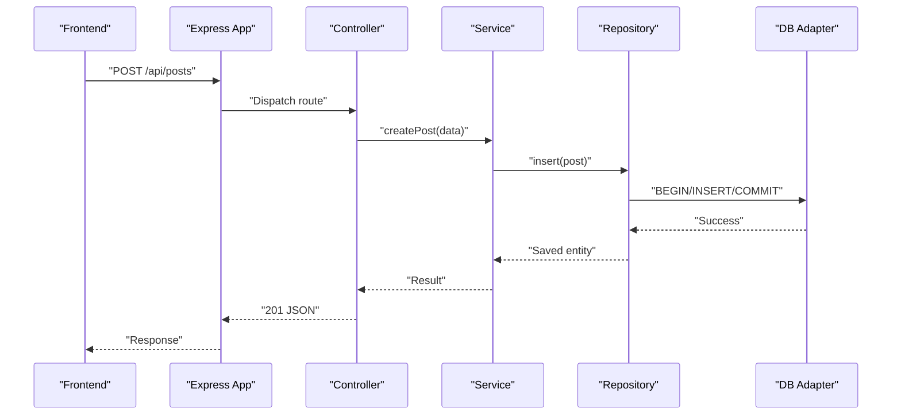
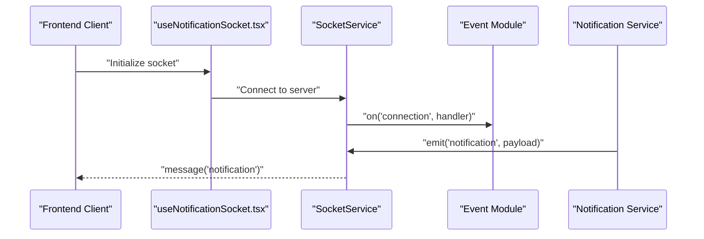
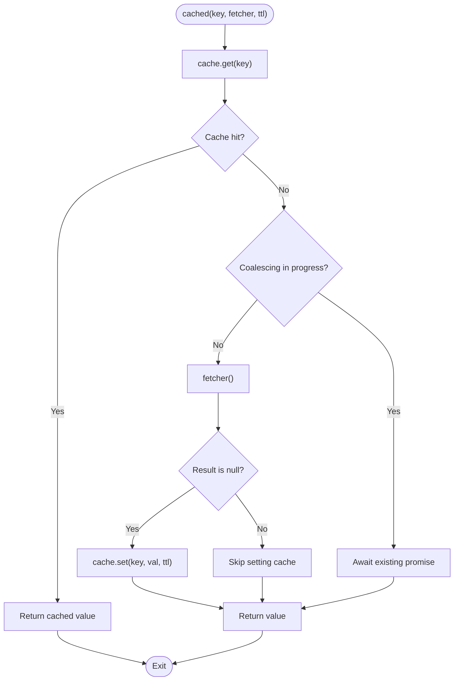
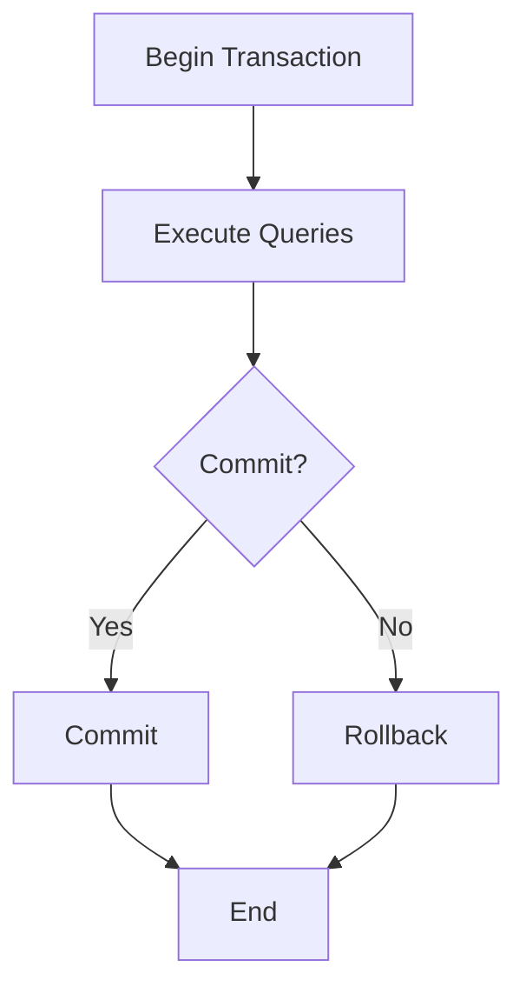
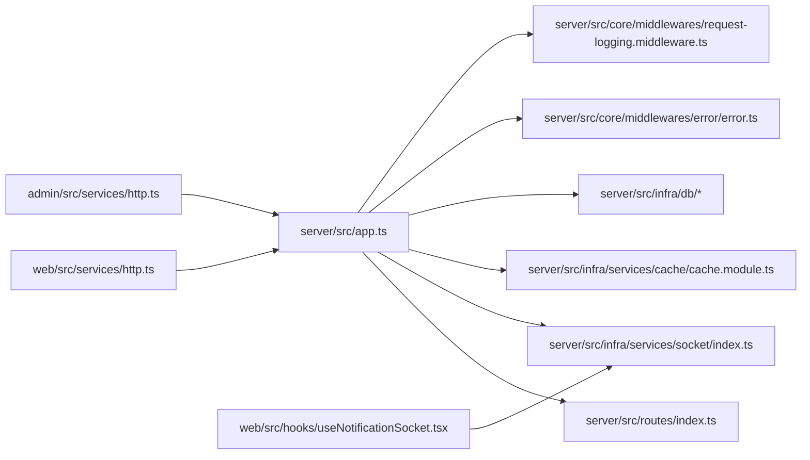

# Data Flow & Communication

<cite>
**Referenced Files in This Document**
- [server/src/app.ts](file://server/src/app.ts)
- [server/src/routes/index.ts](file://server/src/routes/index.ts)
- [server/src/infra/services/socket/index.ts](file://server/src/infra/services/socket/index.ts)
- [server/src/infra/services/socket/events/index.ts](file://server/src/infra/services/socket/events/index.ts)
- [server/src/infra/services/socket/types/SocketEvents.ts](file://server/src/infra/services/socket/types/SocketEvents.ts)
- [server/src/infra/services/cache/cache.interface.ts](file://server/src/infra/services/cache/cache.interface.ts)
- [server/src/infra/services/cache/cache.module.ts](file://server/src/infra/services/cache/cache.module.ts)
- [server/src/lib/cached.ts](file://server/src/lib/cached.ts)
- [web/src/socket/useSocket.ts](file://web/src/socket/useSocket.ts)
- [admin/src/socket/useSocket.ts](file://admin/src/socket/useSocket.ts)
- [web/src/services/http.ts](file://web/src/services/http.ts)
- [admin/src/services/http.ts](file://admin/src/services/http.ts)
- [web/src/services/api/post.ts](file://web/src/services/api/post.ts)
- [admin/src/services/api/moderation.ts](file://admin/src/services/api/moderation.ts)
- [web/src/hooks/useNotificationSocket.tsx](file://web/src/hooks/useNotificationSocket.tsx)
- [server/src/modules/notification/notification.service.ts](file://server/src/modules/notification/notification.service.ts)
- [server/src/modules/notification/notification.routes.ts](file://server/src/modules/notification/notification.routes.ts)
- [server/src/modules/post/post.controller.ts](file://server/src/modules/post/post.controller.ts)
- [server/src/modules/post/post.service.ts](file://server/src/modules/post/post.service.ts)
- [server/src/modules/post/post.repo.ts](file://server/src/modules/post/post.repo.ts)
- [server/src/modules/comment/comment.controller.ts](file://server/src/modules/comment/comment.controller.ts)
- [server/src/modules/comment/comment.service.ts](file://server/src/modules/comment/comment.service.ts)
- [server/src/modules/comment/comment.repo.ts](file://server/src/modules/comment/comment.repo.ts)
- [server/src/modules/vote/vote.controller.ts](file://server/src/modules/vote/vote.controller.ts)
- [server/src/modules/vote/vote.service.ts](file://server/src/modules/vote/vote.service.ts)
- [server/src/modules/vote/vote.repo.ts](file://server/src/modules/vote/vote.repo.ts)
- [server/src/modules/bookmark/bookmark.controller.ts](file://server/src/modules/bookmark/bookmark.controller.ts)
- [server/src/modules/bookmark/bookmark.service.ts](file://server/src/modules/bookmark/bookmark.service.ts)
- [server/src/modules/bookmark/bookmark.repo.ts](file://server/src/modules/bookmark/bookmark.repo.ts)
- [server/src/modules/audit/audit.service.ts](file://server/src/modules/audit/audit.service.ts)
- [server/src/modules/audit/audit.repo.ts](file://server/src/modules/audit/audit.repo.ts)
- [server/src/modules/audit/audit.controller.ts](file://server/src/modules/audit/audit.controller.ts)
- [server/src/core/middlewares/error/error.ts](file://server/src/core/middlewares/error/error.ts)
- [server/src/core/middlewares/request-logging.middleware.ts](file://server/src/core/middlewares/request-logging.middleware.ts)
- [server/src/core/middlewares/context.middleware.ts](file://server/src/core/middlewares/context.middleware.ts)
- [server/src/infra/db/transactions.ts](file://server/src/infra/db/transactions.ts)
- [server/src/infra/db/adapters/pg-pool.adapter.ts](file://server/src/infra/db/adapters/pg-pool.adapter.ts)
- [server/src/infra/db/adapters/pg-transaction.adapter.ts](file://server/src/infra/db/adapters/pg-transaction.adapter.ts)
- [server/src/infra/db/types.ts](file://server/src/infra/db/types.ts)
- [server/src/config/env.ts](file://server/src/config/env.ts)
- [server/src/config/security.ts](file://server/src/config/security.ts)
- [server/src/config/cors.ts](file://server/src/config/cors.ts)
- [server/src/shared/constants/db.ts](file://server/src/shared/constants/db.ts)
</cite>

## Table of Contents
1. [Introduction](#introduction)
2. [Project Structure](#project-structure)
3. [Core Components](#core-components)
4. [Architecture Overview](#architecture-overview)
5. [Detailed Component Analysis](#detailed-component-analysis)
6. [Dependency Analysis](#dependency-analysis)
7. [Performance Considerations](#performance-considerations)
8. [Troubleshooting Guide](#troubleshooting-guide)
9. [Conclusion](#conclusion)

## Introduction
This document explains the data flow and communication patterns in the Flick system. It covers:
- Request-response cycles between the web and admin frontends and the backend API
- Real-time communication via Socket.IO and event-driven updates
- Asynchronous processing patterns and caching strategies (local and Redis-backed)
- Database transaction handling and error propagation
- API communication protocols, WebSocket message formats, and real-time update mechanisms
- Error handling strategies, retry mechanisms, and performance optimization techniques

## Project Structure
The system comprises:
- Backend server (Express + Socket.IO) exposing REST APIs and real-time channels
- Web and Admin Next.js apps consuming REST APIs and subscribing to Socket.IO events
- Shared caching layer supporting memory, Redis, and multi-tier configurations
- Database abstraction with transaction support and typed repositories/services
- Centralized middleware for logging, security, and error handling

**Diagram sources**
- [server/src/app.ts](file://server/src/app.ts#L10-L30)
- [server/src/routes/index.ts](file://server/src/routes/index.ts)
- [server/src/infra/services/socket/index.ts](file://server/src/infra/services/socket/index.ts#L10-L24)
- [server/src/infra/services/cache/cache.module.ts](file://server/src/infra/services/cache/cache.module.ts#L9-L28)
- [server/src/core/middlewares/error/error.ts](file://server/src/core/middlewares/error/error.ts)
- [server/src/core/middlewares/request-logging.middleware.ts](file://server/src/core/middlewares/request-logging.middleware.ts)

**Section sources**
- [server/src/app.ts](file://server/src/app.ts#L1-L33)
- [server/src/config/security.ts](file://server/src/config/security.ts)
- [server/src/config/cors.ts](file://server/src/config/cors.ts)

## Core Components
- Express server initialization and middleware pipeline
- Route registration and centralized error handling
- Socket.IO service initialization and event module attachment
- Cache provider factory supporting memory, Redis, and multi-tier
- HTTP client utilities for frontend services
- Notification and real-time update mechanisms

Key implementation references:
- Server bootstrap and middleware chain: [server/src/app.ts](file://server/src/app.ts#L10-L30)
- Socket.IO service lifecycle and CORS/transports: [server/src/infra/services/socket/index.ts](file://server/src/infra/services/socket/index.ts#L10-L24)
- Cache provider selection and multi-tier composition: [server/src/infra/services/cache/cache.module.ts](file://server/src/infra/services/cache/cache.module.ts#L9-L28)
- Cache coalescing and TTL logic: [server/src/lib/cached.ts](file://server/src/lib/cached.ts#L7-L40)
- Frontend HTTP clients: [web/src/services/http.ts](file://web/src/services/http.ts), [admin/src/services/http.ts](file://admin/src/services/http.ts)

**Section sources**
- [server/src/app.ts](file://server/src/app.ts#L10-L30)
- [server/src/infra/services/socket/index.ts](file://server/src/infra/services/socket/index.ts#L10-L24)
- [server/src/infra/services/cache/cache.module.ts](file://server/src/infra/services/cache/cache.module.ts#L9-L28)
- [server/src/lib/cached.ts](file://server/src/lib/cached.ts#L7-L40)
- [web/src/services/http.ts](file://web/src/services/http.ts)
- [admin/src/services/http.ts](file://admin/src/services/http.ts)

## Architecture Overview
High-level data flow:
- Web/Admin frontends send HTTP requests to backend routes
- Controllers delegate to services, which may use repositories, caches, and database transactions
- Real-time updates are broadcast via Socket.IO to subscribed clients
- Errors are normalized and logged centrally

**Diagram sources**
- [server/src/app.ts](file://server/src/app.ts#L10-L30)
- [server/src/infra/services/socket/index.ts](file://server/src/infra/services/socket/index.ts#L26-L32)
- [server/src/lib/cached.ts](file://server/src/lib/cached.ts#L7-L40)
- [server/src/infra/db/transactions.ts](file://server/src/infra/db/transactions.ts)
- [server/src/infra/db/adapters/pg-pool.adapter.ts](file://server/src/infra/db/adapters/pg-pool.adapter.ts)
- [server/src/infra/db/adapters/pg-transaction.adapter.ts](file://server/src/infra/db/adapters/pg-transaction.adapter.ts)

## Detailed Component Analysis

### REST API Request-Response Cycle
- The Express app initializes middleware, registers routes, and applies error handlers.
- Controllers orchestrate service calls and return structured HTTP responses.
- Repositories encapsulate database queries and leverage transactions where needed.
- Services coordinate domain logic, caching, and optional asynchronous tasks.

**Diagram sources**
- [server/src/app.ts](file://server/src/app.ts#L20-L28)
- [server/src/modules/post/post.controller.ts](file://server/src/modules/post/post.controller.ts)
- [server/src/modules/post/post.service.ts](file://server/src/modules/post/post.service.ts)
- [server/src/modules/post/post.repo.ts](file://server/src/modules/post/post.repo.ts)
- [server/src/infra/db/transactions.ts](file://server/src/infra/db/transactions.ts)
- [server/src/infra/db/adapters/pg-pool.adapter.ts](file://server/src/infra/db/adapters/pg-pool.adapter.ts)

**Section sources**
- [server/src/app.ts](file://server/src/app.ts#L10-L30)
- [server/src/modules/post/post.controller.ts](file://server/src/modules/post/post.controller.ts)
- [server/src/modules/post/post.service.ts](file://server/src/modules/post/post.service.ts)
- [server/src/modules/post/post.repo.ts](file://server/src/modules/post/post.repo.ts)

### Real-Time Communication via Socket.IO
- The Socket.IO service initializes with CORS and transport settings, then attaches event modules for chat, user, and connection events.
- Event modules receive the Socket.IO server instance and bind per-connection handlers.
- Frontends consume a React hook to access the Socket.IO context and subscribe to events.

**Diagram sources**
- [server/src/infra/services/socket/index.ts](file://server/src/infra/services/socket/index.ts#L10-L24)
- [server/src/infra/services/socket/events/index.ts](file://server/src/infra/services/socket/events/index.ts#L1-L9)
- [server/src/infra/services/socket/types/SocketEvents.ts](file://server/src/infra/services/socket/types/SocketEvents.ts#L1-L4)
- [web/src/hooks/useNotificationSocket.tsx](file://web/src/hooks/useNotificationSocket.tsx)
- [server/src/modules/notification/notification.service.ts](file://server/src/modules/notification/notification.service.ts)

**Section sources**
- [server/src/infra/services/socket/index.ts](file://server/src/infra/services/socket/index.ts#L10-L24)
- [server/src/infra/services/socket/events/index.ts](file://server/src/infra/services/socket/events/index.ts#L1-L9)
- [server/src/infra/services/socket/types/SocketEvents.ts](file://server/src/infra/services/socket/types/SocketEvents.ts#L1-L4)
- [web/src/hooks/useNotificationSocket.tsx](file://web/src/hooks/useNotificationSocket.tsx)
- [server/src/modules/notification/notification.service.ts](file://server/src/modules/notification/notification.service.ts)

### Caching Strategy (Local and Redis)
- The cache provider is selected at runtime via environment configuration, supporting memory, Redis, or a multi-tier combination.
- A coalescing mechanism prevents thundering herds during cache misses.
- TTL and L1/L2 cache invalidation patterns are integrated across modules.

**Diagram sources**
- [server/src/lib/cached.ts](file://server/src/lib/cached.ts#L7-L40)
- [server/src/infra/services/cache/cache.module.ts](file://server/src/infra/services/cache/cache.module.ts#L9-L28)
- [server/src/infra/services/cache/cache.interface.ts](file://server/src/infra/services/cache/cache.interface.ts#L1-L8)

**Section sources**
- [server/src/lib/cached.ts](file://server/src/lib/cached.ts#L7-L40)
- [server/src/infra/services/cache/cache.module.ts](file://server/src/infra/services/cache/cache.module.ts#L9-L28)
- [server/src/infra/services/cache/cache.interface.ts](file://server/src/infra/services/cache/cache.interface.ts#L1-L8)

### Database Transaction Handling
- Transactions are encapsulated with a dedicated adapter and pool-based connection management.
- Services can opt into transactions for write-heavy or consistency-critical flows.
- Typed repository abstractions ensure consistent query patterns.

**Diagram sources**
- [server/src/infra/db/transactions.ts](file://server/src/infra/db/transactions.ts)
- [server/src/infra/db/adapters/pg-transaction.adapter.ts](file://server/src/infra/db/adapters/pg-transaction.adapter.ts)
- [server/src/infra/db/adapters/pg-pool.adapter.ts](file://server/src/infra/db/adapters/pg-pool.adapter.ts)
- [server/src/infra/db/types.ts](file://server/src/infra/db/types.ts)

**Section sources**
- [server/src/infra/db/transactions.ts](file://server/src/infra/db/transactions.ts)
- [server/src/infra/db/adapters/pg-transaction.adapter.ts](file://server/src/infra/db/adapters/pg-transaction.adapter.ts)
- [server/src/infra/db/adapters/pg-pool.adapter.ts](file://server/src/infra/db/adapters/pg-pool.adapter.ts)
- [server/src/infra/db/types.ts](file://server/src/infra/db/types.ts)

### API Communication Protocols and Frontend Services
- Frontends define typed HTTP clients and API modules for each domain (posts, comments, votes, bookmarks, notifications, moderation).
- These modules centralize endpoint definitions, request/response shapes, and error handling.

Representative references:
- Web HTTP client: [web/src/services/http.ts](file://web/src/services/http.ts)
- Admin HTTP client: [admin/src/services/http.ts](file://admin/src/services/http.ts)
- Post API module: [web/src/services/api/post.ts](file://web/src/services/api/post.ts)
- Moderation API module: [admin/src/services/api/moderation.ts](file://admin/src/services/api/moderation.ts)

**Section sources**
- [web/src/services/http.ts](file://web/src/services/http.ts)
- [admin/src/services/http.ts](file://admin/src/services/http.ts)
- [web/src/services/api/post.ts](file://web/src/services/api/post.ts)
- [admin/src/services/api/moderation.ts](file://admin/src/services/api/moderation.ts)

### Real-Time Update Mechanisms
- Notification service emits real-time events to connected clients.
- Frontend hooks establish connections and listen for notification events to update UI reactively.

References:
- Notification service emit: [server/src/modules/notification/notification.service.ts](file://server/src/modules/notification/notification.service.ts)
- Notification routes: [server/src/modules/notification/notification.routes.ts](file://server/src/modules/notification/notification.routes.ts)
- Frontend socket hook: [web/src/hooks/useNotificationSocket.tsx](file://web/src/hooks/useNotificationSocket.tsx)

**Section sources**
- [server/src/modules/notification/notification.service.ts](file://server/src/modules/notification/notification.service.ts)
- [server/src/modules/notification/notification.routes.ts](file://server/src/modules/notification/notification.routes.ts)
- [web/src/hooks/useNotificationSocket.tsx](file://web/src/hooks/useNotificationSocket.tsx)

### Asynchronous Processing Patterns
- Coalescing cache fetches prevent redundant work during cache misses.
- Socket.IO enables asynchronous, event-driven updates without polling.
- Middleware-based request logging and error normalization support observability and resilience.

References:
- Coalescing cache: [server/src/lib/cached.ts](file://server/src/lib/cached.ts#L7-L40)
- Socket.IO service: [server/src/infra/services/socket/index.ts](file://server/src/infra/services/socket/index.ts#L10-L24)
- Request logging: [server/src/core/middlewares/request-logging.middleware.ts](file://server/src/core/middlewares/request-logging.middleware.ts)
- Error handlers: [server/src/core/middlewares/error/error.ts](file://server/src/core/middlewares/error/error.ts)

**Section sources**
- [server/src/lib/cached.ts](file://server/src/lib/cached.ts#L7-L40)
- [server/src/infra/services/socket/index.ts](file://server/src/infra/services/socket/index.ts#L10-L24)
- [server/src/core/middlewares/request-logging.middleware.ts](file://server/src/core/middlewares/request-logging.middleware.ts)
- [server/src/core/middlewares/error/error.ts](file://server/src/core/middlewares/error/error.ts)

## Dependency Analysis
The backend composes several subsystems with clear boundaries:
- Application layer depends on routing, middleware, and Socket.IO
- Services depend on repositories, cache, and database adapters
- Frontends depend on HTTP clients and Socket.IO hooks

**Diagram sources**
- [server/src/app.ts](file://server/src/app.ts#L10-L30)
- [server/src/routes/index.ts](file://server/src/routes/index.ts)
- [server/src/infra/services/socket/index.ts](file://server/src/infra/services/socket/index.ts#L10-L24)
- [server/src/infra/services/cache/cache.module.ts](file://server/src/infra/services/cache/cache.module.ts#L9-L28)
- [server/src/core/middlewares/error/error.ts](file://server/src/core/middlewares/error/error.ts)
- [server/src/core/middlewares/request-logging.middleware.ts](file://server/src/core/middlewares/request-logging.middleware.ts)
- [web/src/services/http.ts](file://web/src/services/http.ts)
- [admin/src/services/http.ts](file://admin/src/services/http.ts)
- [web/src/hooks/useNotificationSocket.tsx](file://web/src/hooks/useNotificationSocket.tsx)

**Section sources**
- [server/src/app.ts](file://server/src/app.ts#L10-L30)
- [server/src/infra/services/socket/index.ts](file://server/src/infra/services/socket/index.ts#L10-L24)
- [server/src/infra/services/cache/cache.module.ts](file://server/src/infra/services/cache/cache.module.ts#L9-L28)
- [server/src/core/middlewares/error/error.ts](file://server/src/core/middlewares/error/error.ts)
- [server/src/core/middlewares/request-logging.middleware.ts](file://server/src/core/middlewares/request-logging.middleware.ts)
- [web/src/services/http.ts](file://web/src/services/http.ts)
- [admin/src/services/http.ts](file://admin/src/services/http.ts)
- [web/src/hooks/useNotificationSocket.tsx](file://web/src/hooks/useNotificationSocket.tsx)

## Performance Considerations
- Prefer multi-tier caching for hot reads; tune TTL and L1/L2 sizes per workload
- Use coalescing to avoid stampedes on cache misses
- Limit request payload sizes and enable compression at the middleware level
- Batch Socket.IO emits for high-frequency updates; throttle event frequency
- Use database transactions judiciously; keep them short-lived
- Centralize logging and error handling to minimize overhead and improve observability

[No sources needed since this section provides general guidance]

## Troubleshooting Guide
Common issues and remedies:
- Socket.IO connection failures: verify CORS origins and transports; confirm event modules are attached
- Cache provider misconfiguration: check environment variables for cache driver and TTL
- HTTP errors: inspect centralized error handlers and request logs
- Transaction anomalies: ensure proper rollback on failure and avoid long-running transactions

References:
- Socket.IO initialization and CORS: [server/src/infra/services/socket/index.ts](file://server/src/infra/services/socket/index.ts#L10-L24)
- Cache provider selection: [server/src/infra/services/cache/cache.module.ts](file://server/src/infra/services/cache/cache.module.ts#L9-L28)
- Error handlers: [server/src/core/middlewares/error/error.ts](file://server/src/core/middlewares/error/error.ts)
- Request logging: [server/src/core/middlewares/request-logging.middleware.ts](file://server/src/core/middlewares/request-logging.middleware.ts)

**Section sources**
- [server/src/infra/services/socket/index.ts](file://server/src/infra/services/socket/index.ts#L10-L24)
- [server/src/infra/services/cache/cache.module.ts](file://server/src/infra/services/cache/cache.module.ts#L9-L28)
- [server/src/core/middlewares/error/error.ts](file://server/src/core/middlewares/error/error.ts)
- [server/src/core/middlewares/request-logging.middleware.ts](file://server/src/core/middlewares/request-logging.middleware.ts)

## Conclusion
The Flick system integrates REST APIs, real-time messaging, and robust caching to deliver responsive and scalable data flows. By leveraging Socket.IO for live updates, a configurable cache layer for performance, and transactional database operations for consistency, the system supports both synchronous request-response and asynchronous event-driven patterns. Centralized middleware ensures consistent logging and error handling, while modular services and repositories promote maintainability and testability.